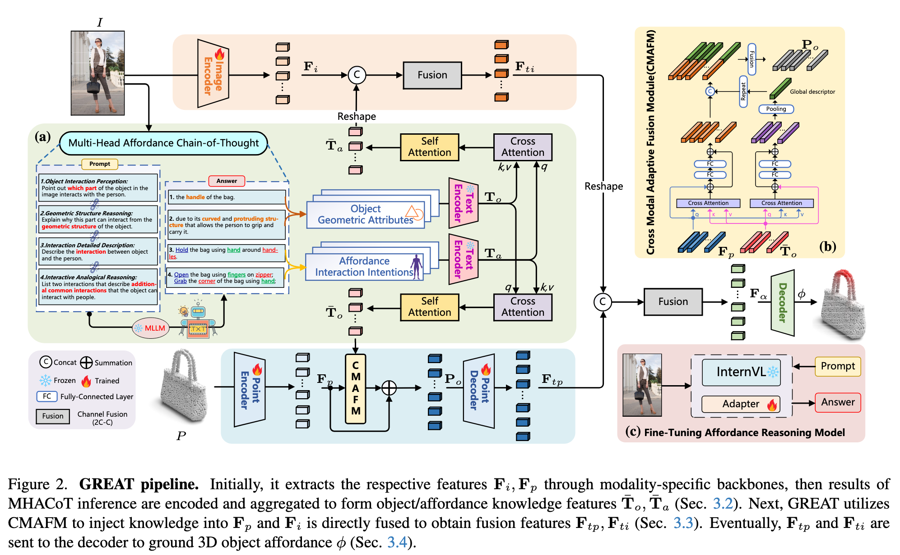

`3D Affordance Grounding 方向复盘` 

<!-- more -->

## 点云 + 文本

### [Affogato (Arxiv 2025.06)](https://arxiv.org/abs/2506.12009)

特点:

1. AFFOrdance Grounding All aT Once

2. a large-scale dataset for 3D and 2D affordance grounding

3. minimalistic architecture

损失函数:

1. Focal Loss to handle class imbalance

2. Dice Loss to improve region-level alignment.

现状:

1. wait for code release

2. dataset available

## 点云 + 图像

## 点云 + 文本 + 图像

### [GREAT (CVPR 2025)](https://arxiv.org/abs/2411.19626)

特点:

1. grounding 3D object affordance in an Open-Vocabulary fashion

2. Multi-Head Affordance Chain-of-Thought

> Data preparation stage: 
> 
>  1. Use prompts to generate descriptions of the object interaction area, the morphology(形态学) of the interaction area, the interaction behavior, and other common interaction behaviors of the object.
>
>  2. Geometric structure knowledge = Answers to Prompt 1 + Prompt 2 = Interaction parts + Inference of geometric properties of these parts
> 
>  3. Interaction knowledge = Answers to Prompt 3 + Prompt 4 = Current interaction + Analogous(类似的)/supplementary(补充) interaction methods

3. PIADv2 dataset 

> 24 affordance ,  43 object categories, 15K interaction images , 38K 3D objects with annotations.

损失函数:

1. Focal Loss to handle class imbalance

2. Dice Loss to improve region-level alignment.

现状:

1. code available

2. dataset available

## 3DGS

### [GEAL (CVPR 2025)](https://arxiv.org/abs/2412.09511)

