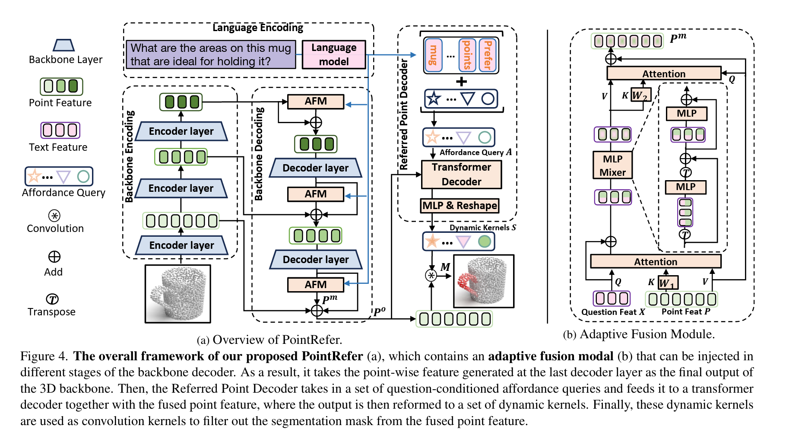
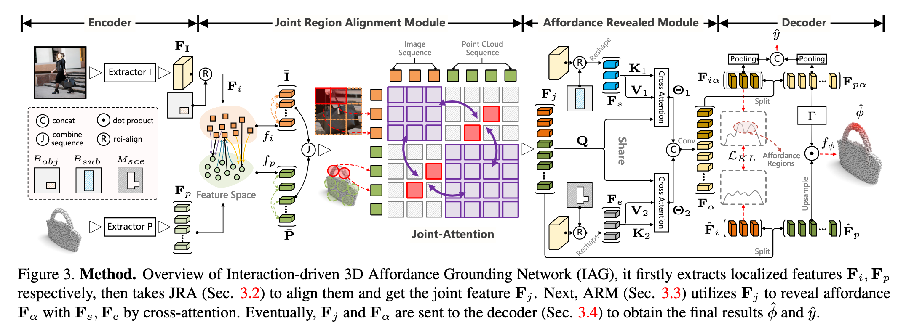

`3D Affordance Grounding 方向复盘` 

<!-- more -->

## 点云 + 文本

### [Affogato (Arxiv 2025.06)](https://arxiv.org/abs/2506.12009)

特点:

1. AFFOrdance Grounding All aT Once

2. a large-scale dataset for 3D and 2D affordance grounding

3. minimalistic architecture

损失函数:

1. Focal Loss to handle class imbalance

2. Dice Loss to improve region-level alignment.

现状:

1. wait for code release

2. dataset available

### [SeqAfford (CVPR 2025)](https://arxiv.org/abs/2412.01550)

特点:

1. Propose a 3D multimodal large language model (referring to the LLaVA model architecture)

2. Feed the `<SEG>` segmentation tokens output by the 3D MMLLM into the multi-granularity language-point cloud combination module to complete 3D dense prediction

3. Support sequential instruction execution

4. Large-scale instruction-point cloud pair dataset: A dataset with 180,000 instruction-point cloud pairs, covering single and sequential operability reasoning tasks

损失函数:

1. Autoregressive Cross-Entropy Loss

2. Dice Loss

3. Binary Cross-Entropy Loss

现状:

1. code available

2. dataset available

### [LASO (CVPR 2024)](https://openaccess.thecvf.com/content/CVPR2024/papers/Li_LASO_Language-guided_Affordance_Segmentation_on_3D_Object_CVPR_2024_paper.pdf)

> 需要二次回顾思考

特点:

1. PointRefer : The Adaptive Fusion Module is responsible for injecting semantic information at multiple scales. The Referred Point Decoder will introduce a set of affordance queries to interact with the point cloud features and complete the generation of dynamic convolution kernels.

2. LASO Dataset : 19,751 question-point affordance pairs

损失函数:

1. Focal Loss + Dice Loss

现状:

1. code and dataset available

## 点云 + 图像

### [IAGNet (ICCV 2023)](https://arxiv.org/abs/2303.10437)

特点:

1. Learn from 2D interactive images and generalize to 3D point clouds to infer affordance regions

> Joint_Region_Alignment(JRA), Affordance_Revealed_Module(ARM), Alignment of feature distributions between image and point cloud regions (KL Loss), Local + Global Prediction

2. Propose the PIAD dataset: It comprises 7012 point clouds and 5162 images, spanning 23 object classes and 17 affordance categories.

损失函数:

1. Heatmap Loss (HM_Loss): Point-wise 3D affordance mask prediction = Focal Loss + Dice Loss

2. Cross-Entropy Loss (CE Loss): Global affordance classification

3. KL-Divergence Loss (KL Loss): Make the feature distributions of the interaction regions on the image side close to those on the point cloud side

现状:

1. code and dataset available

## 点云 + 文本 + 图像

### [GREAT (CVPR 2025)](https://arxiv.org/abs/2411.19626)

特点:

1. grounding 3D object affordance in an Open-Vocabulary fashion

2. Multi-Head Affordance Chain-of-Thought

> Data preparation stage: 
> 
>  1. Use prompts to generate descriptions of the object interaction area, the morphology(形态学) of the interaction area, the interaction behavior, and other common interaction behaviors of the object.
>
>  2. Geometric structure knowledge = Answers to Prompt 1 + Prompt 2 = Interaction parts + Inference of geometric properties of these parts
> 
>  3. Interaction knowledge = Answers to Prompt 3 + Prompt 4 = Current interaction + Analogous(类似的)/supplementary(补充) interaction methods

3. PIADv2 dataset 

> 24 affordance ,  43 object categories, 15K interaction images , 38K 3D objects with annotations.

损失函数:

1. Focal Loss to handle class imbalance

2. Dice Loss to improve region-level alignment.

现状:

1. code available

2. dataset available

### [LMAffordance3D (CVPR 2025)](https://arxiv.org/abs/2504.04744)

特点:

1. Combine language instructions, visual observations, and interaction information to locate the affordance of manipulable objects in 3D space.

2. AGPIL（Affordance Grounding dataset with Points, Images and Language instructions）

> This dataset includes estimations of object affordances observed from full-view, partial-view, and rotated perspectives, taking into account factors such as real-world observation angles, object rotation, and spatial occlusion (遮挡).

损失函数:

1. focal loss

2. dice loss

现状:

1. wait for code release

2. dataset available

## 3D Gaussian Splatting (3DGS)

### [GEAL (CVPR 2025)](https://arxiv.org/abs/2412.09511)

特点:

1. "Knowledge Distillation" from 2D to 3D: Transfer the semantic capabilities of pre-trained 2D models to the 3D affordance prediction model through Gaussian splat mapping, cross-modal consistency alignment, and multi-scale fusion.

2. Noisy Dataset: Construct a new benchmark with multiple types of noise/damage to evaluate the generalization and robustness of the model under real/harsh conditions.

损失函数:

1. BCE

2. Dice Loss

3. Consistency Loss（MSE 损失）

现状:

1. wait for code release

2. wait for dataset release

### [3DAffordSplat (Arxiv 2025.04)](https://arxiv.org/abs/2504.11218)

### [IAAO (CVPR 2025)](https://arxiv.org/abs/2504.06827)