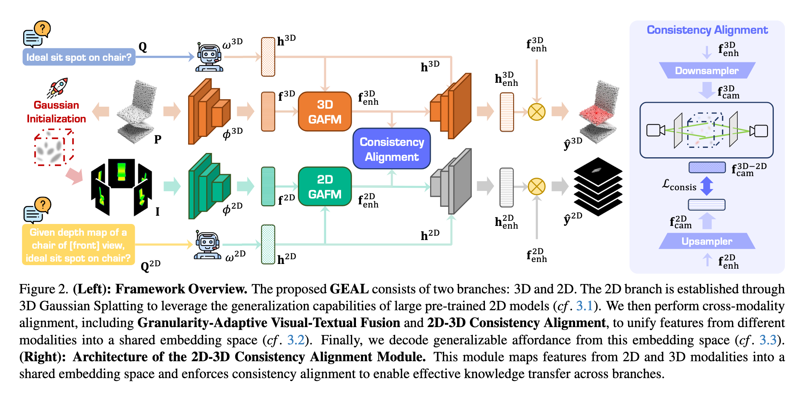

`GEAL: Generalizable 3D Affordance Learning with Cross-Modal Consistency 论文` 

<!-- more -->

> 论文链接: [GEAL: Generalizable 3D Affordance Learning with Cross-Modal Consistency](https://arxiv.org/abs/2412.09511)

## 引言

**研究背景与动机**：

3D 可供性学习的目标是根据语义线索（例如图像、文本指令），在三维物体上找出可以交互的区域。比如机器人需要知道 **哪里能抓住把手、哪里能按下按钮**。这种能力对机器人学和人机交互非常重要，能够支持 **动作预测、物体操作以及自主决策** 等任务。

然而，现有 3D 可供性学习方法存在几个主要问题：

* **数据稀缺**：与 2D 任务相比，3D 数据的标注非常有限，因此泛化性不足。

* **主干网络受限**：当前 3D 模型大多依赖几何与位置编码，无法很好地捕捉全局语义，导致在 **复杂场景、噪声干扰、传感器误差或数据损坏** 下表现不佳。

这些问题导致现有方法在鲁棒性和适应性上均受限制。

---

**本文提出的解决方案 GEAL**：

GEAL（*Generalizable 3D Affordance Learning*）旨在同时提升 **泛化性** 和 **鲁棒性**。它的设计核心包括：

* **双分支架构**：一个分支处理 3D 点云，另一个分支通过 **3D Gaussian Splatting (3DGS)** 将稀疏点云渲染成逼真的 2D 图像，从而建立一致的 2D-3D 映射。这样可以利用 **大规模预训练 2D 模型** 的语义知识与泛化能力来增强 3D 分支。

* **粒度自适应融合模块**：动态融合多层次的视觉与文本特征，使模型能在不同尺度、不同粒度下准确回答可供性相关问题。

* **2D-3D 一致性对齐模块**：在特征层面建立 2D 与 3D 模态的可靠对应关系（通过嵌入到 3DGS 的高斯基元中实现），确保知识有效迁移，并提升 3D 分支的泛化与鲁棒性。

---

**新的鲁棒性基准**：

为了弥补现有研究缺乏鲁棒性评测的不足，作者构建了两个新的数据集：

* **PIAD-Corrupt**

* **LASO-Corrupt**

这两个基准数据集基于常用的 3D 可供性数据集构建，并通过引入 **缩放、裁剪等真实场景中的损坏方式** 来模拟噪声和破坏，从而提供一个标准化的评测平台。

---

**实验结果与贡献总结**：

大量实验表明，GEAL 在 **已见类别、未见类别以及带有噪声/损坏的数据** 上，均优于现有方法，显示出强大的适应性和鲁棒性。

本文的主要贡献可以总结如下：

* 提出 GEAL，一种用于通用化 3D 可供性学习的新方法；通过 3DGS 构建 2D 分支，并利用预训练 2D 模型的语义知识提升 3D 预测能力。

* 设计 **粒度自适应融合模块** 与 **2D-3D 一致性对齐模块**，在双分支架构下实现跨模态知识整合与传播。

* 构建两个基于损坏的评测基准：**PIAD-C** 和 **LASO-C**，为社区提供了一个衡量 3D 可供性方法鲁棒性的标准。

* 在主流与损坏基准上进行大量实验，验证了 GEAL 在多种条件下均能保持优秀性能，具备较强的泛化能力和鲁棒性。

## 相关工作

**2D 可供性学习**：

可供性（affordances）是指物体或环境的属性决定了观察者可以执行的潜在动作。早期方法主要在图像或视频中识别交互区域，但缺乏对物体可供性相关部分的精确定位。

后来研究通过示例性的 2D 数据，改进了可供性定位精度。同时，大规模预训练模型可以将视觉特征与可供性相关的文本描述对齐，从而减少对人工标注的依赖，并在新场景下提升可供性预测能力。

近期一些研究进一步利用 **基础模型（foundation models）**，将可供性检测推广到新颖物体和不同视角，实现更好的泛化。

---

**3D 可供性学习**：

将可供性检测扩展到 3D 空间更具挑战，因为需要精确的空间和深度信息。

* 一些方法尝试使用 2D 数据来预测 3D 可供性区域，但难以精确定位交互点位。

* 随着大规模 3D 物体数据集的出现，研究者开始直接将可供性映射到 3D 结构上，以捕捉复杂空间关系。

* 最近的方法利用 2D 视觉和语言模型进行开放词汇（open-vocabulary）可供性检测，在无需固定标签集的情况下增强泛化能力。

尽管如此，3D 模型仍然缺乏 2D 基础模型的泛化能力，因此仍然很难实现稳健泛化。本文的方法正是通过引入 **大规模 2D 基础模型** 来提升 3D 可供性学习的泛化性。

---

**3D 可供性学习的鲁棒性**：

在真实世界中，3D 可供性学习容易受到点云损坏影响，这些损坏可能源自：

* 场景复杂性

* 传感器误差

* 数据处理错误

现有研究尝试提升 3D 感知在噪声和损坏条件下的鲁棒性，但可供性学习要求在 **数据退化的情况下依然精确识别交互区域**。

据作者所述，本文是 **首个专门针对 3D 可供性学习鲁棒性** 的研究，提出了一种针对性的解决方案，旨在提升模型在各种复杂环境下的可靠性。

## 方法

**整体流程**：

GEAL 框架旨在从 3D 点云和指令文本中预测物体各点的可供性分数 $y$。整体包括三大模块：

1. **3D-2D 映射（Gaussian Splatting）**

2. **跨模态一致性对齐**

3. **可供性解码与预测**

---

### 1. 3D-2D 映射（如图2左侧）

* **动机**：

  * 现有 3D 可供性学习泛化性差、鲁棒性不足

  * 2D 预训练模型具有强泛化能力和丰富语义知识
  
  * 因此通过 3D → 2D 映射，可以利用 2D 模型优势

* **方法**：

  * 使用 **3D Gaussian Splatting** 将点云表示为高斯基元
  
  * 高斯基元参数包括位置 $\mu$、协方差 $\Sigma$、颜色 $c$ 和不透明度 $\alpha$
  
  * 渲染公式：

$$
C(v) = \sum_{i\in N} c_i \alpha_i \prod_{j=1}^{i-1} (1-\alpha_j)
$$

$$
D(v) = \sum_{i\in N} d_i \alpha_i \prod_{j=1}^{i-1} (1-\alpha_j)
$$

* 使用深度图和颜色图生成 $V$ 个视角的 2D 图像 $I \in \mathbb{R}^{V\times3\times H\times W}$

* 将可供性分数 $y$ 转换为灰度，赋给高斯颜色 $c=y$，生成 2D 可供性掩码 $y^{2D} \in \mathbb{R}^{V\times H\times W}$

* 建立 3D 点云和 2D 表示的一致映射

* **编码器**：

  * 3D 分支使用 **PointNet++** 提取多尺度点云特征 $f^{3D}_i$
 
  * 2D 分支使用 **DINOV2** 提取图像特征 $f^{2D}_i$
 
  * 文本指令 $Q$ 通过轻量语言模型提取文本特征 $h^{3D}, h^{2D}$，2D 分支加入视角信息增强语义理解

---

### 2. 跨模态一致性对齐（如图2右侧、图3）

**核心目标**：将点云、图像和文本特征统一到共享嵌入空间，实现 2D → 3D 知识迁移，提高泛化性与鲁棒性。

* **粒度自适应视觉-文本融合（GAFM）**

  * 融合多尺度视觉特征和文本特征
 
  * **Flexible Granularity Feature Aggregation**：通过自适应权重融合不同尺度特征，支持多粒度可供性推理

$$
f^{2D} = \sum_{i=1}^{m} w_i \odot f^{2D}_i
$$

* **Text-Conditioned Visual Alignment**：文本信息增强视觉特征，使视觉特征保留空间结构的同时关注指令相关区域

* 3D 分支类似处理，但先在每个尺度进行对齐，再上采样统一分辨率，然后融合多尺度特征

* **2D-3D 一致性对齐（CAM）**

  * 2D 特征保留语义，3D 特征保留几何信息
 
  * 将 3D 特征通过高斯映射投影到 2D
 
  * 对齐特征并使用 L2 损失约束：

$$
L_{consis} = \text{MSE}(f^{3D-2D}_{cam}, f^{2D}_{cam})
$$

* 实现 2D → 3D 知识迁移，增强 3D 分支对未见物体和噪声数据的理解能力

---

### 3. 可供性解码与训练

* **解码器**：

  * 使用 3 层 Transformer 解码器
 
  * 文本特征作为 query，视觉特征作为 key/value
 
  * 输出增强文本特征 $h_{enh}$，作为动态卷积核预测可供性分数

$$
\hat{y}^{2D} = \text{sigmoid}(h^{2D}_{enh} \cdot f^{2D}_{enh})
$$

* **损失函数**：

  * BCE + Dice Loss，用于解决类别不平衡并提升分割精度
 
  * 训练分两阶段：

    1. 先训练 2D 分支
 
    2. 冻结 2D 分支（CAM 除外），训练 3D 分支并加入一致性损失 $L_{consis}$
 
  * 推理阶段仅使用 3D 分支，实现高效预测

---

### 4. 数据损坏基准

* **PIAD-C** 和 **LASO-C**

* 七类损坏类型：Add Global、Add Local、Drop Global、Drop Local、Rotate、Scale、Jitter

* 每类 5 个严重度，总计 4,890 对对象-可供性

* 覆盖 17 个可供性类别、23 个对象类别、2,047 个不同形状

* 用于评测模型在真实场景中的鲁棒性

### 5. 个人理解

1. **2D 领域情况**

   * 有丰富的大规模数据和成熟的预训练基础模型（如 CLIP、DINOV2 等），所以 **2D affordance grounding** 已经相对成熟。
  
   * 这些模型具备很强的语义理解与泛化能力。

2. **3D 领域情况**

   * 点云本身稀疏、缺乏纹理，语义信息表达能力弱。
 
   * 标注数据有限，导致模型在 **泛化性和鲁棒性** 上表现不佳。

3. **论文的策略**

   * 利用 **高斯散点渲染 (Gaussian Splatting)** 将 3D 点云转化为更具语义信息的 2D 视图。
 
   * 引入 **2D 分支（教师）**，保持其预训练能力不变，作为稳定的语义参考。
 
   * 在训练中通过 **2D–3D 一致性约束**（Consistency Alignment Module, CAM），强制 3D 分支的表示与 2D 分支对齐。
 
   * 这样，2D 分支的知识就能迁移到 3D 分支，使其在泛化性和鲁棒性上大幅提升。

简化成一句话：

> **2D 分支是老师，提供强大的语义泛化能力；3D 分支是学生，通过一致性约束继承老师的能力，从而弥补自身在稀疏点云上的不足。**

## 局限性

* **内部可供性不足**：模型主要依赖点云的外部表面信息，难以识别和泛化与内部结构相关的可供性（如瓶子的“容纳”功能），同时缺乏高质量内部可供性数据进一步限制了表现。

* **伦理风险**：在监控或自主决策等场景中，若技术被滥用可能侵犯隐私或导致缺乏问责，需要建立完善的伦理规范。

* **资源消耗高**：训练和部署需要大量计算资源，中小型组织或技术基础设施不足的地区难以承担，限制了框架的普及性。