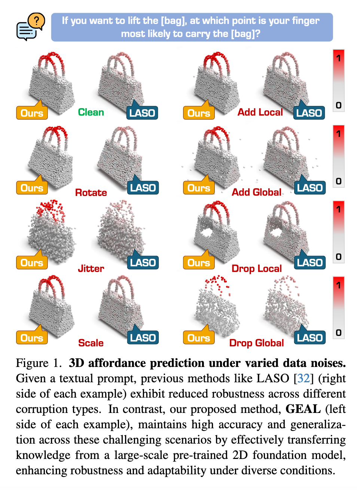

`GEAL: Generalizable 3D Affordance Learning with Cross-Modal Consistency 论文` 

<!-- more -->

> 论文链接: [GEAL: Generalizable 3D Affordance Learning with Cross-Modal Consistency](https://arxiv.org/abs/2412.09511)

## 引言

**研究背景与动机**：

3D 可供性学习的目标是根据语义线索（例如图像、文本指令），在三维物体上找出可以交互的区域。比如机器人需要知道 **哪里能抓住把手、哪里能按下按钮**。这种能力对机器人学和人机交互非常重要，能够支持 **动作预测、物体操作以及自主决策** 等任务。

然而，现有 3D 可供性学习方法存在几个主要问题：

* **数据稀缺**：与 2D 任务相比，3D 数据的标注非常有限，因此泛化性不足。

* **主干网络受限**：当前 3D 模型大多依赖几何与位置编码，无法很好地捕捉全局语义，导致在 **复杂场景、噪声干扰、传感器误差或数据损坏** 下表现不佳。

这些问题导致现有方法在鲁棒性和适应性上均受限制。

---

**本文提出的解决方案 GEAL**：

GEAL（*Generalizable 3D Affordance Learning*）旨在同时提升 **泛化性** 和 **鲁棒性**。它的设计核心包括：

* **双分支架构**：一个分支处理 3D 点云，另一个分支通过 **3D Gaussian Splatting (3DGS)** 将稀疏点云渲染成逼真的 2D 图像，从而建立一致的 2D-3D 映射。这样可以利用 **大规模预训练 2D 模型** 的语义知识与泛化能力来增强 3D 分支。

* **粒度自适应融合模块**：动态融合多层次的视觉与文本特征，使模型能在不同尺度、不同粒度下准确回答可供性相关问题。

* **2D-3D 一致性对齐模块**：在特征层面建立 2D 与 3D 模态的可靠对应关系（通过嵌入到 3DGS 的高斯基元中实现），确保知识有效迁移，并提升 3D 分支的泛化与鲁棒性。

---

**新的鲁棒性基准**：

为了弥补现有研究缺乏鲁棒性评测的不足，作者构建了两个新的数据集：

* **PIAD-Corrupt**

* **LASO-Corrupt**

这两个基准数据集基于常用的 3D 可供性数据集构建，并通过引入 **缩放、裁剪等真实场景中的损坏方式** 来模拟噪声和破坏，从而提供一个标准化的评测平台。

---

**实验结果与贡献总结**：

大量实验表明，GEAL 在 **已见类别、未见类别以及带有噪声/损坏的数据** 上，均优于现有方法，显示出强大的适应性和鲁棒性。

本文的主要贡献可以总结如下：

* 提出 GEAL，一种用于通用化 3D 可供性学习的新方法；通过 3DGS 构建 2D 分支，并利用预训练 2D 模型的语义知识提升 3D 预测能力。

* 设计 **粒度自适应融合模块** 与 **2D-3D 一致性对齐模块**，在双分支架构下实现跨模态知识整合与传播。

* 构建两个基于损坏的评测基准：**PIAD-C** 和 **LASO-C**，为社区提供了一个衡量 3D 可供性方法鲁棒性的标准。

* 在主流与损坏基准上进行大量实验，验证了 GEAL 在多种条件下均能保持优秀性能，具备较强的泛化能力和鲁棒性。

## 相关工作

**2D 可供性学习**：

可供性（affordances）是指物体或环境的属性决定了观察者可以执行的潜在动作。早期方法主要在图像或视频中识别交互区域，但缺乏对物体可供性相关部分的精确定位。

后来研究通过示例性的 2D 数据，改进了可供性定位精度。同时，大规模预训练模型可以将视觉特征与可供性相关的文本描述对齐，从而减少对人工标注的依赖，并在新场景下提升可供性预测能力。

近期一些研究进一步利用 **基础模型（foundation models）**，将可供性检测推广到新颖物体和不同视角，实现更好的泛化。

---

**3D 可供性学习**：

将可供性检测扩展到 3D 空间更具挑战，因为需要精确的空间和深度信息。

* 一些方法尝试使用 2D 数据来预测 3D 可供性区域，但难以精确定位交互点位。

* 随着大规模 3D 物体数据集的出现，研究者开始直接将可供性映射到 3D 结构上，以捕捉复杂空间关系。

* 最近的方法利用 2D 视觉和语言模型进行开放词汇（open-vocabulary）可供性检测，在无需固定标签集的情况下增强泛化能力。

尽管如此，3D 模型仍然缺乏 2D 基础模型的泛化能力，因此仍然很难实现稳健泛化。本文的方法正是通过引入 **大规模 2D 基础模型** 来提升 3D 可供性学习的泛化性。

---

**3D 可供性学习的鲁棒性**：

在真实世界中，3D 可供性学习容易受到点云损坏影响，这些损坏可能源自：

* 场景复杂性

* 传感器误差

* 数据处理错误

现有研究尝试提升 3D 感知在噪声和损坏条件下的鲁棒性，但可供性学习要求在 **数据退化的情况下依然精确识别交互区域**。

据作者所述，本文是 **首个专门针对 3D 可供性学习鲁棒性** 的研究，提出了一种针对性的解决方案，旨在提升模型在各种复杂环境下的可靠性。

## 方法

