`GREAT: Geometry-Intention Collaborative Inference for Open-Vocabulary 3D Object Affordance Grounding 论文解读` 

<!-- more -->

> 论文: [https://arxiv.org/abs/2411.19626](https://arxiv.org/abs/2411.19626)
> 代码: [https://github.com/yawen-shao/GREAT_code](https://github.com/yawen-shao/GREAT_code)
> 数据集: [https://drive.google.com/drive/folders/1n_L_mSmVpAM-1ASoW2T2MltYkaiA_X9X](https://drive.google.com/drive/folders/1n_L_mSmVpAM-1ASoW2T2MltYkaiA_X9X)


## 摘要

GREAT（Geometry-Intention Collaborative Inference）是一种新颖的框架，旨在通过挖掘物体的不变几何属性和潜在交互意图，以开放词汇的方式定位3D物体的功能区域（affordance）。该框架结合了多模态大语言模型（MLLMs）的推理能力，设计了多头部功能链式思维（MHACoT）策略，逐步分析交互图像中的几何属性和交互意图，并通过跨模态自适应融合模块（CMAFM）将这些知识与点云和图像特征结合，实现精准的3D功能定位。此外，研究还提出了目前最大的3D功能数据集PIADv2，包含15K交互图像和38K标注的3D物体实例。实验证明了GREAT在开放词汇场景下的有效性和优越性。

## 简介

Open-Vocabulary 3D对象功能定位（OVAG）旨在通过任意指令定位物体上支持特定交互的“动作可能性”区域，对机器人感知与操作至关重要。现有方法（如[IAGNet](https://arxiv.org/abs/2303.10437)、[LASO](https://openaccess.thecvf.com/content/CVPR2024/papers/Li_LASO_Language-guided_Affordance_Segmentation_on_3D_Object_CVPR_2024_paper.pdf)）通过结合描述交互的图像或语言与3D几何结构引入外部先验，但存在以下局限性（如图1(b)所示）：  

- **语义空间受限**：依赖预定义类别，难以泛化到未见过的功能（如将“pour”错误分类为“grasp”）。  
               
- **几何与意图利用不足**：未充分挖掘物体间共享的几何不变性（如手柄的抓握属性）和同一物体的多交互意图关联。  

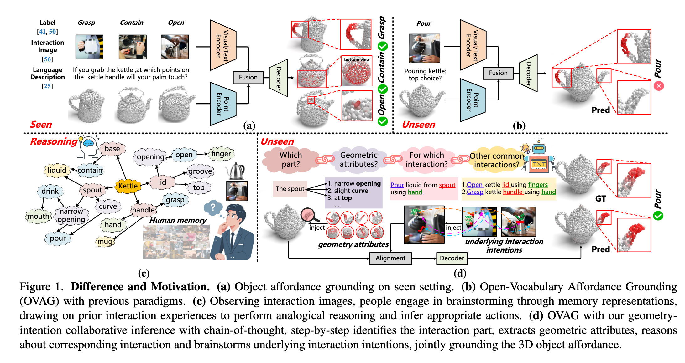

**人类认知启发**:

研究表明（[Gick & Holyoak, 1980](https://www.sciencedirect.com/science/article/abs/pii/0010028580900134)），人类通过多步推理和类比思维解决复杂任务。例如，观察倒水场景时（图1(c)），人类会：  

1. 识别交互部件（壶嘴）  

2. 提取几何属性（倾斜曲面）  

3. 推理潜在意图（倒水/注水）  

**方法创新**:  

GREAT框架通过以下设计模拟这一过程（图1(d)）：  

1. **MHACoT推理链**：基于微调的MLLM（如[InternVL](https://arxiv.org/abs/2404.16821)）分步推理：  

   - **Object-Head**：定位交互部件并分析几何结构（如“为什么壶嘴适合倒水”）  

   - **Affordance-Head**：描述实际交互（如“握柄倒水”）并联想潜在意图（如“注水/清洗”）  

2. **跨模态融合**：通过CMAFM模块将几何属性（$\mathbf{\hat{T}}_o$）与交互意图（$\mathbf{\hat{T}}_a$）注入点云（$\mathbf{F}_{tp}$）和图像特征（$\mathbf{F}_{ti}$），最终解码为3D功能热图 $\phi = \sigma(f_\phi(\mathbf{F}_\alpha))$。  

**数据集贡献**:

扩展构建了**PIADv2**（对比见表1）：  

- **规模**：15K交互图像（×3）和38K 3D实例（×5）  

- **多样性**：43类物体、24类功能，覆盖多对多关联（图3(c)）  

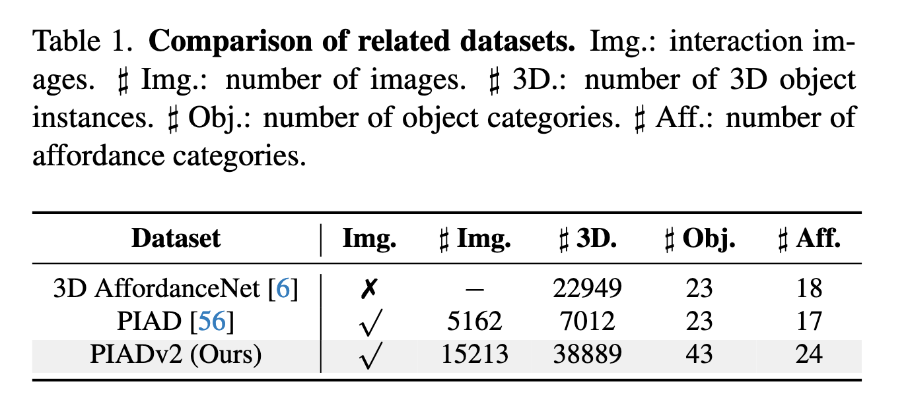

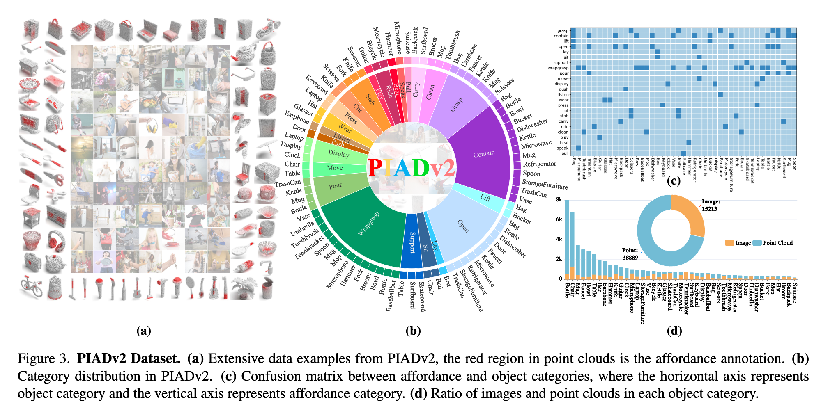

## 相关工作

**1. Affordance Grounding**  

现有研究主要从2D数据（如图像、视频）和自然语言理解出发，定位“动作可能性”区域。例如，部分工作通过语言理解在2D数据中定位功能区域（[3](https://arxiv.org/abs/2405.12461), [21](https://arxiv.org/abs/2311.17776)），但机器人操作需要3D信息，2D方法难以直接迁移。随着3D数据集（如[5](https://arxiv.org/abs/2212.08051), [6](https://arxiv.org/abs/2103.16397)）的出现，部分研究开始映射语义功能到3D结构，但受限于预定义类别，无法处理开放词汇场景。  

**2. Open-Vocabulary 3D Affordance Grounding (OVAG)**  

OVAG旨在通过额外指令（如文本或图像）引入交互先验，提升泛化能力。例如：  

- IAGNet  利用2D交互语义指导3D功能定位；  

- LASO 通过文本条件查询分割功能区域；  

- OpenAD 和 OpenKD 利用CLIP编码器实现文本-点云关联。  

这些方法仍受限于训练语义空间，而GREAT通过几何-意图协同推理（CoT）解决此问题（如表2所示）。 

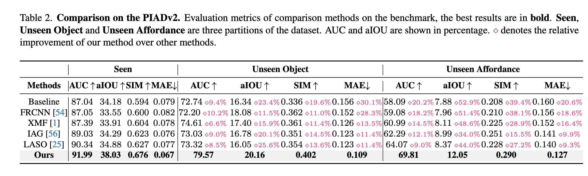

**3. Chain-of-Thought (CoT) 与多模态大模型 (MLLMs)**  

CoT及其变体通过多步推理增强MLLMs能力。例如：  

- 视觉任务中，MLLMs（如InternVL）结合CoT在目标检测、机器人操作等任务中表现优异；  

- 但动态功能特性使得MLLMs难以直接从交互图像推理3D功能，GREAT通过微调MLLMs并设计MHACoT策略解决这一问题。  

**关键问题**（如图1所示）：  

- 现有方法依赖数据对齐，泛化性不足（如将“pour”误分类为“grasp”）；  

- GREAT通过模拟人类多步推理（几何属性提取+意图类比）实现开放词汇功能定位。

## 方法

GREAT 的输入为 ${P, I}$，其中 $P \in \mathbb{R}^{N \times 4}$ 是点云，包含物体的坐标 $P\_c \in \mathbb{R}^{N \times 3}$ 和其对应的 3D 可供性标注 $P\_{label} \in \mathbb{R}^{N \times 1}$，$I \in \mathbb{R}^{3 \times H \times W}$ 为图像。目标是优化模型 $f\_\theta$，输出 3D 物体可供性 $\varphi$，即：

$$
\varphi = f_\theta(P_c, I)
$$

如图2所示，首先使用 ResNet \[9] 和 PointNet++ \[43] 提取特征，分别得到 $F\_i \in \mathbb{R}^{C \times H\_1 \times W\_1}$ 和 $F\_p \in \mathbb{R}^{C \times N\_p}$，随后将 $F\_i$ reshape 为 $F\_i \in \mathbb{R}^{C \times N\_i}$（其中 $N\_i = H\_1 \times W\_1$）。接着通过多头可供性链式思维（MHACoT）策略对交互图像进行推理，挖掘不变几何属性与潜在交互意图。

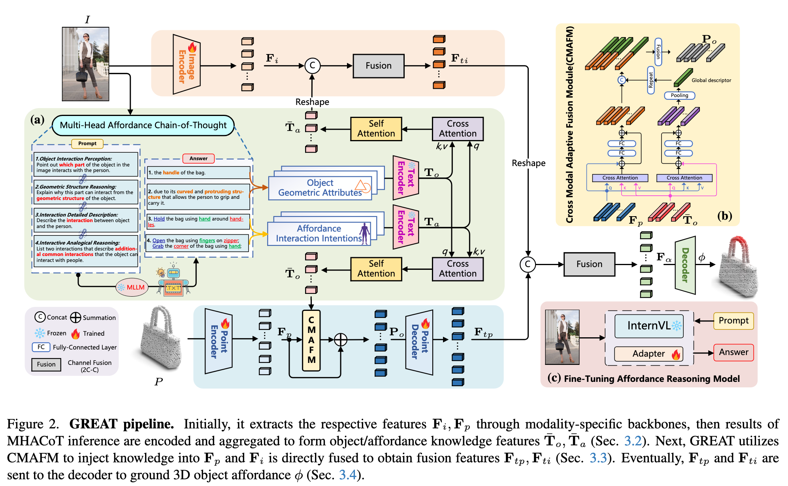

然后，使用 Roberta \[28] 编码推理结果，通过交叉注意力机制计算对象几何特征 $\bar{T}*o$ 和可供性意图特征 $\bar{T}*a$（见 Sec. 3.2）。GREAT 利用跨模态自适应融合模块（CMAFM）将这些知识注入点云特征并与图像特征融合，得到融合特征 $F*{tp}, F*{ti}$（见 Sec. 3.3）。最后将这两个特征送入解码器以获得可供性输出 $\varphi$，并通过复合损失优化整个流程（见 Sec. 3.4）。

---

### 3.2 Multi-Head Affordance Chain-of-Thought

#### Fine-Tuning MLLM

为了获得对物体可供性更深入的理解，我们对 InternVL \[4] 使用可学习的 Adapter \[10] 进行微调，仅更新 Adapter 模块（10 个 epoch，学习率 4e-5，LoRA rank 为 16），其余参数保持冻结，以保持原始模型识别能力的同时增强其推理能力。

#### Object-Head Reasoning（几何推理）

该部分包含：

* **物体交互感知（Object Interaction Perception）**：识别图像中物体与人发生交互的部分。Prompt 示例为：“指出图像中物体与人交互的部分。”

* **几何结构推理（Geometric Structure Reasoning）**：进一步从几何结构角度推理为什么该部位适合交互。Prompt 示例为：“从几何结构解释该部位可以交互的原因。”

#### Affordance-Head Reasoning（类比推理）

该部分包含：

* **交互细节描述（Interaction Detailed Description）**：描述图像中人与物体之间的完整交互过程，生成细粒度表示。Prompt 示例为：“描述图像中人与物体的交互方式。”

* **交互类比推理（Interactive Analogical Reasoning）**：模拟人类对交互方式的联想，挖掘其他可能交互意图，增强类比能力。Prompt 示例为：“列举两个该物体常见的其他交互方式。”

#### Knowledge Encoding and Integration

从 Object-Head 得到的几何属性描述与 Affordance-Head 推理的交互描述被 Roberta 编码为两个特征：

* $T\_o \in \mathbb{R}^{N\_o \times C}$：物体几何知识特征
* $T\_a \in \mathbb{R}^{N\_a \times C}$：可供性意图知识特征

通过交叉注意力层 $f\_m$ 与自注意力层 $f\_\delta$ 对齐二者，公式如下：

$$
\bar{T}_o = f_\delta(f_m(T_o, T_a)), \quad \bar{T}_a = f_\delta(f_m(T_a, T_o))
$$

---

### 3.3 Cross-Modal Adaptive Fusion Module (CMAFM)

为了将几何属性与点云特征更好地对齐融合，CMAFM 将 $\bar{T}\_o$ 融合至 PointNet++ 最深层特征，并与图像特征联合用于预测。

具体地，对点云特征 $F\_p$ 和知识特征 $\bar{T}\_o$ 进行线性映射形成 Query、Key、Value：

* $Q = F\_p W\_1$
* $K = \bar{T}\_o W\_2$
* $V = \bar{T}\_o W\_3$

跨注意力融合公式为：

$$
F_p' = \left( \text{softmax}\left( \frac{Q^\top \cdot K}{\sqrt{d}} \right) \cdot V^\top \right)^\top
$$

最终点云融合特征表示为：

$$
P_o = f\left[ F_p' + f_\phi(F_p'), \Theta(\bar{T}_o' + f_\phi(\bar{T}_o')) \right]
$$

其中 $f\_\phi$ 为全连接层，$\Theta$ 表示池化后扩展为 $RC \times N\_p$，$f$ 为 $1 \times 1$ 卷积，输出 $P\_o$ 上采样至原始点数后记为：

$$
F_{tp} = \text{FP}(P_o)
$$

图像特征 $F\_i$ 与意图特征 $\bar{T}\_a$ 融合表示为：

$$
F_{ti} = f[\Gamma(\bar{T}_a), F_i], \quad F_{ti} \in \mathbb{R}^{C \times N_i}
$$

---

### 3.4 Decoder and Loss Functions

最终将融合后的图像特征 $F\_{ti}$ 和点云特征 $F\_{tp}$ 拼接后送入解码器输出可供性预测：

$$
F_\alpha = f[\Gamma(F_{ti}), F_{tp}], \quad \varphi = \sigma(f_\varphi(F_\alpha))
$$

其中 $\sigma$ 为 sigmoid 激活，$f\_\varphi$ 为输出头，$F\_\alpha \in \mathbb{R}^{C \times N}$，$\varphi \in \mathbb{R}^{N \times 1}$ 是最终的 3D 可供性预测。

损失函数由 focal loss \[26] 与 dice loss \[37] 组成：

$$
\mathcal{L}_{\text{total}} = \mathcal{L}_{\text{focal}} + \mathcal{L}_{\text{dice}}
$$

这种设计无需依赖具体的可供性分类标签，而是通过监督点级热图，将 3D 可供性与交互图像直接联系起来。

## 数据集

为支撑开放词汇 3D 物体可供性定位任务，本文构建了 **PIADv2（Point Image Affordance Dataset v2）**，由成对的 2D 交互图像与 3D 点云对象组成，是当前规模最大的同类数据集。

### 数据收集（Collection）

* 点云部分主要来自以下开源数据源：

  * 3DIR \[57]
  * 3D-AffordanceNet \[6]
  * Objaverse \[5]

* 图像部分主要来源于：

  * AGD20k \[32]
  * OpenImage \[18]
  * 其他开源许可网站

**总体数据统计**：

* 图像数：15,213
* 点云数：38,889
* 覆盖类别：

  * 物体类别：43类
  * 可供性类别：24类

该数据集大大超越了前作 PIAD \[56]，其图像数量是前者的三倍，点云数量是前者的五倍。

> 如图3(a) 所示，红色区域为点云的可供性标注。图3(b) 展示了各类别的分布情况，显示出数据集对交互多样性和类别多样性的全面覆盖。

---

### 标注策略（Annotation）

对于点云实例：

* 每个点云实例按可供性类别标注
* 每个样本为一个 $2048 \times4$ 的矩阵，含：

  * 2048 个点
  * 每个点包括 $(x, y, z)$ 坐标与热力图形式的可供性值

对于图像：

* 图像按可供性类别进行分类，以支持训练阶段的匹配与推理

---

### 统计分析（Statistical Analysis）

* **图像与点云之间不需要一一对应**，二者分别从不同实例中采样，以增强泛化能力
* **多对多关系分析**：如图3(c) 所示，affordance 与 object 类别间存在明显的多对多关系，挑战模型对可供性的泛化能力
* **类平衡分析**：图3(d) 展示了各 object 类别下图像与点云的数量比例，体现出数据集在样本分布上的全面性和均衡性

---

### 数据划分（Data Partitions）

PIADv2 提供三种标准划分方式（前两种与 PIAD \[56] 保持一致）：

**Seen**：

* 训练集与测试集中的物体与可供性类别相同

**Unseen Object**：

* 测试集中包含训练集中未出现的物体类别，但可供性类别相同

**Unseen Affordance**：

* 测试集中的可供性类别未在训练集中出现，同时包含部分新物体类别

## 实验

为验证所提方法 GREAT 的有效性与泛化能力，作者在提出的 **PIADv2** 数据集上开展了系统性的实验评估，包括与多个先进方法的对比以及消融实验和可视化分析。

### 5.1 Benchmark Setting

**评估指标**：

实验采用以下评估指标评估 3D 可供性预测质量（参考 \[25, 56]）：

* AUC（Area Under Curve）\[29]
* aIOU（average Intersection over Union）\[45]
* SIM（Similarity）\[47]
* MAE（Mean Absolute Error）\[52]

**对比方法**：

* **IAG** ([2023](https://openaccess.thecvf.com/content/ICCV2023/html/Yang_Grounding_3D_Object_Affordance_From_2D_Interactions_in_Images_ICCV_2023_paper.html))：2D-引导的3D可供性方法
* **LASO** ([2024](https://openaccess.thecvf.com/content/CVPR2024/html/Li_LASO_Language-Guided_Affordance_Segmentation_on_3D_Object_CVPR_2024_paper.html))：基于语言引导的3D可供性分割
* **FRCNN** \[54]：LiDAR-图像融合两阶段3D检测框架
* **XMF** \[1]：图像-点云的跨模态点云形状补全方法
* **Baseline**：直接拼接图像与点云特征作为输入

**实现细节**：

* 3D backbone：PointNet++ \[43]
* 2D backbone：ResNet18 \[9]
* 优化器：Adam
* 学习率：1e-4
* 批大小：16
* 总训练轮次：65

---

### 5.2 Comparison Results

如表2所示，GREAT 在所有划分（Seen、Unseen Object、Unseen Affordance）下均显著优于现有方法，达成最新最优性能。

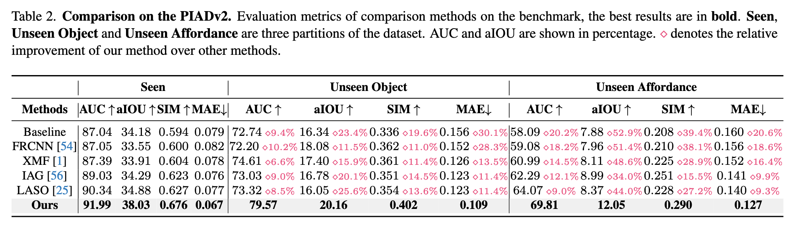

**量化分析**：

在 **Unseen Affordance** 这一最具挑战性的设置下，GREAT 依旧表现出色：

* AUC：69.81（高出 LASO 约 9%）
* aIOU：12.05（高出 IAG 约 34%）
* SIM：0.290（大幅超越所有基线）
* MAE：0.127（最小）

**可视化分析**（如图4所示）：

* **Seen setting**：各方法差别不大
* **Unseen setting**：

  * 其他方法倾向于错误地预测为训练集中频繁出现的 affordance（如 grasp）
  * GREAT 能正确捕捉如 "pour" 这类 unseen affordance，定位精度显著更高

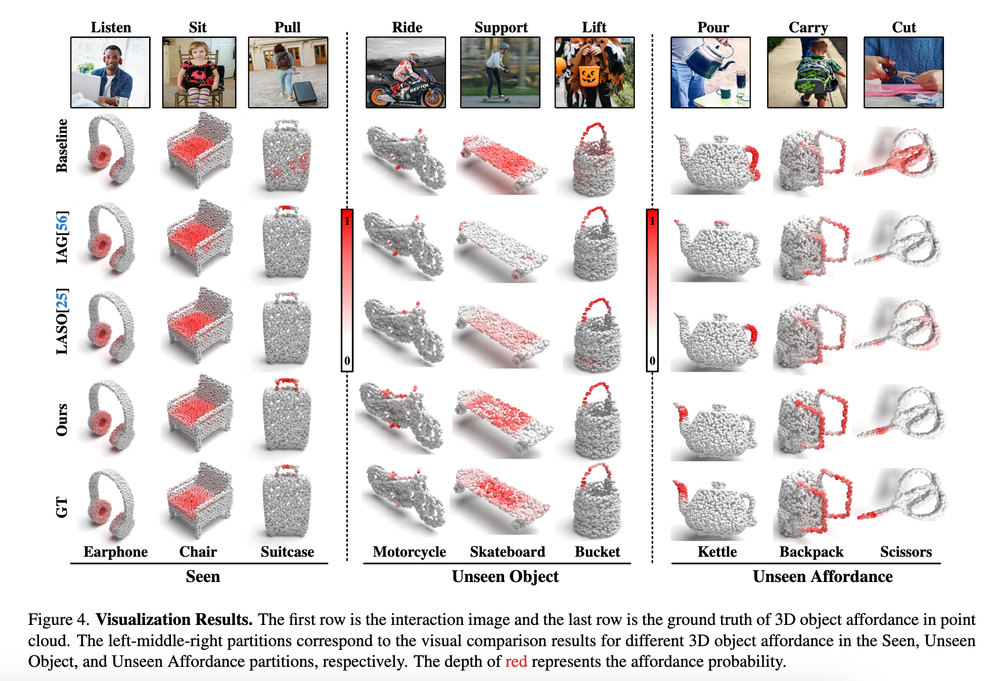

---

### 5.3 Ablation Study

表3 展示了对关键模块的消融实验结果：

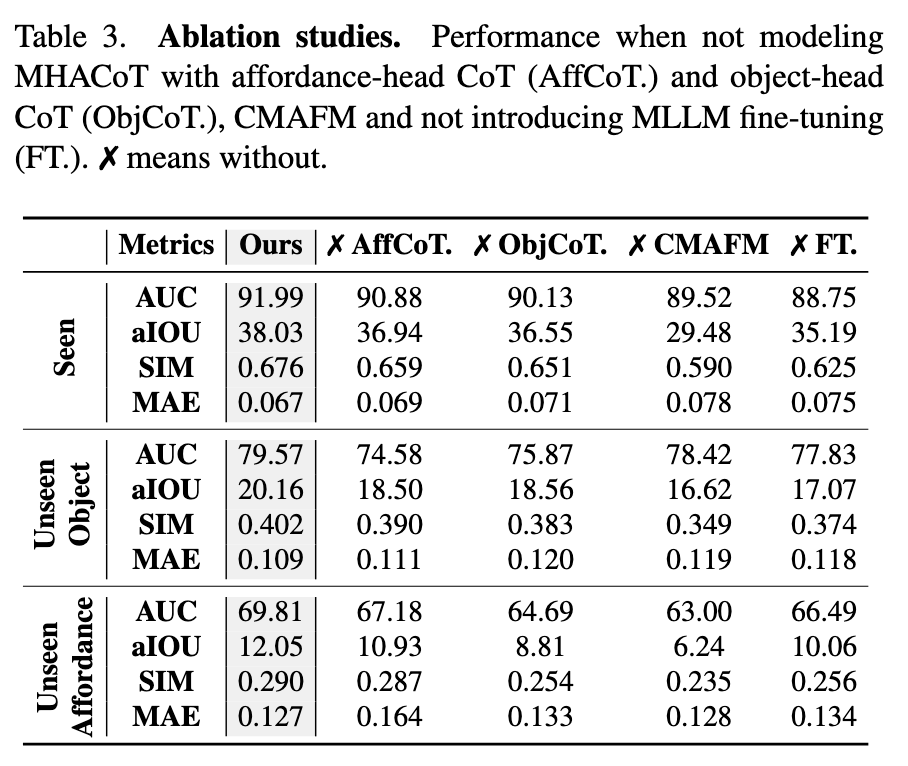

**消融项分析**：

* **✗ AffCoT（无意图推理）**：

  * unseen affordance 的 aIOU 下降了 1.12，表明交互意图推理对泛化至新 affordance 极为重要
* **✗ ObjCoT（无几何推理）**：

  * 模型对物体关键交互区域的识别能力下降
* **✗ CMAFM（无跨模态融合）**：

  * 几何信息无法有效注入点云，导致各项指标大幅下降（aIOU 从 38.03 降到 29.48）
* **✗ FT（无 MLLM 微调）**：

  * 推理能力受限，泛化性下降明显

**可视化支持**（见图5）：

* **(a)**：若缺失 AffCoT，模型无法进行类比推理，预测倾向训练集中已有的 affordance
* **(b)**：缺失 ObjCoT 时，模型无法精确聚焦于关键交互部位（如 kettle 的 spout）

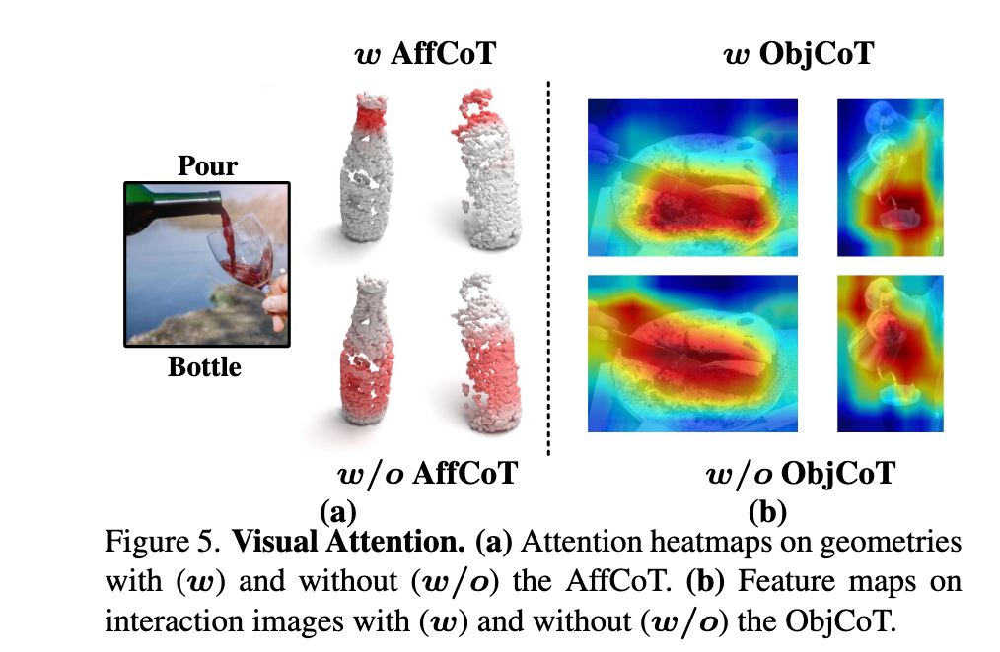

---

### 5.4 Performance Analysis

为进一步评估模型的理解与泛化能力，作者设计了多个分析实验。

**多个物体场景（Multiple Objects）**：

* 在同一张交互图像中存在多个物体时，模型能准确对每个对象生成独立的 affordance 区域（见图6）

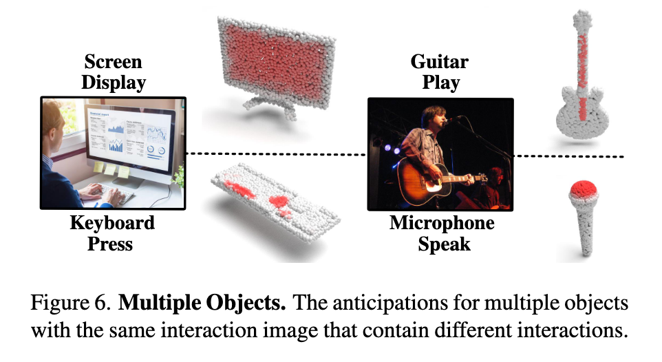

**多种可供性（Multiple Affordances）**：

* 同一物体在不同交互图像中被推理出不同的 3D affordance 区域，体现出模型对语义的灵活解析能力（见图7）

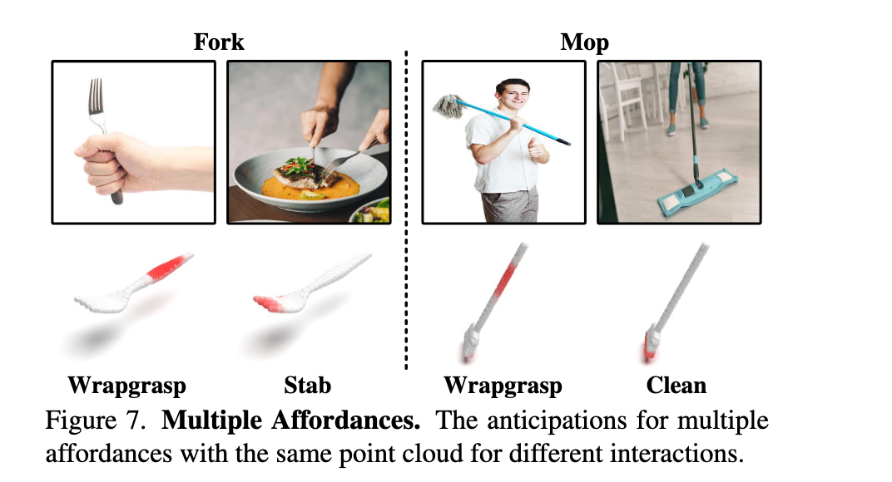

**多实例鲁棒性（Multiple Instances）**：

* 在几何形状变化显著的同类物体中，模型依然能稳定预测合理的交互区域（见图8），说明其具备良好的泛化能力与鲁棒性

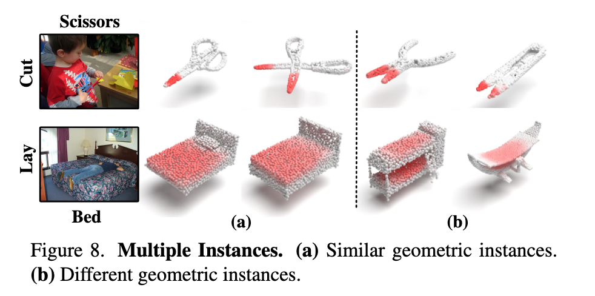

## 结论

我们提出了一种**开放词汇形式的 3D 物体可供性定位方法**，该方法从交互图像中进行推理，能够突破预定义样本空间的限制，并推广至未见场景。为实现这一目标，我们设计了一个新颖的框架 —— 通过多头可供性链式思维（Multi-Head Affordance Chain-of-Thought）推理，挖掘物体的**不变几何属性**，并对潜在交互方式进行类比推理，同时结合跨模态特征对齐，实现对 3D 可供性区域的精准定位。

此外，我们引入了目前最大规模的 3D 可供性数据集 **PIADv2**，涵盖 1.5 万张交互图像与超过 3.8 万个标注完整的 3D 物体。大量实验验证了我们提出的 GREAT 框架在多项评估指标上具有显著优势，能够在开放场景下支持可供性理解，有望提升机器人在未知环境中的自主交互能力。我们相信该研究将为视觉可供性理解领域带来新的启发并推动其发展。

**局限性与未来工作**：
GREAT 的主要局限在于其多步推理机制带来了较高的计算复杂度，在大规模或实时应用中可能成为瓶颈。未来，我们计划构建**专用于推理的数据集**，并利用这些数据集对多模态模型进行知识蒸馏，使其专注于特定领域，从而在实际应用中实现更快、更高效的性能。

## 代码

### Multi-Head Affordance Chain-of-Thought

MHACoT是一种**类人推理方式**，分多个步骤，模拟人观察交互图像时的思维链条：

1. **识别交互部位**（Object Interaction Perception）

2. **解析几何属性**（Geometric Structure Reasoning）

3. **详细描述交互**（Interaction Detailed Description）

4. **类比额外交互**（Interactive Analogical Reasoning）

每个子步骤都由一个 prompt 引导 MLLM（如 InternVL）做回答，从而获得：

* 对象的交互区域


> **Object Interaction Perception**
> Prompt 1: Point out which part of the object in the image interacts with the person.

🔹目标：定位交互发生的对象区域（如“水壶的壶嘴”）

---
* 对应的几何属性

> **Geometric Structure Reasoning**
> Prompt 2: Explain why this part can interact from the geometric structure of the object.

🔹目标：推理几何形态支持该交互（如“壶嘴上开口狭窄、带曲线”）

---
* 当前交互行为

> **Interaction Detailed Description**
> Prompt 3: Describe the interaction between object and the person.

🔹目标：细致地识别交互动作及其参与部位（如“用手握住壶把倒水”）

---
* 潜在交互意图

> **Interactive Analogical Reasoning**
> Prompt 4: List two interactions that describe additional common interactions that the object can interact with people.

🔹目标：推理除了当前交互以外，该物体常见的其他交互（如“开壶盖、抓握中部”）


核心代码实现如下:

```python
# 1. 加载预训练多模态大模型
model = AutoModel.from_pretrained(
    path,
    torch_dtype=torch.bfloat16,
    #load_in_8bit=True,
    low_cpu_mem_usage=True,
    trust_remote_code=True,
    device_map=device_map).eval()
tokenizer = AutoTokenizer.from_pretrained(path, trust_remote_code=True, use_fast=False)

# 2. 加载图像数据
image_path = 'PATH/Data/Kettle/Internet/pour/kettle_pour_1.jpg'
pixel_values = load_image(image_path, max_num=12).to(torch.bfloat16).cuda()
object = image_path.split('/')[-4] # 图像所属的物体名

# 3. 定位交互部位
question1 = f'Point out which part of the {object} in the image interacts with the person. If this part is different from the part of the {object} shown in the image that performs the main function, point out the part of the {object} that performs the main function shown in the image.'
response1, history = model.chat(tokenizer, pixel_values, question1, generation_config, history=None, return_history=True)
print(f'{response1}')

# 4. 推理几何结构
question2 = f'Explain why this part can interact from the geometric structure of the {object}. Just give the final result in one sentence.'
response2, history = model.chat(tokenizer, pixel_values, question2, generation_config, history=history, return_history=True)
print(f'{response2}')

# 5. 详细交互行为
question3 = f'Describe the interaction between {object} and the person in the image, including the interaction type, the interaction part of the {object}, and the interaction part of the person.'
response3, history= model.chat(tokenizer, pixel_values, question3, generation_config, history=history, return_history=True)
print(f'{response3}')

# 6. 推测其他交互
question4 = f'List two interactions that describe additional common interactions that the {object} can interact with people, including the interaction type, the interaction part of the {object}, and the interaction part of the person.'
response4, history= model.chat(tokenizer, pixel_values, question4, generation_config, history=history, return_history=True)
print(f'{response4}')

'''
Sample output
1. the spout of kettle.
2. a narrow opening, a slight curve and the spout's position at the top of the kettle.
3. pour the liquid from the spout of the kettle using people’s hand
4. grasp the kettle using person's hand around middle body, open the kettle using people's fingers on the lid

object knowledge: the spout of kettle: a narrow opening, a slight curve and the spout's position at the top of the kettle.
affordance/human knowledge: pour the liquid from the spout of the kettle using people’s hand, grasp the kettle using person's hand around handle, open the kettle using people's fingers on the lid
''
```
其中:

- 几何结构知识 = Prompt 1 + Prompt 2 的回答 = 交互部位 + 该部位的几何属性推理

- 交互知识 = Prompt 3 + Prompt 4 的回答 = 当前交互 + 类比/补充的交互方式 

> MHACoT 这个过程发生在数据集准备阶段。

### 数据集

> 先了解一下GREAT项目对应的数据集目录结构:
>
> 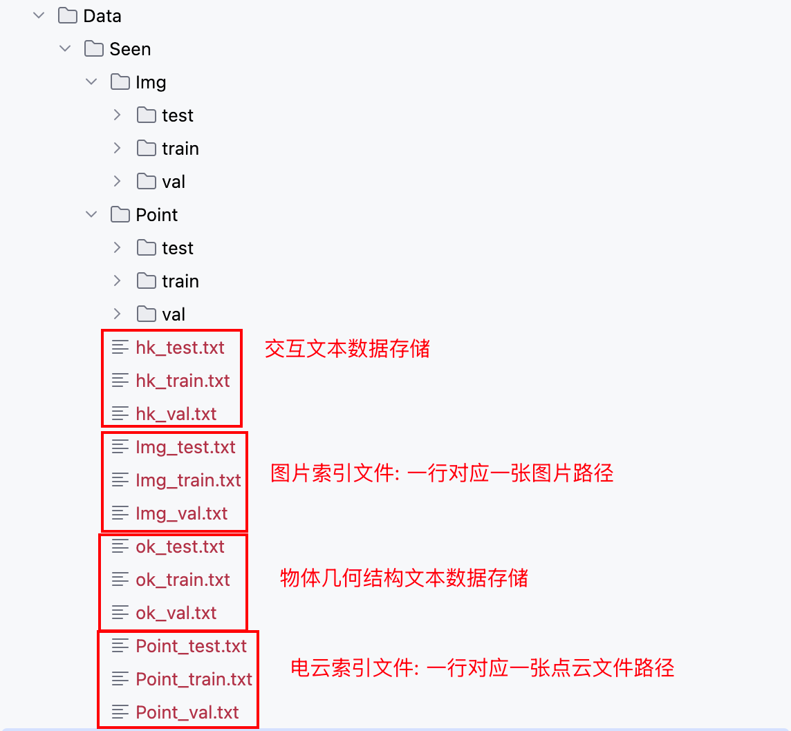

数据集的初始化:

```python
class PIAD(Dataset):
    def __init__(self, run_type, setting_type, point_path, img_path, text_hk_path, text_ok_path, pair=2, img_size=(224, 224)):
        super().__init__()

        self.run_type = run_type # 当前是训练/测试/验证环境
        self.p_path = point_path # 点云索引文件路径
        self.i_path = img_path  # 图片索引文件路径
        self.text_hk_path = text_hk_path # 物体几何结构文本数据文件路径
        self.text_ok_path = text_ok_path # 人类交互文本数据文件路径
        self.pair_num = pair  # 控制每个 图像样本 对应多少个 3D点云样本
        self.affordance_label_list = ['grasp', 'contain', 'lift', 'open', 
                        'lay', 'sit', 'support', 'wrapgrasp', 'pour', 'move', 'display',
                        'push', 'listen', 'wear', 'press', 'cut', 'stab', 'carry', 'ride',
                        'clean', 'play', 'beat', 'speak', 'pull']  # 24
        
        ...

        '''
        Seen
        '''  # 43

        if setting_type == 'Seen':
            number_dict = {'Bag': 0, 'Microphone': 0, 'Toothbrush': 0, 'TrashCan': 0, 'Bicycle': 0,
                           'Guitar': 0, 'Glasses': 0, 'Hat': 0, 'Microwave':0, 'Backpack': 0, 'Door':0, 'Scissors': 0, 'Bowl': 0,
                           'Baseballbat': 0, 'Mop': 0, 'Dishwasher': 0, 'Bed': 0, 'Keyboard': 0, 'Clock': 0, 'Vase': 0, 'Knife': 0,
                           'Suitcase': 0, 'Hammer': 0, 'Refrigerator': 0, 'Chair': 0, 'Umbrella': 0, 'Bucket': 0,
                           'Display': 0, 'Earphone': 0, 'Motorcycle': 0, 'StorageFurniture': 0, 'Fork': 0, 'Broom': 0, 'Skateboard': 0,
                           'Tennisracket': 0, 'Laptop': 0, 'Table':0, 'Bottle': 0, 'Faucet': 0, 'Kettle': 0, 'Surfboard': 0, 'Mug': 0,
                            'Spoon': 0 
                           }  
        
        # 读取所有图片路径，所有人类交互文本数据，所有物体几何结构文本数据
        self.img_files = self.read_file(self.i_path)
        self.text_human_files = self.read_file(self.text_hk_path)
        self.text_object_files = self.read_file(self.text_ok_path)
        self.img_size = img_size

        if self.run_type == 'train':
            # 读取所有点云路径，同时记录每类物体对应的样本总量，比如: 椅子对应的点云一共1000个
            self.point_files, self.number_dict = self.read_file(self.p_path, number_dict)
            self.object_list = list(number_dict.keys()) # 注意: Dict 按照key的插入顺序返回的
            self.object_train_split = {}
            start_index = 0
            # 记录每个物体对应的点云索引下标区间
            for obj_ in self.object_list:
                temp_split = [start_index, start_index + self.number_dict[obj_]]
                self.object_train_split[obj_] = temp_split
                start_index += self.number_dict[obj_]
        else:
            self.point_files = self.read_file(self.p_path)
```
**为什么我们需要pair_num参数?**

- 问题背景：GREAT 需要将 2D 交互图像（Image）与 3D 点云（Point Cloud）的特征进行对齐，但同一物体的不同实例可能有几何差异（例如不同形状的椅子）。

- 解决方案：通过为每张图像配对多个点云（pair_num > 1），模型能够学习从 多样化的几何变体 中提取共性的几何属性（如“可抓握”的共享结构特征），而不仅仅依赖单一实例。

- 代码体现：在 __getitem__ 中，训练时会对每个图像随机采样 pair_num 个同类别点云（见 point_sample_idx 的生成逻辑）

> GREAT 项目的数据组织中，将每个样本属于的物体类型，待预测功能区域类型全部隐含在了样本对应的文件路径中:
>
> 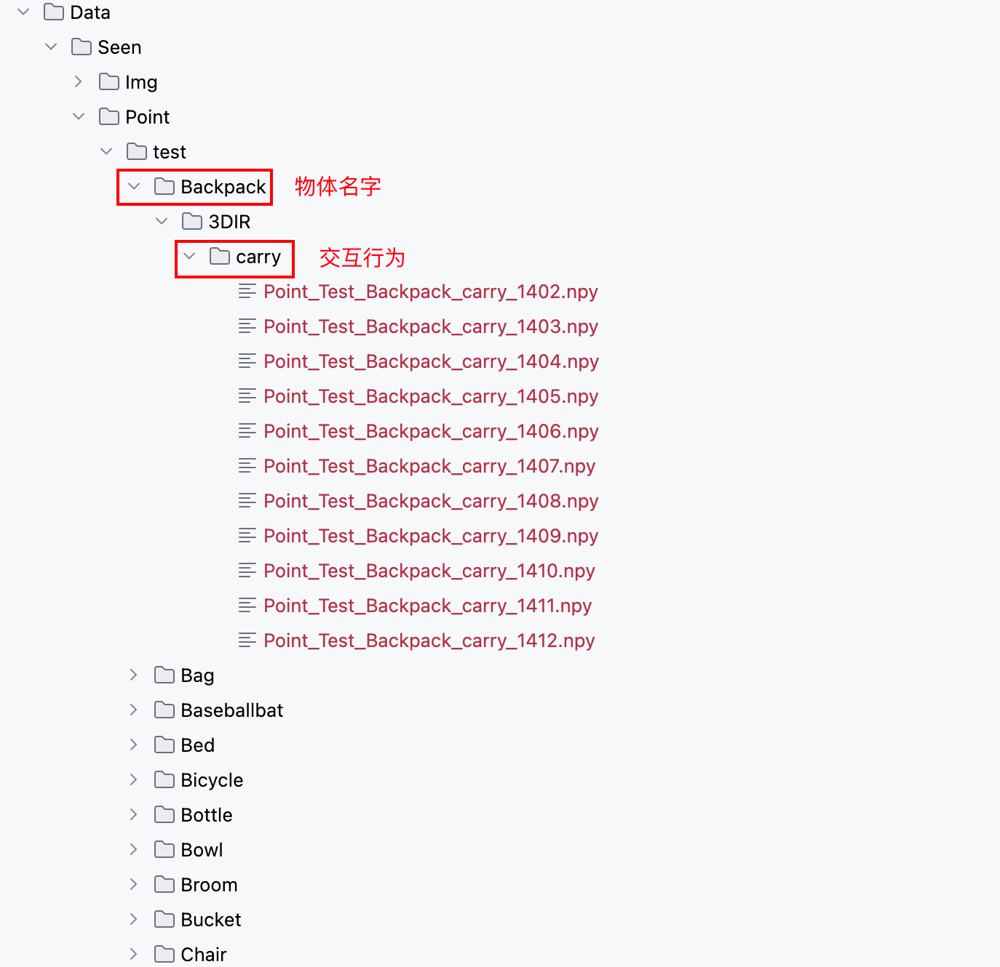

获取数据:

```python
    def __getitem__(self, index):
        # 1. 获取图片，人类交互文本，物体几何结构文本
        img_path = self.img_files[index]
        text_hd = self.text_human_files[index]
        text_od = self.text_object_files[index]
       
        # 2.1 评估时需要标准的单一样本对比
        if (self.run_type=='val'):
            point_path = self.point_files[index]
        else:
        # 2.2 从图片路径中截取得到物体名，交互行为名，点云索引下标区间  
            object_name = img_path.split('/')[-4]
            affordance_name = img_path.split('/')[-2]
            range_ = self.object_train_split[object_name]
            # 从索引区间中随机采样pair_num个点云样本
            point_sample_idx = random.sample(range(range_[0],range_[1]), self.pair_num)
      
            # 3. 加载点云样本，同时判断是否与当前图片交互行为一致，不一致则重新随机选
            for i ,idx in enumerate(point_sample_idx):
                while True:
                    point_path = self.point_files[idx]
                    sele_affordance = point_path.split('/')[-2]
                    if sele_affordance == affordance_name:
                        point_sample_idx[i] = idx 
                        break
                    else:
                        idx = random.randint(range_[0],range_[1]-1)  # re-select idx
         
        Img = Image.open(img_path).convert('RGB')
        
        if(self.run_type == 'train'):
            Img = Img.resize(self.img_size)
            Img = img_normalize_train(Img)
            
            # 4. 加载列表中所有点云样本
            Points_List = []
            affordance_label_List = []
            affordance_index_List = []
            for id_x in point_sample_idx:
                point_path = self.point_files[id_x]
                # 加载点云数据和功能区域掩码(功能区域热力图)
                Points, affordance_label = self.extract_point_file(point_path) # （2048，3）
                Points,_,_ = pc_normalize(Points)
                Points = Points.transpose() # (3,2048)
                affordance_index = self.get_affordance_label(img_path) # 当前点云待预测的交互行为/功能区域类型
                Points_List.append(Points)  # 点云
                affordance_label_List.append(affordance_label) # 功能区域热力图
                affordance_index_List.append(affordance_index) # 待预测功能区域类型

        else:
            Img = Img.resize(self.img_size)
            Img = img_normalize_train(Img)

            Point, affordance_label = self.extract_point_file(point_path)
            Point,_,_ = pc_normalize(Point)
            Point = Point.transpose()
 
        if(self.run_type == 'train'):
            # 图片 ， 交互信息文本，物体几何结构文本，点云样本列表，功能区域热力图列表，待预测功能区域类型列表
            return Img, text_hd, text_od, Points_List, affordance_label_List, affordance_index_List
        else:
            return Img, text_hd, text_od, Point, affordance_label, img_path, point_path
```
### 模型

```python
class GREAT(nn.Module):
    ... 
    def forward(self, img, xyz, text_human, text_object):

        '''
        img: [B, 3, H, W]
        xyz: [B, 3, 2048]
        '''
       
        B, C, N = xyz.size()
        # 1. 用Resnet18对图像进行编码，返回的高维隐向量维度为 (batch,512,7,7) -- （batch,channel,h,w)
        F_I = self.img_encoder(img)     
        #   维度展平(batch,channel,h*w)
        F_i = F_I.view(B, self.emb_dim, -1)         
        
        # 2， PointNet++ 对点云进行编码
        F_p_wise = self.point_encoder(xyz)
        # 3. Roberta 对交互文本和几何结构文本进行编码
        T_h= self.text_encoder(text_human) # (batch,3,512)
        T_o = self.text_encoder2(text_object) # (batch,1,512)
        
        # 4. 交互文本和几何结构文本的信息通过改良的交叉注意力机制进行交互融合
        T_h_, T_o_ =self.affordance_dictionary_fusion(T_h, T_o)  # 维度同上，均保持不变

        # 5. 交互文本信息与图像信息进行融合
        I_h = self.img_text_fusion(F_i,T_h_)   # (batch,512,49)
        
        # 6. 几何结构文本信息与点云信息进行融合，然后进入pointnet++的特征传播阶段(插值阶段)，最后再与I_h进行交互融合
        _3daffordance = self.decoder(T_o_, I_h.permute(0,2,1), F_p_wise) # T_o_(batch,1,512)，I_h.permute(batch,49,512)，点云特征 
        
        return _3daffordance
```
#### 文本编码

使用 RoBerta 对交互文本和几何结构文本进行编码这块，需要注意在对交互文本进行编码时，会按照 "," 将文本切分为多个句子，对每个句子独立进行编码:

```bash
原始交互文本:

pour the liquid from the spout of the kettle using people’s hand, grasp the kettle using person's hand around handle, open the kettle using people's fingers on the lid

切分后:

pour the liquid from the spout of the kettle using people’s hand
grasp the kettle using person's hand around handle
open the kettle using people's fingers on the lid
```

这样做的原因是因为交互文本由当前图片反映的交互行为和模型额外补充的当前物体存在的其他交互行为构成，他们之间的关系是独立的。而几何结构文本则是单一连贯的几何描述，无需切分，直接对整句进行编码。

#### 改良的交叉注意力

人类通过同时分析物体的 功能意图（如"倒水"）和 几何属性（如"壶嘴的形状"）来推断交互可能性。交叉注意力模拟了这种双向推理过程，通过建立意图与几何的显式关联，实现类似人类的类比推理能力。

```python
class Cross_Attention(nn.Module):    
    ...
    def forward(self, hk, ok):

        '''
        hk : human knowledge [B,N_hk,C]
        ok : object knowledge [B,N_ok,C]
        '''

        # 用意图文本（如"pour"）筛选相关的几何特征（强化"壶嘴"结构，弱化"把手"）
        hk_q = self.proj_hq(hk)                                        
        ok_key = self.proj_ok(ok)                                       
        ok_value = self.proj_ov(ok)

        ok_key_ = torch.cat((hk_q,ok_key),dim=1)  # 强化人类意图在物体语义推理中的引导作用
        ok_value_ = torch.cat((hk_q,ok_value),dim=1) 

        atten_I1 = torch.bmm(hk_q, ok_key_.permute(0, 2, 1))*self.scale                 
        atten_I1 = atten_I1.softmax(dim=-1)                        
        I_1 = torch.bmm(atten_I1, ok_value_)  

        I_1 = self.layernorm(hk + I_1) 

        # 用几何结构（如"cylindrical handle"）修正意图理解（排除与几何矛盾的意图）
        ok_q = self.proj_oq(ok)
        hk_key = self.proj_hk(hk)
        hk_value = self.proj_hv(hk)

        hk_key_ = torch.cat((ok_q,hk_key),dim=1)  # 利用物体结构辅助推断更多人类交互意图
        hk_value_ = torch.cat((ok_q,hk_value),dim=1)
                              
        atten_I2 = torch.bmm(ok_q, hk_key_.permute(0, 2, 1))*self.scale                 
        atten_I2 = atten_I2.softmax(dim=-1)
        I_2 = torch.bmm(atten_I2, hk_value_)                              
                                
        I_2 = self.layernorm(ok + I_2)    
        return I_1, I_2
```
#### 几何结构信息与交互信息的融合


```python
class affordance_dictionary_fusion(nn.Module):
    ...
    def forward(self,f_hk,f_ok):
        # 第一阶段：语义对齐（cross attention）➜ 把 Human 与 Object 信息“连接”起来
        H, O = self.cross_atten(f_hk, f_ok)
        # 第二阶段：结构融合（self attention）➜ 在 Human 内部或 Object 内部 “整理、总结、泛化”          
        H_= self.h_atten(H)
        O_= self.o_atten(O)
        return H_, O_
```
#### 交互信息与图像特征的融合

```python
class img_text_fusion(nn.Module):
    def __init__(self, emb_dim = 512, proj_dim = 512):
        class SwapAxes(nn.Module):
            def __init__(self):
                super().__init__()
            
            def forward(self, x):
                return x.transpose(1, 2)
        super().__init__()

        self.emb_dim = emb_dim
        self.proj_dim = proj_dim
        self.fusion = nn.Sequential(
            nn.Conv1d(2*self.emb_dim, self.emb_dim, 1, 1),
            nn.BatchNorm1d(self.emb_dim),
            nn.ReLU()
        )         
        self.reshape = nn.Sequential(
            nn.Linear(3, 3 * 8), # (batch,512,24)
            SwapAxes(), # (batch,24,512)
            nn.BatchNorm1d(3 * 8),
            nn.ReLU(),
            SwapAxes(), # (batch,512,24)
            nn.Linear(3 * 8, 49), # （batch,512,49)
        )

    # F_i (batch,512,49) --> (batch,channel,H*W) 
    def forward(self,F_i,T_h_):    
        # T_h_(batch,3,512) ---> 转置后 (batch,512,3) --> reshape后 (batch,512,49)
        T_h_ = self.reshape(T_h_.permute(0,2,1))
        # 拼接后: (batch,1024,49)  
        I_ = torch.cat((F_i, T_h_),dim=1)
        # 通道维度上进行特征融合，同时降维: (batch.512,49)
        I_ = self.fusion(I_)  
        return I_
```
#### 解码阶段

```python
class Decoder(nn.Module):
    def __init__(self, additional_channel, emb_dim, proj_dim):
        class SwapAxes(nn.Module):
            def __init__(self):
                super().__init__()
            
            def forward(self, x):
                return x.transpose(1, 2)
        super().__init__()
        
        self.emb_dim = emb_dim
        self.proj_dim = proj_dim
        #upsample
        self.fp3 = PointNetFeaturePropagation(in_channel=512+self.emb_dim, mlp=[768, 512])   
        self.fp2 = PointNetFeaturePropagation(in_channel=832, mlp=[768, 512])  
        self.fp1 = PointNetFeaturePropagation(in_channel=518+additional_channel, mlp=[512, 512]) 

        self.cmff = Cross_Modal_Feature_Fusion(emb_dim, proj_dim)
        self.out_head = nn.Sequential(
            nn.Linear(self.emb_dim, self.emb_dim // 8),
            SwapAxes(),
            nn.BatchNorm1d(self.emb_dim // 8),
            nn.ReLU(),
            SwapAxes(),
            nn.Linear(self.emb_dim // 8, 1),
        )
        self.reshape = nn.Sequential(
            nn.Linear(49, 49 * 8),
            SwapAxes(),
            nn.BatchNorm1d(49 * 8),
            nn.ReLU(),
            SwapAxes(),
            nn.Linear(49 * 8, 2048),
        )          
        self.sigmoid = nn.Sigmoid()
        self.fusion = nn.Sequential(
            nn.Conv1d(2*self.emb_dim, self.emb_dim, 1, 1),
            nn.BatchNorm1d(self.emb_dim),
            nn.ReLU()
        )  
    
    def forward(self, T_o, I_h, encoder_p):

        '''
        T_o --->object knowledge embedding   (batch,1,512)
        I_h ---> [B, N_i, C] (batch,49,512)
        encoder_p  ---> [Hierarchy feature] 
        '''
        B, _, _ = I_h.shape

        # p_i[1]: (1,3,2048) , （1，320，512) , (1,512,128) , (1,512,64) --> (batch,features,points)
        # p_i[0] 为坐标
        p_0, p_1, p_2, p_3 = encoder_p  # 逐层点云特征列表
        
        # 1. 传入数据维度: (1,1,512) , (1,64,512) , 点云特征和几何结构特征做特征融合
        p_3[1] = self.cmff(T_o, p_3[1].transpose(-2, -1)) # (1,512,64)

        # 2. 进入PointNet++经典的特征传播阶段
        up_sample = self.fp3(p_2[0], p_3[0], p_2[1], p_3[1]) # (1,512,128)
        
        up_sample = self.fp2(p_1[0], p_2[0], p_1[1], up_sample) # (1,512,512)  
        
        up_sample = self.fp1(p_0[0], p_1[0], torch.cat([p_0[0], p_0[1]],1), up_sample) # (1,512,2048) 
        
        # 3. I_h reshape后 (1,512,2048)
        F_I = self.reshape(I_h.permute(0,2,1))
        
        # 4. 图像交互信息与点云特征做融合: 拼接后，通道维度上进行特征融合，同时降维: (1,512,2048)
        F_j = torch.cat((F_I, up_sample),dim=1)
        F_j_fusion = self.fusion(F_j) 
        
        # 5. F_j_fusion.permute后(1,2048,512) --> (1,2048,1)
        _3daffordance = self.out_head(F_j_fusion.permute(0, 2, 1))                   
        _3daffordance = self.sigmoid(_3daffordance) # 生成功能区域掩码

        return _3daffordance
```   

##### 点云特征与几何结构特征的融合

```python
class Cross_Modal_Feature_Fusion(nn.Module):
    def __init__(self, emb_dim, proj_dim):
        class SwapAxes(nn.Module):
            def __init__(self):
                super().__init__()
            
            def forward(self, x):
                return x.transpose(1, 2)
        super().__init__()
        self.emb_dim = emb_dim
        self.proj_dim = proj_dim
        self.cross_atten1 = Cross_Attention(emb_dim = self.emb_dim, proj_dim = self.proj_dim)

        # 假设输入数据维度为 (1,64,512) : 先降维，进行信息压缩
        self.fc = nn.Sequential(
            nn.Linear(self.emb_dim, self.emb_dim//2), # (1,64,256) 
            SwapAxes(), # (1,256,64) 
            nn.BatchNorm1d(self.emb_dim // 2),
            nn.ReLU(),
            SwapAxes(), # (1,64,256) 
            nn.Linear(self.emb_dim//2, self.emb_dim), # (1,64,512)
            SwapAxes(), # (1,512,64)
            nn.BatchNorm1d(self.emb_dim),
            SwapAxes(), # (1,64,512)
        )

        self.norm1 = nn.LayerNorm(self.emb_dim)
        self.norm2 = nn.LayerNorm(self.emb_dim)
        self.pool = nn.AdaptiveAvgPool1d(1)

        self.fusion = nn.Sequential(                                        
            nn.Conv1d(2*self.emb_dim, self.emb_dim, 1, 1),
            nn.BatchNorm1d(self.emb_dim),   
            nn.ReLU()        
        )

    # (1,1,512) , (1,64,512)    
    def forward(self,f_t,f_p):
        _, N_P, _ = f_p.size()
        # 1. 应用改良的交叉注意力机制
        f_to, f_po = self.cross_atten1(f_t, f_p)    

        # 2. 注意力后，加上经典的: x + FNN 
        f_to = f_to + self.fc(f_to)                     
        f_po = f_po + self.fc(f_po)

        # 3. f_to.permute维度(1,512,1) --> pool后(1,512,1)
        f_t_p = self.pool(f_to.permute(0,2,1))
        # 4. 维度扩展到64 --> (1,512,64)                 
        f_t_r = f_t_p.repeat(1, 1, N_P)               

        # 5. f_po.permute维度(1,512,64) --> 拼接后(1,1024,64) 
        joint = torch.cat((f_po.permute(0,2,1), f_t_r), dim = 1)
        # 6. 通道维度作信息融合(1,512,64)
        output = self.fusion(joint)   
        return output
```
