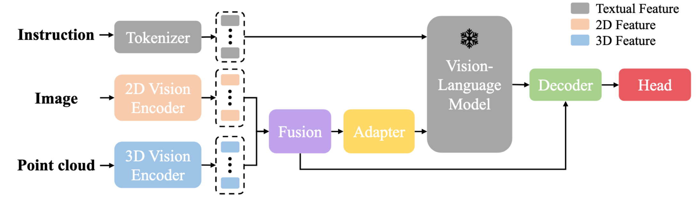

`Grounding 3D Object Affordance with Language Instructions, Visual  Observations and Interactions 论文代码解读与复现` 

<!-- more -->

# LMAffordance3D 模型代码解读与复现

> 论文: [https://arxiv.org/abs/2504.04744](https://arxiv.org/abs/2504.04744)
> 代码: [https://github.com/cn-hezhu/LMAffordance3D](https://github.com/cn-hezhu/LMAffordance3D)

## 环境配置 (待完善)

> 建议用Linux或者Windows系统进行测试，MacOS系统某些包的加载和依赖关系上存在问题，不方便进行处理。


## 模型结构



### LMAffordance3D 

```python
class LMAffordance3D(Blip2Base):
    ...
    def forward(self, img, point, description, label, inference_mode=False):
        '''
        img: [B, 3, H, W] -> 输入图像 (batch_size, channels, height, width)
        point: [B, 3, 2048] -> 点云数据 (batch_size, dimensions, num_points)
        description: 自然语言指令 (e.g., "Grasp the bottle")
        label: 真实标签，即每个点对应的 affordance 概率分布 (B, 2048, 1)
        inference_mode: 是否为推理模式（True/False）
        '''

        # 获取输入维度信息
        B, C, H, W = img.size()
        B, D, N = point.size()
        device = img.device  # 获取设备信息（CPU/GPU）

        # Step 1: 提取图像和点云的特征
        # --------------------------------------------------
        # 图像编码器：ResNet18 提取 2D 特征 F2D ∈ RB×CI×H×W
        img_feature = self.img_encoder(img)  # shape: [B, CI, H', W']

        # 点云编码器：PointNet++ 提取 3D 特征 F3D ∈ RB×CP×NP
        point_feature = self.point_encoder(point)  # shape: [B, CP, NP]

        # Step 2: 融合多模态空间特征
        # --------------------------------------------------
        # 使用 MLP 和自注意力机制融合图像与点云特征
        spatial_feature = self.fusion(img_feature, point_feature)  # shape: [B, NS, CS]
        
        # Step 3: 多模态特征投影到语言语义空间
        # --------------------------------------------------
        # 将融合后的空间特征通过适配器上采样到与语言模型匹配的维度
        if self.has_qformer:
            ...  # 如果使用 Q-Former，则进行额外处理
        else:
            multi_embeds = self.adapter_up(spatial_feature)  # shape: [B, NS, CL]
            image_atts = None  # 默认图像注意力掩码为空

        # Step 4: 对自然语言指令进行 Tokenization
        # --------------------------------------------------
        # 设置 tokenizer 的 padding 和 truncation 方向
        self.llm_tokenizer.padding_side = "right"
        self.llm_tokenizer.truncation_side = 'left'

        # 对语言指令进行分词，转换为 token ID 并生成 attention mask
        text_input_tokens = self.llm_tokenizer(
            description,
            return_tensors="pt",
            padding="longest",         # 填充至最长序列长度
            truncation=True,           # 截断过长文本
            max_length=self.max_txt_len,  # 最大文本长度
        ).to(device)

        # Step 5: 获取语言嵌入
        # --------------------------------------------------
        # 使用 LLM 的 embedding 层将 token ID 转换为嵌入向量
        inputs_embeds = self.llm_model.get_input_embeddings()(text_input_tokens.input_ids)
        # shape: [B, NL, CL] （NL=token数，CL=语言嵌入维度）

        # Step 6: 拼接多模态嵌入与语言嵌入
        # --------------------------------------------------
        # 调用 concat_input 函数，将图像+点云特征插入语言嵌入中
        llm_inputs, llm_attention_mask = self.concat_input(
            inputs_embeds, 
            text_input_tokens.attention_mask, 
            multi_embeds, 
            image_atts
        )
        # llm_inputs: [B, NL + NS, CL]
        # llm_attention_mask: [B, NL + NS]

        # Step 7: 使用 Vision-Language Model 进行联合推理
        # --------------------------------------------------
        # 在混合精度下运行 LLM，融合语言与视觉特征
        with self.maybe_autocast():
            hidden_states = self.llm_model(
                inputs_embeds=llm_inputs,
                attention_mask=llm_attention_mask,
                return_dict=False,  # 返回 tuple 格式输出
            )

        # Step 8: 降维适配器
        # --------------------------------------------------
        # 通过适配器层将 LLM 输出映射回合适维度
        hidden_states = self.adapter_down(hidden_states)  # shape: [B, NS + NL, CS]

        # 分割出 semantic feature 和 instructional feature
        # 视觉语义特征 和 语言指令理解特征
        semantic_feature, instructional_feature = torch.split(
            hidden_states, 
            split_size_or_sections=spatial_feature.size(1), 
            dim=1
        )

        # Step 9: 解码器融合所有特征以预测可操作性特征
        # --------------------------------------------------
        # 使用 cross-attention 融合 instruction, semantic, spatial features
        affordance_feature = self.affordance_decoder(
            spatial_feature, 
            instructional_feature, 
            semantic_feature
        )  # shape: [B, NA, CA]

        # Step 10: 使用分割头预测最终的 3D 可操作性热图
        # --------------------------------------------------
        out = self.head(spatial_feature, affordance_feature, point_feature)
        # 输出 shape: [B, 2048, 1]，表示每个点是否具有特定可操作性的概率

        # Step 11: 推理或训练分支
        # --------------------------------------------------
        if inference_mode == True:
            return out  # 仅返回预测结果
        else:
            loss_hm = self.loss_hm(out, label)  # 计算 heatmap 的损失（focal + dice）
            loss = loss_hm * self.w_hm  # 加权总损失
            return {
                "out": out, 
                "loss": loss, 
                "loss_hm": loss_hm
            }
```

### Step 2: 融合多模态空间特征

```python
class Fusion(nn.Module):
    def __init__(self, emb_dim = 512, num_heads = 4):
        super().__init__()
        self.emb_dim = emb_dim
        # 对点积结果进行缩放，防止 softmax 梯度消失或爆炸。
        self.div_scale = self.emb_dim ** (-0.5)
        self.num_heads = num_heads
       
        # 对图像和点云特征进行 非线性增强和空间对齐 ，使得它们能够在统一的语义空间中进行有效的跨模态交互。
        self.mlp = nn.Sequential(
            nn.Conv1d(self.emb_dim, 2*self.emb_dim, 1, 1),
            nn.BatchNorm1d(2*self.emb_dim),
            nn.ReLU(),
            nn.Conv1d(2*self.emb_dim, self.emb_dim, 1, 1),
            nn.BatchNorm1d(self.emb_dim),
            nn.ReLU()         
        )

        self.img_attention = Self_Attention(self.emb_dim, self.num_heads)
        self.point_attention = Self_Attention(self.emb_dim, self.num_heads)
        self.joint_attention = Self_Attention(self.emb_dim, self.num_heads)

    def forward(self, img_feature, point_feature):
        '''
        i_feature: [B, C, H, W]
        p_feature: [B, C, N_p]
        HW = N_i
        '''
        B, C, H, W = img_feature.size()
        img_feature = img_feature.view(B, self.emb_dim, -1)                            #[B, C, N_i]
        point_feature = point_feature[-1][1]
        
        # 对图像和点云特征进行 非线性增强和空间对齐 ，使得它们能够在统一的语义空间中进行有效的跨模态交互。
        p_feature = self.mlp(point_feature)
        i_feature = self.mlp(img_feature)
        
        # 跨模态注意力矩阵: 每个点云点与图像中每个位置之间的相似度得分
        phi = torch.bmm(p_feature.permute(0, 2, 1), i_feature)*self.div_scale          #[B, N_p, N_i]
       
        # 每列是一个 softmax 分布（每个图像位置对应的所有点云点）, 表示：“对于图像中的每一个位置，应该关注哪些点云点？”
        phi_p = F.softmax(phi,dim=1)
        # 每行是一个 softmax 分布（每个点云点对应的所有图像位置）, 表示：“对于点云中的每一个点，应该关注图像中的哪些位置？”
        phi_i = F.softmax(phi,dim=-1)  
       
        # I_enhance 是图像 patch 引导下提取的点云信息增强后的图像特征
        # 它不是直接包含原始图像 patch 的语义
        # 而是通过“点云中相关点”的方式重构图像 patch 的语义
        I_enhance = torch.bmm(p_feature, phi_p)                                        #[B, C, N_i]
        # P_enhance 是每个点云局部区域关键点引导下提取的图像信息增强后的点云关键点局部区域特征
        P_enhance = torch.bmm(i_feature, phi_i.permute(0,2,1))                         #[B, C, N_p]
       
        # 在跨模态融合后，进一步提取各自模态内部的语义一致性与结构关系，形成更稳定的联合表示。
        I = self.img_attention(I_enhance.mT)                                           #[B, N_i, C]
        P = self.point_attention(P_enhance.mT)                                         #[B, N_p, C]
        
        # 将图像patch和点云点拼接成一个统一的token序列
        # 使用自注意力机制提炼两个模态之间的语义一致性
        joint_patch = torch.cat((P, I), dim=1)                                       
        multi_feature = self.joint_attention(joint_patch)                              #[B, N_p+N_i, C]

        return multi_feature
```

### Step 3: 多模态特征投影到语言语义空间

```python
        # 将融合后的 3D 和 2D 特征从原始嵌入维度 (self.emb_dim) 映射到 LLM（语言模型）所使用的隐藏状态空间维度 （self.llm_model.config.hidden_size）。
        self.adapter_up = nn.Sequential(
            nn.Linear(self.emb_dim, self.emb_dim),
            nn.ReLU(),
            nn.Linear(self.emb_dim, self.llm_model.config.hidden_size)
        )
```

### Step 6: 拼接多模态嵌入与语言嵌入


```python
def concat_input(self, input_embeds, input_atts, multi_embeds, image_atts=None):
    '''
    将语言嵌入（text embeddings）与多模态嵌入（如图像、点云等）拼接在一起，
    构建 Vision-Language Model (VLM) 所需的输入格式。

    Args:
        input_embeds: (batch_size, sequence_length, hidden_size)
                      - 语言 token 经过 embedding 层后的结果。
        input_atts:   (batch_size, sequence_length)
                      - 语言部分的 attention mask（1 表示有效，0 表示填充）。
        multi_embeds: (batch_size, n, hidden_size)
                      - 多模态嵌入（如图像或点云特征），形状为 [B, n, H]。
        image_atts:   (batch_size, n), optional
                      - 多模态数据的 attention mask，默认为全 1（即所有 token 都有效）。

    Returns:
        llm_inputs:       (batch_size, total_length, hidden_size)
                        - 拼接后的输入嵌入，供 LLM 使用。
        llm_attention_mask: (batch_size, total_length)
                            - 对应的注意力掩码。
    '''

    # 初始化用于存储每个样本拼接后输入和 attention mask 的列表
    llm_inputs = []
    llm_attention_mask = []

    # 获取 batch size
    bs = multi_embeds.size()[0]

    # 对每个样本单独处理（逐个拼接）
    for i in range(bs):

        # 获取当前样本中多模态嵌入的维度信息：(n, dim)
        _, n, dim = multi_embeds.size()

        # 计算当前语言输入中有多少个有效 token（非 padding）
        this_input_ones = input_atts[i].sum()

        # 拼接嵌入向量：
        # 语言前半段（有效的部分）+ 多模态嵌入 + 语言后半段（padding 部分）
        llm_inputs.append(
            torch.cat([
                input_embeds[i][:this_input_ones],   # 有效语言部分
                multi_embeds[i],                     # 插入的多模态嵌入
                input_embeds[i][this_input_ones:]    # 剩余的语言 padding 部分
            ])
        )

        # 构建 attention mask：
        if image_atts is None:
            # 如果没有提供 image_atts，则默认多模态 token 都是有效的（mask 全为 1）
            llm_attention_mask.append(
                torch.cat([
                    input_atts[i][:this_input_ones],
                    torch.ones((n), device=multi_embeds.device, dtype=torch.long),
                    input_atts[i][this_input_ones:]
                ])
            )
        else:
            # 否则使用给定的 image_atts 来标记哪些多模态 token 是有效的
            llm_attention_mask.append(
                torch.cat([
                    input_atts[i][:this_input_ones],
                    image_atts[i],
                    input_atts[i][this_input_ones:]
                ])
            )

    # 将 list 转换为 batched tensor
    llm_inputs = torch.stack(llm_inputs, 0)
    llm_attention_mask = torch.stack(llm_attention_mask, 0)

    # 返回拼接好的输入和 attention mask
    return llm_inputs, llm_attention_mask
```

### Step 8: 降维适配器

```python
        # 降维适配器：将 LLM 输出的隐藏状态映射回原始嵌入维度（self.emb_dim）
        self.adapter_down = nn.Sequential(
            nn.Linear(self.llm_model.config.hidden_size, self.llm_model.config.hidden_size),
            nn.ReLU(),
            nn.Linear(self.llm_model.config.hidden_size, self.emb_dim)
        )
```

### Step 9: 解码器融合所有特征以预测可操作性特征

```python
class Affordance_Decoder(nn.Module):
    def __init__(self, emb_dim, proj_dim):
        super().__init__()
        self.emb_dim = emb_dim
        self.proj_dim = proj_dim
        self.cross_atten = Cross_Attention(emb_dim = self.emb_dim, proj_dim = self.proj_dim)
        self.fusion = nn.Sequential(
            nn.Conv1d(2*self.emb_dim, self.emb_dim, 1, 1),
            nn.BatchNorm1d(self.emb_dim),
            nn.ReLU()
        )

    def forward(self, query, key, value):
        '''
        query: [B, N_p + N_i, C]   -> spatial_feature (query)
        key:   [B, N_l, C]         -> instructional_feature (key)
        value: [B, N_l, C]         -> semantic_feature (value)
        '''
        B, _, C = query.size()

        # 调整 key 和 value 的形状为 [B, C, N_l]
        key = key.view(B, C, -1)  # [B, C, N_l]
        value = value.view(B, C, -1)  # [B, C, N_l]

        # 使用 cross attention 获取两个注意力加权结果
        Theta_1, Theta_2 = self.cross_atten(query, key.mT, value.mT)

        # 将两个注意力输出拼接在一起
        joint_context = torch.cat((Theta_1.mT, Theta_2.mT), dim=1)  # [B, 2C, N_p + N_i]

        # 使用 Conv1D 融合通道信息
        affordance = self.fusion(joint_context)  # [B, C, N_p + N_i]

        # 调整输出格式为 [B, N_p + N_i, C]
        affordance = affordance.permute(0, 2, 1)  # [B, N_p + N_i, C]

        return affordance
``` 
```python
class Cross_Attention(nn.Module):
    def __init__(self, emb_dim, proj_dim):
        """
        多模态交叉注意力模块（Cross-Attention Module），
        用于融合来自语言模型的不同语义信息，增强空间特征表达。

        Args:
            emb_dim: 输入特征维度（embedding dimension），例如 LLM 的 hidden size（如 4096）
            proj_dim: 投影维度，用于降低计算复杂度，在 attention 中使用
        """
        super().__init__()
        self.emb_dim = emb_dim
        self.proj_dim = proj_dim

        # 定义投影层，将输入映射到低维空间以进行 attention 计算
        self.proj_q = nn.Linear(self.emb_dim, proj_dim)   # query 投影
        self.proj_sk = nn.Linear(self.emb_dim, proj_dim)  # sub key 投影
        self.proj_sv = nn.Linear(self.emb_dim, proj_dim)  # sub value 投影
        self.proj_ek = nn.Linear(self.emb_dim, proj_dim)  # scene key 投影
        self.proj_ev = nn.Linear(self.emb_dim, proj_dim)  # scene value 投影

        # 缩放因子，用于 attention 分数归一化
        self.scale = self.proj_dim ** (-0.5)

        # 层归一化（LayerNorm），用于稳定训练过程
        self.layernorm = nn.LayerNorm(self.emb_dim)

    def forward(self, obj, sub, scene):
        """
        执行交叉注意力机制，融合不同来源的信息：
        - obj: 空间特征（spatial feature），作为 query；
        - sub: 指令理解特征（instructional feature），作为第一个 attention 的 key 和 value；
        - scene: 视觉语义特征（semantic feature），作为第二个 attention 的 key 和 value；

        Args:
            obj: [B, N_p + HW, C] → spatial_feature（query 来源）
            sub: [B, HW, C] → instructional_feature（key/value 来源之一）
            scene: [B, HW, C] → semantic_feature（key/value 来源之二）

        Returns:
            I_1: 经过 attention 加权后的输出（第一分支）
            I_2: 经过 attention 加权后的输出（第二分支）
        """

        B, seq_length, C = obj.size()  # 获取 batch size 和通道维度

        # 将输入分别投影到低维空间，便于后续 attention 计算
        query = self.proj_q(obj)                   # [B, N_q, proj_dim]
        s_key = self.proj_sk(sub)                  # [B, N_i, proj_dim]
        s_value = self.proj_sv(sub)                # [B, N_i, proj_dim]

        e_key = self.proj_ek(scene)                # [B, N_e, proj_dim]
        e_value = self.proj_ev(scene)              # [B, N_e, proj_dim]

        # 第一个 cross attention：使用 sub 的 key 和 value 增强 query
        atten_I1 = torch.bmm(query, s_key.mT) * self.scale  # [B, N_q, N_i]
        atten_I1 = atten_I1.softmax(dim=-1)                 # softmax 归一化
        I_1 = torch.bmm(atten_I1, s_value)                  # [B, N_q, proj_dim]

        # 第二个 cross attention：使用 scene 的 key 和 value 增强 query
        atten_I2 = torch.bmm(query, e_key.mT) * self.scale  # [B, N_q, N_e]
        atten_I2 = atten_I2.softmax(dim=-1)
        I_2 = torch.bmm(atten_I2, e_value)                 # [B, N_q, proj_dim]

        # 使用残差连接 + LayerNorm 增强稳定性
        I_1 = self.layernorm(obj + I_1)  # [B, N_q, emb_dim]
        I_2 = self.layernorm(obj + I_2)  # [B, N_q, emb_dim]

        return I_1, I_2
```
### Step 10: 使用分割头预测最终的 3D 可操作性热图

```python
class Head(nn.Module):
    def __init__(self, additional_channel, emb_dim, N_p, N_raw):
        """
        Head 模块用于最终的 3D 可操作性（affordance）预测。
        它接收来自编码器和解码器的特征，并通过多尺度上采样与融合，
        输出每个点云点的 affordance 热图（heatmap），表示该点是否具有可操作性。

        Args:
            additional_channel: 额外通道数，例如法向量、颜色等信息
            emb_dim: 特征维度（embedding dimension）
            N_p: point cloud token 数量（如 64）
            N_raw: 原始点云数量（如 2048）

        Notes:
            - 使用 PointNetFeaturePropagation 进行逐级上采样；
            - 结合全局池化增强语义表达；
            - 最终使用 MLP + Sigmoid 输出每个点的 affordance score；
        """
        super().__init__()
        
        self.emb_dim = emb_dim
        self.N_p = N_p         # point cloud token 数量
        self.N_raw = N_raw     # 原始点云数量（如 2048）

        # 多尺度上采样模块：PointNetFeaturePropagation
        # fp3: 输入为 [512 + emb_dim]，输出为 512 维度
        self.fp3 = PointNetFeaturePropagation(in_channel=512+self.emb_dim, mlp=[768, 512])  
        self.fp2 = PointNetFeaturePropagation(in_channel=832, mlp=[768, 512]) 
        self.fp1 = PointNetFeaturePropagation(in_channel=518+additional_channel, mlp=[512, 512]) 

        # 全局平均池化层，压缩时间/空间维度
        self.pool = nn.AdaptiveAvgPool1d(1)

        # 最终输出头：MLP + BatchNorm + ReLU + Sigmoid
        self.out_head = nn.Sequential(
            nn.Linear(self.emb_dim, self.emb_dim // 8),
            nn.BatchNorm1d(self.N_raw),      # 对点数维度做 BN
            nn.ReLU(),
            nn.Linear(self.emb_dim // 8, 1),  # 输出每个点的 affordance score
            nn.Sigmoid()                     # 输出范围 [0,1]，表示概率
        )

    def forward(self, multi_feature, affordance_feature, encoder_p):
        """
        执行 Head 模块的前向传播，生成最终的 3D affordance heatmap。

        Args:
            multi_feature:       [B, N_p + N_i, C] → 来自 Vision-Language Model 的拼接特征
            affordance_feature:  [B, N_p + N_i, C] → 来自 decoder 的可操作性特征
            encoder_p:           [p0, p1, p2, p3] → 编码器不同层级的点云特征

        Returns:
            out: [B, N_raw, 1] → 每个点的 affordance score（概率值）
        """

        B, N, C = multi_feature.size()

        # 解包编码器输出的不同层级特征
        p_0, p_1, p_2, p_3 = encoder_p

        # 从 multi_feature 和 affordance_feature 中提取 point cloud token 部分
        P_align, _ = torch.split(multi_feature, split_size_or_sections=self.N_p, dim=1)
        F_pa, _ = torch.split(affordance_feature, split_size_or_sections=self.N_p, dim=1)

        # 上采样过程：fp3 -> fp2 -> fp1
        up_sample = self.fp3(p_2[0], p_3[0], p_2[1], P_align.mT)  # [B, emb_dim, npoint_sa2]
        up_sample = self.fp2(p_1[0], p_2[0], p_1[1], up_sample)   # [B, emb_dim, npoint_sa1]
        up_sample = self.fp1(p_0[0], p_1[0], torch.cat([p_0[0], p_0[1]], 1), up_sample)  # [B, emb_dim, N_raw]

        # 对 F_pa 做全局池化，得到一个全局语义向量
        F_pa_pool = self.pool(F_pa.mT)  # [B, emb_dim, 1]

        # 将全局语义向量扩展回原始点云数量，实现 feature-wise attention
        affordance = up_sample * F_pa_pool.expand(-1, -1, self.N_raw)  # [B, emb_dim, N_raw]

        # 输出 head：将特征映射到 0~1 的概率值，表示每个点是否具有可操作性
        out = self.out_head(affordance.mT)  # [B, N_raw, 1]

        return out
```


