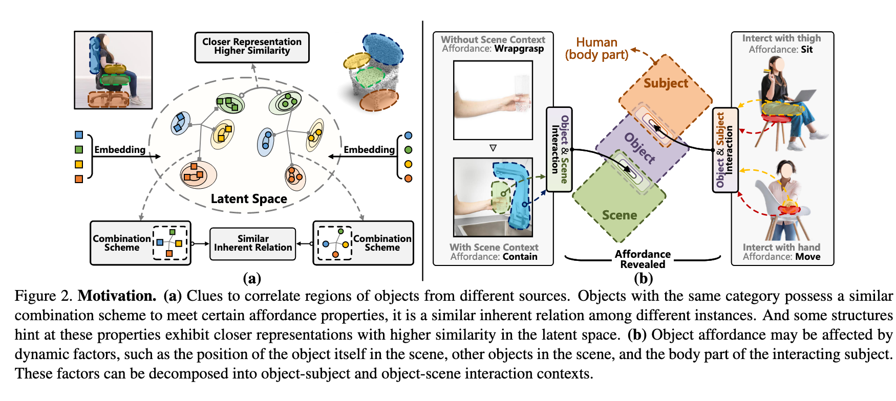
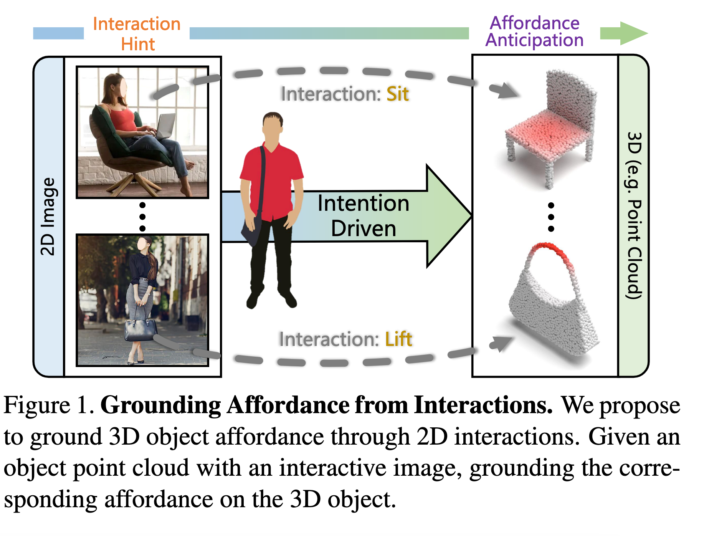
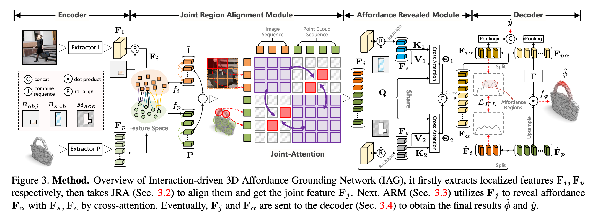
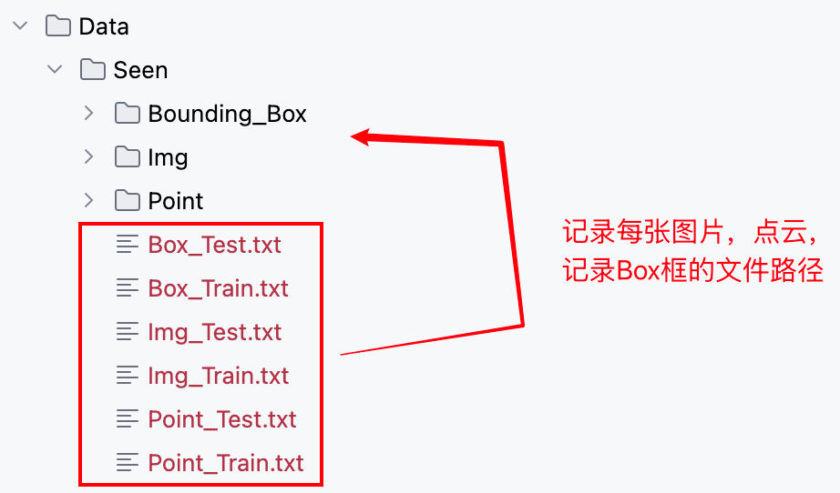

`Grounding 3D Object Affordance from 2D Interactions in Images 论文解读` 

<!-- more -->

> 论文: [https://arxiv.org/abs/2303.10437](https://arxiv.org/abs/2303.10437)
> 代码: [https://github.com/yyvhang/IAGNet](https://github.com/yyvhang/IAGNet)
> 数据集: [https://drive.google.com/drive/folders/1F242TsdXjRZkKQotiBsiN2u6rJAGRZ2W](https://drive.google.com/drive/folders/1F242TsdXjRZkKQotiBsiN2u6rJAGRZ2W)

## 摘要

这篇论文提出了一种新颖的任务设定：通过2D图像中的交互信息来预测3D物体的功能区域（affordance），旨在为具身智能体建立感知与操作之间的联系。作者设计了一个名为IAG（Interaction-driven 3D Affordance Grounding Network）的框架，通过联合区域对齐模块（JRA）解决不同来源物体区域的对齐问题，并通过功能揭示模块（ARM）建模交互上下文以明确功能区域。此外，作者还构建了一个包含图像-点云配对数据的数据集PIAD，用于支持该任务。实验结果表明，该方法在PIAD数据集上表现优异，验证了任务设定的可行性和方法的有效性。这一研究为功能学习领域提供了新的视角，并有望应用于机器人操作、增强现实等领域。

## 简介

Gibson（[2014](https://www.taylorfrancis.com/books/mono/10.4324/9781315740218/ecological-approach-visual-perception-james-gibson)）提出的“功能可供性”（affordance）概念，即物体支持的交互可能性，是连接具身智能体感知与操作的关键。现有研究主要分为两类：  

1. **几何结构映射方法**（如[11](https://openaccess.thecvf.com/content/CVPR2021/html/Deng_3D-AffordanceNet_A_Benchmark_for_Visual_Object_Affordance_Understanding_CVPR_2021_paper.html)、[22](https://ieeexplore.ieee.org/document/7139362)）通过标注物体交互区域建立几何结构与功能的固定关联，但泛化性受限，且对多功能的相似结构易产生混淆（如图2(b)中椅子的“坐”与“移动”功能）。  



2. **强化学习方法**（如[54](https://proceedings.neurips.cc/paper/2020/hash/6dd4e10e3296fa63738371ec0d5df818-Abstract.html)）通过智能体在虚拟环境中主动交互学习功能，但搜索空间大、耗时严重。  

**本文创新点**：  

- **任务设定**：首次提出通过2D交互图像预测3D物体功能区域（如图1），模拟人类通过观察学习物体功能的能力。  
- **核心挑战**：  
  - **对齐模糊性**：2D演示与3D物体来自不同实例，需跨源对齐区域（图2(a)展示同类物体的结构相似性可辅助对齐）。  
  - **功能模糊性**：同一物体区域可能支持多功能（如“杯子”既可“握持”也可“盛放”），需通过交互上下文建模解决（图2(b)）。  

**解决方案**：  
- **IAG框架**：包含**JRA模块**（通过密集跨模态相似性 $φ_{i,j}=\frac{e^{(P_i,I_j)}}{\sum e^{(P_i,I_j)}}$ 对齐区域）和**ARM模块**（通过交叉注意力建模物体-主体/场景交互以揭示功能）。  
- **PIAD数据集**：包含7,012个点云和5,162张图像，覆盖23类物体和17种功能，支持“可见”与“未见”场景的评估（图4）。  


**意义**：该方法摆脱了对几何标注或固定场景的依赖，为机器人操作、AR/VR等应用提供了更通用的功能理解范式。

## 相关工作

#### **1. 功能学习（Affordance Learning）**
现有研究可分为三类（如表1所示）：

- **2D功能检测**：  
  - 早期工作（如[12](https://ieeexplore.ieee.org/document/8460928)、[69](https://ieeexplore.ieee.org/document/9053830)）从图像/视频中分割功能区域，但无法定位具体交互部位。  
  - 语言辅助方法（如[36](https://ieeexplore.ieee.org/document/9200506)）结合文本描述提升语义理解。  

- **3D功能定位**：  
  - 基于几何映射的方法（如[11](https://openaccess.thecvf.com/content/CVPR2021/html/Deng_3D-AffordanceNet_A_Benchmark_for_Visual_Object_Affordance_Understanding_CVPR_2021_paper.html)）直接关联结构与功能，泛化性差。  
  - 强化学习方法（如[54](https://proceedings.neurips.cc/paper/2020/hash/6dd4e10e3296fa63738371ec0d5df818-Abstract.html)）通过智能体主动交互学习，但效率低。  

- **机器人操作应用**：  
  - 针对铰接物体（如[48](https://openaccess.thecvf.com/content/ICCV2021/html/Mo_Where2Act_From_Pixels_to_Actions_for_Articulated_3D_Objects_ICCV_2021_paper.html)）设计功能热图，指导抓取和运动规划。  

**本文区别**：首次通过**非配对**的2D-3D数据学习功能，摆脱几何标注和固定场景限制。

---

#### **2. 图像-点云跨模态学习**
现有方法依赖两类对齐策略：

- **空间先验对齐**：  
  - 基于相机参数（如[68](https://dl.acm.org/doi/10.1145/3474085.3479228)、[90](https://openaccess.thecvf.com/content/ICCV2021/html/Zhuang_Perception-Aware_Multi-Sensor_Fusion_for_3D_LiDAR_Semantic_Segmentation_ICCV_2021_paper.html)）将点云投影到图像平面，需严格的空间对应。  

- **特征空间对齐**：  
  - 无相机参数方法（如[1](https://arxiv.org/abs/2209.09552)、[6](https://dl.acm.org/doi/10.1145/3528233.3530731)）直接建模跨模态特征相似性。  

**本文创新**：利用功能-结构的隐式关联（如图2(a)），在无空间先验下实现跨源特征对齐。

## 方法

#### **1. 整体框架（IAG网络）**



如图3所示，IAG网络输入为四元组 $\{P,I,\mathcal{B},y\}$，其中：

- $P\in\mathbb{R}^{N\times3}$ 为点云坐标

- $I\in\mathbb{R}^{3\times H\times W}$ 为RGB图像

- $\mathcal{B}=\{B_{sub},B_{obj}\}$ 为图像中主体和物体的边界框

- $y$ 为功能类别标签

**处理流程**：
1. **特征提取**：

   - 图像分支：ResNet提取特征 $\mathbf{F}_1\in\mathbb{R}^{C\times H'\times W'}$

   - 点云分支：PointNet++提取特征 $\mathbf{F}_p\in\mathbb{R}^{C\times N_p}$

2. **区域定位**：

   - 通过ROI-Align获取物体/主体/场景特征 $\mathbf{F}_i,\mathbf{F}_s,\mathbf{F}_e\in\mathbb{R}^{C\times N_i}$（$N_i=H_1\times W_1$）

3. **联合区域对齐（JRA模块）**：

   - 计算密集跨模态相似性矩阵：
     $$
     \varphi_{i,j}=\frac{e^{(\mathbf{P}_i,\mathbf{I}_j)}}{\sum_{i=1}^{N_p}\sum_{j=1}^{N_i}e^{(\mathbf{P}_i,\mathbf{I}_j)}}
     $$

   - 通过自注意力建模模态内结构关系：
     $$
     \tilde{\mathbf{P}}=f_p(\mathbf{I}\cdot\varphi^T), \quad \tilde{\mathbf{I}}=f_i(\mathbf{P}\cdot\varphi)
     $$

   - 联合注意力生成对齐特征 $\mathbf{F}_j=f_\delta[\tilde{\mathbf{P}},\tilde{\mathbf{I}}]$

4. **功能揭示（ARM模块）**：

   - 交叉注意力建模交互上下文：
     $$
     \boldsymbol{\Theta}_{1/2}=\text{softmax}(\mathbf{Q}^T\cdot\mathbf{K}_{1/2}/\sqrt{d})\cdot\mathbf{V}_{1/2}^T
     $$

   - 融合生成功能表征 $\mathbf{F}_\alpha=f_\xi(\boldsymbol{\Theta}_1,\boldsymbol{\Theta}_2)$

5. **解码输出**：

   - 功能类别预测 $\hat{y}$：对 $\mathbf{F}_{po}$ 和 $\mathbf{F}_{io}$ 池化后拼接

   - 3D功能热图 $\hat{\phi}$：通过特征传播层上采样：
     $$
     \hat{\phi}=f_\phi(\text{FP}(\tilde{\mathbf{F}}_p)\odot\Gamma(\mathbf{F}_{po}))
     $$

#### **2. 损失函数**

总损失包含三项：

1. **功能分类损失** $\mathcal{L}_{CE}$：交叉熵损失监督 $\hat{y}$

2. **特征分布对齐损失** $\mathcal{L}_{KL}$：KL散度约束 $\mathbf{F}_{io}$ 与 $\tilde{\mathbf{F}}_i$ 分布：
   $$
   \mathcal{L}_{KL}=\sum_n \mathbf{F}_{io_n}\log(\epsilon+\frac{\mathbf{F}_{io_n}}{\epsilon+\tilde{\mathbf{F}}_{i_n}})
   $$

3. **热图回归损失** $\mathcal{L}_{HM}$：Focal Loss + Dice Loss监督 $\hat{\phi}$

最终损失为加权和：
$$
\mathcal{L}_{total}=\lambda_1\mathcal{L}_{CE}+\lambda_2\mathcal{L}_{KL}+\lambda_3\mathcal{L}_{HM}
$$

#### **3. 关键创新**

- **JRA模块**：通过跨模态相似性（$\varphi$）和联合注意力（$f_\delta$）实现无先验对齐

- **ARM模块**：通过双路交叉注意力分别建模物体-主体（$\boldsymbol{\Theta}_1$）和物体-场景（$\boldsymbol{\Theta}_2$）交互

- **互优化机制**：$\mathcal{L}_{KL}$ 使功能表征与对齐特征相互增强（如图15所示）

## 代码

### 数据集

> 数据集目录下的组织方式:
> 

1. 数据集初始化

```python
class PIAD(Dataset):
    def __init__(self, run_type, setting_type, point_path, img_path, box_path, pair=2, img_size=(224, 224)):
        super().__init__()

        self.run_type = run_type # train/val/test
        self.p_path = point_path
        self.i_path = img_path
        self.b_path = box_path # 记录物体边界框
        self.pair_num = pair
        self.affordance_label_list = ['grasp', 'contain', 'lift', 'open', 
                        'lay', 'sit', 'support', 'wrapgrasp', 'pour', 'move', 'display',
                        'push', 'listen', 'wear', 'press', 'cut', 'stab']
        
        ...                

        '''
        Seen
        '''
        if setting_type == 'Seen':
            number_dict = {'Earphone': 0, 'Bag': 0, 'Chair': 0, 'Refrigerator': 0, 'Knife': 0, 'Dishwasher': 0, 'Keyboard': 0, 'Scissors': 0, 'Table': 0, 
            'StorageFurniture': 0, 'Bottle': 0, 'Bowl': 0, 'Microwave': 0, 'Display': 0, 'TrashCan': 0, 'Hat': 0, 'Clock': 0, 
            'Door': 0, 'Mug': 0, 'Faucet': 0, 'Vase': 0, 'Laptop': 0, 'Bed': 0}

        # 读取出所有图片路径，存储了物体边界框文件路径 
        self.img_files = self.read_file(self.i_path)
        self.box_files = self.read_file(self.b_path)
        self.img_size = img_size

        if self.run_type == 'train':
           # 读取出所有点云文件路径,同时记录每类物体共对应多少不同的点云
            self.point_files, self.number_dict = self.read_file(self.p_path, number_dict)
            self.object_list = list(number_dict.keys())
            self.object_train_split = {}
            start_index = 0
            # 记录每类物体对应的点云文件下标索引区间
            for obj_ in self.object_list:
                temp_split = [start_index, start_index + self.number_dict[obj_]]
                self.object_train_split[obj_] = temp_split
                start_index += self.number_dict[obj_]
        else:
            self.point_files = self.read_file(self.p_path)
```
2. 获取数据

```python
    def __getitem__(self, index):
        # 1. 获取图片，Box框文件路径
        img_path = self.img_files[index]
        box_path = self.box_files[index]

        if (self.run_type=='val'):
            point_path = self.point_files[index]
        else:
            # 2. 从文件路径中提取物体名
            object_name = img_path.split('_')[-3]
            # 3. 一张图片对应多张同物体但形状不同的点云图片
            range_ = self.object_train_split[object_name]
            point_sample_idx = random.sample(range(range_[0],range_[1]), self.pair_num)

        Img = Image.open(img_path).convert('RGB')

        if(self.run_type == 'train'):
            # 4. 随机裁剪图片，同时获取裁剪后的物体框(交互主体框，目标物体框)
            Img, subject, object = self.get_crop(box_path, Img, self.run_type)
            # 5. 对图片进行缩放，同时等比例对物体框做同样的缩放
            sub_box, obj_box = self.get_resize_box(Img, self.img_size, subject, object)
            sub_box, obj_box = torch.tensor(sub_box).float(), torch.tensor(obj_box).float()
            Img = Img.resize(self.img_size)
            Img = img_normalize_train(Img)
            
            Points_List = []
            affordance_label_List = []
            affordance_index_List = []
            # 6. 加载点云
            for id_x in point_sample_idx:
                point_path = self.point_files[id_x]
                Points, affordance_label = self.extract_point_file(point_path)
                Points,_,_ = pc_normalize(Points)
                Points = Points.transpose()
                affordance_label, affordance_index = self.get_affordance_label(img_path, affordance_label)
                Points_List.append(Points)
                affordance_label_List.append(affordance_label)
                affordance_index_List.append(affordance_index)

        else:
            ...

        if(self.run_type == 'train'):
            # 7. 图片，点云列表，点云功能区域掩码列表，点云功能区域索引列表，交互主体框，目标物体框
            return Img, Points_List, affordance_label_List, affordance_index_List, sub_box, obj_box
        else:
            return Img, Point, affordance_label, img_path, point_path, sub_box, obj_box
```
### 模型

```python
class IAG(nn.Module):
    ...        
    def forward(self, img, xyz, sub_box, obj_box):

        '''
        img: [B, 3, H, W]
        xyz: [B, 3, 2048]
        sub_box: bounding box of the interactive subject
        obj_box: bounding box of the interactive object
        '''
        
        B, C, N = xyz.size()
        ...
        # 1. ResNet18 编码图像 (batch,512,7,7)
        F_I = self.img_encoder(img)
        # 2. 利用ROI Align技术，得到目标物体区域特征，交互主体区域特征，背景区域特征
        ROI_box = self.get_roi_box(B).to(device)
        F_i, F_s, F_e = self.get_mask_feature(img, F_I, sub_box, obj_box, device)
        # 背景区域特征图经过ROI Align映射为4*4大小的特征图
        # ROI_box 大小为 7*7 , 正好为resnet18最后生成的特征图的分辨率, 因为背景区域大小等于特征图大小
        F_e = roi_align(F_e, ROI_box, output_size=(4,4))
        # F_i (batch,512,4,4) , F_s (batch,512,4,4) , F_e (batch,512,4,4)

        # 3. PointNet编码点云
        # (B,3,2048) , (B,320,512) , (B,512,128) ， (B,512,64)
        F_p_wise = self.point_encoder(xyz)
        # 4. 建立目标物体局部交互区域到点云局部区域的特征对应映射关系 
        # (B,80,512)
        F_j = self.JRA(F_i, F_p_wise[-1][1])
        # 5. 结合交互主体和背景信息，推出交互区域信息
        # (B,80,512)
        affordance = self.ARM(F_j, F_s, F_e)
        # 6. 解码
        _3daffordance, logits, to_KL = self.decoder(F_j, affordance, F_p_wise)
         
        return _3daffordance, logits, to_KL
```

关于利用ROI Align技术，得到目标物体区域特征，交互主体区域特征，背景区域特征过程的实现细节如下:

```python
    def get_mask_feature(self, raw_img, img_feature, sub_box, obj_box, device):
        raw_size = raw_img.size(2)
        current_size = img_feature.size(2)
        B = img_feature.size(0)
        # 1. 计算经过下采样得到的特征图相比于原始图片的缩小比例
        scale_factor = current_size / raw_size
        # 2. 将交互主体框和目标物体框等比例缩小
        sub_box[:, :] = sub_box[:, :] * scale_factor
        obj_box[:, :] = obj_box[:, :] * scale_factor
        
        # 3. 根据目标物体框，将掩码图像中目标物体所在区域激活，得到目标物体区域掩码
        obj_mask = torch.zeros_like(img_feature)
        obj_roi_box = []
        for i in range(B):
            obj_mask[i,:, int(obj_box[i][1]+0.5):int(obj_box[i][3]+0.5), int(obj_box[i][0]+0.5):int(obj_box[i][2]+0.5)] = 1
            roi_obj = [obj_box[i][0], obj_box[i][1], obj_box[i][2]+0.5, obj_box[i][3]]  # 对交互主体框位置进行精细调整(just a trick)
            roi_obj.insert(0, i) # 插入批次索引 -- ROI Align对齐方法需要
            obj_roi_box.append(roi_obj)
        obj_roi_box = torch.tensor(obj_roi_box).float().to(device)

        sub_roi_box = []
        # 4. 根据交互主体框，在目标物体区域掩码之上，激活交互主体所在区域
        Scene_mask = obj_mask.clone()
        for i in range(B):
            Scene_mask[i,:, int(sub_box[i][1]+0.5):int(sub_box[i][3]+0.5), int(sub_box[i][0]+0.5):int(sub_box[i][2]+0.5)] = 1
            roi_sub = [sub_box[i][0], sub_box[i][1], sub_box[i][2], sub_box[i][3]]
            roi_sub.insert(0,i)
            sub_roi_box.append(roi_sub)
        # 5. 借助取反激活图片背景区域    
        Scene_mask = torch.abs(Scene_mask - 1)
        # 6. 拿到图片背景区域特征图
        Scene_mask_feature = img_feature * Scene_mask
        sub_roi_box = torch.tensor(sub_roi_box).float().to(device)
        # 7. 利用ROI Align技术，将目标物体区域框在特征图中框出的区域，映射为4*4大小的特征图
        obj_feature = roi_align(img_feature, obj_roi_box, output_size=(4,4), sampling_ratio=4)
        # 8. 利用ROI Align技术，将交互主体区域框在特征图中框出的区域，映射为4*4大小的特征图
        sub_feature = roi_align(img_feature, sub_roi_box, output_size=(4,4), sampling_ratio=4) 
        # 9. 返回目标物体区域特征图，交互主体区域特征图，背景区域特征图(未经ROI Align进行映射)
        return obj_feature, sub_feature, Scene_mask_feature
```

JRA 模块就是在图像和点云之间建立“局部区域级别”的对应关系，让 2D 交互信号能准确落到 3D 对象上；具体来说:

1. 图像分支提取到的是 2D 目标区域的特征，包含了交互提示（比如“人手接触杯子的边缘”）；

2. 点云分支提取到的是 3D 物体点云的区域特征，包含了几何结构（比如“杯子的边缘曲面”）；

3. JRA 模块通过 " 投影统一 → 跨模态相似性匹配 → 局部自注意力 → 全局自注意力 " ，在共享空间里把图像的局部区域和点云的局部区域对应起来；

4. 这样，模型就能理解“图像里交互的这部分 → 点云里对应的这部分结构”，为后续 3D affordance grounding 提供支撑。

```python
class Joint_Region_Alignment(nn.Module):
    def __init__(self, emb_dim = 512, num_heads = 4):
        super().__init__()
        class SwapAxes(nn.Module):
            def __init__(self):
                super().__init__()
            
            def forward(self, x):
                return x.transpose(1, 2)
        self.emb_dim = emb_dim
        self.div_scale = self.emb_dim ** (-0.5)
        self.num_heads = num_heads

        self.to_common = nn.Sequential(
            nn.Conv1d(self.emb_dim, 2*self.emb_dim, 1, 1),
            nn.BatchNorm1d(2*self.emb_dim),
            nn.ReLU(),
            nn.Conv1d(2*self.emb_dim, self.emb_dim, 1, 1),
            nn.BatchNorm1d(self.emb_dim),
            nn.ReLU()         
        )

        self.i_atten = Inherent_relation(self.emb_dim, self.num_heads)
        self.p_atten = Inherent_relation(self.emb_dim, self.num_heads)
        self.joint_atten = Inherent_relation(self.emb_dim, self.num_heads)

    def forward(self, F_i, F_p):
        '''
        i_feature: [B, C, H, W]
        p_feature: [B, C, N_p]
        HW = N_i
        '''
        
        B,_,N_p = F_p.size() # (B,512,64)
        # 1. 物体区域特征图展平: (B,512,4,4) --> (B,512,4*4)
        F_i = F_i.view(B, self.emb_dim, -1)                                             #[B, C, N_i]
        
        # 2. 通过共享MLP迫使图像和点云特征在相同空间分布，消除模态差异
        I = self.to_common(F_i) # (B,512,16)
        P = self.to_common(F_p) # (B,512,64)
        
        # 3. 计算相似度矩阵: (B,64,512) * (B,512,16) = (B,64,16)
        phi = torch.bmm(P.permute(0, 2, 1), I)*self.div_scale                           #[B, N_p, N_i]
        phi_p = F.softmax(phi,dim=1) # 计算特征图中每个点和点云每个点特征的相似度
        phi_i = F.softmax(phi,dim=-1) # 计算点云中每个点和特征图中每个点特征的相似度

        # 4. 特征增强(按照相似度完成信息融合 + 自注意力完成内部信息建模)
        I_enhance = torch.bmm(P, phi_p)  # (B,512,64) * (B,64,16) = （B,512,16）          [B, C, N_i]
        P_enhance = torch.bmm(I, phi_i.permute(0,2,1)) # (B,512,16) * (B,16,64) = （B,512,64）  [B, C, N_p]
        I_ = self.i_atten(I_enhance.mT)                                                 #[B, N_i, C]
        P_ = self.p_atten(P_enhance.mT)                                                 #[B, N_p, C]
        # I_ (B,16,512) , P_ (B,64,512)
        
        # 5. 联合建模: 拼接 (B,80,512)  +  自注意力
        joint_patch = torch.cat((P_, I_), dim=1)                                       
        F_j = self.joint_atten(joint_patch)                                             #[B, N_p+N_i, C]

        return F_j
```


ARM 的任务是：**在对齐后的 joint feature 基础上，融合交互主体和环境的语义线索，显式地“揭示”出物体上可能的 affordance 区域。**

换句话说，它要回答：

> “在这个交互场景里，物体的哪一部分因为主体和环境的作用而具备可交互潜能？”

1. **上下文注入 (Context injection)**

   * `F_s` 提供“谁在和物体交互”（比如人手/手臂）
  
   * `F_e` 提供“交互发生的场景背景”
  
   * 将这些信息和 `F_j` 融合，可以避免仅凭物体几何去猜 affordance。

2. **显式区域挖掘 (Explicit affordance mining)**

   * 对齐特征 `F_j` 已经把“图像交互提示区域 ↔ 点云几何局部”对应起来，但还没有明确说“这里就是 affordance 区域”。
  
   * ARM 进一步处理后，输出一个更抽象的 **affordance 语义表示**，告诉 decoder 哪些区域应该被激活。

3. **输出 → 送入 Decoder**

   * `affordance` 被送进 `self.decoder(F_j, affordance, F_p_wise)`
  
   * Decoder 再结合原始点云逐点特征，把这些抽象语义转化为 **点级别的 affordance mask**。

可以把 **JRA + ARM** 的关系想成：

* **JRA**：帮你在“交互图片里的区域” 和 “点云里的几何部分”之间拉了一根线（对齐）。

* **ARM**：在这根线的两端加上“语义电流”（主体 & 背景），让网络明确知道哪些区域真正具备 **affordance**。

**ARM 模块的作用是将 JRA 对齐得到的图像–点云联合特征，与交互主体和环境语义结合，挖掘并生成显式的 affordance 表示，为 Decoder 输出逐点 affordance mask 提供语义指导。**

```python
class Affordance_Revealed_Module(nn.Module):
    def __init__(self, emb_dim, proj_dim):
        class SwapAxes(nn.Module):
            def __init__(self):
                super().__init__()
            
            def forward(self, x):
                return x.transpose(1, 2)
        super().__init__()
        self.emb_dim = emb_dim
        self.proj_dim = proj_dim
        self.cross_atten = Cross_Attention(emb_dim = self.emb_dim, proj_dim = self.proj_dim)
        self.fusion = nn.Sequential(
            nn.Conv1d(2*self.emb_dim, self.emb_dim, 1, 1),
            nn.BatchNorm1d(self.emb_dim),
            nn.ReLU()
        )

    def forward(self, F_j, F_s, F_e):

        '''
        F_j: [B, N_p + N_i, C]  (B,80,512) 物体区域特征和点云特征的联合建模
        F_s: [B, H, W, C]  (B,512,4,4)  交互区域特征
        F_e: [B, H, W, C]  (B,512,4,4)  背景特征
        '''

        B,_,C = F_j.size()

        # 拉平: (B,512,4,4) --> (B,512,4*4)
        F_s = F_s.view(B, C, -1)                                        #[B, N_i, C]
        F_e = F_e.view(B, C, -1)                                        #[B, N_i, C]
        # 利用联合建模特征作为query，从目标主体区域特征和背景特征中提取相关信息分别单独加到自己身上
        Theta_1, Theta_2 = self.cross_atten(F_j, F_s.mT, F_e.mT)        #[B, C, N_p + N_i]

        # 通道维度完成拼接后，利用1x1卷积完成通道维度上的信息融合 
        joint_context = torch.cat((Theta_1.mT, Theta_2.mT), dim=1)      #[B, 2C, N_p + N_i]
        affordance = self.fusion(joint_context)                         #[B, C, N_p + N_i]
        affordance = affordance.permute(0, 2, 1)                        #[B, N_p + N_i, C]

        return affordance # （B,80,512)
```
Decoder 就是把前面 **JRA + ARM 得到的抽象特征**，一步步还原到 **原始点云的每个点**，最后给出两个结果：

1. **全局层面**：预测这个物体整体具有什么交互功能（比如“能拿”“能坐”“能放东西”）。

2. **局部层面**：告诉你物体表面 **哪些点**是和交互有关的区域（也就是 3D affordance mask）。

所以它同时负责 **“大方向” + “具体部位”** 的预测。

前向传播流程:

1. **特征对齐后的输入**

   * JRA 已经让图像区域和点云局部对齐，ARM 又融入了主体和环境的语义，得到“带交互语义的联合特征”。
   
   * Decoder 接收这些特征 + 编码器逐层保存的点云特征。

2. **逐层上采样（放大还原）**

   * 前面的特征比较抽象、分辨率低（只对应少量点）。
  
   * Decoder 通过 PointNet 的上采样机制，把这些特征一步步“还原”到原始点云的 2048 个点上。
  
   * 这样，每个点都有了和交互语义相关的描述。

3. **全局汇总（整体分类）**

   * 对所有点的特征做池化，相当于“压缩成一句总结”。
  
   * 这一步用来预测物体整体的 affordance 类型。

4. **逐点预测（局部掩码）**

   * 同时，Decoder 把全局的交互语义再传播回每一个点。

   * 每个点得到一个概率值：是否属于可交互区域。
   
   * 输出就是一个点云上的 **热力图**，高值区域就是 affordance 部位。

```python
class Decoder(nn.Module):
    def __init__(self, additional_channel, emb_dim, N_p, N_raw, num_affordance):
        """
        Decoder 模块
        参数:
            additional_channel: 附加输入通道数
            emb_dim: 特征嵌入维度
            N_p: 点云子集数量 (point number for part/point-level alignment)
            N_raw: 原始点云点数
            num_affordance: affordance 分类数量
        """

        class SwapAxes(nn.Module):
            """交换张量的第1维和第2维, 用于Linear/BN的维度匹配"""
            def __init__(self):
                super().__init__()
            
            def forward(self, x):
                # x: [B, N, C] -> [B, C, N]
                return x.transpose(1, 2)

        super().__init__()
        
        self.emb_dim = emb_dim
        self.N_p = N_p
        self.N = N_raw
        self.num_affordance = num_affordance

        # ---------- 特征传播层 (PointNet++ Feature Propagation) ----------
        # 逐层上采样，将 encoder 输出的层次化点特征恢复到原始点数 N
        self.fp3 = PointNetFeaturePropagation(in_channel=512+self.emb_dim, mlp=[768, 512])  
        self.fp2 = PointNetFeaturePropagation(in_channel=832, mlp=[768, 512]) 
        self.fp1 = PointNetFeaturePropagation(in_channel=518+additional_channel, mlp=[512, 512]) 

        # 全局池化 (用于 part-level 和 image-level 特征压缩)
        self.pool = nn.AdaptiveAvgPool1d(1)   # 输入 [B, C, N] -> 输出 [B, C, 1]

        # ---------- 输出头 (3D affordance 预测) ----------
        self.out_head = nn.Sequential(
            nn.Linear(self.emb_dim, self.emb_dim // 8),  # [B, N, C] -> [B, N, C/8]
            SwapAxes(),                                  # [B, N, C/8] -> [B, C/8, N] 方便 BatchNorm1d
            nn.BatchNorm1d(self.emb_dim // 8),
            nn.ReLU(),
            SwapAxes(),                                  # [B, C/8, N] -> [B, N, C/8]
            nn.Linear(self.emb_dim // 8, 1),             # [B, N, C/8] -> [B, N, 1]
        )

        # ---------- 分类头 (affordance 分类) ----------
        self.cls_head = nn.Sequential(
            nn.Linear(2*self.emb_dim, self.emb_dim // 2),      # [B, 2C] -> [B, C/2]
            nn.BatchNorm1d(self.emb_dim // 2),
            nn.ReLU(),
            nn.Linear(self.emb_dim // 2, self.num_affordance), # [B, C/2] -> [B, num_affordance]
            nn.BatchNorm1d(self.num_affordance)
        )

        self.sigmoid = nn.Sigmoid()


    def forward(self, F_j, affordance, encoder_p):
        """
        前向传播
        输入:
            F_j: [B, N_p + N_i, C]  (joint features, part/image 对齐后的特征)
            affordance: [B, N_p + N_i, C] (affordance 特征)
            encoder_p: [p0, p1, p2, p3] (encoder 分层特征, PointNet++ 输出)
        输出:
            _3daffordance: [B, N, 1]  (点云每个点的 affordance 激活概率)
            logits: [B, num_affordance] (全局 affordance 分类结果)
            [F_ia^T, I_align^T]: [B, C, N_i], [B, C, N_i] (image-aligned features)
        """

        B, _, _ = F_j.size()
        p_0, p_1, p_2, p_3 = encoder_p

        # --- 将 joint feature 拆成 part-aligned (P_align) 和 image-aligned (I_align) ---
        P_align, I_align = torch.split(F_j, split_size_or_sections=self.N_p, dim=1)     
        # P_align: [B, N_p, C]
        # I_align: [B, N_i, C]

        # --- 将 affordance 特征拆分为 part-level 和 image-level ---
        F_pa, F_ia = torch.split(affordance, split_size_or_sections=self.N_p, dim=1)  
        # F_pa: [B, N_p, C]
        # F_ia: [B, N_i, C]

        # --- 上采样特征 (逐级恢复点云分辨率) ---
        # p_k: [点坐标, 点特征]
        up_sample = self.fp3(p_2[0], p_3[0], p_2[1], P_align.mT)                        
        # P_align.mT: [B, C, N_p]  -> 融合到 SA2 层点数 (npoint_sa2)
        # 输出: [B, C, npoint_sa2]

        up_sample = self.fp2(p_1[0], p_2[0], p_1[1], up_sample)                         
        # 输出: [B, C, npoint_sa1]

        up_sample = self.fp1(p_0[0], p_1[0], torch.cat([p_0[0], p_0[1]],1), up_sample)  
        # 输出: [B, C, N]  (恢复到原始点数 N)

        # --- 全局池化 (part/image 特征池化) ---
        F_pa_pool = self.pool(F_pa.mT)   # [B, C, N_p] -> [B, C, 1]
        F_ia_pool = self.pool(F_ia.mT)   # [B, C, N_i] -> [B, C, 1]

        # --- 分类预测 (全局 affordance 类别预测) ---
        logits = torch.cat((F_pa_pool, F_ia_pool), dim=1)   # [B, 2C, 1]
        logits = self.cls_head(logits.view(B,-1))           # [B, num_affordance]

        # --- 3D affordance 区域预测 (点级别) ---
        # 个人理解: 将全局语义信息注入到每个点的特征中，从而使得每个点的特征不仅包含局部几何信息，还融合了全局语义信息。这一步骤有助于提高模型对物体交互功能的理解和预测能力。 
        _3daffordance = up_sample * F_pa_pool.expand(-1, -1, self.N)  
        # up_sample: [B, C, N]
        # F_pa_pool: [B, C, 1] -> expand: [B, C, N]
        # 相乘: [B, C, N]

        _3daffordance = self.out_head(_3daffordance.mT)  
        # _3daffordance.mT: [B, N, C]
        # out_head: [B, N, 1]

        _3daffordance = self.sigmoid(_3daffordance)         
        # [B, N, 1], 每个点的 affordance 概率 (0~1)

        # 返回:
        #   - 点级别 3D affordance mask
        #   - 全局 affordance 分类结果
        #   - image-aligned 的特征
        return _3daffordance, logits, [F_ia.mT.contiguous(), I_align.mT.contiguous()]
```

核心训练过程如下:

```python
def main(opt, dict):
    ...

    # ---------- 初始化模型 ----------
    model = get_IAGNet(
        img_model_path=dict['res18_pre'],  # ResNet18预训练权重路径
        N_p=dict['N_p'],                    # point cloud subset size
        emb_dim=dict['emb_dim'],            # embedding dimension
        proj_dim=dict['proj_dim'],          # 投影维度
        num_heads=dict['num_heads'],        # attention头数
        N_raw=dict['N_raw'],                # 原始点云点数
        num_affordance=dict['num_affordance']  # affordance类别数
    )

    # ---------- 损失函数 ----------
    criterion_hm = HM_Loss()                # heatmap loss: 用于点级别 3D affordance mask
    criterion_ce = nn.CrossEntropyLoss()    # 全局分类损失，用于 affordance 分类

    ...

    '''
    Training Loop
    '''
    for epoch in range(start_epoch+1, dict['Epoch']):
        ...
        for i, (img, points, labels, logits_labels, sub_box, obj_box) in enumerate(train_loader):
            # img: [B, 3, H, W]           图像
            # points: [B, 3, N_raw]       原始点云
            # labels: [B, N, 1]           点级别3D affordance mask
            # logits_labels: [B, num_affordance] 全局分类标签
            # sub_box / obj_box: 交互主体和物体的bounding box

            temp_loss = 0.0

            # 有些训练实现中会按 batch 内每个样本循环处理
            for point, label, logits_label in zip(points, labels, logits_labels):
                # point: [3, N_raw] 单个样本点云
                # label: [N, 1] 单个样本点级mask
                # logits_label: [num_affordance] 单个样本全局标签

                # ---------- 模型前向传播 ----------
                _3d, logits, to_KL = model(img, point, sub_box, obj_box)
                # _3d: [N, 1] 点级别3D affordance预测
                # logits: [num_affordance] 全局 affordance 分类预测
                # to_KL: [F_ia, I_align] 中间特征，用于 KL 散度正则化

                # ---------- 损失计算 ----------
                loss_hm = criterion_hm(_3d, label)           # 点级mask loss
                loss_ce = criterion_ce(logits, logits_label) # 全局分类 loss
                loss_kl = kl_div(to_KL[0], to_KL[1])         # KL散度 loss，正则化特征对齐

                # ---------- 总损失 ----------
                # temp_loss = heatmap loss + 分类 loss + KL loss (可加权)
                temp_loss += loss_hm + opt.loss_cls * loss_ce + opt.loss_kl * loss_kl

            # ---------- 反向传播 ----------
            temp_loss.backward()  # 计算梯度
            optimizer.step()      # 更新模型参数
            optimizer.zero_grad() # 清空梯度，准备下一步

            # 累计损失，用于记录
            loss_sum += temp_loss.item()

    ...
```

> 以下内容待继续思考...

IAGNet 模型实现主要用到的以下三个损失函数:

1️⃣ **Heatmap Loss (HM_Loss)**

**作用**：用于点级别 3D affordance mask 的监督，指导模型预测点云上哪些点属于可交互区域。

**输入输出**：

* 预测：`_3daffordance`，每个点的概率 `[B, N, 1]`

* 标签：`label`，每个点的真实 affordance mask `[B, N, 1]`

**原理**：通常是 **MSE 或 L2 损失**，计算预测概率和真实 mask 之间的差异：

$$
\text{loss}_{hm} = \frac{1}{N} \sum_{i=1}^N (\hat{y}_i - y_i)^2
$$

**直观理解**：让模型逐点学习“这个点是不是 affordance 区域”。

---

2️⃣ **Cross-Entropy Loss (CE Loss)**

**作用**：用于全局 affordance 分类（判断物体整体能做什么交互动作）。

**输入输出**：

* 预测：`logits` `[B, num_affordance]`

* 标签：`logits_labels` `[B, num_affordance]`（one-hot 或 class index）

**原理**：标准交叉熵损失，衡量预测类别分布和真实分布之间的差异：

$$
\text{loss}_{ce} = - \sum_{c=1}^{num\_aff} y_c \log(\hat{p}_c)
$$

**直观理解**：让模型学会预测物体整体的 affordance 类别。

---

3️⃣ **KL Divergence Loss (KL Loss)**

**作用**：用于正则化 **JRA 输出的联合特征**，让图像区域特征和点云区域特征在特征空间对齐得更一致。

**输入输出**：

* `to_KL = [F_ia, I_align]`，分别是图像对齐特征和点云对齐特征

**原理**：计算两组特征的概率分布差异：

$$
\text{loss}_{kl} = D_{KL}(P \| Q) = \sum_i P_i \log \frac{P_i}{Q_i}
$$

**直观理解**：约束跨模态特征一致，让 2D-3D 对齐更准确，从而提高点级 affordance mask 的质量。

---

🔑 **总损失**

最终训练目标是三者加权求和：

$$
\text{Loss} = \text{HM\_Loss} + \lambda_{cls} \cdot \text{CE\_Loss} + \lambda_{kl} \cdot \text{KL\_Loss}
$$

* HM\_Loss → 点级掩码

* CE\_Loss → 全局类别

* KL\_Loss → 跨模态特征对齐

这样模型既学到 **逐点交互区域**，也学到 **物体整体 affordance**，还保证 **图像-点云特征一致性**。


```python
def kl_div(p_out, q_out, get_softmax=True):
    KLD = nn.KLDivLoss(reduction='batchmean')
    B = p_out.size(0)

    if get_softmax:
        p_out = F.softmax(p_out.view(B,-1),dim=-1)
        q_out = F.log_softmax(q_out.view(B,-1),dim=-1)

    kl_loss = KLD(q_out, p_out)

    return kl_loss

class HM_Loss(nn.Module):
    def __init__(self):
        super(HM_Loss, self).__init__()
        self.gamma = 2
        self.alpha = 0.25

    def forward(self, pred, target):
        #[B, N, 18]
        temp1 = -(1-self.alpha)*torch.mul(pred**self.gamma,
                           torch.mul(1-target, torch.log(1-pred+1e-6)))
        temp2 = -self.alpha*torch.mul((1-pred)**self.gamma,
                           torch.mul(target, torch.log(pred+1e-6)))
        temp = temp1+temp2
        CELoss = torch.sum(torch.mean(temp, (0, 1)))

        intersection_positive = torch.sum(pred*target, 1)
        cardinality_positive = torch.sum(torch.abs(pred)+torch.abs(target), 1)
        dice_positive = (intersection_positive+1e-6) / \
            (cardinality_positive+1e-6)

        intersection_negative = torch.sum((1.-pred)*(1.-target), 1)
        cardinality_negative = torch.sum(
            2-torch.abs(pred)-torch.abs(target), 1)
        dice_negative = (intersection_negative+1e-6) / \
            (cardinality_negative+1e-6)
        temp3 = torch.mean(1.5-dice_positive-dice_negative, 0)

        DICELoss = torch.sum(temp3)
        return CELoss+1.0*DICELoss

class CrossModalCenterLoss(nn.Module):
    """Center loss.    
    Args:
        num_classes (int): number of classes.
        feat_dim (int): feature dimension.
    """
    def __init__(self, num_classes, feat_dim=512, local_rank=None):
        super(CrossModalCenterLoss, self).__init__()
        self.num_classes = num_classes
        self.feat_dim = feat_dim
        self.local_rank = local_rank

        if self.local_rank != None:
            self.device = torch.device('cuda', self.local_rank)
        else:
            self.device = torch.device('cuda:0')
        self.centers = nn.Parameter(torch.randn(self.num_classes, self.feat_dim).to(self.device))

    def forward(self, x, labels):
        """
        Args:
            x: feature matrix with shape (batch_size, feat_dim).
            labels: ground truth labels with shape (batch_size).
        """
        batch_size = x.size(0)
        distmat = torch.pow(x, 2).sum(dim=1, keepdim=True).expand(batch_size, self.num_classes) + \
                  torch.pow(self.centers, 2).sum(dim=1, keepdim=True).expand(self.num_classes, batch_size).t()
        temp = torch.mm(x, self.centers.t())
        distmat = distmat - 2*temp

        classes = torch.arange(self.num_classes).long()
        classes = classes.to(self.device)
        labels = labels.unsqueeze(1).expand(batch_size, self.num_classes)
        mask = labels.eq(classes.expand(batch_size, self.num_classes))
        dist = distmat * mask.float()
        loss = dist.clamp(min=1e-12, max=1e+12).sum() / batch_size

        return loss
```