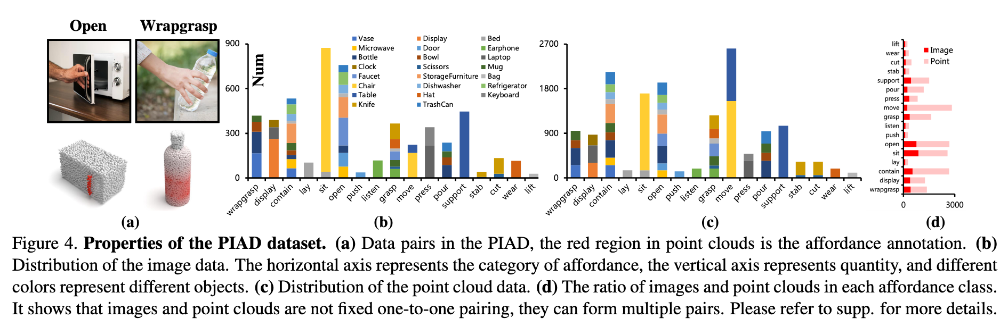

`Grounding 3D Object Affordance from 2D Interactions in Images 论文解读` 

<!-- more -->

> 论文: [https://arxiv.org/abs/2303.10437](https://arxiv.org/abs/2303.10437)
> 代码: [https://github.com/yyvhang/IAGNet](https://github.com/yyvhang/IAGNet)
> 数据集: [https://drive.google.com/drive/folders/1F242TsdXjRZkKQotiBsiN2u6rJAGRZ2W](https://drive.google.com/drive/folders/1F242TsdXjRZkKQotiBsiN2u6rJAGRZ2W)

## 摘要

这篇论文提出了一种新颖的任务设定：通过2D图像中的交互信息来预测3D物体的功能区域（affordance），旨在为具身智能体建立感知与操作之间的联系。作者设计了一个名为IAG（Interaction-driven 3D Affordance Grounding Network）的框架，通过联合区域对齐模块（JRA）解决不同来源物体区域的对齐问题，并通过功能揭示模块（ARM）建模交互上下文以明确功能区域。此外，作者还构建了一个包含图像-点云配对数据的数据集PIAD，用于支持该任务。实验结果表明，该方法在PIAD数据集上表现优异，验证了任务设定的可行性和方法的有效性。这一研究为功能学习领域提供了新的视角，并有望应用于机器人操作、增强现实等领域。

## 简介

Gibson（[2014](https://www.taylorfrancis.com/books/mono/10.4324/9781315740218/ecological-approach-visual-perception-james-gibson)）提出的“功能可供性”（affordance）概念，即物体支持的交互可能性，是连接具身智能体感知与操作的关键。现有研究主要分为两类：  

1. **几何结构映射方法**（如[11](https://openaccess.thecvf.com/content/CVPR2021/html/Deng_3D-AffordanceNet_A_Benchmark_for_Visual_Object_Affordance_Understanding_CVPR_2021_paper.html)、[22](https://ieeexplore.ieee.org/document/7139362)）通过标注物体交互区域建立几何结构与功能的固定关联，但泛化性受限，且对多功能的相似结构易产生混淆（如图2(b)中椅子的“坐”与“移动”功能）。  


2. **强化学习方法**（如[54](https://proceedings.neurips.cc/paper/2020/hash/6dd4e10e3296fa63738371ec0d5df818-Abstract.html)）通过智能体在虚拟环境中主动交互学习功能，但搜索空间大、耗时严重。  

**本文创新点**：  

- **任务设定**：首次提出通过2D交互图像预测3D物体功能区域（如图1），模拟人类通过观察学习物体功能的能力。  
- **核心挑战**：  
  - **对齐模糊性**：2D演示与3D物体来自不同实例，需跨源对齐区域（图2(a)展示同类物体的结构相似性可辅助对齐）。  
  - **功能模糊性**：同一物体区域可能支持多功能（如“杯子”既可“握持”也可“盛放”），需通过交互上下文建模解决（图2(b)）。  

**解决方案**：  
- **IAG框架**：包含**JRA模块**（通过密集跨模态相似性 $φ_{i,j}=\frac{e^{(P_i,I_j)}}{\sum e^{(P_i,I_j)}}$ 对齐区域）和**ARM模块**（通过交叉注意力建模物体-主体/场景交互以揭示功能）。  
- **PIAD数据集**：包含7,012个点云和5,162张图像，覆盖23类物体和17种功能，支持“可见”与“未见”场景的评估（图4）。  



**意义**：该方法摆脱了对几何标注或固定场景的依赖，为机器人操作、AR/VR等应用提供了更通用的功能理解范式。

## 相关工作

#### **1. 功能学习（Affordance Learning）**
现有研究可分为三类（如表1所示）：

- **2D功能检测**：  
  - 早期工作（如[12](https://ieeexplore.ieee.org/document/8460928)、[69](https://ieeexplore.ieee.org/document/9053830)）从图像/视频中分割功能区域，但无法定位具体交互部位。  
  - 语言辅助方法（如[36](https://ieeexplore.ieee.org/document/9200506)）结合文本描述提升语义理解。  

- **3D功能定位**：  
  - 基于几何映射的方法（如[11](https://openaccess.thecvf.com/content/CVPR2021/html/Deng_3D-AffordanceNet_A_Benchmark_for_Visual_Object_Affordance_Understanding_CVPR_2021_paper.html)）直接关联结构与功能，泛化性差。  
  - 强化学习方法（如[54](https://proceedings.neurips.cc/paper/2020/hash/6dd4e10e3296fa63738371ec0d5df818-Abstract.html)）通过智能体主动交互学习，但效率低。  

- **机器人操作应用**：  
  - 针对铰接物体（如[48](https://openaccess.thecvf.com/content/ICCV2021/html/Mo_Where2Act_From_Pixels_to_Actions_for_Articulated_3D_Objects_ICCV_2021_paper.html)）设计功能热图，指导抓取和运动规划。  

**本文区别**：首次通过**非配对**的2D-3D数据学习功能，摆脱几何标注和固定场景限制。

---

#### **2. 图像-点云跨模态学习**
现有方法依赖两类对齐策略：

- **空间先验对齐**：  
  - 基于相机参数（如[68](https://dl.acm.org/doi/10.1145/3474085.3479228)、[90](https://openaccess.thecvf.com/content/ICCV2021/html/Zhuang_Perception-Aware_Multi-Sensor_Fusion_for_3D_LiDAR_Semantic_Segmentation_ICCV_2021_paper.html)）将点云投影到图像平面，需严格的空间对应。  

- **特征空间对齐**：  
  - 无相机参数方法（如[1](https://arxiv.org/abs/2209.09552)、[6](https://dl.acm.org/doi/10.1145/3528233.3530731)）直接建模跨模态特征相似性。  

**本文创新**：利用功能-结构的隐式关联（如图2(a)），在无空间先验下实现跨源特征对齐。

## 方法

#### **1. 整体框架（IAG网络）**


如图3所示，IAG网络输入为四元组 $\{P,I,\mathcal{B},y\}$，其中：

- $P\in\mathbb{R}^{N\times3}$ 为点云坐标

- $I\in\mathbb{R}^{3\times H\times W}$ 为RGB图像

- $\mathcal{B}=\{B_{sub},B_{obj}\}$ 为图像中主体和物体的边界框

- $y$ 为功能类别标签

**处理流程**：
1. **特征提取**：

   - 图像分支：ResNet提取特征 $\mathbf{F}_1\in\mathbb{R}^{C\times H'\times W'}$

   - 点云分支：PointNet++提取特征 $\mathbf{F}_p\in\mathbb{R}^{C\times N_p}$

2. **区域定位**：

   - 通过ROI-Align获取物体/主体/场景特征 $\mathbf{F}_i,\mathbf{F}_s,\mathbf{F}_e\in\mathbb{R}^{C\times N_i}$（$N_i=H_1\times W_1$）

3. **联合区域对齐（JRA模块）**：

   - 计算密集跨模态相似性矩阵：
     $$
     \varphi_{i,j}=\frac{e^{(\mathbf{P}_i,\mathbf{I}_j)}}{\sum_{i=1}^{N_p}\sum_{j=1}^{N_i}e^{(\mathbf{P}_i,\mathbf{I}_j)}}
     $$

   - 通过自注意力建模模态内结构关系：
     $$
     \tilde{\mathbf{P}}=f_p(\mathbf{I}\cdot\varphi^T), \quad \tilde{\mathbf{I}}=f_i(\mathbf{P}\cdot\varphi)
     $$

   - 联合注意力生成对齐特征 $\mathbf{F}_j=f_\delta[\tilde{\mathbf{P}},\tilde{\mathbf{I}}]$

4. **功能揭示（ARM模块）**：

   - 交叉注意力建模交互上下文：
     $$
     \boldsymbol{\Theta}_{1/2}=\text{softmax}(\mathbf{Q}^T\cdot\mathbf{K}_{1/2}/\sqrt{d})\cdot\mathbf{V}_{1/2}^T
     $$

   - 融合生成功能表征 $\mathbf{F}_\alpha=f_\xi(\boldsymbol{\Theta}_1,\boldsymbol{\Theta}_2)$

5. **解码输出**：

   - 功能类别预测 $\hat{y}$：对 $\mathbf{F}_{po}$ 和 $\mathbf{F}_{io}$ 池化后拼接

   - 3D功能热图 $\hat{\phi}$：通过特征传播层上采样：
     $$
     \hat{\phi}=f_\phi(\text{FP}(\tilde{\mathbf{F}}_p)\odot\Gamma(\mathbf{F}_{po}))
     $$

#### **2. 损失函数**

总损失包含三项：

1. **功能分类损失** $\mathcal{L}_{CE}$：交叉熵损失监督 $\hat{y}$

2. **特征分布对齐损失** $\mathcal{L}_{KL}$：KL散度约束 $\mathbf{F}_{io}$ 与 $\tilde{\mathbf{F}}_i$ 分布：
   $$
   \mathcal{L}_{KL}=\sum_n \mathbf{F}_{io_n}\log(\epsilon+\frac{\mathbf{F}_{io_n}}{\epsilon+\tilde{\mathbf{F}}_{i_n}})
   $$

3. **热图回归损失** $\mathcal{L}_{HM}$：Focal Loss + Dice Loss监督 $\hat{\phi}$

最终损失为加权和：
$$
\mathcal{L}_{total}=\lambda_1\mathcal{L}_{CE}+\lambda_2\mathcal{L}_{KL}+\lambda_3\mathcal{L}_{HM}
$$

#### **3. 关键创新**

- **JRA模块**：通过跨模态相似性（$\varphi$）和联合注意力（$f_\delta$）实现无先验对齐

- **ARM模块**：通过双路交叉注意力分别建模物体-主体（$\boldsymbol{\Theta}_1$）和物体-场景（$\boldsymbol{\Theta}_2$）交互

- **互优化机制**：$\mathcal{L}_{KL}$ 使功能表征与对齐特征相互增强（如图15所示）

## 代码

### 数据集

> 数据集目录下的组织方式:
> 

1. 数据集初始化

```python
class PIAD(Dataset):
    def __init__(self, run_type, setting_type, point_path, img_path, box_path, pair=2, img_size=(224, 224)):
        super().__init__()

        self.run_type = run_type # train/val/test
        self.p_path = point_path
        self.i_path = img_path
        self.b_path = box_path # 记录物体边界框
        self.pair_num = pair
        self.affordance_label_list = ['grasp', 'contain', 'lift', 'open', 
                        'lay', 'sit', 'support', 'wrapgrasp', 'pour', 'move', 'display',
                        'push', 'listen', 'wear', 'press', 'cut', 'stab']
        
        ...                

        '''
        Seen
        '''
        if setting_type == 'Seen':
            number_dict = {'Earphone': 0, 'Bag': 0, 'Chair': 0, 'Refrigerator': 0, 'Knife': 0, 'Dishwasher': 0, 'Keyboard': 0, 'Scissors': 0, 'Table': 0, 
            'StorageFurniture': 0, 'Bottle': 0, 'Bowl': 0, 'Microwave': 0, 'Display': 0, 'TrashCan': 0, 'Hat': 0, 'Clock': 0, 
            'Door': 0, 'Mug': 0, 'Faucet': 0, 'Vase': 0, 'Laptop': 0, 'Bed': 0}

        # 读取出所有图片路径，存储了物体边界框文件路径 
        self.img_files = self.read_file(self.i_path)
        self.box_files = self.read_file(self.b_path)
        self.img_size = img_size

        if self.run_type == 'train':
           # 读取出所有点云文件路径,同时记录每类物体共对应多少不同的点云
            self.point_files, self.number_dict = self.read_file(self.p_path, number_dict)
            self.object_list = list(number_dict.keys())
            self.object_train_split = {}
            start_index = 0
            # 记录每类物体对应的点云文件下标索引区间
            for obj_ in self.object_list:
                temp_split = [start_index, start_index + self.number_dict[obj_]]
                self.object_train_split[obj_] = temp_split
                start_index += self.number_dict[obj_]
        else:
            self.point_files = self.read_file(self.p_path)
```
2. 获取数据

```python
    def __getitem__(self, index):
        # 1. 获取图片，Box框文件路径
        img_path = self.img_files[index]
        box_path = self.box_files[index]

        if (self.run_type=='val'):
            point_path = self.point_files[index]
        else:
            # 2. 从文件路径中提取物体名
            object_name = img_path.split('_')[-3]
            # 3. 一张图片对应多张同物体但形状不同的点云图片
            range_ = self.object_train_split[object_name]
            point_sample_idx = random.sample(range(range_[0],range_[1]), self.pair_num)

        Img = Image.open(img_path).convert('RGB')

        if(self.run_type == 'train'):
            # 4. 随机裁剪图片，同时获取裁剪后的物体框(交互主体框，目标物体框)
            Img, subject, object = self.get_crop(box_path, Img, self.run_type)
            # 5. 对图片进行缩放，同时等比例对物体框做同样的缩放
            sub_box, obj_box = self.get_resize_box(Img, self.img_size, subject, object)
            sub_box, obj_box = torch.tensor(sub_box).float(), torch.tensor(obj_box).float()
            Img = Img.resize(self.img_size)
            Img = img_normalize_train(Img)
            
            Points_List = []
            affordance_label_List = []
            affordance_index_List = []
            # 6. 加载点云
            for id_x in point_sample_idx:
                point_path = self.point_files[id_x]
                Points, affordance_label = self.extract_point_file(point_path)
                Points,_,_ = pc_normalize(Points)
                Points = Points.transpose()
                affordance_label, affordance_index = self.get_affordance_label(img_path, affordance_label)
                Points_List.append(Points)
                affordance_label_List.append(affordance_label)
                affordance_index_List.append(affordance_index)

        else:
            ...

        if(self.run_type == 'train'):
            # 7. 图片，点云列表，点云功能区域掩码列表，点云功能区域索引列表，交互主体框，目标物体框
            return Img, Points_List, affordance_label_List, affordance_index_List, sub_box, obj_box
        else:
            return Img, Point, affordance_label, img_path, point_path, sub_box, obj_box
```
### 模型

```python
class IAG(nn.Module):
    ...        
    def forward(self, img, xyz, sub_box, obj_box):

        '''
        img: [B, 3, H, W]
        xyz: [B, 3, 2048]
        sub_box: bounding box of the interactive subject
        obj_box: bounding box of the interactive object
        '''
        
        B, C, N = xyz.size()
        ...
        # 1. ResNet18 编码图像 (batch,512,7,7)
        F_I = self.img_encoder(img)
        # 2. 利用ROI Align技术，得到目标物体区域特征，交互主体区域特征，背景区域特征
        ROI_box = self.get_roi_box(B).to(device)
        F_i, F_s, F_e = self.get_mask_feature(img, F_I, sub_box, obj_box, device)
        # 背景区域特征图经过ROI Align映射为4*4大小的特征图
        # ROI_box 大小为 7*7 , 正好为resnet18最后生成的特征图的分辨率, 因为背景区域大小等于特征图大小
        F_e = roi_align(F_e, ROI_box, output_size=(4,4))
        # F_i (batch,512,4,4) , F_s (batch,512,4,4) , F_e (batch,512,4,4)

        # 3. PointNet编码点云
        # (B,3,2048) , (B,320,512) , (B,512,128) ， (B,512,64)
        F_p_wise = self.point_encoder(xyz)
        # 4.  
        F_j = self.JRA(F_i, F_p_wise[-1][1])
        # 5. 
        affordance = self.ARM(F_j, F_s, F_e)

        _3daffordance, logits, to_KL = self.decoder(F_j, affordance, F_p_wise)

        return _3daffordance, logits, to_KL
```

关于利用ROI Align技术，得到目标物体区域特征，交互主体区域特征，背景区域特征过程的实现细节如下:

```python
    def get_mask_feature(self, raw_img, img_feature, sub_box, obj_box, device):
        raw_size = raw_img.size(2)
        current_size = img_feature.size(2)
        B = img_feature.size(0)
        # 1. 计算经过下采样得到的特征图相比于原始图片的缩小比例
        scale_factor = current_size / raw_size
        # 2. 将交互主体框和目标物体框等比例缩小
        sub_box[:, :] = sub_box[:, :] * scale_factor
        obj_box[:, :] = obj_box[:, :] * scale_factor
        
        # 3. 根据目标物体框，将掩码图像中目标物体所在区域激活，得到目标物体区域掩码
        obj_mask = torch.zeros_like(img_feature)
        obj_roi_box = []
        for i in range(B):
            obj_mask[i,:, int(obj_box[i][1]+0.5):int(obj_box[i][3]+0.5), int(obj_box[i][0]+0.5):int(obj_box[i][2]+0.5)] = 1
            roi_obj = [obj_box[i][0], obj_box[i][1], obj_box[i][2]+0.5, obj_box[i][3]]  # 对交互主体框位置进行精细调整(just a trick)
            roi_obj.insert(0, i) # 插入批次索引 -- ROI Align对齐方法需要
            obj_roi_box.append(roi_obj)
        obj_roi_box = torch.tensor(obj_roi_box).float().to(device)

        sub_roi_box = []
        # 4. 根据交互主体框，在目标物体区域掩码之上，激活交互主体所在区域
        Scene_mask = obj_mask.clone()
        for i in range(B):
            Scene_mask[i,:, int(sub_box[i][1]+0.5):int(sub_box[i][3]+0.5), int(sub_box[i][0]+0.5):int(sub_box[i][2]+0.5)] = 1
            roi_sub = [sub_box[i][0], sub_box[i][1], sub_box[i][2], sub_box[i][3]]
            roi_sub.insert(0,i)
            sub_roi_box.append(roi_sub)
        # 5. 借助取反激活图片背景区域    
        Scene_mask = torch.abs(Scene_mask - 1)
        # 6. 拿到图片背景区域特征图
        Scene_mask_feature = img_feature * Scene_mask
        sub_roi_box = torch.tensor(sub_roi_box).float().to(device)
        # 7. 利用ROI Align技术，将目标物体区域框在特征图中框出的区域，映射为4*4大小的特征图
        obj_feature = roi_align(img_feature, obj_roi_box, output_size=(4,4), sampling_ratio=4)
        # 8. 利用ROI Align技术，将交互主体区域框在特征图中框出的区域，映射为4*4大小的特征图
        sub_feature = roi_align(img_feature, sub_roi_box, output_size=(4,4), sampling_ratio=4) 
        # 9. 返回目标物体区域特征图，交互主体区域特征图，背景区域特征图(未经ROI Align进行映射)
        return obj_feature, sub_feature, Scene_mask_feature
```

```python
class Joint_Region_Alignment(nn.Module):
    def __init__(self, emb_dim = 512, num_heads = 4):
        super().__init__()
        class SwapAxes(nn.Module):
            def __init__(self):
                super().__init__()
            
            def forward(self, x):
                return x.transpose(1, 2)
        self.emb_dim = emb_dim
        self.div_scale = self.emb_dim ** (-0.5)
        self.num_heads = num_heads

        self.to_common = nn.Sequential(
            nn.Conv1d(self.emb_dim, 2*self.emb_dim, 1, 1),
            nn.BatchNorm1d(2*self.emb_dim),
            nn.ReLU(),
            nn.Conv1d(2*self.emb_dim, self.emb_dim, 1, 1),
            nn.BatchNorm1d(self.emb_dim),
            nn.ReLU()         
        )

        self.i_atten = Inherent_relation(self.emb_dim, self.num_heads)
        self.p_atten = Inherent_relation(self.emb_dim, self.num_heads)
        self.joint_atten = Inherent_relation(self.emb_dim, self.num_heads)

    def forward(self, F_i, F_p):
        '''
        i_feature: [B, C, H, W]
        p_feature: [B, C, N_p]
        HW = N_i
        '''

        B,_,N_p = F_p.size()
        F_i = F_i.view(B, self.emb_dim, -1)                                             #[B, C, N_i]

        I = self.to_common(F_i)
        P = self.to_common(F_p)

        phi = torch.bmm(P.permute(0, 2, 1), I)*self.div_scale                           #[B, N_p, N_i]
        phi_p = F.softmax(phi,dim=1)
        phi_i = F.softmax(phi,dim=-1)  
        I_enhance = torch.bmm(P, phi_p)                                                 #[B, C, N_i]
        P_enhance = torch.bmm(I, phi_i.permute(0,2,1))                                  #[B, C, N_p]
        I_ = self.i_atten(I_enhance.mT)                                                 #[B, N_i, C]
        P_ = self.p_atten(P_enhance.mT)                                                 #[B, N_p, C]

        joint_patch = torch.cat((P_, I_), dim=1)                                       
        F_j = self.joint_atten(joint_patch)                                             #[B, N_p+N_i, C]

        return F_j
```