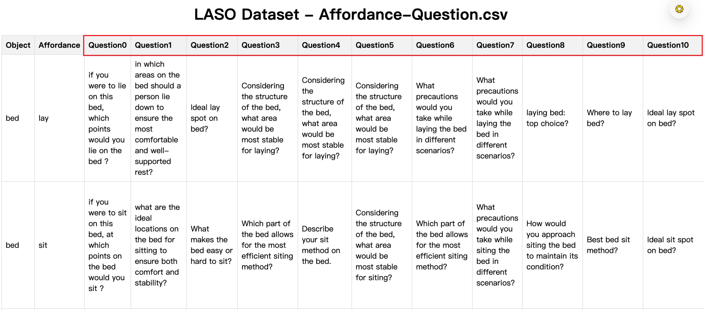
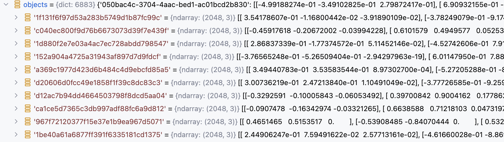
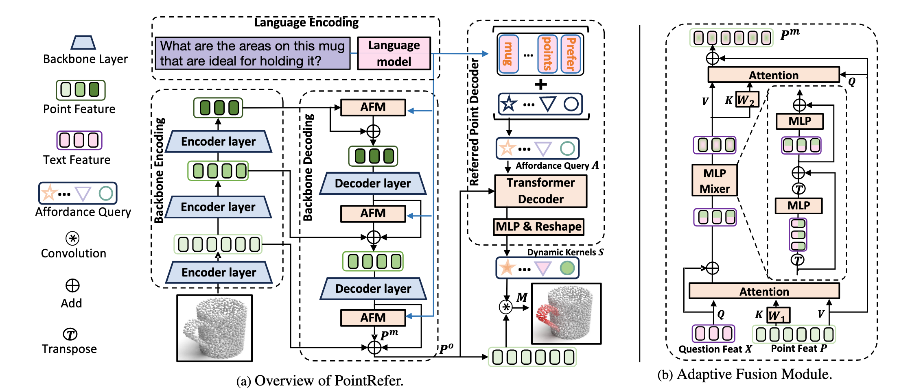

`LASO: Language-guided Affordance Segmentation on 3D Object 论文代码解读与复现` 

<!-- more -->

# LASO 模型代码解读与复现

> 论文: [https://openaccess.thecvf.com/content/CVPR2024/papers/Li_LASO_Language-guided_Affordance_Segmentation_on_3D_Object_CVPR_2024_paper.pdf](https://openaccess.thecvf.com/content/CVPR2024/papers/Li_LASO_Language-guided_Affordance_Segmentation_on_3D_Object_CVPR_2024_paper.pdf)
> 代码: [https://github.com/yl3800/LASO](https://github.com/yl3800/LASO)


这篇论文提出了一项新的任务和一个配套的数据集，旨在推动 **语言引导下的** 3D对象功能区域分割（Language-guided Affordance Segmentation on 3D Object, 简称 LASO）。

## 数据集

### 1. 基础数据来源

数据集基于 **3D-AffordanceNet** 提供的点云和功能区域标注构建：

- 每个物体都以点云形式表示；
- 点云中的每个点被标注为支持一个或多个功能类型（multi-class affordance labels），例如 grasp、open、lift、move 等；
- 这些功能标注是人工标注的，具有语义意义；

> **为什么使用 3D-AffordanceNet？** 
> - 因为它提供了高质量的点云和功能标注，能够很好地支持 LASO 的目标：根据自然语言问题找出与之相关的功能区域。


### 2. 构建问题（Question Crafting）

1. **选取物体-功能组合**：
   - 从 3D-AffordanceNet 中选取了 **58 种物体-功能组合**（如 mug-grasp、door-open 等）；
2. **手工设计问题**：
   - 对每种组合手工编写 **5 个代表性问题**；
3. **使用 GPT-4 扩展生成更多问题**：
   - 使用 GPT-4 为每个组合额外生成 **10 个问题**；
   - 总共得到 **870 个专家设计的问题**（58 × 15 = 870）；


   


在扩展过程中，GPT-4 生成的问题遵循以下三个关键原则，以确保问题多样性和语义丰富性：

| 原则 | 描述 |
|------|------|
| **Contextual Enrichment（上下文丰富化）** | 添加更多上下文细节，使问题更具体地连接目标对象的功能；<br>例：将 “Grasping scissors: top choice?” 改为 “Identify the key points on the scissors that ensure successful grasping.” |
| **Concise Phrasing（简洁表达）** | 提炼问题本质，使其简短但仍有意义； |
| **Structural Diversity（结构多样性）** | 使用不同句式结构（疑问句、陈述句等），防止模型偏向特定句式或长度； |

### 3. 标注 GT Mask（Ground Truth Mask）

对于每个问题，结合其对应的功能类型和原始点云标注信息，构造出对应的二值掩码 `gt_mask`：

- 每个点是否属于当前问题描述的功能区域；
- `gt_mask` 是 `(N,)` 形状的一维数组，其中 N 是点数；
- 数值可以是 0/1（binary mask），也可以是**软标签（soft label）**，表示点属于该功能区域的概率；
- 软标签通常用于边界模糊区域，反映点与功能核心区域的距离远近；

> 💡 注意：这些功能标签仅用于构造问题和定位正确功能区域，在训练和测试中不作为显式监督信号。

### 4. 数据集组织方式

数据总量：

- **总样本数**：19,751 个点云-问题配对；
- **物体类别数**：23 类；
- **功能类型数**：17 类；
- **问题总数**：870 个专家设计的问题；
- **每个物体类别可有多个形状实例**；
- **一个问题可以作用于多个物体类别**（泛化能力）；

数据集设置（两种模式）：

🔹 Seen（见过）

- 训练和测试阶段共享相似的物体类别和功能类型的分布；
- 目的是评估模型在熟悉场景下的表现；

🔹 Unseen（未见）

- 某些功能类型在特定物体类别下会从训练集中省略，但在测试集中保留；
- **目的是测试模型对新组合的泛化能力；**
- 例如：模型在训练期间学会了抓取包和杯子，但测试时要求“抓取耳机”——这是训练中未曾遇到过的功能-物体组合；

数据划分方式：

| 分区 | 物体类别数 | 问题数 | 样本数 |
|------|-------------|--------|---------|
| Train | 6883 | 638 | 16,120 |
| Val | 516 | 58 | 1,215 |
| Test | 1035 | 174 | 2,416 |

### 5. 数据增强与配对策略

训练阶段：

- 每次迭代中，每个形状实例随机匹配一个与其功能类型一致的问题；
- 随机配对使模型暴露于各种语义上下文中，提升泛化能力；

推理阶段（验证 & 测试）：

- 问题配对是固定的；
- 所有问题专属于评估阶段，不在训练中透露；
- 确保推理一致性，保持评估完整性；


### 6. 数据集统计信息（来自论文图3）

| 维度 | 内容 |
|------|------|
| 功能类型 | 17 类，如 grasp、open、lift、move 等 |
| 物体类别 | 23 类，如 mug、microwave、chair、door 等 |
| 物体-功能组合 | 58 种唯一组合（object-affordance pairs） |
| 问题总数 | 870 个定制化问题 |
| 点云-问题配对 | 19,751 对 |
| 点云来源 | 来自 3D-AffordanceNet，每个点云约 2048 个点 |

### 7. 代码实现

**数据集初始化的核心代码实现如下:**

```python
class AffordQ(Dataset):

    def __init__(self,
                 split='train',
                 **kwargs
                 ):
        # 数据集存放目录         
        data_root='LASO_dataset'
        # 数据集类型: 训练集，评估集，测试集
        self.split = split
        # 所支持的23种物体类型和17种功能类型 
        classes = ["Bag", "Bed", "Bowl","Clock", "Dishwasher", "Display", "Door", "Earphone", "Faucet",
            "Hat", "StorageFurniture", "Keyboard", "Knife", "Laptop", "Microwave", "Mug",
            "Refrigerator", "Chair", "Scissors", "Table", "TrashCan", "Vase", "Bottle"]
        
        afford_cl = ['lay','sit','support','grasp','lift','contain','open','wrap_grasp','pour', 
                     'move','display','push','pull','listen','wear','press','cut','stab']
        # 建立物体类型和功能类型的索引映射关系，神经网络模型只认识数字 
        self.cls2idx = {cls.lower():np.array(i).astype(np.int64) for i, cls in enumerate(classes)}
        self.aff2idx = {cls:np.array(i).astype(np.int64) for i, cls in enumerate(afford_cl)}
        # 加载标注数据
        with open(os.path.join(data_root, f'anno_{split}.pkl'), 'rb') as f:
            self.anno = pickle.load(f)
        # 加载点云数据
        with open(os.path.join(data_root, f'objects_{split}.pkl'), 'rb') as f:
            self.objects = pickle.load(f)

        # 加载58种物体-功能组合的标注数据 (数据组织形式，参考上文的 Affordance-Question数据可视化图)
        self.question_df = pd.read_csv(os.path.join(data_root, 'Affordance-Question.csv'))

        # sort anno by object class and affordance type -- 遍历标注数据列表
        self.sort_anno ={}
        for item in sorted(self.anno, key=lambda x: x['class']):
            # 获取当前样本的物体类别和物体信息值: 点云ID, 功能区域掩码, 功能类别
            key = item['class']
            value = {'shape_id': item['shape_id'], 'mask': item['mask'], 'affordance': item['affordance']}
            
            # 每种物体可以对应多种形状实例和功能类别
            if key not in self.sort_anno:
                # 如果当前物体类别不在排序后的字典中，直接添加
                self.sort_anno[key] = [value]
            else:
                # 如果当前物体类别在排序后的字典中，将当前样本的物体信息值追加到对应列表中
                self.sort_anno[key].append(value)
```
加载的标注数据中每个样本的组织形式如下:
- shape_id ：点云ID
- class ：物体类别（如bed）
- affordance ：功能类别（如lay）
- mask ：功能区域掩码（点级别标注）

   

   

   

**获取样本的代码实现:**

```python
    def __getitem__(self, index):
        # 根据样本索引取出样本数据
        data = self.anno[index]    
        # 获取当前样本对应的点云ID        
        shape_id = data['shape_id']
        # 获取当前样本对应的物体类别
        cls = data['class']
        #  获取当前样本对应的功能类型
        affordance = data['affordance']
        # 获取当前样本对应的功能区域掩码
        gt_mask = data['mask']
        # 取出当前样本对应的点云数据 ，（2048,3)
        point_set = self.objects[str(shape_id)]
        # 对点云数据进行归一化处理，消除尺度差异
        point_set,_,_ = pc_normalize(point_set)
        # 对点云数据进行转置操作 ，（3,2048)
        point_set = point_set.transpose()

        # 获取当前样本对应的问题文本(训练: 随机选； 验证&测试: 固定返回问题0)
        question = self.find_rephrase(self.question_df, cls, affordance)
        # 获取当前功能类型对应的索引值
        affordance = self.aff2idx[affordance]

        # 返回: 点云数据， 物体类别索引， 功能区域掩码， 问题文本， 功能类型索引
        return point_set, self.cls2idx[cls], gt_mask, question, affordance

    def find_rephrase(self, df, object_name, affordance):
        # 如果当前是训练模式，则从问题1～15中随机选择一个问题，否则固定返回问题0
        qid = str(np.random.randint(1, 15)) if self.split == 'train' else '0'
        qid = 'Question'+qid
        # 从 DataFrame df 中筛选出同时满足 物体名称匹配 和 功能属性匹配 的行，并仅保留 qid 指定的列，也就是取出上面随机选择的问题文本
        result = df.loc[(df['Object'] == object_name) & (df['Affordance'] == affordance), [qid]]
        # 问题文本不为空，则返回该问题文本
        if not result.empty:
            # return result.index[0], result.iloc[0]['Rephrase']
            return result.iloc[0][qid]
        else:
            raise NotImplementedError
```

### 8. 总结

LASO 数据集基于 3D-AffordanceNet 的点云和功能标注，结合人工+GPT-4 生成的多样化问题，构造出 19,751 个点云-问题配对，旨在实现语言引导下的 3D 功能区域分割，推动 3D 视觉与大语言模型（LLM）的深度融合。

## 模型实现

论文提出了一个全新的模型：**PointRefer**，用于解决一个新颖的任务 —— **语言引导的 3D 对象功能区域分割（LASO）**。

模型目标： 给定一个 3D 点云对象和一个自然语言问题（例如：“Where would you grasp this mug?”），PointRefer 的目标是预测出与该问题相关的点云区域，即生成一个二值掩码，表示哪些点属于目标功能区域。

PointRefer 包括以下核心模块：

1. **3D 骨干网络（3D Backbone）**
   - 使用 PointNet++ 编码点云特征；
   - 多阶段编码-解码结构提取多尺度点特征；

2. **自适应融合模块（Adaptive Fusion Module, AFM）**
   - 在不同解码层注入语言信息；
   - 实现语言引导下的跨模态融合；
   - 增强点特征的语义判别能力；

3. **参考点解码器（Referred Point Decoder, RPD）**
   - 引入一组可学习的“问题条件化查询”（affordance queries）；
   - 利用 Transformer 解码器将这些查询与点云特征进行交互；
   - 生成动态卷积核（dynamic kernels）；
   - 最终通过卷积操作生成分割掩码；

   

PointRefer 前向传播过程如下:

```python
class PointRefer(nn.Module):

    # 传入question文本 和 point点云数据 
    def forward(self, text, xyz):

        '''
        text: [B, L, 768]
        xyz: [B, 3, 2048] -- (b,c,n)
        '''
         
        B, C, N = xyz.size()
        # 1. Encoding 过程
        # 1.1 Language Encoding 使用RoBert编码文本
        t_feat, t_mask = self.forward_text(list(text), xyz.device)  # [batch, q_len, d_model]
        # 1.2 BackBone Encoding 使用PointNet++编码点云
        F_p_wise = self.point_encoder(xyz)     

        """ 
        Decoding
        """
        # 1.3 PointNet++ 逐级做点集抽象得到的每层的点集坐标和点集特征集合
        p_0, p_1, p_2, p_3 = F_p_wise

        # 2.Backbone Decoding过程
        # 2.1 点集集合中每个点的特征和文本特征信息进行融合,传入的点集特征集合经过转置处理后的维度为: (b, n, c)
        p_3[1] = self.gpb(t_feat, p_3[1].transpose(-2, -1)).transpose(-2, -1)
        # 2.2 PointNet++ 特征传播阶段: 上采样过程中，上一层点集中的点特征重建过程中，充分吸收了高级区域抽象特征和文本特征
        up_sample = self.fp3(p_2[0], p_3[0], p_2[1], p_3[1])   #[B, emb_dim, npoint_sa2]

        up_sample = self.gpb(t_feat, up_sample.transpose(-2, -1)).transpose(-2, -1)
        up_sample = self.fp2(p_1[0], p_2[0], p_1[1], up_sample)    #[B, emb_dim, npoint_sa1]   
        
        up_sample = self.gpb(t_feat, up_sample.transpose(-2, -1)).transpose(-2, -1) 
        # 2.3 特征传播阶段结束: 一步步重建回原始点数量 128->256->512->1024->2048        
        up_sample = self.fp1(p_0[0], p_1[0], torch.cat([p_0[0], p_0[1]],1), up_sample)  #[B, emb_dim, N]
        
        #  3. Referred Point Decoding过程
        t_feat = self.decoder(t_feat, up_sample.transpose(-2, -1), tgt_key_padding_mask=t_mask, query_pos=self.pos1d) # b,l,c
        t_feat *= t_mask.unsqueeze(-1).float()
        _3daffordance = torch.einsum('blc,bcn->bln', t_feat, up_sample)
        _3daffordance = _3daffordance.sum(1)/(t_mask.float().sum(1).unsqueeze(-1))
        _3daffordance = torch.sigmoid(_3daffordance)
        return _3daffordance.squeeze(-1)
```
> 论文中所给的模型架构图中的Encoder layer指的是PointNet++中提供的PointNetSetAbstractionMsg多尺度分组点集特征抽取类

> 论文中所给的模型架构图中的Decoder layer指的是PointNet++中提供的PointNetFeaturePropagation特征传播类

### AFM 自适应融合模块

在 LASO 任务中，模型需要根据自然语言问题（如 “Where to grasp?”）识别点云中的功能区域。由于目标功能区域的尺度、形状多样，传统方法难以适应不同情况。为此，作者设计了 AFM 模块，以增强 PointNet++ 解码过程中点特征的语言引导能力。

AFM 的目标是：在不同解码阶段注入语言线索（text clues），将文本语义信息与点云特征进行跨模态融合，逐步以自上而下的方式细化点特征图，从而提升模型对多尺度、多形状的功能区域的感知能力。

AFM 遵循一个 **瓶颈式架构（bottleneck architecture）**，包含三个关键步骤：

1. **Grouping（分组）**
2. **Mixing（混合）**
3. **Ungrouping（解组）**

这三个步骤构成了一个完整的跨模态融合流程。

#### 1️⃣ Grouping：文本引导的点特征分组

输入：
- `X ∈ R^{L×d}`：问题编码后的文本特征（由 RoBERTa 编码得到）
- `P ∈ R^{T×d}`：某一层解码器输出的点特征，其中 T 表示该层点数

处理过程：
- 使用一个轻量级的交叉注意力模块，将文本特征作为查询（query），点特征作为键（key）和值（value），输出分组标记 G：

$$
G = \text{Attention}(X, W_1P, P) + X
$$
$$
\text{Attention}(Q, K, V) = \text{Softmax}\left(\frac{QK^T}{\sqrt{d}}\right)V
$$

其中：
- $W_1$ 是一个线性变换；
- 注意力机制使得每个文本 token 对应一组相关的点特征；
- 分组操作实现了“语言引导的点特征筛选”。

> 重点是如何理解这里的分组: 每个文本Token询问所有点Key后，知道了哪些点跟自身的相关度更大，因此加权融合的时候，侧重于给这些点的特征分配更大的融合权重。

这部分代码实现如下:

```python
# group_layer 的实现
class LightGroupAttnBlock(nn.Module):
    
    # query 是RoBerta编码后的文本特征 , (b,l,c)
    # key和value都是点云特征 , (b,n,c)
    def forward(self, query, key, value, q_mask=None):
        def _inner_forward(query, key, value):
            q = self.norm_query(query)
            k = q if self.key_is_query else self.norm_key(key)
            v = k if self.value_is_key else self.norm_value(value)
            # 让每个语言 token 去关注点云中最相关的区域，并在此基础上强化自身的语义表达。
            # 加上原始 X 是一种残差连接（Residual Connection），可以确保语言语义不会丢失。
            x = self.attn(q, k, v, q_mask) + self.drop(q) 
            return x
        
        return _inner_forward(query, key, value)
```

---

#### 2️⃣ Mixing：MLP-Mixer 进行组内和通道间的信息混合

MLP-Mixer 是一种 基于 MLP（多层感知机）的视觉模型架构 ，由 Google Research 在 2021 年提出。它不使用任何注意力机制，而是通过 空间混合（mixing）和通道混合（mixing）操作 来实现全局信息建模。

> [MLP-Mixer: An all-MLP Architecture for Vision](https://arxiv.org/abs/2105.01601)

MLP-Mixer 的核心思想是：用 MLP 替代 Transformer 中的自注意力机制 ，从而减少计算复杂度并保持性能。

1. Token-mixing MLP

- 对所有点/patch 的相同通道进行混合；
- 相当于跨空间位置的信息交换；
- 类似于 CNN 中的空间卷积；

2. Channel-mixing MLP

- 对每个 token 的所有通道进行处理；
- 提取更高级的特征表示；
- 类似于传统的全连接层或 1x1 卷积；

这两个操作交替进行，形成一个类似于 Transformer 的堆叠结构，但完全不使用注意力机制。

输入：
- `G ∈ R^{L×d}`：分组后的文本引导特征

处理过程：

- 使用 MLP-Mixer 来更新分组特征，生成融合特征 F：

$$
G' = G + \text{MLP}_1(G^T)^T
$$
$$
F = G' + \text{MLP}_2(G')
$$

其中：
- `MLP₁` 负责组内信息混合（token 内部）；
- `MLP₂` 负责通道间信息混合（feature channel）；
- 两个 MLP 交替作用，实现跨模态信息的充分交互；
- 最终输出融合特征 `F`；

这部分代码实现如下:

```python
# mixer 的实现
class MLPMixerLayer(nn.Module):
    def __init__(self,
                 num_patches,
                 embed_dims,
                 patch_expansion,
                 channel_expansion,
                 drop_out,
                 **kwargs):

        super().__init__()

        patch_mix_dims = int(patch_expansion * embed_dims) # 16
        channel_mix_dims = int(channel_expansion * embed_dims) # 128

        self.patch_mixer = nn.Sequential(
            nn.Linear(num_patches, patch_mix_dims, bias=False), # try here
            nn.GELU(),
            nn.Dropout(drop_out),
            nn.Linear(patch_mix_dims, num_patches, bias=False),
            nn.Dropout(drop_out)
        )

        self.channel_mixer = nn.Sequential(
            nn.Linear(embed_dims, channel_mix_dims),
            nn.GELU(),
            nn.Dropout(drop_out),
            nn.Linear(channel_mix_dims, embed_dims),
            nn.Dropout(drop_out)
        )

        self.norm1 = nn.LayerNorm(embed_dims)
        self.norm2 = nn.LayerNorm(embed_dims)
    
    # x 分组后的文本引导特征 : (b,l,c)
    def forward(self, x):
        # x 转置后: (b,c,l) , patch_mixer 负责组内信息混合（token 内部）
        x = x + self.patch_mixer(self.norm1(x).transpose(1,2)).transpose(1,2)
        # channel_mixer 负责通道间信息混合（feature channel) 
        x = x + self.channel_mixer(self.norm2(x))
        return x
```
---

#### 3️⃣ Ungrouping：将融合特征映射回点空间

输入：

- 原始点特征 `P`；
- 融合后的文本特征 `F`；

处理过程：

- 使用另一个注意力模块，将融合特征重新分配给每个点：

$$
P_m = \text{Attention}(P, W_2F, F) + P
$$

其中：
- `W₂` 是线性变换；
- 注意力机制让每个点从融合特征中提取相关信息；
- 输出 `P_m` 是语言增强后的点特征；
- 最后加上残差连接形成最终输出 `P_o`：

$$
P_o = P_m + \text{residual}
$$

这个 `P_o` 就是经过 AFM 增强的点特征图，用于后续分割掩码预测。

```python
class FullAttnCatBlock(nn.Module):
    # query 为点云: (b,n,c) , key和value为融合后的文本特征: (b,l,c)
    def forward(self, query, key, value, key_padding_mask=None):
        def _inner_forward(query, key, value, key_padding_mask):
            q = self.norm_query(query)
            k = q if self.key_is_query else self.norm_key(key)
            v = k if self.value_is_key else self.norm_value(value)
            
            # 使用另一个注意力模块，将融合特征重新分配给每个点
            x = self.attn(q, k, v, key_padding_mask) + self.drop(query)
            # MLP映射 + Residual Connection
            x = self.ffn(self.norm2(x)) + x
            return x
        
        return _inner_forward(query, key, value, key_padding_mask)
```
---
#### 4️⃣ AFM 自适应融合模块

有了以上 Grouping - Mixing - Ungrouping 三个关键步骤的实现，下面只需要把以上的三个步骤按流程组织起来即可得到AFM模块的完整实现了:

```python
class GPBlock(nn.Module):
    # q: 文本特征 (b, l, c) ， x: 点集特征集合 (b, n, c)
    def forward(self, q, x, q_mask=None):
        # Grouping阶段
        gt = self.group_layer(query=q, key=x, value=x)
        if q_mask is not None:
            gt *= q_mask.unsqueeze(-1)
        # Mixing阶段
        gt = self.mixer(gt) + self.drop(gt)
        # Ungrouping阶段
        ungroup_tokens = self.un_group_layer(query=x, key=gt, value=gt, key_padding_mask=q_mask)
        return ungroup_tokens
```

AFM 的网络结构可视化理解

```
文本特征 X ──┐
             ↓
           Grouping (Cross-Attention)
             ↓
           Mixing (MLP-Mixer)
             ↓
          Ungrouping (Attention)
             ↓
        输出增强后的点特征 P_o
```

- **Grouping**：用语言引导点特征分组；
- **Mixing**：在分组内进行信息交换；
- **Ungrouping**：再将融合信息返回点空间；

这种设计使得语言信息能有效地指导点特征的学习过程，论文中也进行了大量消融实验来验证 AFM 的有效性：

| 模型变体 | mIoU | AUC | SIM | MAE |
|----------|-------|-----|-----|-----|
| 基线（不加 AFM） | 17.7 | 82.1 | 0.558 | 0.110 |
| 加入 AFM 后 | **20.8** | **87.3** | **0.629** | **0.093** |

结果表明：加入 AFM 显著提升了所有指标，说明其确实有效增强了语言-视觉的跨模态交互能力。

### RPO 参考点解码器

Referred Point Decoder（RPD）是 LASO 任务中用于生成功能区域掩码的核心模块。 

它的主要目标是：

- 利用一组问题条件化的 affordance queries 通过 Transformer 解码器与点云特征交互 ，生成一组动态卷积核（dynamic kernels），最终通过这些 kernel 对 AFM 增强后的点特征进行卷积，得到分割掩码。

```python
class TransformerDecoderLayer(nn.Module):
    
    # tgt: text feature (b,l,c),  memory: up_sample (b,n,c)
    def forward(self, tgt, memory,
                tgt_mask: Optional[Tensor] = None,
                memory_mask: Optional[Tensor] = None,
                tgt_key_padding_mask: Optional[Tensor] = None,
                memory_key_padding_mask: Optional[Tensor] = None,
                pos: Optional[Tensor] = None,
                query_pos: Optional[Tensor] = None):
        # 1. Affordance Query = 问题嵌入（Question Embedding）X + 可学习的位置编码（Learnable Position Embeddings）
        # 这里tgt就是Roberta编码得到的文本特征嵌入向量
        # 使用 X 作为初始输入，确保每个 query 都带有原始语言上下文；
        # 如果只用 learnable embeddings，模型将完全依赖随机初始化的参数去“猜”语言含义，效率极低；
        q = k = self.with_pos_embed(tgt, query_pos)
        # 2. 自注意力机制: 让每个 query 不仅理解自己的语义，还能感知其他 query 的信息，从而形成更完整的语言上下文理解。
        tgt2 = self.self_attn(q, k, value=tgt, attn_mask=tgt_mask,
                              key_padding_mask=tgt_key_padding_mask)
        tgt = tgt + self.dropout1(tgt2)
        tgt = self.norm1(tgt) # (b,l,c)
         
         # 3. 跨模态注意力机制: 每个 affordance query 都会基于其语言语义，从点云中找出最相关的功能区域，从而为后续的动态卷积和掩码预测提供基础。
        tgt2 = self.multihead_attn(query=self.with_pos_embed(tgt, query_pos),
                                   key=self.with_pos_embed(memory, pos),
                                   value=memory, attn_mask=memory_mask,
                                   key_padding_mask=memory_key_padding_mask,
                                   output_attentions = True)
        tgt = tgt + self.dropout2(tgt2)
        tgt = self.norm2(tgt) # (b,l,c)
        
        # 4. MLP: 每个query通道维度做特征融合
        tgt2 = self.linear2(self.dropout(self.activation(self.linear1(tgt)))) 
        tgt = tgt + self.dropout3(tgt2)
        tgt = self.norm3(tgt) # (b,l,c)
        return tgt

class PointRefer(nn.Module):

    def forward(self, text, xyz):
        ...
        #  3. Referred Point Decoding过程
        #  3.1 利用一组问题条件化的 affordance queries 通过 Transformer 解码器与点云特征交互 ，生成一组动态卷积核（dynamic kernels）(b,l,c)
        t_feat = self.decoder(t_feat, up_sample.transpose(-2, -1), tgt_key_padding_mask=t_mask, query_pos=self.pos1d)
        #  3.2 对无效 token（padding）做掩码操作，防止其影响后续计算。 (b,l,c)
        t_feat *= t_mask.unsqueeze(-1).float()
        #  3.3 执行 动态卷积（Dynamic Convolution） 操作，用增强后的语言查询去“扫描”点云特征图 （b,l,n)
        _3daffordance = torch.einsum('blc,bcn->bln', t_feat, up_sample)
        #  3.4 对affordance query的响应图进行平均池化，融合所有 affordance query 的得分结果。 (b,n)
        _3daffordance = _3daffordance.sum(1)/(t_mask.float().sum(1).unsqueeze(-1))
        #  3.5 将响应值映射到 [0, 1] 区间，表示每个点属于目标功能区域的概率。 (b,n)
        _3daffordance = torch.sigmoid(_3daffordance)
        return _3daffordance # (b,n)
```

> PyTorch 的 `einsum` 函数，它是一个非常强大且灵活的张量操作函数，支持**通过爱因斯坦求和约定（Einstein Summation Convention）** 来表达各种线性代数运算。

下面详细介绍一下动态卷机核卷积的过程:

- t_feat: 语言查询特征 , 形状：`(B, L, C)` , 这是 **经过 Referred Point Decoder (RPD)** 处理后的 affordance queries，表示每个 token 对应的“动态卷积核”。

- up_sample: 上采样后的点云特征 , 形状：`(B, C, N)`。

而下面这行代码实现的是一个 **动态卷积（Dynamic Convolution）** 操作：

```python
_3daffordance = torch.einsum('blc,bcn->bln', t_feat, up_sample)
```

它的本质是： **用一组由语言引导的动态卷积核 `t_feat` 去卷积点云特征 `up_sample`，得到每个 token 对每个点的关注响应。**

详细解释 einsum 表达式:

```python
torch.einsum('blc,bcn->bln', t_feat, up_sample)
```

| 维度 | 含义 |
|------|------|
| `b` | batch 维度，保持不变 |
| `l` | token 维度，保留下来 |
| `c` | 特征通道维度，进行内积操作（求和） |
| `n` | 点云维度，保留下来 |

所以这个表达式的含义是：

$$
\text{output}[b, l, n] = \sum_c \text{t\_feat}[b, l, c] \cdot \text{up\_sample}[b, c, n]
$$

也就是说，对于每一个 batch 中的数据：
- 每个 token（`l`）都与所有点（`n`）交互；
- 每个 token 实际上是一个动态生成的卷积核（`C × 1 × 1`），作用于点云特征图（`C × N`）；
- 最终输出形状为 `(B, L, N)`，表示：
  - 每个 token 对每个点的关注程度；

| 输出张量 | 形状 | 含义 |
|----------|------|------|
| `_3daffordance` | `(B, L, N)` | 每个 token 对每个点的响应值（得分） |

然后在后续会进行如下处理：

```python
_3daffordance = _3daffordance.sum(1) / (t_mask.float().sum(1).unsqueeze(-1))
_3daffordance = torch.sigmoid(_3daffordance)
```
即：
- 在 token 维度求和（或平均池化），融合多个 token 的关注信息；
- 使用 sigmoid 得到最终的掩码，形状 `(B, N)`；
- 每个点的值 ∈ [0, 1]，表示其属于目标功能区域的概率；

## 损失函数

### HM_Loss（Hybrid Mask Loss）

在 LASO 数据集中，模型需要根据自然语言问题识别点云中最相关的功能区域（如 grasping area, opening area 等），而 HM_Loss 是 PointRefer 模型的监督信号，它结合了： 

- Focal Loss ：用于缓解类别不平衡问题；

- Dice Loss ：用于衡量预测掩码与真实标签之间的空间重合度；

最终 loss = CELoss + DiceLoss，让模型同时关注逐点分类精度和整体区域匹配。

```python
import torch
import torch.nn as nn
import torch.nn.functional as F


class HM_Loss(nn.Module):
    def __init__(self):
        """
        Hybrid Mask Loss 实现：
        - BCE-Focal Loss（加权交叉熵）
        - Dice Loss（衡量预测掩码与 GT 的重合度）

        公式来自论文 Section 4.2，用于语言引导下的功能区域分割。
        """
        super(HM_Loss, self).__init__()
        # 设置 Focal Loss 参数
        self.gamma = 2      # 聚焦参数，放大难分类样本影响
        self.alpha = 0.25   # 平衡因子，强调正类（前景点）loss

    def forward(self, pred, target):
        """
        输入：
            pred: 模型输出的原始 logit 或经过 sigmoid 的概率值；
                  形状为 [B, N]
            target: ground truth 掩码（soft mask），形状也为 [B, N]

        返回：
            total_loss: CELoss + DiceLoss 的加权和
        """

        # Step 1: 构建 Focal Loss 权重项
        # temp1：负类 loss（背景点）
        # temp2：正类 loss（目标功能区域）
        # 1e-6 的加入是为了让 log 计算保持稳定，尤其是在预测值接近极端值（0 或 1）时
        temp1 = -(1 - self.alpha) * torch.mul(
            pred ** self.gamma,
            torch.mul(1 - target, torch.log(1 - pred + 1e-6))
        )
        temp2 = -self.alpha * torch.mul(
            (1 - pred) ** self.gamma,
            torch.mul(target, torch.log(pred + 1e-6))
        )

        # 将两个方向的 loss 合并，并取 batch 和点维度的平均
        temp = temp1 + temp2
        CELoss = torch.sum(torch.mean(temp, dim=(0, 1)))

        # Step 2: 计算正类 Dice Loss（预测与 Ground Truth 的交集 / 并集）
        intersection_positive = torch.sum(pred * target, dim=1)
        cardinality_positive = torch.sum(torch.abs(pred) + torch.abs(target), dim=1)
        dice_positive = (intersection_positive + 1e-6) / (cardinality_positive + 1e-6)

        # Step 3: 计算负类 Dice Loss（非目标区域匹配度）
        intersection_negative = torch.sum((1 - pred) * (1 - target), dim=1)
        cardinality_negative = torch.sum(2 - torch.abs(pred) - torch.abs(target), dim=1)
        dice_negative = (intersection_negative + 1e-6) / (cardinality_negative + 1e-6)

        # Step 4: 构建 Dice Loss，形式为 1 - Dice Score
        # 使用了一个偏置项 1.5（可能是经验设定）
        temp3 = torch.mean(1.5 - dice_positive - dice_negative, dim=0)
        DICELoss = torch.sum(temp3)

        # Step 5: 总损失 = 分类误差 + 区域匹配误差
        return CELoss + 1.0 * DICELoss
```

在论文 Section 4.2 中提到：

> “We solely employ Dice loss and Binary Cross-Entropy (BCE) loss to guide the segmentation mask prediction.” 

虽然这里用的是 Focal Loss + Dice Loss 的组合形式，但它本质上是 BCE + Dice 的改进版，具有以下优势：

- Focal Loss: 抑制 easy examples，放大 hard examples，防止忽略小区域

- Dice Loss: 关注整体掩码匹配度，提升边界识别能力

两者结合可以：

- 缓解类别极度不平衡问题；

- 提高模型对语言指令下功能区域的理解能力；

- 更好地应对 LASO 中的语言引导 + soft mask 场景；

## 训练

模型的训练过程大体分为了 准备，训练，评估 三个流程；准备阶段主要完成数据集加载，模型初始化，损失函数定义，优化器设置，学习率调度器初始化等；

```python
def main(opt, dict):
    # 1. 加载训练集，验证集，测试集
    train_dataset = AffordQ('train')
    train_loader = DataLoader(train_dataset, batch_size=batch_size, num_workers=8 ,shuffle=True, drop_last=True)
    val_dataset = AffordQ('val')
    val_loader = DataLoader(val_dataset, batch_size=batch_size, num_workers=8, shuffle=False)
    test_dataset = AffordQ('test')
    test_loader = DataLoader(test_dataset, batch_size=batch_size, num_workers=8, shuffle=False)
    
    # 2. 初始化模型
    model = get_PointRefer(emb_dim=dict['emb_dim'],
                       proj_dim=dict['proj_dim'], num_heads=dict['num_heads'], N_raw=dict['N_raw'],
                       num_affordance = dict['num_affordance'], n_groups=opt.n_groups)
     
    # 3. 初始化损失函数，优化器，学习率调度器
    criterion_hm = HM_Loss()
    criterion_ce = nn.CrossEntropyLoss()
    param_dicts = [
    {"params": [p for n, p in model.named_parameters() if "text_encoder" not in n and p.requires_grad]},
    {"params": [p for n, p in model.named_parameters() if "text_encoder" in n and p.requires_grad], "lr": opt.tlr}]
    optimizer = torch.optim.Adam(params = param_dicts, lr=dict['lr'], betas=(0.9, 0.999), eps=1e-8, weight_decay=opt.decay_rate)
    # scheduler = torch.optim.lr_scheduler.CosineAnnealingLR(optimizer, T_max=dict['Epoch'], eta_min=1e-6)
    scheduler = torch.optim.lr_scheduler.StepLR(optimizer, step_size=10, gamma=0.5)
```
训练阶段则是模型的核心迭代过程，包括前向传播，损失计算，反向传播，参数更新等:

```python
    '''
    Training
    '''
    for epoch in range(start_epoch+1, dict['Epoch']):
        num_batches = len(train_loader)
        loss_sum = 0
        total_point = 0
        model = model.train()

        for i,(point, cls, gt_mask, question, aff_label) in enumerate(train_loader):
            optimizer.zero_grad()      
            # 4. 前向传播过程
            _3d = model(question, point)
            # 5. 计算损失
            loss_hm = criterion_hm(_3d, gt_mask)
            # loss_ce = criterion_ce(logits, cls)
            # 6. 反向传播
            temp_loss = loss_hm # + opt.loss_cls*loss_ce
            temp_loss.backward()
            optimizer.step()
        
        results = torch.zeros((len(val_dataset), 2048, 1))
        targets = torch.zeros((len(val_dataset), 2048, 1))
```

评估阶段则是在验证集或测试集上评估模型的性能，计算指标包括 MAE，SIM，AUC，mIoU。

在 **LASO（Language-guided Affordance Segmentation on 3D Object）任务** 中，作者使用了四个核心评估指标来衡量模型对语言引导下功能区域的识别能力：

| 指标 | 名称 | 英文全称 |
|------|------|------------|
| MAE | 平均绝对误差 | Mean Absolute Error |
| SIM | 相似性得分 | Similarity Score |
| AUC | 曲线下面积 | Area Under the Curve |
| mIoU | 平均交并比 | mean Intersection over Union |

---

1. MAE（Mean Absolute Error）是预测值与真实值之间的平均绝对误差，用于衡量模型输出的 soft mask 与 ground truth 掩码之间的逐点偏差。

$$
\text{MAE} = \frac{1}{N} \sum_{i=1}^{N} |\hat{y}_i - y_i|
$$

其中：

- $N$：点云中点的数量；

- $\hat{y}_i$：模型预测该点属于功能区域的概率；

- $y_i$：ground truth 标签（可以是 soft mask 或 binary mask）；

特点与作用：

| 特性 | 描述 |
|--------|--------|
| ✔️ 支持 soft mask 输入 | 不依赖 thresholding，适用于连续响应值 |
| ✔️ 衡量整体分布一致性 | 反映模型是否准确学习语言引导下的响应强度 |
| ⚠️ 对边界模糊区域不敏感 | IoU 等指标更关注重合度 |

---

2. SIM（Similarity）是一种基于直方图交集的相似性指标，用于衡量两个概率分布之间的匹配程度。它常用于图像检索、图像分割等任务。

$$
\text{SIM} = \sum_i \min(\hat{y}_i, y_i)
$$

即：对每个点取预测值和真实值中的较小者，然后求和。也可以归一化为：

$$
\text{SIM} = \frac{\sum_i \min(\hat{y}_i, y_i)}{\sum_i y_i}
$$

特点与作用：

| 特性 | 描述 |
|--------|--------|
| ✔️ 不需要 thresholding | 支持 soft mask 输入 |
| ✔️ 强调分布匹配 | 不仅看交集，还看响应强度分布 |
| ✔️ 对边界模糊区域友好 | 不像 IoU 那样依赖 hard threshold |
| ⚠️ 不直接优化最终目标 | 不能作为 loss 使用，更适合评估 |

---

3. AUC（Area Under ROC Curve）是 Receiver Operating Characteristic (ROC) 曲线下的面积，衡量模型对二分类问题的判别能力。

AUC 的计算流程如下：

1. 将预测值排序；

2. 对不同阈值计算 TPR 和 FPR；

3. 绘制 ROC 曲线；

4. 计算曲线下面积（AUC）；

特点与作用：

| 特性 | 描述 |
|--------|--------|
| ✔️ 不依赖特定阈值 | 考察所有可能的 threshold 下的表现 |
| ✔️ 关注排序能力 | 判断模型是否能正确区分前景和背景 |
| ✔️ 适用于 binary 分类 | 需要先将 soft mask 转换为 binary |
| ⚠️ 对 small region 敏感度有限 | 需结合 mIoU 使用 |

---

4. mIoU（mean Intersection over Union）是图像/点云分割中最常用的指标之一，衡量预测区域与真实标签之间的空间重合度。

### 🔢 公式如下：

$$
\text{IoU} = \frac{|X \cap Y|}{|X \cup Y|}
= \frac{\sum (\hat{y}_i \cdot y_i)}{\sum (\hat{y}_i + y_i) - \sum (\hat{y}_i \cdot y_i)}
$$

其中：
- $ X $：预测的 binary mask；
- $ Y $：真实的 binary mask；

通常我们会使用多个 threshold（如 `np.linspace(0, 1, 20)`），然后取平均得到 aiou（average IoU）。

### 🧠 特点与作用：

| 特性 | 描述 |
|--------|--------|
| ✔️ 直接评价分割精度 | 最贴近实际应用需求 |
| ✔️ 对边界敏感 | 能反映边缘响应质量 |
| ✔️ 易受 threshold 影响 | 多阈值评估更稳定 |
| ⚠️ 不支持 soft mask 直接输入 | 需先 threshold 成 binary mask |

### 🎯 在 LASO 中的应用：

- 模型输出的是 soft mask，需先 threshold 成 binary；
- 使用多 threshold 提高鲁棒性；
- 论文中达到 20.8%，表明 PointRefer 在语言引导下具备较好的区域定位能力；

---

## 📊 四个指标对比总结

| 指标 | 是否支持 soft mask | 是否依赖 threshold | 是否关注分布相似性 | 是否关注空间重合度 | 输出范围 |
|--------|---------------------|-------------------|---------------------|-----------------------|------------|
| **MAE** | ✅ 是 | ❌ 否 | ✅ 是 | ❌ 否 | [0, ∞) |
| **SIM** | ✅ 是 | ❌ 否 | ✅ 是 | ❌ 否 | [0, 1] |
| **AUC** | ✅ 是（排序） | ✅ 是（binary） | ❌ 否 | ❌ 否 | [0, 1] |
| **mIoU** | ❌ 否（需先 threshold） | ✅ 是 | ❌ 否 | ✅ 是 | [0, 1] |

---

## 🎯 结合论文理解这些指标的意义

来自论文 Table 3 的结果：

| 方法 | mIoU | AUC | SIM | MAE |
|------|-------|------|-------|------|
| **PointRefer（完整方法）** | **20.8%** | **87.3%** | **0.629** | **0.093** |

这些指标共同构成了 LASO 任务的评估体系，分别从以下角度衡量模型表现：

| 角度 | 对应指标 |
|--------|-------------|
| 1. 分布一致性 | SIM |
| 2. 分类判别能力 | AUC |
| 3. 逐点误差 | MAE |
| 4. 区域重合度 | mIoU |

这意味着：
- PointRefer 不仅理解语言指令；
- 还能生成与 GT 掩码高度匹配的功能区域；
- 并且在 unseen object 上也具有泛化能力；

---

## 🧪 实验建议：如何利用这些指标进行训练监控？

你可以将这些指标封装进你的训练脚本中，并通过 TensorBoard 记录它们的变化趋势：

```python
from torch.utils.tensorboard import SummaryWriter
writer = SummaryWriter(log_dir=os.path.join(save_path, 'logs'))

# 在验证阶段
writer.add_scalar('val/AUC', AUC, epoch)
writer.add_scalar('val/mIoU', IOU, epoch)
writer.add_scalar('val/SIM', sim, epoch)
writer.add_scalar('val/MAE', mean_mae, epoch)
```

这样可以在训练过程中实时观察哪些部分提升或下降，便于调试和改进。

---

## 📈 一句话总结

> 在 LASO 这种类别不平衡、soft mask、语言引导的 3D 功能区域识别任务中，四个指标协同工作：
>
> - **MAE** 衡量逐点误差；
> - **SIM** 衡量分布相似性；
> - **AUC** 衡量分类器排序能力；
> - **mIoU** 衡量空间重合度；
>
> 它们共同帮助我们判断模型是否真正理解语言引导下的功能区域语义。

---

如果你还想了解：
- 如何可视化这些指标在点云上的分布；
- 如何改进这些指标以适应动态场景；
- 或者如何封装进 TensorBoard 日志记录；

欢迎继续提问！我可以为你补充完整实现或实验分析 ✅


```python
'''
Evalization
'''       
if ((epoch + 1) % 1 == 0):  # 每个 epoch 结束后都进行评估（可改为每几个 epoch）
    num = 0
    with torch.no_grad():  # 不计算梯度，节省内存和计算资源
        logger.debug(f'EVALUATION start-------')
        num_batches = len(val_loader)
        total_MAE = 0.0
        total_point = 0
        model = model.eval()  # 设置为评估模式，关闭 dropout / batchnorm 的随机性

        for i, (point, _, label, question, aff_label) in enumerate(val_loader):
            print(f'iteration: {i}/{len(val_loader)} start----')
            
            # 将输入数据转为 float 并移动到 GPU 上（如果使用 GPU）
            point, label = point.float(), label.float()
            if opt.use_gpu:
                point = point.to(device)
                label = label.to(device)

            # 前向传播，得到预测的 soft mask `_3d` ∈ [B, N]
            _3d = model(question, point)

            # 计算 MAE（Mean Absolute Error），衡量逐点误差
            mae, point_nums = evaluating(_3d, label)
            total_point += point_nums
            total_MAE += mae.item()
            pred_num = _3d.shape[0]  # 当前 batch 的样本数

            # 收集所有样本的预测结果，便于后续统一评估
            results[num : num + pred_num, :, :] = _3d.unsqueeze(-1)  # shape: [B, N, 1]
            targets[num : num + pred_num, :, :] = label.unsqueeze(-1)  # shape: [B, N, 1]
            num += pred_num  # 更新索引

        # 计算平均 MAE（Mean Absolute Error）
        mean_mae = total_MAE / total_point
        results = results.detach().numpy()
        targets = targets.detach().numpy()

        # 计算 SIM（Similarity Metric）——直方图交集，衡量分布相似性
        SIM_matrix = np.zeros(targets.shape[0])
        for i in range(targets.shape[0]):
            SIM_matrix[i] = SIM(results[i], targets[i])  # SIM 函数定义见 utils.eval
        sim = np.mean(SIM_matrix)

        # 初始化 AUC 和 IOU 存储数组
        AUC = np.zeros((targets.shape[0], targets.shape[2]))  # shape: [num_samples, 1]
        IOU = np.zeros((targets.shape[0], targets.shape[2]))
        IOU_thres = np.linspace(0, 1, 20)  # 多阈值下的 IoU 计算

        # 将 GT 标签二值化（soft mask → binary mask）
        targets_binary = (targets >= 0.5).astype(int)

        for i in range(AUC.shape[0]):
            t_true = targets_binary[i].flatten()  # 真实标签
            p_score = results[i].flatten()        # 模型输出的概率值

            if np.sum(t_true) == 0:
                # 如果当前样本没有正类（即无功能区域），标记为 nan
                AUC[i] = np.nan
                IOU[i] = np.nan
            else:
                # 计算 AUC（Area Under the Curve），衡量分类器整体判别能力
                auc = roc_auc_score(t_true, p_score)
                AUC[i] = auc

                # 使用多个阈值计算 mIoU（mean Intersection over Union）
                temp_iou = []
                for thre in IOU_thres:
                    p_mask = (p_score >= thre).astype(int)  # 用不同 threshold 生成 binary mask
                    intersect = np.sum(p_mask & t_true)      # 交集
                    union = np.sum(p_mask | t_true)         # 并集
                    temp_iou.append(intersect / union)      # IoU = intersect / union
                temp_iou = np.array(temp_iou)
                aiou = np.mean(temp_iou)  # 对所有 threshold 下的 IoU 取均值
                IOU[i] = aiou

        # 最终取所有样本的 AUC 和 mIoU 均值作为最终评估指标
        AUC = np.nanmean(AUC)
        IOU = np.nanmean(IOU)

        # 打印当前性能指标
        logger.debug(f'AUC:{AUC} | IOU:{IOU} | SIM:{sim} | MAE:{mean_mae}')

        current_IOU = IOU
        # 如果当前 mIoU 超过历史最佳，则保存 best model
        if current_IOU > best_IOU:
            best_IOU = current_IOU
            best_model_path = save_path + '/best_model-{}.pt'.format(sign)
            checkpoint = {
                'model': model.state_dict(),
                'optimizer': optimizer.state_dict(),
                'Epoch': epoch
            }
            torch.save(checkpoint, best_model_path)
            logger.debug(f'best model saved at {best_model_path}')
    
    # 学习率调度器 step
    scheduler.step()
# 记录最佳验证集 mIoU
logger.debug(f'Best Val IOU:{best_IOU}')

# 测试集最终评估
category_metrics, affordance_metrics, overall_metrics = evaluate(model, test_loader, device, 3)
print_metrics_in_table(category_metrics, affordance_metrics, overall_metrics, logger)
```

## 部署

