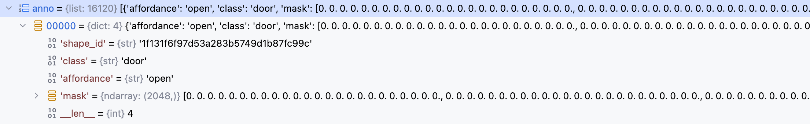
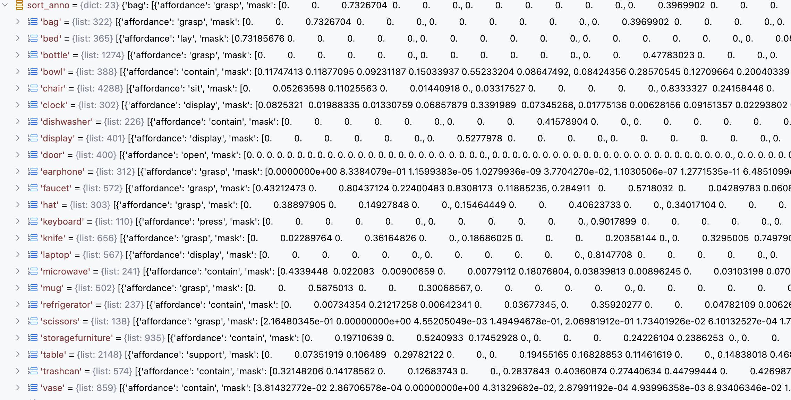

`LASO: Language-guided Affordance Segmentation on 3D Object 论文代码解读与复现` 

<!-- more -->

# LASO 模型代码解读与复现

> 论文: [https://openaccess.thecvf.com/content/CVPR2024/papers/Li_LASO_Language-guided_Affordance_Segmentation_on_3D_Object_CVPR_2024_paper.pdf](https://openaccess.thecvf.com/content/CVPR2024/papers/Li_LASO_Language-guided_Affordance_Segmentation_on_3D_Object_CVPR_2024_paper.pdf)
> 代码: [https://github.com/yl3800/LASO](https://github.com/yl3800/LASO)


这篇论文提出了一项新的任务和一个配套的数据集，旨在推动 **语言引导下的** 3D对象功能区域分割（Language-guided Affordance Segmentation on 3D Object, 简称 LASO）。

## 数据集

### 1. 基础数据来源

数据集基于 **3D-AffordanceNet** 提供的点云和功能区域标注构建：

- 每个物体都以点云形式表示；
- 点云中的每个点被标注为支持一个或多个功能类型（multi-class affordance labels），例如 grasp、open、lift、move 等；
- 这些功能标注是人工标注的，具有语义意义；

> **为什么使用 3D-AffordanceNet？** 
> - 因为它提供了高质量的点云和功能标注，能够很好地支持 LASO 的目标：根据自然语言问题找出与之相关的功能区域。


### 2. 构建问题（Question Crafting）

1. **选取物体-功能组合**：
   - 从 3D-AffordanceNet 中选取了 **58 种物体-功能组合**（如 mug-grasp、door-open 等）；
2. **手工设计问题**：
   - 对每种组合手工编写 **5 个代表性问题**；
3. **使用 GPT-4 扩展生成更多问题**：
   - 使用 GPT-4 为每个组合额外生成 **10 个问题**；
   - 总共得到 **870 个专家设计的问题**（58 × 15 = 870）；


   


在扩展过程中，GPT-4 生成的问题遵循以下三个关键原则，以确保问题多样性和语义丰富性：

| 原则 | 描述 |
|------|------|
| **Contextual Enrichment（上下文丰富化）** | 添加更多上下文细节，使问题更具体地连接目标对象的功能；<br>例：将 “Grasping scissors: top choice?” 改为 “Identify the key points on the scissors that ensure successful grasping.” |
| **Concise Phrasing（简洁表达）** | 提炼问题本质，使其简短但仍有意义； |
| **Structural Diversity（结构多样性）** | 使用不同句式结构（疑问句、陈述句等），防止模型偏向特定句式或长度； |

### 3. 标注 GT Mask（Ground Truth Mask）

对于每个问题，结合其对应的功能类型和原始点云标注信息，构造出对应的二值掩码 `gt_mask`：

- 每个点是否属于当前问题描述的功能区域；
- `gt_mask` 是 `(N,)` 形状的一维数组，其中 N 是点数；
- 数值可以是 0/1（binary mask），也可以是**软标签（soft label）**，表示点属于该功能区域的概率；
- 软标签通常用于边界模糊区域，反映点与功能核心区域的距离远近；

> 💡 注意：这些功能标签仅用于构造问题和定位正确功能区域，在训练和测试中不作为显式监督信号。

### 4. 数据集组织方式

数据总量：

- **总样本数**：19,751 个点云-问题配对；
- **物体类别数**：23 类；
- **功能类型数**：17 类；
- **问题总数**：870 个专家设计的问题；
- **每个物体类别可有多个形状实例**；
- **一个问题可以作用于多个物体类别**（泛化能力）；

数据集设置（两种模式）：

🔹 Seen（见过）

- 训练和测试阶段共享相似的物体类别和功能类型的分布；
- 目的是评估模型在熟悉场景下的表现；

🔹 Unseen（未见）

- 某些功能类型在特定物体类别下会从训练集中省略，但在测试集中保留；
- **目的是测试模型对新组合的泛化能力；**
- 例如：模型在训练期间学会了抓取包和杯子，但测试时要求“抓取耳机”——这是训练中未曾遇到过的功能-物体组合；

数据划分方式：

| 分区 | 物体类别数 | 问题数 | 样本数 |
|------|-------------|--------|---------|
| Train | 6883 | 638 | 16,120 |
| Val | 516 | 58 | 1,215 |
| Test | 1035 | 174 | 2,416 |

### 5. 数据增强与配对策略

训练阶段：

- 每次迭代中，每个形状实例随机匹配一个与其功能类型一致的问题；
- 随机配对使模型暴露于各种语义上下文中，提升泛化能力；

推理阶段（验证 & 测试）：

- 问题配对是固定的；
- 所有问题专属于评估阶段，不在训练中透露；
- 确保推理一致性，保持评估完整性；


### 6. 数据集统计信息（来自论文图3）

| 维度 | 内容 |
|------|------|
| 功能类型 | 17 类，如 grasp、open、lift、move 等 |
| 物体类别 | 23 类，如 mug、microwave、chair、door 等 |
| 物体-功能组合 | 58 种唯一组合（object-affordance pairs） |
| 问题总数 | 870 个定制化问题 |
| 点云-问题配对 | 19,751 对 |
| 点云来源 | 来自 3D-AffordanceNet，每个点云约 2048 个点 |

### 7. 代码实现

**数据集初始化的核心代码实现如下:**

```python
class AffordQ(Dataset):

    def __init__(self,
                 split='train',
                 **kwargs
                 ):
        # 数据集存放目录         
        data_root='LASO_dataset'
        # 数据集类型: 训练集，评估集，测试集
        self.split = split
        # 所支持的23种物体类型和17种功能类型 
        classes = ["Bag", "Bed", "Bowl","Clock", "Dishwasher", "Display", "Door", "Earphone", "Faucet",
            "Hat", "StorageFurniture", "Keyboard", "Knife", "Laptop", "Microwave", "Mug",
            "Refrigerator", "Chair", "Scissors", "Table", "TrashCan", "Vase", "Bottle"]
        
        afford_cl = ['lay','sit','support','grasp','lift','contain','open','wrap_grasp','pour', 
                     'move','display','push','pull','listen','wear','press','cut','stab']
        # 建立物体类型和功能类型的索引映射关系，神经网络模型只认识数字 
        self.cls2idx = {cls.lower():np.array(i).astype(np.int64) for i, cls in enumerate(classes)}
        self.aff2idx = {cls:np.array(i).astype(np.int64) for i, cls in enumerate(afford_cl)}
        # 加载标注数据
        with open(os.path.join(data_root, f'anno_{split}.pkl'), 'rb') as f:
            self.anno = pickle.load(f)
        # 加载点云数据
        with open(os.path.join(data_root, f'objects_{split}.pkl'), 'rb') as f:
            self.objects = pickle.load(f)

        # 加载58种物体-功能组合的标注数据 (数据组织形式，参考上文的 Affordance-Question数据可视化图)
        self.question_df = pd.read_csv(os.path.join(data_root, 'Affordance-Question.csv'))

        # sort anno by object class and affordance type -- 遍历标注数据列表
        self.sort_anno ={}
        for item in sorted(self.anno, key=lambda x: x['class']):
            # 获取当前样本的物体类别和物体信息值: 点云ID, 功能区域掩码, 功能类别
            key = item['class']
            value = {'shape_id': item['shape_id'], 'mask': item['mask'], 'affordance': item['affordance']}
            
            # 每种物体可以对应多种形状实例和功能类别
            if key not in self.sort_anno:
                # 如果当前物体类别不在排序后的字典中，直接添加
                self.sort_anno[key] = [value]
            else:
                # 如果当前物体类别在排序后的字典中，将当前样本的物体信息值追加到对应列表中
                self.sort_anno[key].append(value)
```
加载的标注数据中每个样本的组织形式如下:
- shape_id ：点云ID
- class ：物体类别（如bed）
- affordance ：功能类别（如lay）
- mask ：功能区域掩码（点级别标注）

   

   

   

**获取样本的代码实现:**

```python
    def __getitem__(self, index):
        # 根据样本索引取出样本数据
        data = self.anno[index]    
        # 获取当前样本对应的点云ID        
        shape_id = data['shape_id']
        # 获取当前样本对应的物体类别
        cls = data['class']
        #  获取当前样本对应的功能类型
        affordance = data['affordance']
        # 获取当前样本对应的功能区域掩码
        gt_mask = data['mask']
        # 取出当前样本对应的点云数据 ，（2048,3)
        point_set = self.objects[str(shape_id)]
        # 对点云数据进行归一化处理，消除尺度差异
        point_set,_,_ = pc_normalize(point_set)
        # 对点云数据进行转置操作 ，（3,2048)
        point_set = point_set.transpose()

        # 获取当前样本对应的问题文本(训练: 随机选； 验证&测试: 固定返回问题0)
        question = self.find_rephrase(self.question_df, cls, affordance)
        # 获取当前功能类型对应的索引值
        affordance = self.aff2idx[affordance]

        # 返回: 点云数据， 物体类别索引， 功能区域掩码， 问题文本， 功能类型索引
        return point_set, self.cls2idx[cls], gt_mask, question, affordance

    def find_rephrase(self, df, object_name, affordance):
        # 如果当前是训练模式，则从问题1～15中随机选择一个问题，否则固定返回问题0
        qid = str(np.random.randint(1, 15)) if self.split == 'train' else '0'
        qid = 'Question'+qid
        # 从 DataFrame df 中筛选出同时满足 物体名称匹配 和 功能属性匹配 的行，并仅保留 qid 指定的列，也就是取出上面随机选择的问题文本
        result = df.loc[(df['Object'] == object_name) & (df['Affordance'] == affordance), [qid]]
        # 问题文本不为空，则返回该问题文本
        if not result.empty:
            # return result.index[0], result.iloc[0]['Rephrase']
            return result.iloc[0][qid]
        else:
            raise NotImplementedError
```

### 8. 总结

LASO 数据集基于 3D-AffordanceNet 的点云和功能标注，结合人工+GPT-4 生成的多样化问题，构造出 19,751 个点云-问题配对，旨在实现语言引导下的 3D 功能区域分割，推动 3D 视觉与大语言模型（LLM）的深度融合。

## 模型实现

论文提出了一个全新的模型：**PointRefer**，用于解决一个新颖的任务 —— **语言引导的 3D 对象功能区域分割（LASO）**。

模型目标： 给定一个 3D 点云对象和一个自然语言问题（例如：“Where would you grasp this mug?”），PointRefer 的目标是预测出与该问题相关的点云区域，即生成一个二值掩码，表示哪些点属于目标功能区域。

PointRefer 包括以下核心模块：

1. **3D 骨干网络（3D Backbone）**
   - 使用 PointNet++ 编码点云特征；
   - 多阶段编码-解码结构提取多尺度点特征；

2. **自适应融合模块（Adaptive Fusion Module, AFM）**
   - 在不同解码层注入语言信息；
   - 实现语言引导下的跨模态融合；
   - 增强点特征的语义判别能力；

3. **参考点解码器（Referred Point Decoder, RPD）**
   - 引入一组可学习的“问题条件化查询”（affordance queries）；
   - 利用 Transformer 解码器将这些查询与点云特征进行交互；
   - 生成动态卷积核（dynamic kernels）；
   - 最终通过卷积操作生成分割掩码；

   

PointRefer 前向传播过程如下:

```python
class PointRefer(nn.Module):

    # 传入question文本 和 point点云数据 
    def forward(self, text, xyz):

        '''
        text: [B, L, 768]
        xyz: [B, 3, 2048]
        sub_box: bounding box of the interactive subject
        obj_box: bounding box of the interactive object
        '''
         
        B, C, N = xyz.size()
        # 使用RoBert编码文本 ，使用PointNet++编码点云
        t_feat, t_mask = self.forward_text(list(text), xyz.device)  # [batch, q_len, d_model]
        F_p_wise = self.point_encoder(xyz)     

        """ 
        Decoding
        """
        p_0, p_1, p_2, p_3 = F_p_wise  # 每个局部区域点坐标点，每个局部区域特征
        p_3[1] = self.gpb(t_feat, p_3[1].transpose(-2, -1)).transpose(-2, -1) # 每个区域特征充分和文本信息进行融合
        up_sample = self.fp3(p_2[0], p_3[0], p_2[1], p_3[1])   #[B, emb_dim, npoint_sa2] 特征传播

        up_sample = self.gpb(t_feat, up_sample.transpose(-2, -1)).transpose(-2, -1)
        up_sample = self.fp2(p_1[0], p_2[0], p_1[1], up_sample)    #[B, emb_dim, npoint_sa1]   
        
        up_sample = self.gpb(t_feat, up_sample.transpose(-2, -1)).transpose(-2, -1)         
        up_sample = self.fp1(p_0[0], p_1[0], torch.cat([p_0[0], p_0[1]],1), up_sample)  #[B, emb_dim, N]

        # t_feat = t_feat.sum(1)/(t_mask.float().sum(1).unsqueeze(-1))
        # t_feat = t_feat.unsqueeze(1).repeat(1, self.n_groups,1)
        # t_feat += self.pos1d

        # print(t_feat.shape, up_sample.shape)
        t_feat = self.decoder(t_feat, up_sample.transpose(-2, -1), tgt_key_padding_mask=t_mask, query_pos=self.pos1d) # b,l,c
        t_feat *= t_mask.unsqueeze(-1).float()
        _3daffordance = torch.einsum('blc,bcn->bln', t_feat, up_sample)
        _3daffordance = _3daffordance.sum(1)/(t_mask.float().sum(1).unsqueeze(-1))
        _3daffordance = torch.sigmoid(_3daffordance)
        # logits = self.cls_head(p_3[1].mean(-1))
        return _3daffordance.squeeze(-1)
```