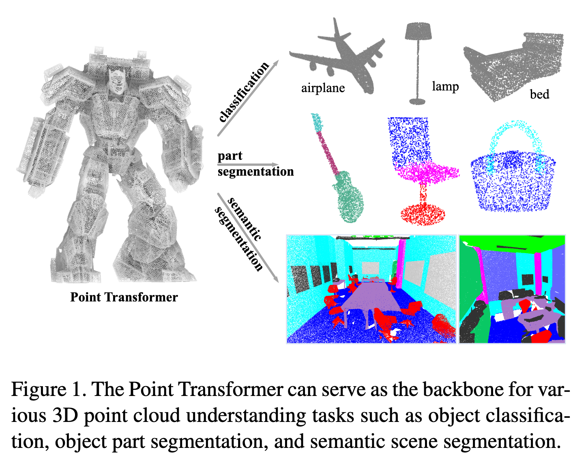
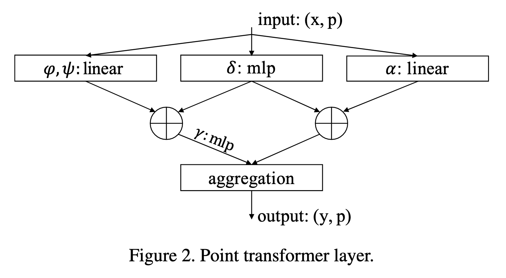

`Point Transformer 论文` 

<!-- more -->

> 论文: [Point Transformer](https://arxiv.org/abs/2012.09164)
> 代码: [https://github.com/POSTECH-CVLab/point-transformer](https://github.com/POSTECH-CVLab/point-transformer)

## 引言



**背景与动机**（如图1所示）：

* 3D 点云广泛存在于自动驾驶、增强现实和机器人等应用中，但它们与图像不同，是嵌入在连续空间的集合，因此传统基于卷积的视觉网络难以直接应用。

* 现有方法主要有三类：

  * 将点云体素化后应用 3D 离散卷积，但计算和内存开销大，并未充分利用点云稀疏性。
 
  * 使用稀疏卷积、池化或连续卷积直接在点上操作，部分缓解了计算负担。
 
  * 将点集构建成图结构，通过消息传递进行信息传播。

* Transformer 的自注意力机制天然适合点云，因为它对输入的排列和数量不敏感，而点云本质上就是集合结构。

---



**方法设计**（如图2所示）：

* 我们提出了 **Point Transformer 层**，能够处理点云的排列和数量不变性，通过局部邻域的自注意力传播信息。

* 在网络设计上，完全由自注意力和逐点操作组成，不依赖卷积操作，也不需要事先体素化。

* 通过对自注意力算子形式、局部邻域应用方式及位置编码方法的设计，构建了高表达能力的网络骨干，可用于多种 3D 理解任务。

---

**主要贡献**：

* 设计了高度表达能力的 **Point Transformer 层**，本质上适合点云处理，对排列和数量不敏感。

* 构建了基于 Point Transformer 层的高性能网络，可作为 3D 场景理解的通用骨干，适用于分类和密集预测任务。

* 在多个领域和数据集上进行了广泛实验，创下多个最先进水平，超越大量先前方法。

## 代码实现

### 向量自注意力层

`PointTransformerLayer` 类实现了Point Transformer论文中提出的向量自注意力机制，该机制是点云处理领域的重要创新。与传统的标量注意力不同，向量注意力能够更好地捕获3D空间中的几何关系。

**核心设计理念**：

- **向量化注意力**：注意力权重不再是标量，而是向量形式，能够编码更丰富的空间信息

- **位置感知**：通过位置编码函数θ将3D相对坐标信息融入注意力计算

- **局部邻域处理**：基于KNN构建的局部邻域，实现高效的点云特征聚合

**算法流程概述**：

1. **特征变换**：将输入特征通过线性层生成Q、K、V三元组

2. **邻域构建**：利用KNN算法为每个点构建局部邻域

3. **位置编码**：将相对坐标通过MLP网络映射到高维特征空间

4. **注意力计算**：结合特征差值和位置编码生成向量化注意力权重

5. **特征聚合**：基于注意力权重对邻域特征进行加权融合

完整的向量自注意力计算代码实现如下：

```python
class PointTransformerLayer(nn.Module):
    def __init__(self, in_planes, out_planes, share_planes=8, nsample=16):
        super().__init__()
        # 中间通道数，简化处理（这里直接等于 out_planes）
        self.mid_planes = mid_planes = out_planes // 1
        self.out_planes = out_planes
        self.share_planes = share_planes
        self.nsample = nsample

        # Q, K, V 的线性变换
        self.linear_q = nn.Linear(in_planes, mid_planes)   # 查询向量 (query)
        self.linear_k = nn.Linear(in_planes, mid_planes)   # 键向量 (key)
        self.linear_v = nn.Linear(in_planes, out_planes)   # 值向量 (value)

        # 位置编码 δ (论文 Eq.(4): δ = θ(pi − pj))
        # 输入是相对坐标 (3D)，输出是与 out_planes 对齐的特征
        self.linear_p = nn.Sequential(
            nn.Linear(3, 3),
            nn.BatchNorm1d(3),
            nn.ReLU(inplace=True),
            nn.Linear(3, out_planes)
        )

        # 权重生成函数 γ (MLP)，作用在 (q - k + δ) 上
        # 注意这里做了“通道分组”（share_planes），减少计算量
        self.linear_w = nn.Sequential(
            nn.BatchNorm1d(mid_planes),
            nn.ReLU(inplace=True),
            nn.Linear(mid_planes, mid_planes // share_planes),
            nn.BatchNorm1d(mid_planes // share_planes),
            nn.ReLU(inplace=True),
            nn.Linear(mid_planes // share_planes, out_planes // share_planes)
        )

        # softmax 用来对注意力权重归一化
        self.softmax = nn.Softmax(dim=1)

    def forward(self, pxo) -> torch.Tensor:
        # 输入:
        # p: 点的坐标 (n, 3)
        # x: 点的特征 (n, c)
        # o: batch 索引 (b)
        p, x, o = pxo

        # 得到 Q, K, V
        x_q, x_k, x_v = self.linear_q(x), self.linear_k(x), self.linear_v(x)  # (n, c)

        # 构建邻域 (kNN)，并返回局部邻域的特征
        # x_k: (n, nsample, 3+c)，包含相对坐标和 K 特征
        # x_v: (n, nsample, c)，邻域内的 V 特征
        x_k = pointops.queryandgroup(self.nsample, p, p, x_k, None, o, o, use_xyz=True)
        x_v = pointops.queryandgroup(self.nsample, p, p, x_v, None, o, o, use_xyz=False)

        # 分离相对坐标 p_r 和邻域内的 K 特征
        p_r, x_k = x_k[:, :, 0:3], x_k[:, :, 3:]

        # 将相对坐标 p_r 输入位置编码 MLP θ
        # 这里因为 BatchNorm 的维度问题，需要转置 (n, nsample, 3) ↔ (n, 3, nsample)
        for i, layer in enumerate(self.linear_p):
            p_r = layer(p_r.transpose(1, 2).contiguous()).transpose(1, 2).contiguous() if i == 1 else layer(p_r)
        # 经过 MLP 后: (n, nsample, out_planes)

        # 根据 Eq.(3): w = γ(φ(xi) − ψ(xj) + δ)
        # x_q.unsqueeze(1): (n, 1, c)，与邻域对齐
        # p_r reshape 后与 x_k 对齐做相加
        w = x_k - x_q.unsqueeze(1) + p_r.view(
            p_r.shape[0], p_r.shape[1], self.out_planes // self.mid_planes, self.mid_planes
        ).sum(2)  # (n, nsample, c)

        # 将 w 输入 γ MLP (linear_w)，得到注意力权重
        for i, layer in enumerate(self.linear_w):
            w = layer(w.transpose(1, 2).contiguous()).transpose(1, 2).contiguous() if i % 3 == 0 else layer(w)

        # softmax 归一化注意力权重
        w = self.softmax(w)  # (n, nsample, c)

        # 最终聚合 (Eq.(3) 中 ρ(...)*α(xj+δ))
        n, nsample, c = x_v.shape
        s = self.share_planes
        x = ((x_v + p_r).view(n, nsample, s, c // s) * w.unsqueeze(2)).sum(1).view(n, c)

        return x
```

下面针对上面部分代码进行进一步说明:

1. 计算注意力权重: 领域内最近邻键特征 - 领域所在中心点查询特征 + 相对位置编码(巧妙的view方式，个人理解是为了确保维度对齐)

```python 
        w = x_k - x_q.unsqueeze(1) + p_r.view(
            p_r.shape[0], p_r.shape[1], self.out_planes // self.mid_planes, self.mid_planes
        ).sum(2)  # (n, nsample, c)
```

2. 聚合: 对每个中心点的所有邻居点的特征在特征维度上进行分组，做通道分组(类似多头注意力，但是作用不完全相同) + 利用广播后做逐元素相乘，完成对同一个邻居点的所有通道分组应用相同权重分配的过程 + 所有邻居点特征进行求和，完成领域值信息聚合过程 + 多头重组回原貌

```python
    # （200，8，8，4） * （200，8，1，4） -> (200, 8, 8, 4) -> (200,8,4) -> (200,32)
    x = ((x_v + p_r).view(n, nsample, s, c // s) * w.unsqueeze(2)).sum(1).view(n, c)
```

分组计算过程可参考如下这个简化版例子:

```python
# 分组后的特征 (1个点，1个邻居，2组，每组2个通道)
grouped_features = torch.tensor([[
    [[1.0, 2.0],    # 组0: 通道0,1
     [3.0, 4.0]]    # 组1: 通道2,3
]])  # shape: (1, 1, 2, 2)

# 注意力权重 (16维权重，这里简化为2维)
attention_weights = torch.tensor([[
    [[0.5, 1.0]]    # 权重向量
]])  # shape: (1, 1, 1, 2)

# 逐元素相乘
result = grouped_features * attention_weights
# [[[[1.0*0.5, 2.0*1.0],   # 组0: [0.5, 2.0]
#    [3.0*0.5, 4.0*1.0]]]] # 组1: [1.5, 4.0]
```

**这实际上是一种分组通道注意力（Grouped Channel Attention**）：

1. 不是在序列维度上做注意力（token-token）

2. 而是在通道维度上做注意力（channel-channel）

3. 通过分组实现参数共享

---

`queryandgroup` 方法实现了点云的邻域查询和特征分组功能。具体流程如下：

1. **邻域查询**：对于查询点集合中的每个点，利用 `KNN` 算法在所有点集合中寻找最近的 `nsample` 个邻居点，并返回这些邻居点的索引；

2. **相对坐标计算**：将每个查询点的邻居点坐标减去查询点自身坐标，得到以查询点为原点的局部相对坐标系；

3. **特征分组**：根据邻居点索引，提取对应的特征向量，形成每个查询点的邻域特征集合。

该方法的核心作用是将无序的点云数据转换为有序的局部邻域结构，为后续的注意力计算提供空间上下文信息。完整代码实现如下所示:

```python
def queryandgroup(nsample, xyz, new_xyz, feat, idx, offset, new_offset, use_xyz=True):
    """
    查询并分组函数：为每个查询点找到最近邻并分组其特征
    input:
        nsample: 最近邻数量
        xyz: 所有点的坐标 (n, 3)
        new_xyz: 查询点的坐标 (m, 3)
        feat: 所有点的特征 (n, c)
        idx: 预计算的最近邻索引，如果为None则重新计算
        offset: 每个batch的点的结束索引 (b)
        new_offset: 每个batch的查询点的结束索引 (b)
        use_xyz: 是否在输出中包含相对坐标信息
    output:
        new_feat: 分组后的特征，如果use_xyz=True则为(m, nsample, 3+c)，否则为(m, nsample, c)
        grouped_idx: 分组后的索引 (m, nsample)
    """
    assert xyz.is_contiguous() and new_xyz.is_contiguous() and feat.is_contiguous()

    # 如果没有指定查询点，则使用所有点作为查询点
    if new_xyz is None:
        new_xyz = xyz

    # 如果没有提供预计算的索引，则调用KNN查询函数计算
    if idx is None:
        idx, _ = knnquery(nsample, xyz, new_xyz, offset, new_offset)  # (m, nsample)

    n, m, c = xyz.shape[0], new_xyz.shape[0], feat.shape[1]

    # 根据索引分组坐标：获取每个查询点的邻居坐标
    grouped_xyz = xyz[idx.view(-1).long(), :].view(m, nsample, 3)  # (m, nsample, 3)

    # 计算相对坐标：邻居坐标减去查询点坐标（局部坐标系）： （200，8，3） -  （200，1，3）= （ 200,8,3 ）
    grouped_xyz -= new_xyz.unsqueeze(1)  # (m, nsample, 3)

    # 根据索引分组特征：获取每个查询点的邻居特征
    grouped_feat = feat[idx.view(-1).long(), :].view(m, nsample, c)  # (m, nsample, c)

    # 根据use_xyz标志决定输出格式
    if use_xyz:
        # 拼接相对坐标和特征：输出形状为(m, nsample, 3+c)
        return torch.cat((grouped_xyz, grouped_feat), -1)
    else:
        # 只返回特征：输出形状为(m, nsample, c)
        return grouped_feat
```

`KNNQuery` 类实现了K近邻查询算法，其主要功能是为每个查询点寻找最近的邻居点。具体实现包含以下几个关键步骤：

**1. 问题背景**：在批处理点云数据时，不同样本的点云可能包含不同数量的点（如第一个点云1024个点，第二个点云2048个点），因此需要使用 `offset` 和 `new_offset` 参数来标记每个batch中点云的边界范围。

**2. 算法流程**：

- 对于每个查询点，计算其与当前batch内所有候选点的欧几里得距离

- 使用 `torch.topk` 函数选出距离最小的 `nsample` 个点

- 返回最近邻点的索引和对应的距离值

**3. 实现特点**：采用批处理方式提高计算效率，同时处理点云数量不一致的情况。完整代码实现如下:

```python
class KNNQuery(Function):
    @staticmethod
    def forward(ctx, nsample, xyz, new_xyz, offset, new_offset):
        """
        KNN查询的前向传播函数
        input:
            nsample: 需要查询的最近邻数量
            xyz: 所有点的坐标 (n, 3)
            new_xyz: 查询点的坐标 (m, 3)，如果为None则使用xyz
            offset: 每个batch的点的结束索引 (b)
            new_offset: 每个batch的查询点的结束索引 (b)
        output:
            idx: 每个查询点的最近邻点索引 (m, nsample)
            dist2: 每个查询点到最近邻点的平方距离 (m, nsample)
        """
        if new_xyz is None:
            new_xyz = xyz  # 如果没有指定查询点，则对所有点进行自查询
        assert xyz.is_contiguous() and new_xyz.is_contiguous()
        m = new_xyz.shape[0]  # 查询点的数量

        # 初始化输出张量：索引矩阵和距离矩阵
        idx = torch.zeros((m, nsample), dtype=torch.long)
        dist2 = torch.zeros((m, nsample))

        # 按batch处理数据
        start_idx, new_start_idx = 0, 0  # 当前batch的起始索引
        for i in range(len(offset)):
            # 计算当前batch的结束索引
            end_idx = offset[i] if i < len(offset) else xyz.shape[0]
            new_end_idx = new_offset[i] if i < len(new_offset) else m

            # 确保当前batch有数据需要处理
            if end_idx > start_idx and new_end_idx > new_start_idx:
                # 提取当前batch的点坐标和查询点坐标
                batch_xyz = xyz[start_idx:end_idx]
                batch_new_xyz = new_xyz[new_start_idx:new_end_idx]

                # 计算查询点与所有点之间的欧几里得距离平方
                # 使用广播机制计算坐标差: (1,n,3) - (m,1,3) = (m,n,3) - (m,n,3) = (m_batch, n_batch, 3)
                diff = batch_xyz.unsqueeze(0) - batch_new_xyz.unsqueeze(1)  
                # (m_batch, n_batch) - 平方距离矩阵
                distances = torch.sum(diff ** 2, dim=-1)

                # 获取k个最近邻的索引和距离
                actual_nsample = min(nsample, distances.shape[1])  # 实际可用的最近邻数量
                # torch.topk返回最小的k个值及其索引: (m_batch,actual_nsample)
                knn_dist, knn_idx = torch.topk(distances, actual_nsample, dim=1, largest=False)

                # 如果实际邻居数量小于要求的nsample，进行填充
                if actual_nsample < nsample:
                    # 使用0填充索引和距离矩阵
                    padding = torch.zeros((knn_idx.shape[0], nsample - actual_nsample), dtype=knn_idx.dtype)
                    knn_idx = torch.cat([knn_idx, padding], dim=1)
                    knn_dist = torch.cat(
                        [knn_dist, torch.zeros((knn_dist.shape[0], nsample - actual_nsample), dtype=knn_dist.dtype)],
                        dim=1)

                # 将当前batch的结果存入总输出中，注意加上全局偏移量
                idx[new_start_idx:new_end_idx] = knn_idx + start_idx
                dist2[new_start_idx:new_end_idx] = knn_dist

            # 更新下一个batch的起始索引
            start_idx, new_start_idx = end_idx, new_end_idx

        # 返回最近邻索引和实际距离（加上小常数避免数值不稳定）
        return idx, torch.sqrt(dist2 + 1e-8)
```

### Point Transformer 残差块

`PointTransformerBlock` 类是 `Point Transformer` 残差块，是` Point Transformer` 架构中的基本构建模块 , 其代码实现如下所示:

```python
class PointTransformerBlock(nn.Module):
    """
    Point Transformer 残差块
    实现预激活（Pre-Activation）的残差连接结构
    """
    expansion = 1  # 维度扩展系数，1表示输出维度与输入维度相同

    def __init__(self, in_planes, planes, share_planes=8, nsample=16):
        """
        初始化函数
        Args:
            in_planes: 输入特征维度
            planes: 中间特征维度（也是输出维度，因为expansion=1）
            share_planes: 通道分组数，用于减少计算量
            nsample: 每个点的邻居数量，用于kNN搜索
        """
        super(PointTransformerBlock, self).__init__()
        
        # 第一层：线性变换 + 批归一化（升维或保持维度）
        self.linear1 = nn.Linear(in_planes, planes, bias=False)  # 无偏置，因为后面有BN
        self.bn1 = nn.BatchNorm1d(planes)  # 批归一化，加速训练
        
        # 核心：Point Transformer 自注意力层
        self.transformer2 = PointTransformerLayer(planes, planes, share_planes, nsample)
        self.bn2 = nn.BatchNorm1d(planes)  # Transformer后的批归一化
        
        # 第三层：线性变换 + 批归一化（调整到最终输出维度）
        self.linear3 = nn.Linear(planes, planes * self.expansion, bias=False)
        self.bn3 = nn.BatchNorm1d(planes * self.expansion)  # 最终批归一化
        
        # 激活函数（原地操作节省内存）
        self.relu = nn.ReLU(inplace=True)
        
        # 注意：这里应该有残差连接的shortcut处理
        # 如果 in_planes != planes * expansion，需要投影层
        if in_planes != planes * self.expansion:
            self.shortcut = nn.Sequential(
                nn.Linear(in_planes, planes * self.expansion, bias=False),
                nn.BatchNorm1d(planes * self.expansion)
            )
        else:
            self.shortcut = nn.Identity()  # 恒等映射

    def forward(self, pxo):
        """
        前向传播
        Args:
            pxo: 元组 (p, x, o)
                p: 点坐标，形状 (n, 3)
                x: 点特征，形状 (n, in_planes)  
                o: 批次索引，形状 (b)
        Returns:
            元组 (p, x, o): 变换后的点坐标、特征和批次索引
        """
        p, x, o = pxo  # 解包：点坐标, 点特征, batch索引
        
        # 保存原始输入用于残差连接（需要处理维度匹配）
        identity = x
        
        # 第一层：线性变换 → BN → ReLU
        x = self.linear1(x)      # (n, in_planes) → (n, planes)
        x = self.bn1(x)          # 批归一化
        x = self.relu(x)         # ReLU激活
        
        # 第二层：Point Transformer 自注意力 → BN → ReLU
        x = self.transformer2([p, x, o])  # 应用自注意力，形状 (n, planes)
        x = self.bn2(x)          # 批归一化
        x = self.relu(x)         # ReLU激活
        
        # 第三层：线性变换 → BN
        x = self.linear3(x)      # (n, planes) → (n, planes * expansion)
        x = self.bn3(x)          # 最终批归一化
        
        # 残差连接：处理维度匹配问题
        identity = self.shortcut(identity)  # 如果需要，投影到相同维度
        
        # 残差连接 + 激活
        x += identity            # 添加残差连接
        x = self.relu(x)         # 最终ReLU激活
        
        # 返回相同格式的数据
        return [p, x, o]
```

### 下采样层

**TransitionDown层的主要作用是在点云处理中进行层次化的特征学习和分辨率降低**，类似于CNN中的下采样层（如池化层），但专门为点云数据设计。

1. **降低点云分辨率**（当stride≠1时）

```python
# 输入: 1000个点 → 输出: 500个点（stride=2时）
# 通过最远点采样选择最具代表性的点 subset
```

2. **增加特征维度**  

```python
# 输入: 64维特征 → 输出: 128维特征
# 扩展每个点的特征表达能力
```

3. **聚合局部信息**

```python
# 为每个采样点聚合其邻域内的特征信息
# 使用最大池化提取最显著的特征
```

4. **保持几何结构**

```python
# 下采样后的点云仍然保持原始点云的几何形状
# 最远点采样确保点分布均匀
```
相当于CNN中的：

- **MaxPooling**（降低分辨率）

- **Conv1x1**（增加通道数）  

- **局部感受野**（聚合邻域信息）

的三合一操作，但专门为**无序、不规则的点云数据**设计。 通常用在层次化架构中：

```
高分辨率 → TransitionDown → 中分辨率 → TransitionDown → 低分辨率
很多点      ↓              中等点     ↓              少量点
浅层特征    ↓              中层特征   ↓              深层特征
```

完整代码实现如下:

```python
class TransitionDown(nn.Module):
    """
    点云下采样过渡层
    功能：降低点云分辨率同时增加特征维度，保持批处理信息
    """
    def __init__(self, in_planes, out_planes, stride=1, nsample=16):
        """
        初始化下采样层
        Args:
            in_planes: 输入特征维度
            out_planes: 输出特征维度  
            stride: 下采样步长（stride=1表示无下采样，只做特征变换）
            nsample: 邻域采样点数，用于局部特征聚合
        """
        super().__init__()
        self.stride = stride    # 下采样率
        self.nsample = nsample  # 邻域采样数
        
        if stride != 1:
            # 下采样模式：需要处理坐标和特征，输出维度为3+in_planes
            self.linear = nn.Linear(3 + in_planes, out_planes, bias=False)  # 无偏置，因为后面有BN
            self.pool = nn.MaxPool1d(nsample)  # 最大池化，聚合邻域特征
        else:
            # 无下采样模式：只做特征变换
            self.linear = nn.Linear(in_planes, out_planes, bias=False)
        
        # 共享的批归一化和激活函数
        self.bn = nn.BatchNorm1d(out_planes)  # 批归一化
        self.relu = nn.ReLU(inplace=True)     # ReLU激活函数（原地操作节省内存）
        
    def forward(self, pxo):
        """
        前向传播
        Args:
            pxo: 元组 (p, x, o)
                p: 点坐标，形状 (n, 3)
                x: 点特征，形状 (n, in_planes)
                o: 批次索引，形状 (b) - 每个元素表示该批次点的结束索引
        Returns:
            元组 (p, x, o): 下采样后的点坐标、特征和批次索引
        """
        p, x, o = pxo  # 解包：点坐标, 点特征, 批次索引
        
        if self.stride != 1:
            # ==================== 下采样模式 ====================
            # 计算下采样后的批次索引 n_o 
            n_o, count = [o[0].item() // self.stride], o[0].item() // self.stride
            for i in range(1, o.shape[0]):
                # 计算每个批次下采样后的点数
                count += (o[i].item() - o[i-1].item()) // self.stride
                n_o.append(count)
            n_o = torch.IntTensor(n_o).to(o.device)  # 转换为张量并保持设备一致
            
            # 1. 最远点采样：从原始点云中选择代表性点
            idx = pointops.furthestsampling(p, o, n_o)  # (m) - 采样点索引，m为下采样后的点数
            n_p = p[idx.long(), :]  # (m, 3) - 下采样后的点坐标
            
            # 2. 查询和分组：为每个采样点找到邻域并聚合特征
            # 输出形状: (m, 3 + in_planes, nsample)
            # 包含：相对坐标(3) + 原始特征(in_planes)
            x = pointops.queryandgroup(self.nsample, p, n_p, x, None, o, n_o, use_xyz=True)
            
            # 3. 线性变换 + BN + ReLU
            # 先将特征维度转到最后： (m, 3+c, nsample) → (m, nsample, 3+c)
            x = self.linear(x.transpose(1, 2).contiguous())  # (m, nsample, out_planes)
            x = self.bn(x.transpose(1, 2).contiguous())      # (m, out_planes, nsample) - BN要求通道维度在前
            x = self.relu(x)                                # ReLU激活
            
            # 4. 最大池化：在邻域维度上池化，得到每个点的最终特征
            x = self.pool(x)          # (m, out_planes, 1) - 沿nsample维度池化
            x = x.squeeze(-1)         # (m, out_planes) - 移除最后一个维度
            
            # 更新点和批次信息
            p, o = n_p, n_o  # 使用下采样后的点坐标和批次索引
            
        else:
            # ==================== 无下采样模式 ====================
            # 只进行特征变换：Linear → BN → ReLU
            x = self.linear(x)    # (n, in_planes) → (n, out_planes)
            x = self.bn(x)        # 批归一化
            x = self.relu(x)      # ReLU激活
        
        # 返回相同格式的数据
        return [p, x, o]
```
**最远点采样（FPS）算法**：

1. 初始化：随机选择一个起始点

2. 迭代选择：

    - 计算所有点到已选点集的最小距离

    - 选择距离最大的点（即最远的点）
    
    - 重复直到选择足够多的点

```python
class FurthestSampling(Function):
    """
    最远点采样（Farthest Point Sampling）的自定义PyTorch函数
    用于从点云中选择分布最均匀的点的子集
    """
    @staticmethod
    def forward(ctx, xyz, offset, new_offset):
        """
        前向传播：执行最远点采样算法
        
        Args:
            ctx: 上下文对象，用于存储反向传播需要的信息
            xyz: 输入点云坐标，形状为 (n, 3)，需要是内存连续的
            offset: 原始批次索引，形状为 (b)，每个元素表示该批次点的结束位置
            new_offset: 目标批次索引，形状为 (b)，每个元素表示下采样后该批次点的结束位置
            
        Returns:
            idx: 采样点的索引，形状为 (m)，其中 m = new_offset[-1]
        """
        # 确保输入张量是内存连续的
        assert xyz.is_contiguous()
        
        n, b = xyz.shape[0], offset.shape[0]  # n: 总点数, b: 批次数
        # 创建输出索引张量，大小为下采样后的总点数
        idx = torch.zeros(new_offset[b-1].item(), dtype=torch.long, device=xyz.device)
        
        # CPU实现的最远点采样算法
        start_idx = 0  # 当前批次的起始索引
        result_idx = 0  # 结果中的当前写入位置
        
        # 遍历每个批次
        for i in range(b):
            # 计算当前批次的结束索引
            end_idx = offset[i] if i < b else n
            batch_size = end_idx - start_idx  # 当前批次的点数
            
            if batch_size > 0:
                # 创建选择标记数组，初始全为False
                selected = torch.zeros(batch_size, dtype=torch.bool, device=xyz.device)
                # 随机选择第一个点（这里固定选择第一个点）
                selected[0] = True
                
                # 初始化距离数组，存储每个点到已选点集的最小距离
                dist = torch.full((batch_size,), float('inf'), device=xyz.device)
                
                # 计算当前批次需要采样的点数
                if i == 0:
                    num_to_sample = new_offset[i].item()  # 第一个批次
                else:
                    num_to_sample = new_offset[i].item() - new_offset[i-1].item()  # 后续批次
                
                # 执行最远点采样迭代
                for j in range(1, min(batch_size, num_to_sample)):
                    # 更新距离：计算所有点到最新选中点的距离，并取最小值
                    last_selected = torch.where(selected)[0][-1]  # 最后一个选中的点
                    new_dist = torch.sum((batch_xyz - batch_xyz[last_selected]) ** 2, dim=1)  # 计算欧氏距离平方
                    dist = torch.minimum(dist, new_dist)  # 保持每个点的最小距离
                    
                    # 选择距离最大的点（离已选点集最远的点）
                    next_point = torch.argmax(dist)
                    selected[next_point] = True  # 标记为已选
                    dist[next_point] = 0  # 将该点的距离设为0，避免重复选择
                
                # 存储选中的索引（需要加上批次的起始偏移）
                selected_indices = torch.where(selected)[0] + start_idx
                idx[result_idx:result_idx + len(selected_indices)] = selected_indices
                result_idx += len(selected_indices)
            
            # 移动到下一个批次
            start_idx = end_idx
        
        return idx
```

### 上采样层

**TransitionUp层的主要作用是在点云处理中恢复分辨率并融合多尺度特征**，类似于CNN中的上采样层（如转置卷积），但专门为点云数据设计。

1. **恢复点云分辨率**

```python
# 将低分辨率特征上采样到高分辨率
# 输入: 500个点 → 输出: 1000个点（分辨率恢复）
```

2. **多尺度特征融合**

```python
# 融合编码器（深层抽象特征）和解码器（浅层细节特征）
# 结合高层语义信息和底层几何细节
```

3. **特征增强**

```python
# 通过全局上下文信息增强局部特征
# 每个点都能感知整个点云的全局信息
```

4. **构建解码器路径**

```python
# 在U-Net类架构中逐步恢复空间分辨率
# 同时保持丰富的特征表示
```

**两种工作模式**：

- 模式1：**全局特征增强**（无跳跃连接）

```
当前层特征 → 计算全局平均特征 → 与每个点特征拼接 → 增强表示
```

- 模式2：**跳跃连接融合**（有跳跃连接）

```
当前层特征 + 上采样的编码器特征 → 融合 → 输出
```

通常用在解码器中，与编码器的TransitionDown对应：

```
编码器: 高分辨率 → TransitionDown → 中分辨率 → TransitionDown → 低分辨率

解码器: 低分辨率 → TransitionUp → 中分辨率 → TransitionUp → 高分辨率
```

相当于CNN中的：

- **转置卷积/上采样**（恢复分辨率）

- **跳跃连接**（融合多尺度特征）  

- **注意力机制**（引入全局上下文）

的组合操作，但专门为**点云数据**设计; 完整代码实现如下所示:

```python
class TransitionUp(nn.Module):
    """
    点云上采样过渡层
    功能：恢复点云分辨率并融合不同层级的特征，实现特征上采样
    类似于CNN中的上采样/转置卷积层，但专为点云设计
    """
    def __init__(self, in_planes, out_planes=None):
        """
        初始化上采样层
        Args:
            in_planes: 输入特征维度
            out_planes: 输出特征维度（如果为None，则输出维度与输入相同）
        """
        super().__init__()
        
        if out_planes is None:
            # 模式1：输出维度与输入相同（通常用于解码器中间层）
            self.linear1 = nn.Sequential(
                nn.Linear(2 * in_planes, in_planes),  # 将拼接后的特征映射回原维度
                nn.BatchNorm1d(in_planes),            # 批归一化
                nn.ReLU(inplace=True)                 # ReLU激活
            )
            self.linear2 = nn.Sequential(
                nn.Linear(in_planes, in_planes),      # 全局特征变换
                nn.ReLU(inplace=True)                 # ReLU激活
            )
        else:
            # 模式2：改变输出维度（通常用于连接编码器和解码器）
            self.linear1 = nn.Sequential(
                nn.Linear(out_planes, out_planes),    # 恒等映射变换
                nn.BatchNorm1d(out_planes),           # 批归一化
                nn.ReLU(inplace=True)                 # ReLU激活
            )
            self.linear2 = nn.Sequential(
                nn.Linear(in_planes, out_planes),     # 维度变换
                nn.BatchNorm1d(out_planes),           # 批归一化
                nn.ReLU(inplace=True)                 # ReLU激活
            )
        
    def forward(self, pxo1, pxo2=None):
        """
        前向传播：两种模式
        Mode 1 (pxo2 is None): 仅使用全局特征增强当前层特征
        Mode 2 (pxo2 provided): 跳跃连接 - 融合深层特征和浅层特征
        
        Args:
            pxo1: 元组 (p, x, o) - 当前层的点坐标、特征、批次索引
            pxo2: 元组 (p, x, o) - 跳跃连接来自编码器的点坐标、特征、批次索引（可选）
            
        Returns:
            x: 上采样后的特征，形状与pxo1中的特征相同或变换后的维度
        """
        if pxo2 is None:
            # ==================== 模式1：全局特征增强 ====================
            # 仅使用当前层特征进行自增强（无跳跃连接）
            _, x, o = pxo1  # 解包：忽略坐标，只取特征和批次索引
            
            x_tmp = []  # 存储处理后的每个批次特征
            
            # 按批次处理
            for i in range(o.shape[0]):
                # 计算当前批次的起始、结束索引和点数
                if i == 0:
                    s_i, e_i, cnt = 0, o[0].item(), o[0].item()  # 第一个批次
                else:
                    s_i, e_i = o[i-1].item(), o[i].item()        # 后续批次
                    cnt = e_i - s_i                              # 当前批次点数
                
                # 提取当前批次的特征
                x_b = x[s_i:e_i, :]  # (cnt, in_planes)
                
                # 计算全局平均特征并变换
                global_feat = x_b.sum(0, keepdim=True) / cnt  # (1, in_planes) - 批次平均特征
                transformed_global = self.linear2(global_feat)  # (1, in_planes) - 变换后的全局特征
                
                # 将全局特征复制到每个点，并与原始特征拼接
                x_b = torch.cat((x_b, transformed_global.repeat(cnt, 1)), dim=1)  # (cnt, 2*in_planes)
                
                x_tmp.append(x_b)
            
            # 合并所有批次
            x = torch.cat(x_tmp, 0)  # (n, 2*in_planes)
            
            # 最终变换：降维 + 激活
            x = self.linear1(x)  # (n, in_planes)
            
        else:
            # ==================== 模式2：跳跃连接特征融合 ====================
            # 融合编码器（深层）和解码器（浅层）的特征
            p1, x1, o1 = pxo1  # 当前层（解码器）：通常分辨率更高
            p2, x2, o2 = pxo2  # 跳跃连接层（编码器）：通常特征更抽象
            
            # 处理当前层特征
            x1_transformed = self.linear1(x1)  # (n1, out_planes)
            
            # 处理跳跃连接特征并进行上采样（插值）
            x2_transformed = self.linear2(x2)  # (n2, out_planes)
            
            # 将深层特征上采样到浅层分辨率：通过点云插值
            # 将p2位置的特征插值到p1位置
            x2_upsampled = pointops.interpolation(p2, p1, x2_transformed, o2, o1)
            
            # 特征融合：当前层特征 + 上采样的编码器特征
            x = x1_transformed + x2_upsampled  # 逐元素相加
            
        return x
```

**该插值流程就是**：对每个目标点，找到源点云的 k 个最近邻 → 根据反距离加权分配权重 → 用邻居特征加权求和 → 得到目标点特征。

```python
def interpolation(xyz, new_xyz, feat, offset, new_offset, k=3):
    """
    点云特征插值函数（基于 KNN + 反距离加权）
    
    Args:
        xyz: (m, 3) 源点云坐标（低分辨率点云，比如 encoder 输出）
        new_xyz: (n, 3) 目标点云坐标（高分辨率点云，比如 decoder 对应层）
        feat: (m, c) 源点云的特征
        offset: (b) 每个 batch 的点数累积和（源点云）
        new_offset: (b) 每个 batch 的点数累积和（目标点云）
        k: int，插值时选取的近邻点个数（默认3）
    
    Returns:
        new_feat: (n, c)，插值到目标点上的特征
    """
    # 确保输入 tensor 在内存中是连续存放的，提高计算效率
    assert xyz.is_contiguous() and new_xyz.is_contiguous() and feat.is_contiguous()
    
    # 在源点云 xyz 中，查找目标点云 new_xyz 的 k 个最近邻
    # idx: (n, k) 最近邻点索引
    # dist: (n, k) 最近邻点对应的欧氏距离
    idx, dist = knnquery(k, xyz, new_xyz, offset, new_offset)  # (n, 3), (n, 3)
    
    # 计算距离的倒数，避免除零加一个小量
    dist_recip = 1.0 / (dist + 1e-8)  # (n, k)
    
    # 对权重进行归一化，使每个点的权重和为 1
    norm = torch.sum(dist_recip, dim=1, keepdim=True)  # (n, 1)
    weight = dist_recip / norm  # (n, k)
    
    # 初始化插值后的特征 (n, c)，全零
    new_feat = torch.zeros((new_xyz.shape[0], feat.shape[1]), dtype=feat.dtype)
    
    # 遍历每个近邻点（这里默认 k=3）
    for i in range(k):
        indices = idx[:, i].long()  # 第 i 个邻居的索引
        # 有效性检查：确保索引在合法范围内
        valid_mask = (indices >= 0) & (indices < feat.shape[0])
        
        if valid_mask.any():
            # 对有效邻居点：加权累加特征
            # feat[indices] : (n, c) 邻居点特征
            # weight[:, i].unsqueeze(-1) : (n, 1) 权重
            # → 逐点乘法，最后累加到 new_feat
            new_feat[valid_mask] += feat[indices[valid_mask], :] * weight[valid_mask, i].unsqueeze(-1)
    
    return new_feat
```

### Point Transformer 主模型

```python
class PointTransformerSeg(nn.Module):
    """
    Point Transformer 用于点云语义分割的网络
    采用编码器-解码器结构（类似 U-Net），
    编码器用于下采样和提取抽象特征，
    解码器用于上采样和特征融合，最终输出每个点的类别概率。
    """
    def __init__(self, block, blocks, c=6, k=13):
        """
        Args:
            block: 点变换模块类型（Point Transformer Block）
            blocks: 每一层包含 block 数量列表
            c: 输入点特征维度（通常是 xyz + 额外特征）
            k: 分类类别数量
        """
        super().__init__()
        self.c = c
        self.in_planes, planes = c, [32, 64, 128, 256, 512]  # 编码器各层输出通道
        fpn_planes, fpnhead_planes, share_planes = 128, 64, 8
        stride, nsample = [1, 4, 4, 4, 4], [8, 16, 16, 16, 16]  # 下采样比例与邻居点数

        # ========== 编码器 ========== 
        # enc1: 分辨率 N/1
        self.enc1 = self._make_enc(block, planes[0], blocks[0], share_planes, stride=stride[0], nsample=nsample[0])
        # enc2: 分辨率 N/4
        self.enc2 = self._make_enc(block, planes[1], blocks[1], share_planes, stride=stride[1], nsample=nsample[1])
        # enc3: 分辨率 N/16
        self.enc3 = self._make_enc(block, planes[2], blocks[2], share_planes, stride=stride[2], nsample=nsample[2])
        # enc4: 分辨率 N/64
        self.enc4 = self._make_enc(block, planes[3], blocks[3], share_planes, stride=stride[3], nsample=nsample[3])
        # enc5: 分辨率 N/256
        self.enc5 = self._make_enc(block, planes[4], blocks[4], share_planes, stride=stride[4], nsample=nsample[4])

        # ========== 解码器 ========== 
        # dec5: 解码器最深层，转换 p5 特征（is_head=True 表示输出头，不进行 skip 融合）
        self.dec5 = self._make_dec(block, planes[4], 2, share_planes, nsample=nsample[4], is_head=True)
        # dec4: 融合 p5 与 p4
        self.dec4 = self._make_dec(block, planes[3], 2, share_planes, nsample=nsample[3])
        # dec3: 融合 p4 与 p3
        self.dec3 = self._make_dec(block, planes[2], 2, share_planes, nsample=nsample[2])
        # dec2: 融合 p3 与 p2
        self.dec2 = self._make_dec(block, planes[1], 2, share_planes, nsample=nsample[1])
        # dec1: 融合 p2 与 p1
        self.dec1 = self._make_dec(block, planes[0], 2, share_planes, nsample=nsample[0])

        # 分类头：每个点输出 k 个类别得分
        self.cls = nn.Sequential(
            nn.Linear(planes[0], planes[0]),
            nn.BatchNorm1d(planes[0]),
            nn.ReLU(inplace=True),
            nn.Linear(planes[0], k)
        )

    # ========== 构建编码器层 ========== 
    def _make_enc(self, block, planes, blocks, share_planes=8, stride=1, nsample=16):
        layers = []
        # TransitionDown: 点云下采样 + 特征升维
        layers.append(TransitionDown(self.in_planes, planes * block.expansion, stride, nsample))
        self.in_planes = planes * block.expansion
        # 后续 block 叠加处理下采样后的特征
        for _ in range(1, blocks):
            layers.append(block(self.in_planes, self.in_planes, share_planes, nsample=nsample))
        return nn.Sequential(*layers)

    # ========== 构建解码器层 ========== 
    def _make_dec(self, block, planes, blocks, share_planes=8, nsample=16, is_head=False):
        layers = []
        # TransitionUp: 点云上采样 + 特征融合
        # is_head=True 时表示输出层，不进行 skip 融合
        layers.append(TransitionUp(self.in_planes, None if is_head else planes * block.expansion))
        self.in_planes = planes * block.expansion
        # 后续 block 叠加处理上采样后的特征
        for _ in range(1, blocks):
            layers.append(block(self.in_planes, self.in_planes, share_planes, nsample=nsample))
        return nn.Sequential(*layers)

    # ========== 前向传播 ========== 
    def forward(self, pxo):
        """
        Args:
            pxo: tuple (p0, x0, o0)
                p0: (n,3) 点坐标
                x0: (n,c) 点特征
                o0: (b) 每个 batch 的点累积偏移
        Returns:
            x: (n,k) 每个点的类别预测
        """
        p0, x0, o0 = pxo

        # 如果输入特征只有 xyz，直接使用 p0，否则拼接额外特征
        x0 = p0 if self.c == 3 else torch.cat((p0, x0), 1)

        # ================= 编码器 =================
        p1, x1, o1 = self.enc1([p0, x0, o0])
        p2, x2, o2 = self.enc2([p1, x1, o1])
        p3, x3, o3 = self.enc3([p2, x2, o2])
        p4, x4, o4 = self.enc4([p3, x3, o3])
        p5, x5, o5 = self.enc5([p4, x4, o4])

        # ================= 解码器 =================
        # 注意 decX[0] 是 TransitionUp，上采样层
        # decX[1:] 是 Point Transformer Block，处理上采样后的特征
        x5 = self.dec5[1:]([p5, self.dec5[0]([p5, x5, o5]), o5])[1]
        x4 = self.dec4[1:]([p4, self.dec4[0]([p4, x4, o4], [p5, x5, o5]), o4])[1]
        x3 = self.dec3[1:]([p3, self.dec3[0]([p3, x3, o3], [p4, x4, o4]), o3])[1]
        x2 = self.dec2[1:]([p2, self.dec2[0]([p2, x2, o2], [p3, x3, o3]), o2])[1]
        x1 = self.dec1[1:]([p1, self.dec1[0]([p1, x1, o1], [p2, x2, o2]), o1])[1]

        # ================= 分类头 =================
        x = self.cls(x1)  # 输出每个点的 k 类得分

        return x
```
> **切片 self.dec5[1:]** : 在 Python 中，nn.Sequential 支持切片操作，返回的是 新的 nn.Sequential 对象，而不是元组。