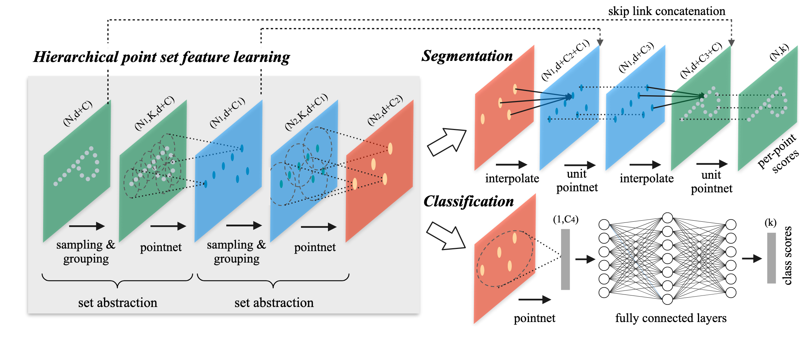
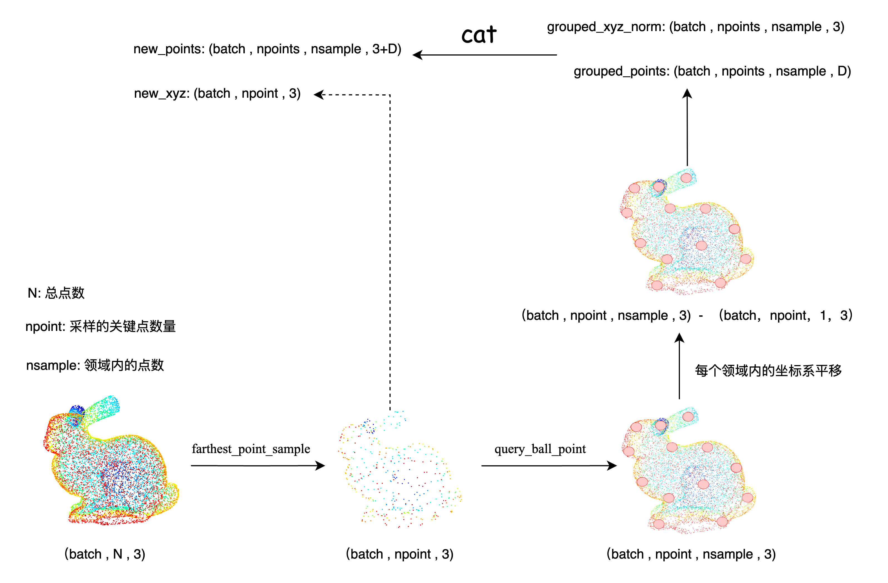
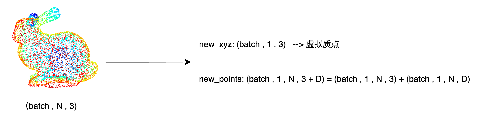
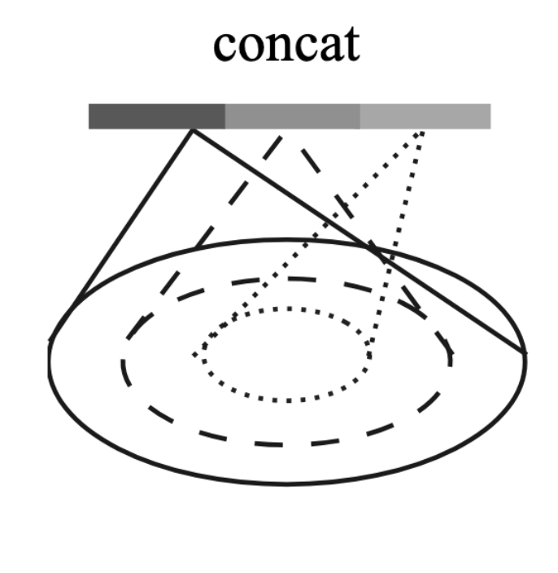
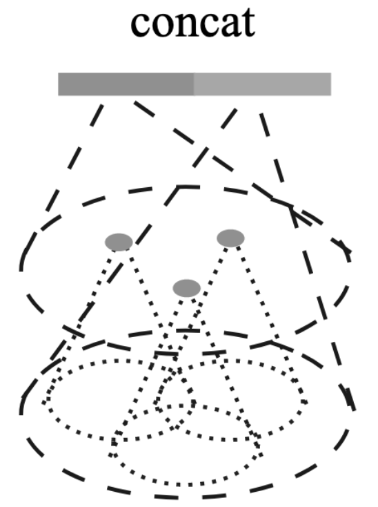

`简析PointNet++` 

<!-- more -->

# 简析PointNet++

> 论文: [https://arxiv.org/abs/1706.02413](https://arxiv.org/abs/1706.02413)
> TensorFlow 版本代码: [https://github.com/charlesq34/pointnet2](https://github.com/charlesq34/pointnet2)
> Pytorch 版本代码: [https://github.com/yanx27/Pointnet_Pointnet2_pytorch](https://github.com/yanx27/Pointnet_Pointnet2_pytorch)

## 背景

在PointNet中，网络对每一个点做低维到高维的映射，进行特征学习，然后把所有点映射到高维的特征通过最大池化最终表示全局特征。从本质上来说，要么对一个点做操作，要么对所有点做操作，实际上没有**局部的概念(loal context)** 。同时缺少 local context 在**平移不变性**上也有局限性（世界坐标系和局部坐标系）。对点云数据做平移操作后，所有的数据都将发生变化，导致所有的特征，全局特征都不一样了。对于单个的物体还好，可以将其平移到坐标系的中心，把他的大小归一化到一个球中，但是在一个场景中有多个物体时则不好办，需要对哪个物体做归一化呢？

PointNet++ 解决了两个问题：如何生成点集的划分（Partitioning），以及如何通过局部特征学习器（Local Feature Learner）抽象点集或局部特征。

**生成点集的划分（Partitioning）：**

点集划分是指如何将一个大的点云分割成更小的、更易于管理的子集。这个过程类似于在传统的卷积神经网络中如何处理图像的小区域（或“patches”），以便可以在这些区域上应用局部操作。PointNet++需要一种方法来有效地将点云分割成多个部分，这样可以在每个部分上独立地学习特征。

**通过局部特征学习器（Local Feature Learner）抽象点集或局部特征：**

一旦点云被划分成小的子集，PointNet++的下一个任务是学习这些子集（或局部区域）的特征。这需要一个“局部特征学习器”，它能够从每个子集中提取有用的信息或特征。这与在传统CNN中学习图像局部区域特征的过程相似。

**两个问题是相关联的，因为：**

点集的划分必须产生跨分区的共同结构：为了能够在不同的局部子集上共享权重（类似于在CNN中权重共享的概念），PointNet++在进行点集划分时，需要确保这些划分具有一定的一致性或共同结构。这意味着即使是不同的局部子集，也应该以一种方式被处理，使得在它们之间可以共享学习到的特征表示的权重。这样做的目的是提高模型的效率和泛化能力，因为学习到的特征和权重可以在多个局部区域中复用。

上述即为PointNet++设计中的两个核心挑战：
- 如何有效地对点云进行分区，以便可以在这些分区上独立地学习特征。
- 如何设计一个能够从这些局部分区中学习有用特征的机制，同时确保这些分区的处理方式允许在它们之间共享模型权重。
  - 为了模仿传统卷积网络中的权重共享机制以提高学习效率和模型的泛化能力。

PointNet++选择PointNet作为局部特征学习器（它是无序点云数据特征提取的高效算法）。

> 可以理解为：PointNet++应用PointNet递归地对输入集进行嵌套分区。

## 模型结构



网络的每一组set abstraction layers主要包括3个部分：

- Sample layer : 对输入点进行采样，在这些点中选出若干个中心点。

- Grouping layer : 利用上一步得到的中心点将点集划分成若干个区域。

- PointNet layer : 对上述得到的每个区域进行编码，变成特征向量。

### 层次化点集特征学习

层次化结构由多个set abstraction layers组成，在每个层上，一组点云被处理和抽象，以产生一个更少元素的新集合。set abstraction layers 由 Sampling layer、Grouping layer 和 PointNet layer 三部分组成。

- Sampling layer ：采样层 从输入点中选取一组点，定义局部区域的形心。

- Grouping layer ：通过查找形心点周围的“邻近点”来构建局部区域点集。

- PointNet layer ：使用mini-PointNet将局部区域编码为特征向量。

#### Sampling layer

使用farthest point sampling（FPS）选择𝑁个点（相比于随机采样，该方法能更好的覆盖整个点集，具体选择多少个中心点以及邻域内的数量由超参数确定）

FPS是一种在点云、图像处理或其他数据集中用于抽样的算法。目的是从一个大的数据集中选出一组代表性强的点，这些点彼此之间的最小距离尽可能大。

作者通过FPS来抽样点集中较为重要的点。（即任务是找到点云集中的局部区域的中心点）

> 可能存在的问题：计算成本、样本分布偏差（可能导致样本在高密度区域内过度集中，低密度区域则过于稀缺）、参数依赖（依赖初始点和距离度量方式的选择）、可能无法捕捉重要的几何细节。

#### Grouping layer

文中作者通过Ball query来查询形心的邻居点。

具体做法：给定两个超参数（每个区域中点的数量𝐾和query的半径𝑟），对于某个形心，Ball query找到该查询点在半径为𝑟范围内点，该范围确保局部区域的尺度是固定的。

与K最近邻（kNN）查询相比，Ball query通过固定区域尺度而不是固定邻居数量来定义邻域。kNN查询寻找最近的K个邻居，但这可能导致所选邻域的实际尺寸随点的密度变化而变化，这在处理非均匀采样的数据时可能不是最优的选择。相反，Ball query通过确保每个局部区域都有一个固定的尺度，提高了模型在空间上的泛化能力。在实现时，通常会设置一个上限K，以限制每个局部区域中考虑的点的数量，以保持计算的可管理性。

> **可改进的地方**：对点云密度变换较为敏感、对参数选择依赖性高（半径太小可能无法有效捕获足够的局部详细，太大则可能导致不相关的点增多，使局部特征的表示不够精确）、计算效率问题、均匀性假设（Ball query是基于欧氏距离的均匀性假设）
> - 欧式距离的均匀性假设：即在欧氏空间中，两点的距离反映了这两点的实际相似度或关联度。
> - 基于以下前提：
>    - 空间均匀性：空间是均匀和各向同性的，即任何方向上的度量都是等价的，距离的度量不受空间中位置的影响。
>    - 距离直观性：在屋里空间或某些特定的抽象空间中，两个点之间的直线距离被认为是相似度或连接强度的直观表示。
>    - 规模一致性：假设空间中所有区域的尺度或特征分布具有一定的一致性，即空间中的任何距离值具有相似的含义。

总结: Grouping layer的任务是通过中心点找到邻居点，并将它们组织称为局部区域集。

#### PointNet layer

局部坐标系转换：局部区域中的点转换成相对于形心的局部坐标系。 

> 局部区域中的每个点将相对于形心所在位置进行调整，以反映其相对位置。

实现方法：通过将局部区域中的每个点-形心点的坐标来实现。

特征编码：将转换后的坐标以及点的附加特征（文中的𝐶所表示的其他信息）一起送入mini-PointNet来提取局部区域中的特征。

输出：利用相对坐标与点特征相结合的方式可以捕获局部区域中点与点之间的关系。

#### 代码实现

sample_and_group 这个函数的作用是从输入点云中：
- 采样一些关键点
- 为每个关键点构建局部邻域（局部区域）
- 提取这些局部区域中的点及其特征

```python
def sample_and_group(npoint, radius, nsample, xyz, points, returnfps=False):
    """
    Input:
        npoint: 采样的关键点数量
        radius: 构建局部邻域的半径
        nsample: 每个邻域内采样的关键点数量
        xyz: 点云坐标数据 , [B, N, 3]
        points: 点的特征数据（可选）, [B, N, D]
    Return:
        new_xyz: 采样得到的关键点坐标, [B, npoint, nsample, 3]
        new_points: 每个关键点对应的局部区域点和特征, [B, npoint, nsample, 3+D]
    """
    B, N, C = xyz.shape
    S = npoint
    # 使用 最远点采样（FPS） 从原始点云中选出 npoint 个具有代表性的点。
    fps_idx = farthest_point_sample(xyz, npoint) # [B, npoint]
    new_xyz = index_points(xyz, fps_idx) # [B, npoint, 3]
    # 对于每个选中的关键点，使用 球查询（Ball Query） 找出它周围距离小于 radius 的所有邻近点。
    # 最多保留 nsample 个点，如果不够就重复最近的点来填充。
    idx = query_ball_point(radius, nsample, xyz, new_xyz)
    # 把刚才找到的邻近点的坐标提取出来。
    grouped_xyz = index_points(xyz, idx) # [B, npoint, nsample, 3]
    # 把它们相对于关键点的位置进行归一化（平移中心到以关键点为原点的局部坐标系上）。
    grouped_xyz_norm = grouped_xyz - new_xyz.view(B, S, 1, C) # [B, npoint, nsample, 3]

    # 如果有额外的点特征（比如颜色、法线等），也一并提取。 
    if points is not None:
        grouped_points = index_points(points, idx)
        # 把邻近点的坐标和特征拼接在一起，形成最终的局部区域表示。
        new_points = torch.cat([grouped_xyz_norm, grouped_points], dim=-1) # [B, npoint, nsample, C+D]
    else:
        new_points = grouped_xyz_norm

    if returnfps:
        return new_xyz, new_points, grouped_xyz, fps_idx
    else:
        return new_xyz, new_points
```

farthest_point_sample 这个函数实现的是最远点采样（Farthest Point Sampling, FPS）, 这是 PointNet++ 中用于从点云中选择具有代表性的采样点的一种策略。它的核心思想是：**在点云中逐步选择离已选点尽可能远的点，使得采样点在整个点云空间中分布尽可能均匀** 。

```python
def farthest_point_sample(xyz, npoint):
    """
    Input:
        xyz: pointcloud data, [B, N, 3]
        npoint: number of samples
    Return:
        centroids: sampled pointcloud index, [B, npoint]
    """
    device = xyz.device
    B, N, C = xyz.shape
    centroids = torch.zeros(B, npoint, dtype=torch.long).to(device) # 存储每次选出的“最远点”的索引。
    distance = torch.ones(B, N).to(device) * 1e10 # 每个点到当前所有已选中心点的最小距离，初始设为一个极大值（1e10）。
    farthest = torch.randint(0, N, (B,), dtype=torch.long).to(device) # 初始时随机选择一个点作为第一个中心点。
    batch_indices = torch.arange(B, dtype=torch.long).to(device) # 批次索引，用于快速访问每个 batch 的点。
    # 重复 npoint 次，最终得到 npoint 个分布尽可能均匀的采样点索引。
    for i in range(npoint):
        # 将当前选中的“最远点”索引保存下来；
        centroids[:, i] = farthest # （batch,npoint)
        # 取出当前最远点的坐标，用于后续计算其他点到该点的距离; 
        centroid = xyz[batch_indices, farthest, :].view(B, 1, 3) # # （batch, 1 , 3)
        # 计算当前中心点与所有点之间的欧氏距离平方。
        dist = torch.sum((xyz - centroid) ** 2, -1) # （batch,npoint)
        # 如果某个点到新中心点的距离比之前记录的“最小距离”还小，就更新它。
        mask = dist < distance
        # 在 distance 中找到最大的那个距离对应的点，这就是下一个“最远点”。
        distance[mask] = dist[mask]   # （batch,npoint)
        # 在 distance 中找到最大的那个距离对应的点，这就是下一个“最远点”。
        # 返回：一个元组：(values, indices)，分别是最大值和它们的位置索引。
        farthest = torch.max(distance, -1)[1] # 返回位置索引
    return centroids
```

index_points 这个函数实现的是根据给定的索引 idx，从输入点云 points 中提取对应的点，形成一个新的子集。

```python
def index_points(points, idx):
    """
    Input:
        points: input points data, [B, N, C]
        idx: sample index data, [B, S]
    Return:
        new_points:, indexed points data, [B, S, C]
    """
    device = points.device
    B = points.shape[0]
    view_shape = list(idx.shape)
    view_shape[1:] = [1] * (len(view_shape) - 1) # 将view_shape的形状从[B, S]变成[B, 1]，便于广播
    repeat_shape = list(idx.shape) 
    repeat_shape[0] = 1 # 从[B, S]变成[1, S]
    # 从点云中根据索引提取特定点 (看不懂下面两行代码的话，可以先去了解一下python中的高级索引机制)。
    batch_indices = torch.arange(B, dtype=torch.long).to(device).view(view_shape).repeat(repeat_shape)
    new_points = points[batch_indices, idx, :] # （batch,npoint,3)
    return new_points 
```
query_ball_point 这个函数的作用是从点云中找出每个查询点周围一定半径范围内的邻近点索引。这个操作被称为 球查询（Ball Query）。

```python
def query_ball_point(radius, nsample, xyz, new_xyz):
    """
    Input:
        radius: local region radius
        nsample: max sample number in local region
        xyz: all points, [B, N, 3]
        new_xyz: query points, [B, S, 3]
    Return:
        group_idx: grouped points index, [B, S, nsample]
    """
    device = xyz.device
    B, N, C = xyz.shape
    _, S, _ = new_xyz.shape # 查询点数量（比如通过 FPS 得到的质心）
    # 构造一个从 0 到 N-1 的索引数组，代表原始点云中每个点的“身份证号”
    # 然后复制这个索引数组到每个 batch 和每个查询点上，形成 [B, S, N] 的结构    
    group_idx = torch.arange(N, dtype=torch.long).to(device).view(1, 1, N).repeat([B, S, 1])
    # 计算每个查询点（new_xyz）与原始点（xyz）之间的平方欧氏距离
    # 输出形状为 [B, S, N]：每个查询点对所有原始点的距离
    sqrdists = square_distance(new_xyz, xyz)
    # 把距离超过 radius^2 的点全部替换为 N（一个非法索引），表示“这些人离我太远了，我不感兴趣。”   
    group_idx[sqrdists > radius ** 2] = N
    # 对每个查询点的邻近点按索引排序（因为前面有 N，所以小的才是有效点）
    # 然后只保留前 nsample 个点
    group_idx = group_idx.sort(dim=-1)[0][:, :, :nsample]
    # 如果某个查询点附近的点太少，有些位置被标记为 N（无效）。
    # 我们就用该查询点最近的那个点（第一个点）去填充这些空缺。
    group_first = group_idx[:, :, 0].view(B, S, 1).repeat([1, 1, nsample])
    mask = group_idx == N
    group_idx[mask] = group_first[mask]
    return group_idx # （batch,npoint,nsample)
```



sample_and_group_all 函数的作用是将整个点云视为一个“大局部区域”，不进行采样，直接对所有点进行特征提取，用于 PointNet++ 中的全局特征学习。 

```python
def sample_and_group_all(xyz, points):
    """
    Input:
        xyz: input points position data, [B, N, 3], 点云坐标数据
        points: input points data, [B, N, D], 点云的额外特征（如法线、颜色等）
    Return:
        new_xyz: sampled points position data, [B, 1, 3]
        new_points: sampled points data, [B, 1, N, 3+D]
    """
    device = xyz.device
    B, N, C = xyz.shape
    # 创建一个全零点作为“质心”
    # 虽然这个点没有实际意义，但它是为了统一接口设计的一个占位符
    new_xyz = torch.zeros(B, 1, C).to(device)
    # 把原始点云 reshape 成一个大的局部区域
    grouped_xyz = xyz.view(B, 1, N, C)
    # 如果有额外特征（比如法线、颜色），也一并加入
    if points is not None:
        # 终输出的 new_points 是 [B, 1, N, 3+D]，代表每个 batch 中只有一组“大区域”的点及其特征
        new_points = torch.cat([grouped_xyz, points.view(B, 1, N, -1)], dim=-1)
    else:    
        new_points = grouped_xyz
    return new_xyz, new_points # 全局质心点（0 位置）, 所有点组成的局部区域
```


PointNetSetAbstraction（点集抽象层） 是 PointNet++ 中的核心模块 ， 它的作用是负责从输入的点云数据中采样关键点，构建它们的局部邻域区域，并通过一个小型 PointNet 提取这些区域的高维特征，从而实现点云的分层特征学习。

```python
class PointNetSetAbstraction(nn.Module):
    def __init__(self, npoint, radius, nsample, in_channel, mlp, group_all):
        super(PointNetSetAbstraction, self).__init__()
        self.npoint = npoint # 采样的关键点数量
        self.radius = radius # 构建局部邻域的半径
        self.nsample = nsample # 每个邻域内采样的关键点数量
        self.mlp_convs = nn.ModuleList()
        self.mlp_bns = nn.ModuleList()
        last_channel = in_channel # 输入点的特征维度
        for out_channel in mlp:
            self.mlp_convs.append(nn.Conv2d(last_channel, out_channel, 1))
            self.mlp_bns.append(nn.BatchNorm2d(out_channel))
            last_channel = out_channel
        self.group_all = group_all

    def forward(self, xyz, points):
        """
        Input:
            xyz: input points position data, [B, C, N]
            points: input points data, [B, D, N]
        Return:
            new_xyz: sampled points position data, [B, C, S]
            new_points_concat: sample points feature data, [B, D', S]
        """
        xyz = xyz.permute(0, 2, 1) # [B, N, C]
        if points is not None:
            points = points.permute(0, 2, 1)

        # 如果 group_all=True，则对整个点云做全局特征提取。
        if self.group_all:
            new_xyz, new_points = sample_and_group_all(xyz, points)
        else:  
        # 否则使用 FPS（最远点采样）选关键点，再用 Ball Query 找出每个点的局部邻近点。    
            # 参数: 质点数量，采样半径，采样点数量，点坐标，点额外特征
            new_xyz, new_points = sample_and_group(self.npoint, self.radius, self.nsample, xyz, points)
        # 局部特征编码（Mini-PointNet）    
        # new_xyz: sampled points position data, [B, npoint, C]
        # new_points: sampled points data, [B, npoint, nsample, C+D]
        # 把邻域点的数据整理成适合卷积的格式 [B, C+D, nsample, npoint]
        new_points = new_points.permute(0, 3, 2, 1)
        # 使用多个 Conv2d + BatchNorm + ReLU 层提取特征
        for i, conv in enumerate(self.mlp_convs):
            bn = self.mlp_bns[i]
            new_points =  F.relu(bn(conv(new_points))) # [B, out_channel , nsample, npoint]
        
        # 对每个局部区域内所有点的最大响应值进行池化，得到该区域的固定长度特征表示。
        # 在 new_points 的第 2 个维度（即每个局部邻域内的点数量维度）上做最大池化（max pooling）。
        # 输出形状为 [B, out_channel, npoint]，即每个查询点有一个特征向量。
        new_points = torch.max(new_points, 2)[0] # [B, out_channel, npoint]
        new_xyz = new_xyz.permute(0, 2, 1) # [B, C, npoint]
        return new_xyz, new_points # 查询点的位置(质心) ， 每个查询点点局部特征。
```
最终每个采样得到的关键点所在的局部领域，都会被压缩为一个固定长度的特征向量。这个特征向量代表了这个局部区域的高维特征，它包含了这个区域内所有点的信息。


### 单尺度分组分类模型

 PointNet++ 的 单尺度分组（SSG）架构 ，通过多层 Set Abstraction 提取点云的层次化特征，并最终输出分类结果。

 > Single-Scale Grouping (SSG)

代码实现如下:

 ```python
# pointnet2_cls_ssg.py 
class get_model(nn.Module):
    # num_class: 输出类别数
    # normal_channel: 是否包含法线信息（默认有 (x,y,z,nx,ny,nz)，否则只有 (x,y,z)）
    def __init__(self,num_class,normal_channel=True):
        super(get_model, self).__init__()
        in_channel = 6 if normal_channel else 3
        self.normal_channel = normal_channel
        # PointNet++ 的核心就是逐层提取局部特征。这里的三个 SA 层构成了一个 三层分层特征学习结构 ：
        self.sa1 = PointNetSetAbstraction(npoint=512, radius=0.2, nsample=32, in_channel=in_channel, mlp=[64, 64, 128], group_all=False)
        self.sa2 = PointNetSetAbstraction(npoint=128, radius=0.4, nsample=64, in_channel=128 + 3, mlp=[128, 128, 256], group_all=False)
        self.sa3 = PointNetSetAbstraction(npoint=None, radius=None, nsample=None, in_channel=256 + 3, mlp=[256, 512, 1024], group_all=True)
        self.fc1 = nn.Linear(1024, 512)
        self.bn1 = nn.BatchNorm1d(512)
        self.drop1 = nn.Dropout(0.4)
        self.fc2 = nn.Linear(512, 256)
        self.bn2 = nn.BatchNorm1d(256)
        self.drop2 = nn.Dropout(0.4)
        self.fc3 = nn.Linear(256, num_class)

    def forward(self, xyz):
        B, _, _ = xyz.shape
        if self.normal_channel:
            norm = xyz[:, 3:, :]
            xyz = xyz[:, :3, :]
        else:
            norm = None
        l1_xyz, l1_points = self.sa1(xyz, norm)
        l2_xyz, l2_points = self.sa2(l1_xyz, l1_points)
        l3_xyz, l3_points = self.sa3(l2_xyz, l2_points)
        x = l3_points.view(B, 1024)
        x = self.drop1(F.relu(self.bn1(self.fc1(x))))
        x = self.drop2(F.relu(self.bn2(self.fc2(x))))
        x = self.fc3(x)
        x = F.log_softmax(x, -1)

        return x, l3_points
 ```
完整的单尺度分组分类流程为:
- 原始点云数据，首次sample，grouping，mini-PointNet后，得到:
     -  512 个关键点的坐标
     -  512 个关键点对应的局部区域特征向量

- 二次sample，grouping，mini-PointNet后，得到:
     -  128 个关键点的坐标
     -  128 个关键点对应的局部区域特征向量

- 三次sample，grouping，mini-PointNet后，得到:
     -  1 个关键点的坐标
     -  1 个关键点对应的全局区域特征向量 

- 获取全局区域特征向量后，通过全连接层进行分类。

## 非均匀密度下稳定的特征学习

由于点集在不同区域可能会有不同的采样密度，这种非均匀性为点集特征学习带来了显著挑战。在密集采样的区域中学到的特征可能无法很好地泛化到稀疏采样的区域，反之亦然。因此，为了解决这一问题，PointNet++提出了密度自适应PointNet层，包含两种适应性特征学习层：多尺度分组（Multi-Scale Grouping, MSG）和多分辨率分组（Multi-Resolution Grouping, MRG）。

### 多尺度分组 （Multi-Scale Grouping）

MSG通过应用不同尺度的分组层（**按照不同的搜索半径或领域大小对点集进行分组**），然后通过对应的PointNets提取每个尺度上的特征来捕获多尺度模式。不同尺度的特征被串联形成多尺度特征向量。这种方法使网络能够通过在训练期间随机丢弃输入点（称为随机输入丢弃 - random input dropout）来学习优化的策略，以结合来自不同尺度的特征。这样，网络在训练时被呈现了不同稀疏度的点集，从而学会根据输入数据的变化自适应地加权不同尺度上检测到的模式。



具体来说，在MSG中，网络对于每个选定的形心点，按照几个预定义的半径值来搜索周围的邻近点。每个半径定义了一个局部邻域的大小，因此每个质心将根据这些不同的半径值与其周围点形成多个点集群。这样，对于每个质心点，网络不是只捕获一个尺度上的局部特征，而是能够捕获多个尺度上的局部特征。

每个尺度（或每组邻域大小）的点集群都将独立地送入对应的PointNet网络进行特征提取，之后这些不同尺度上提取的特征被串联起来，形成一个综合的多尺度特征表示。这种方法使得网络能够在细节丰富的区域（通过较小的邻域尺度捕获细节）和稀疏采样的区域（通过较大的邻域尺度避免过度稀疏的问题）中均能有效提取特征。

##### 多尺度分组分类模型

PointNetSetAbstractionMsg 这个模块实现了 PointNet++ 中的 多尺度特征提取机制 ：对于每个局部区域，使用多个不同大小的邻域球（multi-scale ball query），分别提取特征，然后将这些不同尺度的特征拼接在一起，以获得更强的局部几何感知能力。 

```python
class PointNetSetAbstractionMsg(nn.Module):
    def __init__(self, npoint, radius_list, nsample_list, in_channel, mlp_list):
        super(PointNetSetAbstractionMsg, self).__init__()
        self.npoint = npoint # 要采样的质心点数量
        self.radius_list = radius_list # 不同尺度的查询半径列表
        self.nsample_list = nsample_list # 对应半径下最多取多少邻近点
        self.conv_blocks = nn.ModuleList() 
        self.bn_blocks = nn.ModuleList()
        # 为每个尺度构建一个独立的小型 PointNet（Conv2d + BN + ReLU）
        # 每个尺度可以有不同的网络深度和宽度
        # 所有尺度的网络并行运行，最后拼接结果
        for i in range(len(mlp_list)):
            convs = nn.ModuleList()
            bns = nn.ModuleList()
            last_channel = in_channel + 3
            for out_channel in mlp_list[i]:
                convs.append(nn.Conv2d(last_channel, out_channel, 1))
                bns.append(nn.BatchNorm2d(out_channel))
                last_channel = out_channel
            self.conv_blocks.append(convs)
            self.bn_blocks.append(bns)

    def forward(self, xyz, points):
        """
        Input:
            xyz: input points position data, [B, C, N]
            points: input points data, [B, D, N]
        Return:
            new_xyz: sampled points position data, [B, C, S]
            new_points_concat: sample points feature data, [B, D', S]
        """
        xyz = xyz.permute(0, 2, 1) # [B, N, C]
        if points is not None:
            points = points.permute(0, 2, 1)

        B, N, C = xyz.shape
        S = self.npoint
        # 使用 FPS（最远点采样）选出 S 个关键点作为局部区域中心
        new_xyz = index_points(xyz, farthest_point_sample(xyz, S))
        new_points_list = []
        for i, radius in enumerate(self.radius_list):
            K = self.nsample_list[i]
            # 对每个半径 radius，找出该尺度下每个质心点周围的邻近点
            group_idx = query_ball_point(radius, K, xyz, new_xyz)
            grouped_xyz = index_points(xyz, group_idx)
            # 把这些点的坐标归一化到以质心为中心的局部坐标系下
            grouped_xyz -= new_xyz.view(B, S, 1, C)
            # 如果有额外特征，也一并加入
            if points is not None:
                grouped_points = index_points(points, group_idx)
                grouped_points = torch.cat([grouped_points, grouped_xyz], dim=-1)
            else:
                grouped_points = grouped_xyz
            
            # 对每个尺度的局部点集应用对应的 Conv2d + BN + ReLU
            grouped_points = grouped_points.permute(0, 3, 2, 1)  # [B, D, K, S]
            for j in range(len(self.conv_blocks[i])):
                conv = self.conv_blocks[i][j]
                bn = self.bn_blocks[i][j]
                grouped_points =  F.relu(bn(conv(grouped_points)))
            # 使用最大池化聚合局部信息，生成固定长度的特征向量    
            new_points = torch.max(grouped_points, 2)[0]  # [B, D', S]
            # 所有尺度的特征保存到 new_points_list
            new_points_list.append(new_points)
        
        new_xyz = new_xyz.permute(0, 2, 1)
        # 把不同尺度学到的特征拼接在一起，形成最终的局部特征表示
        new_points_concat = torch.cat(new_points_list, dim=1) 
        # 最终输出就是： 一组新的关键点位置； 每个关键点的多尺度特征表示
        return new_xyz, new_points_concat
```

pointnet2_cls_msg 这个模型使用了 PointNet++ 的 多尺度分组（MSG）策略 ，通过多个局部区域球查询提取不同尺度的局部特征，逐层抽象后融合成全局特征，最后通过全连接层完成分类任务。

```python
# pointnet2_cls_msg.py
class get_model(nn.Module):
    def __init__(self,num_class,normal_channel=True):
        super(get_model, self).__init__()
        in_channel = 3 if normal_channel else 0
        self.normal_channel = normal_channel
        self.sa1 = PointNetSetAbstractionMsg(512, [0.1, 0.2, 0.4], [16, 32, 128], in_channel,[[32, 32, 64], [64, 64, 128], [64, 96, 128]])
        self.sa2 = PointNetSetAbstractionMsg(128, [0.2, 0.4, 0.8], [32, 64, 128], 320,[[64, 64, 128], [128, 128, 256], [128, 128, 256]])
        self.sa3 = PointNetSetAbstraction(None, None, None, 640 + 3, [256, 512, 1024], True)
        self.fc1 = nn.Linear(1024, 512)
        self.bn1 = nn.BatchNorm1d(512)
        self.drop1 = nn.Dropout(0.4)
        self.fc2 = nn.Linear(512, 256)
        self.bn2 = nn.BatchNorm1d(256)
        self.drop2 = nn.Dropout(0.5)
        self.fc3 = nn.Linear(256, num_class)

    def forward(self, xyz):
        B, _, _ = xyz.shape
        if self.normal_channel:
            norm = xyz[:, 3:, :]
            xyz = xyz[:, :3, :]
        else:
            norm = None
        l1_xyz, l1_points = self.sa1(xyz, norm)
        l2_xyz, l2_points = self.sa2(l1_xyz, l1_points)
        l3_xyz, l3_points = self.sa3(l2_xyz, l2_points)
        x = l3_points.view(B, 1024)
        x = self.drop1(F.relu(self.bn1(self.fc1(x))))
        x = self.drop2(F.relu(self.bn2(self.fc2(x))))
        x = self.fc3(x)
        x = F.log_softmax(x, -1)


        return x,l3_points
```

MSG的关键优点在于它通过在训练期间的随机输入丢弃（即随机移除一部分输入点）来模拟不同的采样密度，从而训练网络在面对实际应用中可能遇到的各种采样密度时，能够自适应地选择最适合的特征尺度进行组合，以实现最佳的性能。这种方法大大增强了网络处理非均匀采样数据的能力，提高了模型的泛化性和稳健性。

> 在训练时引入不同密度的点集情况，使网络能学习不同采样密度下局部点云特征的提取，捕获密集到稀疏采样区域内的多尺度信息 -- 通过随机丢弃来模拟不同密度的采样，使网络能够应对实际中各种密度变换的情况-提高模型的泛化性能。

MSG相当于并联了多个hierarchical structure，每个结构中心点不变，但是尺度不同。通过PointNet获取每个形心多尺度信息，之后concat形成该区域提取的总特征。在训练时引入随机丢弃形心来模拟不同密度情况，提高算法鲁棒性。

 #### 多分辨率分组（Multi-Resolution Grouping）

MSG方法虽然有效，但在计算上可能非常昂贵，尤其是在低层次上对每个质心点运行局部PointNet时。为此，MRG为一种低成本的替代方案。

MRG通过结合来自不同分辨率的特征来实现效率和适应性的平衡。具体而言，MRG策略在处理每个局部区域时，不仅考虑从当前分辨率下抽象得到的特征，还考虑了从更低分辨率（即上一层级）直接提取的特征。这两种特征被concat为一个复合特征向量，为后续的处理步骤提供信息。



在MRG中，某一层次𝐿𝑖的区域特征是通过将来自下一级𝐿𝑖−1的子区域特征总结后的向量与直接处理该局部区域所有原始点的单个PointNet得到的特征向量进行concat得到的。当局部区域的密度较低时，由于子区域在计算第一个向量时包含的点更稀疏，因此可能比第二个向量更不可靠。在这种情况下，应该更高地加权第二个向量。相反，当局部区域的密度较高时，第一个向量提供了更细致的信息，因为它能够在更低层次上递归地检视更高分辨率。

> 来自下一级的特征：首先，将来自下一级（更高分辨率）的特征进行汇总，形成一个特征向量。这一过程通过对每个子区域应用集合抽象层（set abstraction level）完成。

> 直接处理的原始点特征：另一部分特征是通过在当前分辨率直接对所有原始点应用单个PointNet得到的。

## 点云语义分割

**PointNet++ 完成点云分割任务的过程是一个典型的“编码-解码”结构**，结合了层级特征提取和多尺度融合机制。

**目标:** 给定一个点云，模型需要为每个点预测一个类别标签（如桌子、椅子、墙壁等）。

- 输入：`xyz: [B, N, 3]`  

- 输出：`labels: [B, N, C]`，其中 `C` 是类别数


PointNet++ 分割的整体结构 :

```python
Input Points (xyz): [ B, N, 3 ]
        ↓
Set Abstraction Layers（编码器）
        ↓
Feature Vectors at Multiple Scales
        ↓
Feature Propagation Layers（解码器）
        ↓
Recovered Features at Original Resolution
        ↓
MLP + Softmax → Per-point Semantic Labels
```
---

**第一步：Set Abstraction（集合抽象）—— 编码器:** 对点云进行下采样，并在每个局部区域提取特征。

核心操作包括：

1. **FPS（Farthest Point Sampling）**：从点云中选出有代表性的点作为中心点。

2. **Ball Query**：为每个中心点找到其邻域内的点。

3. **Grouping**：将邻域点组合成局部点云组。

4. **PointNet 操作**：使用 T-Net 对局部点云进行变换，然后通过 MLP 提取特征。

5. **Pooling**：对局部点云组做最大池化或平均池化，得到该区域的特征。

> 多个 Set Abstraction 层堆叠，逐步减少点的数量，增加特征维度，形成多尺度特征表示。

---

**第二步：Feature Propagation（特征传播）—— 解码器:** 从最稀疏的点开始，逐层将特征插值回原始点数量。

特征插值方式：

- 使用 **反距离加权插值（IDW）**，即根据最近的几个邻近点的距离进行加权平均。

- 可选地拼接 skip connection 中的原始特征（来自 Set Abstraction 前的某一层）。

输入输出示例：

```python
def forward(xyz1, xyz2, points1, points2):
    # xyz1: 原始点坐标（多）
    # xyz2: 下采样点坐标（少）
    # points1: 原始点特征（可为空）
    # points2: 下采样点特征
    return interpolated_points  # 插值得到的密集特征，形状与 xyz1 一致
```

> 多个 Feature Propagation 层堆叠，逐渐恢复点数，最终回到原始点数量。

---

**第三步：Head 预测头 —— 分类每个点:** 对每个点的特征做一个简单的分类器，输出类别概率。

实现方式：

- 将最后一层 Feature Propagation 输出的特征送入一个小型 MLP。

- 最后一层使用 `Softmax`（对于多分类）或 `Sigmoid`（对于多标签）激活函数。

例如：

```python
mlp = nn.Sequential(
    nn.Conv1d(128, 128, 1),
    nn.BatchNorm1d(128),
    nn.ReLU(),
    nn.Dropout(0.5),
    nn.Conv1d(128, num_classes, 1)
)
logits = mlp(final_features)  # shape: [B, C, N]
```

### 代码实现

PointNet++ 的整体结构是一个典型的 编码器-解码器（Encoder-Decoder）架构 ：

- Set Abstraction 层 ：不断对点云进行下采样 + 提取局部特征（编码过程）

- Feature Propagation 层 ：从最稀疏的点开始，逐层恢复到原始点数（解码过程）

```
[Input Points] 
      ↓
SA Layer 1 → [Points: 1024 → 512]
      ↓
SA Layer 2 → [Points: 512 → 128]
      ↓
SA Layer 3 → [Points: 128 → 32]
      ↓
FP Layer 3 ← [Points: 32 → 128]
      ↓
FP Layer 2 ← [Points: 128 → 512]
      ↓
FP Layer 1 ← [Points: 512 → 1024]
      ↓
[Per-point Classification Head]
      ↓
[Output: per-point labels]
```

#### 特征传播层

PointNetFeaturePropagation 是 PointNet++ 中用于点云“特征传播”（Feature Propagation）的核心模块，主要作用是：

- 将稀疏点集的特征插值回原始点集的位置上。

换句话说：

- 输入：少量点的坐标 + 特征（如经过下采样后的点）

- 输出：在原始点数量下的每个点都拥有一个合理的特征向量

这一步相当于图像任务中的 上采样（upsample）或转置卷积（transpose convolution） ，但在点云这种非结构化数据中，不能直接使用这些操作。

```python
class PointNetFeaturePropagation(nn.Module):
    def __init__(self, in_channel, mlp):
        """
        初始化函数，构建用于特征传播（上采样）的MLP层
        
        参数：
            in_channel: 输入特征的通道数（维度）
            mlp: 一个列表，表示每一层MLP的输出通道数，例如 [64, 128]
        """
        super(PointNetFeaturePropagation, self).__init__()
        
        # 用于保存卷积层和批归一化层
        self.mlp_convs = nn.ModuleList()
        self.mlp_bns = nn.ModuleList()
        
        last_channel = in_channel  # 当前输入通道数初始化为in_channel

        # 构建MLP层：每个层是一个Conv1d + BatchNorm1d + ReLU
        for out_channel in mlp:
            self.mlp_convs.append(nn.Conv1d(last_channel, out_channel, 1))
            self.mlp_bns.append(nn.BatchNorm1d(out_channel))
            last_channel = out_channel  # 更新下一层的输入通道数

    def forward(self, xyz1, xyz2, points1, points2):
        """
        前向传播函数：将稀疏点集points2插值到密集点集xyz1的位置上

        参数：
            xyz1: 原始点坐标数据，形状 [B, C, N] （如 1024 个点）
            xyz2: 下采样后的点坐标数据，形状 [B, C, S] （如 256 个点）
            points1: 原始点对应的特征数据，形状 [B, D, N] （可为 None）
            points2: 下采样点对应的特征数据，形状 [B, D, S]

        返回：
            new_points: 插值并融合后的特征，形状 [B, D', N]
        """
        # 将坐标和特征从 [B, C, N] 转换为 [B, N, C] 格式，便于后续计算
        xyz1 = xyz1.permute(0, 2, 1)     # [B, N, C]
        xyz2 = xyz2.permute(0, 2, 1)     # [B, S, C]
        points2 = points2.permute(0, 2, 1)  # [B, S, D]

        B, N, C = xyz1.shape             # 原始点数量 N
        _, S, _ = xyz2.shape             # 下采样点数量 S

        # 如果只有1个下采样点，直接复制其特征到所有原始点
        if S == 1:
            interpolated_points = points2.repeat(1, N, 1)  # [B, N, D]

        else:
            # 计算原始点与下采样点之间的距离矩阵（欧氏距离平方）
            dists = square_distance(xyz1, xyz2)  # [B, N, S]

            # 对每个原始点，找到最近的3个邻近点
            dists, idx = dists.sort(dim=-1)
            dists = dists[:, :, :3]   # 取最小的三个距离 [B, N, 3]
            idx = idx[:, :, :3]       # 取对应的索引 [B, N, 3]

            # 使用反距离加权（IDW）计算权重:
            # 1.将距离转换为“权重”，距离越近，权重越大
            dist_recip = 1.0 / (dists + 1e-8)  # 避免除以零
            # 2.对每个点的3个权重求和，得到归一化因子
            norm = torch.sum(dist_recip, dim=2, keepdim=True)  # 归一化因子
            # 3.归一化权重，使得每个点的权重之和为1
            weight = dist_recip / norm  # 加权平均系数 [B, N, 3]

            # 为每个原始点，找到它最近的 3 个邻近点，根据距离分配权重，然后对它们的特征做加权平均，从而插值得到该点的特征。 
            # index_points: [B, S, D] -> [B, N, 3, D]
            # weight.view(B, N, 3, 1): 扩展维度后相乘
            interpolated_points = torch.sum(
                # 1. 从下采样点中取出每个原始点对应的最近邻点的特征。
                #    points2: [B, S, D] —— 下采样点的特征（S 个点，每个点有 D 维特征）
                #    idx: [B, N, 3] —— 每个原始点对应的 3 个最近邻点索引
                #    [B, N, 3, D] —— 每个原始点都有了它最近的 3 个邻近点的特征
                index_points(points2, idx) 
                # 将之前计算好的权重扩展维度，以便和特征相乘。
                # weight: [B, N, 3] —— 每个点的三个邻近点的权重
                # [B, N, 3, 1] —— 扩展后便于广播乘法
                * weight.view(B, N, 3, 1),
                dim=2
            )  # [B, N, D]

        # 如果原始点有特征，则拼接起来（skip connection）
        if points1 is not None:
            points1 = points1.permute(0, 2, 1)  # [B, N, D]
            new_points = torch.cat([points1, interpolated_points], dim=-1)  # [B, N, D1+D2]
        else:
            new_points = interpolated_points  # [B, N, D]

        # 恢复张量格式为 [B, D, N]，以适配后面的卷积操作
        new_points = new_points.permute(0, 2, 1)  # [B, D', N]

        # 经过MLP进一步提取和融合特征
        for i, conv in enumerate(self.mlp_convs):
            bn = self.mlp_bns[i]
            new_points = F.relu(bn(conv(new_points)))  # Conv1d + BN + ReLU

        return new_points  # 最终输出特征 [B, D', N]
```
流程四步走：

1️⃣ 找到邻居  “我这个点最近的3个熟人是谁？” 

- 计算每个原始点和下采样点之间的距离；

- 找出最近的3个邻近点。

2️⃣ 分配权重  “谁离我越近，说话越有分量。” 

- 根据距离反比加权（IDW），给这3个邻近点分配权重；

- 权重归一化，确保它们加起来是1。


3️⃣ 加权平均插值   “综合最近几个熟人的意见，猜出我的特征。” 

- 提取邻近点的特征；

- 按照权重做加权平均；

- 得到每个原始点的插值特征。

4️⃣ 融合+增强  “如果我本来就有特征，那就一起用；再用MLP提提神。” 

- 如果原始点有自己的特征（points1），就拼接起来；

- 经过几层 Conv1d + BN + ReLU，进一步提取和融合特征；

- 输出最终的插值后特征。

📦 输出结果

- new_points: 每个原始点都有了一个新的特征向量 [B, D', N]

#### 点云语义分割模型

下面给出的是一个基于PointNet++的点云语义分割模型定义 ，其主要功能是：

- 对输入点云中的每个点进行分类（如桌子、椅子、地板等），输出每个点的类别概率。 

网络结构特点：

- 使用 Set Abstraction（SA）层 进行多尺度特征提取和下采样；

- 使用 Feature Propagation（FP）层 进行特征插值和上采样；

- 最后通过两个卷积层输出每个点的分类结果；

- 输出为 [B, N, num_classes]，即每个点都有一个类别预测。

```python
class get_model(nn.Module):
    def __init__(self, num_classes):
        """
        初始化 PointNet++ 分割网络

        参数：
            num_classes: 分类类别数
        """
        super(get_model, self).__init__()

        # Set Abstraction 层（编码器部分）
        # 每层逐步下采样，并提取更高级别的局部特征
        self.sa1 = PointNetSetAbstraction(npoint=1024, radius=0.1, nsample=32, in_channel=9+3, mlp=[32, 32, 64], group_all=False)
        self.sa2 = PointNetSetAbstraction(npoint=256, radius=0.2, nsample=32, in_channel=64+3, mlp=[64, 64, 128], group_all=False)
        self.sa3 = PointNetSetAbstraction(npoint=64, radius=0.4, nsample=32, in_channel=128+3, mlp=[128, 128, 256], group_all=False)
        self.sa4 = PointNetSetAbstraction(npoint=16, radius=0.8, nsample=32, in_channel=256+3, mlp=[256, 256, 512], group_all=False)

        # Feature Propagation 层（解码器部分）
        # 从稀疏点恢复到原始点密度，逐层融合上下文信息
        self.fp4 = PointNetFeaturePropagation(in_channel=768, mlp=[256, 256])
        self.fp3 = PointNetFeaturePropagation(in_channel=384, mlp=[256, 256])
        self.fp2 = PointNetFeaturePropagation(in_channel=320, mlp=[256, 128])
        self.fp1 = PointNetFeaturePropagation(in_channel=128, mlp=[128, 128, 128])

        # 最终分类头
        self.conv1 = nn.Conv1d(128, 128, 1)
        self.bn1 = nn.BatchNorm1d(128)
        self.drop1 = nn.Dropout(0.5)
        self.conv2 = nn.Conv1d(128, num_classes, 1)

    def forward(self, xyz):
        """
        前向传播函数

        输入：
            xyz: 点云数据，形状 [B, C, N]

        返回：
            x: 每个点的分类结果，形状 [B, N, num_classes]
            l4_points: 最后一层抽象特征，用于其他任务
        """
        # l0 表示最原始的点云
        l0_points = xyz
        l0_xyz = xyz[:, :3, :]  # 只取 xyz 坐标，不带法向量或其他属性

        # 编码器：层层下采样并提取特征
        l1_xyz, l1_points = self.sa1(l0_xyz, l0_points)  # 1024 points
        l2_xyz, l2_points = self.sa2(l1_xyz, l1_points)  # 256 points
        l3_xyz, l3_points = self.sa3(l2_xyz, l2_points)  # 64 points
        l4_xyz, l4_points = self.sa4(l3_xyz, l3_points)  # 16 points

        # 解码器：层层插值并融合特征
        l3_points = self.fp4(l3_xyz, l4_xyz, l3_points, l4_points)  # 64 → 64
        l2_points = self.fp3(l2_xyz, l3_xyz, l2_points, l3_points)  # 256 → 256
        l1_points = self.fp2(l1_xyz, l2_xyz, l1_points, l2_points)  # 1024 → 1024
        l0_points = self.fp1(l0_xyz, l1_xyz, None, l1_points)       # 4096 → 4096

        # MLP 头部处理：进一步增强特征
        x = self.drop1(F.relu(self.bn1(self.conv1(l0_points)), inplace=True))  # [B, 128, N]
        x = self.conv2(x)  # [B, num_classes, N]

        # Softmax 分类
        x = F.log_softmax(x, dim=1)  # [B, num_classes, N]

        # 调整维度，返回 [B, N, num_classes]
        x = x.permute(0, 2, 1)

        return x, l4_points  # 返回每个点的分类结果和抽象特征
```    
