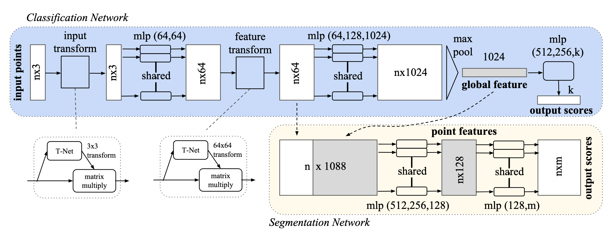

`简析PointNet网络模型及其背后原理` 

<!-- more -->

# 简析PointNet

> 论文: [https://arxiv.org/abs/1612.00593](https://arxiv.org/abs/1612.00593)
> TensorFlow 版本代码: [https://github.com/charlesq34/pointnet](https://github.com/charlesq34/pointnet)
> Pytorch 版本代码: [https://github.com/fxia22/pointnet.pytorch](https://github.com/fxia22/pointnet.pytorch)

## 核心

问题背景: 点云是三维几何数据的一种重要表示形式，但由于其无序性和非规则性，传统卷积神经网络难以直接处理。

❌ 传统方法的缺陷 ：
- 将点云转换为体素网格（voxel grid）或图像视图（multi-view rendering）， 这些方法会导致信息损失、计算量大、不灵活等问题。

🌟 PointNet 的创新点 ：
- 直接以点集作为输入，避免了复杂的预处理；
- 设计了一个统一架构，适用于分类、物体分割和场景语义解析；
- 利用对称函数（如最大池化）实现点集顺序不变性；
- 引入 T-Net（空间变换网络）标准化输入点云和特征空间。

## 难点

1. 点云的无序性（Unordered）: 点云是点的集合，没有固定顺序；模型必须对输入点的排列顺序不敏感（permutation invariant）。
2. 点之间存在相互作用（Interaction among points）: 点与点之间有空间关系，需要捕捉局部结构。
3. 对几何变换的不变性（Invariance under transformations）: 模型输出应不受刚性变换影响（如旋转、平移）。
4. 输入点云可能缺失或包含噪声（Missing or noisy points）: 实际采集的点云常有遮挡、稀疏、异常值等问题。

## 解决方案

✅ 难点 1：点云的无序性 → **使用对称函数（Symmetric Function）**
- 使用 **max pooling** 作为对称函数，聚合所有点的信息；
- 所有点经过共享参数的 MLP 提取特征；
- 最终输出与点的顺序无关；

原理说明：

```python
f({x1, ..., xn}) ≈ g(h(x1), ..., h(xn)) = γ(MAX(h(x1), ..., h(xn)))
```

其中：
- `h(xi)` 是每个点的高维特征；
- `MAX` 是 max pooling 函数；
- `γ` 是后续的全连接网络；
- 整个函数 f 是对称的，即对点顺序不敏感。

效果：
- 实验证明 max pooling 比排序、RNN、average pooling 更有效；s
- PointNet 可以处理任意顺序的点集；

---

✅ 难点 2：点之间的相互作用 → **设计局部 + 全局信息融合机制**
- 在分割任务中，将全局特征与每个点的局部特征拼接起来；
- 这样每个点在预测标签时都能看到整个物体的上下文；


效果：
- 显著提升了分割性能；
- 让模型既关注局部细节，又理解整体结构；

---

✅ 难点 3：对几何变换的不变性 → **引入 T-Net（空间变换网络）**
- 引入两个空间变换网络：
  - **STN3d**：对输入点云做刚性变换（3×3 矩阵）；
  - **STNkd**：对特征空间做变换（64×64 矩阵）；
- 加入正则项约束变换矩阵接近正交：

```python
L_reg = ||I - A @ A^T||_F^2
```

效果：
- PointNet 对点云的旋转、平移等变换具有鲁棒性；
- 提升了模型的泛化能力和稳定性；

---

✅ 难点 4：输入点云可能缺失或含有异常点 → **理论分析保证模型鲁棒性**
- 理论上证明 PointNet 学到的是一个“关键点集”（critical point set），即只依赖一小部分关键点就能判断整体形状；
- 即使丢失一些点或加入异常点，只要关键点还在，结果就不会变；

定理表明：
- 小扰动不会改变函数输出；
- 网络输出由一个有限子集 CS 决定（大小不超过 bottleneck 维度 K）；
- CS 是关键点集合，NS 是最大可容忍的点云范围；

实验验证：
- 即使 50% 的点缺失，分类准确率仅下降约 3.7%；
- 对异常点也有一定容忍能力；

---
✅ 总结: **PointNet 通过 max pooling 实现对称性，结合 T-Net 实现变换不变性，并通过局部+全局特征融合机制实现强大的点云建模能力，解决了点云处理中的四大技术难点，为后续三维深度学习奠定了基础。**

## 代码(Pytorch版本)



### 输入标准化

在 PointNet 架构中，第一层是一个叫做 STN3d（Spatial Transformer Network for 3D points） 的模块，它的目标是：

> ✅ 对输入的点云做刚性变换（如旋转 + 平移），使其姿态统一，提升模型鲁棒性。 

这是因为在实际采集过程中，点云的姿态可能各不相同（比如椅子朝向不同、扫描角度不同等），如果不加处理，会影响特征提取的一致性。

STN3d 是一个小型神经网络，专门用于预测一个 3×3 的变换矩阵 ，这个矩阵表示对点云所做的变换（通常是旋转或反射）。

它具有以下特点：
- 输入是原始点云（shape: (B, 3, N)）；
- 输出是一个变换矩阵（shape: (B, 3, 3)）；
- 这个变换矩阵是近似正交的，保证变换是刚性的；
- 变换矩阵会通过 torch.bmm() 应用到原始点云上（这一步不在 STN3d 类中）；
- 目的是让点云“摆正”，便于后续处理。

代码实现:
```python
class STN3d(nn.Module):
    def __init__(self):
        super(STN3d, self).__init__()
        # 使用 1D 卷积 处理点云数据（每个点有 3 个坐标值）
        # kernel_size=1 表示只在通道维度操作，不考虑空间邻域关系
        # 提取每一点的特征向量（从 3 → 64 → 128 → 1024）
        self.conv1 = torch.nn.Conv1d(3, 64, 1)
        self.conv2 = torch.nn.Conv1d(64, 128, 1)
        self.conv3 = torch.nn.Conv1d(128, 1024, 1)

        # 经过全局池化后得到一个全局特征向量（1024维）
        # 用全连接层逐步压缩到 9 个输出 → 对应一个 3x3 的变换矩阵
        self.fc1 = nn.Linear(1024, 512)
        self.fc2 = nn.Linear(512, 256)
        self.fc3 = nn.Linear(256, 9)

        # 所有卷积和 FC 层后面都加了 BN 和 ReLU，帮助训练稳定收敛
        self.relu = nn.ReLU() 
        self.bn1 = nn.BatchNorm1d(64)
        self.bn2 = nn.BatchNorm1d(128)
        self.bn3 = nn.BatchNorm1d(1024)
        self.bn4 = nn.BatchNorm1d(512)
        self.bn5 = nn.BatchNorm1d(256)

    # x: (batch,3,point_size)
    def forward(self, x):
        # 获取当前 batch 的大小（有多少组点云）
        batchsize = x.size()[0]
        # CNN 逐点，通道维度特征提取阶段
        x = F.relu(self.bn1(self.conv1(x)))
        x = F.relu(self.bn2(self.conv2(x)))
        x = F.relu(self.bn3(self.conv3(x))) # x: (batch,1024,point_size)
        # 全局最大池化（Global Max Pooling）
        # 从所有点中选出每个通道的最大响应值，作为整个点云的“抽象”表示，shape: (B, 1024)
        # 返回：一个元组：(values, indices)，分别是最大值和它们的位置索引。
        x = torch.max(x, 2, keepdim=True)[0] # x: (batch,1024,1)
        x = x.view(-1, 1024) # x: (batch,1024)
        
        # 全连接层预测变换矩阵
        x = F.relu(self.bn4(self.fc1(x)))
        x = F.relu(self.bn5(self.fc2(x)))
        x = self.fc3(x) # x: (batch,9)
         
         # 加上单位矩阵作为初始偏置
         # 初始假设变换为恒等变换（不做任何变化）
        iden = Variable(torch.from_numpy(np.array([1,0,0,0,1,0,0,0,1]).astype(np.float32))).view(1,9).repeat(batchsize,1)
        if x.is_cuda:
            iden = iden.cuda()
        # 让网络从一个小扰动开始学习，更容易训练    
        x = x + iden
        # 最终 reshape 成 3x3 矩阵返回 
        x = x.view(-1, 3, 3)
        return x
```
标准化的意义:

✅ 1. 解决点云姿态不一致问题
- 输入点云可能来自不同角度、不同位置；
- T-Net 把它们“对齐”到一个标准姿态；
- 这样 PointNet 后续的特征提取更稳定。

✅ 2. 提升模型鲁棒性
- 如果没有 T-Net，PointNet 必须自己学会对各种姿态都识别准确；
- 加入 T-Net 后，相当于加了一个“预处理层”，让模型更容易训练和泛化。

神经网络的输出在训练初期往往接近于零，如果直接作为变换矩阵，会导致非正交、不稳定。PointNet 通过“加单位矩阵”的方式，让变换矩阵从一个恒等变换开始学习，并结合正则化损失，逐步向正交矩阵靠拢，从而保证变换是刚性的、稳定的。

### 正则化损失

feature_transform_regularizer 是 PointNet 中用于约束变换矩阵接近正交性的正则化损失函数。

🧠 为什么需要这个正则化项？

在 PointNet 中，为了提升模型对点云姿态变化的鲁棒性，引入了两个变换网络：
- STN3d: 对原始点云做刚性变换（如旋转、反射），使其标准化。
- STNkd: 对特征空间做变换，使特征分布更稳定。

这两个网络输出的是变换矩阵（分别是 3×3 和 k×k 的矩阵）。但由于它们是神经网络直接预测出来的，并不能保证这些矩阵是正交矩阵（orthogonal matrix） 。

>❗而只有正交矩阵才能表示刚性变换（rigid transformation），即只改变物体的方向而不改变形状和大小。 

所以我们需要加一个正则化项来鼓励变换矩阵接近正交矩阵 , 这就是 feature_transform_regularizer 的作用！

```python
def feature_transform_regularizer(trans):
    d = trans.size()[1]
    batchsize = trans.size()[0]
    # 构造一个单位矩阵 I，用于后续比较；
    # 添加 None 是为了扩展成 (1, d, d)，便于广播到整个 batch；
    I = torch.eye(d)[None, :, :]
    if trans.is_cuda:
        I = I.cuda()
    # 计算变换矩阵与其转置相乘后与单位矩阵之间的距离（Frobenius 范数），然后取 batch 平均值作为损失项，鼓励变换矩阵接近正交矩阵。 
    # Frobenius 范数（矩阵所有元素平方和开方）   
    loss = torch.mean(torch.norm(torch.bmm(trans, trans.transpose(2,1)) - I, dim=(1,2)))
    return loss
```

### 特征提取

PointNet 的核心特征提取模块 PointNetfeat ，它负责从输入点云中提取出可用于分类或分割的特征。

```python
class PointNetfeat(nn.Module):
    def __init__(self, global_feat = True, feature_transform = False):
        super(PointNetfeat, self).__init__()
        # 输入点云变换网络（3D）
        self.stn = STN3d()

        # 使用 Conv1D 对每个点进行特征提取；
        # 每个卷积层后跟一个 BatchNorm 层；
        # 最终输出高维特征（1024维）；
        self.conv1 = torch.nn.Conv1d(3, 64, 1)
        self.conv2 = torch.nn.Conv1d(64, 128, 1)
        self.conv3 = torch.nn.Conv1d(128, 1024, 1)
        self.bn1 = nn.BatchNorm1d(64)
        self.bn2 = nn.BatchNorm1d(128)
        self.bn3 = nn.BatchNorm1d(1024)

        # 全局特征开关：控制是否输出全局特征
        self.global_feat = global_feat
        # 特征变换开关：控制是否使用 STN 对特征空间进行变换
        self.feature_transform = feature_transform
        if self.feature_transform:
            self.fstn = STNkd(k=64)

    def forward(self, x):
        n_pts = x.size()[2]
        # 使用 STN3d 预测出一个变换矩阵；
        trans = self.stn(x)
        x = x.transpose(2, 1)
        # 将原始点云“摆正”；
        x = torch.bmm(x, trans)
        x = x.transpose(2, 1)
        # 再通过第一个卷积层提取初始特征；
        x = F.relu(self.bn1(self.conv1(x)))
        
        if self.feature_transform:
            trans_feat = self.fstn(x)
            x = x.transpose(2,1)
            x = torch.bmm(x, trans_feat)
            x = x.transpose(2,1)
        else:
            trans_feat = None

        # 提取更高维的特征；
        # 最后一层输出 shape: (B, 1024, N) 
        pointfeat = x
        x = F.relu(self.bn2(self.conv2(x)))
        x = self.bn3(self.conv3(x))
        # 从所有点中选出每个通道的最大响应值，作为整个点云的“抽象”表示，shape: (B, 1024)
        # 返回：一个元组：(values, indices)，分别是最大值和它们的位置索引。        
        x = torch.max(x, 2, keepdim=True)[0]
        x = x.view(-1, 1024)
        # 如果是分类任务 (global_feat=True)：
        if self.global_feat:
            return x, trans, trans_feat
        else:
        # 如果是分割任务 (global_feat=False)：  
            x = x.view(-1, 1024, 1).repeat(1, 1, n_pts)
            return torch.cat([x, pointfeat], 1), trans, trans_feat
```
✅ 如果是分类任务 (global_feat=True)，则返回：
- x: 全局特征 (B, 1024)
- trans: 输入点云变换矩阵
- trans_feat: 特征空间变换矩阵（可选）

✅ 如果是分割任务 (global_feat=False)， 则返回：
- 把全局特征复制 N 次并与每个点的局部特征，在通道维度进行拼接
- 将每个点的局部特征与整个点云的全局特征拼接起来，让每个点都能看到上下文信息
- 输出 shape: (B, 1088, N) ，即 1088 = 1024+64

### 分类任务

PointNet 的分类模块 PointNetCls ，它基于前面的特征提取模块 PointNetfeat 来完成点云分类任务。

```python
class PointNetCls(nn.Module):
    def __init__(self, k=2, feature_transform=False):
        super(PointNetCls, self).__init__()
        self.feature_transform = feature_transform
        # 它使用 PointNetfeat 提取全局特征（1024维）；
        self.feat = PointNetfeat(global_feat=True, feature_transform=feature_transform)
        # 然后通过全连接层（MLP）将这些特征映射到类别空间；
        self.fc1 = nn.Linear(1024, 512)
        self.fc2 = nn.Linear(512, 256)
        self.fc3 = nn.Linear(256, k)
        self.dropout = nn.Dropout(p=0.3)
        self.bn1 = nn.BatchNorm1d(512)
        self.bn2 = nn.BatchNorm1d(256)
        self.relu = nn.ReLU()

    def forward(self, x):
        # 它使用 PointNetfeat 提取全局特征（1024维）；
        x, trans, trans_feat = self.feat(x)
        # 然后通过全连接层（MLP）将这些特征映射到类别空间；
        x = F.relu(self.bn1(self.fc1(x)))
        x = F.relu(self.bn2(self.dropout(self.fc2(x))))
        x = self.fc3(x)
        # 最终输出每个类别的概率分布（log_softmax）；
        return F.log_softmax(x, dim=1), trans, trans_feat
```

### 分割任务

PointNet 的分割模块 PointNetDenseCls ，它基于前面的特征提取模块 PointNetfeat 来完成点云物体分割任务。

```python
class PointNetDenseCls(nn.Module):
    def __init__(self, k = 2, feature_transform=False):
        super(PointNetDenseCls, self).__init__()
        self.k = k
        self.feature_transform=feature_transform
        self.feat = PointNetfeat(global_feat=False, feature_transform=feature_transform)
        self.conv1 = torch.nn.Conv1d(1088, 512, 1)
        self.conv2 = torch.nn.Conv1d(512, 256, 1)
        self.conv3 = torch.nn.Conv1d(256, 128, 1)
        self.conv4 = torch.nn.Conv1d(128, self.k, 1)
        self.bn1 = nn.BatchNorm1d(512)
        self.bn2 = nn.BatchNorm1d(256)
        self.bn3 = nn.BatchNorm1d(128)

    def forward(self, x):
        batchsize = x.size()[0]
        n_pts = x.size()[2] # 点的数量
        # 调用 PointNetfeat 提取特征
        # 最后将每个点的局部特征与整个点云的全局特征拼接起来，让每个点都能看到上下文信息 
        x, trans, trans_feat = self.feat(x)
        # 使用多层 Conv1D 层进一步融合局部 + 全局信息
        # 最终输出 shape: (B, k, N)
        x = F.relu(self.bn1(self.conv1(x)))
        x = F.relu(self.bn2(self.conv2(x)))
        x = F.relu(self.bn3(self.conv3(x)))
        x = self.conv4(x)
        # shape: (B, k, N) -> (B, N, k) , 即每个点的各个类别得分
        x = x.transpose(2,1).contiguous()
        # 使用 log_softmax 得到 log 概率分布；
        x = F.log_softmax(x.view(-1,self.k), dim=-1) # shape: (B*N, k)
        x = x.view(batchsize, n_pts, self.k) # shape: (B, N, k)
        return x, trans, trans_feat
```
✅ 1. 每个点都需要全局上下文
- 仅靠局部特征很难判断某个点属于哪个部件（比如椅子的腿 vs 座位）；
- 加上全局特征后，相当于告诉模型：“你知道吗，这是一个椅子”；
- 这样模型就能根据上下文更准确地做出判断；

✅ 2. 全局特征不能直接用于分割
- 全局特征只有一份（(B, 1024)），无法直接用于每个点；
- 所以要把它复制 N 次，变成 (B, 1024, N)；
- 再与每个点的局部特征拼接；


## 缺陷

🧠 一、核心问题：忽略局部结构信息

> **PointNet 只通过 max pooling 聚合所有点的信息，忽略了局部邻域之间的结构关系。**

🔍 原因分析：

- PointNet 对每个点独立处理（参数共享），然后使用全局最大池化（Global Max Pooling）提取特征；
- 这种设计使得网络只关注“最显著的点”，而没有建模点与点之间的局部几何关系；
- 导致模型无法捕捉到更细粒度的几何细节，比如边缘、曲率、表面纹理等；

💡 论文中的验证：
- 在部件分割任务中，虽然 PointNet 表现不错，但在一些复杂区域（如椅子腿和桌面连接处）容易出错；
- 分类任务中对缺失点具有一定鲁棒性，但遇到遮挡严重或点分布不均匀时性能下降明显；

--- 

📉 二、分割任务依赖拼接机制，不够精细

> **PointNet 的分割模块通过拼接全局特征 + 局部特征实现上下文感知，但这种方式表达能力有限。**

🔍 原理回顾：
- PointNet 的分割网络将全局特征复制 N 次并与每个点的局部特征拼接；
- 然后使用 Conv1D 进行分类；
- 实际上是用一个固定大小的全局特征去“广播”给每个点；

⚠️ 问题所在：
- 全局特征不能很好地反映每个点的上下文；
- 拼接方式缺乏动态调整机制；
- 难以区分语义相近但位置不同的区域（如桌子边缘 vs 中心）；

---

🧱 三、对局部形状变化敏感

> **PointNet 提取的关键点集合（critical point set）可能不足以代表复杂的局部结构。**

🔍 实验观察：
- 在论文中提到，PointNet 学到的是一个关键点集合，这些点大致构成物体的骨架；
- 如果这些关键点缺失或被遮挡，即使其他点都在，也可能导致错误分类；
- 对于非刚性变形（如人体姿态变化），PointNet 的表现不如基于图结构的模型；

---

📈 四、分类性能略逊于多视角方法

> **在某些标准数据集（如 ModelNet40）上，PointNet 的分类准确率略低于 MVCNN 等基于图像的方法。**

| 方法 | 分类准确率 |
|------|--------------|
| MVCNN（多视角 CNN） | **90.1%** |
| VoxNet（体素 CNN） | 85.9% |
| **PointNet** | **89.2%** |

虽然 PointNet 在速度和效率上占优，但在精度上仍略逊一筹。

---

🧩 五、难以捕捉非刚性变换下的不变性

> **PointNet 使用 T-Net 强制学习正交变换矩阵，只能处理刚性变换（旋转、反射），无法处理非刚性形变（如弯曲、拉伸）。**

🔍 举例说明：
- 如果你有一张人脸的点云，由于表情不同，面部发生形变；
- PointNet 很难在这种情况下保持分类的一致性；
- 相比之下，基于图卷积或注意力机制的模型更能捕捉这种非刚性变化；

---
🧱 六、缺乏层次化特征提取机制

> **PointNet 是一种单尺度网络，无法像 CNN 那样逐层提取多层次的抽象特征。**

✅ 后续改进：
- PointNet++ 正是对这一缺陷的改进；
- 它引入了**局部区域搜索 + 多尺度聚合机制**；
- 从而能够更好地捕捉点云的局部结构和层次信息；

---

📊 七、对稀疏点云敏感

> **当输入点云非常稀疏时（如只有几十个点），PointNet 的性能会显著下降。**

🔍 原因分析：
- PointNet 的全局特征来自于 max pooling；
- 如果点太少，max pooling 得到的特征可能无法覆盖整个物体；
- 特别是在遮挡严重的情况下，关键点可能丢失；

---

📐 八、结构简单，不利于高维空间建模

> **PointNet 的结构过于简单，难以建模更高维度的空间关系。**

✅ 后续发展：
- 后续的 3D 深度学习模型（如 DGCNN、SpiderCNN、PointCNN、Transformer-based 点云模型）都尝试引入更复杂的结构来提升建模能力；
- 如：构建点之间的邻接图、使用 attention、引入多尺度采样等；

---

🧪 九、理论上的限制：受限于瓶颈维度 K

> **PointNet 的表达能力受 max pooling 层维度 K 的限制，即 bottleneck dimension。**

📌 来自论文的理论分析：
> **Theorem 2** 表明，PointNet 的输出仅由一个不超过 K 个点的子集决定（critical point set），这意味着：
> - 如果 K 不够大，PointNet 可能遗漏重要细节；
> - 如果 K 太大，又会导致计算资源浪费；

---

🧱 十、对噪声点敏感（尤其未训练时）

> **虽然 PointNet 对少量异常点有一定鲁棒性，但如果训练时没有加入扰动，面对大量噪声点时效果较差。**

🔍 实验验证：
- 论文中做了“插入异常点”的实验；
- 结果显示，如果训练过程中加入了噪声，模型表现良好；
- 否则，异常点会影响分类和分割性能；

---

📉 十一、在大规模场景理解任务中表现一般

> **PointNet 的时间复杂度虽然是 O(N)，但在处理超大规模点云时，仍然不如分块处理或多层级聚合模型高效。**

✅ 后续改进方向：
- 使用分块策略（chunking）
- 构建点云的层次化表示
- 引入 attention 或图结构增强局部建模能力

---

🧩 总结表格：PointNet 的主要缺陷

| 缺陷类型 | 描述 | 是否被后续模型改进 |
|----------|------|----------------------|
| 忽略局部结构 | 仅靠 max pooling 提取特征，无局部聚合机制 | ✅ PointNet++ 改进 |
| 分割精度不高 | 拼接机制不够精细，缺乏动态上下文感知 | ✅ Transformer-based 改进 |
| 无法处理非刚性变形 | T-Net 只学正交变换，无法应对弯曲、拉伸等形变 | ✅ 图卷积、attention 改进 |
| 分类精度略低 | 在 ModelNet40 上略低于 MVCNN | ✅ 多视角 + PointNet 混合模型改进 |
| 稀疏点云下性能差 | 少量点无法覆盖关键结构 | ✅ PointNet++ 改进 |
| 局部建模能力弱 | 无法捕捉边缘、曲率等细节 | ✅ DGCNN、SpiderCNN 改进 |
| 对噪声点敏感 | 未经扰动训练时，对异常点鲁棒性差 | ✅ 加入数据增强后缓解 |
| 结构单一 | 缺乏层次化、多尺度建模能力 | ✅ PointNet++ / Transformer 改进 |

---

📈 PointNet 的优势 vs 缺陷对比

| 维度 | 优势 | 缺陷 |
|--------|--------|--------|
| 输入形式 | 支持原始点云，无需预处理 | 无法有效利用局部结构 |
| 排列不变性 | 完全支持 | 无法区分顺序信息（如时间序列点云） |
| 变换不变性 | 支持刚性变换标准化 | 无法处理非刚性形变 |
| 分类性能 | 接近 SOTA | 略逊于多视角 CNN |
| 分割性能 | 表现良好 | 缺乏精细建模 |
| 效率 | 极其高效（O(N)） | 无法充分利用 GPU 并行优化 |
| 扩展性 | 易于扩展为检测、检索等任务 | 表达能力受限于 max pooling 维度 |

---

✅ 一句话总结：

> **PointNet 的最大缺陷在于它“看不清细节”，只关注全局结构，忽视局部邻域关系，这使得它在细粒度识别、非刚性变形、稀疏点云等任务中表现受限，但它也为后续模型奠定了基础。**

## 背景知识扫盲(可选)

### 点云

点云: 是一种表示三维空间中物体或场景的方式，它由大量带有位置信息的点组成。 

每个点通常包含：
- 坐标信息 ：x, y, z（3D 空间中的位置）。
- 可选属性：颜色（RGB）、法向量（Normal）、强度（Intensity）、时间戳等。

表示形式:
- 点云（Point Cloud）: 原始点集合：每个点有(x, y, z)坐标; 可选颜色、法向量等属性, 简洁、轻便; 保留原始几何信息,无序性、非结构化、难以用 CNN 处理。

- 体素网格 (voxel grids) : 将空间划分成立方体格子，每个格子表示是否有物体; 结构规整，适合 3D CNN; 计算复杂度高、稀疏性强、精度受限。

- 多视角图像（Multi-View Images）: 从多个角度渲染点云或 3D 模型为 2D 图像; 可使用成熟的 2D CNN 方法; 丢失部分几何信息，依赖视角选择。

- 网格（Mesh）： 由三角形面片组成的 3D 模型； 包含表面细节，适合渲染； 难以自动构建，拓扑复杂。


### 对称函数

对称函数（Symmetric Function）是一种对输入顺序不敏感的函数；换句话说，无论你如何打乱输入元素的顺序，输出结果都保持不变。

🧠 **数学定义:**

设$f(x_1, x_2, ..., x_n)$是一个函数，如果对于任意排列$\sigma$（permutation），都有：

$$
f(x_1, x_2, ..., x_n) = f(x_{\sigma(1)}, x_{\sigma(2)}, ..., x_{\sigma(n)})
$$

那么$f$就是一个 **对称函数**。

PointNet 处理的是点云数据，而点云是无序集合（unordered set） ，即：
- 点云中点的顺序不影响整体形状。
- 所以模型必须具有对点顺序的不变性（permutation invariance）。
- 这就要求网络中的某些关键操作必须是对称函数 ，才能保证整个网络输出与输入点的顺序无关。


📦 常见的对称函数:

| 函数 | 描述 | 是否可微 | 应用场景 |
|------|------|----------|-----------|
| **最大池化（Max Pooling）** | 取所有点的最大值：$\max(x_1, x_2, ..., x_n)$| ✅ 是 | PointNet 中的核心操作 |
| **平均池化（Average Pooling）** | 取所有点的平均值：$\frac{1}{n}\sum_{i=1}^{n} x_i$| ✅ 是 | 特征融合、平滑处理 |
| **求和（Summation）** | 所有点相加：$\sum x_i$| ✅ 是 | 构建全局特征向量 |
| **乘积（Product）** | 所有点相乘：$\prod x_i$| ⚠️ 对数值变化敏感 | 不常用，但可用于特定任务 |
| **最小池化（Min Pooling）** | 取最小值：$\min(x_1, x_2, ..., x_n)$| ✅ 是 | 异常检测等特殊场景 |
| **Softmax + 加权和（Attention-based Sum）** | 根据注意力机制加权求和，权重由 softmax 得出 | ✅ 是 | DGCNN、Transformer 中使用 |
| **统计量（如方差、标准差）** | 计算点集的分布特性 | ✅ 是 | 特征增强、异常检测 |
| **集合函数近似器（如 Deep Sets）** | 使用神经网络直接学习对称函数 | ✅ 是 | 更复杂的对称函数建模 |

### 刚性运动

**刚性运动(rigid motions)** 是指：**物体在空间中移动时，其形状和大小保持不变的运动方式** 。 

| 刚性运动 | ❌ 不改变 | 移动、旋转 |
| --- | --- | --- |
| 非刚性运动 | ✅ 改变 | 弯曲、拉伸、缩放（非均匀）、变形 |

**刚性运动 = 平移 + 旋转，不改变物体形状和内部结构，只改变位置和朝向。**

### 正交变换

正交变换的本质是：只改变物体的方向（旋转），不改变形状和大小

所以：
- 正交变换包括：**旋转 + 反射**。
- 不包括：缩放、剪切、拉伸等会导致形变的操作。

