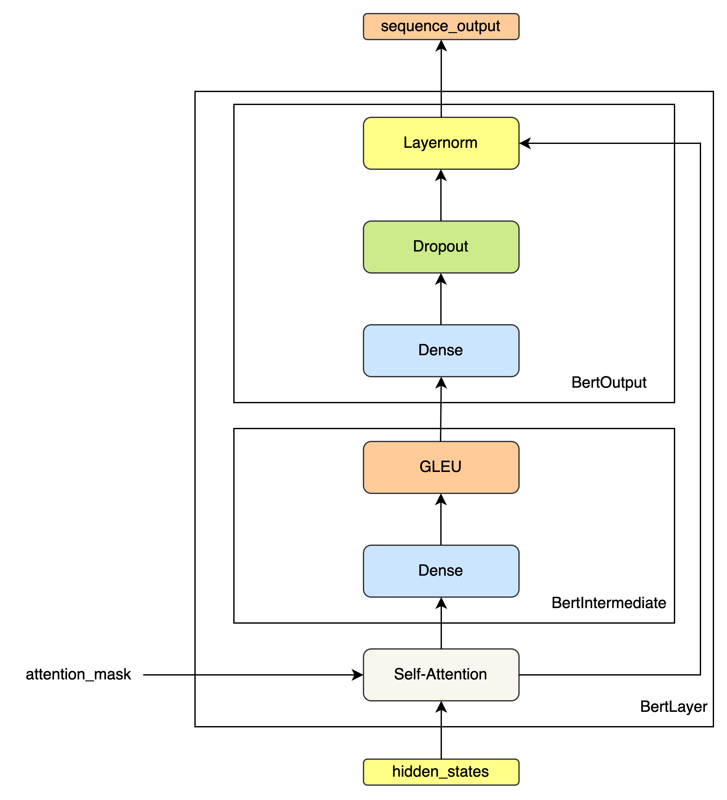

`图解Bert & Bert文本分类实战` 
<!-- more -->

# 图解 Bert

## 环境搭建

按序执行以下命令完成环境搭建:

```bash
git clone https://github.com/DA-southampton/Read_Bert_Code.git
cd Read_Bert_Code
conda create -n Read_Bert_Code python=3.9.22
conda activate Read_Bert_Code
```
本文使用的是谷歌的中文预训练模型：chinese_L-12_H-768_A-12.zip，模型有点大，我就不上传了，如果本地不存在，就点击[这里](https://storage.googleapis.com/bert_models/2018_11_03/chinese_L-12_H-768_A-12.zip)直接下载,或者直接命令行运行

```shell
wget https://storage.googleapis.com/bert_models/2018_11_03/chinese_L-12_H-768_A-12.zip
```

预训练模型下载下来之后，进行解压，然后将tf模型转为对应的pytorch版本即可。对应代码如下:

```shell
export BERT_BASE_DIR=/Users/zhandaohong/Read_Bert_Code/chinese_L-12_H-768_A-12

python convert_tf_checkpoint_to_pytorch.py \
  --tf_checkpoint_path $BERT_BASE_DIR/bert_model.ckpt \
  --bert_config_file $BERT_BASE_DIR/bert_config.json \
  --pytorch_dump_path $BERT_BASE_DIR/pytorch_model.bin
```

转化成功之后，将模型放入到仓库对应位置：

```shell
Read_Bert_Code/bert_read_step_to_step/prev_trained_model/
```

并重新命名为：

```shell
 bert-base-chinese
```
其次是准备训练数据，这里我准备做一个文本分类任务，使用的是Tnews数据集，这个数据集来源是[这里](https://github.com/ChineseGLUE/ChineseGLUE/tree/master/baselines/models_pytorch/classifier_pytorch/chineseGLUEdatasets)，分为训练，测试和开发集，我已经上传到了仓库中，具体位置在

```shell
Read_Bert_Code/bert_read_step_to_step/chineseGLUEdatasets/tnews
```
需要注意的一点是，因为我只是为了了解内部代码情况，所以准确度不是在我的考虑范围之内，所以我只是取其中的一部分数据，其中训练数据使用1k，测试数据使用1k，开发数据1k。

准备就绪，使用pycharm导入项目，准备调试，我的调试文件是`run_classifier.py`文件，对应的参数为

```shell
--model_type=bert --model_name_or_path=prev_trained_model/bert-base-chinese --task_name="tnews" --do_train --do_eval --do_lower_case --data_dir=./chineseGLUEdatasets/tnews --max_seq_length=128 --per_gpu_train_batch_size=16 --per_gpu_eval_batch_size=16 --learning_rate=2e-5 --num_train_epochs=4.0 --logging_steps=100 --save_steps=100 --output_dir=./outputs/tnews_output/ --overwrite_output_dir
```
然后启动 run_classifier.py 文件进行调试即可 , 所参考源仓库未提供requirements.txt文件，因此需要大家自行完成运行时缺失依赖包的安装。


## 数据预处理

1. 输入数据格式

```json
{
  "guid": "train-0",
  "label": "104",              // 文本分类任务: 文本对应的标签
  "text_a": "股票中的突破形态", 
  "text_b": null               // NSP任务: 用于判断给出的两个句子是否连续
}
```
> NSP (Next Sentence Prediction)

2. 文本分词 & 借助字典映射为word id

```json
"股票中的突破形态" --> ['股', '票', '中', '的', '突', '破', '形', '态'] --> [5500, 4873, 704, 4638, 4960, 4788, 2501, 2578]
```
> 对于字典中不存在的词 , 用 `[UNK]` 表示, 对应的id为 100

3. 过长截断策略

4. 添加特殊Token标记


```json
[101, 5500, 4873, 704, 4638, 4960, 4788, 2501, 2578, 102]
```

> BertTokenizer中的特殊token id:
> - `[CLS]`: 101
> - `[SEP]`: 102
> - `[MASK]`: 103
> - `[UNK]`: 100
> - `[PAD]`: 0

```python
    # BertTokenizer
    def build_inputs_with_special_tokens(self, token_ids_0, token_ids_1=None):
        if token_ids_1 is None:
            return [self.cls_token_id] + token_ids_0 + [self.sep_token_id]
        cls = [self.cls_token_id]
        sep = [self.sep_token_id]
        return cls + token_ids_0 + sep + token_ids_1 + sep
```
5. 创建句子辨识列表，用以区分不同的句子


```python
     # BertTokenizer
     def create_token_type_ids_from_sequences(self, token_ids_0, token_ids_1=None):
        """
        Creates a mask from the two sequences passed to be used in a sequence-pair classification task.
        A BERT sequence pair mask has the following format:
        0 0 0 0 0 0 0 0 0 0 1 1 1 1 1 1 1 1 1 1 1
        | first sequence    | second sequence

        if token_ids_1 is None, only returns the first portion of the mask (0's).
        """
        sep = [self.sep_token_id]
        cls = [self.cls_token_id]
        if token_ids_1 is None:
            return len(cls + token_ids_0 + sep) * [0]
        return len(cls + token_ids_0 + sep) * [0] + len(token_ids_1 + sep) * [1]
```
6. 创建用以区分special tokens部分的mask列表


```python
    # BertTokenizer
    def get_special_tokens_mask(self, token_ids_0, token_ids_1=None, already_has_special_tokens=False):
        if token_ids_1 is not None:
            return [1] + ([0] * len(token_ids_0)) + [1] + ([0] * len(token_ids_1)) + [1]
        return [1] + ([0] * len(token_ids_0)) + [1]
```
7. 超长截断

```python
       # PreTrainedTokenizer
       if max_length and len(encoded_inputs["input_ids"]) > max_length:
            encoded_inputs["input_ids"] = encoded_inputs["input_ids"][:max_length]
            encoded_inputs["token_type_ids"] = encoded_inputs["token_type_ids"][:max_length]
            encoded_inputs["special_tokens_mask"] = encoded_inputs["special_tokens_mask"][:max_length]
```

8. 生成padding部分的mask列表


```python
        # 生成注意力掩码，真实token对应1，填充token对应0
        attention_mask = [1 if mask_padding_with_zero else 0] * len(input_ids)
 ```

 9. 所有序列都填充到max_length长度,不足长度用padding填充


```python
        # 记录输入长度
        input_len = len(input_ids)
        # 计算需要填充的长度 --- 所有输入序列等长，都等于max_length
        padding_length = max_length - len(input_ids)
        # 右填充
        input_ids = input_ids + ([pad_token] * padding_length)
        attention_mask = attention_mask + ([0 if mask_padding_with_zero else 1] * padding_length)
        token_type_ids = token_type_ids + ([pad_token_segment_id] * padding_length)
```

10. 数据集中每一个样本最终都会解析得到一个InputFeatures


```python
features.append(
            InputFeatures(input_ids=input_ids,
                          attention_mask=attention_mask,
                          token_type_ids=token_type_ids,
                          label=label,
                          input_len=input_len))
```
> label 是当前文本对应的类别标签
> input_len 是序列实际长度(含special tokens)

11. 数据集预处理完后，将InputFeatures List列表组装起来得到需要的DataSet

```python
dataset = TensorDataset(all_input_ids, all_attention_mask, all_token_type_ids, all_lens,all_labels)
```

## 模型架构

### DataLoader

```python
    train_sampler = RandomSampler(train_dataset) if args.local_rank == -1 else DistributedSampler(train_dataset)
    train_dataloader = DataLoader(train_dataset, sampler=train_sampler, batch_size=args.train_batch_size,collate_fn=collate_fn)
```
DataLoader 设置的回调方法cllote_fn负责对返回的一个batch，在返回前进行预处理:

```python
def collate_fn(batch):
    all_input_ids, all_attention_mask, all_token_type_ids, all_lens, all_labels = map(torch.stack, zip(*batch))
    max_len = max(all_lens).item() # 计算当前批次中所有序列的实际最大长度
    all_input_ids = all_input_ids[:, :max_len] # 按照本批次序列中最大长度进行截断: max_length --> max_len
    all_attention_mask = all_attention_mask[:, :max_len]
    all_token_type_ids = all_token_type_ids[:, :max_len]
    return all_input_ids, all_attention_mask, all_token_type_ids, all_labels
```

### BertEmbeddings 


```python
class BertEmbeddings(nn.Module):
    def __init__(self, config):
        super(BertEmbeddings, self).__init__()
        self.word_embeddings = nn.Embedding(config.vocab_size, config.hidden_size, padding_idx=0)
        self.position_embeddings = nn.Embedding(config.max_position_embeddings, config.hidden_size)
        self.token_type_embeddings = nn.Embedding(config.type_vocab_size, config.hidden_size)
        self.LayerNorm = BertLayerNorm(config.hidden_size, eps=config.layer_norm_eps)
        self.dropout = nn.Dropout(config.hidden_dropout_prob)

    def forward(self, input_ids, token_type_ids=None, position_ids=None):
        seq_length = input_ids.size(1)
        if position_ids is None: 
            # 为当前批次中的每个序列样本生成一个位置序列: (1,2,3,4,5,...) , 构成一个位置序列矩阵
            position_ids = torch.arange(seq_length, dtype=torch.long, device=input_ids.device)
            position_ids = position_ids.unsqueeze(0).expand_as(input_ids)
        if token_type_ids is None:
            token_type_ids = torch.zeros_like(input_ids)

        words_embeddings = self.word_embeddings(input_ids)
        position_embeddings = self.position_embeddings(position_ids) # 位置编码为可学习的矩阵
        token_type_embeddings = self.token_type_embeddings(token_type_ids) # 让模型自己学会区分不同的句子

        embeddings = words_embeddings + position_embeddings + token_type_embeddings
        embeddings = self.LayerNorm(embeddings)
        embeddings = self.dropout(embeddings)
        return embeddings
```


### BertEncoder

#### BertLayer



```python
class BertIntermediate(nn.Module):
    def __init__(self, config):
        super(BertIntermediate, self).__init__()
        self.dense = nn.Linear(config.hidden_size, config.intermediate_size) # (768,3072)
        # 激活函数 - GLEU
        if isinstance(config.hidden_act, str) or (sys.version_info[0] == 2 and isinstance(config.hidden_act, unicode)):
            self.intermediate_act_fn = ACT2FN[config.hidden_act]
        else:
            self.intermediate_act_fn = config.hidden_act

    def forward(self, hidden_states):
        hidden_states = self.dense(hidden_states)
        hidden_states = self.intermediate_act_fn(hidden_states)  # 激活函数 - GLEU
        return hidden_states

class BertOutput(nn.Module):
    def __init__(self, config):
        super(BertOutput, self).__init__()
        self.dense = nn.Linear(config.intermediate_size, config.hidden_size) # (3072,768)
        self.LayerNorm = BertLayerNorm(config.hidden_size, eps=config.layer_norm_eps)
        self.dropout = nn.Dropout(config.hidden_dropout_prob)

    def forward(self, hidden_states, input_tensor):
        hidden_states = self.dense(hidden_states)
        hidden_states = self.dropout(hidden_states)
        hidden_states = self.LayerNorm(hidden_states + input_tensor)
        return hidden_states

class BertLayer(nn.Module):
    def __init__(self, config):
        super(BertLayer, self).__init__()
        self.attention = BertAttention(config)
        self.intermediate = BertIntermediate(config)
        self.output = BertOutput(config)

    def forward(self, hidden_states, attention_mask=None):
        attention_output = self.attention(hidden_states, attention_mask)
        intermediate_output = self.intermediate(attention_output)
        layer_output = self.output(intermediate_output, attention_output)
        return layer_output
```

#### BertEncoder


```python
class BertEncoder(nn.Module):
    def __init__(self, config):
        super(BertEncoder, self).__init__()
        self.layer = nn.ModuleList([BertLayer(config) for _ in range(config.num_hidden_layers)])

    def forward(self, hidden_states, attention_mask=None, head_mask=None):
        for i, layer_module in enumerate(self.layer):
            hidden_states = layer_module(hidden_states, attention_mask, head_mask[i])
        return hidden_states
```

### BertPooler


```python
class BertPooler(nn.Module):
    def __init__(self, config):
        super(BertPooler, self).__init__()
        self.dense = nn.Linear(config.hidden_size, config.hidden_size)
        self.activation = nn.Tanh()

    def forward(self, hidden_states):
        # We "pool" the model by simply taking the hidden state corresponding
        # to the first token.
        first_token_tensor = hidden_states[:, 0] # CLS Token Context Embeddings
        pooled_output = self.dense(first_token_tensor)
        pooled_output = self.activation(pooled_output)
        return pooled_output
```
### BertModel


```python
class BertModel(BertPreTrainedModel):
    def __init__(self, config):
        super(BertModel, self).__init__(config)
        self.embeddings = BertEmbeddings(config)
        self.encoder = BertEncoder(config)
        self.pooler = BertPooler(config)
        self.init_weights()

    def forward(self, input_ids, attention_mask=None, token_type_ids=None, position_ids=None, head_mask=None):
        extended_attention_mask = attention_mask.unsqueeze(1).unsqueeze(2)
        extended_attention_mask = extended_attention_mask.to(dtype=next(self.parameters()).dtype) # fp16 compatibility
        extended_attention_mask = (1.0 - extended_attention_mask) * -10000.0

        embedding_output = self.embeddings(input_ids, position_ids=position_ids, token_type_ids=token_type_ids)
        sequence_output = self.encoder(embedding_output,
                                       extended_attention_mask, # padding mask
                                      )
        pooled_output = self.pooler(sequence_output)

        outputs = (sequence_output, pooled_output,)
        return outputs
```

### BertForSequenceClassification


```python
class BertForSequenceClassification(BertPreTrainedModel):
    def __init__(self, config):
        super(BertForSequenceClassification, self).__init__(config)
        self.num_labels = config.num_labels
        self.bert = BertModel(config)
        self.dropout = nn.Dropout(config.hidden_dropout_prob)
        self.classifier = nn.Linear(config.hidden_size, self.config.num_labels)

        self.init_weights()

    def forward(self, input_ids, attention_mask=None, token_type_ids=None,
                position_ids=None, head_mask=None, labels=None):

        outputs = self.bert(input_ids,
                            attention_mask=attention_mask, # padding mask
                            token_type_ids=token_type_ids,
                            position_ids=position_ids, 
                            head_mask=head_mask) # None ?

        pooled_output = outputs[1] # 对于分类任务来说，只需要去除CLS Token用于分类任务即可

        pooled_output = self.dropout(pooled_output)
        logits = self.classifier(pooled_output)

        outputs = (logits,) + outputs[2:]  # add hidden states and attention if they are here

        if labels is not None:
            if self.num_labels == 1:
                #  We are doing regression
                loss_fct = MSELoss()
                loss = loss_fct(logits.view(-1), labels.view(-1))
            else:
                loss_fct = CrossEntropyLoss()
                loss = loss_fct(logits.view(-1, self.num_labels), labels.view(-1))
            outputs = (loss,) + outputs

        return outputs  # (loss), logits, (hidden_states), (attentions)
```

### BertAttention

#### BertSelfAttention


```python
class BertSelfAttention(nn.Module):
    def __init__(self, config):
        super(BertSelfAttention, self).__init__()
        self.output_attentions = config.output_attentions

        self.num_attention_heads = config.num_attention_heads
        self.attention_head_size = int(config.hidden_size / config.num_attention_heads)
        self.all_head_size = self.num_attention_heads * self.attention_head_size

        self.query = nn.Linear(config.hidden_size, self.all_head_size)
        self.key = nn.Linear(config.hidden_size, self.all_head_size)
        self.value = nn.Linear(config.hidden_size, self.all_head_size)

        self.dropout = nn.Dropout(config.attention_probs_dropout_prob)

    def transpose_for_scores(self, x):
        new_x_shape = x.size()[:-1] + (self.num_attention_heads, self.attention_head_size)
        x = x.view(*new_x_shape)
        return x.permute(0, 2, 1, 3)

    def forward(self, hidden_states, attention_mask=None, head_mask=None):
        mixed_query_layer = self.query(hidden_states)
        mixed_key_layer = self.key(hidden_states)
        mixed_value_layer = self.value(hidden_states)
        # view 成多头格式: (batch,heads,seq_len,d_k)
        query_layer = self.transpose_for_scores(mixed_query_layer)
        key_layer = self.transpose_for_scores(mixed_key_layer)
        value_layer = self.transpose_for_scores(mixed_value_layer)

        # Take the dot product between "query" and "key" to get the raw attention scores.
        attention_scores = torch.matmul(query_layer, key_layer.transpose(-1, -2)) # (batch,heads,d_k,seq_len)
        attention_scores = attention_scores / math.sqrt(self.attention_head_size)
        if attention_mask is not None:
            # Apply the attention mask is (precomputed for all layers in BertModel forward() function)
            attention_scores = attention_scores + attention_mask

        # Normalize the attention scores to probabilities.
        attention_probs = nn.Softmax(dim=-1)(attention_scores)

        # This is actually dropping out entire tokens to attend to, which might
        # seem a bit unusual, but is taken from the original Transformer paper.
        attention_probs = self.dropout(attention_probs)

        context_layer = torch.matmul(attention_probs, value_layer)

        context_layer = context_layer.permute(0, 2, 1, 3).contiguous()
        new_context_layer_shape = context_layer.size()[:-2] + (self.all_head_size,)
        context_layer = context_layer.view(*new_context_layer_shape) # 合并头结果
        return context_layer
```

#### BertSelfOutput


```python
class BertSelfOutput(nn.Module):
    def __init__(self, config):
        super(BertSelfOutput, self).__init__()
        self.dense = nn.Linear(config.hidden_size, config.hidden_size)
        self.LayerNorm = BertLayerNorm(config.hidden_size, eps=config.layer_norm_eps)
        self.dropout = nn.Dropout(config.hidden_dropout_prob)
    
    # 残差链接 + 层归一化
    def forward(self, hidden_states, input_tensor):
        hidden_states = self.dense(hidden_states)
        hidden_states = self.dropout(hidden_states)
        hidden_states = self.LayerNorm(hidden_states + input_tensor)
        return hidden_states
```

#### BertAttention


```python
class BertAttention(nn.Module):
    def __init__(self, config):
        super(BertAttention, self).__init__()
        self.self = BertSelfAttention(config)
        self.output = BertSelfOutput(config)

    def forward(self, input_tensor, attention_mask=None):
        self_outputs = self.self(input_tensor, attention_mask) # 多头自注意力机制
        attention_output = self.output(self_outputs, input_tensor)
        return attention_output
```

## 预训练

### BertPredictionHeadTransform


```python
class BertPredictionHeadTransform(nn.Module):
    def __init__(self, config):
        super(BertPredictionHeadTransform, self).__init__()
        self.dense = nn.Linear(config.hidden_size, config.hidden_size)
        if isinstance(config.hidden_act, str) or (sys.version_info[0] == 2 and isinstance(config.hidden_act, unicode)):
            self.transform_act_fn = ACT2FN[config.hidden_act]
        else:
            self.transform_act_fn = config.hidden_act
        self.LayerNorm = BertLayerNorm(config.hidden_size, eps=config.layer_norm_eps)

    def forward(self, hidden_states):
        hidden_states = self.dense(hidden_states)
        hidden_states = self.transform_act_fn(hidden_states)
        hidden_states = self.LayerNorm(hidden_states)
        return hidden_states
```       

### BertLMPredictionHead


```python
class BertLMPredictionHead(nn.Module):
    def __init__(self, config):
        super(BertLMPredictionHead, self).__init__()
        self.transform = BertPredictionHeadTransform(config)

        # The output weights are the same as the input embeddings, but there is
        # an output-only bias for each token.
        self.decoder = nn.Linear(config.hidden_size,
                                 config.vocab_size,
                                 bias=False)

        self.bias = nn.Parameter(torch.zeros(config.vocab_size))

    def forward(self, hidden_states):
        hidden_states = self.transform(hidden_states)
        hidden_states = self.decoder(hidden_states) + self.bias
        return hidden_states
```        

### BertPreTrainingHeads


```python
class BertPreTrainingHeads(nn.Module):
    def __init__(self, config):
        super(BertPreTrainingHeads, self).__init__()
        self.predictions = BertLMPredictionHead(config)
        self.seq_relationship = nn.Linear(config.hidden_size, 2)

    def forward(self, sequence_output, pooled_output):
        prediction_scores = self.predictions(sequence_output) #
        seq_relationship_score = self.seq_relationship(pooled_output) # 两个句子是否为上下句关系
        return prediction_scores, seq_relationship_score
```

### BertForPreTraining


```python
class BertForPreTraining(BertPreTrainedModel):
    def __init__(self, config):
        super(BertForPreTraining, self).__init__(config)
        self.bert = BertModel(config)
        self.cls = BertPreTrainingHeads(config)

    def forward(self, input_ids, attention_mask=None, token_type_ids=None, position_ids=None, head_mask=None,
                masked_lm_labels=None, next_sentence_label=None):

        outputs = self.bert(input_ids,
                            attention_mask=attention_mask,
                            token_type_ids=token_type_ids,
                            position_ids=position_ids, 
                            head_mask=head_mask)

        sequence_output, pooled_output = outputs[:2] # 隐藏层输出,CLS Token Embeddings
        prediction_scores, seq_relationship_score = self.cls(sequence_output, pooled_output)

        outputs = (prediction_scores, seq_relationship_score,)
        # 计算掩码语言损失 和 下一个句子预测损失
        if masked_lm_labels is not None and next_sentence_label is not None:
            loss_fct = CrossEntropyLoss(ignore_index=-1)
            masked_lm_loss = loss_fct(prediction_scores.view(-1, self.config.vocab_size), masked_lm_labels.view(-1))
            next_sentence_loss = loss_fct(seq_relationship_score.view(-1, 2), next_sentence_label.view(-1))
            total_loss = masked_lm_loss + next_sentence_loss
            outputs = (total_loss,) + outputs

        return outputs  # (loss), prediction_scores, seq_relationship_score, (hidden_states), (attentions)
```