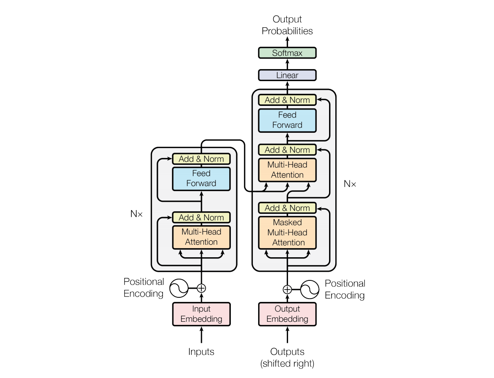
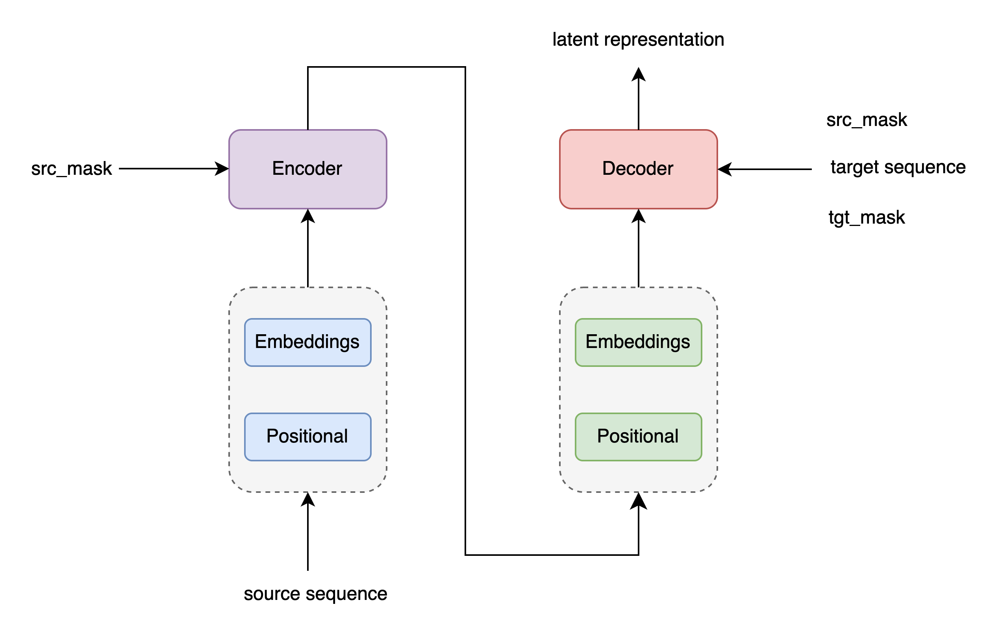
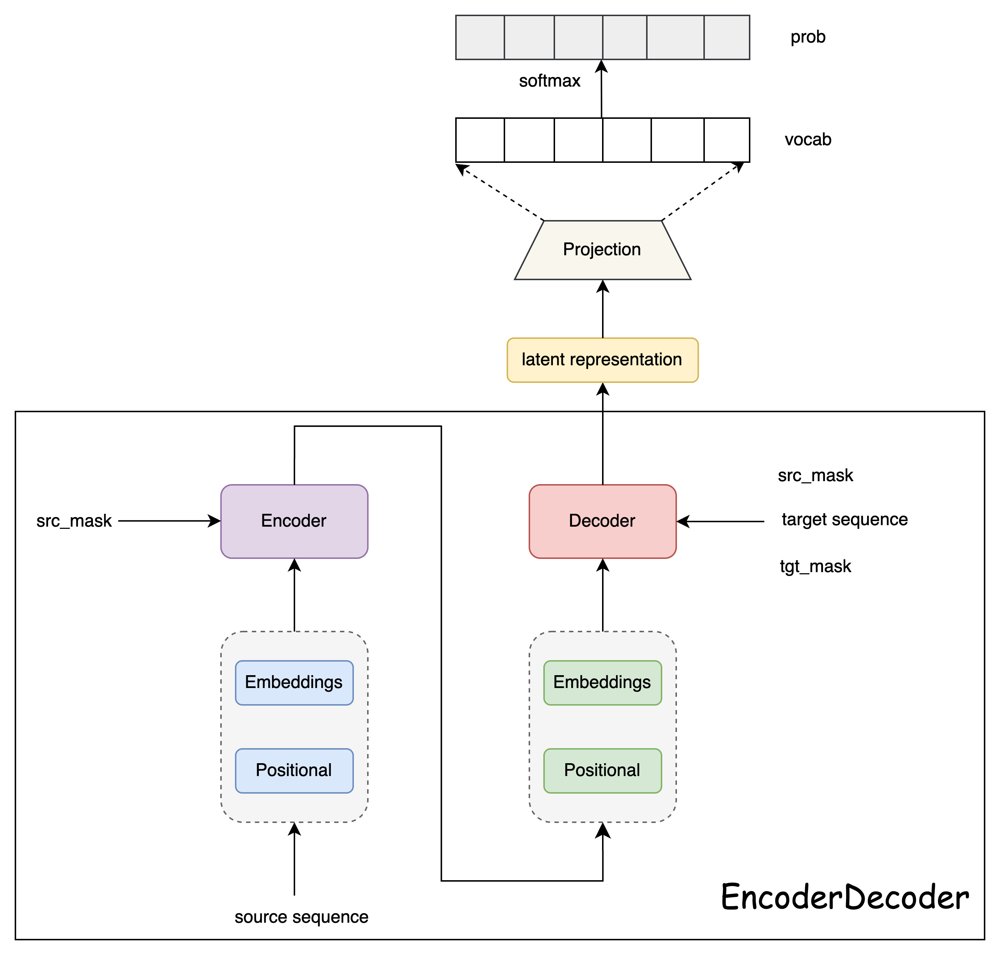
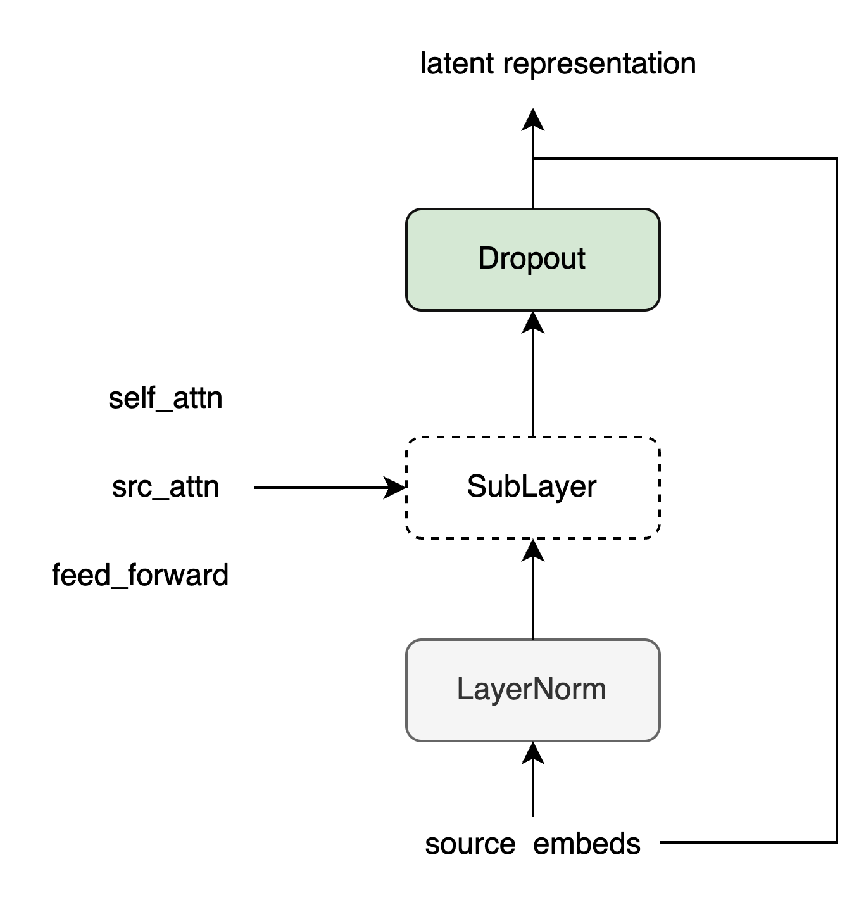
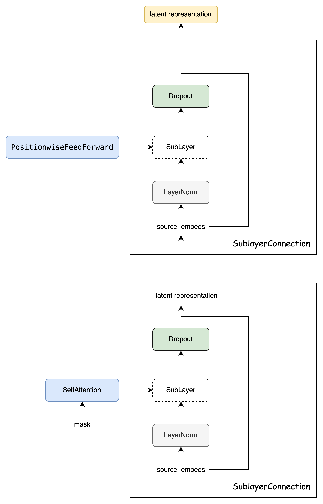
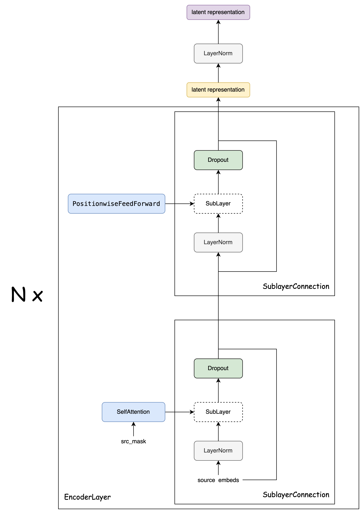
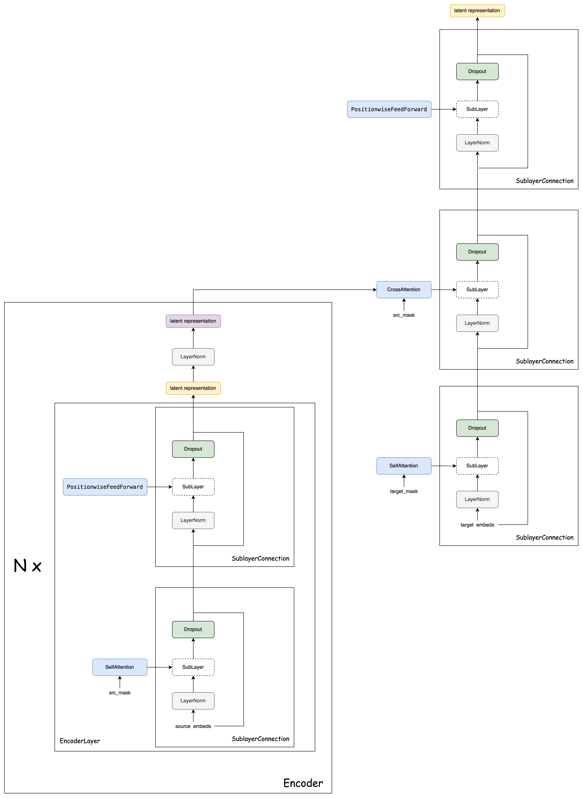
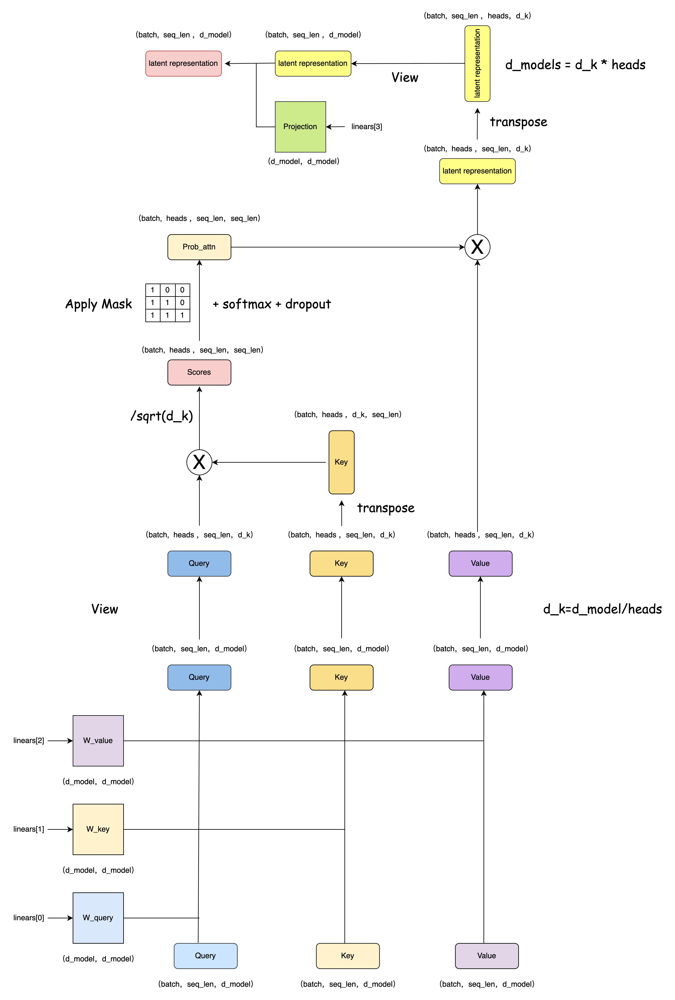

`图解Transformer & 机器翻译实战` 

<!-- more -->

# 图解Transformer

## 环境

本文基于 [The Annotated Transformer](https://nlp.seas.harvard.edu/annotated-transformer/) 所提供的[代码](https://github.com/harvardnlp/annotated-transformer)展开进行讲解。

环境搭建遵从如下步骤即可:

```bash
git clone https://github.com/harvardnlp/annotated-transformer
cd annotated-transformer
conda create -n annotated-transformer python=3.9.22
conda activate annotated-transformer
pip install -r requirements.txt
```
> MacOS 用户本地运行时，需要将 `requirements.txt` 文件中的 `torch == 1.11.0+cu113` 改为 `torch==1.11.0`，因为CUDA不支持MacOS。

## 背景

RNN等模型的缺点是需要顺序计算，从而很难并行。因此出现了Extended Neural GPU、ByteNet和ConvS2S等网络模型。这些模型都是以CNN为基础，这比较容易并行。但是和RNN相比，它较难学习到长距离的依赖关系。

本文的Transformer使用了Self-Attention机制，它在编码每一词的时候都能够注意(attend to)整个句子，从而可以解决长距离依赖的问题，同时计算Self-Attention可以用矩阵乘法一次计算所有的时刻，因此可以充分利用计算资源(CPU/GPU上的矩阵运算都是充分优化和高度并行的)。

## 模型架构



Transformer 是一种基于自注意力机制(Self-Attention) 的神经网络架构,其由七大主要部分构成:

1. **Encoder-Decoder 结构**
    - **编码器(Encoder)**：将输入序列（如句子）转换为一系列高维向量表示。
    - **解码器(Decoder)**：根据编码器的输出生成目标序列（如翻译后的句子）。

2. **多头自注意力机制（Multi-Head Self-Attention）**
    - 自注意力机制是 Transformer 的核心，它允许模型在处理每个词时关注输入序列中的所有词。
    - 多头自注意力机制通过并行计算多个注意力头，捕捉不同子空间的信息，从而增强模型的表达能力。

3. **位置编码（Positional Encoding）**
    - 由于 Transformer 不使用传统的循环或卷积结构，它通过位置编码将序列中词的位置信息注入到输入中。位置编码通常使用正弦和余弦函数生成。

4. **前馈神经网络（Feed-Forward Neural Network）**
    - 在自注意力机制之后，每个位置的输出会通过一个独立的前馈神经网络进行进一步处理。

5. **残差连接与层归一化（Residual Connection & Layer Normalization）**
    - 每个子层（如自注意力层和前馈层）都使用了残差连接和层归一化，以加速训练并提高模型的稳定性。

6. **掩码机制（Masking）**
    - 在解码器中，使用掩码机制确保模型在生成目标序列时只能看到当前及之前的词，而不能看到未来的词。
    - 在输入序列长度不一致时，通过填充掩码（Padding Mask）屏蔽填充部分的信息。

7. **输出层**
    - 解码器的最终输出通过一个线性层和 Softmax 函数生成目标序列的概率分布。


### Encoder-Decoder 结构



```python
class EncoderDecoder(nn.Module):
    def __init__(self, encoder, decoder, src_embed, tgt_embed, generator):
        super(EncoderDecoder, self).__init__()
        self.encoder = encoder 
        self.decoder = decoder
        self.src_embed = src_embed
        self.tgt_embed = tgt_embed
        self.generator = generator

    def forward(self, src, tgt, src_mask, tgt_mask):
        "Take in and process masked src and target sequences."
        return self.decode(self.encode(src, src_mask), src_mask, tgt, tgt_mask)

    def encode(self, src, src_mask):
        return self.encoder(self.src_embed(src), src_mask)

    def decode(self, memory, src_mask, tgt, tgt_mask):
        return self.decoder(self.tgt_embed(tgt), memory, src_mask, tgt_mask)
```

#### Generator




```python
class Generator(nn.Module):
	# 根据Decoder的隐状态输出一个词
	# d_model是Decoder输出的大小，vocab是词典大小
	def __init__(self, d_model, vocab):
		super(Generator, self).__init__()
		self.proj = nn.Linear(d_model, vocab)
	
	# 全连接再加上一个softmax
	def forward(self, x):
		return F.log_softmax(self.proj(x), dim=-1)
```
### Encoder 结构

#### SublayerConnection



```python
class SublayerConnection(nn.Module):
	"""
	LayerNorm + sublayer(Self-Attenion/Dense) + dropout + 残差连接
	为了简单，把LayerNorm放到了前面，这和原始论文稍有不同，原始论文LayerNorm在最后。
	"""
	def __init__(self, size, dropout):
		super(SublayerConnection, self).__init__()
		self.norm = LayerNorm(size)
		self.dropout = nn.Dropout(dropout)
	
	def forward(self, x, sublayer):
		"sublayer是传入的参数，参考DecoderLayer，它可以当成函数调用，这个函数的有一个输入参数"
		return x + self.dropout(sublayer(self.norm(x)))
```

#### EncoderLayer



```python
# 编码器层 = 自注意力子层  +  前馈层
class EncoderLayer(nn.Module):
  
    def __init__(self, size, self_attn, feed_forward, dropout):
        super(EncoderLayer, self).__init__()
        self.self_attn = self_attn
        self.feed_forward = feed_forward
        # 自注意力子层 和 前馈层 各需要一个
        self.sublayer = clones(SublayerConnection(size, dropout), 2)
        self.size = size
         
    def forward(self, x, mask):
        "Follow Figure 1 (left) for connections."
        x = self.sublayer[0](x, lambda x: self.self_attn(x, x, x, mask))
        return self.sublayer[1](x, self.feed_forward)
```
#### Encoder



```python
class Encoder(nn.Module):
    "Core encoder is a stack of N layers"

    def __init__(self, layer, N):
        super(Encoder, self).__init__()
        self.layers = clones(layer, N)
        self.norm = LayerNorm(layer.size)

    def forward(self, x, mask):
        "Pass the input (and mask) through each layer in turn."
        for layer in self.layers:
            x = layer(x, mask)
        return self.norm(x)
```

### Decoder 结构

#### DecoderLayer



```python
# 解码器层 = 自注意力子层 + 源注意力子层 + 前馈层
class DecoderLayer(nn.Module):
    "Decoder is made of self-attn, src-attn, and feed forward (defined below)"

    def __init__(self, size, self_attn, src_attn, feed_forward, dropout):
        super(DecoderLayer, self).__init__()
        self.size = size
        self.self_attn = self_attn
        self.src_attn = src_attn
        self.feed_forward = feed_forward
        # 自注意力子层 + 源注意力子层 + 前馈层 各需要一个
        self.sublayer = clones(SublayerConnection(size, dropout), 3)

    def forward(self, x, memory, src_mask, tgt_mask):
        "Follow Figure 1 (right) for connections."
        m = memory
        x = self.sublayer[0](x, lambda x: self.self_attn(x, x, x, tgt_mask))
        x = self.sublayer[1](x, lambda x: self.src_attn(x, m, m, src_mask))
        return self.sublayer[2](x, self.feed_forward)
```
#### Decoder


```python
# 解码器 =  N个解码器层 + 层归一化
class Decoder(nn.Module):
    "Generic N layer decoder with masking."

    def __init__(self, layer, N):
        super(Decoder, self).__init__()
        self.layers = clones(layer, N)
        self.norm = LayerNorm(layer.size)

    def forward(self, x, memory, src_mask, tgt_mask): # 输入,编码器隐藏层输出,源掩码,目标掩码
        for layer in self.layers:
            x = layer(x, memory, src_mask, tgt_mask)
        return self.norm(x)
```

### 多头自注意力



```python
class MultiHeadedAttention(nn.Module):
    def __init__(self, h, d_model, dropout=0.1):
        "Take in model size and number of heads."
        super(MultiHeadedAttention, self).__init__()
        assert d_model % h == 0
        # We assume d_v always equals d_k
        self.d_k = d_model // h  # 每个头64维
        self.h = h  # 8个头
        self.linears = clones(nn.Linear(d_model, d_model), 4) # W_q,W_k,W_v,W_projection
        self.attn = None
        self.dropout = nn.Dropout(p=dropout)

    def forward(self, query, key, value, mask=None):
        "Implements Figure 2"
        if mask is not None:
            # Same mask applied to all h heads.
            mask = mask.unsqueeze(1)
        nbatches = query.size(0)

        # 1) Do all the linear projections in batch from d_model => h x d_k
        query, key, value = [
            lin(x).view(nbatches, -1, self.h, self.d_k).transpose(1, 2) # (batches,heads,seq_len,d_k)
            for lin, x in zip(self.linears, (query, key, value))
        ]

        # 2) Apply attention on all the projected vectors in batch.
        x, self.attn = attention(
            query, key, value, mask=mask, dropout=self.dropout
        )

        # 3) "Concat" using a view and apply a final linear.
        x = (
            x.transpose(1, 2)
            .contiguous()
            .view(nbatches, -1, self.h * self.d_k)
        )
        del query
        del key
        del value
        return self.linears[-1](x)
```
```python
def attention(query, key, value, mask=None, dropout=None):
    "Compute 'Scaled Dot Product Attention'"
    d_k = query.size(-1)
    scores = torch.matmul(query, key.transpose(-2, -1)) / math.sqrt(d_k)
    if mask is not None:
        scores = scores.masked_fill(mask == 0, -1e9) # 广播: (1,1,1,10) ---> (1,8,10,10)
    p_attn = scores.softmax(dim=-1)
    if dropout is not None:
        p_attn = dropout(p_attn)
    return torch.matmul(p_attn, value), p_attn
```

