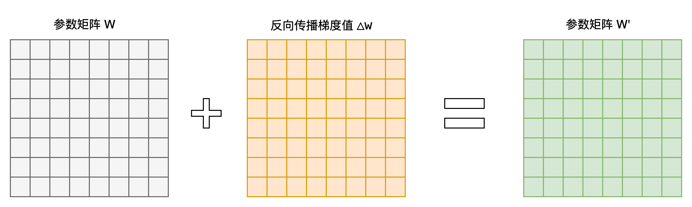
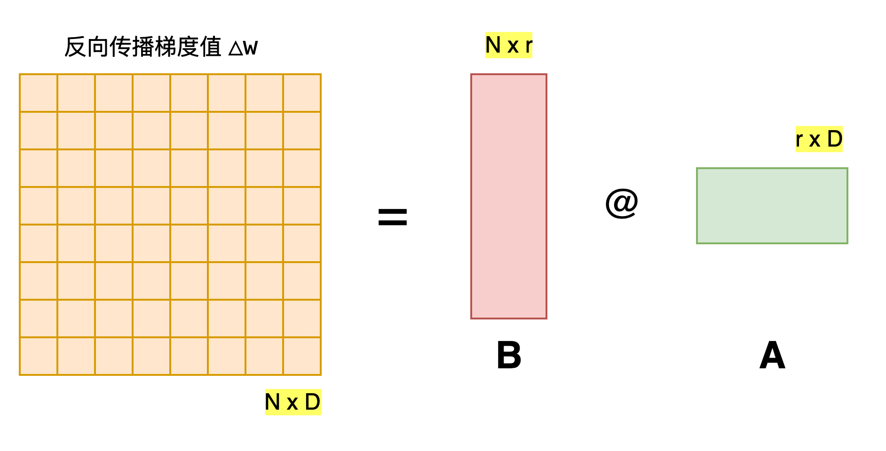
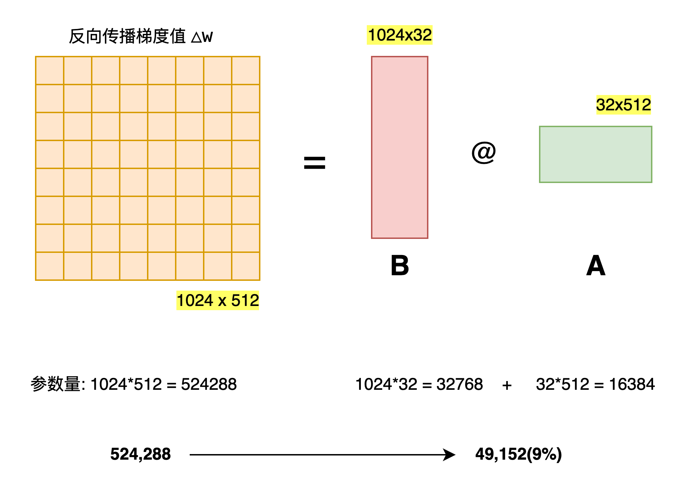
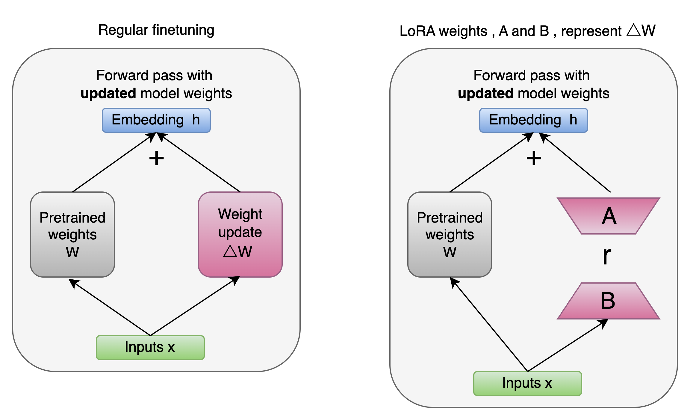
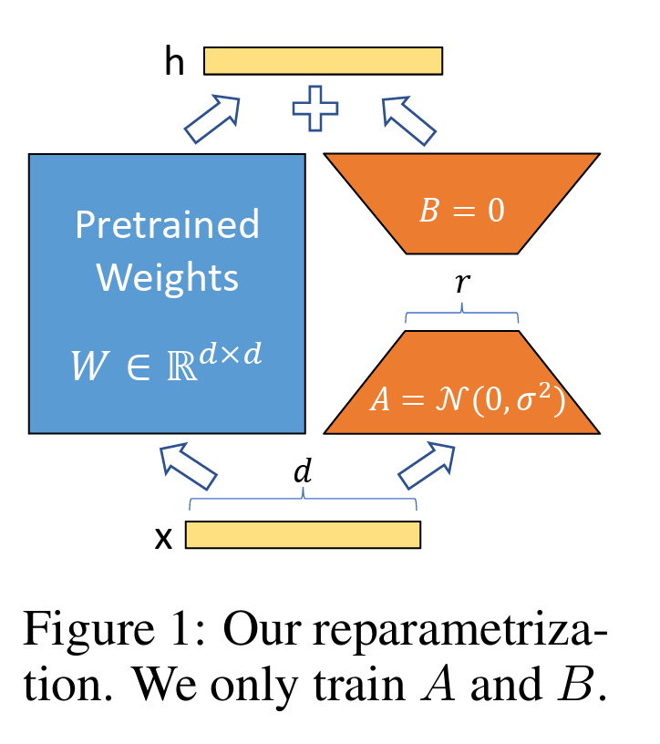
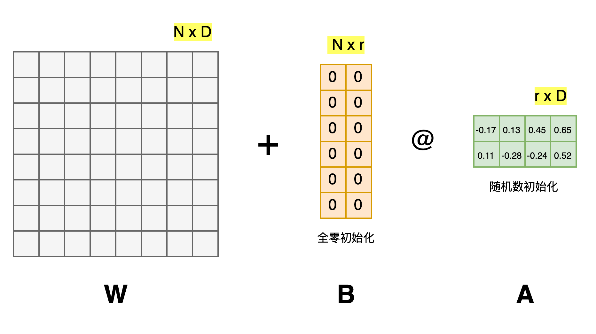
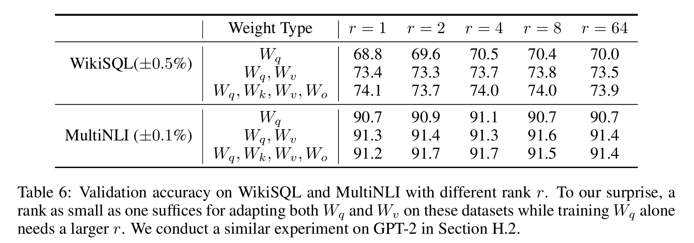

`通俗易懂讲解LoRA微调`
 
<!-- more -->

> 论文链接: [LoRA: Low-Rank Adaptation of Large Language Models](https://arxiv.org/abs/2106.09685)

## 符合认知的大模型微调流程

符合我们直接观念所想的大模型微调流程为:

1. 准备与下游任务相关的数据集

2. 选择合适的预训练好的大模型

3. 在特定任务相关的数据集上执行有监督全量参数微调，将预训练模型的参数 $W$ 调整为适合下游任务的 $W'$

其中第三步通过反向传播全量更新模型参数的过程如下：



上述的全量微调流程问题在于大模型的参数量往往特别大，也就是 $△W$ 占据了特别大的内存资源和计算资源，有没有办法能够减少 $△W$ 所占的内存资源和计算资源呢？



我们可以利用矩阵分解技术，将原始的 $△W$ 矩阵从 $N * D$ 参数量降低到 $N * r + r * D$ 级别的参数量，如下图所示:




这样一来，我们微调大模型的流程就变为了(前两步不变)：

3. **初始化低秩矩阵**：对于需要微调的密集层，初始化两个低秩矩阵 $A$ 和 $B$，其维度分别为 $N * r$ 和 $r * D$，其中 $r$ 是低秩的秩，远小于原始矩阵的维度。

4. **冻结预训练模型参数**：在微调过程中，保持预训练模型的原始参数 $W$ 不变，只对低秩矩阵 $A$ 和 $B$ 进行训练。

5. **执行微调训练**：在准备好的数据集上，通过反向传播算法更新低秩矩阵 $A$ 和 $B$ 的参数，使得模型在下游任务上的表现逐渐优化。

6. **合并参数（可选）**：在微调完成后，如果需要，可以将低秩矩阵 $A$ 和 $B$ 的更新量与原始参数 $W$ 合并，得到最终适用于下游任务的模型参数 $W'$。

这在LoRA这篇论文中也被称为低秩分解自适应技术。



## 大模型微调大致发展历史

大公司或者研究机构，都是有足够资源的来开发大模型，但是对于一般的小公司或者个人来说，要想开发自己的大模型几乎不可能，要知道像 ChatGPT 这样的大模型，一次训练的成本就在上千亿美元。

那么那些小公司或者个人，又怎么能够利用这些开源的大模型，在自己的数据上继续训练，从而应用于自己的业务场景？有没有低成本的方法微调大模型？

答案是有的。目前主流的方法包括2019年 Houlsby N 等人提出的 Adapter Tuning，2021年微软提出的 LORA，斯坦福提出的 Prefix-Tuning，谷歌提出的 Prompt Tuning，2022年清华提出的 P-tuning v2。

这些方法都有各自的特点，从个人使用情况来说，LORA 的效果会好于其它几种方法。其它方法都有各自的一些问题：

1. Adapter Tuning 增加了模型层数，引入了额外的推理延迟

2. Prefix-Tuning 难于训练，且预留给 Prompt 的序列挤占了下游任务的输入序列空间，影响模型性能

3. P-tuning v2 很容易导致旧知识遗忘，微调之后的模型，在之前的问题上表现明显变差

基于上述背景，LORA 得益于前人的一些关于内在维度（intrinsic dimension）的发现：

- 模型是过参数化的，它们有更小的内在维度，模型主要依赖于这个低的内在维度（low intrinsic dimension）去做任务适配。

假设模型在任务适配过程中权重的改变量是低秩（low rank）的，由此提出低秩自适应（LoRA）方法。

LoRA 允许我们通过优化适应过程中密集层变化的秩分解矩阵，来间接训练神经网络中的一些密集层，同时保持预先训练的权重不变。

## LoRA 微调



LoRA 的思想很简单:

1. 在 LoRA 论文中，在原始预训练语言模型（Pre - trained Language Model，简称 PLM）旁添加一条旁路，进行一次降维再升维的操作，以此来模拟所谓的内在秩（intrinsic rank）。

2. 训练的时候固定 PLM 的参数，只训练降维矩阵 A 与升维矩阵 B 。而模型的输入输出维度不变，输出时将 BA 与 PLM 的参数叠加。

3. 用随机高斯分布初始化 A ，用 0 矩阵初始化 B ，保证训练的开始此旁路矩阵依然是 0 矩阵。



4. 假设要在下游任务微调一个预训练语言模型（如 GPT-3），则需要更新预训练模型参数，公式表示如下：

$$
W_0 + \Delta W
$$

其中，$W_0$ 是预训练模型初始化的参数，$\Delta W$ 就是需要更新的参数。如果是全参数微调，则它的参数量 $= W_0$（如果是 GPT-3，则 $\Delta W \approx 175B$）。从这可以看出要全参数微调大语言模型，代价是非常高的。

而对于 LoRA 来说，只需要微调 $\Delta W$。

具体来看，假设预训练的矩阵为 $W_0 \in \mathbb{R}^{d \times k}$，它的更新可表示为：

$$
W_0 + \Delta W = W_0 + BA, \quad B \in \mathbb{R}^{d \times r}, A \in \mathbb{R}^{r \times k}
$$

其中秩 $r \ll \min(d, k)$。

在 LoRA 的训练过程中，$W_0$ 是固定不变的，只有 $A$ 和 $B$ 是训练参数。

在前向过程中，$W_0$ 与 $\Delta W$ 都会乘以相同的输入 $x$，最后相加：

$$
h = W_0 x + \Delta W x = W_0 x + BA x
$$

LoRA 的这种思想有点类似于残差连接，同时使用这个旁路的更新来模拟 Full Fine-Tuning 的过程。并且，Full Fine-Tuning 可以被看作是 LoRA 的特例（当 $r$ 等于 $k$ 时）。

在推理过程中，LoRA 也几乎未引入额外的 Inference Latency，只需要计算 $W = W_0 + \Delta W$ 即可。

LoRA 与 Transformer 的结合也很简单，仅在 QKV Attention 的计算中增加一个旁路。

### 矩阵A和B为什么不能同时为零？

在前面我们介绍了，用随机高斯分布初始化 $A$，用 0 矩阵初始化 $B$。矩阵 $A$ 为什么不也用 0 初始化？

这主要是因为如果矩阵 $A$ 也用 0 初始化，那么矩阵 $B$ 的梯度就始终为 0，无法更新参数，导致 $\Delta W = BA = 0$。这里简单推理一下。

对于 $h = W_0 x + BAx$，设 $h^{(2)} = BAx$，则：

$$
h_i^{(2)} = \sum_j z_{i,j} x_j = \sum_j \left( \sum_k B_{i,k} A_{k,j} \right) x_j
$$

因此：

$$
\frac{\partial h_i^{(2)}}{\partial B_{i,k}} = \frac{\partial h_i^{(2)}}{\partial B_{i,k}} = \sum_j A_{k,j} x_j
$$

如果矩阵 $A$ 也用 0 初始化，那么上面的梯度就变成了 0，所以矩阵 $A$ 不能用 0 初始化。

同样，我们看一下矩阵 $B$ 初始化为 0 的影响。

由于矩阵 $B$ 的参数会发生更新，而 $A$ 矩阵又不是 0 矩阵，因此后面 $\Delta W = BA \neq 0$，所以矩阵 $B$ 可以用 0 初始化。

### 秩的选择

论文实验结果显示，对于一般的任务， r=1,2,4,8 就足够了。而一些领域差距比较大的任务可能需要更大的 r 。

同时，增加 r 值变大并不能提升微调的效果，这可能是因为参数量增加需要更多的语料。



### 注意

1. q进行 LoRA 高效的模型微调，重点是保持参数尺寸最小化。

2. 使用 PEFT 库来实现 LoRA，避免复杂的编码需求。

3. 将 LoRA 适应扩展到所有线性层，增强整体模型的能力。

4. 保持偏置和层归一化可训练，因为它们对模型的适应性至关重要，并且不需要低秩适应。

5. 应用量化低秩适应（QLoRA）以节省 GPU 显存并训练模型，从而能够训练更大的模型。

# 总结

基于大模型的内在低秩特性，增加旁路矩阵来模拟全参数微调，LoRA 通过简单有效的方案来达成轻量微调的目的。它的应用自不必提，可以将现在的各种大模型通过轻量微调变成各个不同领域的专业模型。

此外，考虑 OpenAI 对 GPT 模型的认知，GPT 的本质是对训练数据的有效压缩，从而发现数据内部的逻辑与联系，LoRA 的思想与之有相通之处，原模型虽大，但起核心作用的参数是低秩的，通过增加旁路，达到四两拨千斤的效果。

::: echarts LoRA的PEFT微调参数大小

```js
option = {
  series: [
    {
      type: 'pie',
      data: [
        {
          value: 5,
          name: 'Trainable / 微调参数:5.0%'
        },
        {
          value: 95,
          name: 'Freezing / 模型原始参数: 95.0%'
        }
      ]
    }
  ]
};
```

:::