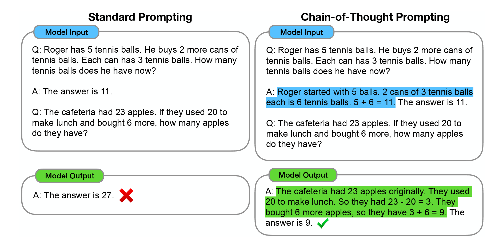
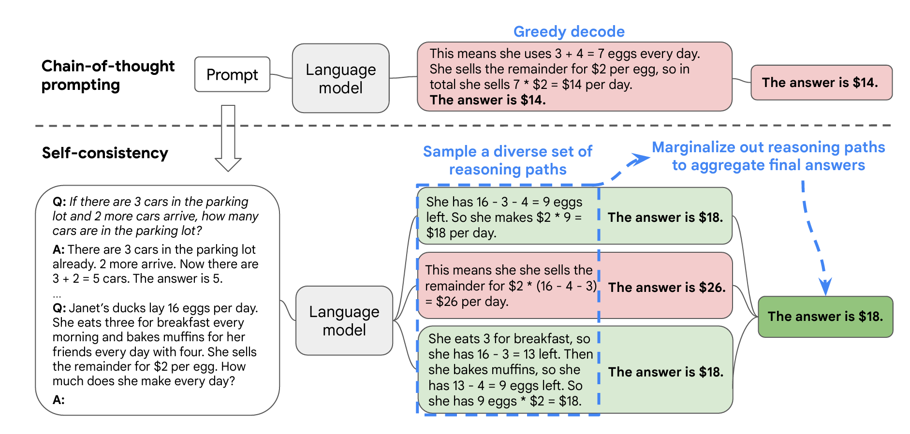
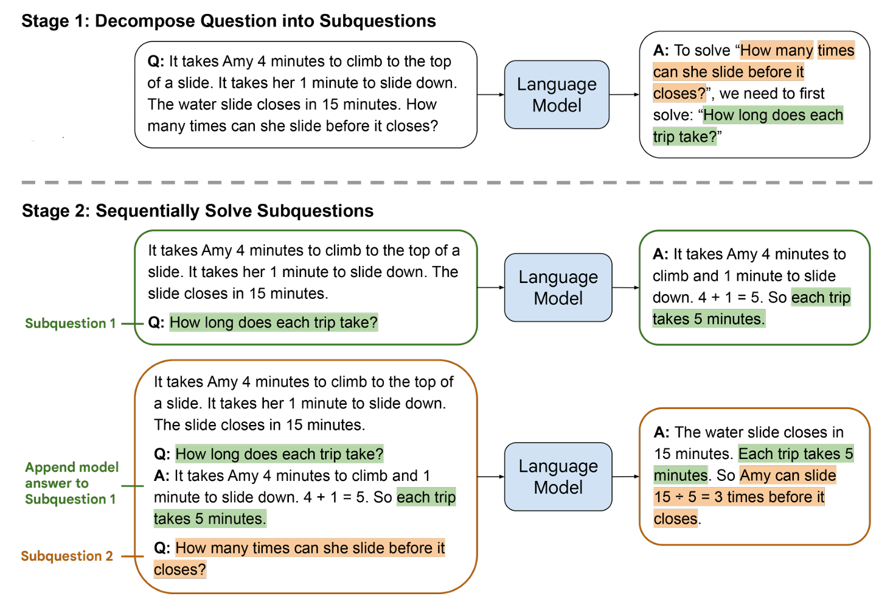

`Prompt Engineering 知识扫盲`
 
<!-- more -->

## 什么是Prompt Engineering?

Prompt (提示词) 是人类发给各种人工智能模型、用以完成特定任务的指令。

Prompt Engineering (提示词工程) 是指我们为了让LLM能够更好地完成我们给它的任务，我们对Prompt进行优化、调整的过程。

可能会有人这么问，LLM已经这么强了，直接丢给它个指令，让他去执行就好了，为什么还需要Prompt Engineering呢？

确实像OpenAI的GPT4这样的LLM已经非常强了，很多简单的任务，我们直接用自然语言丢给他就去执行就好了。但是，对于一些复杂的问题，Prompt写得好不好，直接影响着大模型给出答案的正确与否。

**本质上，LLM是一个概率模型，它只是在给定的信息的前提下，给出概率最大的结果，它并不保证结果的合理性和正确性**。

要让LLM给出的结果尽可能地合理、正确，这是我们使用LLM的人的职责。

这就是我们要去学习Prompt Engineering的原因。

## 如何写好Prompt?

### 要明确,要具体

我们发给LLM的批令，越明确、越具体，对于LLM越友好。

举个例子，我们让LLM对一段文字进行总结：

::: code-tabs
@tab Prompt 1
```json
请给我总结一下这段文字的要点: 要总结的文字
```
@tab Prompt 2
```json
Prompt 2: 你的任务是帮我总结给定文字的要点，总结的要点请按下面的格式输出，这里'###'是分隔符：
###
- {{要点1}}
- {{要点2}}
- …
- {{要点n}}
###
，每个要点不要超出20个字。这是要你总结的文字：
###
要总结的文字
###
```
:::

Prompt 2相比Prompt 1，对输出有了更加明确具体的要求，这样LLM输出的内容也会更加贴合我们的需求。另外，我们还用了'###'作为分隔符，进一步帮LLM明确要求。

**我们在给LLM发指令的时候，第一个关键点，就是我们要把给LLM做的任务尽可能细化，把要求尽可能明确、具体地描述出来**。

### 给LLM更多的时间去思考

《思考快与慢》这本书里介绍了我们人类大脑的“系统1”和“ 系统2”。

**系统1是快思考系统，反应很快，但可能会出错。**

**系统2是慢思考系统，需要更长的反应时间，进行思考、推理，但结果会更加靠谱。**

**默认情况下，LLM就像是一个快思考的系统，他利用自己已掌握的知识，快速给出答案，但并不能保证结果的正确性。**

**为了让LLM给出的答案更加靠谱，我们需要通过Prompt Engineering 的方式，把LLM的慢思考调动起来。**

这就是“给LLM更多的时间去思考”背后的大致逻辑。

给LLM更多的时间去思考，一个简单的技巧是在你的Prompt后面，加上这样一句话“Let’s think step by step”。这句话会引导LLM，会去分步骤思考，效果会比不加这句话要好。

另一个技巧，在Prompt中加入一些例子，让LLM照着例子进行推理、思考。这一块的技巧性很强，我们在接下来的部分，介绍几种具体的技巧。

#### 思维链技术：Chain-of-Thought

这是[《Chain-of-Thought Prompting Elicits Reasoning in Large Language Models》](https://arxiv.org/abs/2201.11903)这篇论文里讲的一个Prompt Engineering的技巧。

**CoT(Chain-of-Thought) 的核心思想是，在Prompt中加入一些示例，来引导LLM展现出更好的推理能力。**

这里的关键是在Prompt中加入的示例，在这些示例中，我们会用自然语言描述一系列的推理过程，并最终引导出示例问题的正确结果。

这个过程有点像，我们教小孩做应用题，我们先给小孩子分析讲解一些示例。然后再把新的问题让小孩子来解决。小孩子根据从示例中学习到的推理、分析能力，最终解出了新的问题。

下面我们来看论文中给的CoT的例子：



蓝色标记出的部分是提供给LLM的示例。绿色标记出的部分是LLM输出的推理过程。

在使用CoT这种Prompt Engineering技巧的时候，有几个注意点：

1. CoT是LLM足够大（参数足够多，通常是在1000亿参数）时才涌现出来的能力。因此，在一些不够大的LLM上，CoT的效果并不明显。

2. 通常，在Prompt中加入的示例不是1条，而是多条。具体要考虑解决的问题类型，以及Prompt的长度（因为LLM的Prompt长度通常都是有长度限制的）。

#### 自一致性技术：Self-Consistency

这是[《Self-Consistency Improves Chain of Thought Reasoning in Language Models》](https://arxiv.org/abs/2203.11171) 这篇论文里讲的另一个Prompt Engineering的技巧。

Self-Consistency技术是在CoT技术的基础之上，进行的进一步优化，目的是为了让LLM的推理能力能够更进一步提升。

Self-Consistency的大致原理是这样：

1. 利用CoT Prompting技巧，写好Prompt；

2. 不要让LLM只生成最合适的唯一一个结果，而是利用LLM结果的多样性，生成多种不同推理路径所得的结果的集合；

3. 从结果集合中投票选择，选出投票最多的结果，做为最终的答案。

这里有像我们人类解决问题的过程，如果我们用多种不同的方法去求解，大多数方法求解出来结果都一样的答案，那很有可能就是我们最终的答案。

下面我们来看论文中给的Self-Consistency的例子：



在上面的例子中，虚线之上是标准的CoT的过程，它得到的结果是错的。虚线之下是Self-Consistency的过程，得到的三个答案中，有1个是错的，有2个是正确的。最终答案是大多数投票的结果，是正确的。

#### 从易至难技术：Least-to-Most

这是[《Least-to-Most Prompting Enables Complex Reasoning in Large Language Models》](https://arxiv.org/abs/2205.10625) 这篇论文中介绍的方法。

**CoT的特点是同类型问题的迁移思考，因此，如果给的例子是比较简单的问题，而给的问题却是难度大很多的问题，这时候CoT的效果就不尽如人意。**

**LtM(Least-to-Most)主是为了解决CoT这种从易到难的迁移能力不足而诞生的。**

**LtM的核心思想是：教LLM把复杂问题，拆解成一系列的简单问题，通过解决这一系列的简单问题，来最终得到复杂问题的结果。**

LtM的过程包含两个阶段：

1. 分解阶段：把复杂问题分解成一系列的简单子问题。这个阶段的Prompt中要包含分解问题的示例，要和分解的问题；

2. 解决子问题阶段：这个阶段的Prompt中包含三部分内容：一是完整的LtM的例子；二是已解决的子问题及其答案列表；三是接下来要解答的子问题。

这里也非常像我们人类学习解决复杂问题的过程，我们通过把复杂问题拆解成一个个的简单问题，通过把一个个的简单问题解决掉，最终把复杂问题也解决了。

下面我们来看看论文中LtM的例子：



从上图中，我们可以对LtM Prompting有一个直观的认知，通过引导LLM解决子问题，一步步引导LLM得出复杂问题的结果。


