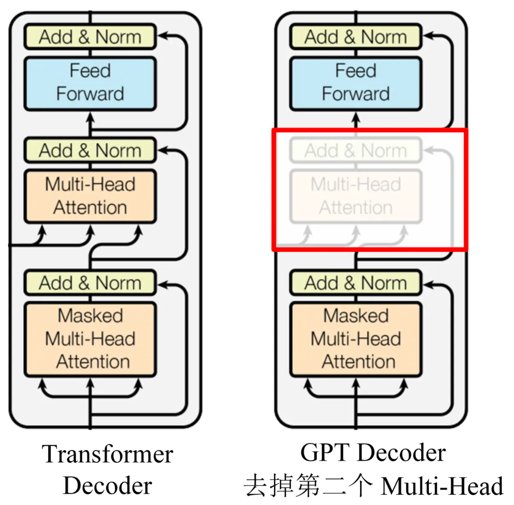
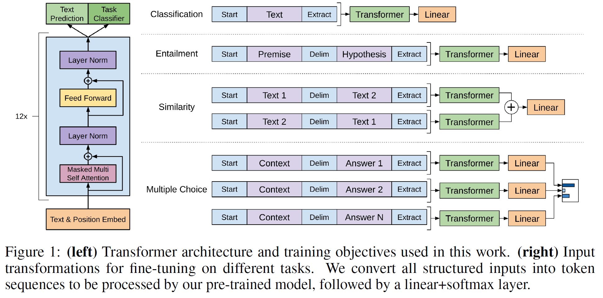
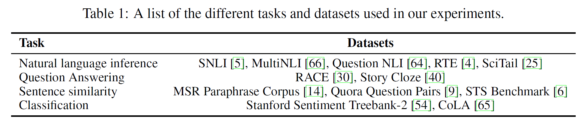
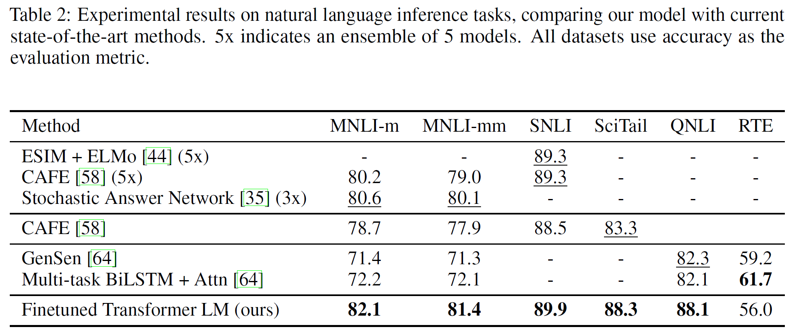
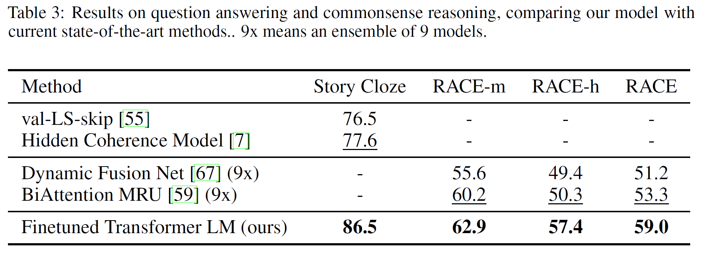
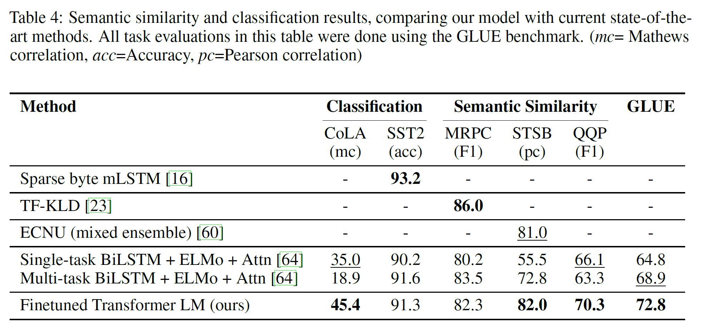
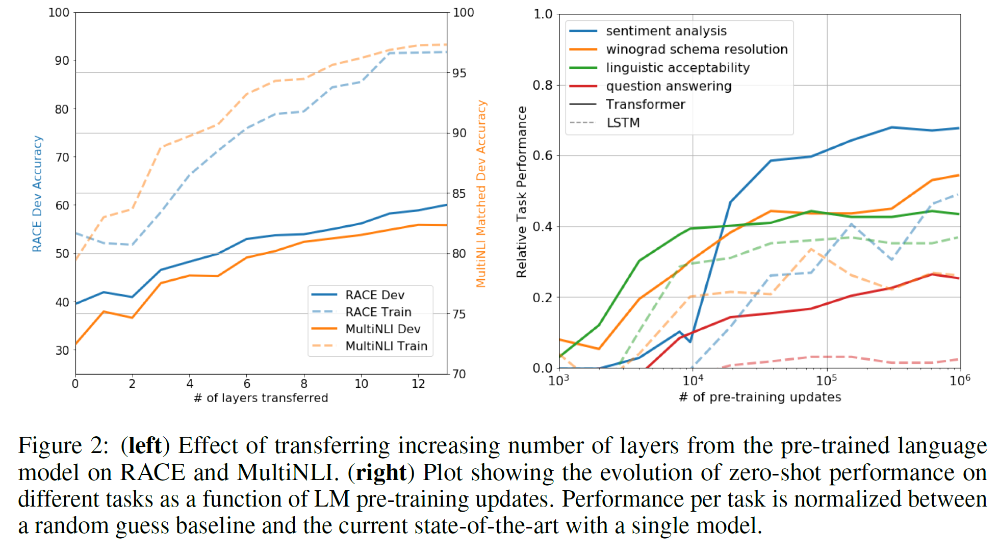
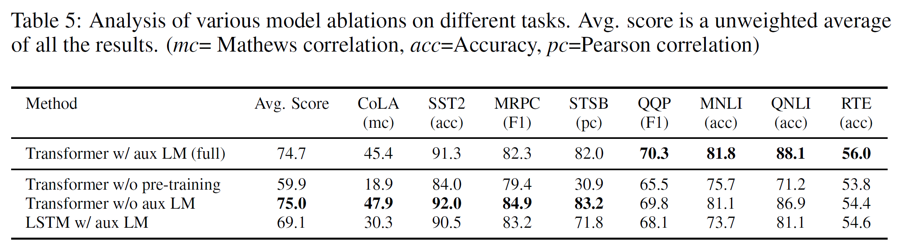

`GPT-1 论文`
 
<!-- more -->

> 论文: [https://cdn.openai.com/research-covers/language-unsupervised/language_understanding_paper.pdf](https://cdn.openai.com/research-covers/language-unsupervised/language_understanding_paper.pdf)

## 摘要

自然语言理解包含了广泛的多样性任务，比如文本蕴涵，问答，语义相似度评估，文本分离。然而**大规模的未标注的文本语料是丰富，而特定任务学习的标注数据有非常少**，使得要充分做区分地训练模型非常有挑战性。作者证明通过**在丰富的无标签文本语料库生成预训练generative pre-training语言模型，然后在每项具体任务上判别性微调discriminative fine-tuning，可以实现巨大的收益**。对比之前的方法，作者在微调阶段使用任务感知的输入转换来实现有效的迁移，仅仅需要小小修改模型架构。**通用的任务未知task-agnostic模型优于那些为每个任务精心设计的模型**，在12个研究任务中9个提升到SOTA。如，作者在常识推理(Stories Close Test)上提升8.9%， 在问答上提升5.7%(RACE)，文本蕴含提升1.5%(MultiNLI)。

## 简介  

在NLP中，有效地从无标记的原始文本中学习的能力能减轻对监督学习的依赖。大部分深度学习方法需要大量人工标注的数据，这限制了它们在许多缺乏标记数据领域的适用性。在这种情况下，模型能从无标记数据中充分利用语义信息，为收集更多的标注数据提供了更多一个有价值的替代方案，标注数据昂贵又耗时。进一步来说，即便是那些有大量标注数据的场景，无监督学习得到的好的表示也能提供显著的提升。最有说服力的证据就是到目前为止大量使用预训练的词嵌入来提升一系列NLP任务表现。

无论到什么程度，从无标注文本中充分利用词级别以外的信息是有挑战性的，有两个主要原因。

1. **不清楚在学习文本表示时，什么样的优化目标是最高效的迁移。近期研究考虑过各种各样的目标**，如语言模型，机翻，语句连贯性，每种方法在不同任务上都优于其它方法。

2. **对于将这些学习到的表征迁移到目标任务的最有效方法，目前还没有达成共识**。已有的技术涉及对模型架构进行特定任务的修改、使用复杂的学习方案以及添加辅助学习目标的组合。这些不确定性使得开发有效的语言处理半监督学习方法变得困难。

在本文中，作者用**无监督的预训练和监督的微调组合**来探索关于语言理解任务半监督方法。目标是**学习一个全局表示，迁移它来稍微适应一系列广泛的任务**。作者假设采用一个大型无标记文本语料库和几个人工标记训练样本的数据集(目标任务)。该设置不需要这些目标任务和无标记语料库是一个领域的。并采用两段式训练流程。**首先，在无标记数据上使用语言模型目标来学习神经网络初始化的参数。接着，使用对应特定任务的监督目标来调整这些参数。(预训练+微调)**

对于作者的模型架构，使用的是Transformer，它被证明在许多任务上有很强的表现，如机翻，文本生成，句法解析。该模型在文本上处理长期依赖提供了更结构化的内存，相比其他替代方案如RNN，Transformer跨各种各样任务的迁移性能更强。在迁移阶段，作者利用源于遍历式(traversal-style)方法的特定任务的输入改写，其将结构化文本输入处理为单一的连续字符序列。如作者在实验中证明的，这些改写使得在预训练模型架构上用最小的修改就会有效。

作者在四种类型的语言理解任务评估作者的方法——自然语言推断NLI，问答，语义相识度，和文本分类。作者通用的任务未知task-agnostic模型优于那些为每个任务精心设计的模型，在12个研究任务中9个提升到SOTA。

- 常识推理提升8.9%(Stories Cloze Test)

- 问答提升5.6%(RACE)

- 文本蕴含提升5.5%(MultiNLI)

- GLUE多任务提升5.5%.

也分析了在四种不同设置下预训练模型的零次(zero-shot)表现，证明其确实为下游任务获取到了有用的语言知识。

## 相关工作  

- **NLP半监督学习:** 预训练对于获取不同级别信息的需要，如从词级别信息到更高的(段落级别或者句子级别的)词嵌入。

- **无监督预训练:** 无监督预训练+监督微调方式，Transformer比LSTM能获取长距离信息。

- **辅助训练目标:** 添加一个无监督训练目标是半监督学习的一种替代形式。如POS tag，语义组块chuking, NER， 以及语言模型来提升标记的语义角色。

## 框架  

作者训练流程有两个阶段:

1. 在大规模文本语料上学习高容量的语言模型

2. 微调阶段，用标记的数据对特定任务微调模型

### 无监督预训练  

给定一个无监督学习的语料tokens $\mathcal{U} = \{u_1, u_2, \cdots, u_n\}$，使用标准的语言模型目标并最大化其似然：  

$$
L_1(\mathcal{U}) = \sum_i \log P(u_i | u_{i-k}, \cdots, u_{i-1}; \Theta) \tag{1}
$$  

这里 $k$ 是上下文窗口大小，条件概率 $P$ 是参数 $\Theta$ 的神经网络模型。这些参数会以随机梯度下降训练。  

在作者的实验中，语言模型使用**多层的 Transformer decoder**（Transformer 的变种 ）。该模型在上下文 token 上使用**多头自注意力操作**，接一个**逐位置的前馈层**来生成目标字符的分布输出（比原本少了一个多头自注意力 ）：

公式如下：  

$$
\begin{align}
h_0 &= UW_e + W_p
\end{align}
$$  

$$
\begin{align}
h_l &= \text{transformer\_block}(h_{l-1}) \quad \forall i \in [1, n]
\end{align}
$$  

$$
\begin{align}
P(u) &= \text{softmax}\left(h_n W_e^T\right) \tag{2}
\end{align}
$$  

这里 $U = (u_{-k}, \cdots, u_{-1})$ 是上下文字符向量，$n$ 是层数，$W_e$ 是字符嵌入矩阵，$W_p$ 是位置嵌入矩阵。  

### 有监督微调  

在训练公式 （ 1 ） 中的目标函数模型后，作者在监督学习目标任务上调整参数。假设有标记数据集 $\mathcal{C}$，每个实例有输入字符的序列构成 $x^1, \cdots, x^m$，对应着标签 $y$。输入通过作者的预训练模型会得到最好的 transformer block 的激活状态 $h_l^m$，将其喂进一个参数为 $W_y$ 的添加的线性输出层来预测 $y$ 有：  

$$
P(y | x^1, \cdots, x^m) = \text{softmax}\left(h_l^m W_y\right) \tag{3}
$$  

给出最大化的目标函数为：  

$$
L(\mathcal{C}) = \sum_{(x,y)} \log P(y | x^1, \cdots, x^m) \tag{4}
$$  

作者还发现加入语言模型作为辅助目标来微调有助于学习：(a) 提升监督模型的泛化能力；(b) 加速收敛。这跟之前的工作一样，观测发现用辅助目标能提升性能。尤其是，作者用以下优化（加权 $\lambda$）目标：  

$$
L_3(\mathcal{C}) = L_2(\mathcal{C}) + \lambda * L_1(\lambda) \tag{5}
$$

总之，作者额外要微调的参数只有 $W_y$，以及分割字符嵌入矩阵。  

### 特定任务输入转换  

- **文本分类**：直接微调模型  

- **问答或文本蕴含**：输入是结构化的，如有序句子对，三元组（文档，问题和答案）  

因为作者的预训练模型是用连续的文本序列训练的，需要做些修改以便用在这些任务上。之前的工作提出了在迁移表征顶部学习特定任务的架构。这种方法重新引入了大量特定任务的定制化输入，并且不会对额外的架构组件使用迁移学习。相反，作者使用遍历式方法，就是将结构化输入转换为有序序列以便作者预训练能处理。这些输入转换使作者避免跨任务架构的大改。作者在下面部分和可视化插图 1 提供了这些输入的简洁描述。所有的转换包括添加随机初初始化的开始和结束标记 $(<s>, <e>)$。

- **文本蕴含**：拼接前提文本 $p$ 和假设 $h$ 为 token 序列，用 `$` 符来分隔两者。  

- **相似度**：对于相似任务，两个比较的句子没有内在顺序。为了反映这点，作者修改输入序列来包含 2 种可能的顺序（用分隔符分隔），并独立地处理 2 个序列表示 $h_l^m$，逐元素相加然后送入线性输出层。  

- **问答和常识推理**：对于这些任务，给定文档 $z$，一个问题 $q$ 和一个可能答案集 $\{a_k\}$。将文档和问题跟每个可能答案拼接起来，再在其中添加一个分隔符得到 $[z; q; \$; a_k]$。每个这些序列用作者的模型独立处理后通过一个 softmax 层归一化来生成所有可能答案的分布。  

## 实验  

### 设置  

- **无监督预训练**：BOOKS CORPUS 数据集预训练模型。长文本能让生成模型学习到长依赖信息的条件概率。ELMO 方法处理 1B Word benchmarks，在句子级别打乱顺序以破坏长距离结构信息，达到非常低的 18.4 困惑度。

模型的具体配置:

- **Transformer 架构**：12 层有自注意力头（768 维隐藏层，12 个注意力头）transformer decoder 结构。  

- **逐位置前馈神经网络（position-wise feed-forward networks）**：3072 维内部隐藏层。  

- **Adam 优化器方案**：最大 lr=2.5e-4。开始 2000 次从 0 线性上升更新，再使用 cosine 方案退火到 0。  

- **采样与训练**：从 512 连续 tokens 中随机采样得到 64 小批次样本，训练 100 轮。  

- **层归一化**：改进版的 layerNorm，以 $\mathcal{N}(0, 0.02)$ 权重初始化。  

- **词汇表与正则化**：40,000 合并的 BPE 词汇表，残差，嵌入和注意力层以 0.1 的 Dropout 来正则化。  

- **[改进版 L2 正则](https://arxiv.org/pdf/1711.05101.pdf)**：所有无偏差或增益权重设置为 $w = 0.01$。  

- **激活函数**：GELU 作为激活函数。  

- **位置嵌入**：使用学习的位置嵌入，而不是原始 Transformer 的正余弦曲线。  

- **数据清洗与分词**：使用 ftfy 清洗原始 BooksCorpus，去掉字符和空格，再使用 spaCy tokenize。  

**微调的细节:**

除非指定，使用无监督预训练超参数设置。分类层使用 0.1 的 Dropout。大部分任务，lr=6.25e-5，批大小为 32。在大部分任务中基本上 3 轮训练就足够了。lr 用以训练步数的 0.2% 预热衰减方案。$\lambda$ 设置为 0.5。

### 监督微调

微调任务和数据集如下：

**NLI** 就是识别文本蕴含。涉及读取一对句子，判断它们之间的关系，是蕴含，矛盾或中立。因为存在各种变化现象，如词汇蕴含，共指，词汇和句法歧义，所以还是很有挑战性的。

下表2是作者模型和之前SOTA模型NLI的结果比较：

RTE数据集比较小，只有2490样本，只达到了56.0%准确率。

**问答和常识推理** 结果如下表3，RACE数据集由初高中考试题构成。在Story Cloze和RACE提升明显。证明**模型具有有效处理上下文长距离的信息的能力**。

**语义相似度** 语义相似度(或释义发现)任务涉及预测两个句子在语义上是否相等。挑战在于识别语句是否是概念改写，理解反面，处理句法歧义。使用的数据集：

1. MRPC Microsoft Research Paraphrase corpus 是一些句子对，有的是同义的，有的是不同义的。

2. QQP Quora Question Pairs 美国知识问答网站 Quora 上的问题答案数据集

3. STS-B Semantic Textual similarity benchmark 语义文本相似度数据集，样本为文本对，评判两个文本语义信息的相似度，分数为1-5。

在STS-B上有1个点的绝对提升，比Single-task BiLSTM + ELMo + Attn有4.2%的绝对提升。

**分类** 两个不同分类任务的评估结果，也在上表4中。CoLA——Corpus of Linguistic Acceptability语言可接受性语料库，纽约大学发布的有关语法的数据集，该任务主要是对一个给定句子，判定其是否语法正确，因此CoLA属于单个句子的文本二分类任务。

SST-2——The Stanford Sentiment Treebank, 主要针对电影评论来做情感分类，因此SST属于单个句子的文本分类任务（其中SST-2是二分类，SST-5是五分类，SST-5的情感极性区分的更细致)。

CoLA上取得45.4，SST-2取得91.3的准确率，整体得分72.8。

总体而言，在12个数据集上的9个取得SOTA结果，比许多情况下的ensemble模型要好。而且能适应不同大小数据集。

## 分析

**层数的迁移学习影响:** 从预训练到微调迁移学习过程中，如下表2，在MultiNLI和RACE上的性能随着层数的变化而变化。作者观察标准结果，在MultiNLI上转移embedding能提升结果，每一层Transformer层能带来9%额外的提升。这表明预训练模型中的每一层都包含了解决目标问题有用的功能。

**零样本表现** 最好要弄清楚为什么预训练模型会有效？一种假设是，与LSTMs相比，潜在生成式模型（underlying generative model）在应用到很多任务时可以提高语言建模的能力并且transformer更具结构化的注意力记忆（attentional memory）有助于迁移。在零样本上，LSTM表现高方差，表明在迁移中，Transformer架构导入偏差是有帮助的。

1. 对于CoLA（语言可接受性），样本的得分是用生成模型分配的tokens的平均对数概率，在阈值下进行预测的。

2. 对于SST-2(情感分析)，给每个实例样本加一个 very token,来限制语言模型的输出分布只有 positive和 nagative, 就是猜测被分配到高的概率值的token作为预测值。

3. 对于RACE(问答)，在文档和问题给定条件下，将生成模型分配的平均对数概率高的token作为答案。

4. 对于DPRD(威诺格拉德模式), 用两个可能的替换说法来代替定义的代词，在这之后用生成模型分配的剩下序列的平均token对数概率高的作为结果。

**消融研究** 不同的消融研究如下表5.

首先，作者在微调时用辅助的LM目标来检查作者模型的性能。在NLI和QQP任务上辅助LM目标有帮助。总之，就是大数据集有效，小数据集没有。

其次，分析比较2048单元的单层LSTM和Transformer，二者都加同样的辅助LM，LSTM会掉5.6平均分数。

最后，直接在监督学习任务上训练，不要预训练，这会导致在跨任务上性能降低14.8%.

## 结论

作者介绍了一种框架，用任务未知的生成式预训练模型和判别式微调在自然语言理解上取得了很强的效果。通过在长篇连续文本的多样化语料库上预训练，作者模型获得了重要的世界知识和处理长距离依赖的能力，然后能成功迁移学习解决判别式任务，如问答，语义相似度评估，蕴含确定和文本分类，在12个的9个数据集取得了SOTA结果。

使用无监督预训练来提升在判别式任务上的表现是机器学习研究的长期目标。作者的工作表明，实现显著的性能提升确实是可能的，并给出了提示Transformer类模型和长距离依赖的文本数据集最好用这种方法来训练。