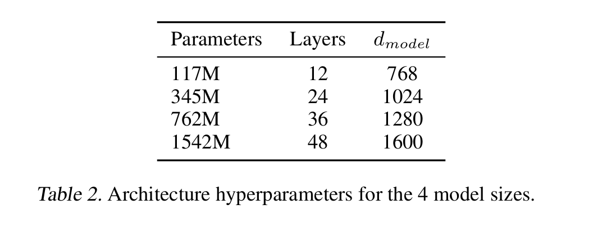
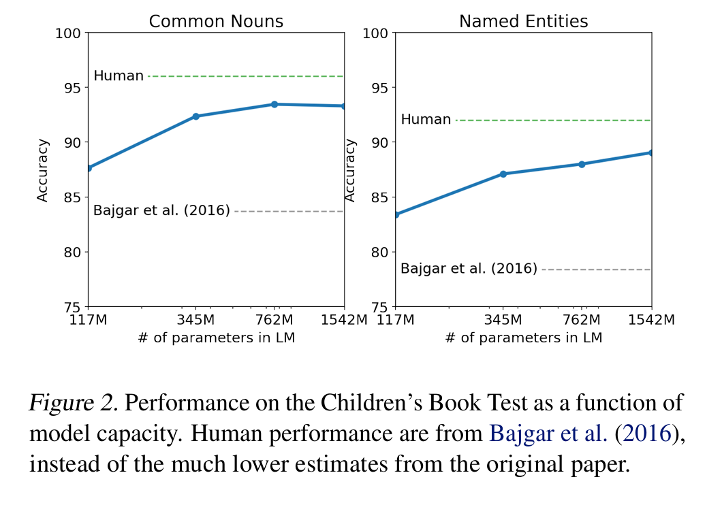
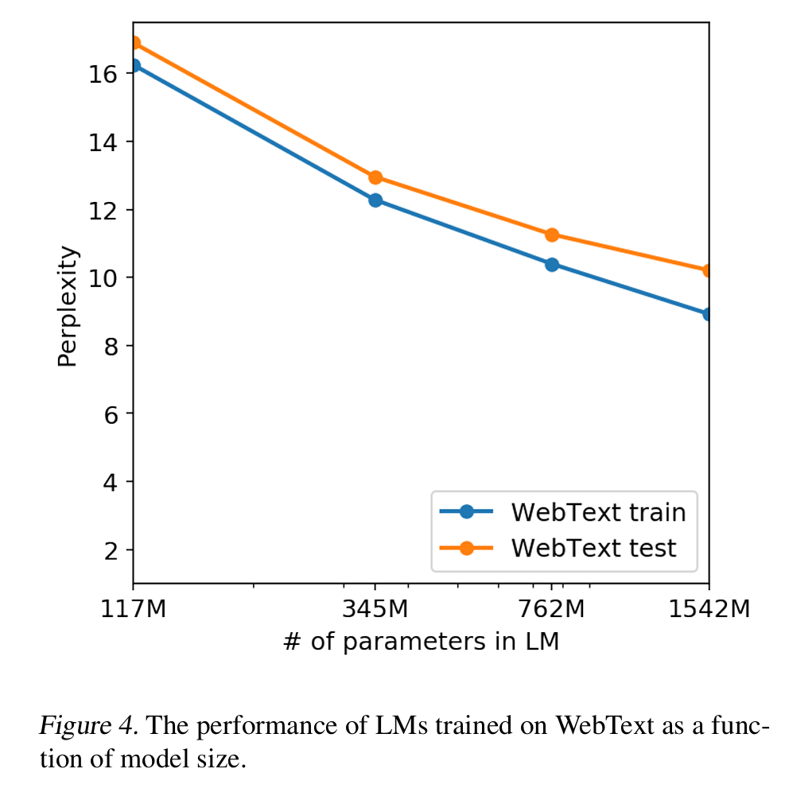
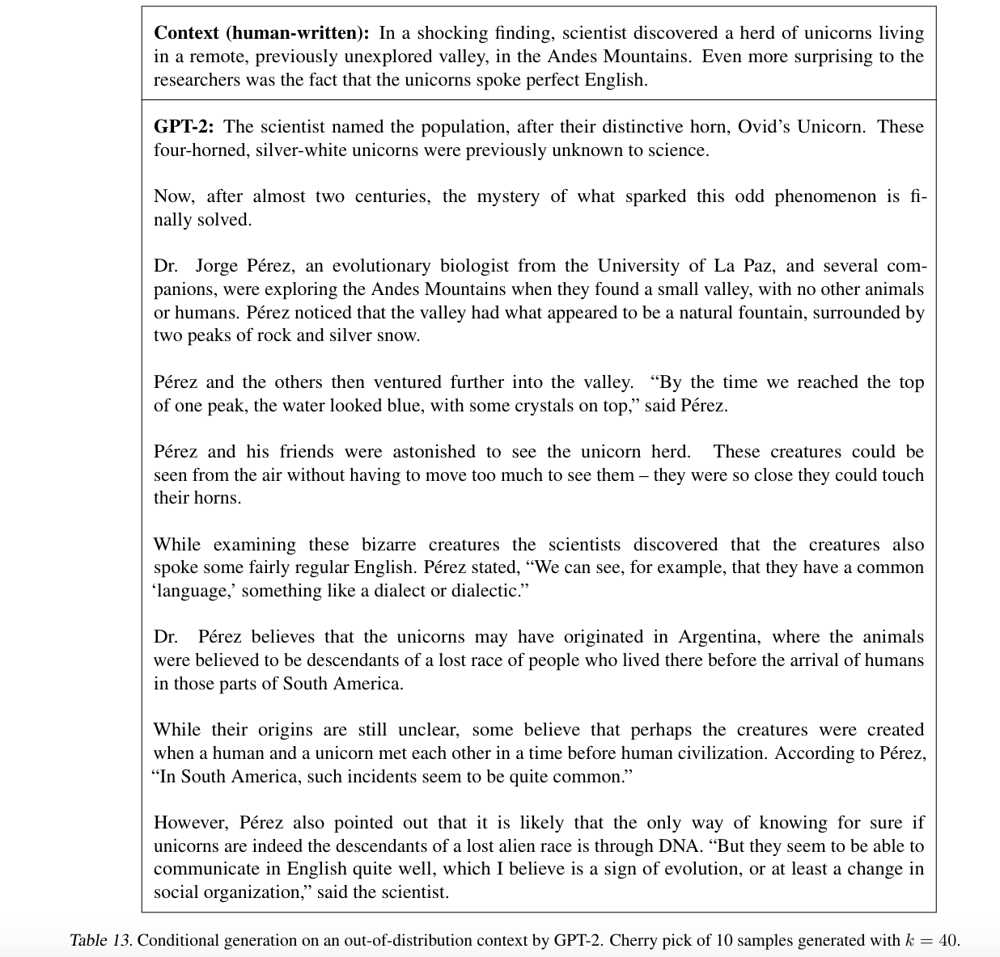

`GPT-2 论文`
 
<!-- more -->

> 论文链接: [Language Models are Unsupervised Multitask Learners](https://cdn.openai.com/better-language-models/language_models_are_unsupervised_multitask_learners.pdf)

## 摘要

这篇论文《Language Models are Unsupervised Multitask Learners》由OpenAI团队提出，介绍了GPT-2模型，展示了大规模语言模型在无监督多任务学习中的潜力。GPT-2通过训练一个包含45百万网页链接的WebText数据集，**能够在零样本（zero-shot）设置下完成多种自然语言处理任务**，如问答、翻译、摘要和阅读理解等，**无需任务特定的监督训练**。研究发现，**模型容量对任务性能至关重要，更大的模型在多个基准测试中达到了最先进水平**。论文还探讨了模型泛化与记忆的关系，并指出GPT-2在生成连贯文本方面的能力，为构建通用语言处理系统提供了新思路。

## 简介

1. **当前机器学习系统的局限性**  

当前的机器学习系统虽然在特定任务上表现出色，但依赖于大量标注数据和监督学习，导致其泛化能力有限。这些系统往往对数据分布或任务定义的微小变化非常敏感，表现为“狭窄的专家”而非通用的多任务处理者。作者指出，这种局限性部分源于单任务、单领域的数据集训练模式，限制了模型在多样化场景中的应用能力。  

---

2. **多任务学习的挑战与机遇**  

多任务学习（Multitask Learning）被视为提升模型通用性的潜在途径，但其在自然语言处理（NLP）领域的进展仍处于早期阶段。现有研究通常仅联合训练少量任务（如10-17个任务），而机器学习系统通常需要数百至数千个任务示例才能实现良好的泛化。作者认为，单纯依赖人工标注和设计任务目标难以满足多任务学习的规模化需求，因此需要探索更高效的学习范式。  

---

3. **预训练与迁移学习的趋势**  

近年来，预训练结合监督微调的方法在NLP任务中表现突出。从早期的词向量（如Word2Vec）到上下文感知的循环神经网络（如ELMo），再到基于自注意力机制的Transformer架构（如BERT、GPT），模型的迁移能力逐渐增强。然而，这些方法仍依赖监督数据。作者提出，语言模型本身可能通过无监督学习捕捉任务相关的知识，从而减少对显式监督的依赖。  

---

4. **论文的核心假设与目标**  

本文的核心假设是：**足够大的语言模型在多样化文本训练下，能够通过预测任务的自然语言描述（如问答、翻译的文本示例）间接学习任务，而无需参数调整或架构修改**。作者通过实验验证这一假设，证明GPT-2在零样本设置下能完成多种任务，部分任务性能接近或超越监督基线模型。这一发现为构建通用语言系统提供了新方向，同时揭示了模型容量与任务性能之间的紧密关联。  

---

5. **研究意义**  

论文强调，无监督任务学习是预训练技术成功的关键因素之一。尽管零样本性能尚不完美，但结果表明语言模型在无监督条件下已具备初步的多任务处理能力，为未来探索更通用的AI系统奠定了基础。

## 方法

**1. 语言建模的核心框架**  

论文的核心方法是基于**语言建模（Language Modeling, LM）**，即通过无监督学习估计文本序列的概率分布。给定一个符号序列 \((s_1, s_2, ..., s_n)\)，语言模型通过链式法则计算联合概率：  

$$
p(x) = \prod_{i=1}^{n} p(s_i | s_1, ..., s_{i-1})
$$  

这一框架允许模型不仅生成文本，还能计算任意条件概率，例如预测缺失的单词或句子。近年来，**Transformer** 架构（Vaswani et al., 2017）的引入显著提升了语言模型的表达能力，使其能够建模长距离依赖关系。  

---

**2. 多任务学习的概率视角**  

传统监督学习通常建模 $p(output|input)$，而通用系统需要能够根据任务描述动态调整行为，即建模 $p(output|input, task)$。作者指出，McCann et al. (2018) 的**MQAN（Multi-task Question Answering Network）** 已经证明，任务可以通过自然语言描述（如“translate to French, English text, French text”）来指定。本文进一步假设，**语言模型本身可以通过观察任务的自然语言演示（如问答对、翻译示例）来隐式学习任务，而无需显式监督**。  

---

**3. 训练数据集：WebText**  

为了训练一个能够泛化到多种任务的语言模型，论文构建了一个新的数据集 **WebText**，其关键特点是：  

- **数据来源**：从 Reddit 上爬取高赞（≥3 karma）的外链网页，确保内容经过人工筛选，质量高于 Common Crawl 等原始网络数据。  

- **规模与处理**：初步版本包含约800万篇文档（40GB文本），去重并移除了 Wikipedia 数据以避免测试集污染。  

- **多样性目标**：涵盖广泛的主题和写作风格，以增加模型接触不同任务（如翻译、摘要）自然演示的机会。  

---

**4. 输入表示：改进的字节对编码（BPE）**  

传统语言模型通常依赖单词或字符级输入，但存在词汇表限制或效率问题。本文采用**字节级 BPE（Byte Pair Encoding）**，其优势包括：  

- **词汇表灵活性**：基础词汇仅需256个字节，可表示任意 Unicode 字符串，避免传统 BPE 对 Unicode 编码的冗余扩展（如130,000+基词）。  

- **改进的合并策略**：防止跨字符类别的合并（如“dog”与“dog!”被分开），减少词汇碎片化，同时允许空格合并以提高压缩效率。  

- **兼容性**：支持对任何文本（无论预处理方式）直接计算概率，便于跨数据集评估。  

---

**5. 模型架构：GPT-2 的改进**  

GPT-2 基于 **Transformer** 架构，延续了 GPT-1（Radford et al., 2018）的设计，但进行了以下优化：  

- **层归一化调整**：移至每个子模块的输入（类似预激活残差网络），并在最终自注意力块后增加额外层归一化。  

- **初始化优化**：残差层权重按 $1/\sqrt{N}$ 缩放（$N$ 为残差层数），缓解深层网络的梯度问题。  

- **扩展配置**：词汇表增至50,257，上下文窗口从512扩展到1024 tokens，批大小提升至512。  

---

**6. 实验设置与模型规模**  

论文训练了 **4种不同规模的模型**（参数从117M到1.5B），以研究模型容量对性能的影响：  

- 最小模型（117M）与原始 GPT 相当，中等模型（345M）匹配 BERT-Large，最大模型 **GPT-2（1.5B）** 参数量远超 GPT-1。  

- 所有模型在 WebText 上仍表现欠拟合（held-out perplexity 持续下降），表明进一步扩大数据或模型可能提升性能。  

---

**7. 任务执行的零样本机制**  

GPT-2 的零样本能力依赖于**任务提示（Task Prompting）**，即通过自然语言描述或示例引导模型生成目标输出。例如：  

- **翻译任务**：输入“english sentence = french sentence”示例后，模型在“english sentence =”提示下生成翻译。  

- **摘要任务**：在文章末尾添加“TL;DR:”触发摘要生成。  

- **问答任务**：输入文档+对话历史+“A:”引导答案生成。  

<mark>**这种方法无需微调，完全依赖语言模型对任务上下文的理解能力**。</mark>

---

**总结**  
 
1. **无监督多任务学习的可行性证明**：语言模型通过预测多样化文本中的任务演示（如翻译对、问答），隐式学习任务逻辑。  

2. **数据与架构创新**：WebText 的高质量数据、字节级 BPE 的通用性，以及 GPT-2 的规模化改进，共同支撑了零样本泛化能力。  

3. **任务提示的关键作用**：自然语言指令可作为隐式任务描述，激活模型的相关能力。  

这些设计使 GPT-2 成为首个在零样本设置下接近监督模型性能的大规模语言模型，为后续研究（如 GPT-3 的少样本学习）奠定了基础。

## 实验

**1. 实验设计与模型配置**

论文系统评估了不同规模的GPT-2模型（117M、345M、762M和1.5B参数）在多个NLP任务上的零样本（zero-shot）性能。所有模型均采用相同的架构，但层数、隐藏层维度和参数量不同（见表2）。实验的关键发现是：**模型容量与任务性能呈对数线性关系**，更大的模型在几乎所有任务上都显著优于小模型。作者特别指出，即使是最大的1.5B模型，在WebText验证集上仍未完全收敛（underfitting），表明进一步扩大模型和数据规模可能带来额外提升。

---

**2. 语言建模任务评估**

GPT-2在8个标准语言建模数据集上进行了测试，包括Penn Treebank（PTB）、WikiText-2、LAMBADA等。结果显示：

- **跨领域泛化能力**：GPT-2在7/8的数据集上刷新了零样本SOTA，特别是在小数据集（如PTB）和长程依赖任务（如LAMBADA）上提升显著。

- **预处理的影响**：由于GPT-2使用字节级BPE，可以避免传统tokenization的损失。通过可逆去token化（invertible detokenizers）处理，GPT-2的困惑度（perplexity）进一步降低了2.5-5点。

- **例外情况**：在One Billion Word Benchmark（1BW）上表现较差，作者归因于该数据集的句子级打乱破坏了长程依赖。

---

**3. 具体任务表现分析**

**3.1 Children's Book Test（CBT）**

CBT测试模型对不同词类（命名实体、名词等）的预测能力。GPT-2在验证集（避免与WebText重叠）上达到：

- 常见名词准确率93.3%（原SOTA 85.7%）

- 命名实体准确率89.1%（原SOTA 82.3%）

分析表明，**模型容量增加直接缩小了与人类表现的差距**（图2）。

---

**3.2 LAMBADA**

该任务要求预测句子的最后一个词，需要至少50个token的上下文理解。GPT-2将：

- 困惑度从99.8降至8.6

- 准确率从19%提升至52.66%

通过添加停用词过滤器（避免生成非结尾词），准确率进一步提升至63.24%，超过此前需依赖上下文词约束的SOTA方法。

---

**3.3 Winograd Schema Challenge**

测试常识推理能力（共273个样例）。GPT-2以70.7%的准确率超越前SOTA（Trinh & Le, 2018）7个百分点。作者指出，尽管数据集小，但结果与人类表现（约95%）的差距已显著缩小。

---

**3.4 阅读理解（CoQA）**

在对话式问答数据集上，GPT-2仅通过文档+历史对话+“A:”提示生成答案，达到55 F1：

- 匹配或超过3/4监督基线的性能

- 但远低于人类（89 F1）和BERT SOTA

错误分析显示，模型倾向于使用简单的检索启发式（如用文档中的人名回答"who"问题）。

---

**3.5 摘要生成（CNN/Daily Mail）**

通过“TL;DR:”提示+Top-k采样（k=2）生成摘要：

- ROUGE分数仅略高于随机选句基线

- 但定性分析显示生成内容类似摘要, 移除提示后性能下降6.4点，证明自然语言指令可激活任务特定行为。

---

**3.6 翻译（WMT-14）**

尽管WebText几乎无平行语料，GPT-2通过示例提示：

- 英→法：5 BLEU（低于词对齐基线）

- 法→英：11.5 BLEU（超过部分无监督方法）

作者推测英语语言模型的强大概率补偿了翻译知识的不足。

---

**3.7 问答（Natural Questions）**

在事实型问答测试中：

- 精确匹配准确率4.1%（远低于监督系统30-50%）

- 但对高置信度预测（top 1%），准确率达63.1%

表明模型容量是限制因素（最小模型仅1.0%准确率）。

---

**4. 记忆与泛化分析**

**4.1 数据重叠检测**

使用Bloom过滤器统计测试集与WebText的8-gram重叠率：

- 平均重叠率3.2%（与常规训练-测试重叠率5.9%相比更低）

- 极端案例：WikiText-103测试集1.6%重叠（因文章复用段落）

- 对性能影响：LAMBADA去除重叠样本后，困惑度仅从8.6→8.7

**4.2 训练集与测试集性能对比**

图4显示，WebText训练集和测试集的困惑度同步下降，表明：

- 即使1.5B模型仍欠拟合

- 性能提升非源于记忆，而是真实泛化能力

**4.3 生成样本分析**

表13展示GPT-2在非分布数据（如“独角兽新闻”）上的生成能力：

- 能生成连贯但虚构的内容

- 证实模型并非简单记忆，而是组合学到的知识

---

**5. 实验结论**

1. **规模定律**：模型容量与零样本性能强相关，1.5B参数模型在多数任务上逼近或超越监督基线。

2. **任务通用性**：单一语言模型可处理翻译、问答、摘要等多样化任务，仅需自然语言提示。

3. **数据质量**：WebText的多样性和规模是关键，但数据重叠对结果影响有限。

4. **局限性**：摘要、翻译等任务表现仍远逊于专业系统，显示无监督学习的当前边界。

这些实验为后续研究（如GPT-3的少样本学习）提供了重要基准，证明无监督预训练在多任务迁移中的巨大潜力。

## 讨论

无监督任务学习作为预训练技术成功的关键因素。研究表明，<mark>**当语言模型在足够多样化的文本数据上训练时，能够通过预测任务的自然语言演示（如翻译对、问答示例）隐式学习任务逻辑，而无需显式监督**</mark>。这一发现为理解当前预训练模型的有效性提供了新视角，并表明在**极限情况下，语言模型可能直接学会执行任务**。

作者同时指出GPT-2的局限性：虽然在阅读理解等任务上接近监督基线，但在摘要、翻译等任务上的表现仍远未达到实用水平。这种性能差异揭示了当前方法的边界，**表明模型容量和训练数据规模仍需进一步扩大**。特别值得注意的是，**GPT-2的完全抽象式输出（如问答时生成而非抽取答案）与传统指针网络方法形成鲜明对比，这为未来探索更灵活的文本生成方式提供了启示**。

未来研究方向，包括探索GPT-2的微调潜力（如在GLUE等基准上的表现），以及研究双向表示（如BERT）与单向语言模型的互补性。这些发现为后续GPT-3等更大规模模型的开发奠定了基础，推动学界重新思考语言模型在多任务学习中的角色。

## 总结

本文通过GPT-2模型证明了大规模语言模型在无监督多任务学习中的强大潜力。**当模型在足够大且多样化的文本数据（WebText）上训练时，仅通过语言建模目标就能在零样本设置下完成多种NLP任务，并在7/8的语言建模基准上达到SOTA水平**。这一发现表明，**高容量模型通过最大化文本序列的似然估计，可以自发地学习执行任务，而无需明确的监督信号**。

研究结果对构建通用语言系统具有重要意义：**首先，它验证了单一模型架构通过规模扩展即可实现多任务处理的可能性；其次，展示了自然语言本身作为任务描述符的有效性。尽管当前零样本性能仍有限，但这一方向为减少对人工标注数据的依赖提供了新思路。**

最后，论文指出这仅是通向更通用AI系统的初步探索。作者开放了模型代码和小型预训练模型，鼓励后续研究继续探索更大规模语言模型的行为边界，以及如何更好地利用其隐含学习到的多任务能力。这项工作为后续GPT系列模型的发展奠定了理论基础和方法框架。

