`GPT-3 论文`
 
<!-- more -->

> 论文链接: [Language Models are Few-Shot Learners](https://arxiv.org/abs/2005.14165)

## 摘要

这篇论文介绍了GPT-3，一个具有1750亿参数的自回归语言模型，通过大规模训练显著提升了少样本学习能力。GPT-3在多种自然语言处理任务中表现出色，包括翻译、问答和文本生成等，甚至在零样本和单样本设置下也能取得有竞争力的结果。研究还探讨了数据污染问题、模型局限性及其社会影响，如偏见和能源消耗。实验表明，模型规模的扩大带来了性能的持续提升，但某些任务仍存在挑战。论文强调了GPT-3在通用语言系统发展中的潜力及其可能带来的广泛社会影响。

## 简介

**1. 背景与动机**  

近年来，自然语言处理（NLP）领域逐渐转向预训练语言模型，并采用更灵活的任务无关（task-agnostic）方法进行下游迁移学习。早期的模型（如词向量、RNN）依赖任务特定的架构，而现代模型（如Transformer）可直接微调，无需额外架构调整。然而，现有方法仍需要针对每个任务进行大规模监督数据微调，这限制了模型的广泛应用。相比之下，人类仅需少量示例或简单指令即可完成新任务，因此**论文探索如何让语言模型具备类似的少样本学习能力**。  

---

**2. 现有方法的局限性**  

当前基于微调的方法存在三个主要问题：  

1. **数据需求高**：每个任务需要数千至数十万标注样本，难以覆盖广泛的语言任务。  

2. **泛化能力有限**：模型容易过拟合训练数据的虚假相关性（spurious correlations），导致在分布外数据上表现不佳。  

3. **与人类学习方式不匹配**：人类可通过少量示例或自然语言指令快速适应新任务，而现有模型难以实现类似能力。  

---

**3. 元学习与上下文学习的潜力**  

论文提出通过**元学习** (meta-learning) 提升模型的少样本学习能力，即**在预训练阶段让模型隐式学习多种技能，并在推理时通过上下文（in-context learning）快速适应新任务**。此前的研究（如GPT-2）已初步验证了上下文学习的可行性，但性能远低于微调方法。论文假设，**模型规模的扩大可能显著提升上下文学习能力**，因为更大容量的模型能吸收更多任务相关的模式。  

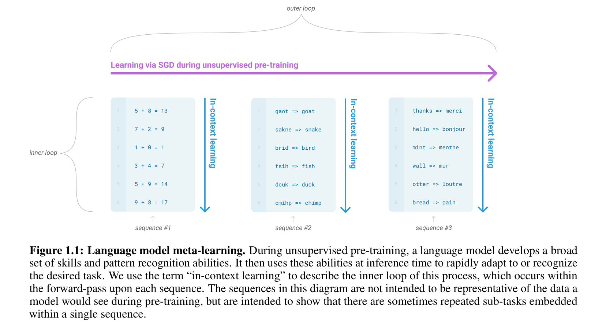

 

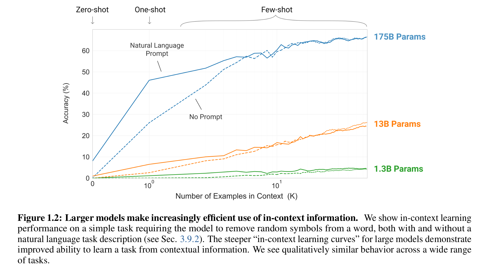
---

**4. GPT-3 的目标与贡献**  

论文训练了**GPT-3**（1750亿参数），比此前最大的非稀疏语言模型大10倍，并系统评估其在零样本（zero-shot）、单样本（one-shot）和少样本（few-shot）设置下的表现。实验覆盖了翻译、问答、常识推理等多样化任务，结果显示：  
- 在少样本设置下，GPT-3 接近或超越部分任务的微调模型性能。  
- 模型规模与少样本学习能力呈正相关，表明缩放定律（scaling laws）在此类任务中依然适用。  
- 同时，论文也分析了模型在自然语言推理（NLI）等任务上的局限性，并探讨了数据污染和社会影响等问题。  

 

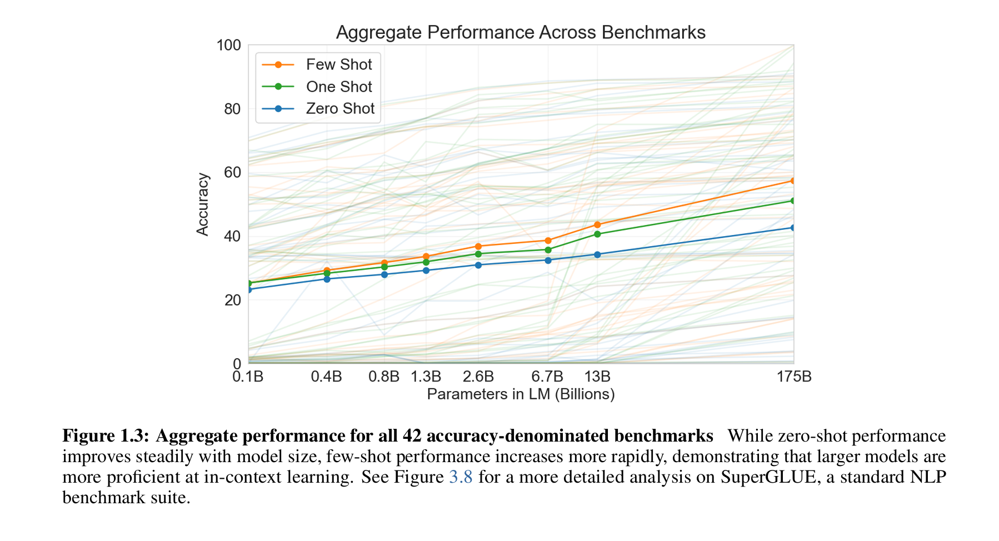

 

---

**5. 研究意义**  

GPT-3 的成果表明，**超大规模语言模型可以显著减少对任务特定数据的需求**，推动更通用、灵活的语言系统发展。然而，其局限性（如计算成本、偏见问题）也提示了未来改进方向，如结合双向架构或多模态训练。论文最终强调，这一研究为探索语言模型的元学习机制和实际应用奠定了基础。

## 方法

**1. 四种任务设定方法的比较**

作者首先定义了语言模型执行任务的四种方式：

* **Fine-tuning（微调）**：在任务特定数据集上更新模型权重，通常需要数千到数十万个标注样本，性能最佳，但泛化能力弱，且每个任务都需新数据。

* **Few-shot learning（少样本学习）**：在推理时为模型提供10-100个任务示例作为上下文，无需参数更新，显著减少数据需求。

* **One-shot learning（单样本学习）**：提供一条示例和任务描述，有时更贴近人类学习习惯。

* **Zero-shot learning（零样本学习）**：仅提供任务描述，不给任何示例，是最具挑战也最通用的形式。

如图 2.1 所示（Figure 2.1），这些方法在数据需求和任务适应能力之间形成一个光谱，GPT-3主要研究后三种方法，强调它们在无需微调的情况下就能取得良好效果，尤其是few-shot设定下的表现令人惊喜。

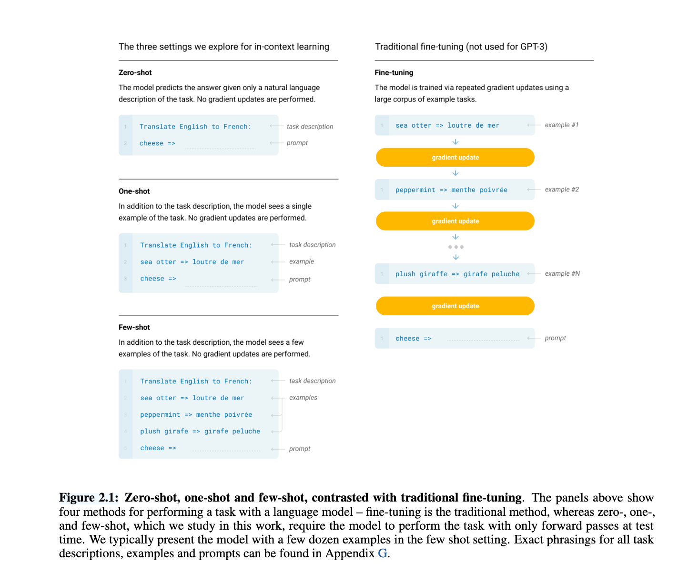

---

**2. 模型架构与规模设计**

GPT-3模型架构基本沿用GPT-2，包括预归一化、可逆tokenizer等设计，但采用稀疏注意力机制（Sparse Transformer）以提升效率。作者训练了从125M到175B参数的8个模型（见表 2.1），以研究性能与规模之间的关系。所有模型共享最大上下文窗口为2048 tokens。模型训练过程中采用混合并行策略以适应大规模参数训练。

---

**3. 数据集构成与过滤策略**

GPT-3的训练数据主要来自以下五个来源（见表 2.2）：

* Common Crawl（经过过滤，占比60%）

* WebText2、Books1、Books2、Wikipedia（合计40%）

为保证数据质量，作者对Common Crawl执行了质量过滤和模糊去重，并引入高质量参考语料。重要的是，数据在训练中并非按体量采样，而是按质量设权重采样，高质量数据被重复使用，而Common Crawl这类数据在整个训练中只被读取一次左右。

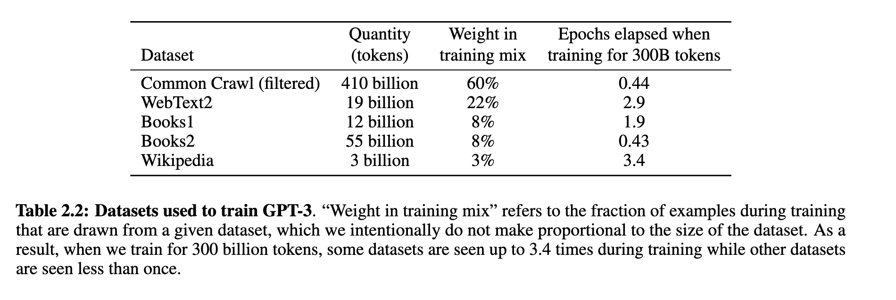

---

**4. 训练过程与资源分配**

大模型使用较大的batch size和较小的学习率（详见表 2.1）。训练依赖微软提供的高带宽GPU集群，采用模型层间和矩阵级别的并行方式进行。所有模型都使用3000亿tokens进行训练，训练策略遵循了[《Scaling Laws for Neural Language Models》](https://arxiv.org/abs/2001.08361)一文的建议。

如图 2.2 所示（Figure 2.2），GPT-3虽然模型更大，但实际训练所需的计算资源与较小模型相当，这得益于更高效的数据利用率。

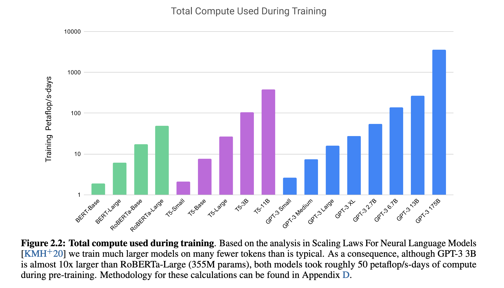

---

**5. 评估方法与设定**

在few-shot设定下，模型的每个测试样本前会插入K条示例（K通常为10-100，取决于是否能容纳在2048 token窗口中）。对于没有训练集的数据集，示例从开发集提取；对于多选题，GPT-3比较不同答案的语言模型概率（归一化处理）；对于生成类任务，则使用beam search输出，并按F1、BLEU或精确匹配评估。最终结果在公开测试集或开发集上报告。

---

**总结**

GPT-3的研究方法基于“任务不可知”的设定，通过大规模预训练和精心设计的上下文输入，在不进行梯度更新的前提下实现任务适应。这种“以上下文为接口”的元学习方法，加上参数规模的扩展，使得GPT-3在多个任务上展现出超越以往fine-tuned方法的能力，为未来通用语言智能系统奠定了基础。

## 结果

**1. 模型性能随规模扩展而持续提升**

作者首先展示了8个不同规模的模型在训练过程中的表现，发现无论是在训练损失还是实际任务中的表现，都随着模型参数的增长而呈现平滑的幂律提升趋势（见图 3.1 和图 3.3）。这表明大模型能够更好地吸收语言知识和上下文信息。

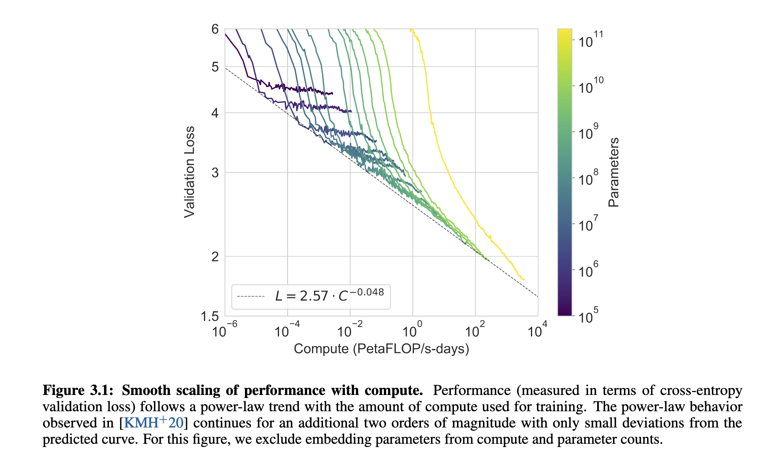

---

**2. GPT-3在语言建模和完形填空任务中的表现**

GPT-3在传统语言建模任务（如PTB）中零样本设定下创下新SOTA（PPL 20.5），远优于此前结果（PPL 35.8）。在LAMBADA数据集上，few-shot设置下准确率达到86.4%，比原SOTA高出18%（见图 3.2）。此外，在StoryCloze和HellaSwag等故事完形任务中，GPT-3也表现出明显的few-shot优势。

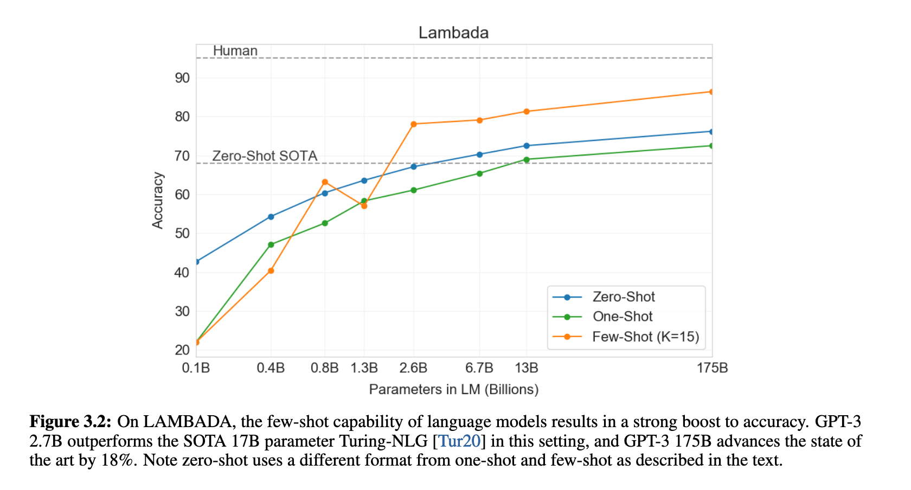

---

**3. 在封闭式问答任务中接近甚至超越SOTA**

GPT-3在TriviaQA、WebQuestions 和 Natural Questions这三个问答任务中，在没有使用外部检索信息（closed-book）或微调的前提下，仅通过few-shot设定就达到了与微调SOTA模型相当甚至更优的水平。尤其在TriviaQA中，few-shot得分达到71.2%，超越了一些基于检索系统的模型（如RAG）。

---

**4. 多语言翻译能力显著提升**

尽管训练数据中非英语文本仅占7%，GPT-3在英法、英德、英罗等语言对的few-shot翻译任务中，已超越多项无监督NMT方法的表现（见表 3.4 和图 3.4）。尤其在**翻译为英语**的方向上，GPT-3展现出更强的语言建模优势。

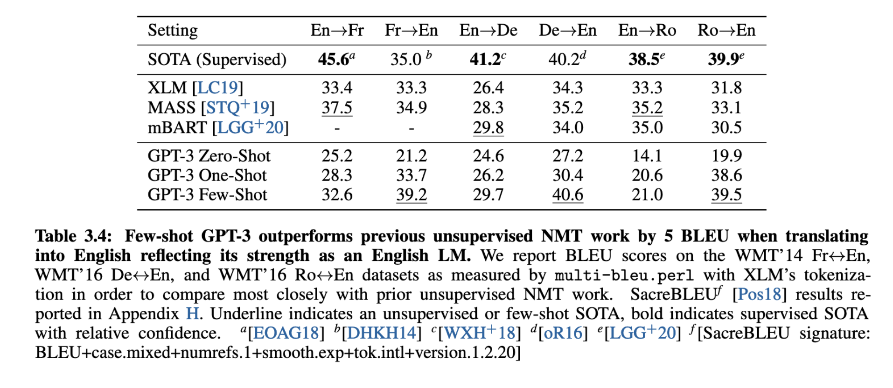

 

 

---

**5. 常识推理与Winograd类任务**

GPT-3在Winograd Schema Challenge中零样本即可取得88.3%的准确率，接近人类水平，且在更具挑战性的Winogrande数据集上few-shot得分达到77.7%，逼近fine-tuned大型模型表现（见图 3.5）。但对于如WiC（语义一致性）任务，GPT-3表现较差（仅为49.4%），显示在一些语义比较任务上仍存在明显短板。

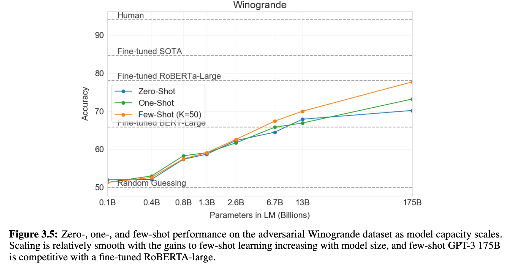

---

**6. 阅读理解与逻辑推理任务表现不一**

在阅读理解任务中（如CoQA、DROP、QuAC、SQuADv2），GPT-3在few-shot设定下表现优异，尤其在CoQA中few-shot得分（85.0 F1）仅比人类低几分（见图 3.7）。但在结构化或需要多步推理的任务中（如DROP、RACE、QuAC），表现则不及微调模型，显示GPT-3对复杂语义结构的掌握仍有提升空间。

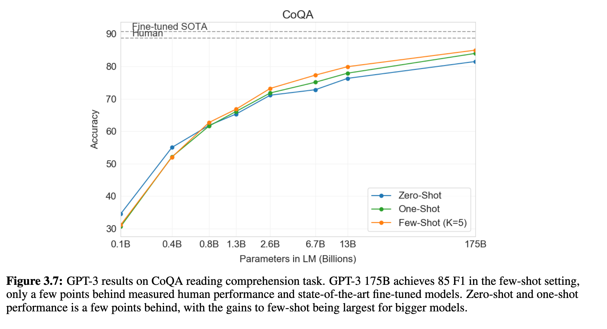

---

**7. SuperGLUE整体表现良好，但有短板**

在SuperGLUE基准测试中，GPT-3在少样本（32个示例）设定下，在BoolQ、ReCoRD等任务上表现接近SOTA，在COPA任务中仅落后1-2分。但在如WiC、CB、MultiRC等任务上显著低于fine-tuned模型（见表 3.8 和图 3.8）。这说明GPT-3在识别细粒度语义差异上仍有明显不足。

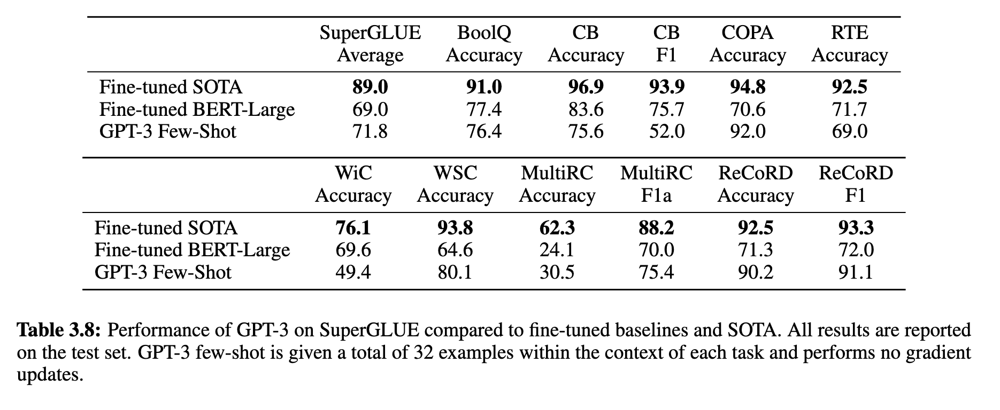

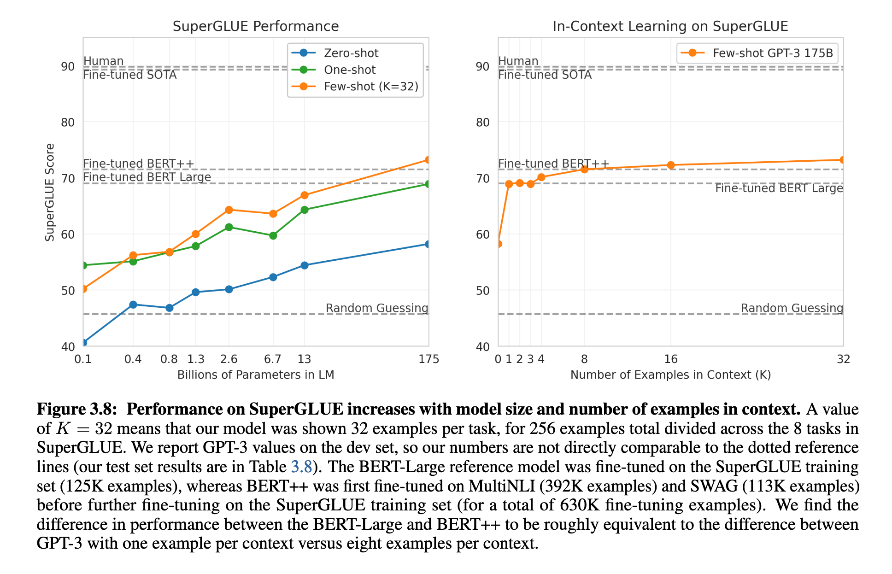

---

**8. NLI和Adversarial推理任务仍具挑战性**

在自然语言推理任务（如RTE和ANLI）中，即使是GPT-3 175B也只能在few-shot设定下稍高于随机水平（约33%），表现远不如fine-tuned模型（见图 3.9）。尤其在ANLI这种对抗性构建的数据集上，GPT-3展示了推理能力的不足。

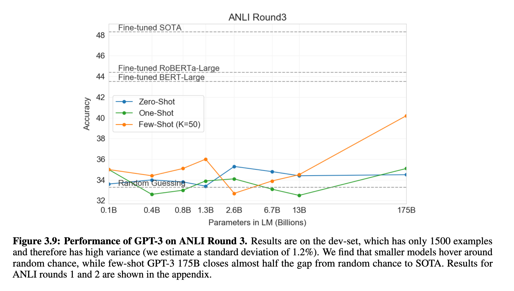

---

**9. 在合成任务和灵活性测试中展现强大泛化能力**

GPT-3在设计的算术、字母重排、新词使用、语法纠错等任务中，只需提供极少量的示例就能成功完成，这表明其具有一定程度的推理和快速适应能力。这些任务测试了GPT-3的few-shot元学习能力，显示其对“任务模式”的提取并非依赖微调。

---

**总结**

GPT-3在多数NLP任务中，在zero-, one-, few-shot设定下均展示了强大的任务适应能力，尤其在few-shot情境下，其表现多次逼近甚至超越传统fine-tuned模型。与此同时，一些任务（如对抗性推理、语义比较等）仍暴露出其推理深度与语言理解的局限，提示未来需在**结构理解**与**逻辑泛化**方面进一步改进。

## 局限性

**1. GPT-3 并非通用智能：能力分布不均**

尽管GPT-3在多个任务上取得了令人印象深刻的成绩，但作者明确指出，它并不是一个通用智能系统，其表现呈现出高度任务依赖性：**在某些任务中可与SOTA模型媲美，但在其他任务（如自然语言推理、逻辑比较）中则表现平庸甚至接近随机**。

<mark>**这种“选择性优势”意味着GPT-3更像是一个巨大的“模式匹配引擎”，而非真正理解语言和任务的系统**。</mark>

---

**2. 缺乏鲁棒的系统性泛化能力**

GPT-3的few-shot能力主要依赖于识别任务格式和输出模式，而不是进行真正意义上的概念抽象和泛化。作者指出，目前尚不清楚模型在推理任务中是否“学会”了新知识，还是只是记住了相似的训练样本。这种 **泛化机制的模糊性** 是目前元学习方法的一个重要限制。

---

**3. Prompt依赖性强，输入微小变动影响大**

GPT-3对提示（prompt）形式和内容高度敏感。不同的措辞、问题格式甚至换行方式都可能造成性能大幅波动。

这意味着few-shot效果难以稳定复现，**缺乏可控性与鲁棒性**，在实际部署中可能导致意外错误。

---

**4. 上下文窗口限制性能提升**

尽管GPT-3的上下文窗口扩大到2048 tokens，相比前代模型大幅提升，但这仍然限制了few-shot学习中可用的示例数量（尤其是在长文本任务中）。作者认为，**有限上下文容量成为当前few-shot学习的“瓶颈”**。

---

**5. 无法利用结构化监督信号**

GPT-3完全不依赖梯度更新，因此无法像微调方法那样从结构化监督中持续优化。在特定任务上（如NER、结构化问答、程序生成等），GPT-3的表现明显弱于专门微调过的模型。这表明它在需要长期优化和知识整合的任务中仍有较大局限。

---

**6. 推理与数学能力仍然有限**

GPT-3虽然能完成基础算术和简单逻辑题，但在 **多步推理、抽象代数、数理一致性等方面** 表现仍然较弱。这限制了其在金融、科研、工程等高精度领域的适用性。

---

**7. 模型不可解释性问题严重**

GPT-3的推理过程完全由大量参数和非线性变换组成，目前尚无有效方式解释它为何会给出某一答案。这种不可解释性限制了其在高风险领域的应用，如医疗、法律、金融决策等。

---

**总结**

虽然GPT-3在few-shot学习方面展现出极强的能力，但其本质仍是一个“超大规模、强记忆型的语言预测器”，而非具备深层理解与推理能力的系统。它面临的问题包括任务适应不均、prompt敏感性高、缺乏结构化监督利用能力、推理有限、以及缺乏透明性等。这些限制提示我们，在使用GPT-3及其衍生模型时，仍需谨慎评估其边界与适用性，并探索更强的系统性泛化能力和稳健性。

## 相关工作

**1. 从词向量到上下文表示的发展历程**

该部分首先回顾了自然语言处理（NLP）领域中语言表示学习的演进：

* **早期方法**（如 word2vec、GloVe）关注学习固定词向量；

* **后续方法**（如 ELMo、ULMFiT）引入上下文，支持基于上下文的词表示；

* **Transformer 时代**：BERT、GPT 系列、XLNet 等模型将预训练语言模型推向主流，支持更广泛的下游任务，通过微调在多个任务上实现了SOTA。

GPT-3继承了这一发展路线，并将参数规模推至前所未有的高度，强化了“无任务特定架构”的方法论。

---

**2. 微调范式与任务适应能力的关系**

在GPT-3之前，大多数SOTA模型依赖于“预训练 + 微调”范式，即先在大语料上预训练，再在具体任务数据上进行监督微调（如BERT、T5）。这种方法虽然效果强大，但依赖大量任务标注数据，不利于迁移与泛化。

GPT-3的核心创新之一，是系统性地探索 **无梯度更新的few-shot学习（in-context learning）**，挑战了传统对“适应任务必须微调”的假设。

---

**3. 元学习与few-shot学习的启发**

作者借鉴了 **元学习（meta-learning）** 的理念，即模型在“外循环”中获得广泛能力，在“内循环”中快速适应新任务。GPT-3通过扩展模型容量，在预训练阶段学习泛化模式，在推理阶段用文本输入指定任务，实质是一种“隐式元学习”机制。

这与Few-shot Learning领域中如MAML、Prototypical Networks、Matching Networks等方法异曲同工，但不同于它们使用结构明确的元任务，GPT-3完全通过文本学习并表达任务结构。

---

**4. 模型规模扩展趋势与“Scaling Laws”**

文中引用了Kaplan等人提出的“**神经语言模型的规模定律（Scaling Laws）**”，即验证集损失随着模型规模、数据量和计算量按幂律缩放。在这一理论指导下，GPT-3以175B参数扩展至前代模型的10倍以上。

GPT-3验证了一个关键假设：**few-shot能力会随着模型规模的增加而显著增强**，补足了先前few-shot模型（如 GPT-2、CTRL、T5）表现不稳定的问题。

---

**5. 多任务与多语言学习的基础**

GPT-3并未对每个任务建立单独的模型，而是通过单一语言建模目标，**实现任务统一与跨任务迁移**，呼应了T5等模型的“文本到文本”框架。同时，它在某种程度上也具备一定的多语言能力，尽管其非英语性能仍有限。

此外，文中提到了一些少量使用in-context设定的早期尝试（如 GPT-2 的zero-shot prompt），但GPT-3是首次系统性、大规模地在zero-, one-, few-shot条件下进行全面评估的工作。

---

**总结**

GPT-3站在了词向量、上下文建模、transformer架构、微调范式、元学习和模型扩展趋势等多个重要研究方向的交汇点上。它在技术上并非从零出发，而是有机融合并推升了这些已有成果，**将预训练语言模型从“参数调优”时代推向了“推理即编程”的新范式**。

## 结论

作者指出，GPT-3 展示了强大的**in-context learning（上下文学习）能力**，在不进行任何梯度更新的前提下，仅通过自然语言提示和示例，即可在多种语言任务中实现从零样本到少样本的泛化，部分任务甚至达到或超越微调模型的水平。尽管仍存在局限，但结果表明：**随着模型规模扩展，大规模语言模型在任务通用性与灵活性方面具有巨大潜力**，为未来通用语言智能系统的发展提供了重要方向。
