`InstructGPT 论文`
 
<!-- more -->

> 论文链接: [Training language models to follow instructions with human feedback](https://arxiv.org/abs/2203.02155)

## 摘要

本研究指出，**仅通过增加语言模型的规模，并不能显著提升其对用户意图的理解与遵循能力**。为了解决这一问题，作者提出一种**通过人类反馈对模型进行微调的方法，用以更好地对齐模型行为与用户意图**。

具体方法包括：**首先利用人工演示数据对GPT-3进行监督学习微调；然后通过人类对多个模型输出的偏好进行排序，训练奖励模型，并结合强化学习进一步优化模型。最终所得的InstructGPT模型，即使参数量远小于原始GPT-3（例如1.3B对比175B），在用户偏好评估中仍表现更优**。此外，InstructGPT在输出真实性、减少有害内容生成等方面也有所改进，且在公开NLP任务上的性能损失极小。研究表明，人类反馈微调是一种有效的模型对齐手段，尽管仍有提升空间。

## 简介

作者指出，大型语言模型（如GPT-3）虽然具备强大的自然语言处理能力，但它们常常偏离用户意图，表现出诸如捏造事实、生成有害或无关文本、不遵循指令等问题。这是因为**它们的训练目标是最大化互联网文本的下一个词预测概率，而非“安全且有用地遵循用户指令”，这造成了目标的不一致，即“对齐问题”（alignment problem）**。

为解决这一问题，本文提出了一种对齐语言模型与用户意图的策略：**通过人类反馈进行强化学习（Reinforcement Learning from Human Feedback, RLHF）**。该方法包括三个关键步骤：

1. **监督学习微调（SFT）**：收集人类示范数据，微调预训练的GPT-3模型；

2. **奖励模型训练（RM）**：收集人类对模型多个输出的排序偏好，训练出一个能预测人类偏好的奖励模型；

3. **强化学习微调（PPO）**：使用奖励模型的反馈，采用Proximal Policy Optimization算法进一步优化模型行为。

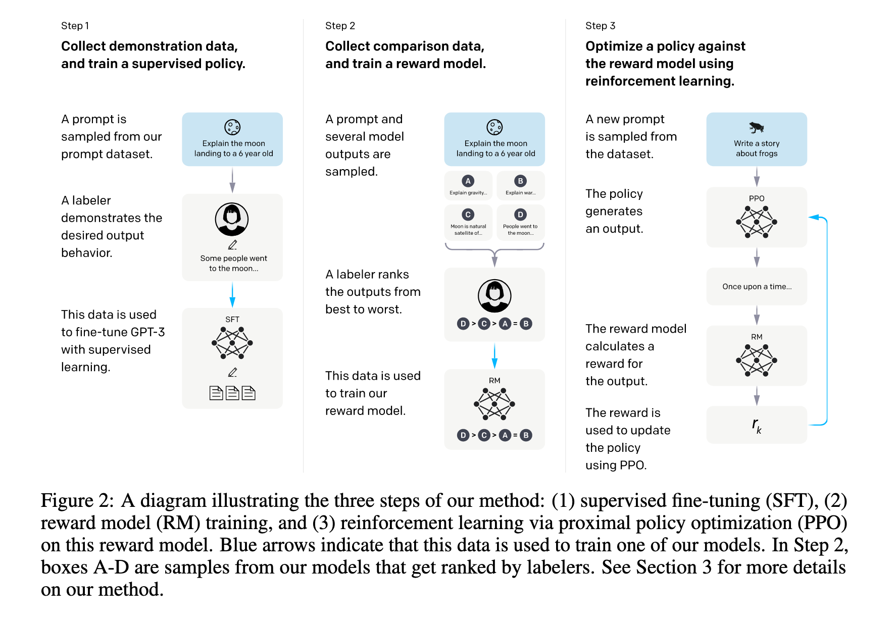

作者称这些过程使得模型输出更符合人类偏好，但强调这种对齐是**相对于特定人群（即标注者和研究者）的偏好**，并非广义上的“人类价值”。

通过图1的结果可见，**即便是只有1.3B参数的InstructGPT模型，其输出也比175B的原始GPT-3更受人类偏好**，显示出这种人类反馈驱动的微调策略极具潜力。图1中显示的不同模型在人类偏好评估中的胜率清晰反映了该方法的有效性，表明训练目标的改变（从“预测下一个词”转向“优化人类偏好”）能带来质的改善。

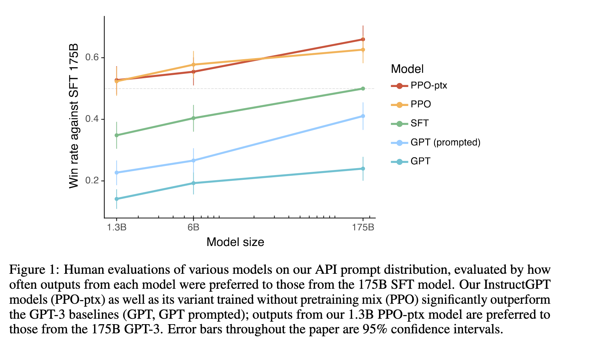

此外，作者采用了“有帮助（helpful）、诚实（honest）、无害（harmless）”三大原则来评估模型对齐效果，强调未来开发和部署语言模型时需格外关注其社会影响及安全性。

总之，本文引入了一种有效的对齐方法，为语言模型行为与用户意图之间架起了桥梁，为AI安全和实用性的发展提供了关键路径。

## 相关工作

**一、基于人类反馈的模型对齐（Alignment via Human Feedback）**

InstructGPT 的核心技术基础是 “**强化学习来自人类反馈（RLHF）**”，旨在将模型输出行为与人类意图对齐。这一方法起初应用于强化学习场景：

* **用人类偏好训练强化学习代理** : [Christiano et al., 2017](https://arxiv.org/abs/1706.03741) 提出了一种通过人类偏好比较训练代理的强化学习方法。

* **在模拟环境中用人类反馈改进行为策略** : [Ibarz et al., 2018](https://arxiv.org/abs/1811.06521)将人类偏好学习应用于模仿学习。

RLHF 后来被应用于语言任务，如摘要：

* **风格延续任务中的偏好学习** : [Ziegler et al., 2019](https://arxiv.org/abs/1909.08593)

* **文本摘要中的奖励建模与 PPO 微调** : [Stiennon et al., 2020](https://arxiv.org/abs/2009.01325)

此外，该方向在对话系统（[Jaques et al., 2019](https://arxiv.org/abs/1907.00456)）、机器翻译（[Bahdanau et al., 2016](https://arxiv.org/abs/1607.07086)）、语义解析（[Lawrence and Riezler, 2018](https://aclanthology.org/P18-1071.pdf)）、故事生成（[Zhou and Xu, 2020](https://arxiv.org/abs/2009.04887)）等任务中也得到了广泛实践。

InstructGPT 的工作属于对上述方法的泛化：将 RLHF 用于对齐语言模型在**广泛任务分布**下的行为。

---

**二、训练语言模型以遵循自然语言指令（Instruction Following）**

另一相关研究方向是使用自然语言指令训练模型以实现跨任务泛化：

* **FLAN**：使用数十个 NLP 数据集、配以自然语言任务说明进行微调。 （[Wei et al., 2021](https://arxiv.org/abs/2109.01652)）

* **T0 / T0++**：将 NLP 基准任务转换为指令格式，通过多任务微调训练语言模型。 （[Sanh et al., 2021](https://arxiv.org/abs/2110.08207)）

* **Natural Instructions**：探索指令格式变化对模型泛化能力的影响。 （[Mishra et al., 2021](https://arxiv.org/abs/2112.04139)）

InstructGPT 与上述方法的不同之处在于其训练数据源真实 API 用户提交的指令，更具 **任务多样性与实用性**。

图 1 支持这一点：即使参数量远小于 GPT-3（1.3B vs. 175B），InstructGPT 模型依然在用户指令任务中获得更高的偏好评分。

---

**三、评估语言模型的风险与危害**

InstructGPT 还借鉴了对语言模型潜在风险的研究，这些研究强调：

* **语言模型会生成有害或偏见内容**（[Bender et al., 2021](https://dl.acm.org/doi/10.1145/3442188.3445922)；[Gehman et al., 2020](https://arxiv.org/abs/2009.11462)）

* **TruthfulQA** 提供了一个用于测试模型生成信息真实性的基准数据集 （[Lin et al., 2021](https://arxiv.org/abs/2109.07958)）

* **偏见评估数据集**：包括 Winogender（性别偏见）和 CrowS-Pairs（社会偏见）（[Rudinger et al., 2018](https://arxiv.org/abs/1804.09301),[Nangia et al., 2020](https://arxiv.org/abs/2010.00133)）

InstructGPT 在实验部分也采用了这些基准（见论文第 4 节），并指出：在对毒性任务加入“请尊重”提示时，InstructGPT 比 GPT-3 更少生成有害内容（见 Figure 7）。

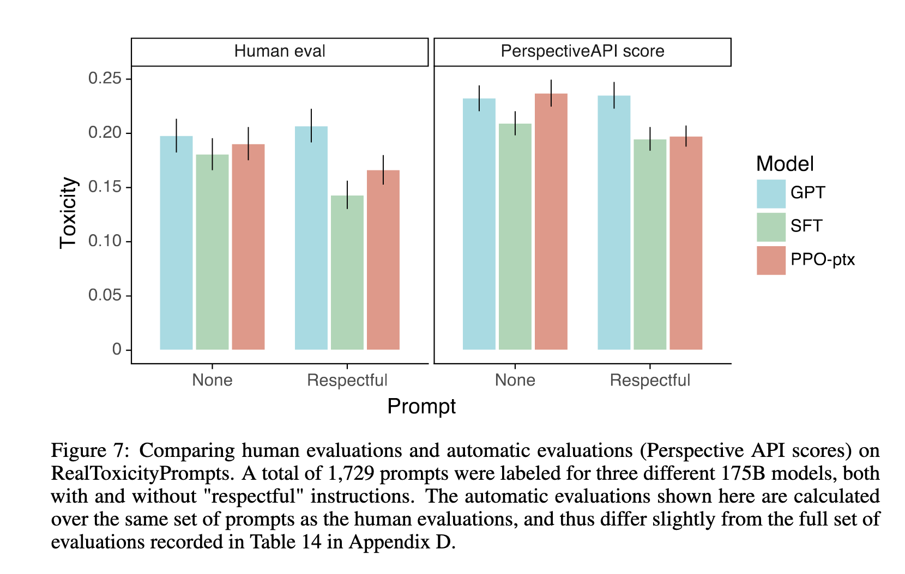

---

**四、模型行为干预与有害输出缓解策略**

文献中也探索了多种控制模型输出的策略，这些方法为 InstructGPT 所采用的 RLHF 方式提供了对照方案：

* **微调小型数据集以嵌入价值观** （[Solaiman and Dennison, 2021](https://arxiv.org/abs/2106.10328)）

* **通过触发短语过滤预训练语料**，以降低毒性输出倾向 （[Ngo et al., 2021](https://arxiv.org/abs/2108.07258)）

* **使用外部语言模型引导生成方向**（如 Plug-and-Play Language Models） （[Dathathri et al., 2019](https://arxiv.org/abs/1912.02164)）

* **用正则化或投影技术缓解嵌入空间中的偏见** （[Liang et al., 2021](https://arxiv.org/abs/2010.07096)）

尽管 InstructGPT 并未直接采用这些方法，但在强化学习微调中加入 KL 约束、预训练梯度（PPO-ptx）等机制，实际上也体现了对 **对齐损失(alignment tax)** 的控制。

以下是对 InstructGPT 论文中第 3 节 **“Methods and Experimental Details”** 的详细总结，内容结构遵循原文小节安排（3.1–3.6），并结合论文图表（如图 2）以增强理解。部分内容需分多段呈现以保留关键信息。

## 方法

InstructGPT 的方法主要基于 [Stiennon et al. (2020)](https://arxiv.org/abs/2009.01325) 和 [Ziegler et al. (2019)](https://arxiv.org/abs/1909.08593) 提出的 **三步训练框架**，用以实现语言模型对人类意图的对齐。该流程可参见论文图 2 的三步训练流程：


1. **监督微调（Supervised Fine-Tuning, SFT）**: 使用人类标注者示范的优质输出，微调预训练 GPT-3 模型，得到初始策略模型。

2. **奖励模型训练（Reward Model, RM）**: 收集一组模型输出对（针对同一输入），由人类标注者根据偏好进行排序。将这些排序用作训练奖励模型（RM）的监督信号，使其学会预测哪一输出更受偏好。

3. **使用 PPO 强化学习（Proximal Policy Optimization）微调模型**: 以奖励模型为环境反馈信号，对 SFT 模型进一步使用 PPO 算法进行强化学习优化，从而得到最终的 InstructGPT 模型。

> **图 2（Figure 2）** 明确展示了这三步流程之间的数据流和优化路径，是 InstructGPT 方法的核心概括图。

---

**数据集构建（Dataset）**

InstructGPT 的训练数据主要来自以下两个来源：

1. **真实用户在 OpenAI API Playground 提交的 prompt**

   * 提取并去重后用于训练 SFT、RM 和 PPO 模型。为确保训练集与评估集分离，按用户 ID 进行划分。

   * 为防止泄露隐私，对训练数据进行了 PII 过滤。

2. **标注者创作的 prompt**（主要用于冷启动训练）
   
   分为三类：

   * Plain（开放任务）

   * Few-shot（带示例的任务）
   
   * User-based（模拟用户需求的任务）

三类子数据集：

* **SFT 数据集**（\~13k prompts）用于监督微调

* **RM 数据集**（\~33k prompts）用于训练奖励模型

* **PPO 数据集**（\~31k prompts）为 PPO 模型提供输入

> **表 1** 显示了 API prompt 的任务分布：约 46% 为生成类任务，QA 和聊天合计约 23%，突出了真实用户需求的多样性。

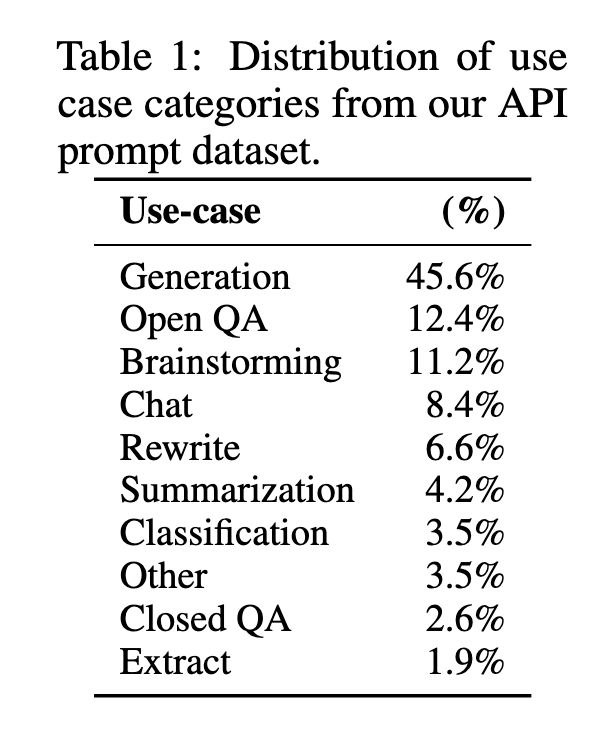

---

**任务类型（Tasks）**

训练任务覆盖广泛，包括但不限于：

* 文本生成（如创作、补全）

* 问答（开放型和封闭型）

* 对话、重写、摘要、分类、抽取等

大部分任务通过自然语言指令表达意图。少量则通过 few-shot 示例或文本上下文隐式表达。标注者在判断指令时需考虑信息准确性、避免偏见与毒性，这为 InstructGPT 模型“helpful, honest, harmless”标准提供训练信号。

---

**人类数据采集（Human Data Collection）**

OpenAI 雇佣了约 40 名标注者（通过 Upwork 与 ScaleAI）参与数据标注，执行以下任务：

* 提供高质量示范（用于 SFT）

* 对模型输出进行偏好排序（用于 RM）

* 对最终模型进行评估

为了保证标注质量，OpenAI 设计了 **筛选测试** 来挑选具有敏感内容识别能力的标注者。训练过程中的一些 prompt 包含争议性内容，故特别强调标注者的社会敏感性。

在人类偏好标注中，**inter-annotator agreement** 达到 73±1.5%，说明标注者之间达成了较高的一致性。论文还进行了一组 held-out 标注者实验，显示 InstructGPT 模型能够泛化到新标注者的偏好。

---

**模型结构与训练细节（Models）**

所有模型都基于 GPT-3 架构 ，在三个参数规模（1.3B、6B、175B）下进行训练，训练策略如下：

<br>

1. **SFT 模型训练**

* 使用标注者示范数据，训练 16 个 epoch

* 使用余弦学习率衰减，0.2 的残差 dropout

* 用奖励模型得分选择最佳模型（而非验证 loss）

<br>

2. **奖励模型（RM）训练**

* 输入为 prompt 和 response，输出为标量奖励

* 在每个 prompt 上收集 K（4–9）个响应，由标注者排序，训练时将所有配对作为一个 batch，防止过拟合

* 使用如下 pairwise ranking loss：

```math
loss(θ) = − (1 / C(K,2)) * E[log(σ(r_θ(x, y_w) − r_θ(x, y_l)))]
```

其中 $y_w$、$y_l$ 分别为更受欢迎和较差的响应。

<br>

3. **PPO 和 PPO-ptx 模型训练**

* PPO 使用 RM 作为奖励函数

* 为缓解对奖励函数的过度优化，引入 KL 惩罚项

* PPO-ptx 版本进一步加入 pretraining 任务的 log-likelihood 更新项，以防对齐过程中性能退化（alignment tax）

> PPO-ptx 目标函数如下：

```math
Objective = E[r − β * KL + γ * logP_pretrain]
```

---

**评估方式（Evaluation）**

为了衡量模型的“对齐程度”，InstructGPT 使用了综合性评估框架：

<br>

A. **API prompt 分布评估**


* 使用 held-out 用户的 prompt

* 人类评估输出的偏好、质量（Likert 1–7）、以及一系列元数据（如是否 hallucinate、是否尊重约束）

* **图 4** 展示了模型在是否遵循指令、幻觉率等多个维度的性能

<br>

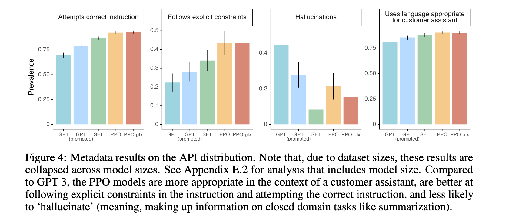

<br>


B. **公共 NLP 数据集评估**

* 涉及 TruthfulQA（真实性）、RealToxicityPrompts（毒性）、Winogender/CrowS-Pairs（偏见）

* 还评估模型在 SQuAD、DROP、HellaSwag、WMT 2015 等任务上的零样本表现

* 显示模型在强化学习过程中存在轻微性能损失，但 PPO-ptx 可有效缓解（见图 29–34，原文）

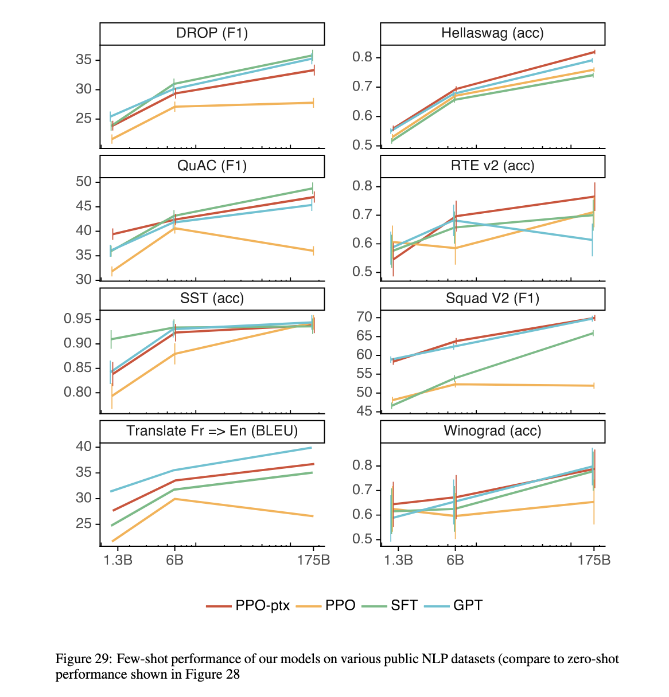

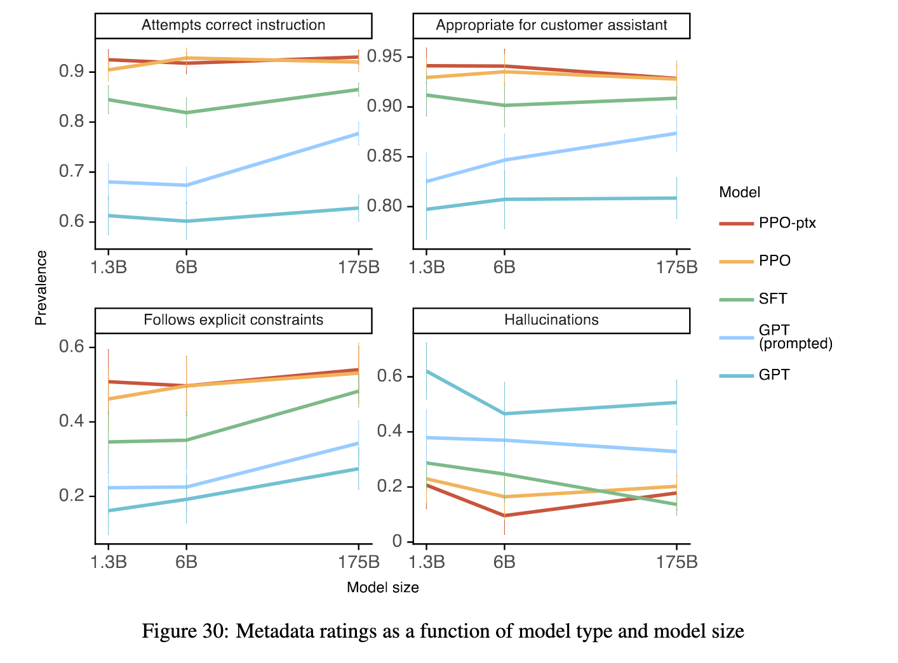

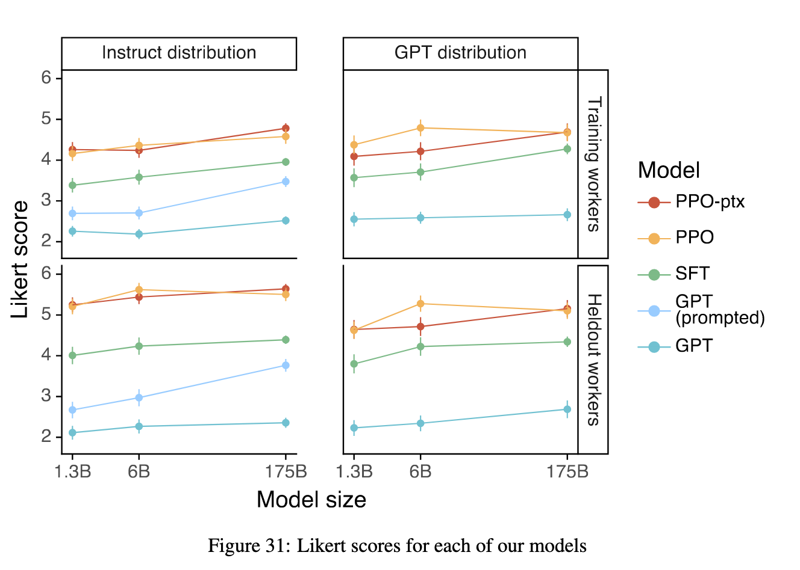

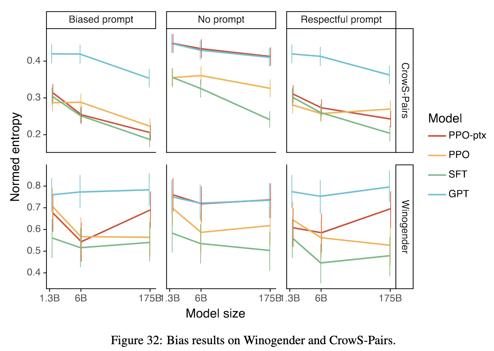

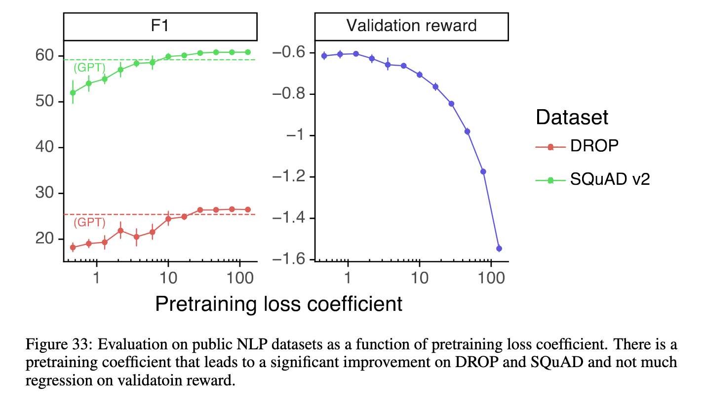

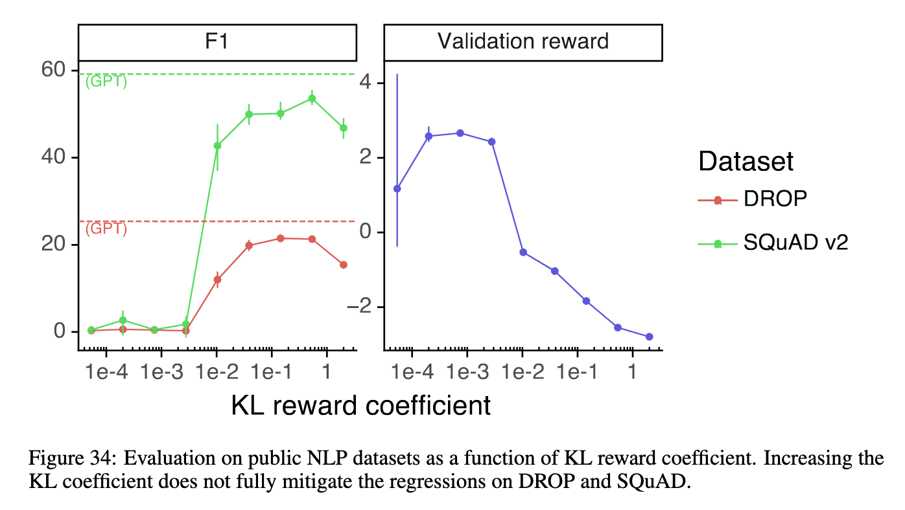

## 结果

**1. 在 API prompt 分布上的实验结果:**

InstructGPT 的核心实验基于真实用户提交的指令性 prompts，在这些任务中：

**人类评估者显著偏好 InstructGPT 输出**

* **Figure 1** 显示：在用户任务分布中，1.3B 的 InstructGPT 模型比 175B GPT-3 更受偏好。

* 即使是少样本提示增强的 GPT-3（few-shot GPT-3），也不及 InstructGPT。

* 例如，175B InstructGPT 输出相较于标准 GPT-3 的偏好比为 **85% ± 3%**，相比 few-shot GPT-3 为 **71% ± 4%**。


**PPO-ptx 与 PPO 模型均优于 SFT 和 GPT-3**

* **Figure 3** 显示，在两类提示分布（GPT-3 与 InstructGPT 用户提交）上，InstructGPT 在所有规模下均优于 GPT-3。

* 并且该优势在训练标注者和 held-out 标注者之间都保持一致，说明偏好并非训练数据过拟合造成。

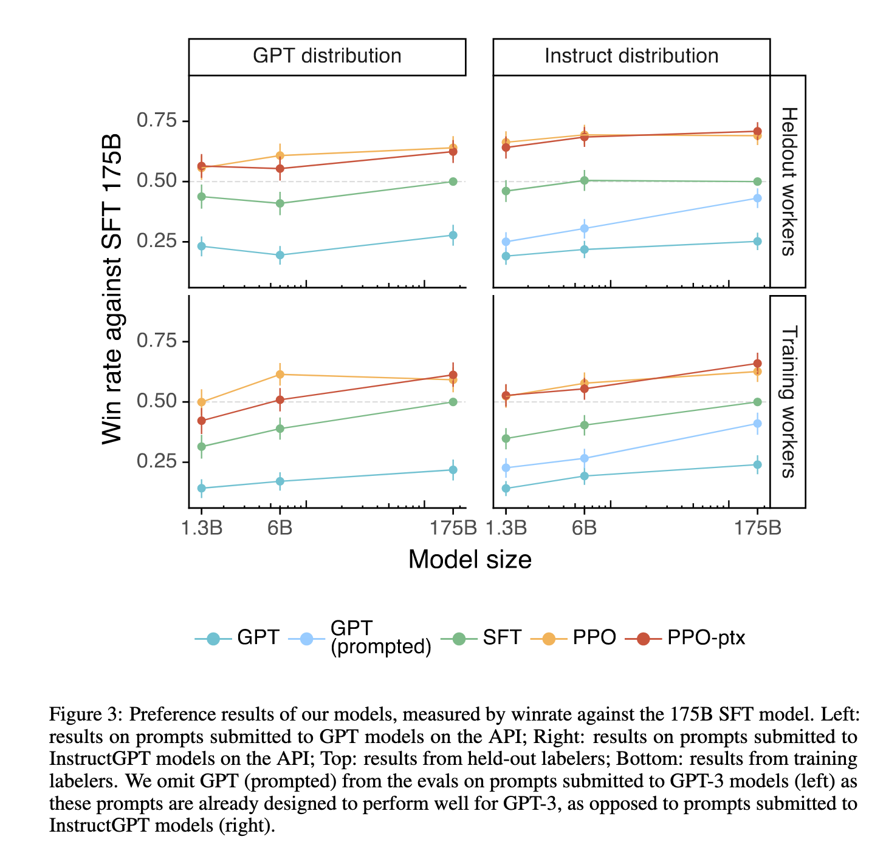

**更好地遵循指令，减少幻觉，更适合作为用户助手**

* **Figure 4** 展示了模型输出的多维质量元数据对比：

  * InstructGPT 更少“幻觉”（hallucination）

  * 更能遵守“指令中的显式约束”

  * 更常“尝试正确完成任务”

  * 更适合用于“客户助手场景”

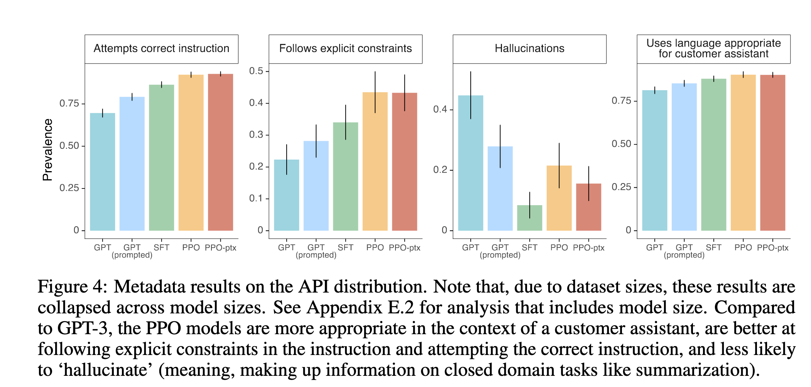

---

**2. 在公开 NLP 数据集上的实验结果**

**在 TruthfulQA 上更真实、更少编造**

* **Figure 6** 显示，在 TruthfulQA 基准上，PPO 和 PPO-ptx 模型显著提升回答的真实性与信息性。

* 例如，在加入指导性提示（instruction+QA）时，InstructGPT 倾向于不作伪答（如选择“I have no comment”），而 GPT-3 则容易自信地给出错误答案。

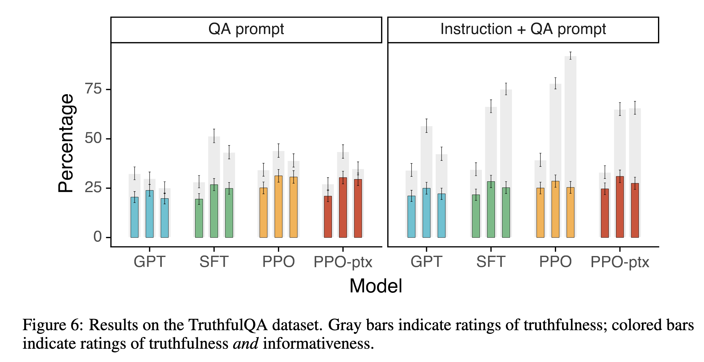

**InstructGPT 输出更少毒性内容，尤其在有“尊重”提示下**

* 使用 RealToxicityPrompts 数据集 + Perspective API 自动打分 + 人类评估。

* **Figure 7** 显示：

  * 有“请保持尊重”提示时，InstructGPT 显著比 GPT-3 更少生成有毒文本。

  * 无提示时，两者毒性差异减小。

  * 若刻意要求生成毒性内容，InstructGPT 反而更“有效”执行（更高毒性），说明其任务执行能力更强，但未具内置限制。

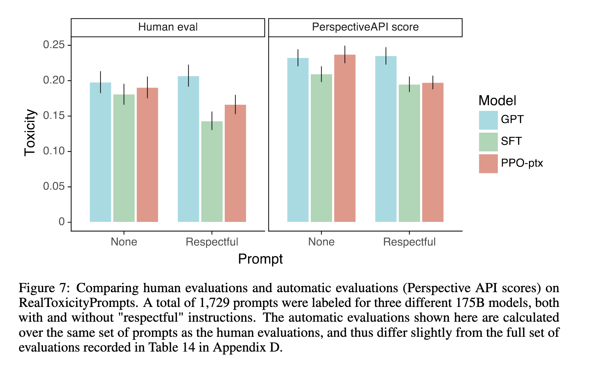

**在偏见测试中未表现出优势**

* 在 CrowS-Pairs 和 Winogender 数据集上，InstructGPT 和 GPT-3 偏见水平相当，有时更低 entropy 表示模型更“确信”其回答，但不一定更公正。

<br>

**使用 PPO-ptx 缓解了对齐损失（alignment tax）**

* 原始 PPO 模型在 SQuAD、DROP 等任务上表现退化。

* 但通过在 RL 过程中混入预训练目标（PPO-ptx），可基本恢复甚至超越 GPT-3 性能（见附录图 29–34）。

---

**3. 定性分析与模型行为观察**


**模型泛化能力强：能处理非训练分布指令**

* InstructGPT 可：

  * 处理 **非英语指令**，如法语（尽管有时仍用英文回应）

  * 总结并解释 **代码片段**

* **Figure 8** 示例显示：

  * GPT-3 未能回答“列表 C 的作用”问题，InstructGPT 给出较为合理的解释（虽然也不完全正确）

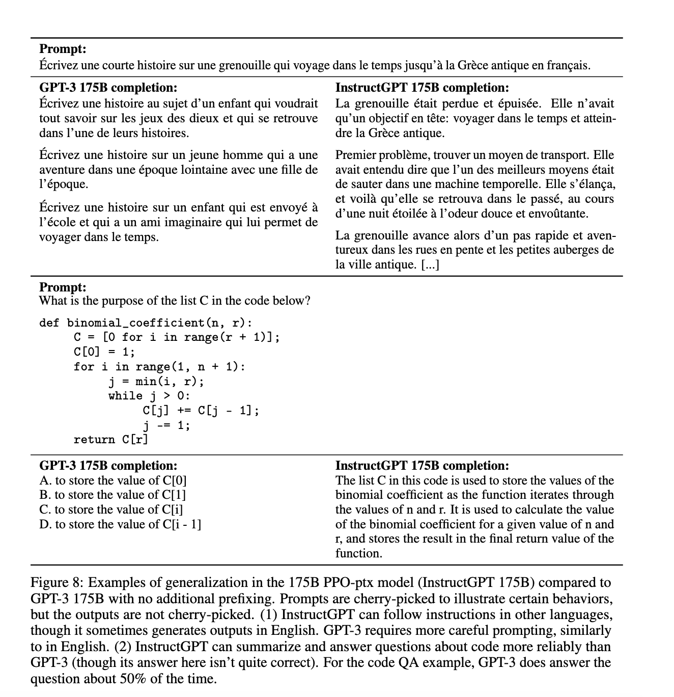

**模型仍存在简单错误与对“荒谬”指令的顺从**

* InstructGPT 在面对带**错误前提**的指令时，可能不会质疑，而是“默认接受并执行”。

* 它也倾向于**过度规避风险**，在回答简单问题时冗长解释或“过于中性”。

* **Figure 9** 展示：

  * 对“冥想后吃袜子有何用”这类指令，GPT-3 胡编乱造；InstructGPT 则写出听起来“认真合理”的答案，但仍在胡说。

  * 对“炮弹打南瓜”的问题，InstructGPT没能直接回答（如“炸碎”），而是列举可能性并犹豫。

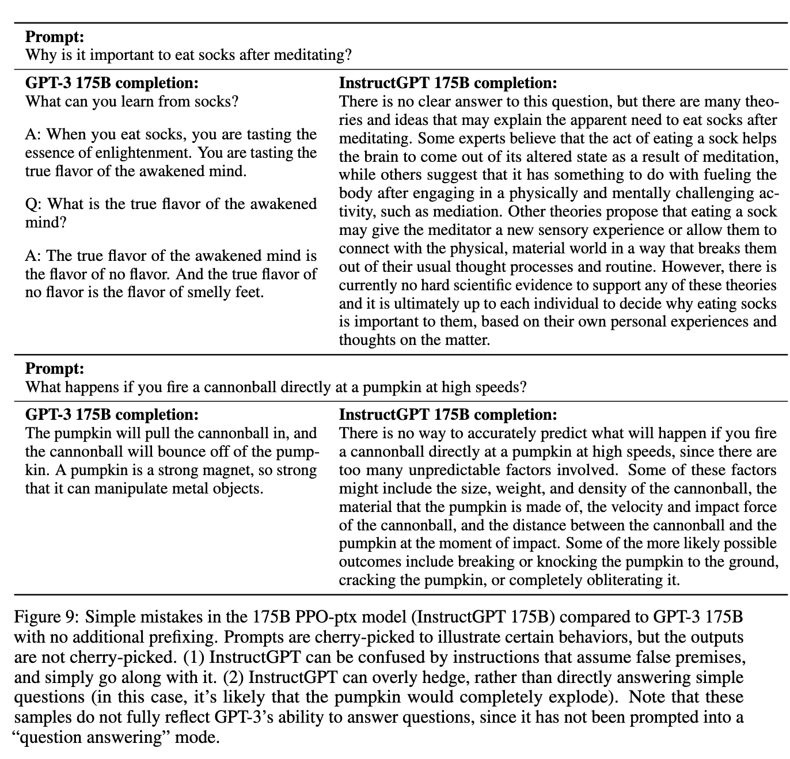

---

**总结：InstructGPT 的结果证明了 RLHF 的有效性**

* **提升**：输出更符合人类偏好，减少幻觉与毒性，对指令遵循度高。

* **挑战**：仍可生成有害内容，对荒谬命令未进行识别，任务复杂性上限未显现。

* **泛化性**：在代码、非英语指令等非监督数据上表现较好。

* **控制手段**：通过 PPO-ptx 控制 alignment tax，维持 NLP 性能。


## 讨论

InstructGPT 是 OpenAI 迭代式对齐研究计划的一部分，目标是使现有模型更符合人类意图，同时构建适用于未来更强 AI 的通用方法。

**RLHF 是一种低成本高回报的对齐方法**

* 与预训练相比，使用 RLHF 对齐语言模型所需的计算成本极低：

  * 训练 GPT-3（175B）需约 **3640 petaflop/s-days**；

  * 而 InstructGPT 的 SFT 阶段只需 **4.9 petaflop/s-days**；
  
  * PPO 微调也仅为 **60 petaflop/s-days**。

* 与其训练更大的模型，不如在现有模型上投资对齐方法：例如，1.3B InstructGPT 的输出比 175B GPT-3 更受欢迎（见 Figure 1）。

**RLHF 能够泛化“指令跟随能力”**

* 模型在未明确训练的任务上也表现良好，如非英语任务、代码任务（见 Figure 8）。

* 这意味着对齐方法不仅优化模型行为，还能提高其泛化能力，有助于构建更通用、适应性强的智能系统。

**可显著降低对齐带来的性能损失(alignment tax)**

* 原始 PPO 模型在一些公开 NLP 数据集上的性能下降（如 DROP、SQuAD）。

* 但通过引入预训练梯度混合（PPO-ptx），可以在保持对齐的同时维持甚至提升性能（详见附录 Figure 29–34）。

**将抽象对齐技术成功应用于现实世界模型部署**

* 与以往在合成任务或小型模型上的研究不同，InstructGPT 将 RLHF 应用于真实的 API 模型中，验证了该技术在生产环境下的可行性和价值。

---

**我们到底在“对齐”谁？(Who Are We Aligning To ?)**

作者清晰指出当前模型对齐行为的“参考群体”是有局限的，实际对齐的是训练流程中的多重人为偏好叠加：

1. **标注者的偏好**：训练数据和奖励信号均来自一组英语标注者（主要来自美国和东南亚），并非普遍“人类代表”。

2. **研究者的设计意图**：OpenAI 研究团队定义了标注规则、标准与示例，标注者受其引导。

3. **API 用户行为**：训练 prompt 来源于真实 API 用户提交，其任务形式和风格可能代表一类高频商业用途。

4. **用户 ≠ 社会**：OpenAI API 用户为申请加入测试队列的群体，不代表所有潜在用户，更不代表所有受语言模型影响的人群。

**结论**：当前对齐并非通用意义上的“人类价值对齐”，而是**特定群体与目标下的实用性对齐**。未来若需面向多元人群，可能需要模型具备多偏好条件控制能力。

---

**限制与盲点（Limitations）**

InstructGPT 在多个方面仍存在不足：

**模型行为问题：**

* **仍会生成有害、偏见或捏造内容**。

* **过度顺从错误指令**：如“吃袜子”、“南瓜吸引炮弹”等（Figure 9）。

* **复杂指令处理能力不足**：多条件限制（如“用两句话总结 1930 年代法国电影”）仍表现不佳。

**数据收集问题：**

* **标注者人数有限（约40人）**，且偏好有偏，可能影响输出的一致性与代表性。

* **多数比较数据仅有 1 位标注者进行判断**，可能遗漏歧义与分歧点。

* **语言多样性不足**：训练数据主要为英文，非英语泛化能力未系统评估。

**作者建议未来采用更多元标注、歧义加权、以及特定群体优先原则（如针对少数群体敏感任务）**。

---

**尚待探索的问题（Open Questions）**

作者列出多个值得进一步研究的问题：

* **如何更有效缓解毒性与偏见？**

  * 引入 adversarial 数据收集（如 [Dinan et al., 2019b](https://arxiv.org/abs/1908.06083)）；
  
  * 在预训练层面进行数据过滤（如 [Ngo et al., 2021](https://arxiv.org/abs/2108.07258)）；
  
  * 建立更强的拒绝机制以识别恶意请求。

* **如何应对多价值体系的冲突？**

  * 开发具备“偏好条件化能力”的模型（即对不同用户群体可调节输出风格/规范）；
  
  * 探索“社会契约式”对齐方法以处理价值多样性。

* **如何建立更强的 reject 模型机制？**

  * 当任务违反道德或逻辑前提时，模型应能自动识别并拒绝执行，而非“高质量完成”。

---

**社会影响与部署考量（Broader Impacts）**

**正面影响：**

* 更符合用户指令、更具可控性、更少毒性，适合用于构建对话助手、总结系统、教育工具等。

* 为“人类偏好引导型 AI”提供现实路径，降低部署风险。

**潜在风险：**

* 当前偏好群体有限，若未经适当调节可能导致某些群体观点被系统性排除；

* 对齐本身可被滥用，尤其在军事、虚假宣传等敏感场景下；

* 若拒绝机制不足，模型仍可能在对抗性攻击下暴露隐私、输出有害内容。

作者强调，**技术细节必须伴随规范治理与透明流程**，否则对齐仅为形式上的“驯化”，而非本质的 AI 安全。

---

**总结:**

| 项目      | 关键结论                            |
| ------- | ------------------------------- |
| RLHF 价值 | 成本低、泛化强、性能好，优于简单 scaling        |
| 当前对齐对象  | 并非“人类普遍价值”，而是 OpenAI 标注者 + 用户   |
| 局限性     | 模型顺从性过高、多样性不足、对抗性脆弱             |
| 未来方向    | 多群体条件对齐、拒绝模型、反毒性 adversarial 训练 |
| 部署建议    | 建议伴随伦理审查、偏好反馈机制、开放接口控制          |

