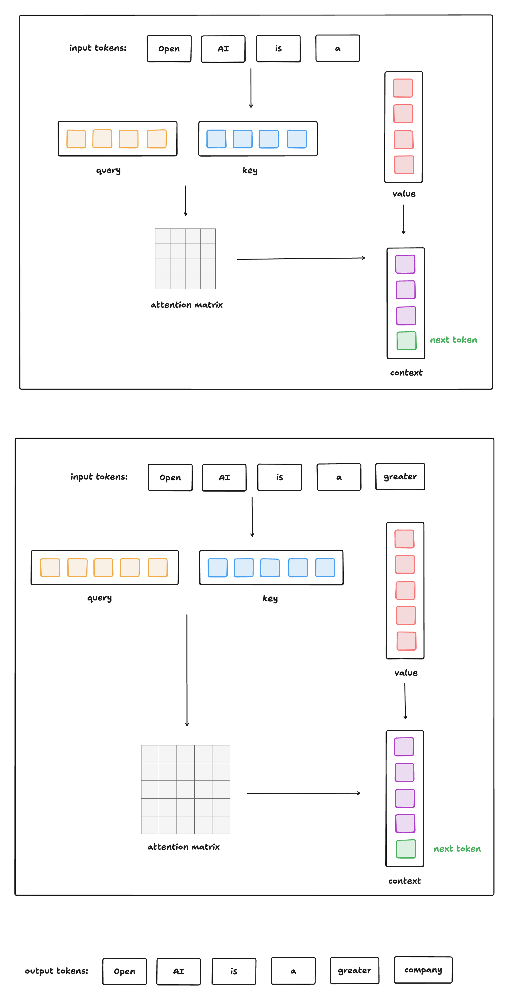
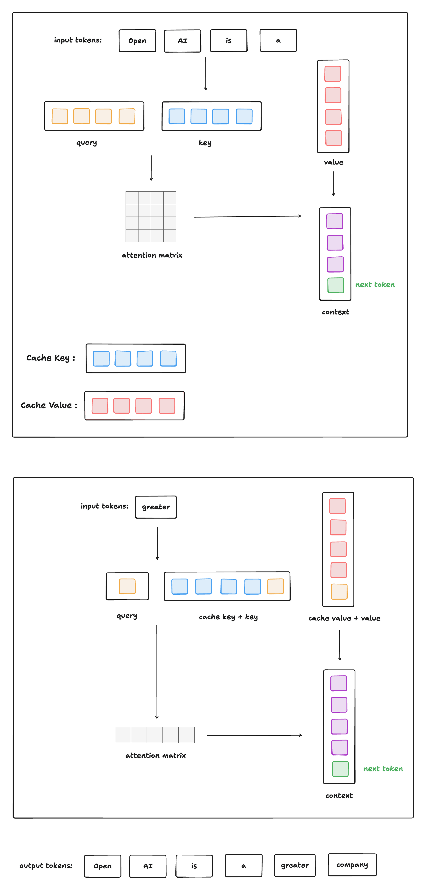
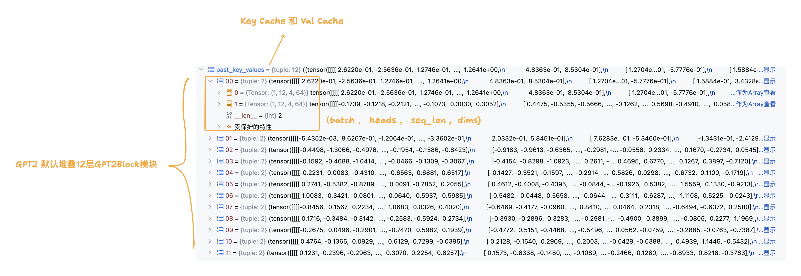

`大模型加速技术之KV Cache详解`
 
<!-- more -->

## Why we need KV Cache ？

生成式generative模型的推理过程很有特点，我们给一个输入文本，模型会输出一个回答（长度为N），其实该过程中执行了N次推理过程。即GPT类模型一次推理只输出一个token，输出token会与输入tokens 拼接在一起，然后作为下一次推理的输入，这样不断反复直到遇到终止符。

如上描述是我们通常认知的GPT推理过程。代码描述如下：

```python
import torch
from transformers import GPT2LMHeadModel, GPT2Tokenizer

def main():
    # 加载模型和 tokenizer
    model = GPT2LMHeadModel.from_pretrained("gpt2").eval()
    tokenizer = GPT2Tokenizer.from_pretrained("gpt2")

    # 初始输入
    in_text = "Open AI is a"
    in_tokens = torch.tensor(tokenizer.encode(in_text)).unsqueeze(0)  # [1, seq_len]
    token_eos = torch.tensor([198])  # line break symbol
    out_token = None
    i = 0

    with torch.no_grad():
        while out_token != token_eos:
            outputs = model(in_tokens)
            logits = outputs.logits
            out_token = torch.argmax(logits[0, -1, :], dim=-1, keepdim=True).unsqueeze(0)  # [1, 1]
            in_tokens = torch.cat((in_tokens, out_token), dim=1)
            text = tokenizer.decode(in_tokens[0])
            print(f'step {i} input: {text}', flush=True)
            i += 1

    out_text = tokenizer.decode(in_tokens[0])
    print(f'\nInput: {in_text}')
    print(f'Output: {out_text}')

if __name__ == "__main__":
    main()
```

输出:

```python
step 0 input: Open AI is a new
step 1 input: Open AI is a new way
step 2 input: Open AI is a new way to
step 3 input: Open AI is a new way to build
step 4 input: Open AI is a new way to build AI
step 5 input: Open AI is a new way to build AI that
step 6 input: Open AI is a new way to build AI that is
step 7 input: Open AI is a new way to build AI that is more
step 8 input: Open AI is a new way to build AI that is more efficient
step 9 input: Open AI is a new way to build AI that is more efficient and
step 10 input: Open AI is a new way to build AI that is more efficient and more
step 11 input: Open AI is a new way to build AI that is more efficient and more efficient
step 12 input: Open AI is a new way to build AI that is more efficient and more efficient than
step 13 input: Open AI is a new way to build AI that is more efficient and more efficient than traditional
step 14 input: Open AI is a new way to build AI that is more efficient and more efficient than traditional AI
step 15 input: Open AI is a new way to build AI that is more efficient and more efficient than traditional AI.
step 16 input: Open AI is a new way to build AI that is more efficient and more efficient than traditional AI.


Input: Open AI is a
Output: Open AI is a new way to build AI that is more efficient and more efficient than traditional AI.
```

在上面的推理过程中，每 step 内，输入一个 token序列，经过Embedding层将输入token序列变为一个三维张量 [b, s, h]，经过一通计算，最后经 logits 层将计算结果映射至词表空间，输出张量维度为 [b, s, vocab_size]。

当前轮输出token与输入tokens拼接，并作为下一轮的输入tokens，反复多次。可以看出第 i+1 轮输入数据只比第 i 轮输入数据新增了一个 token，其他全部相同！

因此第 i+1 轮推理时必然包含了第 i 轮的部分计算。KV Cache 的出发点就在这里，缓存当前轮可重复利用的计算结果，下一轮计算时直接读取缓存结果。

> 上面所举例子并没有使用KV Cache进行推理,请注意。

## Self-Attention Without Cache

下图给出了无 Cache 情况下，类GPT式生成式模型进行推理的过程:



这种方式的问题是: **每生成一个 token，就要重新计算所有之前 token 的 Q/K/V + Attention + FFN** 。


## Self-Attention With Cache


下图给出了有 Cache 情况下，类GPT式生成式模型进行推理的过程:



## Huggingface 官方代码实现

本节将根据 Huggingface 官方代码实现进行 KV Cache 实现讲解 (只展示核心代码，移除了大量与本文无关的逻辑)。

> 官方代码链接: [https://github.com/huggingface/transformers/blob/main/src/transformers/models/gpt2/modeling_gpt2.py](https://github.com/huggingface/transformers/blob/main/src/transformers/models/gpt2/modeling_gpt2.py)

下面将给出使用了 KV Cache 进行推理的代码:

```python
import torch
from transformers import GPT2Tokenizer, GPT2Config
from modeling_gpt2 import GPT2LMHeadModel  # copy from huggingface , 删除了大量无关代码

def generate_text(model, tokenizer, prompt, max_new_tokens=50, eos_token_id=198):
    model.eval()
    input_ids = tokenizer.encode(prompt, return_tensors="pt")
    past_key_values = None
    output_ids = input_ids.clone()

    with torch.no_grad():
        for step in range(max_new_tokens):
            outputs = model(
                input_ids=input_ids,
                past_key_values=past_key_values,
                use_cache=True
            )
            logits = outputs.logits
            past_key_values = outputs.past_key_values

            next_token_logits = logits[:, -1, :]
            next_token = torch.argmax(next_token_logits, dim=-1, keepdim=True)

            output_ids = torch.cat([output_ids, next_token], dim=-1)

            if next_token.item() == eos_token_id:
                break

            input_ids = next_token  # 采用KV Cache后，推理过程修改的关键: 下一步只送入新 token

            print(f"step {step}: {tokenizer.decode(output_ids[0])}", flush=True)

    return tokenizer.decode(output_ids[0])

def main():
    config = GPT2Config()
    tokenizer = GPT2Tokenizer.from_pretrained("gpt2")
    model = GPT2LMHeadModel(config)

    prompt = "Once upon a time"
    output = generate_text(model, tokenizer, prompt)
    print("\nFinal output:")
    print(output)

if __name__ == "__main__":
    main()
```

KV Cache 的引入是为了加速自回归模型的推理速度，具体体现在:

1. 每轮推理时，只需要计算当前轮新增 token 的 Q/K/V，而不需要重新计算所有之前 token 的 Q/K/V。

2. 缓存当前轮计算结果，下一轮推理时直接读取缓存结果。

在首轮推理的过程中，我们传入的是 promt 提示词列表，并且 KV Cache 此时为空，还未进行初始化。因此首轮推理过程需要完成 promt 提示词列表的 keys 和 values 的缓存；由于 GPT2 由多层 GPT2Block 堆叠而成，而每一层 GPT2Block 都有一个 GPT2Attention 模块， 因此 KV Cache 需要准备好每一层 GPT2Attention 模块的 keys 和 values 缓存 (分层Cache - legacy_cache)。

```python
class GPT2Model(GPT2PreTrainedModel):
    def forward(
        self,
        input_ids=None,
        past_key_values=None, 
        cache_position=None,
        attention_mask=None,
        position_ids=None,
        head_mask=None,
        use_cache=None,
    ):          
        return_legacy_cache = False
        if use_cache:
            # 1. 首轮推理，先进行 Legacy Cache 初始化
            if past_key_values is None:
                return_legacy_cache = True
                past_key_values = DynamicCache()
            # 2. 后续推理，将模型以元组形式返回的缓存重新封装为Legacy Cache形式
            elif not isinstance(past_key_values, Cache):
                return_legacy_cache = True
                past_key_values = DynamicCache.from_legacy_cache(past_key_values)

        # 3. 词嵌入 
        inputs_embeds = self.wte(input_ids)
        
        # 4. 位置编码计算
        if cache_position is None:
            # 4.1 已经缓存的词序列长度
            past_seen_tokens = past_key_values.get_seq_length() if past_key_values is not None else 0
            # 4.2 只为当前传入的词生成位置序列
            cache_position = torch.arange(
                past_seen_tokens, past_seen_tokens + inputs_embeds.shape[1], device=inputs_embeds.device
            )    
        if position_ids is None:
            position_ids = cache_position.unsqueeze(0) # 添加batch维度
        # 4.3 生成位置编码
        position_embeds = self.wpe(position_ids)

        # 5. 词嵌入 + 位置编码
        hidden_states = inputs_embeds + position_embeds.to(inputs_embeds.device)
        
        # 6. 进入堆叠GPT2Block模块前向传播流程
        for i, block in enumerate(self.h):
            
            hidden_states = block(
                hidden_states,
                past_key_values if not (self.gradient_checkpointing and self.training) else None, # 训练时，不启用KV Cache
                cache_position,
                causal_mask,
                use_cache=use_cache,
            )

        hidden_states = self.ln_f(hidden_states)
        hidden_states = hidden_states.view(output_shape)

        # 7. 将KV Cache用元组的形式进行返回 
        past_key_values = past_key_values if use_cache else None
        if return_legacy_cache:
            past_key_values = past_key_values.to_legacy_cache()

        return BaseModelOutputWithPastAndCrossAttentions(
            last_hidden_state=hidden_states,
            past_key_values=past_key_values,
            hidden_states=all_hidden_states,
            attentions=all_self_attentions,
            cross_attentions=all_cross_attentions,
        )
```

下图展示的是步骤7中以元组形式返回的KV Cache结构:



下面将展示GPT2Block模块的实现逻辑，由于不涉及KV Cache的实现细节，所以不过多展开:

```python
class GPT2Block(GradientCheckpointingLayer):

    def forward(
        self,
        hidden_states: Optional[tuple[torch.FloatTensor]],
        past_key_value: Optional[Cache] = None,
        cache_position: Optional[torch.LongTensor] = None,
        attention_mask: Optional[torch.FloatTensor] = None,
        use_cache: Optional[bool] = False,
    ) -> Union[tuple[torch.Tensor], Optional[tuple[torch.Tensor, tuple[torch.FloatTensor, ...]]]]:
        
        # 1. 归一化
        residual = hidden_states
        hidden_states = self.ln_1(hidden_states)
        
        # 2. 自注意力运算
        attn_output, self_attn_weights = self.attn(
            hidden_states,
            past_key_value=past_key_value,
            cache_position=cache_position,
            attention_mask=attention_mask,
            use_cache=use_cache,
        )
        
        # 3. residual connection
        hidden_states = attn_output + residual

        # 4. 归一化 + MLP +  residual connection
        residual = hidden_states
        hidden_states = self.ln_2(hidden_states)
        feed_forward_hidden_states = self.mlp(hidden_states)
        hidden_states = residual + feed_forward_hidden_states

        return hidden_states
```

推理时的常规流程（无 KV Cache）， 每生成一个新 token，都要：

* **重新输入全部历史 token**

* 对所有历史 token **重新计算 key 和 value**

* 这意味着重复计算，**效率低，计算开销线性增长**

---

有了 KV Cache 后的改进：

1. **第一次输入完整句子**，计算并缓存其 key/value；

2. **后续每次生成新 token** 时：

   * 只计算新 token 的 query、key、value；

   * **把新 token 的 key/value 插入缓存**中（代码中用 `past_key_value.update(...)` 完成）；

   * attention 直接使用「**历史缓存 key/value + 当前新 token 的 key/value**」来完成；

3. 整个注意力的 query 只有一个（当前 token），**key/value 是历史缓存 + 当前 token**。

```python
class GPT2Attention(nn.Module):

    def __init__(self, config, is_cross_attention=False, layer_idx=None):
        self.c_attn = Conv1D(3 * self.embed_dim, self.embed_dim) # 输入维度: (batch,seq_len,embed_dim) , 变换后的输出维度: (batch,seq_len,3*embed_dim)
        self.c_proj = Conv1D(self.embed_dim, self.embed_dim)

    def forward(
        self,
        hidden_states: Optional[tuple[torch.FloatTensor]],
        past_key_value: Optional[Cache] = None,
        cache_position: Optional[torch.LongTensor] = None,
        attention_mask: Optional[torch.FloatTensor] = None,
    ) -> tuple[Union[torch.Tensor, tuple[torch.Tensor]], ...]:
        # 1. 一维卷积进行线性变换和升维，然后切分成query，key，value
        query_states, key_states, value_states = self.c_attn(hidden_states).split(self.split_size, dim=2)

        # 2. (batch,seq_len,-1,head_dim) , head_dim 是多头自注意力中每个头切分到的维度 
        shape_q = (*query_states.shape[:-1], -1, self.head_dim)
        shape_kv = (*key_states.shape[:-1], -1, self.head_dim)
        
        # 3. 维度统一: (batch,heads,seq_len,head_dim)
        query_states = query_states.view(shape_q).transpose(1, 2)
        key_states = key_states.view(shape_kv).transpose(1, 2)
        value_states = value_states.view(shape_kv).transpose(1, 2)
         
        # 4. KV Cache 不为空 
        if past_key_value is not None:
            # 4.1 cache_position 记录当前词对应输入词序列中的索引
            cache_kwargs = {"cache_position": cache_position}
            # 4.2 将当前词的key和val进行缓存，根据所在GPTBlock层级(layer_idx说明)，和位于词序列的索引(cache_kwargs说明),插入对应层的list缓存中去，同时返回对应的key和val list
            key_states, value_states = past_key_value.update(
                key_states, value_states, self.layer_idx, cache_kwargs=cache_kwargs
            )

        # 5. 进行经典的多头自注意力运算(不展开细聊) 
        attn_output, attn_weights = attention_interface(
            self,
            query_states, # 当前输入词的query
            key_states,   # cache key list + 输入词的key
            value_states,  # cache val list + 输入词的val
            attention_mask, # padding mask
            dropout=self.attn_dropout.p if self.training else 0.0,
        )
          
        attn_output = attn_output.reshape(*attn_output.shape[:-2], -1).contiguous()
        attn_output = self.c_proj(attn_output)
        attn_output = self.resid_dropout(attn_output)

        return attn_output, attn_weights
```
