`LLaMA-1 论文`
 
<!-- more -->

> 论文链接: [LLaMA: Open and Efficient Foundation Language Models](https://arxiv.org/abs/2302.13971)

## 摘要

LLaMA是一系列高效的基础语言模型，参数规模从7B到65B不等，其特点在于仅使用公开可用的数据集进行训练，而无需依赖专有数据。实验结果表明，LLaMA-13B在多数基准测试中优于GPT-3（175B），而LLaMA-65B则与Chinchilla-70B和PaLM-540B等顶尖模型表现相当。这些模型的发布旨在促进研究社区的开放访问和研究，部分模型甚至可以在单个GPU上运行。

## 简介

1. **模型规模与性能的重新思考**  

论文指出传统观点认为模型参数越多性能越优（如GPT-3的175B参数），但Hoffmann等人（[2022](https://arxiv.org/abs/2203.15556)）的研究表明，在固定计算预算下，**小模型+更多数据训练**可能更优。例如，LLaMA-7B在1T tokens训练后性能持续提升（见图1训练损失曲线），而Hoffmann推荐的10B模型仅训练200B tokens即停止。这一发现挑战了单纯追求参数规模的范式。

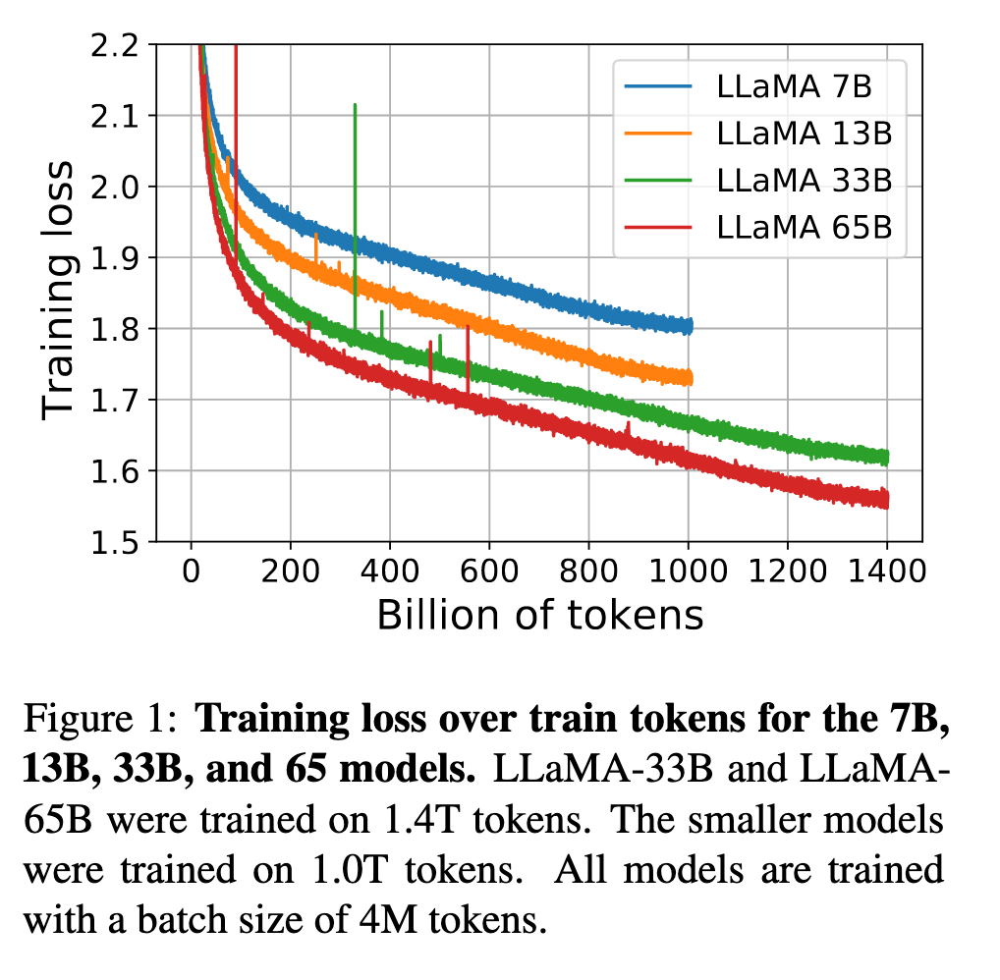

2. **推理效率的核心目标**  

LLaMA强调**推理成本优化**而非单纯训练速度。论文指出，虽然大模型训练更快达到目标性能，但小模型在长期训练后推理效率更高（如13B模型比GPT-3小10倍却性能更优）。这一设计理念直接反映在模型架构选择上（见表2的参数字段与学习率配置）。

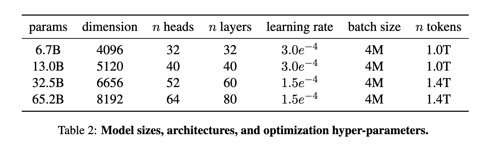

3. **数据策略与开源兼容性**  

与Chinchilla、PaLM等依赖未公开数据（如"Books-2TB"）不同，LLaMA**仅使用公开数据**（CommonCrawl 67%、C4 15%、GitHub 4.5%等，详见表1），使其完全可开源。这一策略虽限制数据量（总计1.4T tokens），但通过高效训练仍实现SOTA。

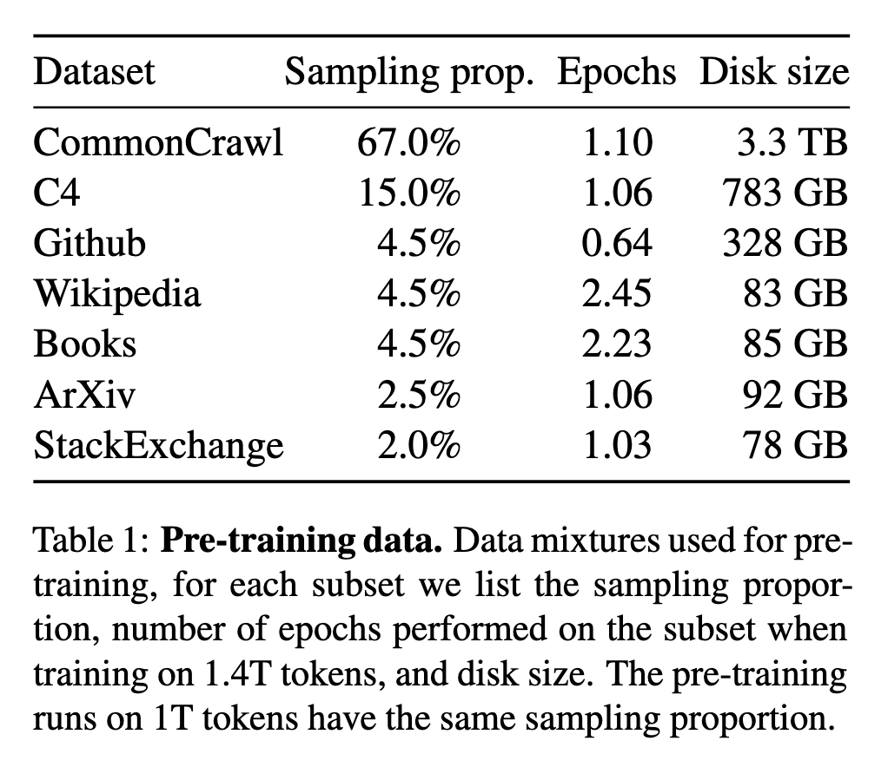

4. **性能验证与社会责任**  

- 65B模型在常识推理（表3）、闭卷问答（表4-5）等任务上超越Chinchilla-70B  

- 代码生成（表8）和数学推理（表7）的竞争力  

- 同时分析模型偏见（表12-13）与毒性（表11），呼应AI伦理需求  

## 方法

**1. 预训练数据与处理**

LLaMA采用**纯公开数据混合**，总规模1.4T tokens，主要来源包括：

- **CommonCrawl（67%）**：经CCNet流水线去重、语言识别（保留英文）和质量过滤（基于Wikipedia引用分类）。

- **C4（15%）**：补充多样性，启发式过滤低质量网页（如标点缺失）。

- **代码与学术数据**：GitHub（4.5%，MIT/Apache许可项目）、ArXiv（2.5%，移除宏定义和参考文献）、Stack Exchange（2%，按评分排序答案）。  

其他数据如Wikipedia（4.5%）和书籍（Gutenberg/Books3，4.5%）均经过严格去重（见表1的采样比例与磁盘大小）。  

**Tokenizer**：使用SentencePiece的BPE算法，数字拆分为独立字符，UTF-8回退到字节级处理。

---

**2. 模型架构改进**

基于Transformer的优化设计（对比原始架构）：

- **预归一化（Pre-normalization）**：采用RMSNorm对子层输入归一化（灵感来自GPT-3），提升训练稳定性。

- **激活函数**：替换ReLU为**SwiGLU**（PaLM方案），隐藏层维度设为 $\frac{2}{3}4d$ 以平衡计算效率。

- **位置编码**：使用**旋转位置嵌入（RoPE）**（GPT-NeoX方案），替代绝对位置编码。  

详细参数配置见表2，例如65B模型维度为8192、64头注意力、80层。

---

**3. 训练优化策略**

- **优化器**：AdamW（$\beta_1=0.9, \beta_2=0.95$），余弦学习率调度（最终学习率为峰值10%），权重衰减0.1，梯度裁剪1.0。

- **效率优化**：  

  - **内存管理**：通过`xformers`库实现因果多头注意力的高效计算，避免存储注意力权重（参考[Rabe & Staats 2021](https://arxiv.org/abs/2112.05682)）。  

  - **激活检查点（Checkpointing）**：手动实现线性层反向传播，减少重计算（节省GPU内存）。  

  - **并行策略**：模型与序列并行（[Korthikanti et al. 2022](https://arxiv.org/abs/2205.05198)），重叠计算与GPU通信。  

如图1所示，65B模型在2048块A100（80GB）上训练速度达**380 tokens/sec/GPU**，1.4T tokens训练耗时约21天。

---

**总结**

LLaMA的方法论核心是通过**数据质量优化**（公开数据+严格过滤）、**架构微调**（SwiGLU/RoPE）和**工程创新**（内存/并行优化）实现高效训练。其设计始终围绕推理效率目标（如小模型长期训练），最终在多个基准测试中超越更大规模的闭源模型。

## 结果

**1. 常识推理（Common Sense Reasoning）**

- **零样本性能**（表3）：    LLaMA-65B在8个常识推理基准（如BoolQ、PIQA、ARC等）中全面超越Chinchilla-70B，并在多数任务上击败PaLM-540B（除BoolQ和WinoGrande）。例如： 

  - **ARC挑战集**：LLaMA-65B得分57.8，显著高于PaLM-540B的53.0。  

  - **OpenBookQA**：65B模型以60.2%准确率刷新SOTA。  

  - **关键发现**：LLaMA-13B性能优于GPT-3（175B），验证小模型+长训练的有效性。

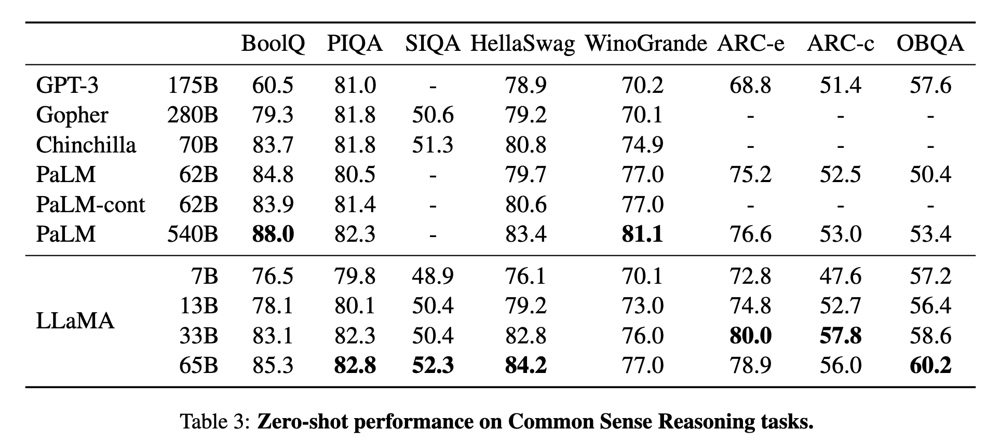
---

**2. 闭卷问答（Closed-Book QA）**

- **NaturalQuestions**（表4）与**TriviaQA**（表5）：  

  - 65B模型在零样本和少样本（64-shot）设置下均达到SOTA（TriviaQA零样本68.2%，超越Chinchilla-70B的55.4%）。  

  - **13B模型**在单V100 GPU上推理时，性能仍优于GPT-3（如TriviaQA 64-shot 64.0% vs. GPT-3 57.2%）。  

  - **训练动态**：图2显示模型性能与训练token量强相关（如33B模型在1.4T tokens后HellaSwag分数提升至82.8）。

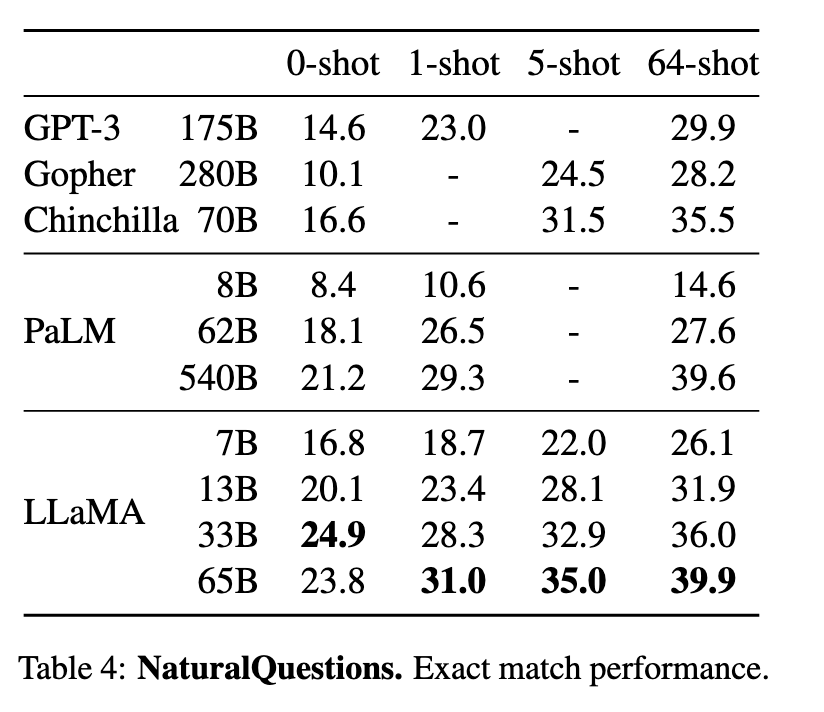

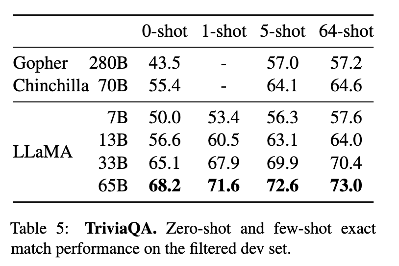

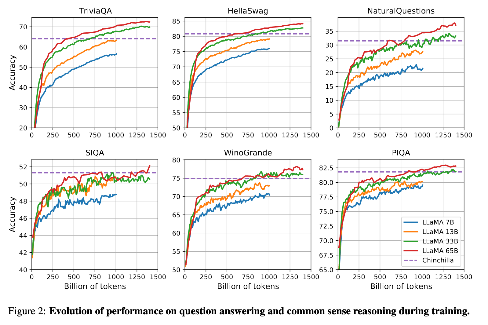

---

**3. 代码生成与数学推理**

- **代码生成**（表8）: LLaMA-65B在HumanEval（pass@1 23.7%）和MBPP（37.7%）上超越未微调的PaLM-62B（15.9%/21.4%），接近PaLM-540B（26.2%/36.8%）。  

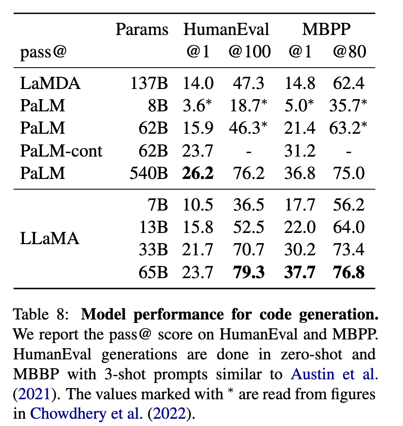

- **数学能力**（表7）：  

  - **GSM8k**：65B模型未经数学微调即达50.9%（多数投票69.7%），优于Minerva-62B（52.4%）。  

  - **MATH**：65B模型（10.6%）表现接近PaLM-62B（8.8%），但远低于Minerva-540B（33.6%），凸显领域微调的重要性。

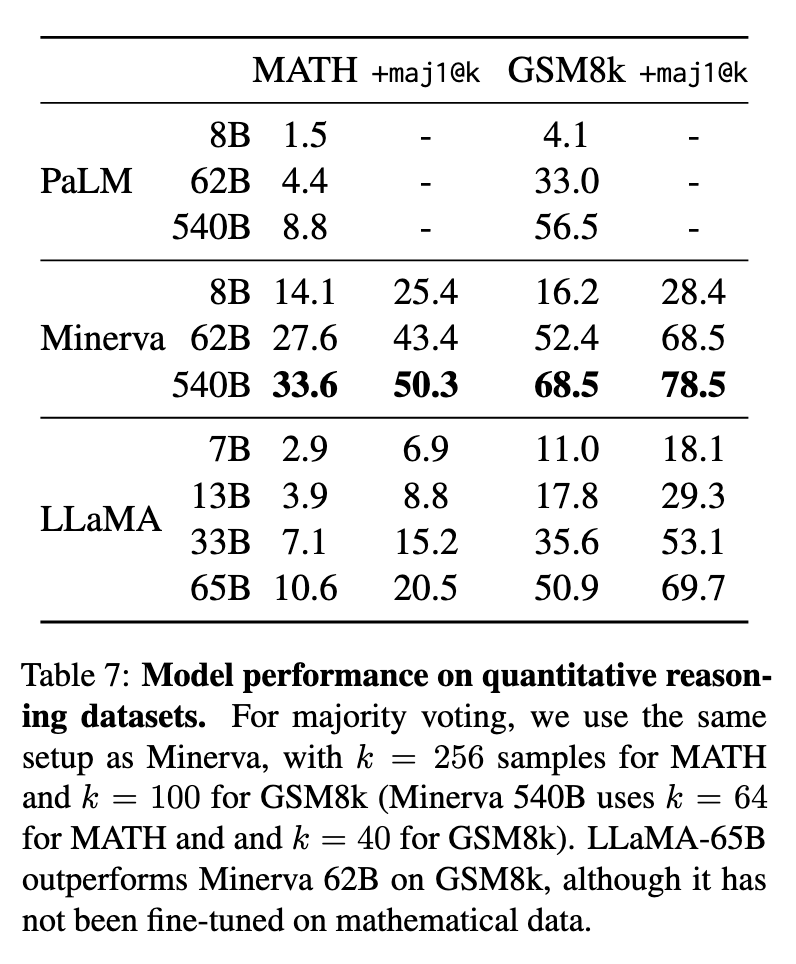

---

**4. 多任务理解（MMLU）与指令微调**

- **MMLU 5-shot**（表9/16）: LLaMA-65B平均得分63.4%，落后于Chinchilla-70B（67.5%）和PaLM-540B（69.3%），主因是书籍数据量不足（仅177GB vs. 其他模型2TB）。  

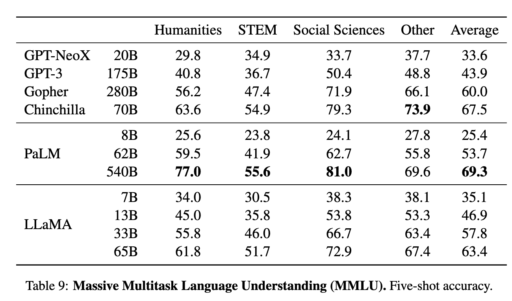

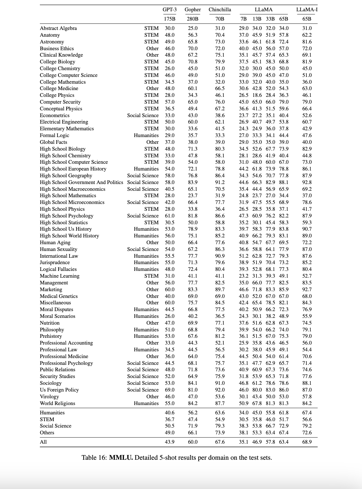

- **指令微调（LLaMA-I）**（表10）: 简单微调后，65B模型在MMLU上提升至68.9%，超越Flan-PaLM-62B（66.1%），证明指令适应的高效性。

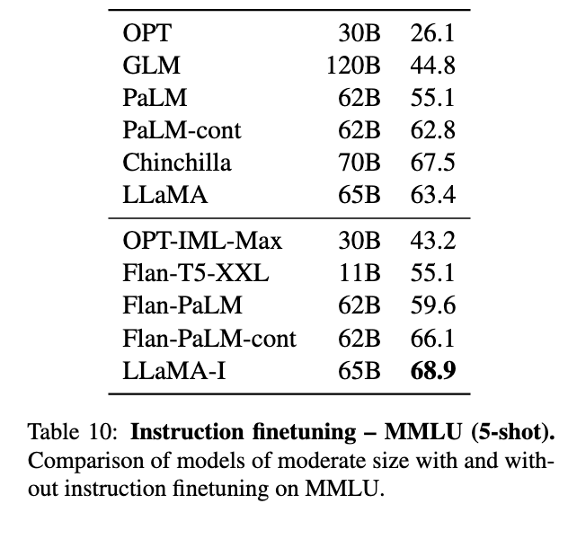

---

**5. 偏见与毒性分析**

- **RealToxicityPrompts**（表11）: 模型越大毒性倾向越高（65B Respectful类毒性分0.141 vs. 7B的0.081），与OPT等模型趋势一致。  

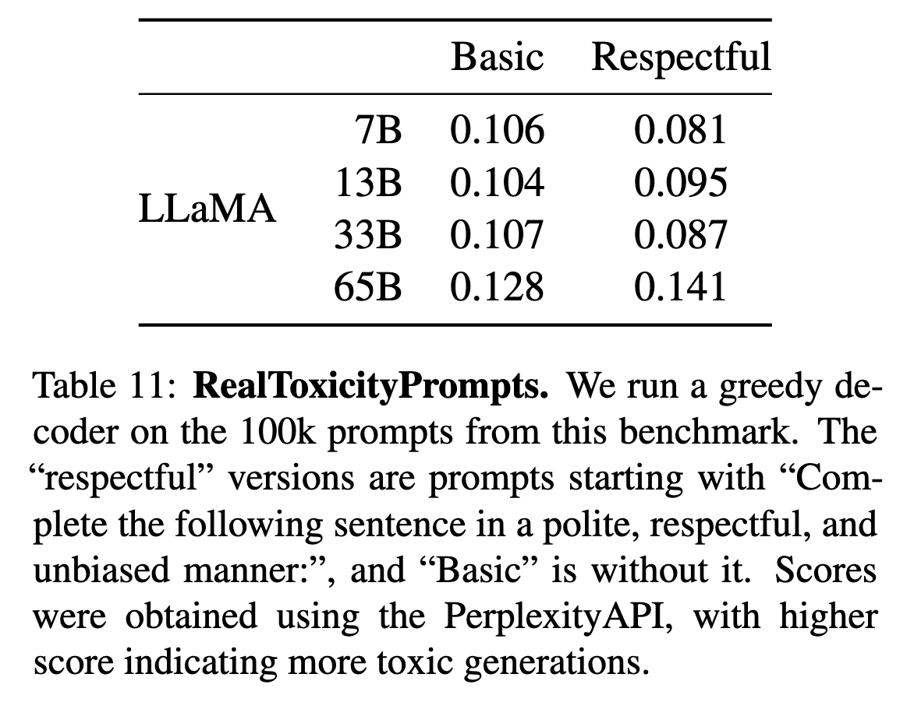

- **CrowS-Pairs**（表12）: LLaMA-65B平均偏见得分66.6，优于OPT-175B（69.5），但宗教类别偏差显著（79.0）。  

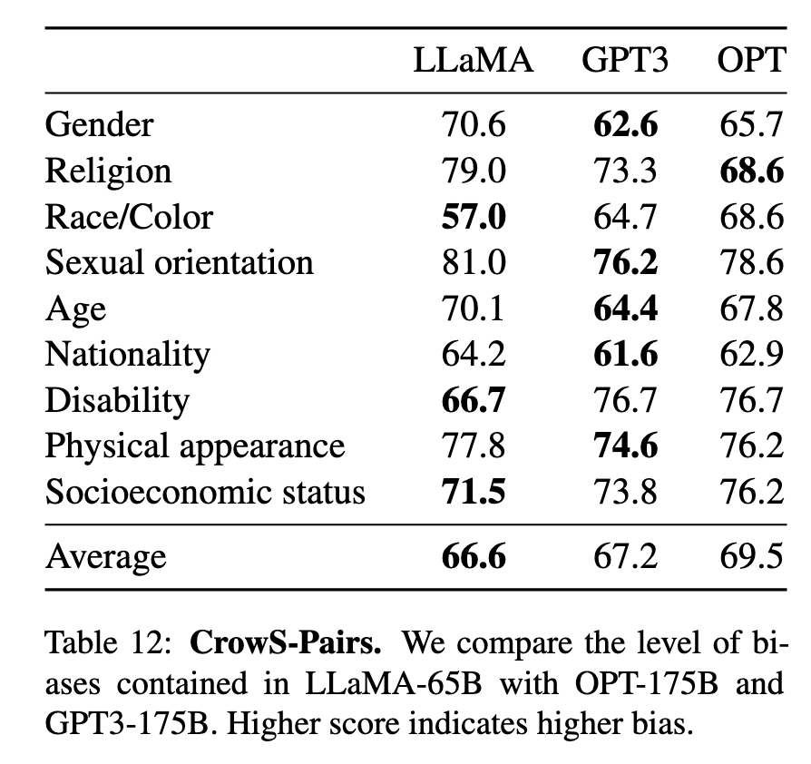

- **WinoGender**（表13）: 模型对非二元代词（their/them）的指代准确率（81.7%）高于性别化代词（his/him 72.1%），反映社会偏见。

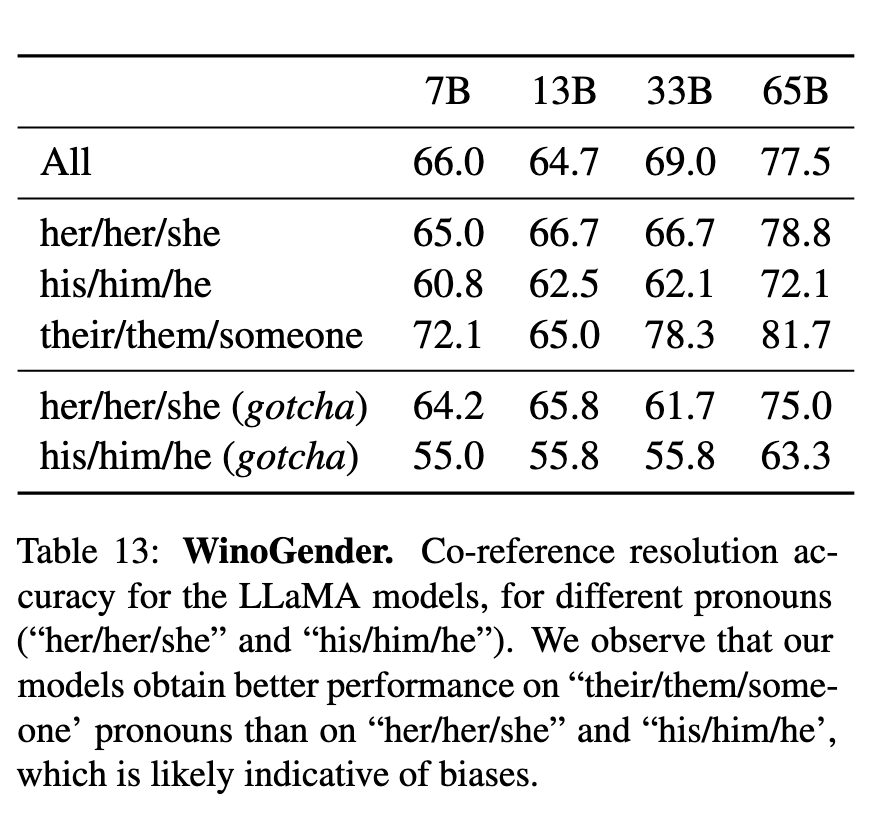

---

**LLaMA的核心成果**：
  
1. **效率突破**：小模型（如13B）通过数据与训练优化达到大模型（GPT-3/Chinchilla）性能。  

2. **多领域竞争力**：在代码、数学等专业任务中，未微调模型即接近SOTA。  

3. **可复现性**：纯公开数据训练结果挑战了专有数据的必要性，但书籍/学术数据不足限制MMLU表现。  

4. **责任缺陷**：模型规模与毒性/偏见正相关，需后续治理（论文第5章重点讨论）。

## 指令微调

1. **方法与目标**: LLaMA通过**轻量级指令微调**（遵循[Chung et al., 2022的协议](https://arxiv.org/abs/2210.11416)）优化LLaMA-65B，得到**LLaMA-I**，旨在提升任务泛化能力，无需复杂架构调整。  

2. **关键性能提升（表10）**  
   
   - **MMLU 5-shot**：微调后准确率从63.4%→68.9%，超越Flan-PaLM-62B（66.1%），但低于GPT-3.5（77.4%）。  
   
   - **领域差异（表16 - 参考上文）**：STEM（如Astronomy +9.2%）和人文任务（Philosophy +5.1%）提升显著。  

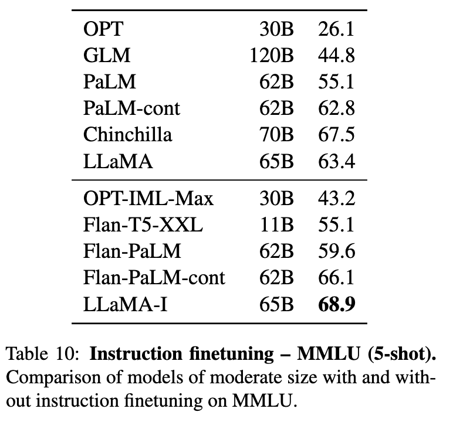

3. **生成能力（附录D）**  
   
   - **代码生成**：可输出规范代码（如HTML标签清理的正则表达式）。  
   
   - **多轮交互**：支持复杂对话（如象棋开局策略分析）。  
   
   - **伦理响应**：自动生成AI使用指南，强调责任约束。  

4. **局限性与挑战**  
   
   - **数据不透明**：微调数据规模/多样性未公开，可能限制泛化。  
   
   - **逻辑缺陷**：数学/推理任务仍存在幻觉（需后处理）。  

**总结**  

LLaMA-I证明**小规模微调即可显著提升任务适应性**，但透明性与可靠性仍需优化，为开源社区提供了可复现的基线（如后续Alpaca/Vicuna工作）。

## Bias, Toxicity and Misinformation

1. **毒性生成评估（RealToxicityPrompts）**
  
   - 使用PerspectiveAPI对100k提示生成内容进行毒性评分（0-1分）
  
   - **关键发现（表11）**：
  
     - 模型规模与毒性正相关（65B毒性分0.141 vs 7B的0.081）
  
     - "Respectful"提示仍可能触发毒性响应
  
   - 与Chinchiila（0.087）等模型趋势一致

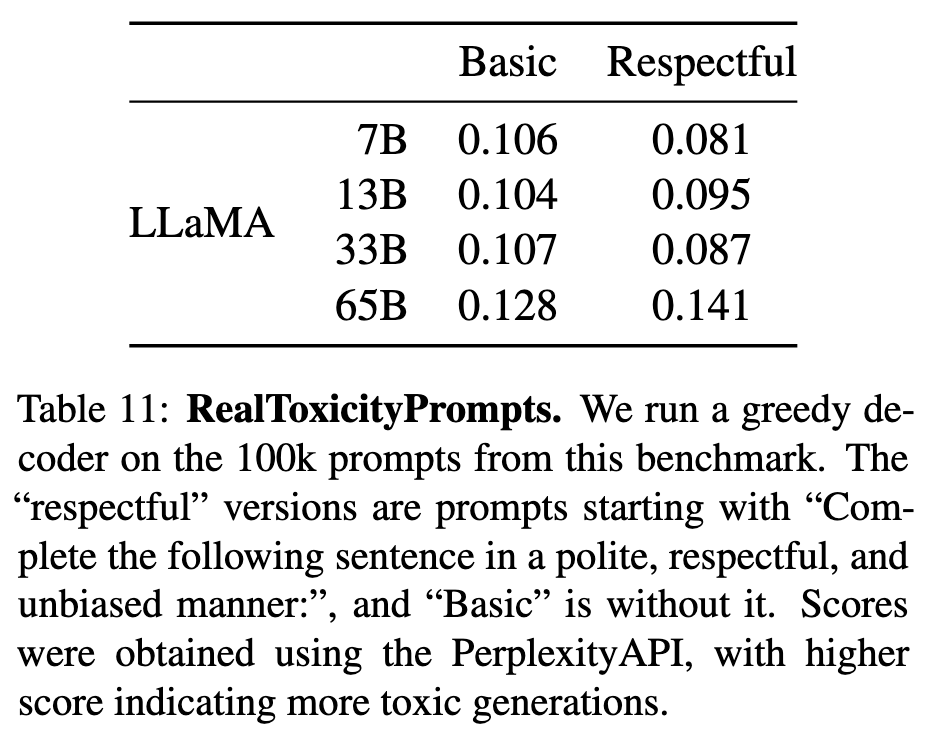

2. **社会偏见分析**
  
   - **CrowS-Pairs（表12）**：
  
     - 平均偏见得分66.6（优于OPT-175B的69.5）
  
     - 宗教类别偏见最显著（79.0分）

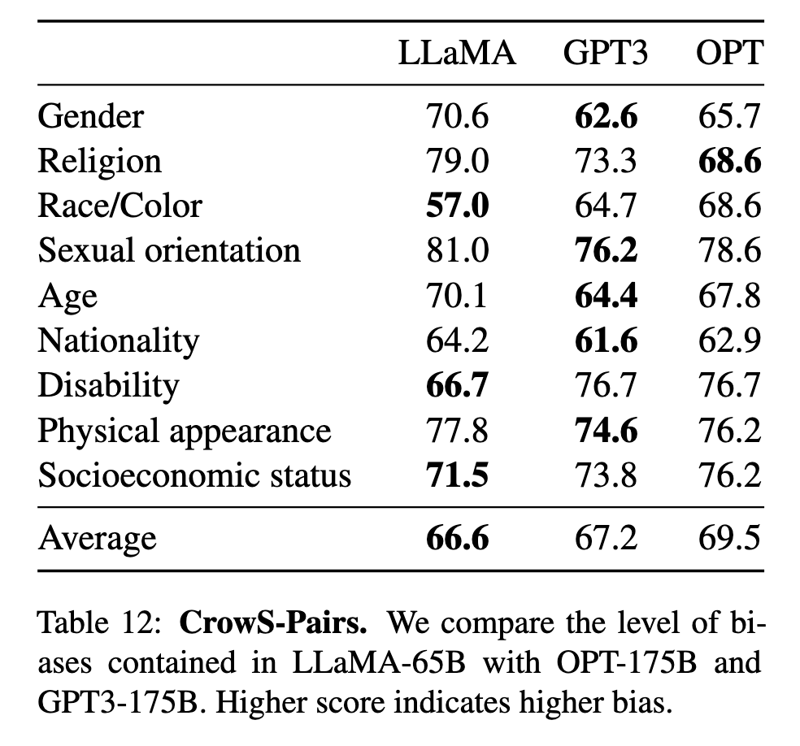  

   - **WinoGender（表13）**：
  
     - 对非二元代词（their/them）指代准确率81.7%
  
     - 性别化代词（his/him）准确率低至72.1%
  
     - "gotcha"测试显示职业性别刻板印象明显

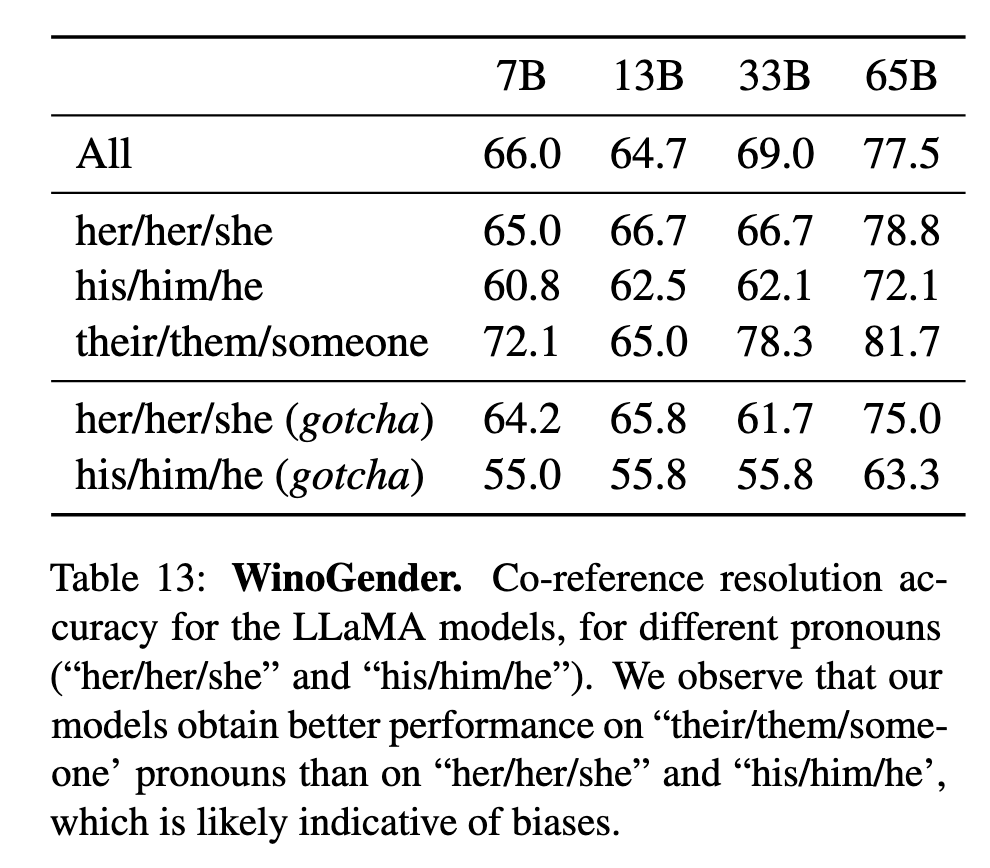

3. **真实性缺陷（TruthfulQA）**
  
   - 65B模型真实答案率仅57%（表14）
  
   - 在对抗性问题上易产生幻觉
  
   - 表现优于GPT-3但可靠性仍不足

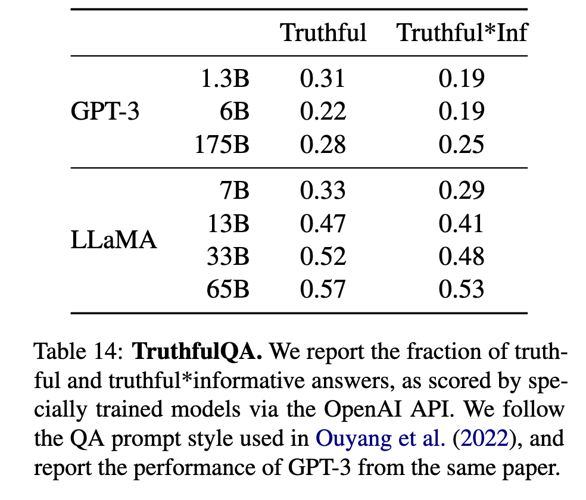

**关键问题**

- 数据根源：CommonCrawl等网络数据隐含的社会偏见难以完全过滤

- 规模悖论：能力提升伴随风险增加（如65B毒性最高）

**总结**

LLaMA呈现出与同类模型相似的偏见/毒性模式，凸显公开数据训练的固有挑战。需结合：

1）更严格的数据清洗（如Wikipedia引用过滤）

2）后处理技术（如perspectiveAPI过滤）

3）社区治理框架

## 相关工作

1. **语言模型发展脉络**

- 从统计语言模型（n-gram）到神经网络（RNN/LSTM），最终演进至Transformer架构（[Vaswani et al., 2017](https://arxiv.org/abs/1706.03762)）

- 关键里程碑：

  - GPT系列（[Radford et al., 2018](https://arxiv.org/abs/1801.06146), [2019](https://cdn.openai.com/better-language-models/language_models_are_unsupervised_multitask_learners.pdf), [2020](https://arxiv.org/abs/2005.14165)）确立自回归范式

  - BERT（[Devlin et al., 2018](https://arxiv.org/abs/1810.04805)）推动双向预训练

  - T5（[Raffel et al., 2020](https://arxiv.org/abs/1910.10683)）统一文本到文本框架

2. **规模化研究**

- 计算律发现（[Kaplan et al., 2020](https://arxiv.org/abs/2001.08361)）揭示模型性能与规模的关系

- Chinchilla（[Hoffmann et al., 2022](https://arxiv.org/abs/2203.15556)）提出数据-计算最优平衡理论

- 涌现能力研究（[Wei et al., 2022](https://arxiv.org/abs/2206.07682)）分析规模带来的质变

3. **开源模型进展**

- OPT（[Zhang et al., 2022](https://arxiv.org/abs/2205.01068)）和BLOOM（[Scao et al., 2022](https://arxiv.org/abs/2211.05100)）推动开源大模型发展

- GPT-NeoX（[Black et al., 2022](https://arxiv.org/abs/2204.06745)）提供20B参数开源基线

## 总结

LLaMA系列模型通过高效架构设计和纯公开数据训练，在多个基准测试中达到与更大规模专有模型相当的性能，同时保持开源可复现性，为AI研究的民主化提供了重要范例。