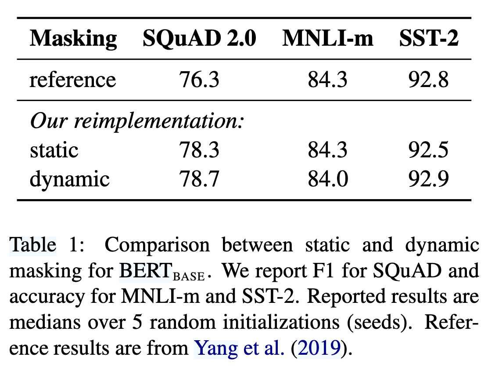
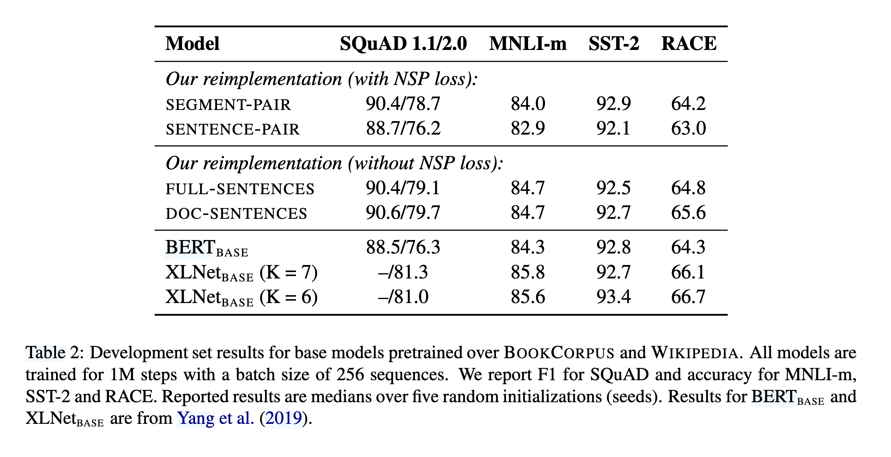
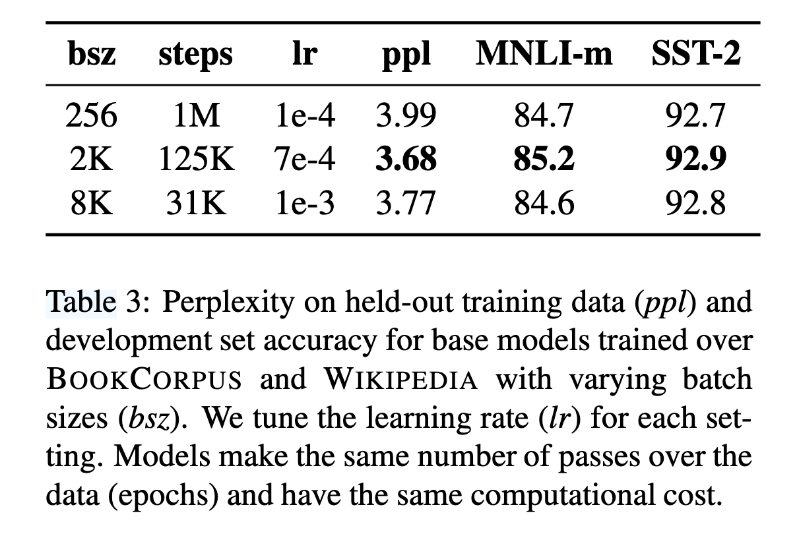
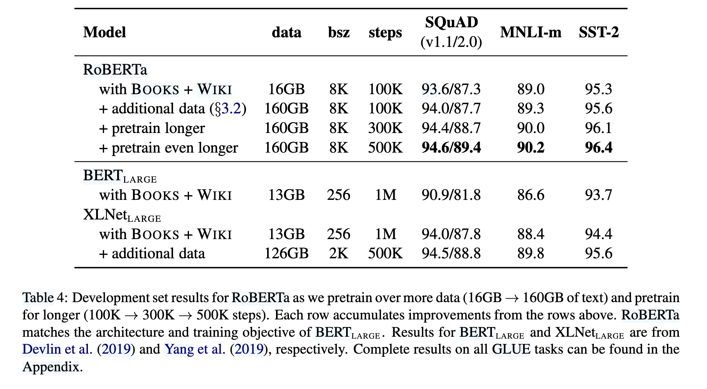
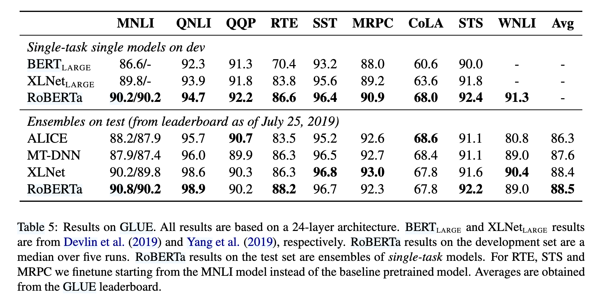
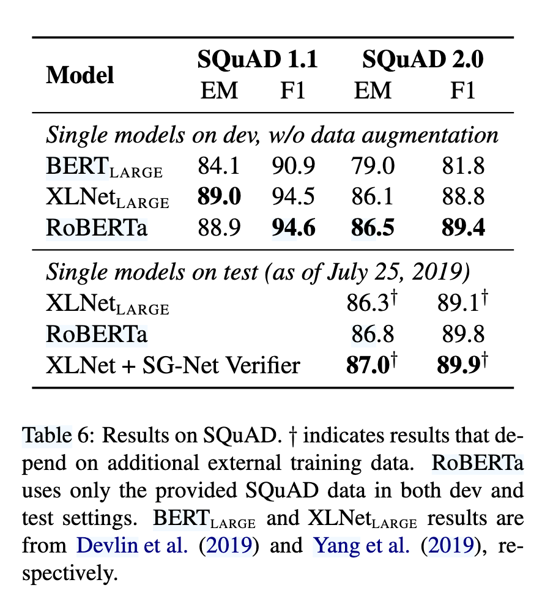

`RoBERTa 论文`
 
<!-- more -->

> 论文链接: [RoBERTa: A Robustly Optimized BERT Pretraining Approach](https://arxiv.org/abs/1907.11692)

## 摘要

RoBERTa是一项针对BERT预训练方法的优化研究，通过系统性的实验发现BERT存在训练不足的问题，并提出了一系列改进措施。这些改进包括更长的训练时间、更大的批次规模、更多的数据、移除下一句预测（NSP）目标、使用更长的序列以及动态调整掩码模式。实验结果表明，优化后的RoBERTa在多个基准测试（如GLUE、RACE和SQuAD）上达到了最先进的性能，甚至超越了后续提出的模型。研究强调了预训练中设计选择和数据规模的重要性，同时表明BERT的掩码语言模型目标在优化后仍具有竞争力。相关模型和代码已公开供进一步研究。

## 引言

RoBERTa 是一项针对 BERT 预训练方法的复制研究，旨在通过系统性的实验评估不同超参数和数据规模对模型性能的影响。研究发现，BERT 的训练存在显著不足，通过优化训练策略（如延长训练时间、增大批次规模、使用更多数据等），RoBERTa 能够匹配甚至超越后续提出的多种模型（如 XLNet）。  

论文的主要改进包括：  

1. **动态掩码（Dynamic Masking）**（对比静态掩码，如表 1 显示动态掩码在 SQuAD 2.0 和 SST-2 任务上表现更优）； 

2. **移除下一句预测（NSP）目标**（实验表明 NSP 对性能影响有限，甚至可能损害模型表现，如表 2 对比不同输入格式）；  

3. **更大批次训练**（表 3 显示增大批次规模可提升模型困惑度和下游任务准确率）；  

4. **更高效的字节级 BPE 编码**（减少未知词影响）。  

此外，RoBERTa 引入了新数据集 **CC-News**（76GB），并验证了数据规模对预训练的关键作用。最终，RoBERTa 在 GLUE、SQuAD 和 RACE 上取得 SOTA 结果（如表 4、5、6），证明 BERT 的掩码语言模型目标在优化后仍具竞争力。

## 背景

RoBERTa 基于 BERT 的架构和训练方法，但通过优化关键设计选择提升性能。BERT 采用 Transformer 结构，输入由两个文本片段（Segment）组成，并添加特殊标记（如 `[CLS]`、`[SEP]`）。其预训练任务包括：  

1. **掩码语言模型（MLM）**：随机选择 15% 的输入 token，其中 80% 替换为 `[MASK]`，10% 保持不变，10% 替换为随机 token。原始 BERT 使用静态掩码（即预处理时固定掩码模式），而 RoBERTa 改用动态掩码（每次输入时重新生成掩码），实验证明动态掩码效果更优（如表 1）。  

2. **下一句预测（NSP）**：判断两个片段是否连续。尽管 BERT 认为 NSP 对下游任务（如自然语言推理）有帮助，但 RoBERTa 的实验表明移除 NSP 可能提升性能（如表 2 对比不同输入格式）。  

3. **优化策略**：  
   
   - 使用 Adam 优化器（$\beta_1=0.9$, $\beta_2=0.999$, $\epsilon=1e-6$）。  

   - 学习率采用线性预热（10,000 步）和衰减策略。  
   
   - 原始 BERT 训练 1M 步，批次大小 256，序列长度 512。  

4. **数据**：BERT 使用 BookCorpus 和 Wikipedia（共 16GB），而 RoBERTa 扩展至更大规模数据（如 CC-News、OpenWebText 等，总计 160GB）。  

RoBERTa 通过调整这些关键因素（如动态掩码、移除 NSP、增大批次和数据规模），显著提升了 BERT 的预训练效率和下游任务表现。

## 方法

**1. 模型实现与优化**

RoBERTa 基于 fairseq 工具包重新实现了 BERT，并优化了训练细节：

- **学习率调整**：相比原始 BERT 的固定学习率（1e-4），RoBERTa 针对不同设置调整峰值学习率和预热步数。

- **Adam 优化器改进**：发现 Adam 的 $\epsilon$ 项对训练稳定性影响较大，调整 $\beta_2=0.98$ 以提升大批次训练的稳定性（参考 Section 3.1）。

- **序列长度**：始终使用完整长度序列（512 tokens），而原始 BERT 会在训练初期使用较短序列。

**2. 训练硬件与效率**

- 采用 **混合精度训练**（FP16），在配备 8×32GB NVIDIA V100 GPU 的 DGX-1 机器上进行分布式训练，利用 Infiniband 互联提升效率。

**3. 数据配置**

RoBERTa 使用了 **5 个英语语料库**，总计超过 160GB 文本，包括：

1. **BookCorpus + Wikipedia**（16GB，原始 BERT 数据）

2. **CC-News**（76GB，新闻数据）

3. **OpenWebText**（38GB，Reddit 高赞网页内容）

4. **Stories**（31GB，故事类文本）  

通过控制数据规模（如对比 16GB vs. 160GB），RoBERTa 验证了更多数据能显著提升模型性能（参考 Section 5 和 Table 4）。

**4. 评估基准**

实验在三大基准任务上进行：

1. **GLUE**：涵盖 9 项自然语言理解任务（如 MNLI、SST-2 等），采用单任务微调（非多任务学习）。

2. **SQuAD**：  

   - V1.1：答案必存在于上下文中。  

   - V2.0：支持无答案问题，RoBERTa 增加了二分类器判断可答性（参考 Section 3.3）。  

3. **RACE**：长文本阅读理解任务，需从 4 个选项中选择正确答案，测试模型的长距离依赖能力。

**关键实验设计**

- **动态掩码 vs. 静态掩码**（Table 1）：动态掩码在 SQuAD 和 SST-2 上表现更优。  

- **NSP 消融实验**（Table 2）：移除 NSP 后，使用单文档连续句子（doc-sentences）的格式效果最佳。  

- **大批次训练**（Table 3）：批次增大至 8K 时，模型困惑度（PPL）和下游任务准确率均提升。  

这些实验设置共同支撑了 RoBERTa 的优化策略，并为其在后续章节中的 SOTA 性能奠定了基础。

