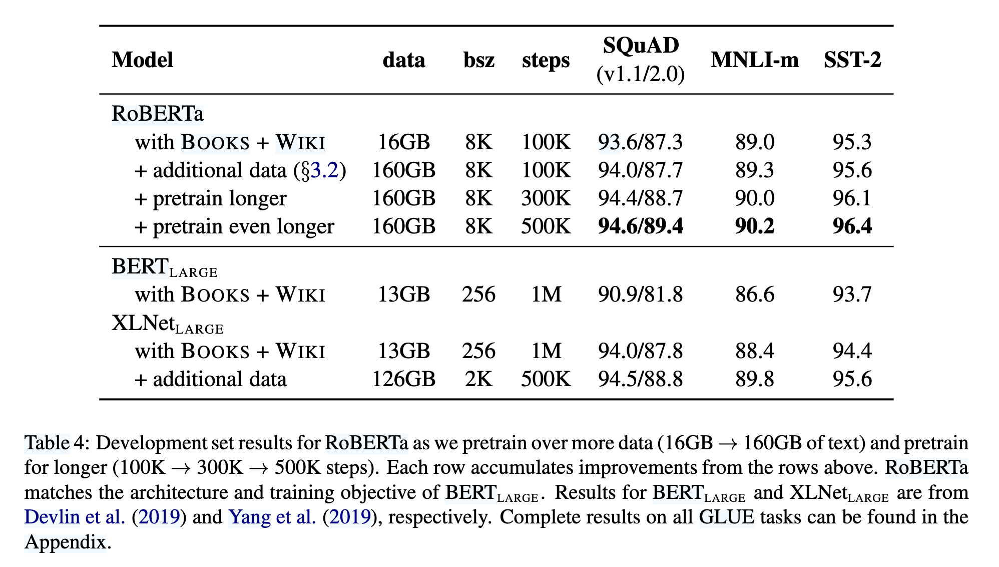
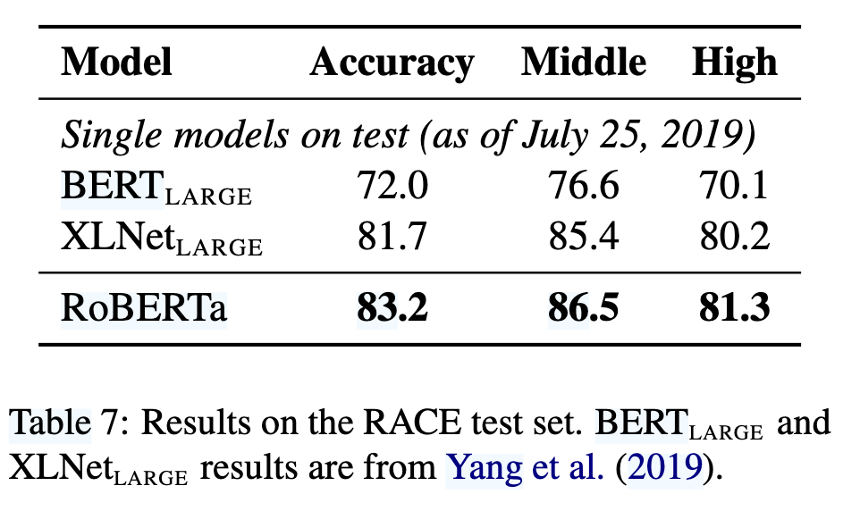

`RoBERTa 论文`
 
<!-- more -->

> 论文链接: [RoBERTa: A Robustly Optimized BERT Pretraining Approach](https://arxiv.org/abs/1907.11692)

## 摘要

RoBERTa是一项针对BERT预训练方法的优化研究，通过系统性的实验发现BERT存在训练不足的问题，并提出了一系列改进措施。这些改进包括更长的训练时间、更大的批次规模、更多的数据、移除下一句预测（NSP）目标、使用更长的序列以及动态调整掩码模式。实验结果表明，优化后的RoBERTa在多个基准测试（如GLUE、RACE和SQuAD）上达到了最先进的性能，甚至超越了后续提出的模型。研究强调了预训练中设计选择和数据规模的重要性，同时表明BERT的掩码语言模型目标在优化后仍具有竞争力。相关模型和代码已公开供进一步研究。

## 引言

RoBERTa 是一项针对 BERT 预训练方法的复制研究，旨在通过系统性的实验评估不同超参数和数据规模对模型性能的影响。研究发现，BERT 的训练存在显著不足，通过优化训练策略（如延长训练时间、增大批次规模、使用更多数据等），RoBERTa 能够匹配甚至超越后续提出的多种模型（如 XLNet）。  

论文的主要改进包括：  

1. **动态掩码（Dynamic Masking）**（对比静态掩码，如表 1 显示动态掩码在 SQuAD 2.0 和 SST-2 任务上表现更优）； 

2. **移除下一句预测（NSP）目标**（实验表明 NSP 对性能影响有限，甚至可能损害模型表现，如表 2 对比不同输入格式）；  

3. **更大批次训练**（表 3 显示增大批次规模可提升模型困惑度和下游任务准确率）；  

4. **更高效的字节级 BPE 编码**（减少未知词影响）。  

此外，RoBERTa 引入了新数据集 **CC-News**（76GB），并验证了数据规模对预训练的关键作用。最终，RoBERTa 在 GLUE、SQuAD 和 RACE 上取得 SOTA 结果（如表 4、5、6），证明 BERT 的掩码语言模型目标在优化后仍具竞争力。

## 背景

RoBERTa 基于 BERT 的架构和训练方法，但通过优化关键设计选择提升性能。BERT 采用 Transformer 结构，输入由两个文本片段（Segment）组成，并添加特殊标记（如 `[CLS]`、`[SEP]`）。其预训练任务包括：  

1. **掩码语言模型（MLM）**：随机选择 15% 的输入 token，其中 80% 替换为 `[MASK]`，10% 保持不变，10% 替换为随机 token。原始 BERT 使用静态掩码（即预处理时固定掩码模式），而 RoBERTa 改用动态掩码（每次输入时重新生成掩码），实验证明动态掩码效果更优（如表 1）。  

2. **下一句预测（NSP）**：判断两个片段是否连续。尽管 BERT 认为 NSP 对下游任务（如自然语言推理）有帮助，但 RoBERTa 的实验表明移除 NSP 可能提升性能（如表 2 对比不同输入格式）。  

3. **优化策略**：  
   
   - 使用 Adam 优化器（$\beta_1=0.9$, $\beta_2=0.999$, $\epsilon=1e-6$）。  

   - 学习率采用线性预热（10,000 步）和衰减策略。  
   
   - 原始 BERT 训练 1M 步，批次大小 256，序列长度 512。  

4. **数据**：BERT 使用 BookCorpus 和 Wikipedia（共 16GB），而 RoBERTa 扩展至更大规模数据（如 CC-News、OpenWebText 等，总计 160GB）。  

RoBERTa 通过调整这些关键因素（如动态掩码、移除 NSP、增大批次和数据规模），显著提升了 BERT 的预训练效率和下游任务表现。

## 实验步骤

**1. 模型实现与优化**

RoBERTa 基于 fairseq 工具包重新实现了 BERT，并优化了训练细节：

- **学习率调整**：相比原始 BERT 的固定学习率（1e-4），RoBERTa 针对不同设置调整峰值学习率和预热步数。

- **Adam 优化器改进**：发现 Adam 的 $\epsilon$ 项对训练稳定性影响较大，调整 $\beta_2=0.98$ 以提升大批次训练的稳定性（参考 Section 3.1）。

- **序列长度**：始终使用完整长度序列（512 tokens），而原始 BERT 会在训练初期使用较短序列。

---

**2. 训练硬件与效率**

- 采用 **混合精度训练**（FP16），在配备 8×32GB NVIDIA V100 GPU 的 DGX-1 机器上进行分布式训练，利用 Infiniband 互联提升效率。

---

**3. 数据配置**

RoBERTa 使用了 **5 个英语语料库**，总计超过 160GB 文本，包括：

1. **BookCorpus + Wikipedia**（16GB，原始 BERT 数据）

2. **CC-News**（76GB，新闻数据）

3. **OpenWebText**（38GB，Reddit 高赞网页内容）

4. **Stories**（31GB，故事类文本）  

通过控制数据规模（如对比 16GB vs. 160GB），RoBERTa 验证了更多数据能显著提升模型性能（参考 Section 5 和 Table 4）。

---

**4. 评估基准**

实验在三大基准任务上进行：

1. **GLUE**：涵盖 9 项自然语言理解任务（如 MNLI、SST-2 等），采用单任务微调（非多任务学习）。

2. **SQuAD**：  

   - V1.1：答案必存在于上下文中。  

   - V2.0：支持无答案问题，RoBERTa 增加了二分类器判断可答性（参考 Section 3.3）。  

3. **RACE**：长文本阅读理解任务，需从 4 个选项中选择正确答案，测试模型的长距离依赖能力。

## 训练步骤分析

1. **静态与动态掩码（Static vs. Dynamic Masking）**  

   - 原始BERT使用静态掩码，即在数据预处理阶段生成掩码模式并固定，通过复制数据来增加多样性。  

   - RoBERTa改为动态掩码，每次输入序列时生成新的掩码模式。实验表明，动态掩码性能略优于静态掩码（如表1所示），且更高效。因此，后续实验均采用动态掩码。

在BERT和RoBERTa的预训练中，**掩码（Masking）** 是 **Masked Language Modeling (MLM)** 任务的核心步骤，即随机遮盖输入文本的部分单词，并让模型预测这些被遮盖的单词。  

> **1. 静态掩码（Static Masking）**
>
> - **原始BERT的做法**：  
>
>  - 在数据预处理阶段，**一次性** 对每个句子随机选择15%的单词进行掩码（其中80%替换为 `[MASK]`，10%保持不变，10%替换为随机单词）。  
>
>  - 由于BERT训练时会多次遍历数据（如40个epoch），为了避免每次训练时看到相同的掩码模式，BERT采用 **数据复制** 的方法：  
>
>    - 将训练数据复制 **10份**，每份采用不同的随机掩码模式。  
>
>    - 这样，每个句子在训练过程中会被看到 **4次**（40 epochs / 10 copies = 4次），但每次掩码不同。  
>
>  - **问题**：  
>
>    - 数据复制增加了存储和计算开销。  
>
>    - 由于掩码模式是固定的（尽管有10种变体），模型可能过拟合这些特定的掩码模式，影响泛化能力。  

> **2. 动态掩码（Dynamic Masking）**
>
> - **RoBERTa的改进**：  
>
>   - **不再预先固定掩码模式**，而是在 **每次输入模型时动态生成掩码**。  
>
>   - 例如，同一个句子在训练的不同批次（batch）中，可能会被掩码不同的单词。  
>
> - **优势**：  
>
>    1. **减少存储开销**：无需复制数据，节省内存。  
>
>    2. **增加多样性**：模型在训练过程中看到更多的掩码变体，提升泛化能力。  
>
>    3. **更适合长训练周期**：当训练步数远超过BERT的1M步时（如RoBERTa训练500K步），动态掩码能持续提供新的掩码模式，避免过拟合。  

2. **输入格式与下一句预测（NSP）**  

   - 原始BERT使用“Segment-pair+NSP”输入格式，包含两个文档片段和NSP损失。  

   - RoBERTa对比了多种输入格式（如表2所示）：

     - **Sentence-pair+NSP**：使用单句对，性能下降，可能因无法学习长距离依赖。  

     - **Full-sentences**：连续句子打包，去除NSP损失，性能优于原始BERT。  

     - **Doc-sentences**：限制输入来自同一文档，性能略优于Full-sentences，但因批次大小可变，最终选择Full-sentences格式。  

   - 实验表明，**去除NSP损失**不仅未降低性能，反而有所提升，这与原始BERT的结论相反。

3. **大批量训练（Large Batch Training）**  

   - 原始BERT使用256的批次大小训练1M步。RoBERTa尝试增大批次至2K和8K，并调整学习率（如表3所示）。  

   - 结果显示，大批量训练（如8K）在保持相同计算成本下，能提升掩码语言模型的困惑度和下游任务性能。因此，RoBERTa采用8K批次进行训练。

4. **文本编码（Text Encoding）**  

   - 原始BERT使用30K的字符级BPE词汇表。  

   - RoBERTa改用基于字节的BPE（50K词汇表），无需额外预处理。虽然早期实验显示性能略有下降，但其通用性优势使其成为最终选择。

这些改进共同构成了RoBERTa的核心优化策略，显著提升了模型性能（如表4所示）。实验结果表明，BERT原始设计存在优化空间，而RoBERTa通过系统性的调整，在GLUE、SQuAD和RACE等任务上达到了新的 state-of-the-art 水平。

## RoBERTa核心改进总结  

RoBERTa（**Robustly Optimized BERT Approach**）是对BERT预训练过程的系统性优化，通过调整训练策略、数据规模和模型设置，显著提升了性能。其主要改进包括：  

#### **1. 训练策略优化**  

- **动态掩码（Dynamic Masking）**：  

  - 原始BERT使用静态掩码（预处理阶段固定掩码模式），而RoBERTa改为**每次输入时动态生成掩码**，减少存储开销并提升泛化能力（见表1）。  

  - **结果**：动态掩码在SQuAD 2.0和SST-2任务上表现略优（F1 78.7 vs. 78.3）。  

- **移除NSP任务（Next Sentence Prediction）**：  

  - BERT使用NSP任务（判断两个句子是否连续），但实验表明**去除NSP后性能反而提升**（见表2）。  

  - RoBERTa改用**Full-sentences**（连续句子打包，不跨文档）或**Doc-sentences**（单文档内句子打包），后者效果略优但计算复杂，最终选择Full-sentences。  

- **大批量训练（Large Batch Training）**：  

  - BERT使用256的批次大小，RoBERTa增大至**8K**，并调整学习率（如1e-3）。  

  - **结果**：大批量训练提升MLM困惑度（3.77 vs. 3.99）和下游任务准确率（MNLI-m 84.6 vs. 84.7）（见表3）。  

- **字节级BPE（Byte-level BPE）**：  

  - 改用50K词汇表的字节级BPE编码，减少未登录词（OOV）问题，虽对部分任务性能略有影响，但通用性更强。  

---

#### **2. 数据规模与训练时长**  

- **更大规模数据**：  

  - BERT训练数据：16GB（BookCorpus + Wikipedia）。  

  - RoBERTa新增CC-News、OpenWebText等，总数据量达**160GB**。  

  - **结果**：数据量增加后，SQuAD 2.0 F1从87.3提升至87.7（见表4）。  

- **更长训练步数**：  

  - BERT训练1M步，RoBERTa延长至**300K~500K步**（计算成本相当，因批次更大）。  

  - **结果**：500K步时，SQuAD 2.0 F1达89.4，超越XLNet（88.8）（见表4）。  

---

#### **3. 性能表现（关键结果）**  

- **GLUE基准**：  

  - **单任务微调**：RoBERTa在9项任务中全面超越BERT和XLNet（MNLI-m 90.2 vs. 89.8）（见表5）。  

  - **排行榜提交**：以**88.5平均分**刷新SOTA，其中4项任务（MNLI、QNLI、RTE、STS-B）领先（见表5）。  

- **SQuAD 2.0**：  

  - 仅用SQuAD数据（无外部数据），F1达89.8，超越XLNet（89.1）（见表6）。  

- **RACE阅读理解**：  

  - 准确率83.2%，显著高于BERT（72.0）和XLNet（81.7）（见表7）。  

---

#### **4. 结论与启示**  

- **BERT原始设计未充分优化**：RoBERTa证明**更长训练、更大批次、更多数据**是关键。  

- **NSP任务非必要**：去除后性能反而提升，与BERT结论相反。  

- **动态掩码与大批量训练**：提升效率的同时改善泛化能力。  

- **开源贡献**：发布模型、代码及新数据集CC-News。  

RoBERTa的改进表明，**BERT的MLM目标本身足够强大**，只需优化训练策略即可达到SOTA，无需复杂结构调整。

## 相关工作

早期方法如ELMo、GPT和BERT通过不同训练目标（如语言建模、机器翻译、掩码语言建模）取得了显著进展，而后续工作通过多任务微调、实体嵌入、跨度预测和自回归预训练（如XLNet）进一步提升了性能。作者强调，这些改进通常依赖于更大模型和更多数据（如XLNet使用10倍于BERT的数据），而RoBERTa的目标是通过系统性地复现、简化和优化BERT的训练过程，为这些方法提供一个更清晰的性能基准，从而帮助社区更好地理解不同改进的相对贡献。

## 总结

通过系统优化BERT的预训练策略（包括动态掩码、移除NSP任务、增大批次和训练数据、延长训练时间），RoBERTa在GLUE、SQuAD和RACE任务上实现了SOTA性能，证明了BERT原始设计的潜力尚未被充分挖掘；

同时，研究揭示了模型性能提升的关键因素并非复杂结构改动，而是训练策略和数据规模的优化，相关代码、模型和CC-News数据集已开源以促进后续研究。