`利用Pytorch从"零"实现Bert`

<!-- more -->

> TinyBert 源码链接:

## Bert 是什么 ？

BERT 全称为 **Bidirectional Encoder Representation from Transformer**，是 **Google** 以无监督的方式利用大量无标注文本「炼成」的语言模型，其架构为 Transformer 中的 Encoder（**BERT = Encoder of Transformer**）。

以往为了解决不同的 NLP 任务，我们会为该任务设计一个最合适的神经网络架构并做训练，不同的 NLP 任务通常需要不同的模型，而设计这些模型并测试其 performance 是非常耗成本的（人力，时间，计算资源）。**如果有一个能直接处理各式 NLP 任务的通用架构该有多好？**

随着时代演进，不少人很自然地有了这样子的想法，而 BERT 就是其中一个将此概念付诸实践的例子，Google 在预训练 BERT 时让它同时进行两个任务：

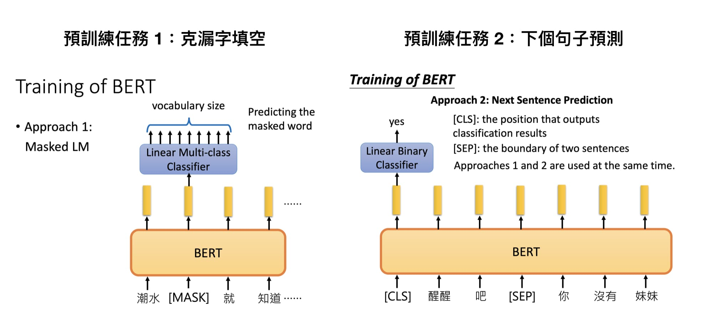

1. 漏字填空，即完型填空 (Masked Language Model)

2. 判断第 2 个句子在原始本文中是否跟第 1 个句子相接（Next Sentence Prediction）

### Masked Language Model

在 BERT 中，Masked LM（Masked Language Model）构建了语言模型，简单来说，就是**随机遮盖或替换**一句话里面的任意字或词，然后让模型通过上下文预测那一个被遮盖或替换的部分，之后做 Loss 的时候也**只计算被遮盖部分的 Loss**，这其实是一个很容易理解的任务，实际操作如下：

1. 随机把一句话中 15% 的 token（字或词）替换成以下内容：
   
    - 这些 token 有 80% 的几率被替换成 [MASK]，例如 my dog is hairy→my dog is [MASK]

    - 有 10% 的几率被替换成任意一个其它的 token，例如 my dog is hairy→my dog is apple

    - 有 10% 的几率原封不动，例如 my dog is hairy→my dog is hairy

2. 之后让模型预测和还原被遮盖掉或替换掉的部分，计算损失的时候，只计算在第 1 步里被随机遮盖或替换的部分，其余部分不做损失，其余部分无论输出什么东西，都无所谓。

这样做的好处是，BERT 并不知道 [MASK] 替换的是哪一个词，而且任何一个词都有可能是被替换掉的，比如它看到的 apple 可能是被替换的词。这样**强迫模型在编码当前时刻词的时候不能太依赖当前的词，而要考虑它的上下文，甚至根据上下文进行 "纠错"**。比如上面的例子中，模型在编码 apple 时，根据上下文 my dog is，应该把 apple 编码成 hairy 的语义而不是 apple 的语义。

### Next Sentence Prediction

我们首先拿到属于上下文的一对句子，也就是两个句子，之后我们要在这两个句子中加一些特殊的 token：**[CLS]上一句话[SEP]下一句话[SEP]**。也就是在句子开头加一个 [CLS]，在两句话之间和句末加 [SEP]，具体地如下图所示：

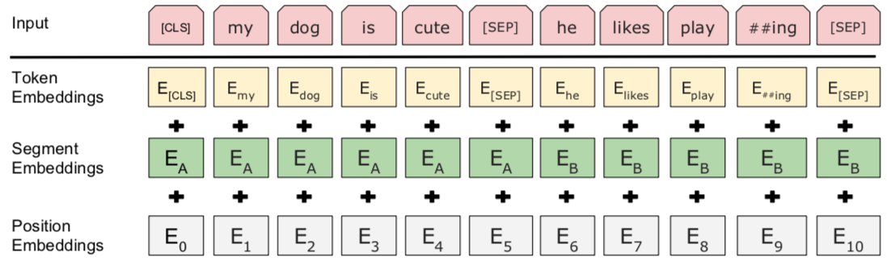

可以看到，上图中的两句话明显是连续的。如果现在有这么一句话 **[CLS]我的狗很可爱[SEP]企鹅不擅长飞行[SEP]**，可见这两句话就不是连续的。

**Token Embedding** 就是正常的词向量，即 PyTorch 中的 nn.Embedding()

**Segment Embedding** 的作用是用 embedding 的信息让模型分开上下句，我们**给上句的 token 全 0，下句的 token 全 1**，让模型得以判断上下句的起止位置，例如:

```python
[CLS]我的狗很可爱[SEP]企鹅不擅长飞行[SEP]
 0   0 0 0 0 0 0 0  1 1 1 1 1 1 1 1
```
Position Embedding 和 Transformer 中的不一样，不是三角函数，而是学习出来的。

### Multi-Task Learning

BERT 预训练阶段实际上是将上述两个任务结合起来，同时进行，然后将所有的 Loss 相加。


### Fine-Tuning

BERT 的 Fine-Tuning 共分为 4 中类型: 文本分类，Token分类，推理任务，问答任务。

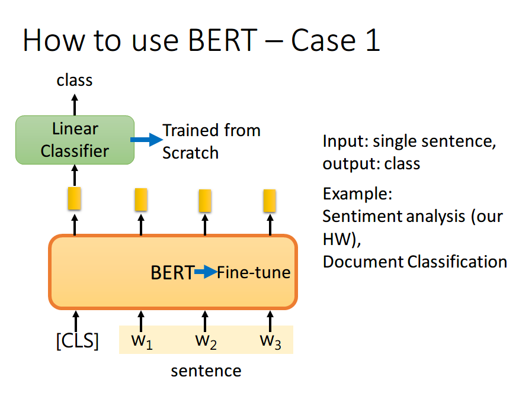

如果现在的任务是 **文本分类**，首先在输入句子的开头加一个代表分类的符号 [CLS]，然后将该位置的 output，丢给 Linear Classifier，让其 predict 一个 class 即可。整个过程中 Linear Classifier 的参数是需要从头开始学习的，而 BERT 中的参数微调就可以了

> 为什么要用第一个位置，即 [CLS] 位置的 output，个人理解是因为 BERT 内部是 Transformer，而 Transformer 内部又是 Self-Attention，所以 [CLS] 的 output 里面肯定含有整句话的完整信息，这是毋庸置疑的。但是 Self-Attention 向量中，自己和自己的值其实是占大头的，现在假设使用 $W_{1}$ 的 output 做分类，那么这个 output 中实际上会更加看重 $W_{1}$ ，而 $W_{1}$ 又是一个有实际意义的字或词，这样难免会影响到最终的结果。但是 [CLS] 是没有任何实际意义的，只是一个占位符而已，所以就算 [CLS] 的 output 中自己的值占大头也无所谓。当然你也可以将所有词的 output 进行 concat，作为最终的 output。


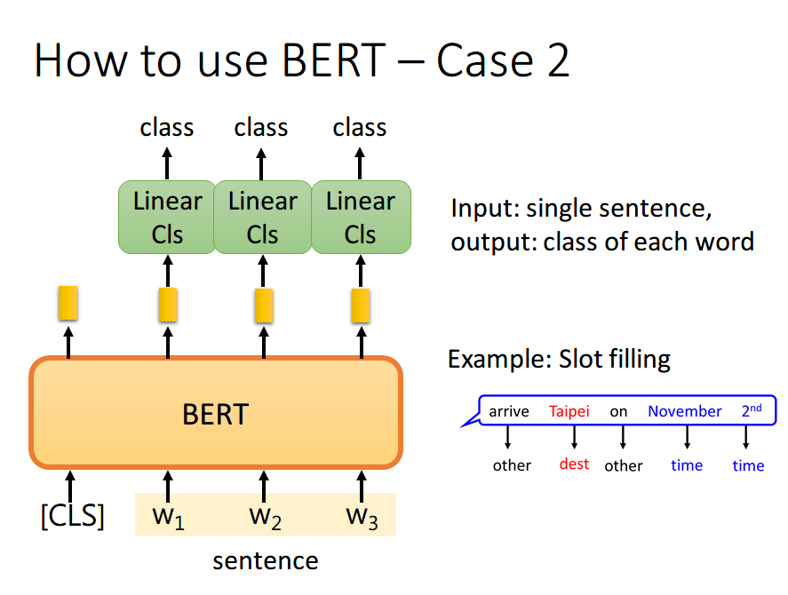

如果现在的任务是 **Token分类**，将句子中各个字对应位置的 output 分别送入不同的 Linear，预测出该字的标签。其实这本质上还是个分类问题，只不过是对每个字都要预测一个类别。

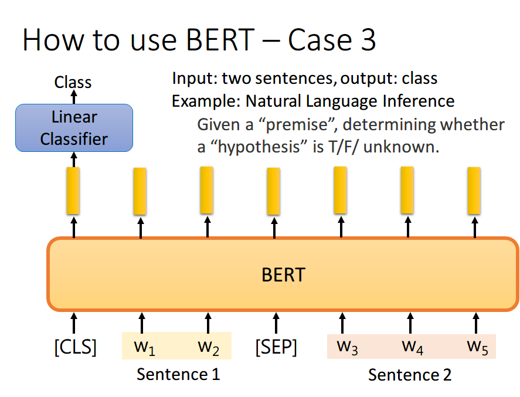

如果现在的任务是 NLI（自然语言推理）。即给定一个前提，然后给出一个假设，模型要判断出这个假设是 正确、错误还是不知道。这本质上是一个三分类的问题，和 Case 1 差不多，对 [CLS] 的 output 进行预测即可


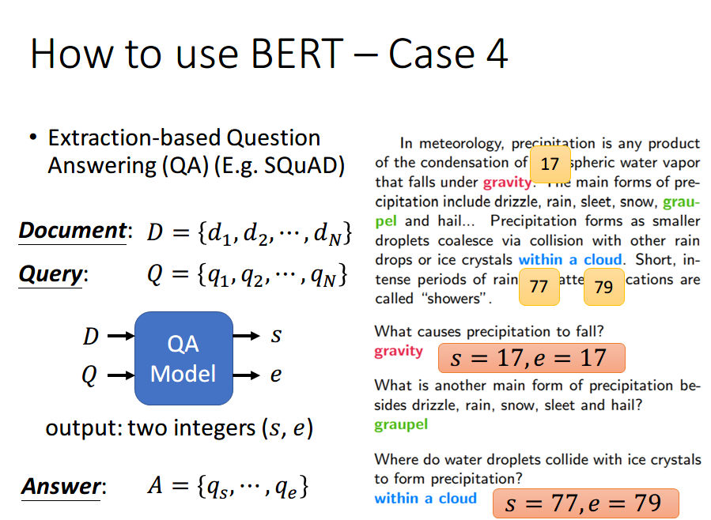

如果现在的任务是 **问答任务**，举例来说，如上图，将一篇文章，和一个问题（这里的例子比较简单，**答案一定会出现在文章中**）送入模型中，模型会输出两个数 s,e，这两个数表示，这个问题的答案，落在文章的第 s 个词到第 e 个词。具体流程我们可以看下面这幅图:

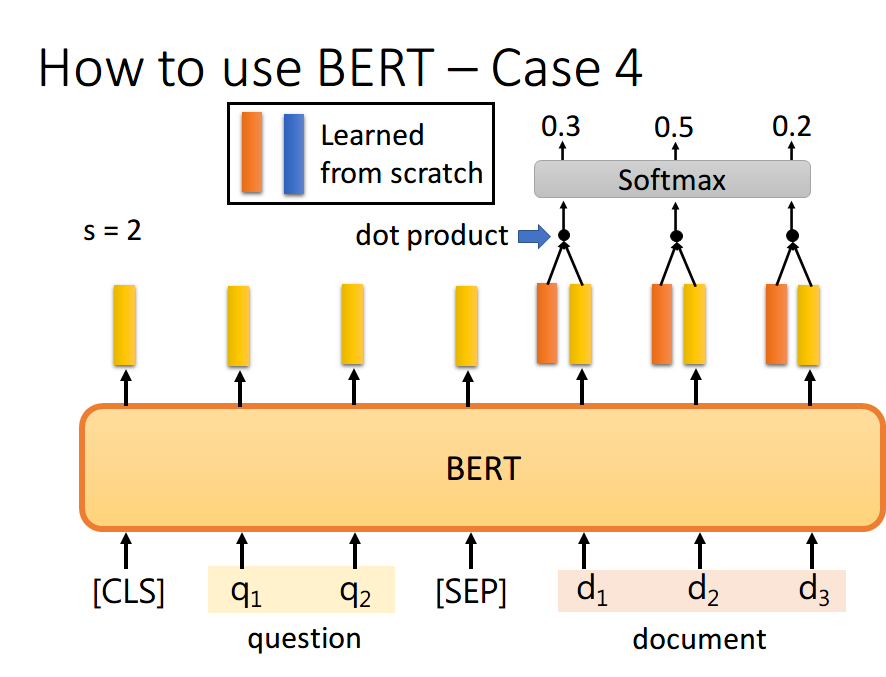

首先将问题和文章通过 [SEP] 分隔，送入 BERT 之后，得到上图中黄色的输出。此时我们还要训练两个 vector，即上图中橙色和黄色的向量。首先将橙色和所有的黄色向量进行 dot product，然后通过 softmax，看哪一个输出的值最大，例如上图中 $d_{2}$ 对应的输出概率最大，那我们就认为 s=2。

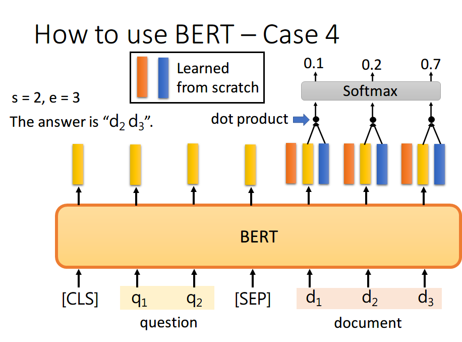

同样地，我们用蓝色的向量和所有黄色向量进行 dot product，最终预测得 $d_{3}$ 的概率最大，因此 e=3。最终，答案就是 s=2,e=3。

你可能会觉得这里面有个问题，假设最终的输出 s>e 怎么办，那不就矛盾了吗？其实在某些训练集里，有的问题就是没有答案的，因此此时的预测搞不好是对的，就是没有答案。

## 从 “零” 开始的预训练

从本节开始，我们将从"零"开始，体验Bert的预训练过程是如何实现的；

### 数据清洗

首先我们需要准备一个小型语料库，确保在单台机器上，仅使用CPU就能完成整个训练过程，这里采用的是 wikitext-2 和 wikitext-103 两个开源数据集:

- WikiText 英语词库数据（The WikiText Long Term Dependency Language Modeling Dataset）是一个包含1亿个词汇的英文词库数据，这些词汇是从Wikipedia的优质文章和标杆文章中提取得到，包括WikiText-2和WikiText-103两个版本，相比于著名的 Penn Treebank (PTB) 词库中的词汇数量，前者是其2倍，后者是其110倍。每个词汇还同时保留产生该词汇的原始文章，这尤其适合当需要长时依赖(longterm dependency)自然语言建模的场景。

- Wikitext-103是超过 1 亿个语句的数据合集，全部从维基百科的 Good 与 Featured 文章中提炼出来。广泛用于语言建模，当中包括 fastai 库和 ULMFiT 算法中经常用到的预训练模型。

- WikiText2是Wikitext-103 的子集，主要用于测试小型数据集的语言模型训练效果。

|  | WIKITEXT-2 | WIKITEXT-103 |
| --- | --- | --- |
| 下载地址 | [https://s3.amazonaws.com/fast-ai-nlp/wikitext-103.tgz](https://s3.amazonaws.com/fast-ai-nlp/wikitext-103.tgz) | [https://s3.amazonaws.com/fast-ai-nlp/wikitext-2.tgz](https://s3.amazonaws.com/fast-ai-nlp/wikitext-2.tgz)|

> WikiText-2 和 WikiText-103 是两个广泛用于语言模型训练和评估的英文维基百科语料数据集 ，由 Salesforce 提出并开源。它们在 NLP 领域（特别是语言建模、预训练任务）中非常经典。

将数据集压缩包下载到dataset目录下，并解压到当前目录下，然后使用`prepare_data`文件所提供代码对原始数据格式进行解析，得到对应的JSON格式文件:

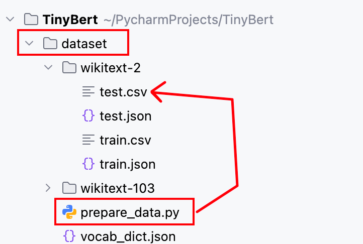


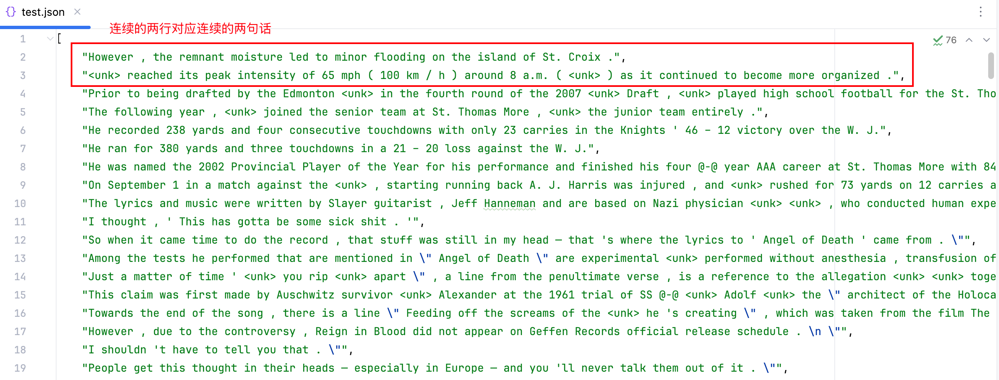

相关核心代码实现如下:

```python
def process_csv(file_path):
    """处理CSV文件,返回处理后的句子列表"""
    all_sentences = []
    
    with open(file_path, 'r', encoding='utf-8') as f:
        reader = csv.reader(f)
        for row in reader:
            # 使用NLTK库，将一整段文本按“句子”切分成一个句子列表。 
            # 处理每行文本：去除前后空格，过滤无效行
            paragraph = [line.strip() for line in sent_tokenize(row[0])
                if line.strip() 
                and not line.strip().startswith('=')
                and not all(c in string.punctuation for c in line.strip())]
            
            # 过滤掉句子数少于2的行
            paragraph = [line for line in paragraph if len(line.split('. ')) >= 2]
            
            # 确保句子数为偶数
            if len(paragraph) % 2 != 0:
                paragraph = paragraph[:-1]
            
            all_sentences.extend(paragraph)
    return all_sentences

def main():
    # 处理两个CSV文件
    test_sentences = process_csv('wikitext-2/test.csv')
    train_sentences = process_csv('wikitext-2/train.csv')

    # 写入JSON文件
    train_output_path = 'wikitext-2/train.json'
    os.makedirs(os.path.dirname(train_output_path), exist_ok=True)
    with open(train_output_path, 'w', encoding='utf-8') as f:
        json.dump(train_sentences, f, indent=4, ensure_ascii=False)
    print(f"成功生成JSON文件: {train_output_path}")

    test_output_path = 'wikitext-2/test.json'
    os.makedirs(os.path.dirname(test_output_path), exist_ok=True)
    with open(test_output_path, 'w', encoding='utf-8') as f:
        json.dump(test_sentences, f, indent=4, ensure_ascii=False)
    print(f"成功生成JSON文件: {test_output_path}")

if __name__ == "__main__":
    main()
```
### 分词器实现

分词器的实现较为简单，首先是其初始化方法中需要完成：字典初始化，数据预加载(可挪到其他地方实现)。

```python
class Tokenizer:
    def __init__(self, vocab_file = None):
        vocab_data = None
        if vocab_file is not  None:
           with open(vocab_file, 'r') as f:
              vocab_data = json.load(f)

        # 定义字典保存路径
        dict_path = 'dataset/vocab_dict.json'
        # 尝试加载已保存的字典
        if os.path.exists(dict_path):
            with open(dict_path, 'r', encoding='utf-8') as f:
                saved_dict = json.load(f)
                self.word2idx = saved_dict['word2idx']
                self.idx2word = {int(k): v for k, v in saved_dict['idx2word'].items()}
                self.vocab_size = len(self.word2idx)
        else:
           # 首先加入特殊标记：PAD, CLS, SEP, MASK , UNK , 这些是 BERT 模型中常用的特殊 token
           self.word2idx = {f'{name}': idx for idx, name in enumerate(['PAD', 'CLS', 'SEP', 'MASK' , 'UNK'])}
           # 处理vocab_data为列表形式的情况
           if isinstance(vocab_data, list):
                # 将所有文本合并成一个字符串
                all_text = ' '.join(vocab_data)
                # 临时替换特殊标记 ，然后对句子进行分词
                temp_text = all_text.replace('<unk>', 'UNK')
                sentences = word_tokenize(temp_text)
                # 获取所有单词并去重
                word_list = list(set(sentences))
                # 给每个普通词分配索引，从4开始（前面是特殊token）, 当前已经有的词数（4个特殊词）
                hold_place = len(self.word2idx)
                for idx, word in enumerate(word_list):
                    if word == 'UNK':
                        continue
                    self.word2idx[word] = idx + hold_place
           else:
                raise ValueError("vocab_data must be a list")
           
            # 创建反向映射：索引 → 单词
           self.idx2word = {idx: word for word, idx in self.word2idx.items()}
           # 总词汇量
           self.vocab_size = len(self.word2idx)
           # 确保映射是一一对应的
           assert len(self.word2idx) == len(self.idx2word)
           # 保存字典到文件
           with open(dict_path, 'w') as f:
              json.dump({
                'word2idx': self.word2idx,
                'idx2word': self.idx2word
              }, f, indent=4)
        
        # 对列表数据进行解析
        self.max_len = 103
        if isinstance(vocab_data, list):
            self.word_ids = []
            # 两两配对遍历
            for i in range(0, len(vocab_data), 2):
                sent_a = vocab_data[i]
                sent_b = vocab_data[i+1]

                tokens_a = self.encode(sent_a)
                tokens_b = self.encode(sent_b)

                # 如果任一句子长度超过50，跳过这对
                if len(tokens_a) > 50 or len(tokens_b) > 50:
                    continue

                # 否则保存这两个句子的 token ID 列表
                self.word_ids.append(tokens_a)
                self.word_ids.append(tokens_b)
```
字典的构建过程太过粗糙，导致最终构建得到的字典过大并且还有很多噪声，从而模型训练学习到每个词的含义需要更大量的数据集且最终效果也不会很好，可考虑换成 HuggingFace 的 BertTokenizer / WordPieceTokenizer 实现。

> 上面优化方向很多，比如: 去除含有低频词的句对，因为低频词出现次数极少，模型很难学到它们的语义表示。

对外提供的编码和解码两个方法实现如下:

```python
    def encode(self, text):
        return self.tokenize(text)
    
    def decode(self, tokens):
        return self.detokenize(tokens)

    def tokenize(self, text):
        sentences = word_tokenize(text)
        tokens = []
        for word in sentences:
            if word in self.word2idx:
                tokens.append(self.word2idx[word])
            else:
                # 如果遇到不存在于字典中的word，则使用UNK替换
                tokens.append(self.word2idx['UNK'])
        return tokens
    
    def detokenize(self, tokens):
        return ' '.join([self.idx2word[token] for token in tokens])
```
实际实现过程中，出于方便，还将一个工具方法整合到了分词器的实现之中，它是用于执行Bert MLM任务掩码策略的方法:

```python
    # 执行Bert的掩码策略: 掩码候选位置，输入序列，掩码符号
    def masking_procedure(self,cand_pos, input_ids, masked_symb):
        masked_pos = []
        masked_tokens = []
        # 对于所有掩码候选位置执行掩码策略： 80% 概率替换为[MASK]，10% 概率替换为随机词，10% 概率保持不变
        for pos in cand_pos:
            masked_pos.append(pos) # 记录被掩码的位置
            masked_tokens.append(input_ids[pos]) # 记录被掩码的原token
            if random.random() < p_mask: # 80% 概率替换为[MASK]
                input_ids[pos] = masked_symb
            elif random.random() > (p_mask + p_replace): # 10% 概率替换为随机词
                rand_word_idx = random.randint(4, self.vocab_size - 1)
                input_ids[pos] = rand_word_idx
            else: # 10% 概率保持不变
                pass

        return masked_pos, masked_tokens
```

### Batch数据准备

有了分词器后，我们需要读取并构建Batch数据，用于我们的预训练任务，该过程由`make_data`方法实现，具体步骤为:

1. 收集相同数量的相邻句对和非相邻句对。

2. 对每个句对构建用于NSP任务的样本，形式为: `[CLS] + A + [SEP] + B + [SEP]`。

3. 对每个句对构建用于MLM任务的样本，首先将`[CLS] + A + [SEP] + B + [SEP]`句子中20%的词执行掩码策略，而针对这20%需要被掩码的词之上，再按照80%用MASK掩码替换，10%用随机词替换，10%保持原样不动的形式进行处理；最后返回两个列表: 20%执行掩码的词的位置列表，20%执行掩码的词的原Token列表。

4. 将所有输入序列填充到等长`max_len`。

5. 返回构建得到的单个样本列表: `[被掩码后的输入序列, 句子分隔列表 , 20%执行掩码的词的位置列表, 20%执行掩码的词的原Token列表, 是否为连贯的上下句]`。

6. 所有样本列表构成Batch数据返回。

```python
def make_data(tokenizer):
    sentences = tokenizer.word_ids
    batch_data = []
    len_sentences = len(sentences)

    # Step 1: 收集相邻句对
    adjacent_pairs = []
    for i in range(len_sentences - 1):
        a, b = i, i + 1
        if len(sentences[a]) <= 50 and len(sentences[b]) <= 50:
            adjacent_pairs.append((a, b))

    # Step 2: 随机生成等量的非相邻句对
    non_adjacent_pairs = []
    valid_indices = [i for i in range(len_sentences) if len(sentences[i]) <= 50]
    for a in valid_indices:
        candidates = [b for b in valid_indices if abs(a - b) > 1]
        if candidates:
            b = random.choice(candidates)
            non_adjacent_pairs.append((a, b))

    # 打乱顺序
    random.shuffle(adjacent_pairs)
    random.shuffle(non_adjacent_pairs)

    # 保证数量一致
    min_count = min(len(adjacent_pairs), len(non_adjacent_pairs))
    adjacent_pairs = adjacent_pairs[:min_count]
    non_adjacent_pairs = non_adjacent_pairs[:min_count]

    # 构建样本
    for a, b in adjacent_pairs:
        sample = prepare_sample(tokenizer, a, b, is_next=True)
        batch_data.append(sample)

    for a, b in non_adjacent_pairs:
        sample = prepare_sample(tokenizer, a, b, is_next=False)
        batch_data.append(sample)

    return batch_data

def prepare_sample(tokenizer, tokens_a_idx, tokens_b_idx, is_next):
    sentences = tokenizer.word_ids
    tokens_a = sentences[tokens_a_idx]
    tokens_b = sentences[tokens_b_idx]

    # 拼接 [CLS] + A + [SEP] + B + [SEP]
    input_ids = [tokenizer.word2idx['CLS']] + tokens_a + [tokenizer.word2idx['SEP']] + tokens_b + [
        tokenizer.word2idx['SEP']]
    segment_ids = [0] * (1 + len(tokens_a) + 1) + [1] * (1 + len(tokens_b))

    # MLM 准备
    n_pred = min(max_pred, max(1, int(len(input_ids) * 0.2)))
    cand_pos = [
        i for i, token in enumerate(input_ids)
        if token not in {tokenizer.word2idx['CLS'], tokenizer.word2idx['SEP'], tokenizer.word2idx['PAD'],
                         tokenizer.word2idx['UNK']}
    ]
    random.shuffle(cand_pos)
    masked_pos, masked_tokens = tokenizer.masking_procedure(cand_pos[:n_pred], input_ids, tokenizer.word2idx['MASK'])

    # Padding
    def pad(seq, target_len, pad_value=tokenizer.word2idx['PAD']):
        seq += [pad_value] * (target_len - len(seq))

    pad(input_ids, tokenizer.max_len)
    pad(segment_ids, tokenizer.max_len)

    if max_pred > n_pred:
        pad(masked_pos, max_pred)
        pad(masked_tokens, max_pred)

    return [input_ids, segment_ids, masked_tokens, masked_pos, is_next]
```
### 模型

本文中的 Bert 模型整体实现也比较简单，其中关于BertEncoders编码并输出结果的整个过程如下图所示:

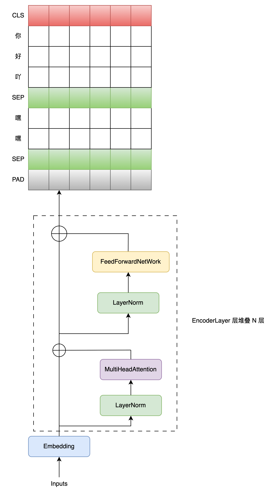

NSP 任务会利用 CLS Token 作为整个输入序列的全局信息聚合表示，再经过非线性变换后，进行二分类任务，判断下一个句子是否是当前句子的后续句子，具体过程如下图所示:

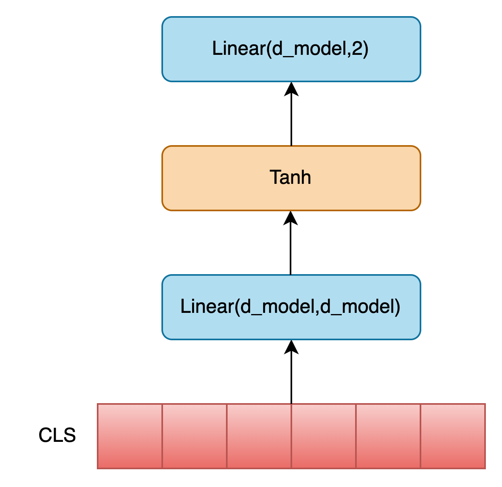 

MLM 任务会利用 `masked_pos` 从BertEncoders编码输出结果中提取出被掩码的位置对应的嵌入向量，经过相同的非线性变换后，将这些掩码Token对应的嵌入向量映射到词向量空间中去，得到模型预测的这些掩码Token对应的真实词，具体过程如下图所示:

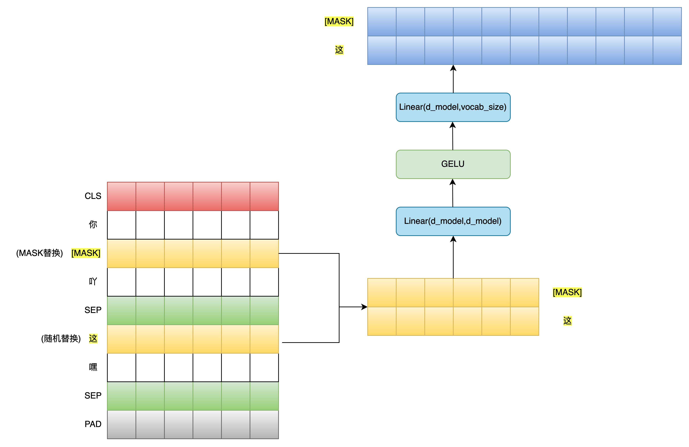 

核心代码实现如下:

```python
class BERT(nn.Module):
    def __init__(self, n_layers, vocab_size, max_len):
        """
        初始化一个简化版的 BERT 模型，支持 MLM（掩码语言建模） 和 NSP（下一句预测） 两个任务。
        
        参数：
            n_layers: Transformer 编码器层数
            vocab_size: 词表大小
            max_len: 最大序列长度
        """
        super(BERT, self).__init__()

        # 1. 词嵌入 + 位置嵌入 + 句子嵌入
        self.embedding = Embeddings(vocab_size, max_len)

        # 2. 多个 Transformer 编码器层堆叠
        self.encoders = nn.ModuleList([
            EncoderLayer() for _ in range(n_layers)
        ])

        # 3. Pooler 层：用于提取 [CLS] token 的表示，用于 NSP 任务
        self.pooler = Pooler()

        # 4. 下一句预测（NSP）分类器
        self.next_cls = nn.Linear(d_model, 2)  # 输出维度为 2，表示是否是连续句子
        self.gelu = gelu  # GELU 激活函数

        # 5. 权重共享：Pooler 层与 FC 层共享权重
        shared_weight = self.pooler.fc.weight  # 获取 pooler 中的全连接层权重
        self.fc = nn.Linear(d_model, d_model)  # 创建新的线性层
        self.fc.weight = shared_weight  # 共享权重（weight tying）

        # 6. 权重共享：MLM 分类器共享词嵌入矩阵
        shared_weight = self.embedding.word_emb.weight  # 获取词嵌入层权重
        self.word_classifier = nn.Linear(d_model, vocab_size, bias=False)
        self.word_classifier.weight = shared_weight  # 权重共享（tie weights）

    def forward(self, tokens, segments, masked_pos):
        """
        前向传播逻辑
        
        输入：
            tokens: [batch_size, seq_len]，token 的索引（已添加 [CLS], [SEP], [MASK] 等）
            segments: [batch_size, seq_len]，segment_id，区分句子 A 和 B
            masked_pos: [batch_size, max_pred]，记录被掩码的位置
            
        输出：
            logits_cls: [batch_size, 2]，NSP 分类结果
            logits_lm: [batch_size, max_pred, vocab_size]，MLM 预测结果
        """
        # 1. 词嵌入 + 位置嵌入 + 句子嵌入
        output = self.embedding(tokens, segments)  # shape: [batch_size, seq_len, d_model]

        # 2. 构造 padding mask（忽略填充部分）
        enc_self_pad_mask = get_pad_mask(tokens)  # shape: [batch_size, seq_len, seq_len]

        # 3. 依次通过每个编码器层（Transformer Layer）
        for layer in self.encoders:
            output = layer(output, enc_self_pad_mask)  # output shape: [batch_size, seq_len, d_model]

        # 4. NSP 任务：使用 [CLS] 标记进行下一句预测
        hidden_pool = self.pooler(output[:, 0])  # 提取 [CLS] 位置的隐藏状态并池化
        logits_cls = self.next_cls(hidden_pool)  # 分类输出：[batch_size, 2]

        # 5. MLM 任务：恢复被掩码的词
        # masked_pos: [batch_size, max_pred]
        # 扩展 masked_pos 到三维，便于从 output 中 gather 出被掩码位置的表示
        masked_pos = masked_pos.unsqueeze(-1).expand(-1, -1, d_model)  # shape: [batch, max_pred, d_model]

        # 使用 torch.gather 从 output 中取出被掩码位置的 token 表示
        h_masked = torch.gather(output, dim=1, index=masked_pos)  # shape: [batch_size, max_pred, d_model]

        # 通过全连接层 + GELU 激活函数
        h_masked = self.gather(output, dim=1, index=masked_pos)  # 再次提取被掩码位置的表示
        h_masked = self.gelu(self.fc(h_masked))  # shape: [batch_size, max_pred, d_model]

        # 6. MLM 分类器：预测被掩码的词
        logits_lm = self.word_classifier(h_masked)  # shape: [batch_size, max_pred, vocab_size]

        # 返回两个任务的结果
        return logits_cls, logits_lm
```
> 完整的代码实现部分，大家参考仓库源码即可，本文不再全部Copy展示。

### 训练

训练过程就比较常规了，有一点不同就是Bert预训练阶段的学习目标是: MLM Loss + NSP Loss ，具体核心代码实现如下:

```python
tokenizer = Tokenizer("dataset/wikitext-2/train.json")
batch_data = make_data(tokenizer)
batch_tensor = [torch.LongTensor(ele) for ele in zip(*batch_data)]
dataset = BERTDataset(*batch_tensor)
dataloader = DataLoader(dataset, batch_size=32, shuffle=True)

model = BERT(n_layers,tokenizer.vocab_size,tokenizer.max_len)

lr = 1e-4
epochs = 100
# 优化器与学习率调度器
optimizer = AdamW(model.parameters(), lr=1e-4, weight_decay=0.01)
# 损失函数 + 标签平滑
criterion1 = nn.CrossEntropyLoss(label_smoothing=0.1)
criterion2 = nn.CrossEntropyLoss(label_smoothing=0.1,ignore_index=0)

# 加载检查点
checkpoint_path = 'best_model.pth'
if os.path.exists(checkpoint_path):
    model.load_state_dict(torch.load(checkpoint_path, weights_only=True, map_location=device))
    print('Loaded checkpoint from', checkpoint_path)

model.to(device)
best_loss = float('inf')

# training
total_batches = len(dataloader)
for epoch in range(epochs):
    avg_loss = 0
    for batch_idx, one_batch in enumerate(dataloader):
        input_ids, segment_ids, masked_tokens, masked_pos, is_next = [ele.to(device) for ele in one_batch]

        logits_cls, logits_lm = model(input_ids, segment_ids, masked_pos)

        # NSP 任务损失
        loss_cls = criterion1(logits_cls, is_next)
        # MLM 任务损失
        loss_lm = criterion2(logits_lm.view(-1, tokenizer.vocab_size), masked_tokens.view(-1))
        loss_lm = (loss_lm.float()).mean()
        # 总损失
        loss = loss_cls + loss_lm
        avg_loss += loss.item()

        if (epoch + 1) % 1 == 0:
            print(f'Epoch:{epoch + 1} Batch:{batch_idx + 1}/{total_batches} \t loss: {loss:.6f}')

        loss.backward()
        torch.nn.utils.clip_grad_norm_(model.parameters(), max_norm=1.0)
        optimizer.step()

    avg_loss /= total_batches
    # 保存最优模型
    if avg_loss < best_loss:
        best_loss = avg_loss
        torch.save(model.state_dict(), f'best_model.pth')
        print(f'Saved best model with loss: {best_loss:.6f}')

    # 效果评估
    evaluate_model()
```

由于模型输出的`logits_cls`是一个二分类值，因此我们只需要根据`is_next`取出索引0或者1下标对应的值即可知道我们是否预测正确，并且使用预测结果计算NSP任务损失值。

对于MLM任务损失计算来说，我们只会计算被随机遮盖或替换的部分，其余部分不做损失，因此模型返回的logits_lm也只包含被掩码的Token对应的模型预测真实词，同时通过`masked_tokens`可知这些被掩码Token对应的真实词作为Label，从而计算交叉熵损失就很简单了。

这里需要注意一点，对于MLM任务损失计算来说，我们需要在其对应的CrossEntropyLoss中指定`ignore_index=0`，即忽略掉PAD部分的损失计算；

> 这里PAD部分指的是对于不同的句子，它们都是按照其序列长度的20%比例进行的掩码，而对于较短的句子，其掩码数量可能会偏少，因此为了确保`masked_tokens`列表中所有句子掩码数量一致，需要对掩码数量不足`max_pred`的进行PAD填充。

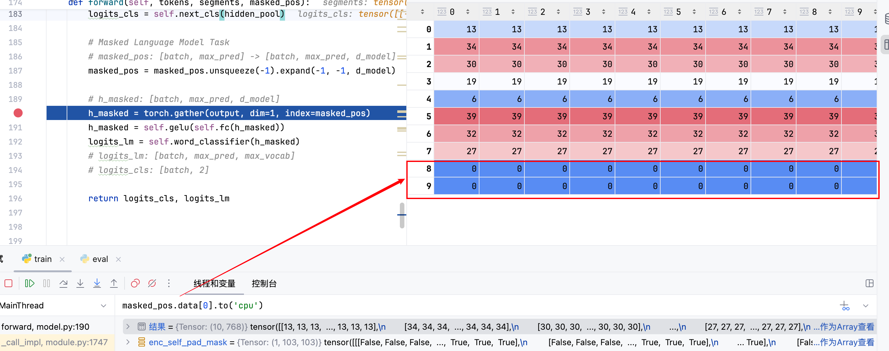

模型返回的`logits_lm`中同样含有PAD部分，但是我们在计算损失时指定了`ignore_index=0`，即忽略掉PAD部分的损失计算，因此不会影响最终的损失值计算。

> gather函数比较灵活，它可以对Batch中每个句子都按照

