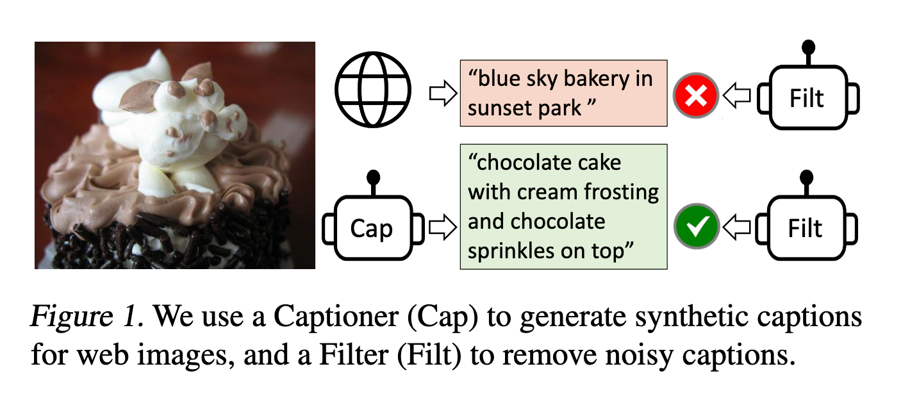
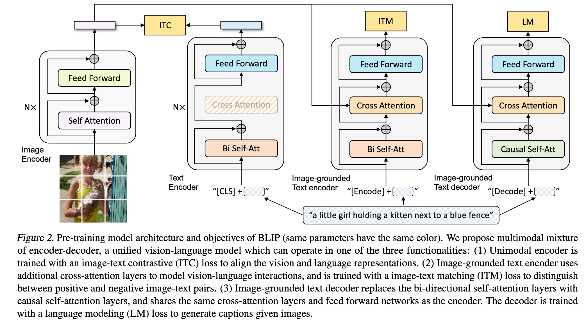
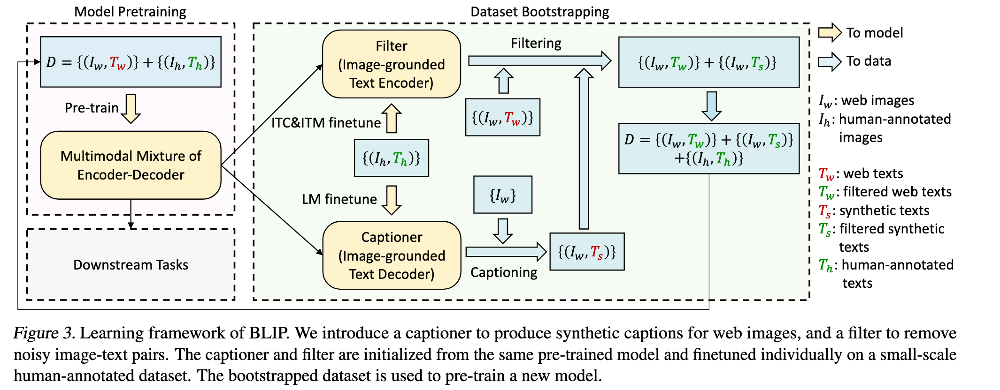
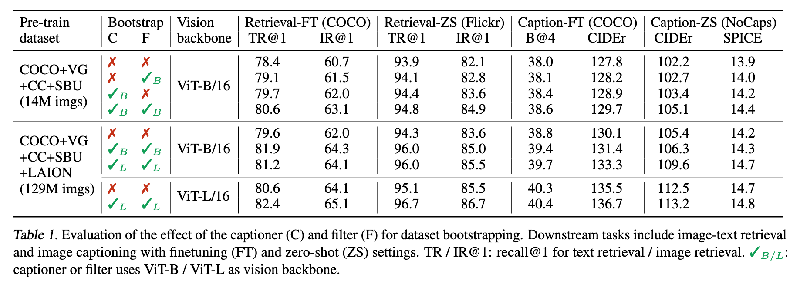
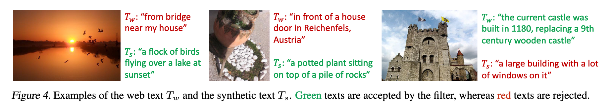
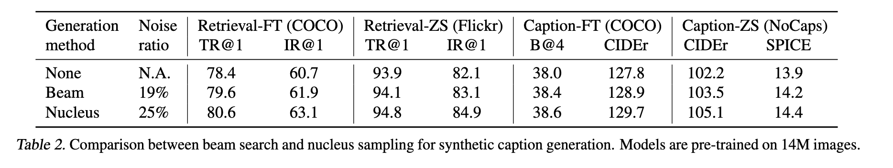
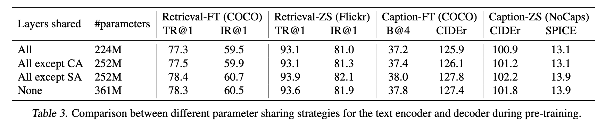
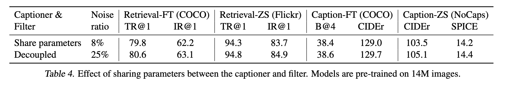
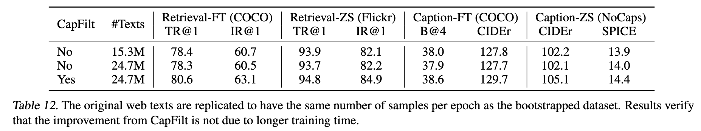
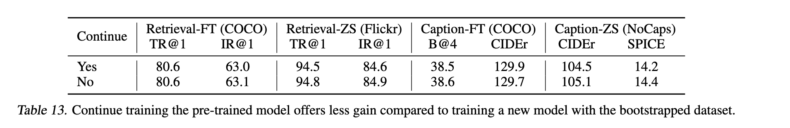

`BLIP: Bootstrapping Language-Image Pre-training for  Unified Vision-Language Understanding and Generation 论文解读` 

<!-- more -->

> 论文链接: [BLIP: Bootstrapping Language-Image Pre-training for  Unified Vision-Language Understanding and Generation](https://arxiv.org/abs/2201.12086)
> 代码链接: [https://github.com/salesforce/BLIP](https://github.com/salesforce/BLIP)

## Introduction


当前视觉-语言预训练（VLP）方法虽然在多模态任务上取得进展，但普遍存在两个问题：

1. **模型限制**：编码器模型不适合文本生成任务；编码器-解码器模型难以用于图文检索。
  
2. **数据质量差**：大多使用从网络收集的嘈杂图文对作为训练数据，监督信号不理想。


BLIP（Bootstrapping Language-Image Pre-training）是一个新颖的 VLP 框架，兼顾理解与生成能力。其两大创新点：

1. **MED 模型结构（Multimodal Mixture of Encoder-Decoder）**：

   * 同时支持编码器、图像条件编码器、图像条件解码器三种模式。

   * 联合训练三种任务：图文对比学习、图文匹配、图像条件语言建模。
   
   * 实现多任务预训练与灵活迁移。

2. **CapFilt 数据自举方法（Captioning and Filtering）**：

   * 使用训练好的 MED 模型构建两个模块：

     * 描述器（captioner）生成图像的合成描述；
   
     * 过滤器（filter）剔除原始和生成的低质量描述。
   
   * 在保留信息的同时提升训练数据质量。



实验结果与表现:

* BLIP 在多个任务（图文检索、图像描述、VQA 等）上取得**最先进性能**。

* 同时，在两个视频-语言任务上以**零样本方式**迁移也表现优异。

* 实验证明：描述器与过滤器的组合能显著提升性能，多样化描述更有利于学习。

## Related Work

### 视觉-语言预训练（VLP）

* **现状问题：**

  * 主流 VLP 方法依赖从网络抓取的图文对数据，虽然规模大，但包含大量噪声文本。
  
  * 尽管使用简单的过滤规则，噪声仍广泛存在。
  
  * 编码器模型适合理解类任务但难以生成文本；编码器-解码器适合生成任务但不适用于检索。

* **BLIP 的改进：**

  * 提出 **CapFilt**：通过“生成 + 过滤”的方式优化数据质量。
  
  * 提出 **MED 模型结构**：在保持预训练高效的前提下，同时兼顾理解与生成任务，提升泛化能力。

### 知识蒸馏（Knowledge Distillation）

* **现有做法：**

  * 知识蒸馏让小模型（学生）学习大模型（教师）的预测结果。
  
  * 自蒸馏也取得了不错效果，尤其在图像分类与部分 VLP 方法中已开始尝试。

* **BLIP 的新视角：**

  * CapFilt 可视为一种结构化的知识蒸馏方式：

    * **Captioner 模块**用生成的语义丰富描述进行蒸馏；
  
    * **Filter 模块**通过剔除噪声文本完成隐式知识过滤。

### 数据增强（Data Augmentation）

* **现有做法：**

  * 图像任务中数据增强广泛应用，但语言任务的数据增强较困难。
 
  * 近年来生成模型被用于文本任务的样本合成，但多用于低资源语言场景。

* **BLIP 的贡献：**

  * 展示了在**大规模视觉-语言预训练中**使用合成图像描述的独特优势，提升了多模态学习效果。

## Method

在本文中，作者提出了一个统一的视觉语言预训练框架 **BLIP**，该方法能够有效从噪声图文对中学习。方法部分主要分为三个内容：模型架构 MED、预训练目标，以及数据集自举策略 CapFilt。

### 模型架构：MED（Multimodal Mixture of Encoder-Decoder）

作者在模型中采用了 **视觉 Transformer**（ViT）（Dosovitskiy et al., 2021）作为图像编码器，它会将图像切分为 patch，并编码为一系列嵌入表示，其中额外添加的 `[CLS]` token 被用作图像的全局特征。相比使用预训练目标检测器（如 Chen et al., 2020），ViT 的使用更具计算效率，也被近年来的工作所采纳（Li et al., 2021a；Kim et al., 2021）。

为了训练一个既具理解能力又具生成能力的统一模型，作者提出了一个多任务模型架构：**多模态混合的编码器-解码器**（MED）。该架构支持以下三种功能模式：

1. **Unimodal Encoder**（单模态编码器）

   * 图像和文本分别编码。

   * 文本编码器使用 BERT（Devlin et al., 2019），在文本前添加 `[CLS]` token 来表示整句话的语义。

2. **Image-grounded Text Encoder**（图像引导的文本编码器）

   * 在 BERT 的每个 block 中添加一层 cross-attention（CA），位于 self-attention（SA）和 FFN 之间。
   
   * 文本末尾添加一个 `[Encode]` token，输出的该 token 表示图文对的多模态表示。

3. **Image-grounded Text Decoder**（图像引导的文本解码器）

   * 在 encoder 的基础上将双向 SA 替换为因果 self-attention，以实现生成任务。
   
   * 使用 `[Decode]` token 标记序列开始，使用 `<eos>` 表示结束。

为了实现多任务高效预训练，模型设计上 encoder 和 decoder 共享除了 SA 层以外的所有参数。作者认为编码和解码之间的主要差异体现在 SA 层（前者为双向，后者为因果），而嵌入层、CA 和 FFN 层则可以共享。这样的共享设计能够提升训练效率，并有利于多任务学习。

### 预训练目标（ITC、ITM、LM）



BLIP 同时优化三个预训练目标，其中包括两个理解任务和一个生成任务。每对图文样本只需通过一次视觉 Transformer，但文本 Transformer 会根据不同功能分支前向三次，以计算以下三种损失：

1. **Image-Text Contrastive Loss**（ITC）

   * 启用 **Unimodal Encoder**，用于对齐图像和文本的表示空间。

   * 目标是使正样本的图文对在特征空间中接近，同时区分负样本。
   
   * 方法参考 Li et al. (2021a)，采用动量编码器来生成表示，并用其产生的软标签作为训练目标，从而考虑负样本中的潜在正样本。

2. **Image-Text Matching Loss**（ITM）

   * 启用 **Image-grounded Text Encoder**，用于学习图文之间的细粒度对齐关系。
   
   * 本质是一个二分类任务，判断图文是否匹配，使用一个线性分类头进行预测。
   
   * 采用 Li et al. (2021a) 提出的 **困难负样本挖掘策略**，即在 batch 中优先选择对比相似度高的负样本来增强训练信号。

3. **Language Modeling Loss**（LM）

   * 启用 **Image-grounded Text Decoder**，训练模型根据图像生成文本描述。
   
   * 使用交叉熵损失，训练模型以自回归方式生成文本；计算时引入 0.1 的标签平滑。
   
   * 相比于传统的 MLM，LM 更能增强模型将视觉信息转化为自然语言的能力。


### CapFilt：图文数据的自举式清洗机制



由于高质量人工标注图文对（如 COCO）数量有限，而自动爬取的网页图文对（${I_{w}, T_{w}}$）噪声严重，作者提出了一个新的数据处理流程：**CapFilt**（Captioning and Filtering），用于提升图文语料的质量。

CapFilt 包含两个模块，分别用于生成和过滤文本：

* **Captioner**

  * 是一个图像引导的文本解码器，使用 LM 目标在 COCO 上轻量微调。

  * 输入网页图像 $I_{w}$，输出合成描述 $T_{s}$（一张图对应一条生成的 caption）。

* **Filter**

  * 是一个图像引导的文本编码器，使用 ITC 和 ITM 目标进行微调。
  
  * 输入图像及文本，判断是否匹配；若 ITM 头预测为不匹配，则认为是噪声文本。
  
  * 过滤对象既包括网页原始文本 $T_{w}$，也包括合成描述 $T_{s}$。

最后，作者将通过 Filter 筛选出的图文对与人工标注数据结合，组成新的训练集，用于训练下一个更强的模型。

### 小结

BLIP 在模型设计上提出了一个灵活、统一的多任务架构（MED），同时结合图文对比、匹配和生成等任务目标进行联合训练。在数据方面，通过 CapFilt 机制有效从网页图文对中挖掘高质量样本，显著扩展了训练数据的规模和质量。

整体来看，BLIP 是一个兼顾理解与生成、统一建模与数据增强的多模态预训练方法，具有较强的实用性与拓展性。


以下是对“**Experiments and Discussions**”部分翻译内容的总结，遵循您的格式规范：


## Experiments and Discussions

### 预训练细节

BLIP 模型使用 PyTorch 实现，预训练环境为两个16-GPU节点。图像编码器基于在 ImageNet 上预训练的 ViT（参考 [Touvron et al., 2020](https://arxiv.org/abs/2012.12877)；[Dosovitskiy et al., 2021](https://arxiv.org/abs/2010.11929)），文本编码器则基于 BERTbase（[Devlin et al., 2019](https://arxiv.org/abs/1810.04805)）。模型变体包括 ViT-B/16 和 ViT-L/16，其中默认使用 ViT-B。

训练配置如下：

* 训练轮数为 20，批量大小为 2880（ViT-B）/ 2400（ViT-L）；

* 优化器使用 AdamW（[Loshchilov & Hutter, 2017](https://arxiv.org/abs/1711.05101)），权重衰减为 0.05，学习率预热后分别达到 $3\times10^{-4}$（ViT-B）和 $2\times10^{-4}$（ViT-L），随后线性衰减；

* 图像预训练分辨率为 $224\times224$，微调时提升为 $384\times384$。

所使用的训练数据总共包含约 1400 万张图像，覆盖以下数据集：

* COCO 和 Visual Genome（人工标注）；

* Conceptual Captions、Conceptual 12M 和 SBU Captions（网页收集）；

* 补充实验中还使用了 LAION（[Schuhmann et al., 2021](https://arxiv.org/abs/2111.02114)）的大规模网页数据集（1.15 亿图像），每轮只使用 1/5 数据。

### CapFilt 效果验证



CapFilt 模块通过 Captioner 生成合成文本，再由 Filter 去除噪声文本，显著提升模型性能（表1）。三种设置下的对比表明：

* 单独使用 Captioner 或 Filter 均有性能提升；

* 两者联合使用时效果最佳，且具备数据量和模型规模的可扩展性；

* 更强的视觉主干（如 ViT-L）可进一步增强性能。

**图4** 展示了网页原始文本（$T_{w}$）与合成文本（$T_{s}$）的对比，绿色为 Filter 接收的文本，红色为剔除的文本，验证了 Captioner 提供新描述、Filter 移除无效数据的有效
性。



### 合成文本的多样性对性能的影响



表2 比较了两种文本生成方式：

* Beam search：确定性搜索，噪声比例较低（19%）；

* Nucleus sampling：随机采样，噪声比例稍高（25%），但性能全面超越 Beam search。

作者推测，nucleus sampling 生成的文本更具有 **新颖性与多样性**，提供更多额外信息；而 beam search 更倾向于生成数据集中常见的“安全”文本，难以提升模型泛化能力。

### 编码器-解码器参数共享与解耦



表3 分析了不同的参数共享策略对模型性能的影响。结论如下：

* 最佳方案是 **仅在 SA 层不共享参数**，其余部分共享；

* 如果完全不共享参数，则模型体积大、性能次优；

* 如果共享 SA 层，性能反而下降，因其在编码（双向注意力）与解码（因果注意力）间存在功能冲突。

在 CapFilt 阶段，Captioner 与 Filter 分别进行微调。表4 显示，如果二者参数共享，则会因“确认偏差”导致性能下降 —— 生成的错误文本更难被 Filter 剔除（噪声比例仅 8%，远低于解耦时的 25%）。




以下是论文 **BLIP: Bootstrapping Language-Image Pre-training for Unified Vision-Language Understanding and Generation** 中第 **6章 Additional Ablation Study** 和第 **7章 Conclusion** 部分的翻译：

## Ablation Study

### CapFilt 的性能提升并非源于更长的训练时间

由于经过 CapFilt 处理后的数据集包含比原始数据集更多的文本，因此在相同的 epoch 数下，训练时间会更长。为了验证 CapFilt 的有效性是否真正来自其机制本身，而非训练时间变长，我们将原始数据集中的网页文本复制，使得每个 epoch 的样本数量与 bootstrapped 数据集一致。

如表 12 所示，仅通过扩充原始数据进行更长时间训练 **并未带来性能提升**，验证了 CapFilt 的真正价值。



### 应使用 Bootstrapped 数据集重新训练模型

Bootstrapped 数据集应当用于**重新训练一个新模型**。我们对比了两种方式：

* 在预训练模型基础上继续使用 CapFilt 数据训练；

* 用 CapFilt 数据从头训练一个新模型。

表 13 显示，**继续训练的效果不如重新训练**，这与知识蒸馏领域的常见做法一致：学生模型不能由教师模型直接初始化。这也间接说明 CapFilt 机制与重新初始化更契合。



## Conclusion

BLIP 是一个新的视觉-语言预训练框架，在众多下游任务中都实现了**最先进（SOTA）性能**，包括理解类任务和生成类任务。

BLIP 使用多模态混合的编码器-解码器模型（Multimodal Mixture of Encoder-Decoder, MED），并通过对大规模嘈杂图文数据进行 bootstrapping 构建预训练语料：**注入多样的合成描述，并剔除低质量描述**。

发布了 bootstrapped 数据集，以促进视觉-语言研究的发展。

未来可进一步探索以下方向以提升 BLIP 表现：

* **多轮数据集 Bootstrapping**；

* 为每张图像生成 **多个合成描述**，进一步扩大语料规模；

* 使用多个不同的 Captioner 和 Filter 训练多个模型，再进行集成，增强 CapFilt 的效果。

## Code Implementation

### CapFilt 模块实现

BLIP 使用 CapFilt 对多个大规模噪声网页图文数据集（包括 CC12M、CC3M 和 SBU Captions）进行增强，首先通过 captioner 为图像生成合成文本，再通过 filter 过滤掉与图像不匹配的原始和合成文本，最终构建出高质量的自举数据集（bootstrapped dataset），用于预训练新模型。

在 CapFilt 模块微调阶段，BLIP 则基于高质量人工标注的数据集如 COCO Captions、Visual Genome 和 Flickr30K 进行训练和评估。

经过 CapFilt 处理后，输出的数据集是经过图文对齐质量优化的图文对集合，有效提升了下游任务中的表现。

>  官方代码库并没有非常清晰指明CapFilt模块的实现代码位置，但是官方仓库的ISSUE给出了明确答复: [https://github.com/salesforce/BLIP/issues/86?utm_source=chatgpt.com](https://github.com/salesforce/BLIP/issues/86?utm_source=chatgpt.com)

#### Captioner 模块

##### 微调阶段

Captioner 基于 Coco 数据集进行微调:

```python
# 训练函数：执行一个 epoch 的训练流程
def train(model, data_loader, optimizer, device):
    for i, (image, caption, _) in data_loader:
        loss = model(image, caption)  # 前向传播，计算语言建模损失        
        optimizer.zero_grad()         # 清除旧梯度
        loss.backward()               # 反向传播
        optimizer.step()              # 更新模型参数

# 主流程：加载数据、初始化模型和优化器、执行多轮训练
def main(args, config):
    #### Dataset #### 
    # 加载 COCO Caption 数据集的训练/验证/测试划分
    train_dataset, val_dataset, test_dataset = create_dataset('caption_coco', config)  
    
    # 构造对应的数据加载器
    train_loader, val_loader, test_loader = create_loader(
        [train_dataset, val_dataset, test_dataset], samplers,
        batch_size=[config['batch_size']]*3, num_workers=[4, 4, 4],
        is_trains=[True, False, False], collate_fns=[None, None, None]
    )

    #### Model #### 
    # 初始化 BLIP 解码器模型（用于图像字幕生成），加载预训练视觉编码器与文本解码器
    model = blip_decoder(
        pretrained=config['pretrained'], image_size=config['image_size'], vit=config['vit'], 
        vit_grad_ckpt=config['vit_grad_ckpt'], vit_ckpt_layer=config['vit_ckpt_layer'], 
        prompt=config['prompt']
    )
    
    # 初始化优化器（AdamW）
    optimizer = torch.optim.AdamW(
        params=model.parameters(), 
        lr=config['init_lr'], 
        weight_decay=config['weight_decay']
    )

    #### Train ####         
    for epoch in range(0, config['max_epoch']):
        # 每个 epoch 执行一次训练
        train_stats = train(model, train_loader, optimizer, epoch, device)
```

训练阶段唯一需要注意的一点就是数据集的构造过程中，会在Coco数据集每个样本原有Caption的基础上添加一个Prompt:

```python
class coco_karpathy_train(Dataset):
    def __getitem__(self, index):    
        ann = self.annotation[index]
        
        image_path = os.path.join(self.image_root,ann['image'])        
        image = Image.open(image_path).convert('RGB')   
        image = self.transform(image)

        # 在caption前添加prompt , prompt 默认为 'a picture of '
        caption = self.prompt+pre_caption(ann['caption'], self.max_words) 
        
        # self.img_ids[ann['image_id']]: 取出图像 ID 对应的 索引编号
        return image, caption, self.img_ids[ann['image_id']] 
```

下面将给出Captioner模块基于Coco数据集，采用 `next token predict` 方法进行训练的代码实现：

```python
class BLIP_Decoder(nn.Module):
    def __init__(self,                 
                 med_config = 'configs/med_config.json',  
                 image_size = 384,
                 vit = 'base',
                 vit_grad_ckpt = False,
                 vit_ckpt_layer = 0,
                 prompt = 'a picture of ',
                 ):
        """
        BLIP Captioner模块初始化，实现论文中提出的图像-文本跨模态编码器-解码器架构

        Args:
            med_config (str): 混合编码器-解码器模型配置文件路径，对应论文3.1节中提到的多模态融合模块配置
            image_size (int): 输入图像尺寸，论文4.1节实验设置中使用384x384
            vit (str): 视觉Transformer模型大小，论文中采用ViT-Base作为默认视觉编码器
            vit_grad_ckpt (bool): 是否使用梯度检查点优化ViT显存占用，论文附录A中提到的训练优化策略
            vit_ckpt_layer (int): ViT梯度检查点层数，用于平衡训练效率与显存使用
            prompt (str): 图像描述生成的引导提示词，对应论文3.2节中使用的prompt engineering技术
        """
        super().__init__()
        
        self.visual_encoder, vision_width = create_vit(vit,image_size, vit_grad_ckpt, vit_ckpt_layer)  # 初始化视觉编码器，对应论文图1中的视觉Transformer
        self.tokenizer = init_tokenizer()   # 初始化文本分词器，采用BERT分词器实现论文中的文本预处理
        med_config = BertConfig.from_json_file(med_config)
        med_config.encoder_width = vision_width
        self.text_decoder = BertLMHeadModel(config=med_config)    # 初始化文本解码器，实现论文3.1节中的跨模态解码器
        
        self.prompt = prompt  # 存储图像描述引导提示词，用于论文3.3节中的条件生成任务
        self.prompt_length = len(self.tokenizer(self.prompt).input_ids)-1  # 计算提示词token长度，用于后续解码时区分提示与生成文本
        
    def forward(self, image, caption):
        # 提取图像特征表示
        image_embeds = self.visual_encoder(image) 
        image_atts = torch.ones(image_embeds.size()[:-1], dtype=torch.long).to(image.device)

        # 编码文本输入，并替换开头 token 为 [BOS]
        text = self.tokenizer(caption, padding='longest', truncation=True, max_length=40, return_tensors="pt").to(image.device)
        text.input_ids[:, 0] = self.tokenizer.bos_token_id

        # 构建语言建模标签：屏蔽掉 padding 和 prompt 部分
        decoder_targets = text.input_ids.masked_fill(text.input_ids == self.tokenizer.pad_token_id, -100)         
        decoder_targets[:, :self.prompt_length] = -100

        # 调用跨模态解码器，执行语言建模训练
        decoder_output = self.text_decoder(
            text.input_ids,
            attention_mask=text.attention_mask,
            encoder_hidden_states=image_embeds,
            encoder_attention_mask=image_atts,
            labels=decoder_targets,
            return_dict=True
        )   

        loss_lm = decoder_output.loss  # 提取语言建模损失
        return loss_lm
```

> [BertLMHeadModel自回归语言建模实现](http://localhost:8080/MMLLM/%E5%A4%9A%E6%A8%A1%E6%80%81%E5%B8%B8%E7%94%A8%E6%94%B9%E7%BC%96Bert%E5%AE%9E%E7%8E%B0.html#%E8%87%AA%E5%9B%9E%E5%BD%92%E8%AF%AD%E8%A8%80%E5%BB%BA%E6%A8%A1)

##### 生成阶段

当 Captioner 模块在 Coco 数据集上进行训练后，即可用于生成图像描述。

```python
def generate(self, image, sample=False, num_beams=3, max_length=30, min_length=10, top_p=0.9, repetition_penalty=1.0):
    # 通过视觉编码器提取图像的视觉特征（image embeddings）
    image_embeds = self.visual_encoder(image)
      
    if not sample:
        # 如果使用 beam search 生成，则需要将图像特征复制 num_beams 份
        # 这是为了每个 beam 都能接收相同的图像信息
        image_embeds = image_embeds.repeat_interleave(num_beams, dim=0)
        
    # 构造图像 attention mask，全为 1，表示图像特征没有被 mask
    image_atts = torch.ones(image_embeds.size()[:-1], dtype=torch.long).to(image.device)
    
    # 构造 encoder-decoder 所需的关键词参数（即图像特征作为 cross-attention 的条件输入）
    model_kwargs = {
        "encoder_hidden_states": image_embeds,
        "encoder_attention_mask": image_atts
    }
    
    # 构造输入的 prompt，格式为 ["a picture of ", "a picture of ", ...]
    prompt = [self.prompt] * image.size(0)
    
    # 对 prompt 进行分词并转为 tensor，作为 decoder 的输入起点（input_ids）
    input_ids = self.tokenizer(prompt, return_tensors="pt").input_ids.to(image.device)
    
    # 强制将每个样本开头的 token 设为 [BOS]（beginning-of-sentence）
    input_ids[:, 0] = self.tokenizer.bos_token_id
    
    # 移除最后一个 token（保持 prompt 是 decoder 的 prefix）
    input_ids = input_ids[:, :-1]

    if sample:
        # ---------- 使用 nucleus sampling（核采样）生成 ----------
        outputs = self.text_decoder.generate(
            input_ids=input_ids,
            max_length=max_length,
            min_length=min_length,
            do_sample=True,                 # 启用采样
            top_p=top_p,                    # nucleus 采样的阈值
            num_return_sequences=1,        # 每张图像生成一个序列
            eos_token_id=self.tokenizer.sep_token_id,  # 使用 [SEP] 作为结束标记
            pad_token_id=self.tokenizer.pad_token_id,  # 使用 [PAD] 作为 padding
            repetition_penalty=1.1,        # 防止重复生成
            **model_kwargs                  # 传入图像编码信息
        )
    else:
        # ---------- 使用 beam search（束搜索）生成 ----------
        outputs = self.text_decoder.generate(
            input_ids=input_ids,
            max_length=max_length,
            min_length=min_length,
            num_beams=num_beams,           # beam 数量
            eos_token_id=self.tokenizer.sep_token_id,
            pad_token_id=self.tokenizer.pad_token_id,
            repetition_penalty=repetition_penalty,  # 重复惩罚项
            **model_kwargs
        )

    # ---------- 解码生成的 token 序列为文本 ----------
    captions = []
    for output in outputs:
        caption = self.tokenizer.decode(output, skip_special_tokens=True)
        # 去掉 prompt 的前缀，只保留生成部分
        captions.append(caption[len(self.prompt):])

    return captions
```

#### Filter 模块

##### 微调阶段

Filter 模块同样也是基于 Coco 数据集进行微调，但采用图文检索和图文匹配作为训练目标:

```python
def train(model, data_loader, optimizer, epoch, device, config):
    for i,(image, caption, idx) in data_loader:
        # 采用Moco的动量慢更新策略进行学习
        if epoch>0:
            alpha = config['alpha']
        else:
            alpha = config['alpha']*min(1,i/len(data_loader))
        
        # idx 是每个图像对应的索引编号
        loss_ita, loss_itm = model(image, caption, alpha=alpha, idx=idx)                  
        loss = loss_ita + loss_itm
        
        optimizer.zero_grad()
        loss.backward()
        optimizer.step()    

def main(args, config):
    #### Dataset #### 
    # 数据集处理方面，同样会为Coco数据集中每个样本的Caption前添加固定长度的Prompt: 'a picture of'
    train_dataset, val_dataset, test_dataset = create_dataset('retrieval_%s'%config['dataset'], config)  
   
    train_loader, val_loader, test_loader = create_loader([train_dataset, val_dataset, test_dataset],samplers,
                                                          batch_size=[config['batch_size_train']]+[config['batch_size_test']]*2,
                                                          num_workers=[4,4,4],
                                                          is_trains=[True, False, False], 
                                                          collate_fns=[None,None,None])   
   

    #### Model #### 
    model = blip_retrieval(pretrained=config['pretrained'], image_size=config['image_size'], vit=config['vit'], 
                             vit_grad_ckpt=config['vit_grad_ckpt'], vit_ckpt_layer=config['vit_ckpt_layer'], 
                             queue_size=config['queue_size'], negative_all_rank=config['negative_all_rank'])

    optimizer = torch.optim.AdamW(params=model.parameters(), lr=config['init_lr'], weight_decay=config['weight_decay']) 
    
    for epoch in range(0, config['max_epoch']):    
        train(model, train_loader, optimizer, epoch, device, config)  
```

训练过程代码实现基本遵循Moco论文中所提出的动量慢更新对比学习代码实现，下面先给出 `BLIP_Retrieval` 模型 `init` 方法实现:

```python
class BLIP_Retrieval(nn.Module):
    def __init__(self,
                 med_config='configs/med_config.json',
                 image_size=384,
                 vit='base',
                 vit_grad_ckpt=False,
                 vit_ckpt_layer=0,
                 embed_dim=256,
                 queue_size=57600,
                 momentum=0.995,
                 negative_all_rank=False):

        # 初始化视觉编码器
        self.visual_encoder, vision_width = create_vit(vit, image_size, vit_grad_ckpt, vit_ckpt_layer)

        # 初始化文本编码器和分词器
        self.tokenizer = init_tokenizer()
        self.text_encoder = BertModel(config=med_config, add_pooling_layer=False)

        # 特征投影层（用于对比学习）
        self.vision_proj = nn.Linear(vision_width, embed_dim)
        self.text_proj = nn.Linear(text_width, embed_dim)

        # ITM分类头（判断图文是否匹配）
        self.itm_head = nn.Linear(text_width, 2)

        # 创建动量编码器（momentum encoder）
        self.visual_encoder_m, vision_width = create_vit(vit, image_size)
        self.vision_proj_m = nn.Linear(vision_width, embed_dim)
        self.text_encoder_m = BertModel(config=med_config, add_pooling_layer=False)
        self.text_proj_m = nn.Linear(text_width, embed_dim)

        # 配对编码器用于同步参数
        self.model_pairs = [[self.visual_encoder, self.visual_encoder_m],
                            [self.vision_proj, self.vision_proj_m],
                            [self.text_encoder, self.text_encoder_m],
                            [self.text_proj, self.text_proj_m]]
        self.copy_params()

        # 初始化对比学习的负样本队列
        self.register_buffer("image_queue", torch.randn(embed_dim, queue_size))
        self.register_buffer("text_queue", torch.randn(embed_dim, queue_size))
        self.register_buffer("idx_queue", torch.full((1, queue_size), -100))
        self.register_buffer("ptr_queue", torch.zeros(1, dtype=torch.long))

        self.image_queue = nn.functional.normalize(self.image_queue, dim=0)
        self.text_queue = nn.functional.normalize(self.text_queue, dim=0)

        self.queue_size = queue_size
        self.momentum = momentum
        self.temp = nn.Parameter(0.07 * torch.ones([]))  # 对比学习温度参数

        self.negative_all_rank = negative_all_rank
```

前向传播过程主要是为了计算两个训练目标的损失:

- 图文对比目标（ITC）

- 图文匹配目标（ITM）

代码整体流程比较长，我们切分为多个步骤进行解析:

1. 提取图像和文本特征

```python
    def forward(self, image, caption, alpha, idx):
        # 图像特征提取和投影
        # image: (B, 3, H, W) -> image_embeds: (B, N, D)
        image_embeds = self.visual_encoder(image)
        image_atts = torch.ones(image_embeds.size()[:-1], dtype=torch.long).to(image.device)  # (B, N)
        image_feat = F.normalize(self.vision_proj(image_embeds[:, 0, :]), dim=-1)  # 只取CLS Token做投影: (B, D_proj)

        # 文本特征提取和投影
        text = self.tokenizer(caption, padding='max_length', truncation=True, max_length=35,
                              return_tensors="pt").to(image.device)  # text.input_ids: (B, L)
        text_output = self.text_encoder(text.input_ids, attention_mask=text.attention_mask,
                                        return_dict=True, mode='text')
        text_feat = F.normalize(self.text_proj(text_output.last_hidden_state[:, 0, :]), dim=-1)  # 只取CLS Token做投影: (B, D_proj)
```

2. 构造图文匹配矩阵 (Target)

```python
        # 构造图文匹配矩阵
        idx = idx.view(-1, 1)  # (B, 1)
        idx_all = torch.cat([idx.t(), self.idx_queue.clone().detach()], dim=1)  # (1, B + Q)
        pos_idx = torch.eq(idx, idx_all).float()  # (B, B + Q)
        sim_targets = pos_idx / pos_idx.sum(1, keepdim=True)  # (B, B + Q)
```
这里需要和 MoCo 论文实现进行区分，MoCo 中采用的是每个 query（图像）只对应一个 positive（key），因此正负样本是 one-hot 编码，contrastive loss 是严格的一对一；而在 BLIP 中，由于图文对来自自然语言描述，可能存在多个正样本（即同一个图像可以有多个 caption），而且动量队列可能重复包含同一个样本（multi-hot），因此这里构造 `sim_targets` 时不是用 one-hot，而是通过 `pos_idx` 判断当前图文对与队列中哪些样本是正对（`idx` 相等），然后用行归一化将多个正样本平均分配权重，形成 soft target 分布，从而使对比学习更加稳健。

举例:

```python
# 1. 环境
idx = [[7], [13], [20]]  # B=3
idx_queue = [1, 7, 5, 13, 9, 30]  # Q=6
idx_all = [7, 13, 20, 1, 7, 5, 13, 9, 30]  # shape: (1, 9)

# 2. 构造图文匹配矩阵
pos_idx = torch.eq(idx, idx_all)
# 第1行: [1, 0, 0, 0, 1, 0, 0, 0, 0]
# 第2行: [0, 1, 0, 0, 0, 0, 1, 0, 0]
# 第3行: [0, 0, 1, 0, 0, 0, 0, 0, 0]

# 3. 进行归一化
# 第1行: [0.5, 0, 0, 0, 0.5, 0, 0, 0, 0]
# 第2行: [0, 0.5, 0, 0, 0, 0, 0.5, 0, 0]
# 第3行: [0, 0, 1.0, 0, 0, 0, 0, 0, 0]
```
3.  动量慢更新 + 软标签计算

```python
       # 使用动量编码器获取特征
        with torch.no_grad():
            self._momentum_update()
            image_embeds_m = self.visual_encoder_m(image)  # (B, N, D)
            image_feat_m = F.normalize(self.vision_proj_m(image_embeds_m[:, 0, :]), dim=-1)  # (B, D_proj)
            image_feat_m_all = torch.cat([image_feat_m.t(), self.image_queue.clone().detach()], dim=1)  # (D_proj, B + Q)

            text_output_m = self.text_encoder_m(text.input_ids, attention_mask=text.attention_mask,return_dict=True, mode='text')
            text_feat_m = F.normalize(self.text_proj_m(text_output_m.last_hidden_state[:, 0, :]), dim=-1)  # (B, D_proj)
            text_feat_m_all = torch.cat([text_feat_m.t(), self.text_queue.clone().detach()], dim=1)  # (D_proj, B + Q)
            
            sim_i2t_m = image_feat_m @ text_feat_m_all / self.temp  # (B, B + Q)
            sim_t2i_m = text_feat_m @ image_feat_m_all / self.temp  # (B, B + Q)
            sim_i2t_targets = alpha * F.softmax(sim_i2t_m, dim=1) + (1 - alpha) * sim_targets  # (B, B + Q)
            sim_t2i_targets = alpha * F.softmax(sim_t2i_m, dim=1) + (1 - alpha) * sim_targets  # (B, B + Q)
```

4.  计算ITC损失 + 更新动量队列

```python
        # 当前 batch 与动量队列的相似度
        sim_i2t = image_feat @ text_feat_m_all / self.temp  # (B, B + Q)
        sim_t2i = text_feat @ image_feat_m_all / self.temp  # (B, B + Q)

        # 对比损失（InfoNCE）
        loss_i2t = -torch.sum(F.log_softmax(sim_i2t, dim=1) * sim_i2t_targets, dim=1).mean()
        loss_t2i = -torch.sum(F.log_softmax(sim_t2i, dim=1) * sim_t2i_targets, dim=1).mean()
        loss_ita = (loss_i2t + loss_t2i) / 2

        # 更新队列
        idxs = concat_all_gather(idx)  # (B*, 1)
        self._dequeue_and_enqueue(image_feat_m, text_feat_m, idxs)
```

5. 正样本编码 + 难负样本采样

```python
   ### 图文匹配任务 (ITM) ###

        encoder_input_ids = text.input_ids.clone()  # (B, L)
        encoder_input_ids[:, 0] = self.tokenizer.enc_token_id
        bs = image.size(0)

        # 正样本编码
        output_pos = self.text_encoder(encoder_input_ids,
                                       attention_mask=text.attention_mask,
                                       encoder_hidden_states=image_embeds,
                                       encoder_attention_mask=image_atts,
                                       return_dict=True)  # last_hidden_state: (B, L, D)

        # 采样难负样本（是否跨 GPU）
        if self.negative_all_rank:    
          # 跨GPU部分实现，自信看源码进行学习
        else:
            with torch.no_grad():                
                mask = torch.eq(idx, idx.t())
                
                sim_i2t = image_feat @ text_feat.t() / self.temp 
                sim_t2i = text_feat @ image_feat.t() / self.temp 

                weights_i2t = F.softmax(sim_i2t,dim=1)
                weights_i2t.masked_fill_(mask, 0)            

                weights_t2i = F.softmax(sim_t2i,dim=1)
                weights_t2i.masked_fill_(mask, 0)     

            # select a negative image (from same rank) for each text
            image_embeds_neg = []    
            for b in range(bs):
                neg_idx = torch.multinomial(weights_t2i[b], 1).item()
                image_embeds_neg.append(image_embeds[neg_idx])
            image_embeds_neg = torch.stack(image_embeds_neg,dim=0)   

            # select a negative text (from same rank) for each image    
            text_ids_neg = []
            text_atts_neg = []
            for b in range(bs):
                neg_idx = torch.multinomial(weights_i2t[b], 1).item()
                text_ids_neg.append(encoder_input_ids[neg_idx])
                text_atts_neg.append(text.attention_mask[neg_idx])    
        
        text_ids_neg = torch.stack(text_ids_neg, dim=0)  # (B, L)
        text_atts_neg = torch.stack(text_atts_neg, dim=0)  # (B, L)
```

> `idx` 是当前 `GPU` 上 本地批次（batch）的样本索引（`shape: (B, 1)`）。

> `idxs` 是通过 `concat_all_gather(idx)` 得到的 所有 `GPU` 上所有样本索引的集合（`shape: (total_batch_size, 1)`）。


6. 构造两组负样本

```python
        # [正样本，负样本]
        text_ids_all = torch.cat([encoder_input_ids, text_ids_neg], dim=0)  # (2B, L)
        text_atts_all = torch.cat([text.attention_mask, text_atts_neg], dim=0)  # (2B, L)
        # [负样本，正样本]
        image_embeds_all = torch.cat([image_embeds_neg, image_embeds], dim=0)  # (2B, N, D)
        image_atts_all = torch.cat([image_atts, image_atts], dim=0)  # (2B, N)

        # 两组负样本编码
        output_neg = self.text_encoder(text_ids_all,
                                       attention_mask=text_atts_all,
                                       encoder_hidden_states=image_embeds_all,
                                       encoder_attention_mask=image_atts_all,
                                       return_dict=True)
```

7. 计算ITM损失 + 返回ITC损失和ITM损失

```python
        # ITM 分类损失
        vl_embeddings = torch.cat([output_pos.last_hidden_state[:, 0, :], output_neg.last_hidden_state[:, 0, :]], dim=0)  # (3B, D)
        vl_output = self.itm_head(vl_embeddings)  # (3B, 2)
        itm_labels = torch.cat([torch.ones(bs, dtype=torch.long), torch.zeros(2 * bs, dtype=torch.long)], dim=0).to(image.device)  # (3B,)
        loss_itm = F.cross_entropy(vl_output, itm_labels)

        return loss_ita, loss_itm
```

##### 过滤阶段

当Filter模块在Coco数据集上，采用ITC和ITM目标执行完微调后，便得到了模态对齐好的图像编码器Vit 和 文本编码器Bert ， 然后我们便可以直接用训练好的Vit和Bert来做图文匹配和图文相似度计算了。

```python
class BLIP_ITM(nn.Module):
    def __init__(self,                 
                 med_config = 'configs/med_config.json',  
                 image_size = 384,
                 vit = 'base',
                 vit_grad_ckpt = False,
                 vit_ckpt_layer = 0,                      
                 embed_dim = 256,     
                 ):
        self.visual_encoder, vision_width = create_vit(vit,image_size, vit_grad_ckpt, vit_ckpt_layer)
        self.tokenizer = init_tokenizer()   
        self.text_encoder = BertModel(config=med_config, add_pooling_layer=False)          

        self.vision_proj = nn.Linear(vision_width, embed_dim)
        self.text_proj = nn.Linear(text_width, embed_dim)

        self.itm_head = nn.Linear(text_width, 2) 
        
        
    def forward(self, image, caption, match_head='itm'):
        image_embeds = self.visual_encoder(image) 
        image_atts = torch.ones(image_embeds.size()[:-1],dtype=torch.long).to(image.device)        
        
        text = self.tokenizer(caption, padding='max_length', truncation=True, max_length=35, 
                              return_tensors="pt").to(image.device) 

        if match_head=='itm':
            output = self.text_encoder(text.input_ids,
                                       attention_mask = text.attention_mask,
                                       encoder_hidden_states = image_embeds,
                                       encoder_attention_mask = image_atts,      
                                       return_dict = True,
                                      )
            itm_output = self.itm_head(output.last_hidden_state[:,0,:])     
            return itm_output
            
        elif match_head=='itc':
            text_output = self.text_encoder(text.input_ids, attention_mask = text.attention_mask,                      
                                            return_dict = True, mode = 'text')                     
            image_feat = F.normalize(self.vision_proj(image_embeds[:,0,:]),dim=-1)   
            text_feat = F.normalize(self.text_proj(text_output.last_hidden_state[:,0,:]),dim=-1)    
            
            sim = image_feat @ text_feat.t()
            return sim
```

### BLIP 预训练

BLIP 模型基于 CapFilt 模块增强后的数据集上，采用ITC，ITM，LM三个目标进行训练，以下首先给出的是 BLIP 模型的训练代码:

```python
def train(model, data_loader, optimizer, epoch, device, config):
    for i, (image, caption) in data_loader:
        optimizer.zero_grad()

        # ramp up alpha in the first 2 epochs
        alpha = config['alpha']*min(1,(epoch*len(data_loader)+i)/(2*len(data_loader))) 

        loss_ita, loss_itm, loss_lm = model(image, caption, alpha = alpha)  
        loss = loss_ita + loss_itm + loss_lm  

        loss.backward()
        optimizer.step()

def main(args, config):
    #### Dataset ####
    datasets = [create_dataset('pretrain', config, min_scale=0.2)] # 返回的caption前不添加prompt

    data_loader = create_loader(datasets,samplers,batch_size=[config['batch_size']], num_workers=[4], is_trains=[True], collate_fns=[None])[0]      

    #### Model ####
    model = blip_pretrain(image_size=config['image_size'], vit=config['vit'], vit_grad_ckpt=config['vit_grad_ckpt'], 
                            vit_ckpt_layer=config['vit_ckpt_layer'], queue_size=config['queue_size'])
    optimizer = torch.optim.AdamW(params=model.parameters(), lr=config['init_lr'], weight_decay=config['weight_decay'])

    for epoch in range(start_epoch, config['max_epoch']):
        train(model, data_loader, optimizer, epoch, device, config)
```

BLIP 预训练代码实现部分参考Moco论文实现，采用动量慢更新策略，整体流程和ALBEF模型实现一致，下面首先给出的是 BLIP 模型的 init 初始化方法:

```python
class BLIP_Pretrain(nn.Module):
    def __init__(self,                 
                 med_config='configs/bert_config.json',   # 文本编码器配置
                 image_size=224,                          # 输入图像大小
                 vit='base',                              # 使用的 ViT 模型类型（如 base、large）
                 vit_grad_ckpt=False,                     # 是否使用梯度检查点（节省显存）
                 vit_ckpt_layer=0,                        # 从第几层开始启用 checkpoint
                 embed_dim=256,                           # 图文共享表示的嵌入维度
                 queue_size=57600,                        # 对比学习中图文特征队列长度
                 momentum=0.995,                          # 动量编码器的更新参数
                 ):
        super().__init__()

        # 1. 创建主视觉编码器（ViT）
        self.visual_encoder, vision_width = create_vit(
            vit, image_size, vit_grad_ckpt, vit_ckpt_layer, 0
        )

        # 2. 创建文本编码器（BERT）
        self.tokenizer = init_tokenizer()  # 加载 tokenizer（默认 BERT）
        self.text_encoder = BertModel.from_pretrained(
            'bert-base-uncased',
            config=encoder_config,
            add_pooling_layer=False
        )

        # 3. 视觉 / 文本 特征映射到共享空间
        self.vision_proj = nn.Linear(vision_width, embed_dim)  # (D_v → D_e)
        self.text_proj = nn.Linear(text_width, embed_dim)      # (D_t → D_e)

        # 4. 图文匹配（ITM）任务的二分类头
        self.itm_head = nn.Linear(text_width, 2)

        # ======================= 动量编码器（Momentum Encoder） ======================= #
        # 用于构造 InfoNCE 的 soft target，与主模型参数不同步，而是 EMA 滑动平均更新

        self.visual_encoder_m, _ = create_vit(vit, image_size)  # 动量视觉编码器
        self.vision_proj_m = nn.Linear(vision_width, embed_dim)

        self.text_encoder_m = BertModel(
            config=encoder_config,
            add_pooling_layer=False
        )  # 动量文本编码器
        self.text_proj_m = nn.Linear(text_width, embed_dim)

        # 将主模型和动量模型参数组织成配对，用于拷贝和更新
        self.model_pairs = [
            [self.visual_encoder, self.visual_encoder_m],
            [self.vision_proj, self.vision_proj_m],
            [self.text_encoder, self.text_encoder_m],
            [self.text_proj, self.text_proj_m],
        ]
        self.copy_params()  # 初始化时直接复制参数（后续 EMA 更新）

        # ======================= 特征队列初始化 ======================= #
        # 队列用于 InfoNCE 对比学习中的负样本缓存（增强样本多样性）

        self.register_buffer("image_queue", torch.randn(embed_dim, queue_size))  # 图像队列：(D_e, Q)
        self.register_buffer("text_queue", torch.randn(embed_dim, queue_size))   # 文本队列：(D_e, Q)
        self.register_buffer("queue_ptr", torch.zeros(1, dtype=torch.long))      # 队列指针（循环更新）

        # 初始化队列为单位向量（便于计算归一化相似度）
        self.image_queue = nn.functional.normalize(self.image_queue, dim=0)
        self.text_queue = nn.functional.normalize(self.text_queue, dim=0)

        self.queue_size = queue_size
        self.momentum = momentum

        # InfoNCE 温度参数（可学习）
        self.temp = nn.Parameter(0.07 * torch.ones([]))

        # ======================= 文本解码器（用于 LM 任务） ======================= #
        self.text_decoder = BertLMHeadModel.from_pretrained(
            'bert-base-uncased',
            config=decoder_config
        )
```

BLIP 模型的前向传播流程和ALBEF实现基本一致，这里不过多进行展开:

```python
def forward(self, image, caption, alpha):
    # ===================== 1. 图像与文本特征提取 ===================== #
    
    # 图像编码：提取视觉特征
    image_embeds = self.visual_encoder(image)         # (B, N, D_v)
    image_atts = torch.ones(image_embeds.size()[:-1], dtype=torch.long).to(image.device)  # (B, N)
    image_feat = F.normalize(self.vision_proj(image_embeds[:, 0, :]), dim=-1)  # (B, D_e)，CLS特征 → 投影 → 归一化
    
    # 文本编码：tokenize 文本
    text = self.tokenizer(caption, padding='max_length', truncation=True, max_length=30, return_tensors="pt").to(image.device)  
    text_output = self.text_encoder(text.input_ids, attention_mask=text.attention_mask, return_dict=True, mode='text')  
    text_feat = F.normalize(self.text_proj(text_output.last_hidden_state[:, 0, :]), dim=-1)  # (B, D_e)，CLS特征 → 投影 → 归一化

    # ===================== 2. 计算动量编码器输出，用于生成 soft target ===================== #

    with torch.no_grad():
        self._momentum_update()

        # 图像动量编码器
        image_embeds_m = self.visual_encoder_m(image)                          # (B, N, D_v)
        image_feat_m = F.normalize(self.vision_proj_m(image_embeds_m[:, 0, :]), dim=-1)  # (B, D_e)

        # 构建图像所有对比特征 = 当前batch + 队列
        image_feat_all = torch.cat([image_feat_m.T, self.image_queue.clone().detach()], dim=1)  # (D_e, B+Q)

        # 文本动量编码器
        text_output_m = self.text_encoder_m(text.input_ids, attention_mask=text.attention_mask, return_dict=True, mode='text')
        text_feat_m = F.normalize(self.text_proj_m(text_output_m.last_hidden_state[:, 0, :]), dim=-1)  # (B, D_e)

        # 构建文本所有对比特征 = 当前batch + 队列
        text_feat_all = torch.cat([text_feat_m.T, self.text_queue.clone().detach()], dim=1)  # (D_e, B+Q)

        # 计算图 → 文本 和 文本 → 图 相似度（soft target）
        sim_i2t_m = image_feat_m @ text_feat_all / self.temp       # (B, B+Q)
        sim_t2i_m = text_feat_m @ image_feat_all / self.temp       # (B, B+Q)

        sim_targets = torch.zeros(sim_i2t_m.size()).to(image.device)
        sim_targets.fill_diagonal_(1)  # 构造 hard target (对角线为正例)

        sim_i2t_targets = alpha * F.softmax(sim_i2t_m, dim=1) + (1 - alpha) * sim_targets  # 软标签 + 硬标签混合
        sim_t2i_targets = alpha * F.softmax(sim_t2i_m, dim=1) + (1 - alpha) * sim_targets

    # ===================== 3. 计算 InfoNCE 对比学习损失 (ITC) ===================== #

    sim_i2t = image_feat @ text_feat_all / self.temp     # (B, B+Q)
    sim_t2i = text_feat @ image_feat_all / self.temp     # (B, B+Q)

    loss_i2t = -torch.sum(F.log_softmax(sim_i2t, dim=1) * sim_i2t_targets, dim=1).mean()
    loss_t2i = -torch.sum(F.log_softmax(sim_t2i, dim=1) * sim_t2i_targets, dim=1).mean()
    loss_ita = (loss_i2t + loss_t2i) / 2

    # 更新负样本队列
    self._dequeue_and_enqueue(image_feat_m, text_feat_m)

    # ===================== 4. 图文匹配 (ITM) ===================== #

    # 用于多模态 cross-attention 编码的输入文本（替换 CLS）
    encoder_input_ids = text.input_ids.clone()
    encoder_input_ids[:, 0] = self.tokenizer.enc_token_id

    bs = image.size(0)

    # 正样本对
    output_pos = self.text_encoder(encoder_input_ids,
                                   attention_mask=text.attention_mask,
                                   encoder_hidden_states=image_embeds,
                                   encoder_attention_mask=image_atts,
                                   return_dict=True)
    
    with torch.no_grad():
        # 为 ITM 任务采样负样本索引（从 sim 分布中采样，避免选到自己）
        weights_t2i = F.softmax(sim_t2i[:, :bs], dim=1) + 1e-4
        weights_t2i.fill_diagonal_(0)
        weights_i2t = F.softmax(sim_i2t[:, :bs], dim=1) + 1e-4
        weights_i2t.fill_diagonal_(0)

    # select a negative image for each text
    image_embeds_neg = []
    for b in range(bs):
      neg_idx = torch.multinomial(weights_t2i[b], 1).item()
      image_embeds_neg.append(image_embeds[neg_idx])
      image_embeds_neg = torch.stack(image_embeds_neg,dim=0)

    # select a negative text for each image
    text_ids_neg = []
    text_atts_neg = []
    for b in range(bs):
      neg_idx = torch.multinomial(weights_i2t[b], 1).item()
      text_ids_neg.append(encoder_input_ids[neg_idx])
      text_atts_neg.append(text.attention_mask[neg_idx])

    text_ids_neg = torch.stack(text_ids_neg,dim=0)
    text_atts_neg = torch.stack(text_atts_neg,dim=0)

    # 合并正负样本对
    text_ids_all = torch.cat([encoder_input_ids, text_ids_neg], dim=0)   # (2B, L)
    text_atts_all = torch.cat([text.attention_mask, text_atts_neg], dim=0)  # (2B, L)
    image_embeds_all = torch.cat([image_embeds_neg, image_embeds], dim=0)  # (2B, N, D_v)
    image_atts_all = torch.cat([image_atts, image_atts], dim=0)           # (2B, N)

    output_neg = self.text_encoder(text_ids_all,
                                   attention_mask=text_atts_all,
                                   encoder_hidden_states=image_embeds_all,
                                   encoder_attention_mask=image_atts_all,
                                   return_dict=True)

    # 提取 [CLS] 融合特征，用于二分类匹配
    vl_embeddings = torch.cat([output_pos.last_hidden_state[:, 0, :],
                               output_neg.last_hidden_state[:, 0, :]], dim=0)  # (3B, D_t)
    vl_output = self.itm_head(vl_embeddings)  # (3B, 2)，匹配or不匹配

    itm_labels = torch.cat([
        torch.ones(bs, dtype=torch.long),
        torch.zeros(2 * bs, dtype=torch.long)
    ], dim=0).to(image.device)

    loss_itm = F.cross_entropy(vl_output, itm_labels)

    # ===================== 5. 文本生成任务（LM） ===================== #

    decoder_input_ids = text.input_ids.clone()
    decoder_input_ids[:, 0] = self.tokenizer.bos_token_id  # 用 [BOS] 替换 [CLS]
    decoder_targets = decoder_input_ids.masked_fill(decoder_input_ids == self.tokenizer.pad_token_id, -100)  # 忽略pad位loss

    decoder_output = self.text_decoder(decoder_input_ids,
                                       attention_mask=text.attention_mask,
                                       encoder_hidden_states=image_embeds,
                                       encoder_attention_mask=image_atts,
                                       labels=decoder_targets,
                                       return_dict=True)

    loss_lm = decoder_output.loss

    # ===================== 6. 返回三个 loss ===================== #
    return loss_ita, loss_itm, loss_lm
```