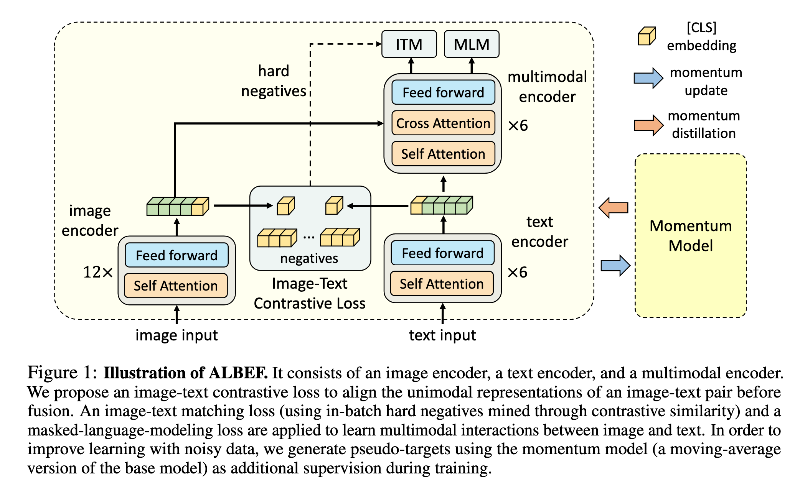
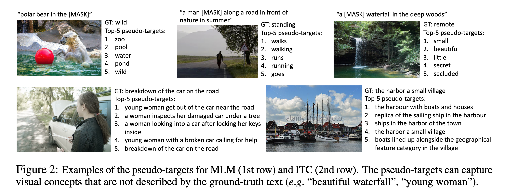
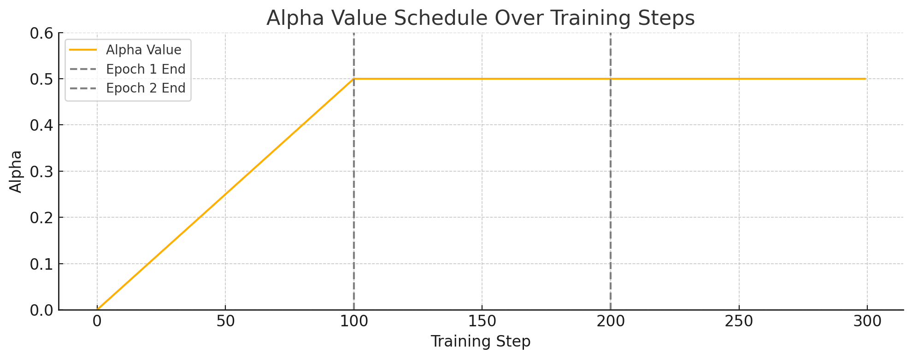

`Align before Fuse: Vision and Language Representation Learning with Momentum Distillation 论文简析` 

<!-- more -->

> 论文链接: [Align before Fuse: Vision and Language Representation Learning with Momentum Distillation](https://arxiv.org/abs/2107.07651)
> 代码链接: [https://github.com/salesforce/ALBEF](https://github.com/salesforce/ALBEF)

## Introduction

视觉-语言大规模预训练能提升多种视觉语言任务，但视觉和文本的token未对齐，导致多模态编码器难以有效建模图文交互。当前论文提出了一个基于对比损失的“**先对齐后融合**”（ALBEF）策略，通过对比学习先对齐图像和文本的表示，再用跨模态注意力融合，提升表示的准确性。并且ALBEF **不依赖目标检测器**，也不需要高分辨率图像；同时通过引入**动量蒸馏(momentum distillation)自训练方法**，能更有效应对含噪声的网络数据，提高泛化能力。

传统VLP方法依赖目标检测器提取区域特征，结合文本通过多模态编码器处理，面临：

* **图像和文本特征空间不一致**，交互难度大。

* **目标检测器开销高**，注释和计算开销大。

* **网络图文数据噪声多**，容易导致预训练过拟合，泛化差。


ALBEF 采用无检测器的图像编码器和文本编码器独立编码，再用多模态编码器融合。设计**图文对比（ITC）损失**：

* 对齐图文特征空间，简化跨模态融合。

* 改善单模态编码语义理解。

* 学习共同低维空间，促进硬负样本挖掘。

* **提出动量蒸馏（MoD）**，用动量模型生成伪标签，缓解噪声影响，提升预训练及下游表现。

## Related Work

**Vision-Language Representation Learning**:

当前视觉-语言表示学习主要分为两类：一类使用多模态 Transformer 编码器建模图文交互，适用于复杂推理任务但依赖目标检测器和高分辨率图像，计算开销大；另一类则采用独立的图像与文本编码器，通过对比学习在大规模图文对中对齐表示，虽在图文检索中效果出色，但难以处理复杂语义交互。ALBEF 融合两者优势，先用对比学习对齐图文表示，再通过跨模态注意力实现深度融合，同时摒弃目标检测器，在保证高性能的同时显著降低了计算成本，兼顾了效率与泛化能力。

**Knowledge Distillation**:

传统知识蒸馏通过教师模型指导学生模型提升性能，通常依赖预训练教师。近年来的在线蒸馏则使用多个同时训练的模型进行知识迁移。ALBEF 提出的 Momentum Distillation 属于自蒸馏的一种形式，通过使用自身参数的滑动平均作为教师，生成伪标签辅助训练。该方法无需额外模型，能缓解弱标注图文数据中的噪声问题，提升表示稳定性和泛化能力。

## ALBEF

### Model Structure



ALBEF 模型由三个主要部分组成：图像编码器、文本编码器和多模态编码器。图像编码器采用了预训练的 ViT-B/16（12 层视觉 Transformer），将输入图像编码为一系列嵌入向量。文本编码器和多模态编码器均为 6 层 Transformer，分别初始化自 BERTbase 的前 6 层和后 6 层。文本经过编码后生成的嵌入序列，会与图像嵌入一起送入多模态编码器进行融合。融合过程在多模态编码器的每一层中通过跨模态注意力（Cross Attention）实现，实现图文信息的深层交互。

### Pre-training Objectives

我们对 ALBEF 进行预训练，包含三个目标：在单模态编码器上进行图文对比学习（ITC），以及在多模态编码器上进行掩码语言模型（MLM）和图文匹配（ITM）。我们通过在线对比难样本挖掘来改进图文匹配（ITM）。

#### Image-Text Contrastive Learning

图文对比学习旨在融合之前学习更好的单模态表示。它通过学习一个相似度函数

$$
s = g_v(\mathbf{v}_{\text{cls}})^\top g_w(\mathbf{w}_{\text{cls}})
$$

使得配对的图文具有更高的相似度得分。这里 $g_{v}$ 和 $g_{w}$ 是线性变换，用于将 `[CLS]` 表征映射到归一化的低维（256维）向量。受 MoCo 启发，**我们维护两个队列来存储动量单模态编码器最近的 $M$ 个图文表示**。动量编码器生成的归一化特征分别记为

$$
g'_v(\mathbf{v}'_{\text{cls}}) \quad \text{和} \quad g'_w(\mathbf{w}'_{\text{cls}})
$$

定义相似度函数为：

$$
s(I, T) = g_v(\mathbf{v}_{\text{cls}})^\top g'_w(\mathbf{w}'_{\text{cls}}), \quad s(T, I) = g_w(\mathbf{w}_{\text{cls}})^\top g'_v(\mathbf{v}'_{\text{cls}})
$$

对于每个图像和文本，我们计算归一化的图像到文本和文本到图像的 softmax 相似度：

$$
p_m^{\text{i2t}}(I) = \frac{\exp(s(I, T_m)/\tau)}{\sum_{m=1}^M \exp(s(I, T_m)/\tau)}, \quad p_m^{\text{t2i}}(T) = \frac{\exp(s(T, I_m)/\tau)}{\sum_{m=1}^M \exp(s(T, I_m)/\tau)}
$$

其中 $\tau$ 是一个可学习的温度参数。令 $\mathbf{y}^{\text{i2t}}(I)$ 和 $\mathbf{y}^{\text{t2i}}(T)$ 分别表示真实的 one-hot 标签，负样本概率为 0，正样本概率为 1。图文对比损失定义为交叉熵 $\mathbb{H}$：

$$
\mathcal{L}_{\text{itc}} = \frac{1}{2} \mathbb{E}_{(I, T) \sim D} \left[ \mathbb{H}(\mathbf{y}^{\text{i2t}}(I), \mathbf{p}^{\text{i2t}}(I)) + \mathbb{H}(\mathbf{y}^{\text{t2i}}(T), \mathbf{p}^{\text{t2i}}(T)) \right]
$$

---

#### Masked Language Modeling（MLM）

Masked Language Modeling 利用图像和上下文文本共同预测被 mask 掉的单词。我们以 15% 的概率随机将输入文本中的 token 替换为特殊标记 `[MASK]`。设 $\hat{T}$ 表示被 mask 的文本，$p^{\text{msk}}(I, \hat{T})$ 表示模型预测的被 mask token 的概率分布。MLM 任务的目标是最小化交叉熵损失：

$$
\mathcal{L}_{\text{mlm}} = \mathbb{E}_{(I, \hat{T}) \sim \mathcal{D}} \, \mathbb{H}(\mathbf{y}^{\text{msk}}, p^{\text{msk}}(I, \hat{T}))
$$

其中 $\mathbf{y}^{\text{msk}}$ 是 one-hot 词表分布，真实标签对应的概率为 1。

---

#### Image-Text Matching（ITM）

Image-Text Matching 用于判断图文对是否匹配。我们使用多模态编码器输出的 `[CLS]` token 表征作为图文对的联合表示，接一个全连接层（FC），再通过 softmax 得到预测概率 $p^{\text{itm}}$，最终计算 ITM 的交叉熵损失：

$$
\mathcal{L}_{\text{itm}} = \mathbb{E}_{(I, T) \sim \mathcal{D}} \, \mathbb{H}(\mathbf{y}^{\text{itm}}, p^{\text{itm}}(I, T))
$$

其中 $\mathbf{y}^{\text{itm}}$ 是二分类 one-hot 向量，表示图文对的真实匹配状态。

我们提出了一种 **零计算开销的 ITM 硬负样本采样策略**：

* 若图文语义相近但细节不同，则视为 **hard negative**；

* 利用图文对比损失中的相似度作为度量，在 mini-batch 中为每张图像选择一个最相似的非匹配文本作为负样本；

* 同样地，为每个文本选择一个最相似的非匹配图像。

---

ALBEF 预训练总目标函数：

$$
\mathcal{L} = \mathcal{L}_{\text{itc}} + \mathcal{L}_{\text{mlm}} + \mathcal{L}_{\text{itm}}
$$

### Momentum Distillation 

视觉-语言预训练所使用的图文对大多来自网页，因此存在较大的噪声。例如：正样本图文对往往关联性较弱，文本中可能包含与图像无关的信息，图像中也可能存在未被文本描述的实体。在对比学习（ITC）中，有些“负样本”文本可能实际上与图像语义一致；而在掩码语言建模（MLM）中，也可能存在多个与被 mask 单词同样合理甚至更好的替代词。但标准 one-hot 标签的监督会一律惩罚这些“非标答案”。

为解决这一问题，ALBEF 提出使用 **动量模型（Momentum Model）生成伪标签（pseudo-targets）进行蒸馏监督**。动量模型是对主模型参数的滑动平均版本（exponential moving average），起到“老师模型”的作用。在训练中，主模型被训练去匹配动量模型的预测，从而提升鲁棒性和泛化能力。

---

**对比学习中的动量蒸馏:**

设动量编码器生成的相似度为：

$$
s'(I, T) = g'_v(\mathbf{v}'_{\text{cls}})^\top g'_w(\mathbf{w}'_{\text{cls}}), \quad
s'(T, I) = g'_w(\mathbf{w}_{\text{cls}})^\top g'_v(\mathbf{v}'_{\text{cls}})
$$

将其代入标准的对比学习 softmax 公式中，构造软标签（soft pseudo-target）$q^{\text{i2t}}, q^{\text{t2i}}$。然后定义 ITC 的动量蒸馏损失为：

$$
\mathcal{L}^{\text{mod}}_{\text{itc}} = (1 - \alpha) \mathcal{L}_{\text{itc}} +
\frac{\alpha}{2} \mathbb{E}_{(I,T) \sim D} \left[
\text{KL}(q^{\text{i2t}}(I) \parallel p^{\text{i2t}}(I)) +
\text{KL}(q^{\text{t2i}}(T) \parallel p^{\text{t2i}}(T))
\right]
$$

这里的 KL 表示 Kullback-Leibler 散度，衡量模型预测分布与动量模型生成的软标签之间的差异。

---

**掩码语言建模中的动量蒸馏:**

设动量模型在图像 $I$ 和被 mask 的文本 $\hat{T}$ 上预测得到的概率分布为 $q^{\text{msk}}(I, \hat{T})$，主模型的预测为 $p^{\text{msk}}(I, \hat{T})$。对应的蒸馏损失定义为：

$$
\mathcal{L}^{\text{mod}}_{\text{mlm}} = (1 - \alpha) \mathcal{L}_{\text{mlm}} +
\alpha \, \mathbb{E}_{(I,\hat{T}) \sim D} \, \text{KL}(q^{\text{msk}}(I, \hat{T}) \parallel p^{\text{msk}}(I, \hat{T}))
$$

这样的设计使得 MLM 模型不再被 one-hot 标签约束，可以学习更丰富的词汇表达，捕捉与图像内容相关的多种可能性。

---



如论文中的图 2 所示，动量模型生成的伪标签往往比真实标签更具多样性和语义丰富性。例如：

* 原始文本：`"polar bear in the [MASK]"`
  真实标签：`wild`
  伪标签前五名：`zoo`, `pool`, `water`, `pond`, `wild`

这种伪标签不仅能补充视觉信息中的遗漏，还能提供更灵活的语义参考。

---

通过引入动量蒸馏，ALBEF 能够：

* 在噪声标签数据上提高学习效果；
* 避免因 one-hot 标签过度惩罚合理预测；
* 在多任务（如 ITC 和 MLM）中更稳定地训练；
* 提高预训练模型在下游任务中的表现。

动量蒸馏的总体损失是对原始监督信号与伪监督信号的加权组合，平衡其指导作用：

$$
\mathcal{L}^{\text{mod}} = \mathcal{L}^{\text{mod}}_{\text{itc}} + \mathcal{L}^{\text{mod}}_{\text{mlm}} + \mathcal{L}_{\text{itm}}
$$

其中 $\alpha$ 控制动量蒸馏信号的强度，实验中统一设为 0.4。

## Code Implementation

### Train

训练代码:

```python
def train(model, data_loader, optimizer, tokenizer, epoch, warmup_steps, device, scheduler, config):
    for i, (image, text) in enumerate(metric_logger.log_every(data_loader, print_freq, header)):
        optimizer.zero_grad()

        image = image.to(device,non_blocking=True) 
        text_input = tokenizer(text, padding='longest', truncation=True, max_length=25, return_tensors="pt").to(device)  
        
        if epoch>0:
            alpha = config['alpha']
        else:
            alpha = config['alpha']*min(1,i/len(data_loader)) 
        
        loss_mlm, loss_ita, loss_itm = model(image, text_input, alpha = alpha)  
            
        loss = loss_mlm + loss_ita + loss_itm    
          
        loss.backward()
        optimizer.step()
```
**为何前期要让 α 慢慢增加？**

> 训练初期模型尚不稳定，动量分支的 soft label 不可靠。直接用 soft label 可能误导主模型。因此，先以 hard label 为主，逐渐引入 soft label 的指导。

- 前期：alpha ≈ 0 → 以 one-hot 监督为主，训练稳定

- 中期：alpha 上升 → soft label 引入更丰富的监督

- 后期：alpha ≈ config['alpha'] → 强化多义性和类间相似度学习，提高泛化



图中展示的是 ALBEF 模型训练过程中 alpha 参数的变化趋势：

1. 第一个 epoch（前 100 步）：alpha 线性从 0 增加到设定的最大值（如 0.5）。这种方式在训练初期让模型更多依赖于 one-hot 形式的监督信号，降低动量负样本带来的扰动。

2. 第二个 epoch 及之后：alpha 恒定为最大值（例如 0.5），意味着动量分布和 one-hot label 的加权比固定，开始充分利用动量编码器提供的软标签来训练。

---

### Model Init

ALBEF 模型初始化:

```python
def __init__(self,                 
             text_encoder = None,
             tokenizer = None,
             config = None,    
             temp = 0.07,
             init_deit = True
             ):
    super().__init__()
    
    # 初始化 tokenizer（用于文本编码）
    self.tokenizer = tokenizer 
    
    # MLM 任务中 mask 掉的 token 比例
    self.mlm_probability = config['mlm_probability']
    
    # 图文对比学习后的共同嵌入维度
    embed_dim = config['embed_dim']
 
    # 初始化视觉编码器（ViT backbone），输出: (B, N+1, 768)
    self.visual_encoder = VisionTransformer(
        img_size=config['image_res'], patch_size=16, embed_dim=768, depth=12, num_heads=12, 
        mlp_ratio=4, qkv_bias=True, norm_layer=partial(nn.LayerNorm, eps=1e-6))   
    
    vision_width = config['vision_width']  # ViT 输出维度，通常为 768

    # 加载文本编码器 BertConfig 配置
    bert_config = BertConfig.from_json_file(config['bert_config'])
    
    # 加载文本编码器，输出: (B, L, hidden_size)，默认 hidden_size = 768
    self.text_encoder = BertForMaskedLM.from_pretrained(text_encoder, config=bert_config)      

    text_width = self.text_encoder.config.hidden_size  # Bert 输出维度（默认 768）

    # 图像特征 → 共享嵌入空间（Linear projection）：(B, vision_width) → (B, embed_dim)
    self.vision_proj = nn.Linear(vision_width, embed_dim)
    
    # 文本特征 → 共享嵌入空间（Linear projection）：(B, text_width) → (B, embed_dim)
    self.text_proj = nn.Linear(text_width, embed_dim)         

    # 学习温度系数 temp ∈ [0.001, 0.5]，用于对比学习中的 softmax 除法
    self.temp = nn.Parameter(torch.ones([]) * config['temp'])   

    # 对比学习中的队列长度（如 65536）
    self.queue_size = config['queue_size']

    # 动量更新系数（如 0.995）
    self.momentum = config['momentum']  

    # ITM 分类头：输入为 text_encoder 最后一层的 CLS 特征 → 输出为二分类 (B, 2)
    self.itm_head = nn.Linear(text_width, 2)     

    # =============== 构建动量编码器（结构与主模型相同，仅参数使用 EMA 更新）===============

    self.visual_encoder_m = VisionTransformer(
        img_size=config['image_res'], patch_size=16, embed_dim=768, depth=12, num_heads=12, 
        mlp_ratio=4, qkv_bias=True, norm_layer=partial(nn.LayerNorm, eps=1e-6)) 
    
    self.vision_proj_m = nn.Linear(vision_width, embed_dim)
    
    self.text_encoder_m = BertForMaskedLM.from_pretrained(text_encoder, config=bert_config)       
    
    self.text_proj_m = nn.Linear(text_width, embed_dim)    

    # 将主编码器和动量编码器配对，用于 EMA 参数更新
    self.model_pairs = [[self.visual_encoder,self.visual_encoder_m],
                        [self.vision_proj,self.vision_proj_m],
                        [self.text_encoder,self.text_encoder_m],
                        [self.text_proj,self.text_proj_m],
                       ]
    
    # 初始化动量编码器参数 = 主模型参数
    self.copy_params()

    # =============== 初始化负样本队列 ===============
    
    # 图像特征队列：(embed_dim, queue_size)
    self.register_buffer("image_queue", torch.randn(embed_dim, self.queue_size))

    # 文本特征队列：(embed_dim, queue_size)
    self.register_buffer("text_queue", torch.randn(embed_dim, self.queue_size))

    # 当前入队位置指针，形状: (1,)
    self.register_buffer("queue_ptr", torch.zeros(1, dtype=torch.long))  

    # 初始化队列特征为单位向量，便于之后相似度计算
    self.image_queue = nn.functional.normalize(self.image_queue, dim=0)
    self.text_queue = nn.functional.normalize(self.text_queue, dim=0)
```


---

###  ITC

ALBEF 模型前向传播中的 ITC 学习目标实现过程:

```python
def forward(self, image, text, alpha=0):
    # 1. 使用 ViT 对图像进行编码，输出图像特征
    #    image_embeds: (B, N+1, embed_dim)，N 个 patch + 1 个 CLS token
    image_embeds = self.visual_encoder(image)

    # 2. 构造图像的 attention mask，全部为1，表示无 padding
    #    image_atts: (B, N+1)，与 image_embeds 保持一致
    image_atts = torch.ones(image_embeds.size()[:-1], dtype=torch.long).to(image.device)

    # 3. 取出 CLS Token（图像全局语义），进行线性变换 + 归一化
    #    image_feat: (B, D)，D为投影后的embedding维度（如256）
    image_feat = F.normalize(self.vision_proj(image_embeds[:, 0, :]), dim=-1)

    # 4. 文本编码器（BERT）对文本进行编码
    #    text_output.last_hidden_state: (B, L, H)，L 为文本长度，H 为hidden size
    text_output = self.text_encoder.bert(text.input_ids, attention_mask=text.attention_mask,
                                         return_dict=True, mode='text')
    text_embeds = text_output.last_hidden_state

    # 5. 取出 CLS Token（文本全局语义），线性变换 + 归一化
    #    text_feat: (B, D)
    text_feat = F.normalize(self.text_proj(text_embeds[:, 0, :]), dim=-1)

    # ========== 以下为动量编码器分支（momentum encoder），不参与反向传播 ==========
    with torch.no_grad():
        # 6. 更新动量编码器参数（对主编码器做 EMA）
        self._momentum_update()

        # 7. 动量图像编码器输出特征
        #    image_embeds_m: (B, N+1, embed_dim)
        #    image_feat_m: (B, D)
        image_embeds_m = self.visual_encoder_m(image)
        image_feat_m = F.normalize(self.vision_proj_m(image_embeds_m[:, 0, :]), dim=-1)

        # 8. 拼接当前动量图像特征和图像队列（K 个历史负样本）
        #    image_feat_m.T: (D, B)
        #    image_queue: (D, K)
        #    image_feat_all: (D, B + K)
        image_feat_all = torch.cat([image_feat_m.t(), self.image_queue.clone().detach()], dim=1)

        # 9. 动量文本编码器输出特征
        #    text_output_m.last_hidden_state: (B, L, H)
        #    text_feat_m: (B, D)
        text_output_m = self.text_encoder_m.bert(text.input_ids, attention_mask=text.attention_mask,
                                                 return_dict=True, mode='text')
        text_feat_m = F.normalize(self.text_proj_m(text_output_m.last_hidden_state[:, 0, :]), dim=-1)

        # 10. 拼接当前动量文本特征和文本队列
        #     text_feat_all: (D, B + K)
        text_feat_all = torch.cat([text_feat_m.t(), self.text_queue.clone().detach()], dim=1)

        # 11. 图像特征与所有文本特征做内积，计算相似度（B, B+K）
        sim_i2t_m = image_feat_m @ text_feat_all / self.temp
        sim_t2i_m = text_feat_m @ image_feat_all / self.temp

        # 12. 构造一对一的匹配目标（对角为正样本）
        #     sim_targets: (B, B+K)，对角为1，其他为0
        sim_targets = torch.zeros(sim_i2t_m.size()).to(image.device)
        sim_targets.fill_diagonal_(1)

        # 13. 构造 soft label（平滑过的对比目标）
        #     alpha = 0 则为 hard label，alpha 越大越 soft
        sim_i2t_targets = alpha * F.softmax(sim_i2t_m, dim=1) + (1 - alpha) * sim_targets
        sim_t2i_targets = alpha * F.softmax(sim_t2i_m, dim=1) + (1 - alpha) * sim_targets

    # ========== 当前主分支计算相似度，用于 loss 反向传播 ==========
    # 14. 使用主分支特征与队列拼接结果计算图像-文本相似度（B, B+K）
    sim_i2t = image_feat @ text_feat_all / self.temp
    sim_t2i = text_feat @ image_feat_all / self.temp

    # 15. 计算交叉熵损失（基于 soft label 的 KL loss）
    loss_i2t = -torch.sum(F.log_softmax(sim_i2t, dim=1) * sim_i2t_targets, dim=1).mean()
    loss_t2i = -torch.sum(F.log_softmax(sim_t2i, dim=1) * sim_t2i_targets, dim=1).mean()

    # 16. 图文对比损失（取双向平均）
    loss_ita = (loss_i2t + loss_t2i) / 2

    # 17. 将当前动量特征送入队列，更新队列
    self._dequeue_and_enqueue(image_feat_m, text_feat_m)
```
**加入动量队列中的样本作为负样本，是为了扩大负样本池，提升训练难度、判别性和稳定性，使模型能学到更强的图文对齐表示。**

---

### ITM

ALBEF 模型前向传播中的 ITM 学习目标实现过程:

```python
###=================================###
# 正向图文对的前向传播（正样本）

output_pos = self.text_encoder.bert(
    encoder_embeds = text_embeds,                 # 输入文本的嵌入表示
    attention_mask = text.attention_mask,         # 文本的注意力掩码
    encoder_hidden_states = image_embeds,         # 图像特征作为 cross-attention 的 encoder hidden state
    encoder_attention_mask = image_atts,          # 图像 attention mask（通常为全 1）
    return_dict = True,                           # 返回结构化输出（字典）
    mode = 'fusion',                              # 模态融合模式
)

# ================================= #
# 计算 ITC 相似度生成的 soft label，用于选择难负样本
with torch.no_grad():
    bs = image.size(0)  # batch size
    
    # 图像到文本的相似度权重（归一化) , sim_i2t维度为(B, B+K) , 这里只取前B个样本, 不考虑从动量队列拿到的负样本
    weights_i2t = F.softmax(sim_i2t[:, :bs], dim=1)
    # 文本到图像的相似度权重（归一化）
    weights_t2i = F.softmax(sim_t2i[:, :bs], dim=1)

    # 屏蔽对角线（避免采样到自己）
    weights_i2t.fill_diagonal_(0)
    weights_t2i.fill_diagonal_(0)

# ================================= #
# 采样每个文本对应的负图像（hard negative）

image_embeds_neg = []
for b in range(bs):
    neg_idx = torch.multinomial(weights_t2i[b], 1).item()  # 按权重从当前行采样一个负样本索引
    image_embeds_neg.append(image_embeds[neg_idx])         # 获取对应的负图像嵌入
image_embeds_neg = torch.stack(image_embeds_neg, dim=0)    # [B, D]

# 采样每个图像对应的负文本（hard negative）

text_embeds_neg = []
text_atts_neg = []
for b in range(bs):
    neg_idx = torch.multinomial(weights_i2t[b], 1).item()
    text_embeds_neg.append(text_embeds[neg_idx])            # 获取对应的负文本嵌入
    text_atts_neg.append(text.attention_mask[neg_idx])      # 同时获取对应的 attention mask
text_embeds_neg = torch.stack(text_embeds_neg, dim=0)
text_atts_neg = torch.stack(text_atts_neg, dim=0)

# 构造新的图文对：正文本 + 负文本，负图像 + 正图像
# 共有 2N 个图文对：N 个正样本 + N 个负样本（正文负图 + 正图负文）

text_embeds_all = torch.cat([text_embeds, text_embeds_neg], dim=0)
text_atts_all = torch.cat([text.attention_mask, text_atts_neg], dim=0)

image_embeds_all = torch.cat([image_embeds_neg, image_embeds], dim=0)
image_atts_all = torch.cat([image_atts, image_atts], dim=0)

# 所有图文对的前向传播（用于 ITM 分类）

output_neg = self.text_encoder.bert(
    encoder_embeds = text_embeds_all,
    attention_mask = text_atts_all,
    encoder_hidden_states = image_embeds_all,
    encoder_attention_mask = image_atts_all,
    return_dict = True,
    mode = 'fusion',
)

# 提取 [CLS] token 表征作为跨模态图文对表示，输入到 ITM 头
vl_embeddings = torch.cat([
    output_pos.last_hidden_state[:, 0, :],   # 正样本 [CLS]
    output_neg.last_hidden_state[:, 0, :]    # 负样本 [CLS]
], dim=0)

# 二分类：匹配 or 不匹配
vl_output = self.itm_head(vl_embeddings)  # shape: [3N, 2]

# 构造 ground-truth 标签：前 N 个为正样本（1），后 2N 个为负样本（0）
itm_labels = torch.cat([
    torch.ones(bs, dtype=torch.long),       # N 个正样本
    torch.zeros(2*bs, dtype=torch.long)     # 2N 个负样本（正图负文 + 正文负图）
], dim=0).to(image.device)

# 计算 ITM 的交叉熵损失
loss_itm = F.cross_entropy(vl_output, itm_labels)
```
> 补充说明:

ALBEF 在进行 CrossAttention 时，image features 会作为 key 和 value ，而 text features 作为 query:

```python
class BertSelfAttention(nn.Module): 
    def forward(
        self,
        hidden_states,
        attention_mask=None,
        head_mask=None,
        encoder_hidden_states=None,
        encoder_attention_mask=None,
        past_key_value=None,
        output_attentions=False,
    ):
        # 1. text features 固定作为 query 计算来源
        mixed_query_layer = self.query(hidden_states)

        # 2. 传入了 image features ，则做 cross attention
        is_cross_attention = encoder_hidden_states is not None

        if is_cross_attention:
            key_layer = self.transpose_for_scores(self.key(encoder_hidden_states))
            value_layer = self.transpose_for_scores(self.value(encoder_hidden_states))
            attention_mask = encoder_attention_mask
        else:
            key_layer = self.transpose_for_scores(self.key(hidden_states))
            value_layer = self.transpose_for_scores(self.value(hidden_states))

        query_layer = self.transpose_for_scores(mixed_query_layer)

        ...
```

ALBEF 采用加权随机采样而非直接取相似度最大的负样本（argmax），是为了在突出“难负样本”的同时保持训练的稳定性和多样性，避免模型过拟合于极端负样本或伪负样本，从而提升泛化能力和鲁棒性。

---

### MLM


ALBEF 模型前向传播中的 MLM 学习目标实现过程:

```python
##================= MLM ========================##                

# 克隆一份 input_ids 和 labels，作为 MLM 的输入和标签副本
input_ids = text.input_ids.clone()
labels = input_ids.clone()

# 构造一个与 input_ids 同形状的矩阵，值为 mask 概率（例如 0.15）
probability_matrix = torch.full(labels.shape, self.mlm_probability)                    

# 对 input_ids 按照给定概率进行 [MASK] 操作，同时将对应的 labels 保留为原始 token id，其余位置设为 -100（忽略）
input_ids, labels = self.mask(input_ids, self.text_encoder.config.vocab_size, image.device, targets=labels,
                              probability_matrix = probability_matrix) 

# ===== 使用动量编码器对 masked 输入做前向传播，获取 soft target（Teacher 网络） =====
# 注意：这一步不计算梯度，仅用于生成 soft label
with torch.no_grad():
    logits_m = self.text_encoder_m(
        input_ids, 
        attention_mask = text.attention_mask,                         # 文本 attention mask
        encoder_hidden_states = image_embeds_m,                       # 动量视觉特征
        encoder_attention_mask = image_atts,                          # 图像 attention mask
        return_dict = True,
        return_logits = True,                                         # 返回 logits 用于 soft label
    )    

# ===== 主网络进行 MLM 前向传播，并引入 soft label 监督 =====
mlm_output = self.text_encoder(
    input_ids, 
    attention_mask = text.attention_mask,
    encoder_hidden_states = image_embeds,                            # 主视觉特征（非动量）
    encoder_attention_mask = image_atts,
    return_dict = True,
    labels = labels,                                                 # 用于 standard cross-entropy 监督（hard label）
    soft_labels = F.softmax(logits_m, dim=-1),                       # soft label 来自动量编码器（Teacher）
    alpha = alpha                                                    # 混合比：控制 hard 和 soft loss 的权重
)

# 最终的 masked language modeling 损失
loss_mlm = mlm_output.loss 
```
mask 方法代码实现:

```python
def mask(self, input_ids, vocab_size, device, targets=None, masked_indices=None, probability_matrix=None):
    # Step 1: 生成掩码位置
    if masked_indices is None:                                       
        # 若未指定掩码位置，则按给定的概率矩阵进行伯努利采样，得到每个 token 是否被 mask
        masked_indices = torch.bernoulli(probability_matrix).bool()

    # Step 2: 屏蔽不可 mask 的位置（例如 [PAD] 和 [CLS]）
    masked_indices[input_ids == self.tokenizer.pad_token_id] = False
    masked_indices[input_ids == self.tokenizer.cls_token_id] = False

    # Step 3: 构造目标标签（只对被 mask 的位置计算 loss）
    if targets is not None:
        targets[~masked_indices] = -100  # 非 mask 位置的标签设为 -100，表示 loss 忽略

    # Step 4: 对被 mask 的 token 进行替换（按 BERT 策略）
    # 80% 的 mask token 被替换为 [MASK]
    indices_replaced = torch.bernoulli(torch.full(input_ids.shape, 0.8)).bool() & masked_indices
    input_ids[indices_replaced] = self.tokenizer.mask_token_id

    # 10% 的 mask token 被替换为随机 token（噪声）
    indices_random = torch.bernoulli(torch.full(input_ids.shape, 0.5)).bool() & masked_indices & ~indices_replaced
    random_words = torch.randint(vocab_size, input_ids.shape, dtype=torch.long).to(device)
    input_ids[indices_random] = random_words[indices_random]

    # 剩下的 10% 保持原样（不修改 token）

    # Step 5: 返回掩码后的 input_ids 和（可选的）标签 targets
    if targets is not None:
        return input_ids, targets
    else:
        return input_ids
```

text_encoder 前向传播代码实现:

```python
def forward(
    self,
    input_ids=None,
    attention_mask=None,
    token_type_ids=None,
    position_ids=None,
    head_mask=None,
    inputs_embeds=None,
    encoder_embeds=None,                # 外部传入的 encoder embeddings（不常用）
    encoder_hidden_states=None,        # 图像编码器输出（作为 cross-attn 的 K,V）
    encoder_attention_mask=None,       # 图像部分的 attention mask
    labels=None,                        # MLM 标签（只在 MLM 模式中提供）
    output_attentions=None,
    output_hidden_states=None,
    return_dict=None,
    is_decoder=False,
    mode='multi_modal',                # 模式控制，支持 'fusion'（图文融合）等
    soft_labels=None,                  # 蒸馏 soft labels，来自 momentum encoder
    alpha=0,                           # 蒸馏损失的权重
    return_logits=False,               # 是否仅返回 logits（用于 momentum 计算）
):

    # Step 1: 调用 BERT 模型（支持 encoder-decoder 模式，支持 fusion 模式）
    outputs = self.bert(
        input_ids,
        attention_mask=attention_mask,
        token_type_ids=token_type_ids,
        position_ids=position_ids,
        head_mask=head_mask,
        inputs_embeds=inputs_embeds,
        encoder_embeds=encoder_embeds,
        encoder_hidden_states=encoder_hidden_states,
        encoder_attention_mask=encoder_attention_mask,
        output_attentions=output_attentions,
        output_hidden_states=output_hidden_states,
        return_dict=return_dict,
        is_decoder=is_decoder,
        mode=mode,
    )

    # Step 2: 获取 transformer 输出的 token 表征（[B, L, D]）
    sequence_output = outputs[0]

    # Step 3: 计算每个 token 的预测分布（[B, L, vocab_size]）
    prediction_scores = self.cls(sequence_output)

    # Step 4: 若只需输出 logits（如 momentum 模型前向），直接返回
    if return_logits:
        return prediction_scores

    # Step 5: 计算标准 MLM 交叉熵损失（仅对 label ≠ -100 的位置有效）
    masked_lm_loss = None
    if labels is not None:
        loss_fct = CrossEntropyLoss()  # 忽略标签为 -100 的位置
        masked_lm_loss = loss_fct(prediction_scores.view(-1, self.config.vocab_size), labels.view(-1))

    # Step 6: 若提供 soft labels（如知识蒸馏），计算 KL-style 蒸馏损失
    if soft_labels is not None:
        # 蒸馏损失：soft label 和当前输出的 softmax 分布之间的 KL 散度
        loss_distill = -torch.sum(
            F.log_softmax(prediction_scores, dim=-1) * soft_labels,
            dim=-1
        )
        loss_distill = loss_distill[labels != -100].mean()

        # 混合两种损失：标准 MLM loss 和 蒸馏 loss
        masked_lm_loss = (1 - alpha) * masked_lm_loss + alpha * loss_distill

    # Step 7: 根据 return_dict 控制输出格式（支持 tuple 或 dict）
    if not return_dict:
        output = (prediction_scores,) + outputs[2:]
        return ((masked_lm_loss,) + output) if masked_lm_loss is not None else output

    # 标准化输出（MaskedLMOutput 是 huggingface 定义的一个结构体）
    return MaskedLMOutput(
        loss=masked_lm_loss,
        logits=prediction_scores,
        hidden_states=outputs.hidden_states,
        attentions=outputs.attentions,
    )
```
> 注意:

 HuggingFace 的 CrossEntropyLoss 默认会忽略标签为 -100 的位置，这是 PyTorch 官方文档中的行为规范：
 
 ```python
 class CrossEntropyLoss(_WeightedLoss):
     def __init__(
        self,
        weight: Optional[Tensor] = None,
        size_average=None,
        ignore_index: int = -100,
        reduce=None,
        reduction: str = "mean",
        label_smoothing: float = 0.0,
    ) 
 ```

