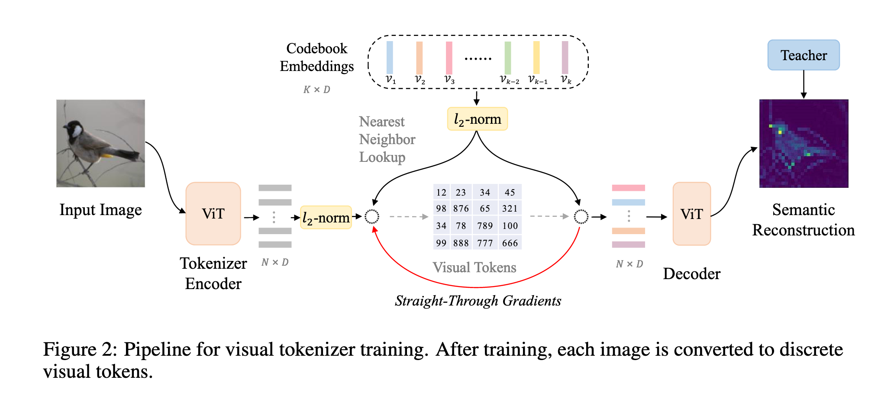
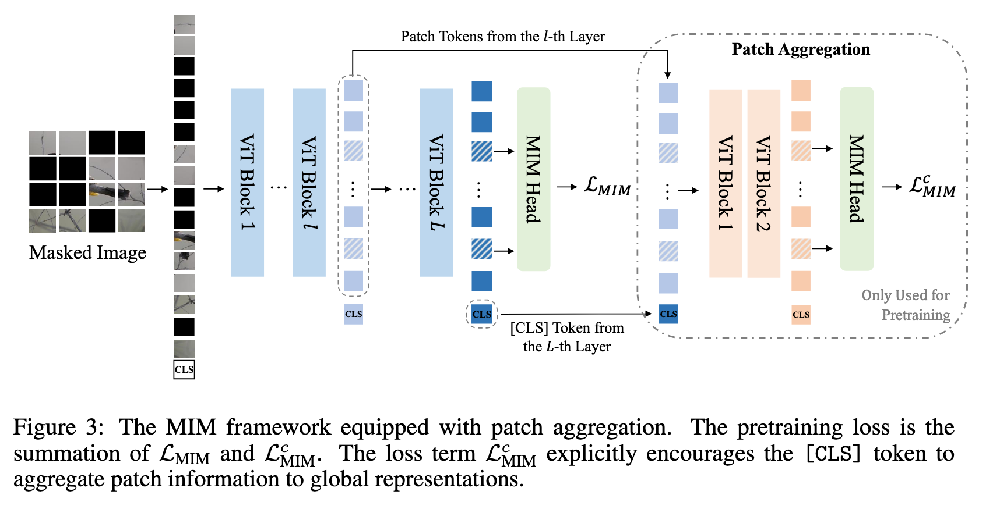

`BEiT v2: Masked Image Modeling with Vector-Quantized Visual Tokenizers 论文解读` 

<!-- more -->

> 论文链接: [BEiT v2: Masked Image Modeling with Vector-Quantized Visual Tokenizers](https://arxiv.org/abs/2208.06366)
> 代码链接: [https://github.com/microsoft/unilm/tree/master/beit2](https://github.com/microsoft/unilm/tree/master/beit2)

## 引言

掩码图像建模（MIM）通过恢复被掩码的图像块，能够在自监督学习中捕捉丰富的上下文信息，但大多数方法仅在低层像素上操作。

现有重建目标可以分为三类：

* 低层图像元素（如原始像素）

* 手工特征（如 HOG 特征）

* 视觉 token

这些方法大多忽略了高层语义信息，而语言模型中的掩码词都是高层语义，这启发了 MIM 可以借助语义感知监督进行改进。



**BEIT V2** 提出 **向量量化知识蒸馏（VQ-KD）**，将连续的语义空间离散化为紧凑的视觉 token。VQ-KD 训练过程：

1. 编码器将输入图像转为离散 token，基于可学习码本（codebook）。

2. 解码器根据教师模型编码的语义特征重建图像特征。

训练完成后，VQ-KD 的编码器被用作 BEIT V2 的语义视觉分词器，离散 token 作为监督信号进行 MIM 预训练。引入 **图像块聚合策略**，让 \[CLS] token 聚合全局信息，解决传统 MIM 过度关注局部块重建而忽略全局表示的问题。

## 方法

### 预训练阶段一:  向量量化知识蒸馏算法用于d-VAE预训练


BEIT V2 继承了 BEIT 的掩码图像建模（Masked Image Modeling）框架，其核心思想是将每张图像通过视觉 tokenizer 转换为一组离散的视觉 token，然后训练模型去恢复被遮挡的 token。每个 token 对应图像中的一个 patch，从而实现对局部图像信息的建模（如图 2 所示）。训练过程中，引入了向量量化知识蒸馏（VQ-KD）算法，用于训练视觉 tokenizer，使其能够有效将图像映射到离散编码。

图像表示部分，输入图像 $x \in R^{H \times W \times C}$ 会被划分为 $N = HW / P^2$ 个 patch ${x_p^i}_{i=1}^N$，每个 patch 大小为 $(P, P)$，在实验中 224 × 224 图像被划分为 14 × 14 个 patch，每个 patch 16 × 16。所有 patch 展平并线性映射得到 Transformer 的输入嵌入 ${h_i}_{i=1}^N$，用于后续编码。

在 VQ-KD 训练中，视觉 tokenizer 由编码器和量化器组成：

* 编码器将图像转换为 patch 表征 $h_i$；

* 量化器在代码本 $V \in R^{K \times D}$ 中查找每个 $h_i$ 的最近邻进行量化，得到离散 token $z_i$，公式为：

$$
z_i = \arg\min_j ||\hat{h}_i - \hat{v}_j||_2, \quad j \in \{1,2,\dots,K\}
$$

其中 $\hat{\cdot}$ 表示 $L_2$ 归一化，等价于基于余弦相似度查找最近代码。量化后的 $L_2$ 归一化代码 ${\hat{v}_{z_i}}$ 输入解码器，解码器输出 ${o_i}$ 尝试重建教师模型（如 DINO 或 CLIP）的语义特征 $t_i$。训练目标最大化 decoder 输出与教师特征的余弦相似度，同时通过 stop-gradient 机制处理量化不可导问题，梯度从 decoder 输入传递到 encoder 输出。训练目标公式为：

$$
\max \sum_{x \in D} \sum_{i=1}^N \cos(o_i, t_i) - ||sg[\hat{h}_i] - \hat{v}_{z_i}||_2^2 - ||\hat{h}_i - sg[\hat{v}_{z_i}]||_2^2
$$

其中 $sg[\cdot]$ 表示停止梯度操作，$D$ 为训练图像数据集。

向量量化训练中常见问题是代码本塌陷（codebook collapse），即只使用少量编码。为缓解此问题，VQ-KD 使用经验策略：

* 查找最近邻时对代码本嵌入进行 $L_2$ 归一化，并将维度降至 32；

* 在输入 decoder 前将低维嵌入映射回高维空间；

* 代码本嵌入使用指数移动平均（EMA）更新，EMA 能更稳定地追踪模型训练动态。

整体而言，BEIT V2 结合视觉 tokenizer、VQ-KD 和 Transformer 架构，通过 patch 级别的离散表示学习与教师特征对齐，实现对图像语义信息的高效编码与预训练。

#### 代码实现

关于阶段一的预训练过程，我们先来看 `cookbook` 的代码实现，由于 `BEiT-V2` 采用 `EMA(指数平均移动)` 来对码本的状态参数进行缓慢更新，所以代码实现方面会维护一些额外的状态参数:

```python
class EmbeddingEMA(nn.Module):
    def __init__(self, num_tokens, codebook_dim, decay=0.99, eps=1e-5, 
                 kmeans_init=True, codebook_init_path=''):
        """
        向量量化的 codebook（码本）管理类，采用 EMA（指数滑动平均）进行更新。

        参数:
        - num_tokens: 码本的向量个数（即字典大小）
        - codebook_dim: 每个向量的维度
        - decay: EMA 的衰减系数
        - eps: 避免数值错误的小常数
        - kmeans_init: 是否使用 k-means 初始化
        - codebook_init_path: 若提供，则从已有 checkpoint 加载初始化码本
        """
        super().__init__()
        self.num_tokens = num_tokens
        self.codebook_dim = codebook_dim
        self.decay = decay
        self.eps = eps 
        
        # ========== 初始化权重 ==========
        if codebook_init_path == '':   # 如果没有提供预训练的 codebook
            if not kmeans_init:
                # 随机初始化，并做 L2 归一化，保证每个 embedding 向量长度为 1
                weight = torch.randn(num_tokens, codebook_dim)
                weight = l2norm(weight)
            else:
                # 若选择 kmeans_init，则先用全零矩阵占位，稍后再通过 k-means 初始化
                weight = torch.zeros(num_tokens, codebook_dim)

            # 标记是否完成初始化（True=已初始化，False=未初始化）
            self.register_buffer('initted', torch.Tensor([not kmeans_init]))
        else:
            # 如果给定路径，则直接加载预训练的 codebook 权重
            print(f"load init codebook weight from {codebook_init_path}")
            codebook_ckpt_weight = torch.load(codebook_init_path, map_location='cpu')
            weight = codebook_ckpt_weight.clone()
            self.register_buffer('initted', torch.Tensor([True]))
            
        # ========== 需要维护的参数 ==========
        # codebook 权重（不参与梯度更新，使用 EMA 更新）
        self.weight = nn.Parameter(weight, requires_grad = False)

        # 每个 cluster 的大小（计数），用来做 EMA 更新
        self.cluster_size = nn.Parameter(torch.zeros(num_tokens), requires_grad = False)

        # 每个 cluster embedding 的均值，用于 EMA 更新
        self.embed_avg = nn.Parameter(weight.clone(), requires_grad = False)

        # 是否启用更新
        self.update = True
```

`cookbook` 初始化过程大体含有两个阶段: 码本权重初始化; 状态参数初始化; `BEiT-V2` 针对码本权重的初始化还做了特别的优化，我们可以打开 `kmeans_init` 开关，让码本延迟到首次向量量化阶段，采用 `k-means` 算法对 `encoder` 输出的特征向量做聚类迭代，得到 `num_tokens` 个簇中心来作为码本的初始化向量。

这样做的好处是:

* 避免了随机初始化导致的码本塌陷问题;

* 利用了 `encoder` 输出的特征分布信息，使得码本初始化更加合理。

代码实现如下:

```python
    @torch.jit.ignore
    def init_embed_(self, data):
        """
        用 k-means 对码本进行初始化。
        - data: encoder 输出的样本数据 (N, D)
        """
        if self.initted:   # 若已初始化，则跳过
            return
        
        print("Performing K-means init for codebook")

        # 调用 kmeans 获取初始的 cluster 中心和 cluster 大小
        embed, cluster_size = kmeans(data, self.num_tokens, 10, use_cosine_sim = True)

        # 更新权重和 cluster_size
        self.weight.data.copy_(embed)
        self.cluster_size.data.copy_(cluster_size)

        # 设置为已初始化状态
        self.initted.data.copy_(torch.Tensor([True]))
```

k-means 的计算步骤可以总结为以下几个核心环节：

1. **初始化簇中心**

   * 从样本中随机选取 `num_clusters` 个向量作为初始中心，或者使用其他方法（如 k-means++）。

2. **计算样本与中心的距离/相似度**

   * 对每个样本计算它与所有簇中心的距离（欧氏距离）或相似度（余弦相似度）。

3. **样本分配**

   * 将每个样本分配到最近的簇（或相似度最高的簇），形成簇成员集合。

4. **统计簇信息**

   * 统计每个簇的样本数量（用于更新中心和处理空簇）。

5. **更新簇中心**

   * 对每个簇，将簇内样本向量求平均，得到新的中心。

   * 若某簇为空，则保留原中心不变。
   
   * 如果使用余弦相似度，更新后的中心需要做 L2 归一化。

6. **迭代**

   * 重复步骤 2–5，直到达到预定迭代次数或收敛条件。

7. **输出结果**

   * 返回最终的簇中心和每个簇的样本数。

这整个过程就是 k-means 聚类的标准迭代流程：**分配 → 更新 → 循环** , 具体代码实现如下:

```python
def kmeans(samples, num_clusters, num_iters = 10, use_cosine_sim = False):
    # samples: 输入样本，形状 (N, D)，N 是样本数，D 是维度
    # num_clusters: 聚类簇数，即要分成多少类
    # num_iters: k-means 的迭代次数
    # use_cosine_sim: 是否用余弦相似度（默认用欧氏距离）

    # 提取样本维度、数据类型和设备
    dim, dtype, device = samples.shape[-1], samples.dtype, samples.device

    # 从样本中随机选取 num_clusters 个向量作为初始中心
    means = sample_vectors(samples, num_clusters)

    # 重复迭代更新聚类中心
    for _ in range(num_iters):
        if use_cosine_sim:
            # 使用余弦相似度：直接点积即可（因为向量一般做过 l2norm）
            # 结果 shape: (N, K)，表示每个样本和每个中心的相似度
            dists = samples @ means.t()
        else:
            # 使用欧氏距离： (x - μ)^2
            # diffs: (N, 1, D) - (1, K, D) = (N, K, D)
            diffs = rearrange(samples, 'n d -> n () d') \
                    - rearrange(means, 'c d -> () c d')
            # 计算平方距离并取负号（因为后面要用 max 来找最近中心）
            dists = -(diffs ** 2).sum(dim = -1)   # shape: (N, K)

        # 找到每个样本最近的中心（或相似度最大的中心）
        # buckets: (N,) 每个样本对应的簇编号
        buckets = dists.max(dim = -1).indices

        # 统计每个簇的样本数量
        bins = torch.bincount(buckets, minlength = num_clusters)  # (K,)
        # 标记哪些簇没有分配到样本（空簇）
        zero_mask = bins == 0
        # 防止除以 0，把空簇的计数临时设为 1
        bins_min_clamped = bins.masked_fill(zero_mask, 1)

        # 初始化新的簇中心 (K, D)，全部为 0
        new_means = buckets.new_zeros(num_clusters, dim, dtype = dtype)
        # 把属于同一簇的样本向量加到对应的中心上
        # repeat(buckets, 'n -> n d', d = dim): 把 (N,) 扩展成 (N, D)，方便 scatter_add
        new_means.scatter_add_(0, repeat(buckets, 'n -> n d', d = dim), samples)
        # 除以该簇的样本数，得到新的簇中心
        new_means = new_means / bins_min_clamped[..., None]

        # 如果用余弦相似度，记得对中心做 l2norm 归一化
        if use_cosine_sim:
            new_means = l2norm(new_means)

        # 更新簇中心：
        # - 如果该簇是空簇（zero_mask=True），保留旧的中心
        # - 否则更新为新的中心
        means = torch.where(zero_mask[..., None], means, new_means)

    # 返回最终的簇中心和每个簇的样本数
    return means, bins
```

---

向量量化器负责将连续的视觉特征映射到离散的视觉 `token`，该过程借助内部维护的 `cookbook` 完成，本节我们来详细解析一下它的实现逻辑:

```python
class NormEMAVectorQuantizer(nn.Module):
    def __init__(self, n_embed, embedding_dim, beta, decay=0.99, eps=1e-5, 
                statistic_code_usage=True, kmeans_init=False, codebook_init_path=''):
        super().__init__()
        
        # codebook 向量的维度（即每个 embedding 的维数）
        self.codebook_dim = embedding_dim
        # codebook 的大小（有多少个离散 token）
        self.num_tokens = n_embed
        # commitment loss 的权重系数
        self.beta = beta
        # EMA 更新的衰减系数
        self.decay = decay
        
        # codebook，使用 EMA 更新（非梯度更新）
        # 这里的 EmbeddingEMA 类负责存储和更新 codebook 向量
        # 参数：
        # - num_tokens: codebook 的大小
        # - codebook_dim: 每个向量的维度
        # - decay, eps: EMA 更新超参
        # - kmeans_init: 是否用 k-means 初始化 codebook
        # - codebook_init_path: 是否从文件加载已有的 codebook
        self.embedding = EmbeddingEMA(
            self.num_tokens, 
            self.codebook_dim, 
            decay, 
            eps, 
            kmeans_init, 
            codebook_init_path
        )
        
        # 是否统计每个 code 的使用频率（防止 dead code）
        self.statistic_code_usage = statistic_code_usage
        if statistic_code_usage:
            # cluster_size 用来存储每个 code 的使用计数，注册为 buffer，随模型保存
            self.register_buffer('cluster_size', torch.zeros(n_embed))
```
向量量化器的前向传播过程负责将 `encoder` 编码得到的特征图 `z` 映射到离散的视觉 `token` 上，具体过程如下:

```python
def forward(self, z):
    """
    前向传播函数，实现向量量化（Vector Quantization）和 EMA 更新

    参数:
    - z: 输入特征图, shape (batch, channel, height, width)
    
    返回:
    - z_q: 量化后的特征图，shape 同输入
    - loss: 量化损失
    - encoding_indices: 每个向量对应的码本索引
    """
    
    # 将输入从 (B, C, H, W) 转换为 (B, H, W, C) 以便处理通道维
    z = rearrange(z, 'b c h w -> b h w c')
    
    # L2 归一化
    z = l2norm(z)
    
    # 展平特征图，每一行对应一个向量 (num_vectors, embedding_dim)
    z_flattened = z.reshape(-1, self.codebook_dim)
    
    # 初始化码本（如果需要）
    self.embedding.init_embed_(z_flattened)
    
    # 计算每个向量与码本中所有向量的欧氏距离平方
    d = z_flattened.pow(2).sum(dim=1, keepdim=True) + \
        self.embedding.weight.pow(2).sum(dim=1) - 2 * \
        torch.einsum('bd,nd->bn', z_flattened, self.embedding.weight)  # 'n d -> d n'
    
    # 为每个向量找到最近的码本索引
    encoding_indices = torch.argmin(d, dim=1)

    # 将编码索引映射回码本向量并 reshape 成原来的特征图形状
    z_q = self.embedding(encoding_indices).view(z.shape)
    
    # one-hot 编码
    encodings = F.one_hot(encoding_indices, self.num_tokens).type(z.dtype)     
    
    # 非训练模式下统计码本使用情况
    if not self.training:
        with torch.no_grad():
            cluster_size = encodings.sum(0)
            self.all_reduce_fn(cluster_size)  # 分布式同步
            ema_inplace(self.cluster_size, cluster_size, self.decay)
    
    # 训练模式下更新 EMA 码本
    if self.training and self.embedding.update:
        bins = encodings.sum(0)
        self.all_reduce_fn(bins)

        # 更新 cluster_size 的 EMA
        ema_inplace(self.cluster_size, bins, self.decay)

        # 避免除零
        zero_mask = (bins == 0)
        bins = bins.masked_fill(zero_mask, 1.)

        # 计算每个码本向量的累加特征
        embed_sum = z_flattened.t() @ encodings
        self.all_reduce_fn(embed_sum)

        # 归一化并 L2 正则化
        embed_normalized = (embed_sum / bins.unsqueeze(0)).t()
        embed_normalized = l2norm(embed_normalized)

        # 对未使用的码本向量保持原值
        embed_normalized = torch.where(zero_mask[..., None], self.embedding.weight,
                                       embed_normalized)
        # 更新 EMA 码本权重
        norm_ema_inplace(self.embedding.weight, embed_normalized, self.decay)

    # 量化损失 --- 只对encoder进行更新，cookbook不采用梯度回传更新
    loss = self.beta * F.mse_loss(z_q.detach(), z) 
    
    # 保留梯度 --- 用于后续重建损失，梯度可以沿着直接通路回传回encoder进行更新
    z_q = z + (z_q - z).detach()

    # reshape 回原始输入形状 (B, C, H, W)
    z_q = rearrange(z_q, 'b h w c -> b c h w')
    
    return z_q, loss, encoding_indices
```
前向传播的过程中，向量量化器还完成了对码本相关状态参数的更新，更新算法为: EMA(指数平均移动更新)。

```python
def ema_inplace(moving_avg, new, decay):
    moving_avg.data.mul_(decay).add_(new, alpha = (1 - decay))
```

关于码本向量的更新流程就是 **计算每个 codebook 的新的簇中心**：

1. 用 `encodings` 把属于同一个 codebook 的样本挑出来

2. 把这些样本向量累加 → 得到 `embed_sum`

3. 除以该 codebook 的样本数量 → 得到均值

4. 均值向量就作为 **新的 codebook 向量**（簇中心）用于 EMA 更新

简而言之，这一步就是 **“统计簇内所有样本 → 计算簇中心”** 的操作。

最后讲解一下上面代码最后的两处梯度卸载操作:

```python
    # 量化损失 --- 只对encoder进行更新，cookbook不采用梯度回传更新
    loss = self.beta * F.mse_loss(z_q.detach(), z) 
```

MSE 公式展开如下：

$$
\text{loss} = \frac{1}{N} \sum_{i=1}^{N} \| z_i - z_{q,i}^{\text{detach}} \|^2
$$

* $z_i$：encoder 输出

* $z_{q,i}^{\text{detach}}$：量化向量（detach 后不可导）

反向梯度：

$$
\frac{\partial \text{loss}}{\partial z_i} = \frac{2}{N} (z_i - z_{q,i}^{\text{detach}})
$$

* $z_q^{\text{detach}}$ 被视作常量 → 不产生梯度

* encoder 输出 $z$ 可以接收梯度

* codebook 不通过梯度更新，EMA 更新独立

```python
    # 保留梯度 --- 用于后续重建损失，梯度可以沿着直接通路回传回encoder进行更新
    z_q = z + (z_q - z).detach()
```

z_q 被更新后，后面参与了重建损失的计算，梯度回传的时候，(z_q - z).detach() 这部分被当作了常量，计算图认为对学习任务的贡献全部来源于 z ，但实际上前向传播阶段的贡献来源于z_q，这相当于使了一个障眼法。

---

最后我们来看一下 `VQKD` 模型的完整结构，首先从它的初始化方法入手：

```python
class VQKD(nn.Module):
    """
    VQKD (Vector-Quantized Knowledge Distillation) 模型
    
    这是一个基于向量量化的知识蒸馏模型，用于学习图像的语义表示。
    包含编码器、解码器、量化器和教师模型等组件。
    """
    def __init__(self,
                 encoder_config,      # 编码器配置参数
                 decoder_config,      # 解码器配置参数
                 n_embed=8192,        # 代码本大小（词汇表大小）
                 embed_dim=32,        # 嵌入维度
                 decay=0.99,          # EMA衰减率
                 process_type='default',  # 图像预处理类型
                 quantize_kmeans_init=True,  # 是否使用k-means初始化量化器
                 teacher_model_type='clip',   # 教师模型类型（clip或dino）
                 decoder_out_dim=512,         # 解码器输出维度
                 rec_loss_type='cosine',      # 重建损失类型
                 **kwargs
                 ):
        super().__init__()

        # 创建编码器和解码器
        self.encoder = VisionTransformer(**encoder_config)  # 使用Vision Transformer作为编码器
        self.decoder = VisionTransformer(**decoder_config)  # 使用Vision Transformer作为解码器
                
        # 创建向量量化器
        self.quantize = NormEMAVectorQuantizer(
            n_embed=n_embed, embedding_dim=embed_dim, beta=1.0, kmeans_init=quantize_kmeans_init, decay=decay,
        )
        
        # 记录patch大小和token形状
        self.patch_size = encoder_config['patch_size']
        self.token_shape = (encoder_config['img_size'] // self.patch_size, encoder_config['img_size'] // self.patch_size)

        ## 教师模型设置
        self.teacher_model_type = teacher_model_type
        self.decoder_out_dim = decoder_out_dim
        
        if self.teacher_model_type == 'clip':
            # 使用CLIP作为教师模型
            self.scaling_layer = ScalingLayerForClip()  # CLIP专用的缩放层
            self.teacher_model, _ = clip.load("ViT-B/16", device='cpu', jit=False)  # 加载CLIP ViT-B/16模型
            self.decoder_out_dim = 512  # CLIP输出维度为512

        elif self.teacher_model_type == 'dino':
            # 使用DINO作为教师模型
            self.scaling_layer = ScalingLayerForIM()  # DINO专用的缩放层
            self.teacher_model = get_dino_vit_base()  # 加载DINO ViT-Base模型
            self.decoder_out_dim = 768  # DINO输出维度为768

        else:
            self.teacher_model = None

        if self.teacher_model is not None:
            # 冻结教师模型参数，不参与训练
            for param in self.teacher_model.parameters():
                param.requires_grad = False
            self.teacher_model.eval()  # 设置为评估模式
            self.teacher_input_size = kwargs.get('teacher_input_size', 224)

        # 任务特定层：用于调整特征维度
        self.encode_task_layer = nn.Sequential(
            nn.Linear(encoder_config['embed_dim'], encoder_config['embed_dim']),  # 线性变换
            nn.Tanh(),  # 激活函数
            nn.Linear(encoder_config['embed_dim'], embed_dim)  # 映射到量化器维度
        )
        self.decode_task_layer = nn.Sequential(
            nn.Linear(decoder_config['embed_dim'], decoder_config['embed_dim']),  # 线性变换
            nn.Tanh(),  # 激活函数
            nn.Linear(decoder_config['embed_dim'], self.decoder_out_dim),  # 映射到教师模型输出维度
        )
        
        self.rec_loss_type = rec_loss_type

        print(f"process type for VQKD: {process_type}")
        self.process_type = process_type  # 支持 'default', 'dall-e', 'imagenet_norm'
        self.logit_laplace_eps = 0.1
        self.kwargs = kwargs
        
        # 初始化权重
        self.encode_task_layer.apply(self._init_weights)
        self.decode_task_layer.apply(self._init_weights)
```

`VQKD` 模型的前向传播流程负责具体落地知识蒸馏算法的实现，也就是让 `d-VAE` 模型学会从教师模型中学会编码图像高级语义信息的能力:

```python
    def forward(self, x, **kwargs):
        """
        前向传播函数
        
        Args:
            x: 输入图像，形状为 [B, 3, H, W]，值域为 [0, 1]
            
        Returns:
            loss: 总损失
            log: 损失日志
        """
        x = self.pre_process(x)  # 预处理图像到 [-1, 1] 范围

        # 从教师模型获取目标特征
        target = self.get_regress_target(x, **kwargs)

        # 编码和解码
        quantize, embed_ind, emb_loss = self.encode(x)  # 编码得到量化结果
        xrec = self.decode(quantize)  # 解码重建特征

        # 计算重建损失
        rec_loss = self.calculate_rec_loss(xrec, target)
        # 总损失 = 量化损失 + 重建损失
        loss = emb_loss + rec_loss

        # 记录损失日志
        log = {}
        split = "train" if self.training else "val"
        log[f'{split}/quant_loss'] = emb_loss.detach().mean()  # 量化损失
        log[f'{split}/rec_loss'] = rec_loss.detach().mean()    # 重建损失
        log[f'{split}/total_loss'] = loss.detach().mean()      # 总损失

        return loss, log
```

从教师模型获取先验知识的过程，就是将图像送入预训练好的图像编码器，如: `CLIP` 或 `DINO` 中，得到编码后的图像特征输出:

```python
    @torch.no_grad()
    def get_regress_target(self, x, **kwargs):
        """
        获取回归目标（从教师模型）
        
        Args:
            x: 输入图像
            
        Returns:
            target: 教师模型的特征表示
        """
        # 使用缩放层预处理图像
        norm_imgs = self.scaling_layer(x)
        
        if self.teacher_model_type == 'clip':
            # CLIP教师模型：编码图像并投影到特征空间
            target = self.teacher_model.encode_image(norm_imgs, return_all_tokens=True) @ self.teacher_model.visual.proj
        elif self.teacher_model_type == 'dino':
            # DINO教师模型：前向传播获取特征
            target = self.teacher_model.forward(norm_imgs, return_patch_tokens=True)
        else:
            raise NotImplementedError

        return target
```

`VQ-KD` 模型提供了 `encode` 方法用于对输入图像进行编码，得到量化后的特征表示:

```python
    def encode(self, x):
        """
        编码函数：将图像编码为量化的token
        
        Args:
            x: 输入图像
            
        Returns:
            quantize: 量化后的特征
            embed_ind: 嵌入索引
            loss: 量化损失
        """
        # 使用编码器提取特征
        encoder_features = self.encoder(x, return_patch_tokens=True)

        # 通过任务层调整特征维度
        with torch.cuda.amp.autocast(enabled=False):
            to_quantizer_features = self.encode_task_layer(encoder_features.type_as(self.encode_task_layer[-1].weight))

        # 重塑特征为空间维度
        N = to_quantizer_features.shape[1]
        h, w = int(math.sqrt(N)), int(math.sqrt(N))
        to_quantizer_features = rearrange(to_quantizer_features, 'b (h w) c -> b c h w', h=h, w=w)
        
        # 使用量化器进行向量量化
        quantize, loss, embed_ind = self.quantize(to_quantizer_features)
        return quantize, embed_ind, loss
```

对应的还有 `decode` 方法，用于将量化后的特征解码为原始图像:

```python
    def decode(self, quantize, **kwargs):
        """
        解码函数：将量化的token解码为重建特征
        
        Args:
            quantize: 量化的特征
            
        Returns:
            rec: 重建的特征
        """
        # 使用解码器重建特征
        decoder_features = self.decoder(quantize, return_patch_tokens=True)
        # 通过任务层调整输出维度
        rec = self.decode_task_layer(decoder_features)
        return rec
```
最后补充一下重建损失计算的代码实现，如下所示:

```python
    def calculate_rec_loss(self, rec, target):  
        """
        计算重建损失
        
        Args:
            rec: 重建的特征
            target: 目标特征
            
        Returns:
            rec_loss: 重建损失值
        """
        if self.rec_loss_type == 'cosine':
            # 余弦相似度损失：将特征归一化后计算余弦距离
            target = target / target.norm(dim=-1, keepdim=True)
            rec = rec / rec.norm(dim=-1, keepdim=True)
            rec_loss = (1 - (target * rec).sum(-1)).mean()
        else:
            raise NotImplementedError

        return rec_loss
```

### 预训练阶段二: 掩码图像建模学习目标用于BEiT预训练



BEiT V2 预训练采用了 **掩码图像建模（MIM）** 的策略，类似于 BEIT 原论文（Bao et al., 2022）。给定一张输入图像 $x$，大约 40% 的图像 patch 会被随机选择并遮挡（mask），记被遮挡的位置为 $M$。在这些位置，使用一个共享的可学习 embedding $e[M]$ 替换原始的 patch embedding $x_p^i$：

$$
x_M^i = \delta(i \in M) e[M] + (1 - \delta(i \in M)) x_p^i
$$

其中 $\delta(\cdot)$ 是指示函数。随后在输入前加入一个可学习的 [CLS] token，形成 $[e_{\text{CLS}}, {x_M^i}_{i=1}^{N}]$ 并输入视觉 Transformer。最终编码向量为 ${h_i}_{i=0}^{N}$，其中 $h_0$ 对应 [CLS] token。MIM 头由一个全连接层构成，用于预测被遮挡位置的视觉 token：

$$
p(z_i \mid h_i) = \text{softmax}_{z_i}(W_c h_i + b_c)
$$

视觉 token 来自之前训练好的 tokenizer，为 MIM 自监督提供监督信号。MIM 的训练损失为：

$$
L_{\text{MIM}} = - \sum_{x \in D} \sum_{i \in M} \log p(z_i \mid x_M^i)
$$

其中 $z_i$ 为原图像对应的视觉 token，$D$ 为预训练图像集合。需要注意的是，本工作中视觉 token 的数量与图像 patch 数量相同。

---

为了提升全局图像表征，BEiT V2 对 [CLS] token 进行了专门预训练，旨在缓解 patch 级预训练与图像级表示聚合之间的差异（如图3所示）。具体做法是为 [CLS] token 构建信息流 bottleneck，让其尽可能收集全局信息。对于 L 层 Transformer，第 $l$ 层的 patch 向量记为 ${h_i^l}_{i=1}^{N}$，最后一层的 [CLS] token 为 $h_{\text{CLS}}^L$。将其与中间层 $l$ 的 patch 向量拼接形成 $S$：

$$
S = [h_{\text{CLS}}^L, h_1^l, \dots, h_N^l]
$$

然后输入浅层（如两层） Transformer decoder，再次进行遮挡预测：

$$
p(z \mid S) = \text{softmax}_z(W_c S + b_c)
$$

MIM 头参数在两处共享，MIM 损失仍只在被遮挡位置计算。最终训练损失为两部分之和：第 L 层原始损失 + 浅层 decoder 的 MIM 损失。

---

这种设计的直观效果是模型会倾向于把全局信息推送到 $h_{\text{CLS}}^L$，因为模型会尽可能利用第 $l+1$ 层到第 L 层的参数，减少额外 MIM 损失。信息流 bottleneck 鼓励 [CLS] token 学到更可靠的全局表征，同时增强的表征有助于下游任务。需要注意的是，浅层 decoder 仅用于预训练 [CLS] token，预训练完成后会被丢弃。

> patch 聚合策略个人理解: 通过 CLS token 聚合全局信息并参与浅层 patch token 的遮挡预测，实现全局信息对局部特征学习的反哺，从而提升 MIM 任务的预训练效果。

本节代码不算复杂，与 `BEiT-V1` 版本预训练过程有很多重合逻辑，因此这里就不再过多展开。


