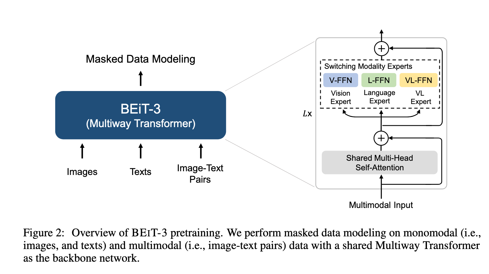
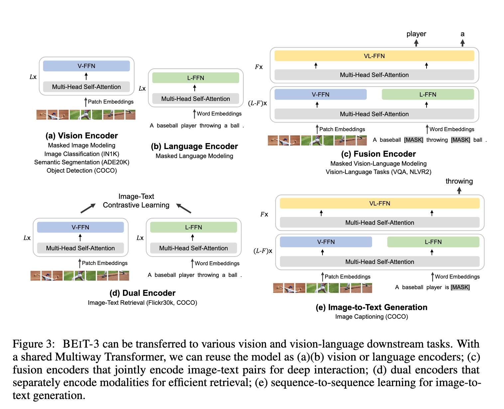
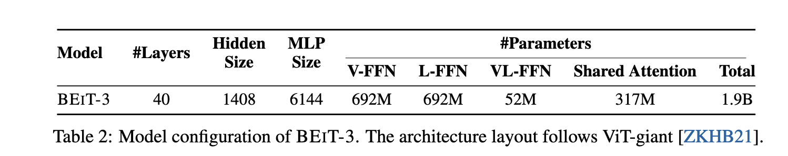
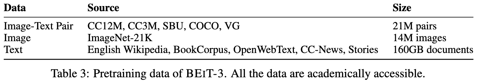

`Image as a Foreign Language: BEiT Pretraining for All Vision and Vision-Language Tasks 论文解读` 

<!-- more -->

> 论文链接: [Image as a Foreign Language: BEiT Pretraining for All Vision and Vision-Language Tasks](https://arxiv.org/abs/2208.10442)
> 代码链接: [https://github.com/microsoft/unilm/tree/master/beit3](https://github.com/microsoft/unilm/tree/master/beit3)

## 引言

近年来，**语言、视觉与多模态预训练**正在出现“大融合”的趋势。研究者发现，只要在**海量数据**上进行大规模预训练，就可以把模型轻松迁移到各种下游任务中。一个理想的方向是：**预训练一个通用基础模型，能够同时处理多种模态**。

BEiT-3 正是顺应这一趋势提出的，它在 **视觉任务**和 **视觉-语言任务**上都取得了最新的迁移性能；BEiT-3 核心贡献如下:

**1. 统一的骨干架构**

Transformer 的成功已经从 **语言** 扩展到了 **视觉** 和 **多模态**任务，这使得用统一网络结构来处理不同模态成为可能。不过，不同下游任务常常需要不同架构：

* **双编码器 (dual-encoder)**：用于高效检索（如跨模态检索）。

* **编码器-解码器 (encoder-decoder)**：用于生成任务（如图像描述）。

* **融合编码器 (fusion-encoder)**：用于图文联合表示学习。

问题在于：大多数基础模型需要针对不同任务手动调整网络格式，且不同模态之间的参数往往难以有效共享。

BEiT-3 引入了 **Multiway Transformer**（多路 Transformer），作为通用建模框架。它既能做模态特定的编码，也能实现跨模态深度融合，**做到“一套架构适配所有下游任务”**。

---

**2. 统一的预训练任务**

掩码建模（Masked Data Modeling）已在多种模态上取得成功：

* 文本（Masked Language Modeling, MLM）

* 图像（Masked Image Modeling, MIM）

* 图文对（Masked Multimodal Modeling）

现有视觉-语言基础模型通常需要 **多任务训练**（如图文匹配、对比学习），但这会导致扩展到大规模数据时效率低。

BEiT-3 的做法是：只保留 **单一任务**——**mask-then-predict（掩码预测）**。

* 把图像当作外语（Imglish），和文本用相同的方式建模。

* 图文对被看作“平行句子”，用来学习模态间的对齐关系。

这种方法虽然简单，却能学习到很强的可迁移表征，并在视觉与视觉-语言任务中取得了最新结果。

---

**3. 模型与数据的规模化**

扩大模型规模与数据规模，可以显著提高基础模型的泛化能力。

* BEiT-3 将模型扩展到了 **数十亿参数**级别。

* 预训练数据规模也被扩大，但仅使用 **公开数据集**，保证学术可复现性。

即使没有依赖私有数据，BEiT-3 依然超过了许多依赖私有大数据的基础模型。

此外，将图像当作外语的方式还能直接复用大规模语言模型的训练管线，从而在规模化上进一步受益。

---

BEiT-3 使用 Multiway Transformer，在 **图像、文本和图文对**上进行统一的掩码建模。

* 在训练中，会随机掩码部分文本 token 或图像 patch。

* 学习目标是恢复原始 token（文本 token 或视觉 token）。

这是一个标准的自监督学习任务，使模型在预训练阶段就能获得通用性。 BEiT-3 在多种任务上都取得了最新性能，包括：

* **视觉任务**：目标检测（COCO）、实例分割（COCO）、语义分割（ADE20K）、图像分类（ImageNet）

* **视觉-语言任务**：视觉推理（NLVR2）、视觉问答（VQAv2）、图像描述（COCO）、跨模态检索（Flickr30K、COCO）

结果显示：

* 即使只使用公开数据，BEiT-3 依然超越了许多依赖私有数据的强大模型。

* 它不仅在多模态任务上表现优异，在**纯视觉任务**中也能达到甚至超过专用模型的效果。

## 方法

如图2所示，BEiT-3 通过在单模态与多模态数据上进行 **掩码数据建模** 来预训练，采用的是一个共享的 **Multiway Transformer** 网络。该模型可以迁移到多种视觉和视觉-语言下游任务中。

### 骨干网络：Multiway Transformers

我们采用 **Multiway Transformer** 作为骨干模型来对不同模态进行编码。

如图2所示，每一个 Multiway Transformer 块由一个共享的 **自注意力模块** 和一个 **前馈网络池（即模态专家）** 构成，不同模态使用不同的专家。我们会根据输入 token 的模态，将其路由到对应的专家。在实现中：

* 每一层包含一个 **视觉专家** 和一个 **语言专家**。

* 顶部三层还额外包含 **视觉-语言专家**，用于融合编码（fusion encoder）。

使用一组模态专家可以鼓励模型更好地捕获模态特定的信息；而共享的自注意力模块则负责学习不同模态之间的对齐，并支持在多模态任务（如视觉-语言任务）中实现深度融合。

如图3所示，这种统一架构使得 BEiT-3 能够支持多种下游任务。例如：

* BEiT-3 可以作为图像骨干网络，用于图像分类、目标检测、实例分割和语义分割等任务。

* 它也可以微调用作 **双编码器**，用于高效的图文检索。

* 还可以作为 **融合模型**，应用于多模态理解与生成任务。

---

### 预训练任务：掩码数据建模

我们通过一个 **统一的掩码数据建模（Masked Data Modeling, MDM）** 目标来预训练 BEiT-3，适用于单模态数据（即图像和文本）以及多模态数据（即图文对）。

在预训练过程中，我们会随机掩码一部分文本 token 或图像 patch，然后训练模型恢复被掩码的 token。这样一个统一的 mask-then-predict 任务不仅可以学习到表征，还能学到不同模态之间的对齐。

* **文本数据**：使用 SentencePiece tokenizer 进行分词。

* **图像数据**：使用 BEiT v2 的 tokenizer 获得离散化的视觉 token，作为重建目标。

掩码策略如下：

* 对单模态文本：随机掩码 15% 的 token。

* 对图文对中的文本：随机掩码 50% 的 token。

* 对图像：使用与 BEiT 相同的 **block-wise 掩码策略**，随机掩码 40% 的图像 patch。

值得注意的是，我们只使用这一种预训练任务，使得训练过程更适合规模化。而之前的视觉-语言模型通常需要多个预训练目标（如图文对比、图文匹配、词-图像 patch/区域对齐等）。

相比之下，我们的方法能使用更小的 batch size 进行训练。而基于对比学习的模型通常需要非常大的 batch size，这带来了工程上的挑战（如 GPU 内存消耗）。

---

### 模型与预训练规模化

**骨干网络**

BEiT-3 是一个 **超大规模基础模型**，其配置遵循 ViT-giant 。如表2所示，该模型包含：

* 40 层 Multiway Transformer

* 隐藏层大小为 1408

* 中间层大小为 6144

* 16 个注意力头

每一层都包含视觉专家与语言专家，顶层三层还包含视觉-语言专家。自注意力模块在不同模态之间共享。

参数规模：BEiT-3 总共有 **19 亿参数**：

* 视觉专家：6.92 亿

* 语言专家：6.92 亿

* 视觉-语言专家：5200 万

* 共享自注意力模块：3.17 亿

当 BEiT-3 用作纯视觉编码器时，只有与视觉相关的参数会被激活，其规模大约与 ViT-giant 相当（约 10 亿参数）。

---

**预训练数据**

BEiT-3 在单模态和多模态数据上进行预训练（见表3）。

* **多模态数据**：约 1500 万图像和 2100 万图文对，来自 5 个公开数据集： Conceptual 12M (CC12M)、Conceptual Captions (CC3M) 、SBU Captions (SBU) 、COCO  和 Visual Genome (VG) 。

* **单模态数据**：来自 ImageNet-21K 的 1400 万图像，以及 160GB 文本语料 ，包括：English Wikipedia、BookCorpus 、OpenWebText3、CC-News  和 Stories 。

---

**预训练设置**

* 总共训练 **100 万步**。

* 每个 batch 包含 6144 个样本（2048 图像 + 2048 文本 + 2048 图文对）。

* 相比对比学习模型 ，所需 batch size 要小得多。

图像处理：

* patch 大小为 $14 \times 14$，输入分辨率 $224 \times 224$。

* 数据增强与 BEiT 相同，包括随机裁剪、水平翻转、颜色扰动。

文本处理：

* 使用 64k 词表的 SentencePiece tokenizer。

优化配置：

* 优化器：AdamW ，超参数 $\beta_1 = 0.9$，$\beta_2 = 0.98$，$\epsilon = 1e-6$。

* 学习率：cosine decay 调度器，峰值 $1e-3$，线性 warmup 10000 步。

* 权重衰减：0.05。

* 随机深度 (stochastic depth) ：0.1。

* 初始化：采用 BEiT 初始化算法稳定 Transformer 训练。

## 总结

**BEIT-3**: 一个通用的多模态基础模型，在广泛的视觉和视觉-语言基准测试上都取得了 **最新的最优性能**。

BEIT-3 的核心思想是：**将图像视作一种外语**，从而可以在图像、文本以及图文对上以统一方式进行 **掩码“语言”建模**。

我们还展示了 **Multiway Transformers** 能够有效建模不同的视觉与视觉-语言任务，使其成为通用建模的一个有趣选择。BEIT-3 方法简单且高效，是 **多模态基础模型规模化发展的有前景方向**。

更进一步：

* 预训练 **多语言版本的 BEIT-3**，并加入更多模态（例如音频），以促进跨语言和跨模态迁移，推进大规模预训练在任务、语言和模态间的 **大融合**。

* 结合 BEIT-3 与 **MetaLM** 的优势，探索为多模态基础模型赋予 **上下文学习能力（in-context learning）**。

> 官方没有开源预训练阶段代码，所以本文就不再对代码进行讲解了。