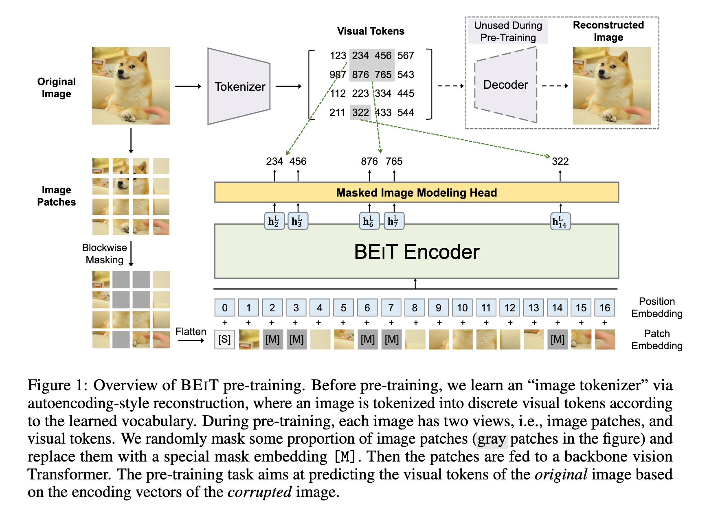
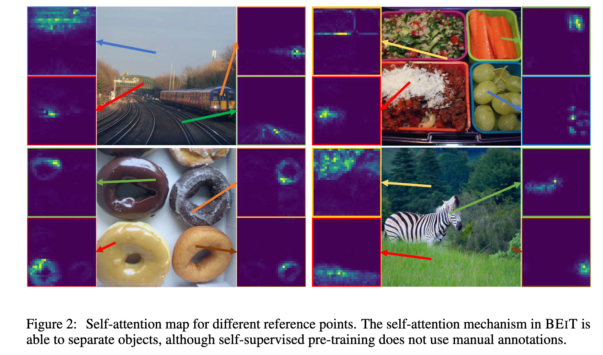

`BEiT: BERT Pre-Training of Image Transformers` 

<!-- more -->

> 论文链接: [BEiT: BERT Pre-Training of Image Transformers](https://arxiv.org/abs/2106.08254)

## 摘要

BEiT（Bidirectional Encoder representation from Image Transformers）是一种基于自监督学习的视觉Transformer预训练模型，其核心思想借鉴了BERT的掩码语言建模任务，提出**掩码图像建模**(MIM)方法。

具体而言，BEiT将图像表示为两种视图——图像块（如16×16像素的局部区域）和离散视觉标记（通过图像分词器生成），在预训练阶段随机掩码部分图像块并让模型预测原始视觉标记，而非直接回归像素值。

实验表明，BEiT在图像分类和语义分割等下游任务中表现优异，且能加速微调收敛。该方法避免了传统像素级重建的局限性，通过高层语义的离散标记学习更有效的视觉表示，为视觉Transformer的自监督预训练提供了新思路。

## 简介

Transformer 在计算机视觉领域展现出强大潜力，但视觉 Transformer 通常比卷积神经网络（CNN）需要更多的训练数据。为解决这一问题，自监督预训练成为利用大规模无标注图像数据的关键方法。目前，对比学习和自蒸馏等方法已被探索，但 BERT 风格的掩码建模在视觉领域的应用尚未充分研究。  

BEiT 提出了一种基于 **掩码图像建模（MIM）** 的自监督预训练方法，其核心挑战在于：  

1. **缺乏预定义词汇**：与 NLP 不同，图像块没有现成的词汇表，无法直接使用 softmax 分类器预测所有可能的候选块。  

2. **像素回归的局限性**：直接预测掩码块的原始像素会导致模型过度关注短程依赖和高频细节，而非高层语义。  

BEiT 的解决方案是：  

- 使用 **双视图表示**（图 1）：图像块（输入）和视觉标记（目标）。视觉标记通过离散变分自编码器（dVAE）学习，形成离散化的语义表示。  

- 在预训练时，随机掩码约 40% 的图像块，并让模型基于上下文预测原始视觉标记，而非像素值。  

实验表明，BEiT 在图像分类和语义分割任务上优于从零训练的模型和其他自监督方法。此外，BEiT 无需人工标注即可通过自注意力机制学习语义区域和物体边界（如图 2 所示），证明了其自动捕获高层视觉知识的能力。  

BEiT 的贡献包括：  

1. 提出 MIM 任务，为视觉 Transformer 提供理论解释（基于变分自编码器视角）。  

2. 在多个下游任务（如分类、分割）上验证了其有效性。  

3. 揭示了自监督预训练中自注意力机制对语义理解的自动学习能力。

## 方法

给定输入图像 $x$，BEiT 将其编码为上下文相关的向量表示。如图1所示，BEiT 通过自监督学习中的掩码图像建模（Masked Image Modeling, MIM）任务进行预训练。MIM 的目标是基于编码向量恢复被掩码的图像块。对于下游任务（如图像分类和语义分割），我们在预训练的 BEiT 上添加任务层，并在特定数据集上微调参数。

### 图像表示

我们的方法中，图像有两种表示视图：图像块（image patch）和视觉标记（visual token）。这两种类型分别作为预训练时的输入和输出表示。

#### 图像块

将 2D 图像分割为一系列块序列，使标准 Transformer 可以直接接受图像数据。形式上，我们将图像 $x \in \mathbb{R}^{H \times W \times C}$ 重塑为 $N = HW/P^2$ 个块 $x^p \in \mathbb{R}^{N \times (P^2 C)}$，其中：

- $C$ 是通道数

- $(H,W)$ 是输入图像分辨率

- $(P,P)$ 是每个块的分辨率

图像块 $\{x_i^p\}_{i=1}^N$ 被展平为向量并进行线性投影，类似于 BERT 中的词嵌入。图像块保留了原始像素，用作 BEiT 的输入特征。

在我们的实验中，将每个 $224 \times 224$ 图像分割为 $14 \times 14$ 网格的图像块，每个块大小为 $16 \times 16$。

#### 视觉标记

与自然语言类似，我们通过"图像分词器"将图像表示为离散标记序列，而不是原始像素。具体来说，我们将图像 $x \in \mathbb{R}^{H \times W \times C}$ 分词为 $z = [z_1, \ldots, z_N] \in \mathcal{V}^{h \times w}$，其中词汇表 $\mathcal{V} = \{1, \ldots, |\mathcal{V}|\}$ 包含离散标记索引。

我们使用离散变分自编码器（dVAE）学习的图像分词器。视觉标记学习包含两个模块：

1. 分词器 $q_\phi(z|x)$：根据视觉码本将图像像素 $x$ 映射到离散标记 $z$

2. 解码器 $p_\psi(x|z)$：基于视觉标记 $z$ 重建输入图像 $x$

重建目标可表示为：

$$
\mathbb{E}_{z \sim q_\phi(z|x)}[\log p_\psi(x|z)]
$$

由于潜在视觉标记是离散的，模型训练不可微分，因此采用 Gumbel-softmax 松弛进行训练。此外，在 dVAE 训练期间对 $q_\phi$ 施加均匀先验。

我们将每个图像分词为 $14 \times 14$ 网格的视觉标记。注意一张图像的视觉标记数量与图像块数量相同。词汇表大小设为 $|\mathcal{V}| = 8192$。

### 骨干网络：图像 Transformer

我们使用标准 Transformer 作为骨干网络。输入是图像块序列 $\{x_i^p\}_{i=1}^N$，经过线性投影得到块嵌入 $Ex_i^p$，其中 $E \in \mathbb{R}^{(P^2 C) \times D}$。输入向量表示为：

$$
H_0 = [[CLS], Ex_1^p, \ldots, Ex_N^p] + E_{pos}
$$

其中 $E_{pos} \in \mathbb{R}^{N \times D}$ 是位置嵌入。编码器包含 $L$ 层 Transformer 块：

$$
H^l = \text{Transformer}(H^{l-1}), \quad l=1,\ldots,L
$$

### BEiT 预训练：掩码图像建模

我们提出掩码图像建模（MIM）任务。给定图像 $x$，我们：

1. 分割为 $N$ 个图像块 $\{x_i^p\}_{i=1}^N$

2. 分词为 $N$ 个视觉标记 $\{z_i\}_{i=1}^N$

3. 随机掩码约 40% 图像块，位置记为 $\mathcal{M}$

被掩码的图像表示为：

$$
x^\mathcal{M} = \{x_i^p : i \notin \mathcal{M}\} \cup \{e_{[MASK]} : i \in \mathcal{M}\}
$$

预测目标为：

$$
p_{MIM}(z'|x^\mathcal{M}) = \text{softmax}_{z'}(W_c h_i^L + b_c)
$$

预训练目标函数：

$$
\max \sum_{x \in \mathcal{D}} \mathbb{E}_\mathcal{M} \left[ \sum_{i \in \mathcal{M}} \log p_{MIM}(z_i|x^\mathcal{M}) \right]
$$

### 变分自编码器视角

BEiT 预训练可视为变分自编码器训练，其证据下界（ELBO）为：

$$
\sum \log p(x|\tilde{x}) \geq \sum \left( \mathbb{E}_{z \sim q(z|x)}[\log p(x|z)] - D_{KL}[q(z|x), p(z|\tilde{x})] \right)
$$

### 预训练设置

关键参数：

- 12 层 Transformer

- 隐藏大小 768

- 12 个注意力头

- 学习率 1.5e-3

- 批量大小 2048

- 训练 800 轮次

### 下游任务微调

1. **图像分类**：

   - 使用平均池化聚合表示

   - softmax 分类器：$\text{softmax}(\text{avg}(\{h_i^L\}W_c))$

2. **语义分割**：

   - 使用预训练 BEiT 作为编码器

   - 添加反卷积层作为解码器

3. **中间微调**：

   - 先在 ImageNet 上微调

   - 再在目标任务上微调

   