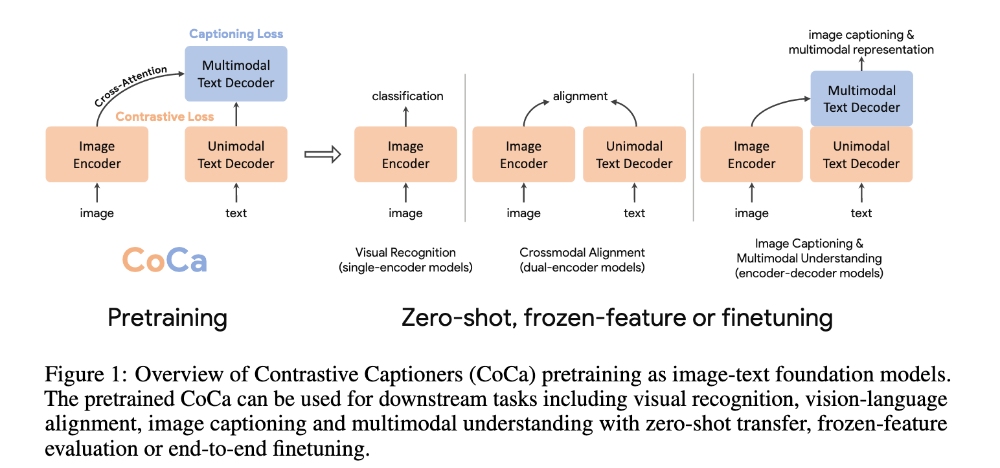
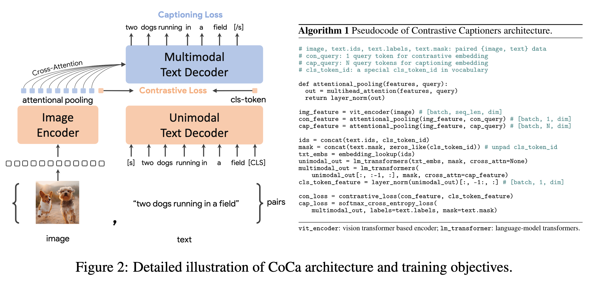
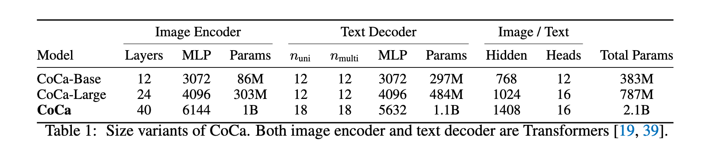
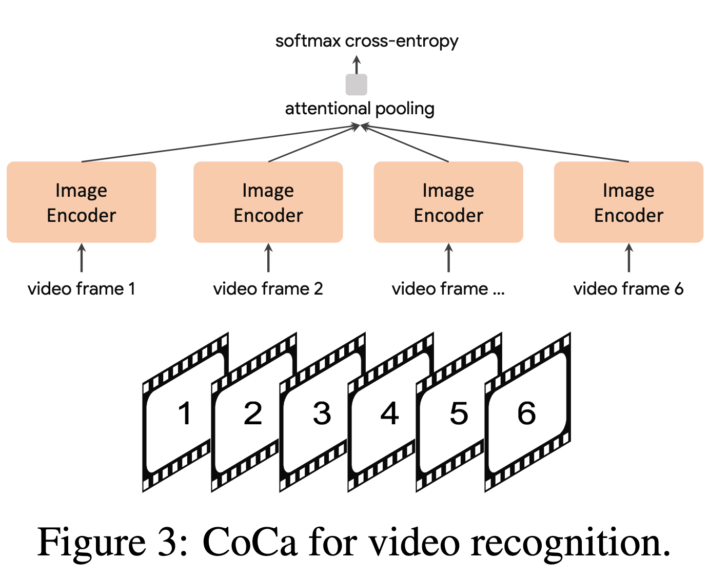

`CoCa: Contrastive Captioners are Image-Text Foundation Models 论文简析` 

<!-- more -->

> 论文链接: [CoCa: Contrastive Captioners are Image-Text Foundation Models](https://arxiv.org/abs/2205.01917)
> 代码链接: [https://github.com/lucidrains/CoCa-pytorch](https://github.com/lucidrains/CoCa-pytorch)

## 引言

近年来，计算机视觉领域对**大规模预训练基础模型**的探索越来越重要，因为这些模型能够快速迁移到各种下游任务上。本论文提出了一种极简设计的 **Contrastive Captioner (CoCa)** 模型，它是一种**图文编码-解码结构的基础模型**，在训练时同时使用**对比损失**和**生成式的描述损失**。这样一来，它既能继承 CLIP 这类**对比方法**的能力，又能结合 SimVLM 这类**生成方法**的优点。

与传统的 encoder-decoder 架构（解码器所有层都对编码器输出做 cross-attention）不同，CoCa 的解码器被一分为二：

* 前半部分为**单模态解码器（unimodal decoder）**，没有 cross-attention，只学习纯文本的表示；

* 后半部分为**多模态解码器（multimodal decoder）**，通过 cross-attention 融合图像和文本，得到跨模态的联合表示。

在训练目标上，CoCa 同时引入：

* **对比损失**：用于图像编码器输出与文本单模态表示之间的对齐；

* **描述损失（captioning loss）**：作用在多模态解码器的输出上，要求其自回归地预测文本 token。

这种**共享计算图**的方式，让两个目标可以在计算上高效结合，几乎没有额外开销。训练时，所有的标签（包括人工标注和网络噪声数据）都被统一当作文本，从而自然地融合了不同来源的监督信号。

> 共享计算图: 一次forward完成两个损失目标值的计算。

---

深度学习的发展，已经在语言领域涌现出 **BERT、T5、GPT-3** 等基础模型，它们通过大规模预训练展示出**零样本、多任务、迁移学习**的能力。相比专用模型，基础模型能在 amortized（摊销）成本上覆盖更多下游任务，推动规模化智能的发展。

在视觉和视觉-语言任务中，已有三条研究路径：

**(1) 单编码器（Single-encoder）**

* 代表性工作在 ImageNet 等图像分类数据集上用交叉熵损失预训练。

* 优点：提供通用的视觉特征，可迁移到图像和视频理解任务。

* 缺点：仅依赖图像标注（类别标签），无法利用自然语言知识，因此在涉及图文结合的任务（如 VQA）上受限。

**(2) 双编码器（Dual-encoder，对比学习）**

* 通过图像编码器和文本编码器分别编码图像与文本，再用对比损失在共享的潜在空间对齐。

* 优点：不仅能服务视觉任务，还能进行跨模态任务（如图文检索、零样本分类）。

* 缺点：缺乏图文融合的联合表示，因此无法直接应用于复杂的多模态理解任务（如 VQA）。

**(3) 编码-解码（Encoder-decoder，生成式预训练）**

* 采用图像输入到编码器，解码器侧使用语言建模损失（LM loss 或 PrefixLM）进行训练。

* 优点：能学到跨模态的联合表示，在多模态理解任务上表现突出。

* 缺点：不能同时得到和图像对齐的纯文本表示，因此在跨模态对齐与检索方面不足。

---



CoCa **融合并统一了以上三类范式**，提出了一种改进的 encoder-decoder 架构：

* 将解码器拆分为 **单模态部分**（仅学习文本特征）和 **多模态部分**（跨模态融合）。

* 在单模态文本表示与图像表示之间施加**对比目标**，同时在多模态解码器输出上施加**生成目标**。

* 在训练数据上，把所有标注（类别标签、自然描述、网络噪声文本）都视作文本，从而无缝整合了不同监督。

这样一来，CoCa 的训练目标兼顾了：

* **对比学习的优势**（学习全局语义表征，适合检索和零样本分类）；

* **生成学习的优势**（对细粒度的区域特征建模，适合描述和理解任务）。

---

CoCa 在多种任务上展现了强大的零样本和迁移能力：

* **ImageNet 分类**：

  * 零样本准确率 **86.3%**

  * 冻结编码器 + 学分类头：**90.6%**

  * 全模型微调：**91.0%（SOTA）**

* **视频理解**：

  * Kinetics400/600/700：88.0% / 88.5% / 81.1%

  * Moments-in-Time：47.4%

* **跨模态检索**：

  * MSCOCO、Flickr30k：显著优于现有方法

* **多模态理解**：

  * VQA：82.3%

  * SNLI-VE、NLVR2：同样有优异表现

* **图像描述生成**：

  * NoCaps：CIDEr 得分 **120.6**

这些结果表明：**一个统一的 CoCa 模型，能在无需大量任务特定微调的前提下，超越多个专用模型的性能**。

## 相关工作

**视觉预训练**

早期的视觉模型大多依赖于在大规模标注数据（如 ImageNet、Instagram、JFT）上对卷积网络或 Transformer 进行预训练，从而解决分类、定位、分割、视频识别、跟踪等视觉识别任务。
近年来，自监督视觉预训练逐渐兴起：

* **BEiT** 借鉴 BERT 思路，提出了基于掩码图像建模的任务，并用量化后的视觉 token id 作为预测目标。

* **MAE 和 SimMIM** 移除了图像 tokenizer，直接使用轻量级解码器或投影层回归像素值。

但这些方法的局限在于：它们只学习视觉模态模型，无法应用到需要图像与文本 **联合推理** 的任务。

---

**视觉-语言预训练（VLP）**

VLP 的目标是让模型能够在融合框架中联合建模视觉和语言。

* 早期方法（LXMERT、UNITER、VinVL）依赖目标检测器（如 Faster R-CNN）提取图像特征。

* 后续方法（ViLT、VLMo）则直接将视觉和语言 Transformer 统一起来，从零开始训练一个多模态 Transformer。

---

**图文基础模型**

最近的研究进一步提出了 **图文基础模型**，它们统一了视觉预训练和视觉-语言预训练：

* **CLIP 和 ALIGN**：利用噪声图文对数据，通过对比学习目标训练双编码器，学习到跨模态对齐能力，并能实现零样本图像分类。

* **Florence**：在 CLIP/ALIGN 的思路上提出统一的对比目标，并训练能适配于更广泛基准的基础模型。

* **LiT 和 BASIC**：先在大规模图像标注数据上用交叉熵训练，再在噪声图文对数据集上用对比损失微调，从而提升零样本图像分类性能。

* **生成式方法（如 \[16, 17, 34]）**：采用编码器-解码器架构并引入生成式损失，在视觉-语言基准任务上表现优异，同时视觉编码器在图像分类上依然具备竞争力。

---

**与现有方法的对比**

本研究提出的 **CoCa**，专注于从零开始，在单一预训练阶段完成图文统一，从而避免多阶段训练（如 ALBEF 那样的先单模态、再多模态流程）。已有一些方法尝试过类似思路（如 ALBEF），但它们存在复杂的训练需求：

* **计算开销**：CoCa 在一批图文对上只需一次前向与反向传播，而 ALBEF 需要两次（一次使用被扰动输入，一次使用未扰动输入）。

* **训练方式**：CoCa 直接在两个目标函数下从零开始训练，而 ALBEF 依赖预训练的视觉和文本编码器，并需要额外的训练机制（如动量模块）。

* **生成式优势**：CoCa 的解码器架构结合生成式损失，更自然地支持图像描述任务，同时还能直接实现零样本学习。

## 方法

我们首先回顾三类利用自然语言监督的基础模型家族：**单编码器分类预训练、双编码器对比学习、编码器-解码器图像描述生成**。随后介绍 **Contrastive Captioners (CoCa)**，它在一个简单的架构下融合了对比学习和图像到文本生成的优势。最后讨论 CoCa 模型如何通过零样本迁移或最小任务微调快速应用到下游任务。

### 自然语言监督

**单编码器分类（Single-Encoder Classification）**

经典的单编码器方法通过在大规模人工标注图像数据集（如 ImageNet、Instagram 或 JFT）上进行图像分类来预训练视觉编码器。注释文本的词汇通常是固定的，图像标注一般被映射为离散类别向量，并使用交叉熵损失训练：

$$
L_{Cls} = -p(y) \log q_\theta(x)
$$

其中 $p(y)$ 是从真实标签 $y$ 得到的 one-hot、多-hot 或平滑标签分布。训练完成后，学习到的图像编码器可作为通用视觉表示提取器，用于下游任务。

---

**双编码器对比学习（Dual-Encoder Contrastive Learning）**

相比单编码器分类需要人工标注和数据清理，双编码器方法利用**大规模噪声文本描述**，并引入可学习的文本编码器来编码自由形式文本。两个编码器通过对比目标联合优化：

$$
L_{Con} = - \frac{1}{N} \sum_{i=1}^{N} \Big( \log \frac{\exp(x_i^\top y_i / \sigma)}{\sum_{j=1}^{N} \exp(x_i^\top y_j / \sigma)} \ + \ \log \frac{\exp(y_i^\top x_i / \sigma)}{\sum_{j=1}^{N} \exp(y_i^\top x_j / \sigma)} \Big)
$$

其中 $x_i$ 和 $y_j$ 分别是第 $i$ 对图像和第 $j$ 对文本的归一化嵌入，$N$ 是批量大小，$\sigma$ 是温度参数。

除了图像编码器，双编码器方法还学习了对齐的文本编码器，使得模型可以进行**跨模态对齐应用**，如图文检索和零样本图像分类。实证结果显示，这种零样本分类在受损或分布外图像上更加稳健。

---

**编码器-解码器图像描述生成（Encoder-Decoder Captioning）**

与双编码器整体编码文本不同，生成式方法（也称 captioner）追求更细粒度的表示，需要模型自回归地预测文本 $y$ 的每个 token。遵循标准的编码器-解码器架构：

* 图像编码器提供潜在编码特征（如使用 Vision Transformer 或卷积网络）。

* 文本解码器通过最大化条件概率来学习配对文本的生成：

$$
L_{Cap} = - \sum_{t=1}^{T} \log P_\theta(y_t | y_{<t}, x)
$$

编码器-解码器训练使用 **teacher-forcing**，以并行化计算并提高学习效率。

与前述方法不同，captioner 不仅提供**联合图文表示**以用于视觉-语言理解任务，还可以直接应用于自然语言生成的图像描述任务。


好的，我来帮你把 **3.2 Contrastive Captioners Pretraining** 这一节完整翻译成中文，保持通俗易懂，但同时尽量保留论文中的全部信息。

---
### 对比描述预训练（Contrastive Captioners Pretraining）



**整体架构**（如图2所示）：我们提出的 CoCa（Contrastive Captioner）是一种简单的编码器-解码器方法，能够自然地融合三种训练范式。与标准的图文编码器-解码器模型类似，CoCa 使用神经网络编码器（默认采用 Vision Transformer (ViT) ，当然也可以是其他图像编码器，如 ConvNets ）将图像编码为潜在表示，并用带因果掩码的 Transformer 解码器对文本进行解码。

与标准的 Transformer 解码器不同，CoCa 在解码器的前半部分省略了 cross-attention（交叉注意力），只保留单模态的文本表示学习；而在后半部分，则引入 cross-attention，与图像编码器交互，生成跨模态的图文联合表示。这样，CoCa 解码器可以**同时产生单模态和多模态的文本表示**，从而在同一架构下联合优化 **对比损失** 和 **生成损失**：

$$
L_{CoCa} = \lambda_{Con} \cdot L_{Con} + \lambda_{Cap} \cdot L_{Cap}
$$

其中，$\lambda_{Con}$ 和 $\lambda_{Cap}$ 是损失函数的加权系数。值得注意的是，单编码器的交叉熵分类目标其实可以看作是一种特殊的生成方法——只不过词汇表是标签名称集合。

---

**解耦的文本解码器与 CoCa 架构**：

描述生成任务要求模型优化条件概率 $P(y|x)$，而对比学习任务则依赖无条件的文本表示。为了兼顾这两者，我们提出了一种**解耦的解码器设计**，将解码器分为单模态部分和多模态部分：

* **底部 $n_{uni}$ 层（单模态解码器层）**：只用因果掩码的自注意力机制来编码输入文本，不使用 cross-attention，得到单模态文本向量表示。

* **顶部 $n_{multi}$ 层（多模态解码器层）**：在因果掩码自注意力的基础上，再结合 cross-attention 与图像编码器输出交互，生成多模态表示。

所有解码器层都禁止 token 关注未来的 token，因此自然适用于自回归式的生成目标 $L_{Cap}$。而对于对比学习目标 $L_{Con}$，我们在输入句子末尾附加一个可学习的 [CLS] token，并将其在**单模态解码器输出**中的向量作为文本嵌入。实验中我们将解码器平分为两部分，即 $n_{uni} = n_{multi}$。

在图像输入方面，我们遵循 ALIGN 的设定，使用 $288 \times 288$ 的图像分辨率和 $18 \times 18$ 的 patch size，得到 256 个图像 token。我们的最大模型 CoCa（简称 “CoCa”）采用 ViT-giant 结构，图像编码器有 10 亿参数，连同文本解码器在内总参数量为 21 亿。此外，我们还探索了两个更小的变体：“CoCa-Base”和“CoCa-Large”（见表1）。



---

**注意力池化（Attentional Poolers）**：

需要强调的是，对比损失只使用一个图像嵌入，而标准的图文编码-解码模型通常会利用整段图像 token 序列进行 cross-attention。我们的初步实验发现：

* 使用单个池化的全局图像表示，有利于**视觉识别类任务**。

* 使用更多图像 token（更细粒度表示），更适合**多模态理解类任务**，因为这类任务需要区域级别的特征。

因此，CoCa 引入了**任务特定的注意力池化（task-specific attentional pooling）**，为不同目标和下游任务定制图像表示。具体来说，pooler 是一个单层多头注意力结构，包含 $n_{query}$ 个可学习查询，图像编码器的输出作为 key 和 value。通过这种机制，模型能够学习如何根据不同任务的需求，聚合出不同长度的图像嵌入（如图2所示）。

在预训练中：

* **生成损失**：使用 $n_{query} = 256$，保留更多图像 token。

* **对比损失**：使用 $n_{query} = 1$，只提取全局嵌入。

这样不仅能满足不同任务的需求，还让 pooler 自然地成为任务适配器。

---

**预训练效率**：

解耦的自回归解码器设计的一个关键优势在于：它能高效计算两种损失。因为单向语言模型在完整句子上用因果掩码训练，所以只需**一次前向传播**，就能同时获得对比损失和生成损失（相比双向方法需要两次前向传播）。这意味着两种损失的大部分计算是共享的，CoCa 相比标准的编码器-解码器模型只增加了极小的计算开销。

另一方面，许多现有方法通常分阶段训练模型组件，且需要在不同数据源/模态之间切换。而 CoCa 则是**从零开始进行端到端预训练**，数据来源既包括人工标注的图像，也包括带噪声的网页 alt-text 图像，并且统一地将所有标签视为文本，兼顾对比和生成两类目标。

---
### CoCa 在下游任务中的应用

**零样本迁移（Zero-shot Transfer）**: 预训练好的 CoCa 模型能够直接在零样本设定下完成多种任务，充分利用图像和文本输入，包括：

* 零样本图像分类

* 零样本图文跨模态检索

* 零样本文本-视频跨模态检索

需要说明的是，这里的“零样本”与传统的零样本学习（zero-shot learning）不同。具体来说，在预训练阶段，模型可能会接触到一些与下游任务相关的监督信息，但在迁移过程中并没有使用任何下游任务的监督样本（这一点与 \[12, 32] 中的定义一致）。此外，在预训练数据准备时，我们严格遵循 \[13, 32] 提出的去重流程，过滤掉所有与下游任务领域高度相关的样本，避免数据泄漏。

---

**冻结特征评估（Frozen-feature Evaluation）**: 如上一节所述，CoCa 使用**任务特定的注意力池化（attentional pooling, 简称 pooler）**，在共享图像编码器的同时，为不同下游任务定制图像表示。这使得 CoCa 在作为冻结编码器（frozen encoder）时表现优异：我们只需学习一个新的 pooler 来聚合特征，而无需调整主干编码器。

这种设计对多任务场景尤其有益：多个任务可以共享同一个冻结的图像编码器，而仅通过不同的 pooler 来适配任务目标。正如 \[23] 所指出的，传统的线性评估（linear evaluation）往往难以准确衡量学到的表示能力，而我们发现注意力池化在实际应用中更具实用性。

---



**CoCa 在视频动作识别中的应用（CoCa for Video Action Recognition）**: 为了让预训练好的 CoCa 适配视频动作识别任务，我们采用了一种简单的方法：

1. 从视频中抽取多个帧，并将每一帧分别送入共享的图像编码器（如图3所示）。

2. 对于冻结特征评估或微调场景，我们在空间和时间特征 token 上引入一个新的 pooler，并用 softmax 交叉熵损失进行训练。由于 pooler 只有一个 query token，所以它在所有空间和时间 token 上进行聚合时计算开销很小。

3. 对于零样本视频-文本检索，我们使用更简单的方法：对视频中 16 帧（从视频中均匀采样）的嵌入取平均，得到全局视频表示；在计算检索指标时，我们同时对每个视频的文本描述进行编码，并作为目标嵌入进行比对。


## 代码实现

关于 `CoCa` 模型代码实现部分，我们先来看 `Image Encoder` 部分的代码实现:

```python
class CoCa(nn.Module):
    def embed_image(self, images=None, image_tokens=None):
        # encode images into embeddings
        # with the img_encoder passed in at init
        # it can also accept precomputed image tokens

        assert not (exists(images) and exists(image_tokens))
        
        if exists(images):
            assert exists(self.img_encoder), 'img_encoder must be passed in for automatic image encoding'
            image_tokens = self.img_encoder(images)

        # attention pool image tokens
        # 默认情况下有 256 + 1 (cls query) 个 query token
        img_queries = repeat(self.img_queries, 'n d -> b n d', b=image_tokens.shape[0])
        # image token 作为 key 和 value
        img_queries = self.img_attn_pool(img_queries, image_tokens) 
        img_queries = self.img_attn_pool_norm(img_queries)
        
        # cls token query 和 image token query
        return img_queries[:, 0], img_queries[:, 1:]
```

对文本端的编码过程，则分为了单模态编码和多模态融合两个阶段，下面给出的是单模态编码过程实现:

```python
class CoCa(nn.Module):
    def embed_text(self, text):
        # 获取 batch 大小和设备
        batch, device = text.shape[0], text.device

        # 序列长度（句子 token 数量）
        seq = text.shape[1]

        # 将输入的 token id 映射到词向量 (embedding)
        # text: [batch, seq] -> text_tokens: [batch, seq, dim]
        text_tokens = self.token_emb(text)

        # 构造一个可学习的 [CLS] token，用于表示整句话的全局语义
        # repeat 后扩展到 batch 大小: [dim] -> [batch, 1, dim]
        text_cls_tokens = repeat(self.text_cls_token, 'd -> b 1 d', b=batch)

        # 把 [CLS] token 拼接到文本序列末尾
        # 原来: [batch, seq, dim] -> 拼接后: [batch, seq+1, dim]
        text_tokens = torch.cat((text_tokens, text_cls_tokens), dim=-2)

        # 构造 attention mask，防止 padding token 影响 [CLS] 学习
        # (1) 先构造 padding mask，True 表示有效位置: [batch, seq]
        cls_mask = rearrange(text != self.pad_id, 'b j -> b 1 j')   # [batch, 1, seq]

        # (2) 用 pad 把 mask 扩展到 [CLS] token
        # padding 方向解释: (last_dim_left, last_dim_right, second_last_dim_left, second_last_dim_right)
        # (0,1, seq,0) 表示：在最后一维右边加1（CLS），在倒数第二维左边加 seq
        # 得到最终 attn_mask: [batch, seq+1, seq+1]
        attn_mask = F.pad(cls_mask, (0, 1, seq, 0), value=True)

        # 依次通过所有的单模态（文本）transformer 层
        # 每层会用 attn_mask 来避免对 padding 位置的注意力
        for attn_ff in self.unimodal_layers:
            text_tokens = attn_ff(text_tokens, attn_mask=attn_mask)

        # 将拼接的 [CLS] token 和原始 token 序列分开
        # text_tokens: [batch, seq, dim]
        # text_cls_tokens: [batch, dim]
        text_tokens, text_cls_tokens = text_tokens[:, :-1], text_tokens[:, -1]

        # 对 [CLS] token 进行 LayerNorm，作为文本的整体 embedding
        text_embeds = self.text_cls_norm(text_cls_tokens)

        # 返回两个结果：
        # 1. text_embeds: [batch, dim] —— 整个句子的全局语义向量
        # 2. text_tokens: [batch, seq, dim] —— 每个 token 的表示，用于后续跨模态交互
        return text_embeds, text_tokens
```

`CoCa` 模型本身所提供的前向传播方法，则负责完成整个模型架构流程的实现:

```python
class CoCa(nn.Module):
    def forward(
        self,
        text,
        images=None,
        image_tokens=None,
        labels=None,
        return_loss=False,
        return_embeddings=False
    ):
        # 获取 batch 大小和设备信息
        batch, device = text.shape[0], text.device

        # 如果要求计算 loss 且没有提供 labels，则自动构造
        # 把输入的 text 向右平移一位，text 作为输入，labels 作为输出预测目标
        if return_loss and not exists(labels):
            text, labels = text[:, :-1], text[:, 1:]

        # 编码文本，得到文本全局向量 (text_embeds) 和 token 序列表示 (text_tokens)
        text_embeds, text_tokens = self.embed_text(text)

        # 编码图像，得到图像全局向量 (image_embeds) 和 token 序列表示 (image_tokens)
        image_embeds, image_tokens = self.embed_image(images=images, image_tokens=image_tokens)

        # 如果用户只需要返回 embeddings，不需要走后续 loss 计算
        if return_embeddings:
            return text_embeds, image_embeds

        # 多模态交互：文本 token 先经过自注意力层 (attn_ff)，再经过跨模态注意力层 (cross_attn)，
        # 与图像 token 进行交互
        for attn_ff, cross_attn in self.multimodal_layers:
            text_tokens = attn_ff(text_tokens)
            text_tokens = cross_attn(text_tokens, image_tokens)

        # 将融合后的文本 token 映射到词表大小，得到 logits
        logits = self.to_logits(text_tokens)

        # 如果不需要 loss，直接返回 logits（用于推理）
        if not return_loss:
            return logits

        # 为了简写，cross_entropy 记作 ce
        ce = F.cross_entropy

        # -------- Caption Loss (字幕生成/文本生成损失) --------
        # logits: [batch, seq, vocab] -> rearrange 为 [batch, vocab, seq] 符合 cross_entropy 输入要求
        logits = rearrange(logits, 'b n c -> b c n')
        caption_loss = ce(logits, labels, ignore_index=self.pad_id)
        caption_loss = caption_loss * self.caption_loss_weight

        # -------- Contrastive Loss (图文对比损失) --------
        # 将文本 / 图像 embedding 投影到 latent 空间
        text_latents = self.text_to_latents(text_embeds)
        image_latents = self.img_to_latents(image_embeds)

        # 分布式训练时，把不同进程上的 embedding 聚合
        if self.is_distributed:
            latents = torch.stack((text_latents, image_latents), dim = 1)
            latents = all_gather(latents)
            text_latents, image_latents = latents.unbind(dim = 1)

        # 计算文本和图像 latent 向量的相似度矩阵 (内积)
        # sim[i, j] 表示第 i 个文本与第 j 个图像的相似度
        sim = einsum('i d, j d -> i j', text_latents, image_latents)
        sim = sim * self.temperature.exp()  # 温度缩放，调节 softmax 分布的平滑度

        # 构造对比学习的标签：第 i 个文本对应第 i 个图像
        contrastive_labels = torch.arange(batch, device=device)

        # 对比损失：文本->图像 + 图像->文本，取平均
        contrastive_loss = (ce(sim, contrastive_labels) + ce(sim.t(), contrastive_labels)) * 0.5
        contrastive_loss = contrastive_loss * self.contrastive_loss_weight

        # 总损失 = caption loss + contrastive loss
        return caption_loss + contrastive_loss
```

## 消融实验

### **训练目标和损失**

* **生成式损失 vs 分类损失**：

  * 使用图像描述的生成式损失训练的编码器-解码器模型，性能和传统的单编码器分类损失模型差不多
  
  * 说明生成式训练本身就包含了分类能力，CoCa 可以统一多种训练方法，而且不需要先单独预训练视觉编码器

* **联合损失效果**：

  * 同时使用对比损失和生成损失的 CoCa，比只用单一损失的模型表现更好
  
  * 生成损失不仅提升 VQA 的能力，也让跨模态对齐（图像和文本匹配）更准确
  
  * 两个损失共享计算资源，所以训练效率高，成本低

---

### **解码器设计和文本嵌入**

* **单模态和多模态解码器层**：

  * 减少单模态文本层 → 零样本分类能力下降
  
  * 减少多模态层 → 多模态推理（如 VQA）能力下降
  
  * 将解码器拆成一半单模态、一半多模态 → 取得了较好平衡

* **\[CLS] token 使用**：

  * 只用一个可学习的 \[CLS] token 表示整句话，比把它和原输入拼接更好
 
  * 这种方式能减轻生成和对比损失之间的干扰，同时保证视觉和跨模态检索能力

---

### **注意力池化器设计**

* **预训练池化器方案**：

  * 并行方案：同时提取对比和生成损失
 
  * 级联方案：先用生成池化器，再在其输出上做对比池化
 
  * 小模型实验表明，级联方案效果更好，所以 CoCa 默认采用

* **查询数量**：

  * 查询越多 → 使用更多图像 token 信息 → 对多模态理解任务更有利
 
  * 默认生成池化器长度设为 256，既能提升多模态理解，又保持冻结特征能力
