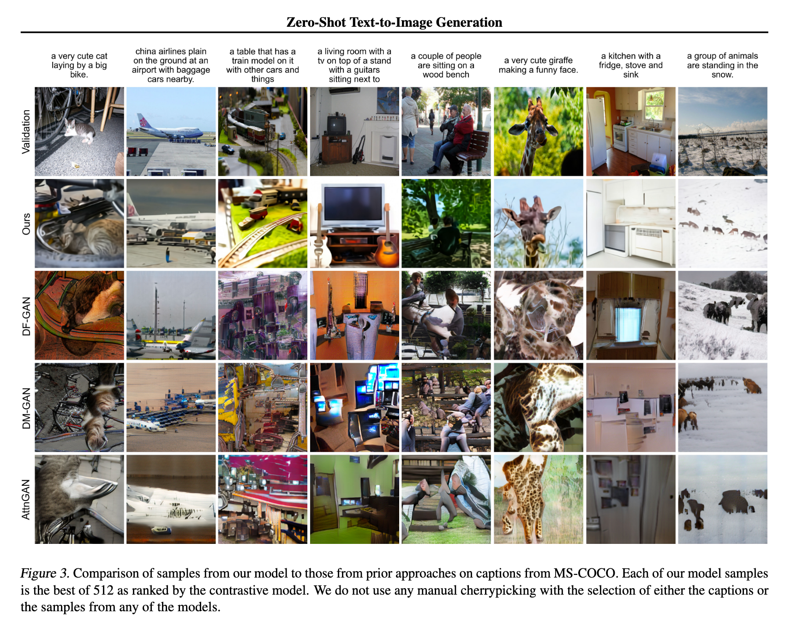

`Zero-Shot Text-to-Image Generation 论文` 

<!-- more -->

> 论文链接: [Zero-Shot Text-to-Image Generation](https://arxiv.org/abs/2102.12092)

## 摘要

本文提出了一种基于自回归Transformer的简单而高效的文本到图像生成方法。与传统的依赖复杂架构或辅助损失的方法不同，该方法通过将文本和图像标记建模为单一数据流，利用大规模数据和模型参数（120亿参数的Transformer训练于2.5亿图文对），在零样本条件下实现了与领域专用模型相媲美的性能。实验表明，该方法在生成质量和泛化能力上表现优异，无需针对特定数据集进行微调即可生成高保真图像。

## 简介

文本生成图像（Text-to-Image Generation）领域自Mansimov等人([2015](https://arxiv.org/abs/1511.02793))的开创性工作以来，经历了多个阶段的发展。早期研究基于循环变分自编码器（如DRAW模型），随后Reed等人([2016b](https://arxiv.org/abs/1605.05396))引入生成对抗网络（GANs），显著提升了生成图像的保真度，并展示了零样本泛化能力。后续研究通过多尺度生成器（Zhang等人[2017](https://arxiv.org/abs/1612.03242)、[2018](https://arxiv.org/abs/1710.10916)）、注意力机制（Xu等人[2018](https://arxiv.org/abs/1711.10485)）和辅助损失函数进一步优化了生成质量。  

尽管技术进步，生成图像仍存在以下问题：  

- 物体结构扭曲  

- 空间逻辑错误  

- 前景背景融合异常  

本文提出了一种基于自回归Transformer的简单方法，通过两阶段训练流程实现：  

1. **阶段一**：训练离散变分自编码器（dVAE），将$256 \times 256$图像压缩为$32 \times 32$的8192维视觉词表（如图1所示），显著降低计算复杂度。  

2. **阶段二**：联合建模文本（BPE编码，最多256词）与图像标记（1024词），通过12B参数的稀疏Transformer学习联合分布。  

模型优化目标为证据下界（ELB）：  

$$
\ln p_{\theta,\psi}(x,y) \geq \mathbb{E}_{z \sim q_{\phi}(z|x)} \left( \ln p_{\theta}(x|y,z) - \beta D_{\text{KL}}(q_{\phi}(y,z|x), p_{\psi}(y,z)) \right),
$$  

其中$\beta > 1$（实际取6.6）以提升词表利用率。  

**实验效果**：  

- 在MS-COCO数据集上零样本评估，人类评估者90%更偏好本文模型（如图7）。  

- 模型展现出组合概念（如“手风琴组成的貘”）、文本渲染和零样本图像翻译等能力（如图2）。  

**数据与规模的重要性**：  

研究指出，传统小规模数据集（如MS-COCO）可能限制模型性能。本文通过250M互联网图文对训练，验证了数据与模型规模对泛化能力的提升作用。

