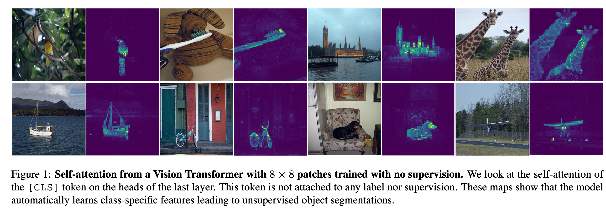
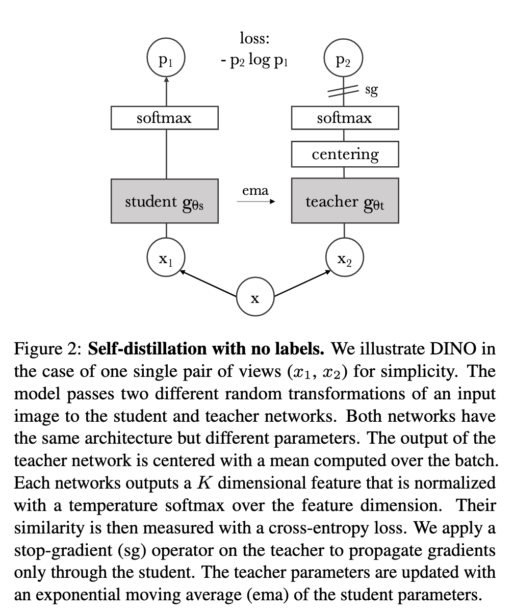
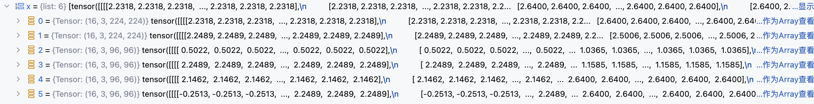

`Emerging Properties in Self-Supervised Vision Transformers 论文解读` 

<!-- more -->

> 论文链接: [Emerging Properties in Self-Supervised Vision Transformers](https://arxiv.org/abs/2104.14294)
> 代码链接: [https://github.com/facebookresearch/dino](https://github.com/facebookresearch/dino)

## 引言

Vision Transformer（ViT）近期成为卷积神经网络（convnets）的替代方案，在视觉识别任务中表现出竞争力。但与 convnets 相比，ViT 存在以下不足：

* 计算开销更大

* 需要更多训练数据

* 提取的特征不具备独特优势

研究者提出一个问题：是否是 **监督式预训练** 限制了 Transformer 在视觉中的潜力？在 NLP 任务中，Transformer 的成功很大程度上得益于 **自监督学习**（如 BERT 的掩码预测、GPT 的语言建模），这些预训练目标利用上下文信息提供了更丰富的学习信号，而不仅仅是单一标签。相比之下，图像监督学习往往把丰富的视觉信息压缩为一个类别标签，导致潜在信息损失。因此，研究者探索 **自监督学习是否能为 ViT 带来新的特性**。

论文通过研究自监督预训练对 ViT 特征的影响，得到以下核心结论（部分如图1所示）：



* **显式的语义分割信息**: 自监督 ViT 特征中会自然出现场景布局与物体边界，这些信息可以直接在最后一个 Transformer block 的自注意力模块中读取。相比之下，监督 ViT 和 convnets 并不显式包含这些特征。

* **优异的 k-NN 分类性能**: 在完全不做微调、线性分类器训练或数据增强的情况下，单纯使用最近邻分类器（k-NN），自监督 ViT 在 ImageNet 上可达到 **78.3% top-1** 准确率。

* **分割掩码的普遍性与关键条件**: 分割掩码的涌现似乎是自监督方法的普遍属性，但要想在 k-NN 上取得良好性能，必须结合以下组件：

  * **动量编码器**（momentum encoder）

  * **多视角裁剪增强**（multi-crop augmentation）

* **小 patch 的重要性**: 使用更小的 patch 能显著提升 ViT 特征质量。

基于以上发现，作者提出了 **DINO**（self-distillation with no labels），它可以被理解为一种 **无标签的知识蒸馏**：

* 学生网络通过交叉熵损失，直接预测教师网络（由动量编码器构建）的输出。

* 为避免模型塌缩，仅需在教师输出上应用 **居中（centering）与锐化（sharpening）**。

* 相比之下，其他方法使用的复杂组件（如 predictor、先进归一化方式或对比损失）并未带来额外收益。

**性能表现**：

* 在 ImageNet 线性分类基准上，DINO + ViT-Base（小 patch）达到 **80.1% top-1**，显著超越之前的自监督方法。

* 在 ResNet-50 上，DINO 的表现与最新的自监督系统相当。

**灵活性与通用性**：

* DINO 同时适用于 ViT 和 convnets，无需对架构或归一化方式做修改。

**计算效率**：

* 在资源有限的场景下，仅需 2 台 8-GPU 服务器训练 3 天，DINO + ViT 就能在 ImageNet 线性基准上达到 **76.1% top-1**，超越了同规模 convnets 的自监督系统，同时计算开销更低。

## 相关工作

### **自监督学习的发展路径**

自监督学习主要经历了以下几类方法：

* **实例分类**（Instance Classification）：把每张图像当作一个独立类别，训练模型去区分它们（允许数据增强后的一致性）。但问题是，当数据规模增大时，显式地学习分类器无法很好扩展。

* **NCE（噪声对比估计）方法**：通过比较图像特征而不是分类，避免了巨量类别的学习。但这种方法要求一次性比较大量样本，因此需要 **超大 batch size** 或 **记忆库（memory bank）**。

* **聚类式方法**：自动将实例分组，从而缓解对大规模比较的需求。

* **无须区分图像的学习方法**：近期研究发现，不必显式区分图像也能学到好特征。典型例子是 **BYOL**，它通过让学生特征去匹配由 **动量编码器（momentum encoder）** 生成的教师特征来学习。即使去掉动量编码器，BYOL 仍然能工作，但性能下降。

在 BYOL 的启发下，出现了一系列扩展方向：

* 匹配更复杂的表示

* 将特征训练为匹配 **均匀分布**

* 通过 **白化（whitening）** 来约束特征学习

DINO 借鉴了 BYOL 的思想，但不同点在于：它使用 **不同的相似性匹配损失**，并且 **学生和教师完全相同的架构**。因此，DINO 补充了 BYOL 的观点，把自监督学习解释为 **一种无标签的 Mean Teacher 自蒸馏（self-distillation）**。

---

### **自训练与知识蒸馏的联系**

**自训练（Self-training）** 的目标是：利用少量标注，将知识传播到大量无标签数据中，以提升特征质量。这种传播方式有两类：

* **硬标签分配**（hard assignments）

* **软标签分配**（soft assignments）

当使用软标签时，这种方法通常被称为 **知识蒸馏（Knowledge Distillation）**，最初是为了让小模型模仿大模型的输出，从而实现模型压缩。

Xie 等人 提出，蒸馏还能用于将软伪标签传播到无标签数据，这表明 **自训练与知识蒸馏本质上是相关的**。

在此基础上，DINO 进一步发展：

* 将知识蒸馏扩展到 **无标签场景**。

* 与过去依赖 **固定、预训练教师模型** 的方法不同，DINO 的教师模型在训练过程中是 **动态更新的**。

这样一来，知识蒸馏不再是自监督预训练之后的 **后处理步骤**，而是直接作为 **自监督目标函数**。

此外，DINO 也与 **协同蒸馏（Codistillation）** 有关。协同蒸馏中，学生与教师使用相同架构，并在训练中相互蒸馏。但不同的是：在协同蒸馏里，教师也会从学生蒸馏；而在 DINO 中，教师参数是通过 **学生参数的指数移动平均（EMA）** 来更新的。

## 方法

### 基于知识蒸馏的自监督学习

DINO（Distillation with No Labels）整体框架与近年来的自监督学习方法类似（如SimCLR、BYOL等），但其核心思想借鉴了 **知识蒸馏（Knowledge Distillation）**。在该框架中，我们训练一个学生网络 $g_{\theta_s}$ 去匹配一个教师网络 $g_{\theta_t}$ 的输出，二者参数分别为 $\theta_s$ 和 $\theta_t$。

对于输入图像 $x$，两者都会输出一个 $K$ 维的概率分布，分别记为 $P_s$ 和 $P_t$。这些分布由网络输出经过 softmax 归一化得到：

$$
P_s(x)(i) = \frac{\exp(g_{\theta_s}(x)(i)/\tau_s)}{\sum_{k=1}^{K}\exp(g_{\theta_s}(x)(k)/\tau_s)}
$$

其中，$\tau_s>0$ 是温度参数，控制分布的平滑程度；教师网络也有类似公式，只是温度为 $\tau_t$。

在传统的知识蒸馏中，学生通过最小化交叉熵损失来学习匹配教师的分布：

$$
\min_{\theta_s} H(P_t(x), P_s(x)), \quad H(a,b) = -a\log b
$$

---



DINO在此基础上引入 **多视角（multi-crop）策略**：

* 从同一张图片中生成多个视角（裁剪），形成集合 $V$。

* 包含两张分辨率较高的 **全局视角** $x^g_1, x^g_2$，以及多张较低分辨率的 **局部视角**。

* 学生网络处理所有视角，教师网络只处理全局视角，从而实现 **局部-全局对齐**。

最终损失函数为：

$$
\min_{\theta_s} \sum_{x \in \{x^g_1, x^g_2\}} \sum_{x' \in V, x' \neq x} H(P_t(x), P_s(x'))
$$

在默认参数设置下：

* 全局视角分辨率为 $224^2$，覆盖原图超过50%区域。

* 局部分辨率为 $96^2$，覆盖小于50%的区域。

---

与传统知识蒸馏不同，DINO的教师网络不是固定的，而是由学生网络迭代生成：

* **冻结教师**：在一个epoch内固定教师参数，效果不错。

* **直接拷贝学生参数**：无法收敛。

* **EMA（指数滑动平均）更新**：效果最佳。

更新规则为：

$$
\theta_t \leftarrow \lambda\theta_t + (1-\lambda)\theta_s
$$

其中 $\lambda$ 随训练进程按余弦调度从 0.996 增加到 1。这一机制类似 **Mean Teacher**，教师的表现始终优于学生，从而为学生提供更高质量的特征目标。

---

网络 $g = h \circ f$ 由两部分组成：

* **Backbone $f$**：可以是 ViT 或 ResNet。

* **投影头 $h$**：由三层 MLP（隐藏维度2048）、$L^2$ 归一化、以及一个权重归一化的全连接层组成。

值得注意的是：

* DINO不使用预测器（predictor），因此学生和教师网络架构完全相同。

* ViT没有使用BN（Batch Normalization），因此整个系统BN-free。

---

在自监督学习中，如果所有样本映射到相同的表示，会出现 **坍塌问题**。DINO采用以下机制来避免：

* **居中（Centering）**：防止某一维度主导表示，但容易导致均匀分布坍塌。

* **锐化（Sharpening）**：通过较低温度参数 $\tau_t$ 增强分布尖锐性，但风险是过度集中。

* **结合使用**：居中与锐化效果互补，可以有效避免坍塌。

其中，居中操作等价于给教师输出加一个偏置项 $c$，更新方式为：

$$
c \leftarrow mc + (1-m)\frac{1}{B}\sum_{i=1}^B g_{\theta_t}(x_i)
$$

其中 $m>0$ 为动量参数，$B$ 为batch size。该方法依赖于 **一阶统计量**，能适应不同batch大小。

## 代码解析

从本节开始我们将对官方开源的 `DINO` 模型代码实现进行详细讲解，下图给出的是 `DINO` 模型的运行完整流程图:


按照 `DINO` 模型的训练流程，第一步首先是对 输入图像 进行数据增强，生成 `两张全局视角图像 + 若干局部视角图像`， 该过程由 `DataAugmentationDINO` 类实现，代码如下:

```python
class DataAugmentationDINO(object):
    """
    数据增强类，用于 DINO 训练。
    主要思想：从一张输入图像生成多个视角（multi-crop），
    包括 2 张全局裁剪图像（224x224）和若干张局部裁剪图像（96x96）。
    """

    def __init__(self, global_crops_scale, local_crops_scale, local_crops_number):
        # 基础增强：随机翻转 + 颜色抖动 + 随机灰度化
        flip_and_color_jitter = transforms.Compose([
            transforms.RandomHorizontalFlip(p=0.5),  # 以 50% 概率水平翻转
            transforms.RandomApply(  # 以 80% 概率执行颜色抖动
                [transforms.ColorJitter(
                    brightness=0.4,  # 亮度变化
                    contrast=0.4,    # 对比度变化
                    saturation=0.2,  # 饱和度变化
                    hue=0.1          # 色调变化
                )],
                p=0.8
            ),
            transforms.RandomGrayscale(p=0.2),  # 以 20% 概率转为灰度图
        ])

        # 标准化（Imagenet 预训练均值/方差）
        normalize = transforms.Compose([
            transforms.ToTensor(),  # 转换为 Tensor
            transforms.Normalize(
                (0.485, 0.456, 0.406),  # mean
                (0.229, 0.224, 0.225)   # std
            ),
        ])

        # ----------- 全局裁剪 1 -----------
        self.global_transfo1 = transforms.Compose([
            # 随机裁剪并缩放到 224x224
            transforms.RandomResizedCrop(224, scale=global_crops_scale, interpolation=Image.BICUBIC),
            flip_and_color_jitter,
            utils.GaussianBlur(1.0),  # 高斯模糊（概率 100%）
            normalize,
        ])

        # ----------- 全局裁剪 2 -----------
        self.global_transfo2 = transforms.Compose([
            transforms.RandomResizedCrop(224, scale=global_crops_scale, interpolation=Image.BICUBIC),
            flip_and_color_jitter,
            utils.GaussianBlur(0.1),   # 高斯模糊（概率 10%）
            utils.Solarization(0.2),  # 以 20% 概率进行太阳化增强（反转亮部）
            normalize,
        ])

        # ----------- 局部裁剪 -----------
        self.local_crops_number = local_crops_number  # 局部裁剪数量
        self.local_transfo = transforms.Compose([
            transforms.RandomResizedCrop(96, scale=local_crops_scale, interpolation=Image.BICUBIC),
            flip_and_color_jitter,
            utils.GaussianBlur(p=0.5),  # 高斯模糊（概率 50%）
            normalize,
        ])

    def __call__(self, image):
        """
        输入一张图像，返回多个增强后的 crop。
        输出顺序：
        [全局视角1, 全局视角2, 局部视角1, 局部视角2, ...]
        """
        # 先生成两张全局 crop
        crops = [self.global_transfo1(image), self.global_transfo2(image)]
        # 再生成若干张局部 crop
        for _ in range(self.local_crops_number):
            crops.append(self.local_transfo(image))
        return crops
```
特别注意初始化方法中传入的 `global_crops_scale` 和 `local_crops_scale` 参数 :

```python
    # Multi-crop
    parser.add_argument('--global_crops_scale', type=float, nargs='+', default=(0.4, 1.0),
        help="Scale range for global crops.")
    parser.add_argument('--local_crops_number', type=int, default=8,
        help="Number of local crops (0 disables multi-crop).")
    parser.add_argument('--local_crops_scale', type=float, nargs='+', default=(0.05, 0.4),
        help="Scale range for local crops.")

```

`*_crops_scale` 是 **随机裁剪区域的相对尺度范围**，即原始图像面积的比例。

* 参数形式：`*_crops_scale = (min_scale, max_scale)`

* 作用：控制 **随机裁剪区域的最小和最大面积比例**。

* 举例：

  * 如果 `global_crops_scale = (0.4, 1.0)`

    * 随机裁剪的区域面积 ∈ \[40%, 100%] 原图面积之间。
   
    * 也就是说，有时裁掉少量边缘（接近原图），有时只取 40% 的图像内容（更聚焦）。
  
  * 裁剪后再统一缩放到 `224 × 224`，作为模型输入。

---

由于 `DINO` 采用多视角图像输入，对于学生模型来说，一个批次图像经过增强后，会得到 `2+n` 个来自不同视角下的批次图像:



为了同时处理多视角图像输入，`DINO` 使用了 `装饰器模式` ，设计 `MultiCropWrapper` 类来将输入图像批次列表按照分辨率进行分组：


> [0,2) 区间对应 `224` 分辨率 ， [2,6) 对应 `96` 分辨率

将分辨率相同的批次合并后输入模型，拼接结果:


完整代码实现如下:

```python
class MultiCropWrapper(nn.Module):
    """
    一个封装类，用于处理多视角输入（multi-crop inputs）。
    不同分辨率的输入会被分组，每一组在 backbone 中分别进行一次前向计算，
    得到的特征拼接后再送入 head 中处理。
    """

    def __init__(self, backbone, head):
        super(MultiCropWrapper, self).__init__()
        # 去掉 backbone 中原本为 ImageNet 分类准备的全连接层（fc, head）
        # 因为这里是自监督学习，不需要类别分类器
        backbone.fc, backbone.head = nn.Identity(), nn.Identity()
        self.backbone = backbone  # 特征提取网络
        self.head = head          # 投影头（projection head），用于后续对比学习

    def forward(self, x):
        # 保证输入是 list（多 crop 的场景可能传进来的是多个张量）
        if not isinstance(x, list):
            x = [x]

        # 获取每个输入 crop 的分辨率（最后一个维度 size）
        # torch.unique_consecutive 会返回连续相同值的唯一值及计数
        # return_counts=True 表示返回每个唯一值的计数
        # torch.cumsum 累积求和，得到每组 crop 的结束索引
        idx_crops = torch.cumsum(torch.unique_consecutive(
            torch.tensor([inp.shape[-1] for inp in x]),  # 取每个 crop 的宽度
            return_counts=True,
        )[1], 0)

        # 初始化
        start_idx = 0
        # 创建一个空 tensor 用于保存所有特征，放到和输入相同的 device 上
        output = torch.empty(0).to(x[0].device)

        # 遍历不同分辨率的分组
        for end_idx in idx_crops:
            # 将相同分辨率的 crop 拼接（batch 化），一起送入 backbone
            _out = self.backbone(torch.cat(x[start_idx: end_idx]))

            # 有些 backbone（如 XCiT）返回的是 tuple，这里只取第一个元素（主特征）
            if isinstance(_out, tuple):
                _out = _out[0]

            # 将这一批特征拼接到输出中
            output = torch.cat((output, _out))

            # 更新下一个起始位置
            start_idx = end_idx

        # 所有特征拼接完成后，送入 head 得到最终表示
        return self.head(output)
```

```python
def train_dino(args):
    """
    在单进程下运行完整的 DINO 训练循环

    步骤：
    1. 构建多视图增强 (Multi-crop augmentations) 和数据集 / DataLoader
    2. 构建学生 (Student) / 教师 (Teacher) 网络，并附加 DINO 头
    3. 用学生初始化教师网络，教师梯度冻结
    4. 创建损失函数、优化器及余弦调度器 (学习率、权重衰减、EMA momentum)
    5. 标准 float32 训练循环，每轮迭代更新 EMA 教师参数
    """
    # =====================
    # 1. 数据准备
    # =====================
    # 构建 DINO 的多视图增强策略：2 个全局裁剪 + N 个局部裁剪
    transform = DataAugmentationDINO(
        args.global_crops_scale,
        args.local_crops_scale,
        args.local_crops_number,
    )

    # 使用 ImageFolder 数据集，要求目录结构为：
    # data_path/class_x/*.jpg
    # ImageFolder 会根据子文件夹名自动生成 class 索引，并返回 (PIL image, label)
    dataset = datasets.ImageFolder(args.data_path, transform=transform)

    # 创建 DataLoader
    data_loader = torch.utils.data.DataLoader(
        dataset,
        shuffle=True,              # 打乱数据顺序
        batch_size=args.batch_size,
        num_workers=args.num_workers, # 多线程加载数据
        pin_memory=True,           # CUDA 加速
        drop_last=True,            # 丢弃最后不足 batch 的数据
    )
    print(f"数据加载完成: {len(dataset)} 张图片. Batch size: {args.batch_size}")

    # =====================
    # 2. 构建学生/教师网络
    # =====================
    # 使用相同的骨干网络 (Backbone) 构建学生和教师，并附加 DINO head
    student_backbone = vits.__dict__[args.arch](
        patch_size=args.patch_size,
        drop_path_rate=args.drop_path_rate  # DropPath 用于正则化
    )
    teacher_backbone = vits.__dict__[args.arch](patch_size=args.patch_size)
    embed_dim = student_backbone.embed_dim  # ViT 输出 embedding 维度

    # 构建学生网络 (Student) + DINO head
    student = utils.MultiCropWrapper(
        student_backbone,
        DINOHead(
            embed_dim,
            args.out_dim,
            use_bn=args.use_bn_in_head,  # 是否在 head 使用 BN
            norm_last_layer=args.norm_last_layer,  # 是否规范化最后一层
        )
    )

    # 构建教师网络 (Teacher) + DINO head
    teacher = utils.MultiCropWrapper(
        teacher_backbone,
        DINOHead(embed_dim, args.out_dim, args.use_bn_in_head),
    )

    # =====================
    # 3. 初始化教师网络
    # =====================
    # 教师网络初始参数与学生网络相同
    teacher.load_state_dict(student.state_dict())

    # 教师网络不参与梯度更新，仅通过 EMA 更新参数
    for p in teacher.parameters():
        p.requires_grad = False

    print(f"学生/教师网络构建完成: arch={args.arch}, embed_dim={embed_dim}")

    # =====================
    # 4. 构建 DINO 损失函数
    # =====================
    # DINOLoss 接收学生输出、教师输出和当前 epoch 信息
    dino_loss = DINOLoss(
        args.out_dim,
        args.local_crops_number + 2,  # 总视图数量: 2 个全局 + N 个局部
        args.warmup_teacher_temp,
        args.teacher_temp,
        args.warmup_teacher_temp_epochs,
        args.epochs,
    )

    # =====================
    # 5. 构建优化器
    # =====================
    # 对参数进行分组：对 bias / norm 等不使用 weight decay
    params_groups = utils.get_params_groups(student)
    optimizer = torch.optim.AdamW(params_groups)

    # =====================
    # 6. 学习率、权重衰减、EMA momentum 调度器
    # =====================
    # 使用余弦调度器，按迭代次数调整
    base_lr = args.lr * (args.batch_size / 256.0)  # 学习率按 batch_size 线性缩放
    lr_schedule = utils.cosine_scheduler(
        base_lr, args.min_lr, args.epochs, len(data_loader),
        warmup_epochs=args.warmup_epochs,
    )
    wd_schedule = utils.cosine_scheduler(
        args.weight_decay, args.weight_decay_end, args.epochs, len(data_loader),
    )
    momentum_schedule = utils.cosine_scheduler(
        args.momentum_teacher, 1.0, args.epochs, len(data_loader)
    )

    # =====================
    # 7. 训练循环
    # =====================
    for epoch in range(args.epochs):

        student.train()  # 学生网络训练模式
        teacher.train()  # 教师网络不更新梯度，但 train 模式保持 BN 行为

        for it, (images, _) in enumerate(data_loader):
            # ---------------------
            # 每次迭代更新学习率和权重衰减
            # ---------------------
            gid = it + epoch * len(data_loader)  # 全局迭代索引
            for i, pg in enumerate(optimizer.param_groups):
                pg["lr"] = lr_schedule[gid]
                if i == 0:
                    pg["weight_decay"] = wd_schedule[gid]

            # ---------------------
            # 前向计算 + 损失
            # 教师网络只看 2 个全局裁剪
            # 学生网络看所有裁剪 (2 个全局 + N 个局部)
            # ---------------------
            teacher_output = teacher(images[:2])   # 仅前 2 个全局裁剪
            student_output = student(images)       # 所有裁剪
            loss = dino_loss(student_output, teacher_output, epoch)

            # ---------------------
            # 反向传播 (仅学生网络)
            # ---------------------
            optimizer.zero_grad()
            loss.backward()

            # 训练初期冻结学生网络最后一层
            utils.cancel_gradients_last_layer(epoch, student, args.freeze_last_layer)

            # 更新学生网络参数
            optimizer.step()

            # ---------------------
            # EMA 更新教师网络参数
            # ---------------------
            with torch.no_grad():
                m = momentum_schedule[gid]  # 当前迭代 EMA momentum
                for ps, pt in zip(student.parameters(), teacher.parameters()):
                    pt.data.mul_(m).add_((1 - m) * ps.detach().data)
```

```python
class DINOLoss(nn.Module):
    """
    DINO 损失函数类，支持温度调度、中心化(center)和多视图(crop)处理。

    功能说明：
    - 对教师输出进行温度锐化(sharpening)，并维护一个移动中心(center)
      来稳定训练。
    - 计算跨视图的交叉熵损失：每个教师的全局视图监督所有学生视图，
      但不监督与其索引相同的学生视图。
    """
    def __init__(self, out_dim, ncrops, warmup_teacher_temp, teacher_temp,
                 warmup_teacher_temp_epochs, nepochs, student_temp=0.1,
                 center_momentum=0.9):
        super().__init__()
        self.student_temp = student_temp  # 学生输出 softmax 的温度
        self.center_momentum = center_momentum  # 中心更新的 EMA 动量
        self.ncrops = ncrops  # 输入图像裁剪数量
        self.register_buffer("center", torch.zeros(1, out_dim))  # 初始化教师输出中心向量

        # 教师温度调度表
        # 前 warmup_teacher_temp_epochs 采用线性增长，从 warmup_teacher_temp 到 teacher_temp
        # 后续 epoch 固定为 teacher_temp
        self.teacher_temp_schedule = np.concatenate((
            np.linspace(warmup_teacher_temp, teacher_temp, warmup_teacher_temp_epochs),
            np.ones(nepochs - warmup_teacher_temp_epochs) * teacher_temp
        ))

    def forward(self, student_output, teacher_output, epoch):
        """
        计算跨视图交叉熵损失。

        输入：
        - student_output: 学生模型输出，包含所有裁剪的拼接结果
        - teacher_output: 教师模型输出，仅包含全局视图
        - epoch: 当前训练轮数，用于教师温度调度

        处理流程：
        1. 学生输出按温度缩放并拆分为每个裁剪的输出
        2. 教师输出减去中心并进行温度锐化
        3. 每个教师视图监督除同索引学生视图外的所有学生视图
        """
        # 学生输出按温度缩放，并拆分为 ncrops 个裁剪
        student_out = student_output / self.student_temp
        student_out = student_out.chunk(self.ncrops)

        # 教师输出：减去中心并进行温度锐化
        temp = self.teacher_temp_schedule[epoch]  # 当前 epoch 的教师温度
        teacher_out = F.softmax((teacher_output - self.center) / temp, dim=-1)
        teacher_out = teacher_out.detach().chunk(2)  # 仅两张全局裁剪用于教师监督

        total_loss = 0  # 总损失
        n_loss_terms = 0  # 用于计算平均损失的项数
        # 遍历每个教师视图
        for iq, q in enumerate(teacher_out):
            # 遍历每个学生视图
            for v in range(len(student_out)):
                if v == iq:  # 不监督同索引的学生视图
                    continue
                # 计算交叉熵损失
                loss = torch.sum(-q * F.log_softmax(student_out[v], dim=-1), dim=-1)
                total_loss += loss.mean()
                n_loss_terms += 1
        # 对所有损失求平均
        total_loss /= n_loss_terms

        # 更新教师输出中心
        self.update_center(teacher_output)
        return total_loss

    @torch.no_grad()
    def update_center(self, teacher_output):
        """
        使用当前 batch 教师输出更新 EMA 中心

        公式：
        center = center * center_momentum + batch_center * (1 - center_momentum)
        """
        batch_center = teacher_output.mean(dim=0, keepdim=True)  # 计算 batch 中心
        self.center = self.center * self.center_momentum + batch_center * (1 - self.center_momentum)
```