`InternVL 1.0: Scaling up Vision Foundation Models and Aligning  for Generic Visual-Linguistic Tasks 论文简析` 

<!-- more -->

> 论文链接: [https://arxiv.org/abs/2312.14238](https://arxiv.org/abs/2312.14238)
> 代码链接: [https://github.com/OpenGVLab/InternVL](https://github.com/OpenGVLab/InternVL)

## 摘要

InternVL是一个大规模视觉-语言基础模型，旨在解决当前视觉与视觉-语言基础模型发展滞后于大型语言模型（LLMs）的问题。该模型通过将视觉基础模型扩展到60亿参数，并利用多源网络图像-文本数据进行渐进式对齐训练，成功实现了视觉与语言模型在参数规模和特征表示上的协调。InternVL在32个通用视觉-语言任务中表现出色，包括图像分类、语义分割、视频分类、图像/视频-文本检索以及多模态对话系统等，展现了强大的视觉能力和与LLMs的无缝集成潜力，为多模态大模型的发展提供了重要贡献。

## 简介

1. **研究背景与问题**: 大型语言模型（LLMs）的快速发展推动了通用人工智能（AGI）系统的进步，但视觉和视觉-语言基础模型的发展却相对滞后。现有的视觉-语言大模型（VLLMs）通常使用轻量级的“胶水层”（如QFormer或线性投影）来对齐视觉和语言模型的特征，但这种方法存在三个主要限制：  
   
   - **参数规模不匹配**：LLMs的参数规模已达千亿级，而视觉编码器通常仅约10亿参数，限制了LLM的能力利用。  
   
   - **表征不一致**：视觉模型通常基于纯视觉数据或BERT系列模型训练，与LLMs的特征空间存在差异。  
   
   - **低效连接**：轻量级胶水层难以捕捉跨模态的复杂交互。  

2. **解决方案与核心设计**: 论文提出 **InternVL**，通过以下关键设计解决上述问题：  
   
   - **参数平衡的视觉与语言组件**：包含60亿参数的视觉编码器（InternViT-6B）和80亿参数的语言中间件（QLLaMA），后者作为强大的“胶水层”重组视觉特征。  
   
   - **一致的表征对齐**：使用多语言LLaMA初始化中间件，确保视觉编码器与LLMs的特征空间一致。  
   
   - **渐进式图像-文本对齐策略**：先在大规模噪声数据上对比学习，再在高质量数据上生成学习，逐步提升模型性能（如图1c所示）。  

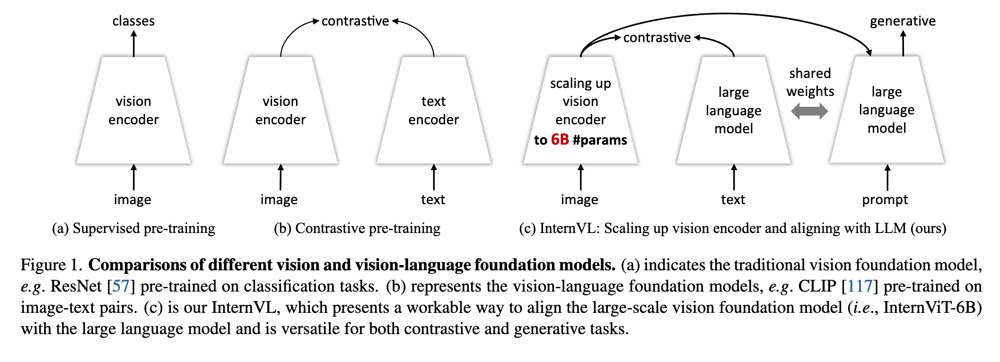

3. **模型优势**  
   
   - **多功能性**：可作为独立视觉编码器或与语言中间件结合，支持感知、检索、生成和对话任务。  
   
   - **强大性能**：在ImageNet分类、ADE20K分割、视频检索等任务中达到SOTA（如图2所示）。  
   
   - **LLM友好性**：与LLaMA、Vicuna等LLMs无缝集成，推动多模态应用发展。  

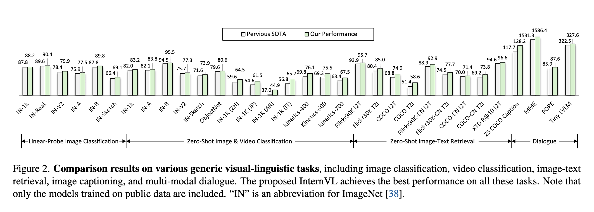

## 相关工作

#### **1. 视觉基础模型（Vision Foundation Models）**
视觉基础模型在过去十年中经历了显著发展，从早期的AlexNet和CNN架构（如ResNet）到近年来的Vision Transformer（ViT）及其变体。ViT及其衍生模型（如ViT-G、EVA-02等）通过扩大模型规模和参数量，显著提升了视觉任务的性能。然而，当前广泛使用的视觉模型参数量仍停留在约10亿级别（如ViT-22B除外），远落后于LLMs的规模。此外，这些模型多基于纯视觉数据（如ImageNet、JFT）训练，或与BERT系列模型对齐，缺乏与LLMs的直接特征兼容性，限制了其在多模态任务中的表现。

#### **2. 大语言模型（Large Language Models, LLMs）**
LLMs（如GPT-3、LLaMA系列、Vicuna等）在自然语言处理领域取得了突破性进展，展示了强大的少样本和零样本学习能力。开源模型（如ChatGLM、Falcon等）的涌现进一步加速了多模态研究的进程。然而，LLMs本身缺乏视觉理解能力，如何将其与视觉模态结合成为关键挑战。

#### **3. 视觉大语言模型（Vision Large Language Models, VLLMs）**
近期研究通过将视觉模型与LLMs结合，构建了多模态对话系统（如Flamingo、LLaVA、MiniGPT-4等）。这些工作主要依赖轻量级适配层（如QFormer、线性投影）连接视觉编码器和LLM，但受限于视觉模型的规模和对齐效率。部分模型（如KOSMOS-2、Qwen-VL）进一步引入了视觉定位能力，支持区域描述和问答。尽管如此，视觉基础模型的性能瓶颈仍是制约VLLMs发展的关键因素。

#### **核心问题与本文定位**
现有工作表明，视觉模型的规模不足和对齐低效是阻碍多模态能力提升的主要障碍。InternVL通过**规模化视觉编码器**和**渐进式跨模态对齐**，首次实现了视觉与语言模型在参数和特征空间的深度协同，填补了这一领域的空白。

## 方法

### **1. 整体架构设计**

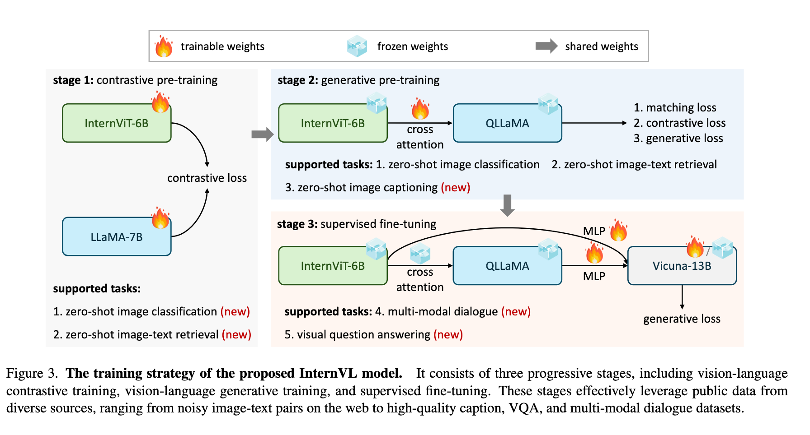

InternVL的整体架构（如图3所示）突破了传统视觉模型（如ViT）和双塔模型（如CLIP）的局限，通过以下两个核心组件实现跨模态深度协同：

- **InternViT-6B**: 基于标准ViT架构的60亿参数视觉编码器，通过超参数搜索优化了深度（48层）、头数（25）和MLP比率（8），在模型规模（5.9B参数）与计算效率间取得平衡（详见表1）。其输出支持密集特征图（$H/14 \times W/14 \times D$）或全局池化特征，适配分类、分割等任务。

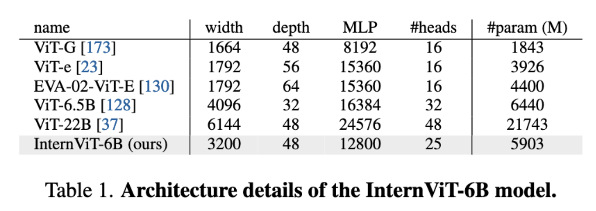

- **QLLaMA**: 基于多语言LLaMA-7B初始化的80亿参数语言中间件，新增**96个可学习查询**和交叉注意力层（1B参数），作为视觉与LLMs之间的"重型胶水层"。相比QFormer等轻量适配器，其参数量提升42倍，能更有效地重组视觉特征为LLM兼容的序列（见图4b/d）。

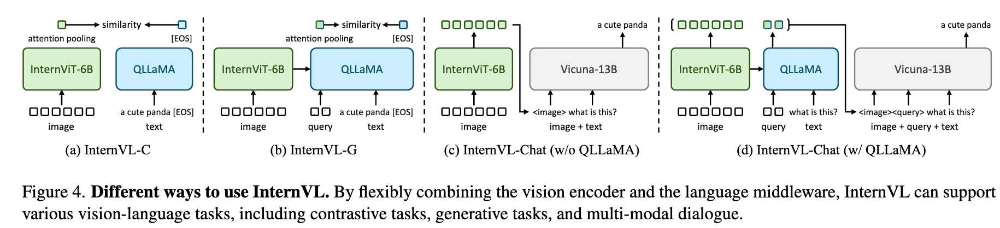

如图1所示，InternVL的架构设计显著区别于：

- **(a) 纯视觉模型**（如ResNet）：仅支持单模态任务，缺乏语言对齐。

- **(b) 双塔模型**（如CLIP）：独立编码图像/文本，依赖浅层相似度计算。

- **(c) InternVL**：通过QLLaMA实现动态特征交互，同时支持对比学习（如检索）和生成任务（如描述）。

通过组合不同组件，InternVL可灵活切换为四种模式（图4）：

1. **纯视觉模式**（图4a）：仅用InternViT-6B处理图像分类/分割。

2. **对比模式-InternVL-C**（图4b）：视觉编码器+注意力池化，用于零样本分类/检索。

3. **对比模式-InternVL-G**（图4b）：联合QLLaMA二次编码视觉特征，提升检索精度。

4. **对话模式**（图4c/d）：连接LLM（如Vicuna），支持多模态问答。

### **2. 模型设计**

1. **大规模视觉编码器（InternViT-6B）**  
   
   - InternViT-6B是一个基于Vision Transformer（ViT）的视觉编码器，参数量达到60亿，旨在与大型语言模型（LLM）的规模相匹配。  
   
   - 通过超参数搜索（如模型深度、头维度和MLP比例），作者确定了在性能和效率之间取得平衡的最佳配置（表1）。实验发现，模型深度对速度的影响在GPU计算饱和后可以忽略，而参数数量相同时，不同配置对性能影响较小。最终选择了深度48、宽度3200、MLP比率12800的稳定配置。  
   
   - 该编码器支持密集预测任务（如语义分割）和图像分类任务，并能生成全局或局部视觉特征（图4a/b）。

2. **语言中间件（QLLaMA）**  
   
   - QLLaMA是一个80亿参数的语言中间件，基于多语言LLaMA-7B初始化，新增了96个可学习查询和交叉注意力层（1亿参数），用于对齐视觉与语言特征（图3）。  
   
   - 相比传统轻量级“胶水层”（如QFormer或线性投影），QLLaMA的优势包括：  
   
     - 通过预训练权重实现视觉特征到LLM表示的对齐；  
   
     - 参数量是QFormer的42倍，即使冻结LLM解码器也能在多模态对话任务中表现优异；  
   
     - 支持对比学习任务（如零样本图像分类和检索）。  

3. **灵活的组合方式（“瑞士军刀”模型）**  
   
   - InternVL通过组合视觉编码器和语言中间件，支持多种任务模式（图4）：  
   
     - **视觉感知任务**：直接使用InternViT-6B提取特征。  
   
     - **对比任务**（如检索）：通过注意力池化生成全局特征（InternVL-C或InternVL-G）。  
   
     - **生成任务**（如图像描述）：QLLaMA利用其大规模参数重组视觉表示并生成文本。  
   
     - **多模态对话**：连接LLM解码器（InternVL-Chat），支持两种配置（图4c/d）。 

### **3. 对齐策略**

**1. 视觉-语言对比训练（Vision-Language Contrastive Training）**  

- **目标**：初步对齐视觉编码器（InternViT-6B）和文本编码器（LLaMA-7B）。  

- **数据**：使用大规模但噪声较多的公开网络图像-文本对（如 LAION-en、LAION-multi、COYO 等，共 4.98B 样本，表 2）。  

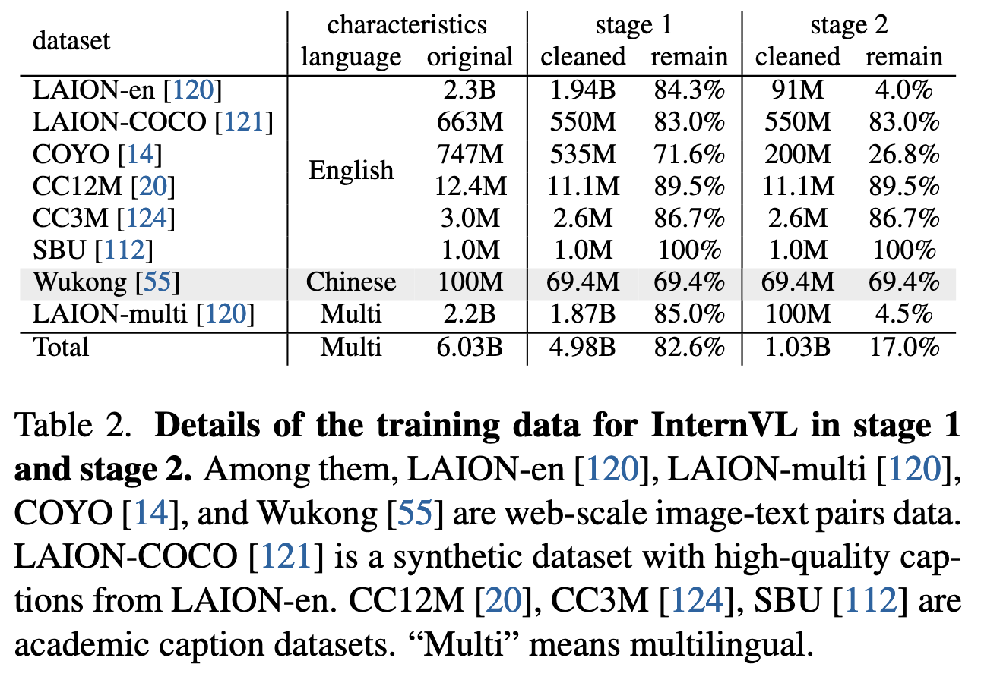

- **方法**：  

  - 采用 **CLIP 风格的对比学习**，最小化图像-文本对的对称交叉熵损失。  

  - 初始阶段在较低分辨率（196×196）训练，并应用 **50% 图像 token 掩码** 以提高效率，后期切换至 224×224 分辨率。  

- **效果**：使模型在零样本分类、图像-文本检索等对比任务上表现优异，并为后续阶段提供稳健的视觉表示。  

---

**2. 视觉-语言生成训练（Vision-Language Generative Training）**  

- **目标**：增强模型生成能力，进一步对齐视觉与语言特征。  

- **数据**：筛选高质量图像-文本数据（1.03B，表 2），去除低质量描述（如重复文本、无意义内容）。  

- **方法**：  

  - 冻结 InternViT-6B 和 QLLaMA 的预训练权重，仅训练新增的 **可学习查询和交叉注意力层**。  

  - 结合 **三种损失函数**：  

    - **ITC（图像-文本对比损失）**  

    - **ITM（图像-文本匹配损失）**  

    - **ITG（基于图像的文本生成损失）**  

- **效果**：使 QLLaMA 能够有效重组视觉特征，并生成连贯的文本描述（如表 10 的零样本图像描述结果）。  

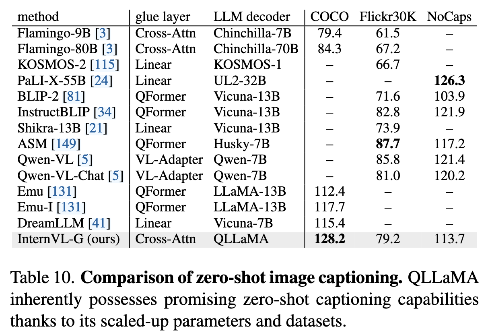

---

**3. 监督微调（Supervised Fine-tuning, SFT）**  

- **目标**：优化多模态对话能力，连接 LLM 解码器（如 Vicuna、InternLM）。  

- **数据**：收集约 400 万高质量指令数据（表 3），涵盖图像描述、VQA、OCR、视觉定位等任务。  

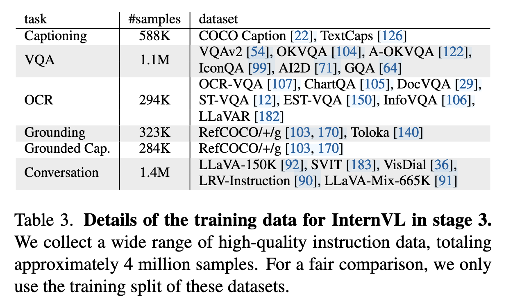

- **方法**：  

  - **两种配置**（图 4c/d）：  

    1. **仅使用 InternViT-6B**，通过 MLP 层连接 LLM（类似 LLaVA）。  

    2. **使用完整 InternVL（InternViT + QLLaMA）**，利用其对齐的特征空间提升性能。  

  - 由于 QLLaMA 与 LLM 特征空间一致，即使冻结 LLM 解码器，仅微调 MLP 层也能取得良好效果。  

- **效果**：在 MME、POPE 等多模态对话基准上达到 SOTA（表 9）。  

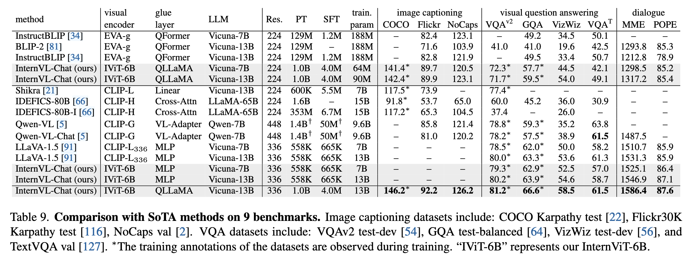

这一渐进式策略确保模型 **从粗粒度对齐过渡到细粒度优化**，充分利用不同质量的数据，最终实现强大的多模态理解和生成能力。

### 实现细节

**第一阶段（Stage 1）**
- 在该阶段，图像编码器 InternViT-6B 是随机初始化的 [7](https://arxiv.org/abs/2106.08254)，而文本编码器 LLaMA-7B 则使用来自文献 [32](https://arxiv.org/abs/2304.08177)的预训练权重进行初始化。此阶段中，**所有参数都是可训练的**。

**第二阶段（Stage 2）**
- 在该阶段，InternViT-6B 和 QLLaMA 继承了第一阶段中学习到的权重，而 **QLLaMA 中新加入的可学习查询（learnable queries）和跨注意力层（cross-attention layers）是随机初始化的**。由于第一阶段中已获得了强大的表示能力，我们在该阶段**冻结 InternViT-6B 和 QLLaMA，仅训练新引入的参数**。

> 基座是 LLaMA-7B：QLLaMA 继承了经过第一阶段对比训练后得到的 LLaMA-7B 权重；
>
> 新增模块：
>
> - 96 个 learnable query 向量：用于从视觉特征中提取信息；
>
> - Cross-Attention 层：插入到了 LLaMA 的每一层 decoder block 中（这是主流做法，如 BLIP-2 也是如此），使得语言模型具备视觉融合能力；
>
> - 参数量：新加入模块约为 10 亿参数，占 QLLaMA 总体 8B 的一部分；

**第三阶段（Stage 3）**
- 此阶段有两种不同的配置方式：
    
    * 一种是**单独使用 InternViT-6B**，如图 4(c) 所示；
    
    * 另一种是**同时使用完整的 InternVL 模型**，如图 4(d) 所示。

## 实验

### **视觉感知能力验证（Visual Perception Benchmarks）**

图像分类（Image Classification）：

- InternViT-6B 在 ImageNet-1K 及其多个变种（如 IN-A、IN-R、IN-V2 等）上进行线性探测评估。结果显示，其在冻结骨干网络的前提下，取得了领先的零样本分类准确率，**平均精度达到 82.5%**，超过了如 OpenCLIP-G、EVA-01-CLIP-g 等主流模型。

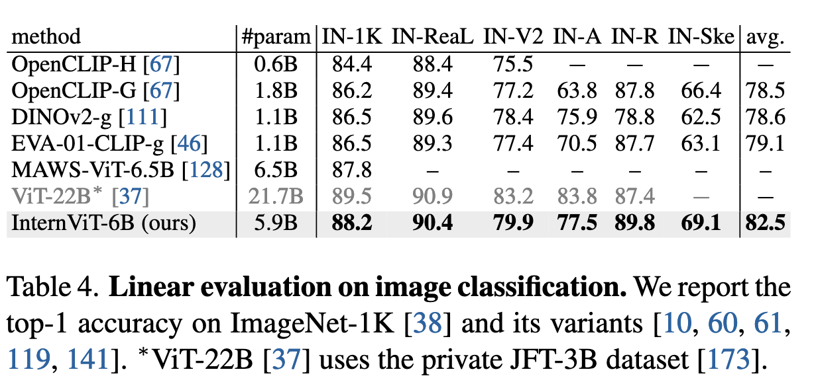

语义分割（Semantic Segmentation）：

- 在 ADE20K 上进行语义分割测试，在不同微调策略下（线性探测、Head Tuning、全量微调），InternViT-6B 都展现出更强的像素级感知能力。例如，在全参数微调下，**mIoU 达到 58.9%**，显著优于 ViT-22B（55.3%）。

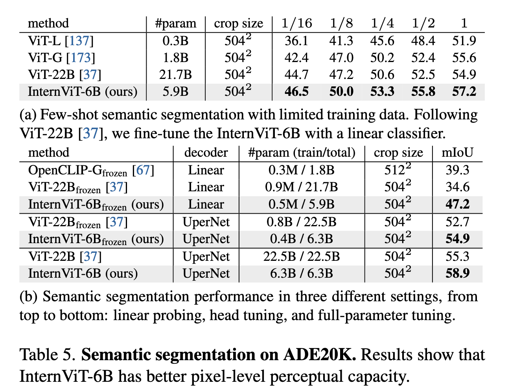

### **视觉-语言任务能力（Vision-Language Benchmarks）**

零样本图像分类（Zero-Shot Image Classification）：

- 在多语言版本的 ImageNet 上（EN, ZH, JP, AR, IT），InternVL-C 的表现优于 OpenCLIP-XLM-R 和其他多语言模型，展示了良好的语言泛化能力。

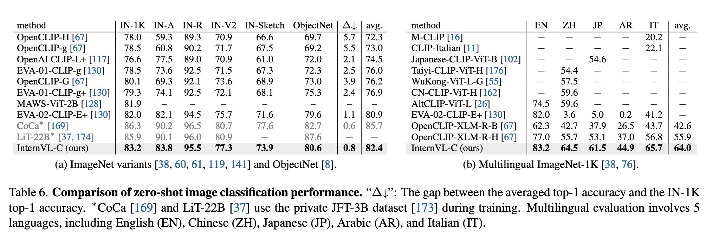

零样本图像-文本检索（Image-Text Retrieval）：

- InternVL-C 和 InternVL-G 在英中双语的 Flickr30K / COCO / Flickr30K-CN / COCO-CN 上均取得 SoTA 表现，**InternVL-G 的 Recall\@1 在 COCO 图像→文本检索任务中达到 85.0%**，在多语言图像→文本检索任务 XTD 中，Recall\@10 平均可达 **96.6%**，显著超越现有方法。

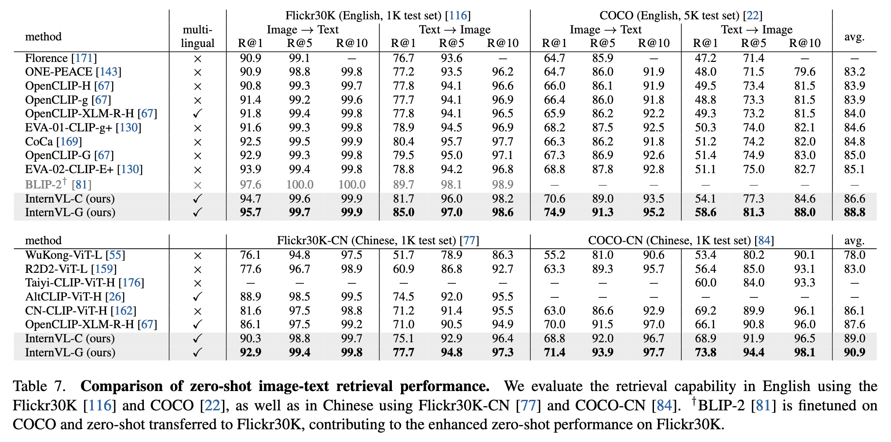

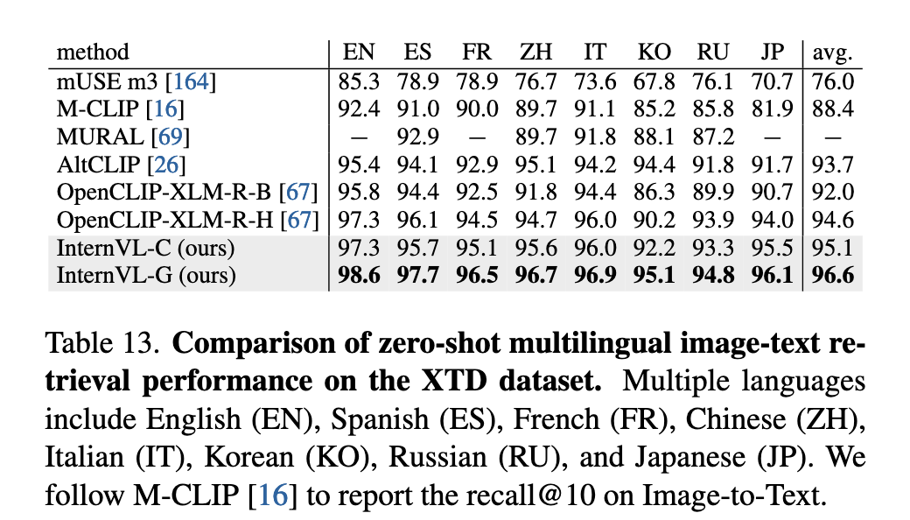

零样本图像字幕生成（Image Captioning）：

- InternVL-G 在不使用指令微调的前提下，仅通过 QLLaMA 即可生成高质量图像描述。例如在 COCO 测试集上，**zero-shot CIDEr 得分达到 128.2**，超越如 BLIP-2、Qwen-VL 等多模态生成模型。

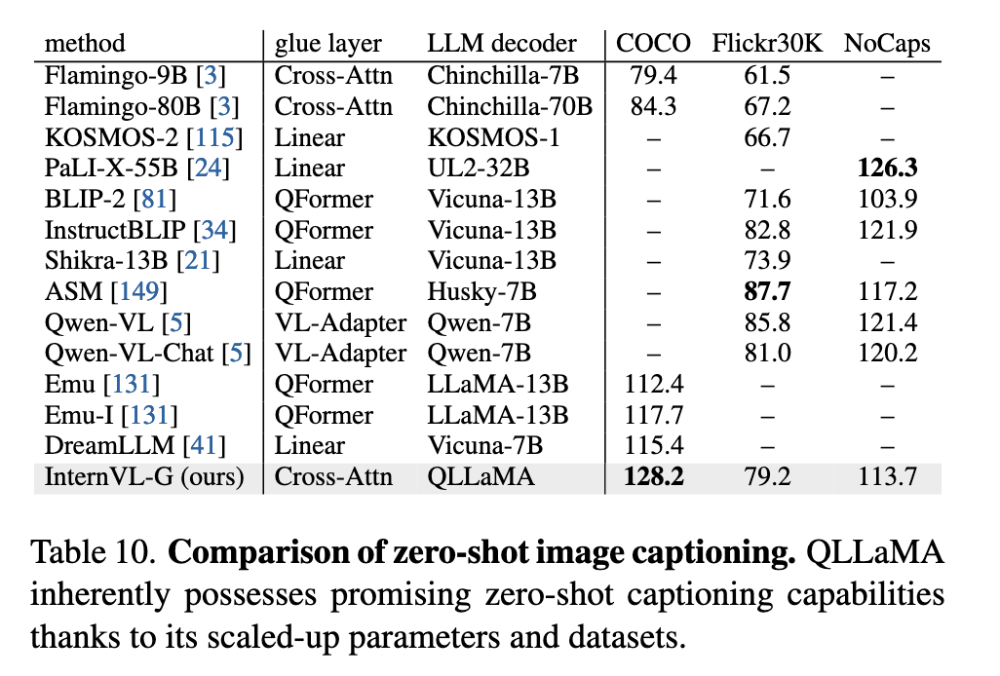

### **多模态对话任务（Multi-Modal Dialogue Benchmarks）**

InternVL-Chat 在多模态对话基准（如 MME、POPE）上超越了多个 SoTA 模型。比如，在 MME 综合指标上，**InternVL-Chat（13B + QLLaMA）达到 1586.4 分**，优于 LLaVA-1.5 和 InstructBLIP 等方法。

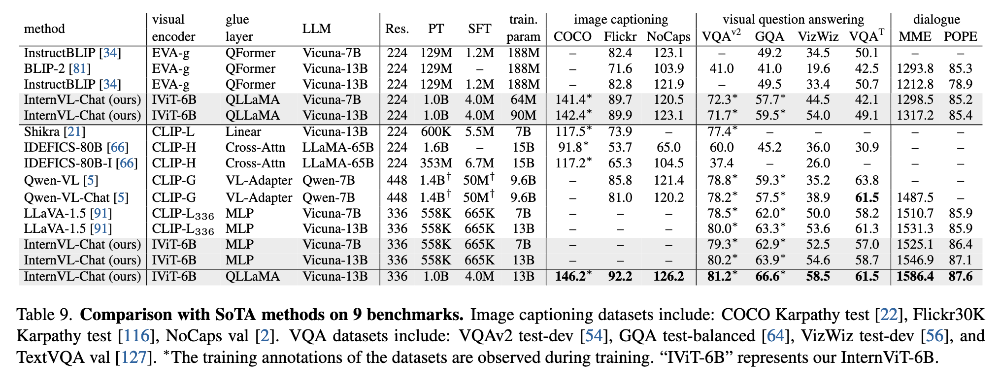

此外，InternVL 的多模态对话能力还体现在：

* VQA 子任务上：GQA 得分达 59.5（优于 LLaVA-13B 的 63.3）；

* 图像字幕、OCR、视觉推理任务中均表现稳定，兼具理解和生成能力。

### **消融实验（Ablation Study）**

视觉主干设计选择（InternViT-6B）：

- 作者在不同模型深度、宽度、MLP 比例等超参数组合上进行对比试验，最终选择了参数约为 5.9B 的 **variant 3** 作为 InternViT-6B 版本，在计算成本和准确率之间取得了良好平衡。

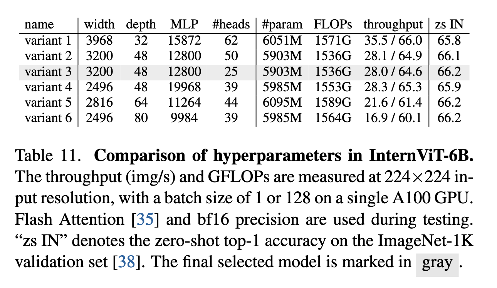

QLLaMA 的重要性验证：

- 通过最小化配置（仅训练 MLP 层）进行对比，发现**使用 QLLaMA 作为 glue 层明显优于传统 MLP 层或 QFormer**，在对话任务（如 MME、OKVQA、GQA）上均有显著提升。例如 MME 得分从 1022.3（无 QLLaMA）提高至 1317.2（使用 QLLaMA 和 Vicuna-13B）。

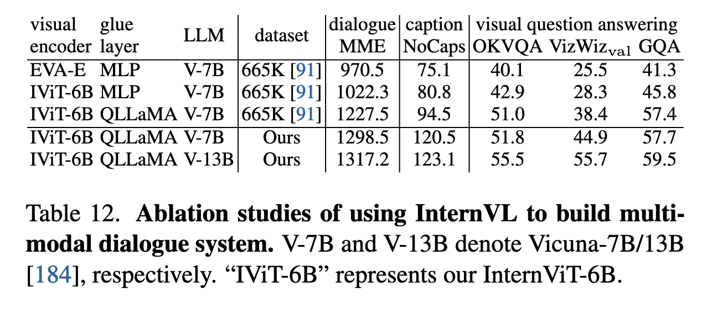

### 总结

InternVL 的实验结果充分证明了其设计策略的有效性：

1. **大型视觉编码器（InternViT-6B）具备极强的感知能力**；

2. **QLLaMA 显著提升了视觉-语言对齐与生成能力**；

3. **多阶段训练策略（对比 + 生成 + 指令微调）保障了模型的通用性与灵活性**；

4. **在图像分类、文本检索、VQA、多模态对话等任务上全面领先于现有开源模型**，是当前最具代表性的通用多模态基础模型之一。

## 结论

通过将视觉基础模型扩展到 60 亿参数规模（InternViT-6B），并与一个由 LLaMA 初始化的语言中间件（QLLaMA）进行渐进式对齐，InternVL 构建了一个强大且通用的视觉-语言基础模型。借助海量图文数据和多阶段训练策略（对比、生成、微调），InternVL 实现了在图像分类、图文检索、图像描述、VQA、多模态对话等任务上的领先性能，成功弥合了视觉模型与大型语言模型之间的能力与表示鸿沟，推动了多模态大模型的发展。
