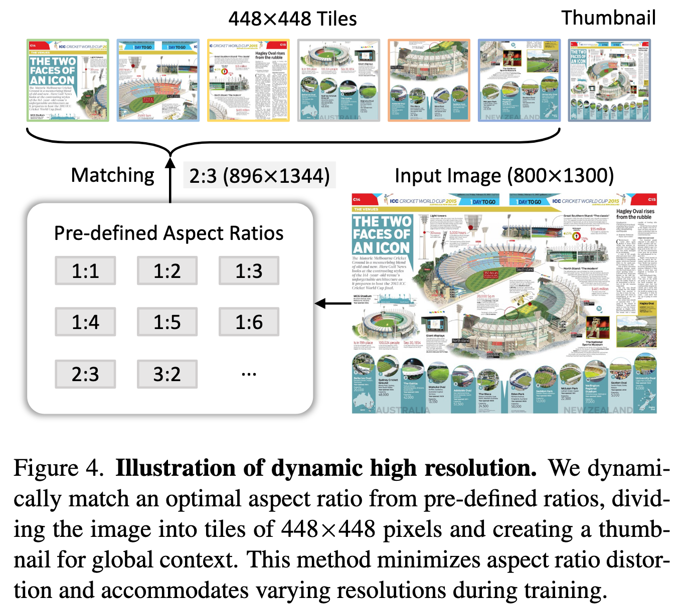
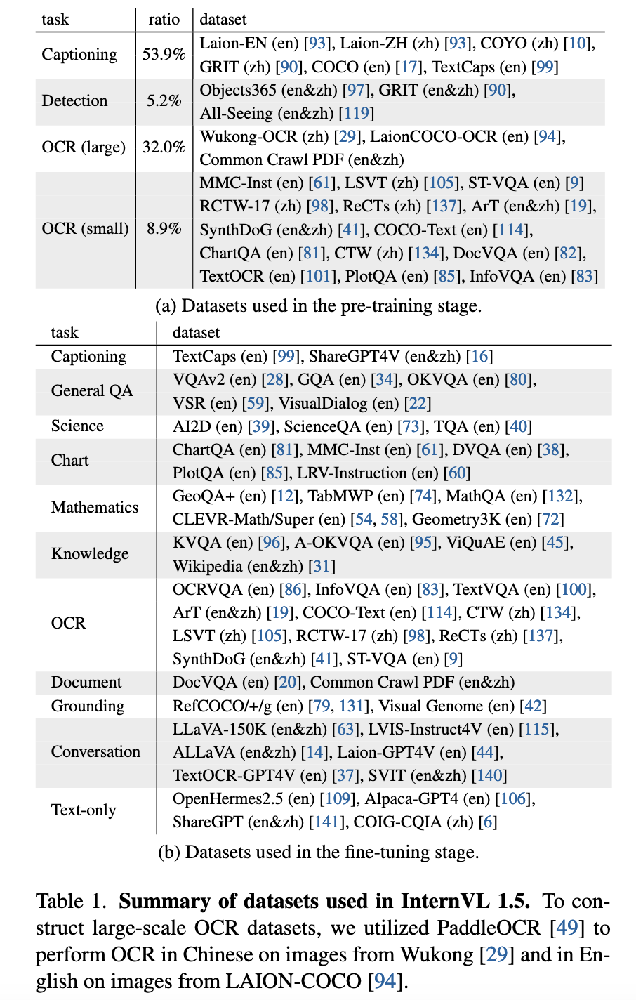
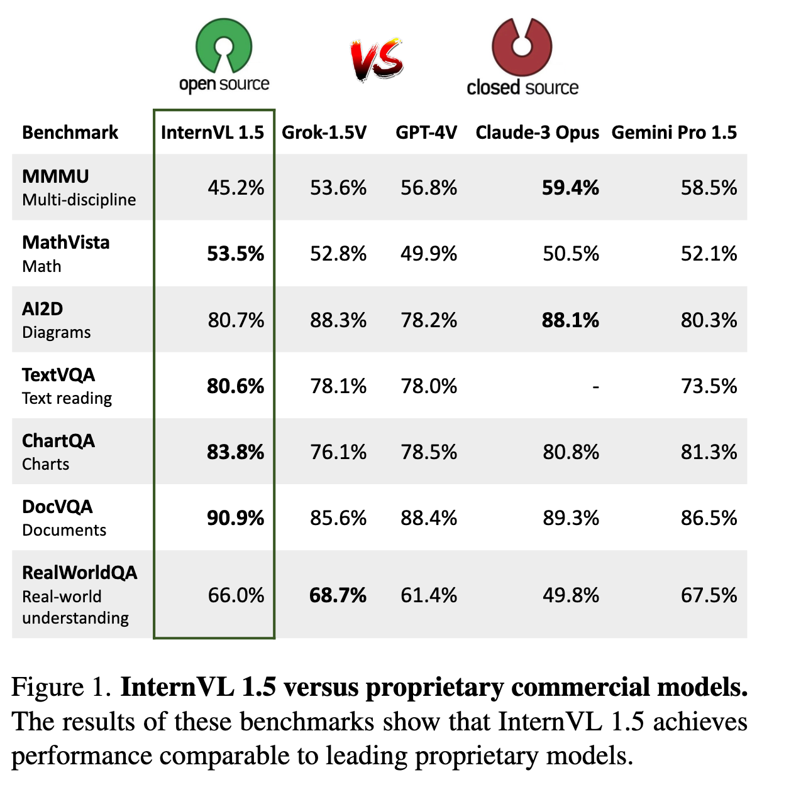
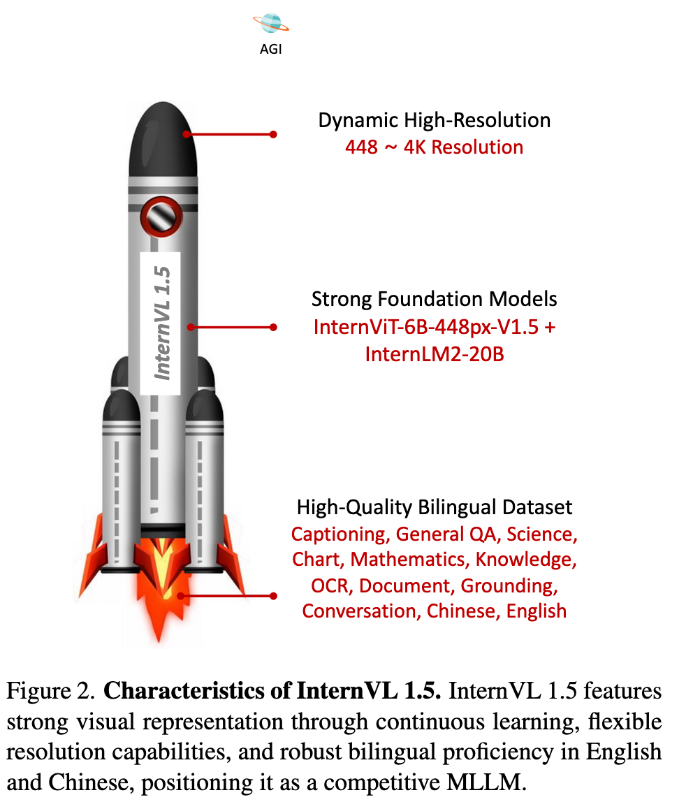
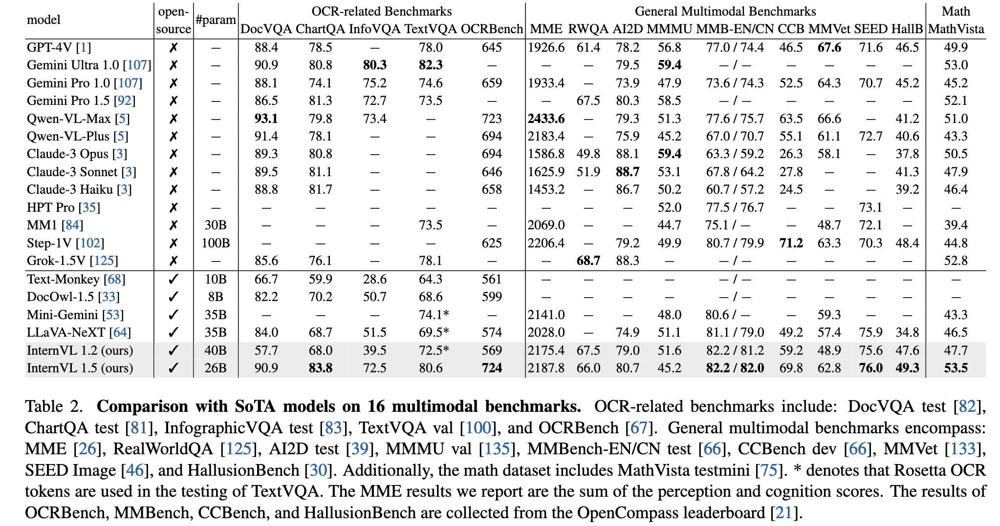
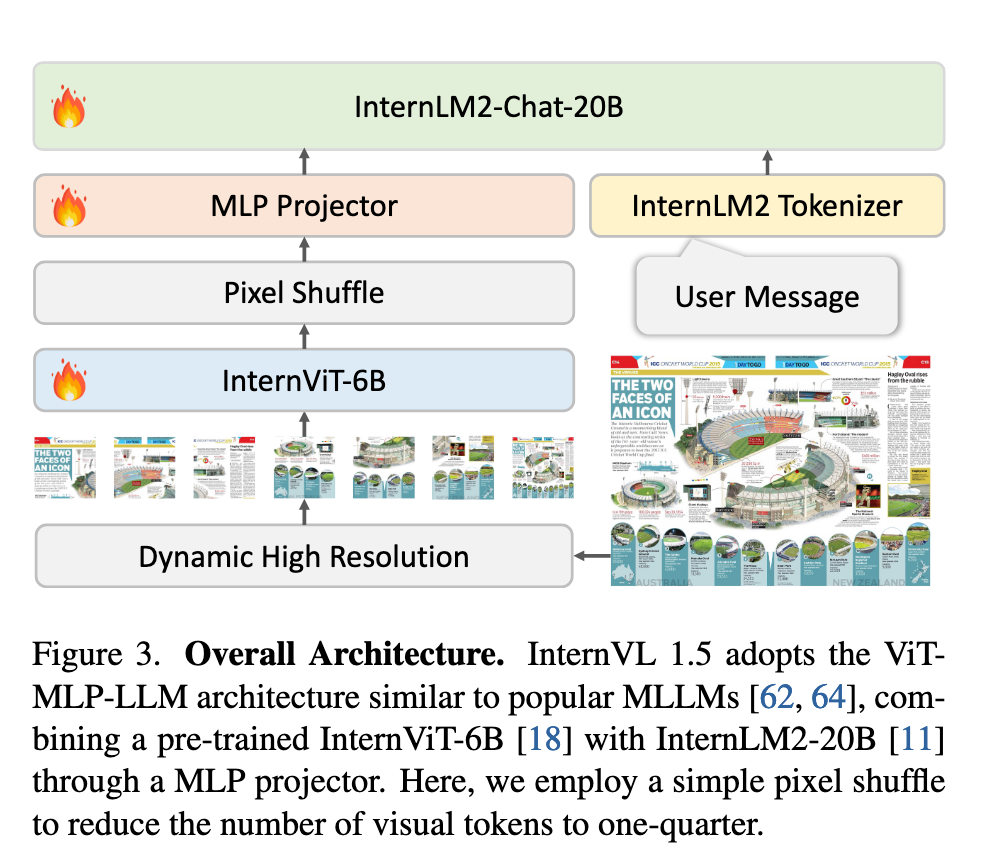
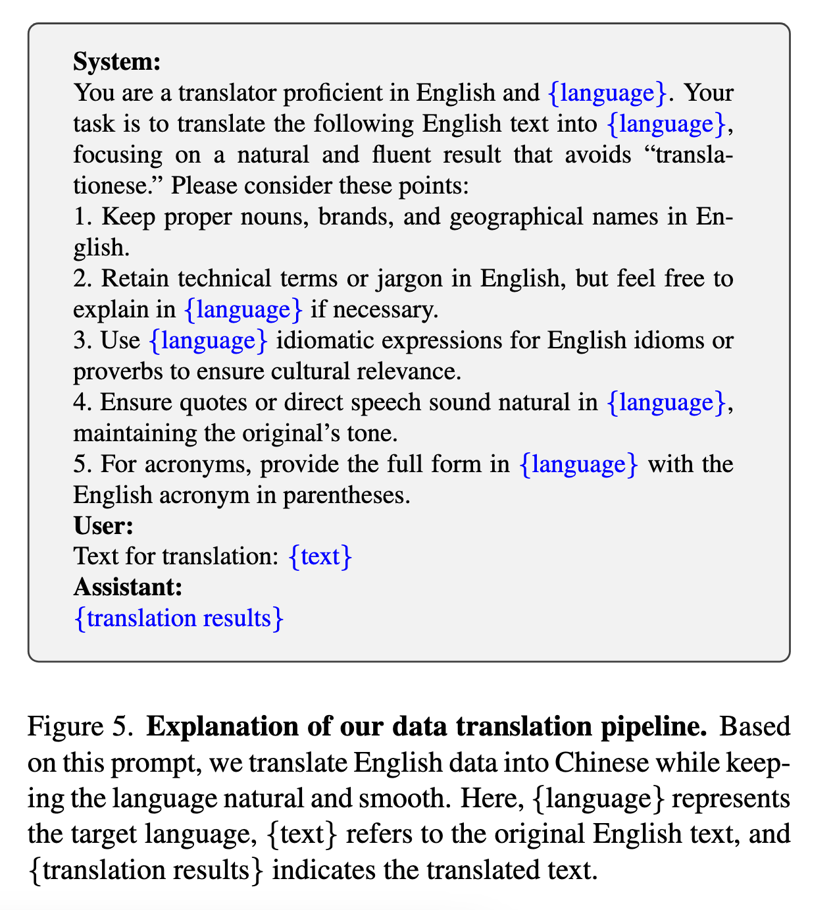

`How Far Are We to GPT-4V? Closing the Gap to Commercial Multimodal Models with Open-Source Suites 论文简析` 

<!-- more -->

> 论文链接: [How Far Are We to GPT-4V? Closing the Gap to Commercial Multimodal Models with Open-Source Suites](https://arxiv.org/abs/2404.16821)

## 摘要

InternVL 1.5 是一个开源的多模态大语言模型（MLLM），旨在缩小开源模型与商业多模态模型（如 GPT-4V）之间的性能差距。其核心改进包括以下三点：

1. **强大的视觉编码器**：通过持续学习策略优化大规模视觉基础模型 InternViT-6B，提升其视觉理解能力，并使其能够适配不同的语言模型（LLMs）。  

2. **动态高分辨率处理**：根据输入图像的长宽比和分辨率，将其动态分割为 1 到 40 个 448×448 像素的图块，最高支持 4K 分辨率输入，同时保留全局缩略图以捕捉上下文信息。  

3. **高质量双语数据集**：精心构建了一个涵盖常见场景和文档图像的双语数据集（中英文问答对），显著提升了模型在 OCR 和中文相关任务中的表现。

实验结果表明，InternVL 1.5 在 18 个多模态基准测试中表现优异，其中 8 项达到领先水平，尤其在 OCR 相关任务中表现突出。其性能与商业模型（如 GPT-4V、Gemini 系列等）相当，部分任务甚至超越商业模型。这一成果为开源多模态模型的发展提供了重要支持。

## 简介

1. **研究背景与问题**: 大型语言模型（LLMs）在推动通用人工智能（AGI）方面发挥了重要作用，而多模态大型语言模型（MLLMs）进一步扩展了文本与视觉信息的交互能力。然而，开源模型与商业专有模型（如GPT-4V、Gemini系列和Qwen-VL-Max）之间仍存在显著差距，主要体现在三个方面：  
   
   - **参数规模**：商业模型通常具有超过1000亿参数，而开源模型的视觉基础模型（VFM）通常仅3亿参数，搭配70亿或130亿参数的LLMs。  
   
   - **图像分辨率**：商业模型支持动态分辨率以保留原始宽高比，而开源模型多采用固定分辨率（如336×336或448×448），限制了细节理解能力。  
   
   - **多语言能力**：商业模型通过多语言数据集训练，而开源模型主要依赖英语数据，其他语言任务表现较差（如OCR和中文场景理解）。

2. **解决方案与创新**: 论文提出InternVL 1.5，通过以下改进缩小差距：  
   
   - **强大的视觉编码器**：基于InternViT-6B的持续学习策略，增强视觉理解能力并适配不同LLMs。  
   
   - **动态高分辨率处理**：将图像分割为1至40个448×448像素的区块（支持4K分辨率），并添加缩略图以保留全局上下文（见图4）。  

   - **高质量双语数据集**：涵盖常见场景和文档图像，通过中英文问答对标注，显著提升OCR和中文任务性能（见表1）。

3. **模型优势**  
   
   - **灵活分辨率**：类似GPT-4V的“低/高”模式，用户可根据任务需求选择分辨率（如低分辨率用于场景描述，高分辨率用于文档分析）。  
   
   - **双语能力**：在中文任务中表现优于GPT-4V（见图1）。  

   

   - **强视觉表征**：InternViT-6B的大参数规模使其视觉表征能力媲美200亿参数的LLMs，实现多模态能力的协同提升（见图2）。

   

4. **性能验证**: InternVL 1.5在18个多模态基准测试中表现优异，在8个任务中达到SOTA，尤其在OCR相关任务（如TextVQA、ChartQA）中超越商业模型（见表2）。研究团队开源模型权重，以促进MLLM社区发展。  

## 相关工作

### **1. 商业专有多模态大模型（Proprietary Commercial MLLMs）**  

商业模型在多模态领域占据领先地位，主要代表包括：  

- **GPT-4V**（OpenAI）：扩展GPT-4的视觉能力，支持文本和图像输入。  

- **Gemini 系列**（Google）：从1.0到1.5版本，支持文本、图像和音频，并扩展至100万tokens的上下文窗口。  

- **Qwen-VL-Plus/Max**（阿里）：在无需OCR工具的情况下展现强大的多模态能力。  

- **Claude-3V、HPT Pro、MM1、Step-1V、Grok-1.5V** 等新兴模型进一步推动多模态技术的发展。  

这些模型的优势在于大规模参数、动态分辨率支持和多语言优化，但通常不开源，限制了研究社区的应用和优化。  

### **2. 开源多模态大模型（Open-Source MLLMs）**  

开源模型在视觉-语言任务中取得显著进展，代表性工作包括：  

- **LLaVA 系列**、**MiniGPT-4**、**Qwen-VL**、**CogVLM** 等，主要采用固定分辨率（如336×336或448×448），导致在非常规宽高比或文档理解任务上表现受限。  

- **高分辨率优化方法**：  

  - **双分支视觉编码器**（如LLaVA-HR、DeepSeek-VL），结合低分辨率和高分辨率特征。  

  - **分块策略**（如UReader），将高分辨率图像分割为多个低分辨率区块处理。  

尽管这些方法有所改进，但开源模型在文档、图表和场景文本理解方面仍显著落后于商业模型。  

### **3. 视觉基础模型（Vision Foundation Models, VFMs）**  

VFMs 是 MLLMs 的核心组件，当前研究重点包括：  

- **CLIP-ViT** 和 **SigLIP** 是主流选择，但它们在非互联网图像（如文档）上的表现较差。  

- **混合特征方法**（如结合CLIP和DINOv2）提升视觉表征能力。  

- **双编码器设计**（如DeepSeek-VL 使用 SigLIP 和 SAM-B）优化不同分辨率输入。  

本文提出的 **InternViT-6B** 通过持续学习策略增强视觉理解能力，并适配不同LLMs，提升模型的泛化性。  

商业模型在规模和性能上领先，但开源模型通过高分辨率优化、数据增强和更强的视觉编码器（如InternViT-6B）逐步缩小差距。InternVL 1.5 的创新点在于动态分辨率、双语数据集和持续学习的视觉编码器，使其在OCR和中文任务上表现优异。

## 方法

### **1. 整体架构**  

InternVL 1.5 采用经典的 **"ViT-MLP-LLM"** 架构（见图3），主要包含以下组件：  

- **视觉编码器**：基于 **InternViT-6B**（45层），通过持续学习优化，支持高分辨率输入。  

- **语言模型**：采用 **InternLM2-20B**（聊天版本），提供强大的语言理解能力。  

- **动态分辨率策略**：训练时根据输入图像的宽高比和分辨率，将图像分割为 **1~12个448×448区块**，测试时可扩展至 **40区块（4K分辨率）**，并引入缩略图保留全局信息。  

- **Token压缩**：使用 **Pixel Shuffle** 操作将视觉Token数量减少至1/4（如448×448图像对应256个Token），提升计算效率。  

> MLP投影层: 随机初始化

### **2. 强视觉编码器**  

现有 MLLM 通常采用对比学习预训练的 ViT 模型作为视觉基础模型。然而，这些 ViT 模型通常在固定低分辨率（如224×224）的互联网爬取图像-文本对上训练，因此在处理高分辨率图像或非互联网来源图像（如文档图像）时性能会下降。 

**InternViT-6B-448px-V1.2**：  
  
  - 为解决这一问题，我们在InternVL 1.2版本中对InternViT-6B模型进行了持续预训练。首先，我们发现倒数第四层的特征在多模态任务中表现最佳，因此直接移除了最后三层的权重，将模型层数从48层缩减至45层。

  - 随后，我们将分辨率从224提升至448，并将其与Nous-Hermes-2-Yi-34B结合。为赋予模型高分辨率处理和OCR能力，我们在训练中同时激活视觉编码器和MLP投影层，使用了混合的图像描述和OCR专用数据集。  

**InternViT-6B-448px-V1.5**：  

  - InternVL 1.5的开发基于InternViT-6B-448px-V1.2的强健基础进一步预训练。在此版本中，训练图像的分辨率从固定的448×448扩展为动态的448×448，其中基础图块大小为448×448，图块数量为1至12个。此外，我们还提升了预训练数据集的规模、质量和多样性，最终使1.5版本模型具备了强大的鲁棒性、OCR能力和高分辨率处理能力。

  - 语言模型从Nous-Hermes-2-Yi-34B更换为InternLM2-20B，但InternViT仍展现出与新语言模型的优秀兼容性和可移植性。这表明，InternViT-6B在MLLM预训练阶段学习到的视觉特征具有广泛适用性，并不依赖于特定的语言模型  

### **3. 动态高分辨率策略**

受UReader启发，我们采用动态高分辨率训练策略，有效适应输入图像的不同分辨率和宽高比。该方法通过灵活分割图像图块，在保留细节信息的同时兼容多样化的图像分辨率。主要步骤如下：

- **动态宽高比匹配**：从35种预设宽高比中选择最接近输入图像的配置，避免过度拉伸。  

- **分块与缩略图**：  

  - 图像调整至目标分辨率（如800×1300 → 896×1344）后分割为448×448区块。  

  - 额外添加448×448缩略图以保留全局上下文。  

- **训练与测试灵活性**：训练时最多12区块（3,328 Token），测试时支持40区块（10,496 Token）。  

### **4. 高质量双语数据集**

- **预训练数据**（53.9% 图像描述 + 32% OCR数据）：  

  - 涵盖 **Laion-EN/ZH**、**COYO**、**GRIT** 等通用数据集，以及 **Wukong-OCR**、**Common Crawl PDFs** 等大规模OCR数据。  

  - 使用PaddleOCR生成中英文文本标注，增强模型文字识别能力。  

- **微调数据**：  

  - 包括 **TextCaps**、**ShareGPT4V**（双语描述）、**DocVQA**、**ChartQA** 等任务专用数据。  

  - 通过翻译管道（图5）将英文数据转为中文，提升多语言支持。 

  

InternVL 1.5 通过 **强视觉编码器**、**动态分辨率策略** 和 **双语数据集**，显著提升了开源模型在OCR、中文任务和高分辨率场景下的性能，缩小了与商业模型的差距。其模块化设计（如InternViT-6B的兼容性）为后续研究提供了灵活的基础。

## 实验

