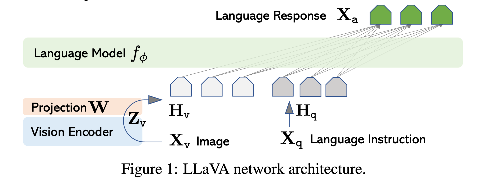

`LLaVA: Large Language and Vision Assistant 论文简析` 

<!-- more -->

> 论文链接: [https://arxiv.org/abs/2304.08485](https://arxiv.org/abs/2304.08485)
> 代码链接: [https://github.com/haotian-liu/LLaVA](https://github.com/haotian-liu/LLaVA)

## 背景

此前，大型语言模型（如 GPT-3、LLaMA）通过机器生成的指令数据进行调优，显著提升了零样本和少样本泛化能力（如 InstructGPT、FLAN-T5 等）。

> **$(选读部分)$** **InstructGPT** 是由 **OpenAI** 提出的一种通过 **人类反馈强化学习（Reinforcement Learning from Human Feedback, RLHF）** 来实现 **指令调优（Instruction Tuning）** 的方法。<br>
> 其目标是让预训练语言模型（如 GPT-3）更好地理解和执行用户给出的自然语言指令，从而提升其在各种任务上的泛化能力，尤其是零样本（zero-shot）或多任务场景下的表现。<br>
> InstructGPT 的核心思想是：**通过结合人工标注数据和强化学习，引导语言模型更好地遵循用户指令，并在多种任务上表现良好。** 它不是单纯地“记住”训练数据中的例子，而是学会根据用户指令理解任务意图并生成合适的结果。<br>
> InstructGPT 的 instruction tuning 实现主要包括以下三个关键阶段：<br>
> 步骤1：收集指令-响应对（Instruction-Following Data）
>   - OpenAI 收集了大量的人类编写的 **指令（instruction）** 和对应的 **期望输出（response）**。
>
>   - 这些指令可以是开放式的（如“写一个关于猫的故事”），也可以是特定任务（如“翻译成中文”、“总结文章”）。
>
>   - 数据来源包括：
>
>     - 用户提交给 GPT-3 的 API 请求；
>
>     - 内部标注人员手动构造的示例。
>   
>   - 目标：构建一个多样化的指令-响应数据集，用于训练或评估模型。
>
> ---
> 步骤2：训练监督模型（Supervised Policy）
>
>   - 使用标注好的指令-响应数据对模型进行微调（fine-tune）。
>
>   - 输入是一个指令，输出是模型应该生成的响应。
>
>   - 模型结构与原始 GPT-3 相同，只是参数经过调整以更好响应指令。
>
> ---  
> 步骤3：基于人类反馈的强化学习（RLHF）, 这是 InstructGPT 最具创新性的部分。具体分为三步:
>
> 1. **收集人类偏好数据**
>
>     - 对于同一个指令，让模型生成多个不同的回答；
>
>     - 让人类标注者对这些回答进行排序，选出他们认为最好的答案。
>
> 2. **训练奖励模型（Reward Model）**
>
>     - 使用上述人类偏好数据，训练一个奖励模型（Reward Model），该模型的输入是一对（指令 + 回答），输出是对这个回答的评分（score）。
> 
>     - 奖励模型的目标是模拟人类的偏好判断。
>
> 3. **使用强化学习优化策略（Policy Optimization）**
>     
>      - 使用 **PPO（Proximal Policy Optimization）** 等强化学习算法，以奖励模型为“环境”，进一步微调模型。
> 
>      - 在训练过程中，模型尝试生成尽可能高奖励的回答，从而更贴近人类期望。

`《 Visual Instruction Tuning 》` 这篇论文首次尝试使用仅支持文本输入的 GPT-4 / ChatGPT 来生成图文结合的指令响应对（instruction-following data） ，并用这些数据训练一个端到端的视觉语言模型 LLaVA。

论文核心创新点: **这是第一个系统性地将 NLP 中的指令调优思想引入多模态领域的研究**。

## 方法

作者将模型训练分为两个阶段 ：

1. 预训练阶段（Feature Alignment Pre-training）: 让视觉编码器提取的图像特征与语言模型的词嵌入空间对齐 , 也就是说：让模型理解图像和文本之间的语义关系, 这是后续指令调优的基础。

2. 微调阶段（End-to-End Fine-tuning）：在预训练的基础上，进一步训练模型理解和执行更复杂的视觉指令任务。
    
    - 多轮对话能力；
    
    - 复杂推理能力；
    
    - 科学问答等实际应用任务。

### 预训练

预训练是 LLaVA 模型训练的第一阶段，目标让视觉编码器输出的图像特征与语言模型的词向量空间对齐 ，使得后续指令调优时，模型可以更好地理解和生成图文结合的内容。

作者使用的是大规模图文对数据集 CC3M（Conceptual Captions 3M） ，包含约 300 万条图文对。

为了提升数据质量，进行了以下筛选： 名词短语过滤（Noun Phrase Filtering）

- 使用 Spacy 提取每条 caption 中的名词短语；

- 统计每个名词短语出现的频率；

- 去除频率小于 3 的短语（避免罕见组合）；

- 对于频率大于 100 的短语，只保留最多 100 条描述（防止过拟合）；

- 最终得到约 595,000 条高质量图文对 。

数据构建方式: 为了模拟用户提问和模型回答的形式，将这些图文对转换为如下格式：

```python
Human: [指令] [图像描述]
Assistant: [详细描述]
```

其中：

```python
[指令] ：如“请描述这张图片。”、“图中有什么？”
[图像描述] ：来自 caption 或 bounding box 的文本化表示；
[详细描述] ：期望的回答，通常是图像内容的全面视觉描述。
```
> Caption: 图像的文字描述，从多个角度描述图像内容 , 如: "A group of people standing outside of a black vehicle with various luggage."<br>
> Bounding Box: 标注图像中的物体及其位置 , 如: person:[0.681, 0.242, 0.774, 0.694], backpack:[0.384, 0.696, 0.485, 0.914] .

模型结构:

1. 视觉编码器 ：CLIP ViT-L/14（预训练好的）

2. 语言模型 ：Vicuna（基于 LLaMA 的指令调优版本）

3. 投影层 ：一个简单的线性层，连接视觉特征和语言嵌入空间



训练流程:

1. 输入图像 $X_{v}$: 使用 CLIP 视觉编码器提取图像特征 $Z_{v} = g(X_{v})$ 。

2. 投影层 $W$ : 将 $Z_{v}$ 转换为语言模型可用的 token 序列 $H_{v} = W · Z_{v}$ 。

3. 训练目标: 使用交叉熵损失函数，最小化语言模型输出与真实答案之间的差异 。

**仅更新投影矩阵 $W$ ，保持视觉编码器和语言模型参数冻结。这个阶段相当于在语言模型的词空间中“训练出一个能看懂图的视觉分词器”。** 

通过这个阶段训练后，模型已经具备基本的视觉理解能力，即：

1. 可以根据图像描述生成合理的文字解释；

2. 实现了图像与语言之间的初步语义对齐；

3. 为下一阶段的端到端微调提供了良好的初始化。

4. 虽然还不能执行复杂的推理任务，但已经可以处理基本的图文问答任务。

### 微调

微调过程 是 LLaVA 模型训练的第二阶段，目标是让模型在预训练的基础上进一步掌握多模态指令理解与复杂推理能力 ，具体包括：

1. 支持多轮视觉对话（Multimodal Chat）

2. 理解并回答科学类问题（如 ScienceQA 数据集）

3. 执行复杂的视觉推理任务

4. 具备跨模态交互能力（图像 + 文本）

这是实现“通用视觉助手”的关键一步。

微调阶段使用的是作者自己构建的高质量多模态指令数据集：

1. 名称：LLaVA-Instruct-158K

2. 包含约 158,000 条图文对

3. 分为三种响应类型：
    
     - 对话型（Conversation） ：58,000 条

     - 详细描述型（Detailed Description） ：23,000 条

     - 复杂推理型（Complex Reasoning） ：77,000 条

> 这些数据由 GPT-4 / ChatGPT 自动生成，涵盖多种任务类型，具有高度多样性和挑战性。

微调阶段的数据组织方式如下：

```python
Xsystem-message <STOP>
Human: X1instruct <STOP>
Assistant: X1a <STOP>
Human: X2instruct <STOP>
Assistant: X2a <STOP>
...
```

其中：

```python
Xsystem-message：系统提示语（如：“你是一个视觉助手”）；
Xinstruct：用户提问或指令；
Xa：期望的回答；
<STOP>：分隔符，表示输入结束，开始输出回答。
```

模型结构:

1. 视觉编码器 ：CLIP ViT-L/14（保持冻结）

2. 语言模型 ：Vicuna（基于 LLaMA 的指令调优版本）

3. 投影层 ：连接图像特征和语言嵌入空间的线性层

训练流程:

1. 输入图像 $X_{v}$: 使用 CLIP 提取图像特征 $Z_{v} = g(X_{v})$

2. 投影层 $W$: 使用可训练的投影矩阵 $W$ 将图像特征 $Z_{v}$ 转换为语言嵌入 $H_{v} = W · Z_{v}$

3. 训练目标: 最小化语言模型输出与真实答案之间的交叉熵损失。

> 微调时保持视觉编码器参数不变，只更新投影层 $W$ 和语言模型 Vicuna 的参数。


论文中重点测试了以下两个应用场景：

1. 多模态聊天机器人（Multimodal Chatbot）： 使用 LLaVA-Instruct-158K 数据集进行训练；

其中：

- 对话型问答为多轮对话；

- 其他两类为单轮对话；

- 数据均匀采样，训练出一个能自然理解图像内容、并进行视觉对话的 AI 助手。

2. 科学问答（Science QA）：在 ScienceQA 数据集上进行迁移学习；

- 每个问题包含文本或图像上下文；

- 助手需要生成推理过程，并从多个选项中选择正确答案；

- 在这个任务上，LLaVA 达到了 90.92% 准确率 ；

- 当与 GPT-4 联合推理时，准确率达到 92.53% ，刷新该数据集 SOTA。

### 联合 GPT-4 的推理机制（Ensemble with GPT-4）

作者还提出了一种创新方法，将 LLaVA 与 GPT-4 联合使用：

方法一：GPT-4 补充

- 当 GPT-4 无法回答时，使用 LLaVA 的预测结果；

- 效果：准确率提升不大（仅 0.05%），说明 LLaVA 已经接近其上限。

方法二：GPT-4 判断者（Judge）

- 当 LLaVA 和 GPT-4 输出不一致时，再次用 GPT-4 做判断；

- 效果：显著提升表现，最终准确率达到 92.53% ，刷新 ScienceQA 数据集的 SOTA。

这是首次尝试将大语言模型用于模型集成（model ensemble）的研究。 

## ablation study（消融实验）

论文中还进行了多项 ablation 实验，以分析不同训练策略的影响：

| 训练策略 | 准确率变化 |
| --- | --- |
| 不做预训练 | -5.11% |
| 仅使用最后一层视觉特征 | -0.96% |
| 先生成答案再推理 | -1.15% |
| 使用较小的 7B 模型 | -1.08% |

这些实验表明：

1. 预训练阶段非常关键；

2. 使用倒数第二层视觉特征更有利于细节理解；

3. 推理优先（Reasoning First）有助于加快收敛；

4. 模型规模对性能有显著影响。

## 补充

### 辨析 instruction tuning 和  prompt tuning 

**Instruction Tuning（指令调优）** 和 **Prompt Tuning（提示调优）** 是两种用于提升预训练语言模型（LLM）或视觉语言模型性能的技术，但它们的目标、方法和应用场景有显著区别。以下是两者的主要区别：


1. **定义与核心思想**

| 类别 | Instruction Tuning（指令调优） | Prompt Tuning（提示调优） |
|------|-------------------------------|--------------------------|
| **定义** | 通过大量“指令-响应”对微调模型，使其更好地理解和执行用户给出的自然语言指令。 | 在输入中添加可学习的前缀（prefix）或前缀/后缀（prompt），引导模型生成特定任务的结果，而不需要改变整个模型参数。 |
| **核心思想** | 模型要理解并遵循人类语言中的任务描述（如“总结一下这篇文章”）。 | 模型通过在输入前后插入一些可训练的提示词来“唤醒”其已有的知识，完成特定任务。 |

2. **训练方式**

| 类别 | Instruction Tuning | Prompt Tuning |
|------|--------------------|---------------|
| **是否修改模型结构** | 否（通常保留原始结构） | 否 |
| **是否更新全部参数** | 是（微调整个模型参数） | 否（仅更新插入的 prompt 参数，其余参数冻结） |
| **数据需求** | 需要大量人工或机器生成的“指令-响应”对 | 不需要额外标注数据，直接使用原始任务描述 |
| **训练目标** | 提升模型在各种任务上的泛化能力，尤其是零样本/少样本任务迁移 | 让固定模型适应新任务，利用已有知识进行推理 |

3. **应用场景举例**

| 类别 | 示例场景 |
|------|----------|
| **Instruction Tuning** | ChatGPT、InstructGPT、FLAN-T5、LLaVA（视觉+语言）等，能根据用户指令回答问题、写故事、编程、推理等。 |
| **Prompt Tuning** | 使用 `[PROMPT]` 前缀让 BERT 回答 QA 问题、分类任务；在图像识别中加入 learnable prefix 来适配不同类别。 |

4. **优缺点对比:**

| 对比维度 | Instruction Tuning | Prompt Tuning |
|----------|--------------------|----------------|
| **优点** | - 更强的任务泛化能力<br>- 更贴近真实用户交互<br>- 可用于多模态任务 | - 参数效率高（只训练少量 prompt）<br>- 可复用已有大模型权重 |
| **缺点** | - 数据依赖性强（需要大量高质量指令数据）<br>- 微调成本高（需训练整个模型） | - 表达能力受限于 prompt 的设计<br>- 泛化性不如 instruction tuning |

总结一句话： **Instruction Tuning 是教会模型“听懂人话”，按指令做事；Prompt Tuning 是引导模型“激活已有知识”，通过提示词让它自己做任务。**


