`Momentum Contrast for Unsupervised Visual Representation Learning 论文简析` 

<!-- more -->

> 论文链接: [Momentum Contrast for Unsupervised Visual Representation Learning](https://arxiv.org/abs/1911.05722)
> 代码链接: [https://github.com/facebookresearch/moco](https://github.com/facebookresearch/moco)

## Introduction

对比学习从2019年开始到现在一直都比较火，**Moco是视觉领域使用对比学习一个里程碑的工作**。

**Moco作为一个无监督的表征学习工作，不仅在分类任务上逼近了有监督的基线模型，在其他任务，如检测、分割、人体关键点检测上都超越了有监督的预训练模型，也就是ImageNet上的预训练模型**；

**Moco证明了一点，无监督学习真的可行，我们并不需要大量标注好的数据**；

## What is contrast learning?

首先说对比学习想要做到什么呢？我们现在有三张图，第一张图是人高兴，第二张图片是人悲伤，第三张图片是狗。

我们想得到一个结果，就是我们不需要知道前两张图片是人这个类别，不需要知道第三张图片是狗这个类别。但是我们需要知道前两张图片是一个类别，第三张图片不是一个类别。

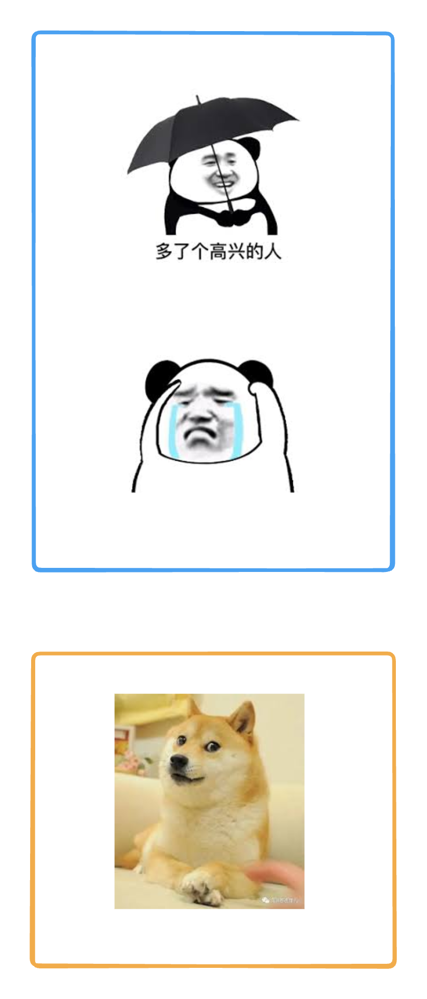

换句话说，我们现在把这三张图片输入一个模型，得到三个表征，我们需要让这三个表征在特征空间中，前两张图片的表征距离比较近，第三张图片和它们的距离比较远。

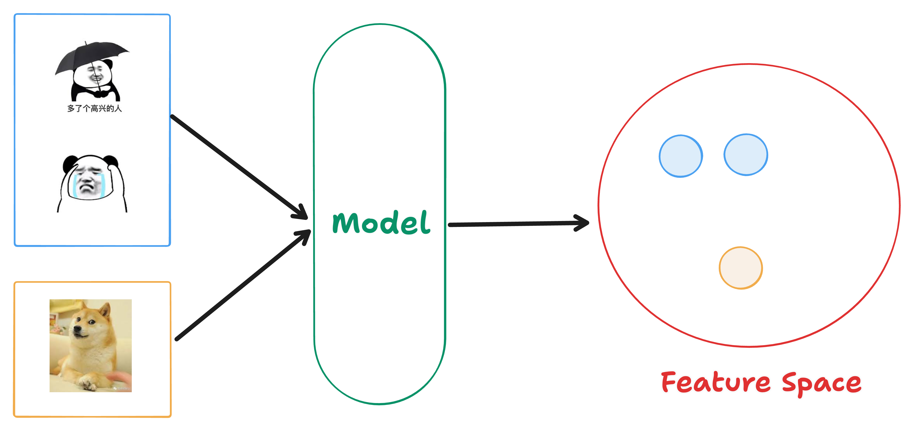

一句话说，**我们希望在特征空间里，同一个类别的物体处于相邻的区域，不同类别的物体处于不相邻的区域**。

在这个过程中，我们需要知道的是，我们并没有用到标签信息，我们不需要知道第一张和第二张图片是人，第三张是狗。

但是我们用到了另外一种信息，就是第一张图片和第二张图片是同一个类别，第三张图片不是同一个类别的信息。这其实也是一种标签信息。

不过这种标签信息，我们可以使用一些代理任务，巧妙构造出来，而不需要人为地去标注这种标签信息。这些代理任务，会去定义一些规则，这些规则可以去定义哪些图片是相似的，哪些图片是不相似的，从而可以提供一些监督信号给到模型去训练。**这个过程其实也是自监督训练的一个过程**。

## instance discrimination task

**一个最经典的代理任务就是：instance discrimination，叫做个体判别**。

这个代理任务是指，如果我们有一个没有标注的数据集，里面有n个图片。

从这个数据集中，我们随机选择一个图片 $x_{i}$，对这个图片做随机裁剪（或者其他的数据增广操作，我们称之为transformation），从而得到另外两张图；

一个是 $x_{i1}$ 一个是 $x_{i2}$，这样我们会得到两个不太一样的照片。但是由于这两张图片是从同一个图片经过某种变化得到的，语义信息不应该发生变化。所以这两张图片就可以称之为正样本，也就是同一个类别的图片。

这个代理任务，同时认为，这个数据集中剩余的所有图片都是负样本。

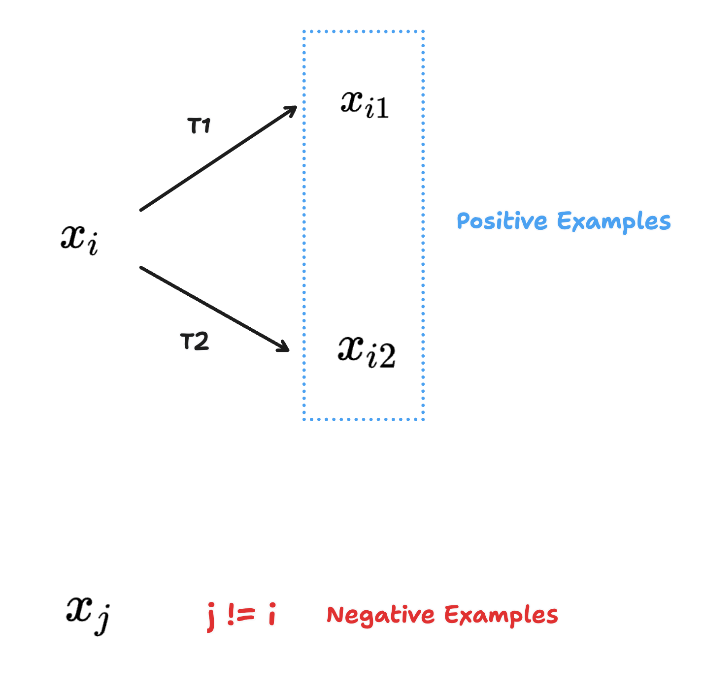

为什么叫做个体判别呢？因为它认为每个图片自成一个类别，剩余的图片都不是同一个类别。

> 这个粒度其实是很细，你在图片分类的时候很多照片是同一个类别，其余的照片又分为了很多类别，所以个体判别这个代理任务经过模型训练，**表征会很细**。

对于ImageNet这个数据集来说，如果是个体判别任务，不是一千个类别，而是100多万个类别。

所以个体判别这个代理任务定义了什么是正样本，什么是负样本，接下来就很简单了，我们只需要经过模型，然后使用一个对比学习的函数去训练模型就可以了，比如说NCEloss。

在这个过程中，其实有一个很有意思的点，就是代理任务是多样性的，是很灵活的。**只要你能够得到一个判断正样本和负样本的规律，后续的损失函数之类的训练就很常规了**。

比如说在视频领域，同一个视频里的任意两帧是正样本，其他视频里的帧是负样本；

## Momentum Contrast

**Moco 这个名字就是来源于前两个单词的前两个字母，即基于动量的对比学习**。

动量是一种加权移动平均:

$$
Y_{t} =  m * Y_{t-1} + (1 - m) * X_{t}
$$

$y_{t-1}$ 是上一个时刻的输出，$m$ 是动量超参数，$x_{t}$ 是当前时刻的输入。

说白了，就是不想让当前时刻的输出只是依赖于当前时刻的输入，还希望和之前时刻的输出有关系。**动量这个超参数是 $0-1$ 的一个参数；如果 $m$ 趋近于 $1$，那么 $y_{t}$ 的改变会非常缓慢，因为 $1-m$ 趋近于零**。

**Moco 就是利用这个动量的特性，去缓慢地更新编码器，从而让中间学习到的字典特征尽可能保持一致**（这句话没看懂没关系，一会详细讲）。

## Abstract

**Moco** 把对比学习看成了是一个字典查询的过程，构建了一个动态的字典。这个动态的字典分为两个部分：第一部分是一个队列，第二部分是一个移动平均的编码器。

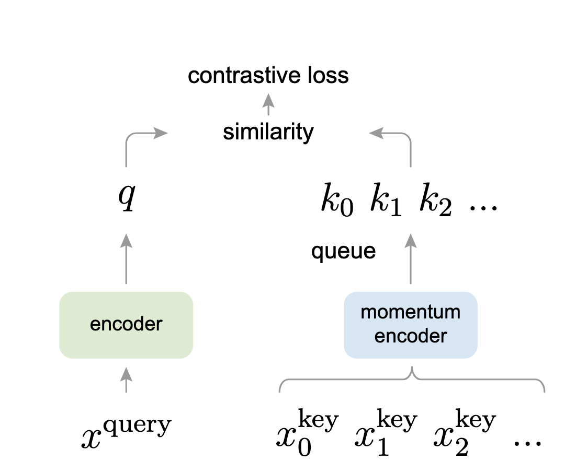

队列里的样本不需要进行梯度回传，因此我们可以往队列里放入很多负样本，从而让字典的规模变得很大。

为什么还要使用一个移动平均的编码器呢？这是为了让字典里的特征尽可能保持一致。

**在训练过程中发现，拥有一个规模大且特征较为一致的字典，能让无监督的对比学习取得很好的效果**。

从实验结果来看，在 **ImageNet** 数据集上，如果采用 **线性评估（Linear Probing）** 进行测试，**Moco** 可以取得和之前最优的无监督方法相近甚至更好的结果。

> 线性评估指的是，先预训练好一个骨干模型，然后将这个骨干网络参数冻结，只训练最后的全连接层，再查看在不同数据集上的表现结果。这样做其实类似于把骨干网络当成一个特征提取器，仅从其中提取特征，这和使用 **ResNet** 作为特征提取器的方式差不多。

**Moco 一个很大的优势在于，学习到的特征在下游任务上具有很好的迁移性**。我们看重无监督学习的优点，就是它可以从大量未标注的数据上学习到特征，并迁移到标注数据较少的任务上。

**Moco 在 7 个下游任务（如分割、检测等）上超越了之前的有监督预训练模型**。

## Introduction

**GPT和BERT，已经证明无监督学习在NLP任务上是行得通的**。但是在CV领域，有监督预训练还是占据主导地位；

之前也有很多优秀的无监督工作，但是表现都会比**有**监督要差，作者认为这是因为CV领域和NLP领域的原始信号空间不同。

对于**NLP领域**来说，它们是离散的信号，也就是原始的信号空间是由单词组成，或者更细一点，是由单词词缀组成的，所以我们可以很**容易**地去建立一个字典，然后让模型去学习特征。那么字典中的每个key就是一个类别，我们可以根据这个类别去学习模型（比如BERT最后进行的softmax操作，不就是分类操作吗）

但是对于CV领域来讲，情况完全不一样。**CV领域的信号是在一个连续而且高维的空间，它并不像单词那样有很强的语义信息，也没有浓缩得那么简洁**；所以CV领域并不适合去建立一个字典来学习模型；如果没有这个字典，无监督就很难去建模。因此，在CV领域，无监督学习的表现往往不如有监督学习。

**在之前有很多优秀的对比学习工作，都可以归纳为一种字典查询的工作**。

我们接着来看图：

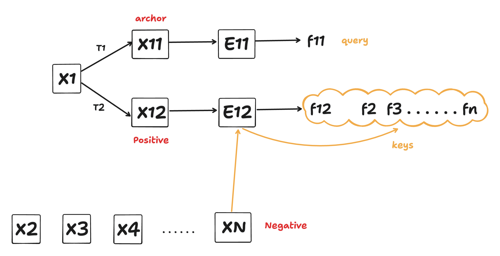

两个编码器，一个是E11，一个是E12；然后我们将图片x1经过数据增强T1得到图片X11，再经过E11这个编码器，得到图片表征f11；同理，图片x1经过数据增强T2得到图片x12，然后经过E12这个编码器，得到表征f12。

我们把X11这个图片叫做 **anchor（锚点）**，x12叫做x11的正样本。

什么是负样本呢？就是数据集中剩余的所有图片都是负样本。那么负样本走哪个编码器呢？走的是E12这个编码器，因为正样本和负样本都是相对于锚点来说的，所以正样本和负样本要走同一个编码器，从而让特征的获取过程保持一致性。于是，负样本x2、x3、x4等等也经过E12得到了真正的负样本表征f2、f3、fn。

我们把f11叫做 **query**，把f12、f2、f3、fn叫做 **key**。

**对比学习的过程就是想要在特征空间里，让正样本的key和query距离近，其余的key离query远**。

我们其实可以把key集合看成字典。那么对比学习的过程，就是想得到一个模型，让query在字典中与自己匹配的正样本更近。

如果把对比学习的过程看成一个动态字典的过程，若想要得到比较好的效果，那么字典最好需要满足两个条件：**第一个是字典足够大，第二个是在训练的时候尽量保持一致性**。

首先，我们在做对比学习的时候，是一个batch一个batch地去做，所以如果key这个字典足够大，那么从中抽样的可能性组合就很多，模型的泛化性就很强。如果字典很小，泛化性就不足，相当于数据量不够。

其次，保持一致性是因为我们需要字典中的特征尽可能使用同一个或者相近的编码器进行表征。因为如果不这样做，模型可能就只会学习到和query使用同样编码器的那个key，导致模型泛化性不足，走了捷径。

**所以Moco要做的就是：在对比学习框架中，提供一个又大又一致的字典**；框架图如下：


**大字典是怎么做到的**：维护一个队列，把每次训练的 `batch-size` 和队列大小分离开；具体来说就是这个队列可以很大，但是我们每次更新这个队列，是一点点地更新的，也就是说当我们用一个很小的 `batchsize` 时，把当前 `batch` 中的特征加入队列，将最老的 `batch-size` 的特征从队列中抽离；这样我们的队列就可以设置得很大，比如几万。**通过这种方式，使用一个 GPU 也可以很好地训练模型**。

**那么一致性是如何做到的**？刚才说了，每次都是使用新的编码器更新 `batch` 大小的队列特征，除此之外的特征都是使用之前的编码器得到的，这样不就不一致了吗？这时使用动量更新即可。我们最开始右边分支的编码器是由左边初始化而来，后续更新时对右边这个编码器的参数进行动量更新，**让 `m` 足够大，确保右边编码器更新得非常缓慢**，从公式来说，就是这个图：

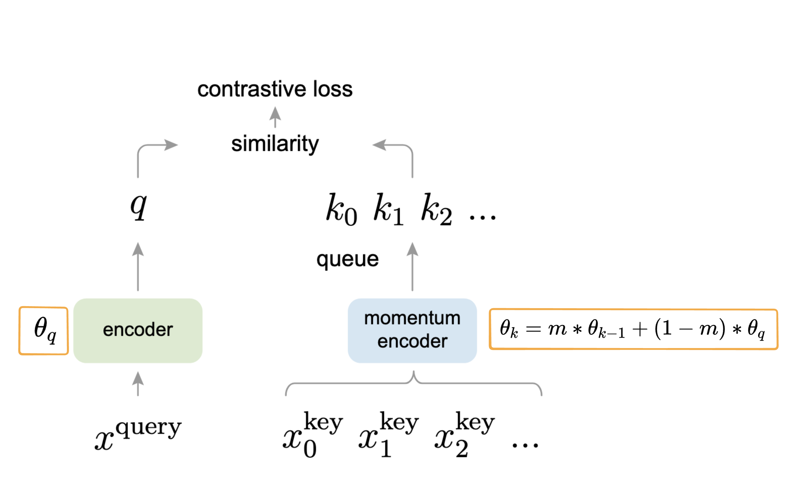

可以看到，右边编码器会被之前的 $k$ 编码，和当前时刻的 $q$ 编码影响。**当 $m$ 足够大，无限接近于 $1$ 时，就可以认为其无限被 $k$ 控制，更新会非常缓慢**。

**Moco 只是建立中间模型的一种方式，它非常灵活，可以和很多代理任务结合**，这里使用的是之前讲过的个体判别任务。

**无监督学习最大的一个卖点，就是我们的模型在大量无标注的数据集上进行训练之后，得到的特征可以很好地迁移到下游任务中（比如标注数据很少的任务）**。

## Conclusion

**Moco** 论文在 **ImageNet** 数据集上取得了很好的结果，在 Facebook 自家的数据集上同样效果良好，但提升幅度不大。当数据集规模从 100 万增长到 10 亿时，提升依然不明显。作者认为大规模数据没有被充分利用，可能采用一个更好的代理任务会取得更好的效果。所以作者提出，除了个体判别这个任务外，有没有可能将 **MoCo** 和 **mask encoded** 任务结合起来，也就是类似 **BERT** 的操作，使用 **MLM（Masked Language Modeling）** 自监督的方式进行学习。（这不就是 **MAE** 模型吗）

开头提到过 CV 和 NLP 的信号空间不一致，直接照搬 BERT 的方法可能行不通，具体可参考 **MAE** 模型。

## Related Work

一般来说，自监督学习的方法可以从两个方面来进行优化或创新：

1. **在损失函数上做文章**：设计或改进对比损失函数，使得模型能够更有效地学习到有判别性的表示。

2. **在代理任务上做文章**：通过设计合理的预训练任务（如图像重建、上下文预测等）引导模型学习有用的特征。

> 💡 注解：自监督学习其实是一种特殊形式的无监督学习，通过人为构造“标签”来训练模型。

损失函数:

* **NCE（Noise Contrastive Estimation）损失函数**：

  * 最初用于语言模型（如word2vec）中，它的基本思想是把一个“超级大的多分类问题”（即从大量候选中选出正确样本）转化为一系列“二分类问题”（即判断某个样本是否是正样本）。
  
  * 因为直接在超大类别空间上做 softmax 计算代价太高，所以 NCE 提供了一种更可行的替代方法。
  
  * 类似于 word2vec 中的 negative sampling 技术。

* **InfoNCE**：

  * 是 NCE 的一种改进或变体，被广泛应用于对比学习中（如MoCo、SimCLR）。
  
  * 它的目标是在一个由一个正样本和多个负样本构成的集合中，最大化正样本的得分，使得模型能够区分正负样本对。

---

温度系数（temperature hyperparameter）：

在 InfoNCE 的 softmax 函数中，通常会加入一个 **温度超参数 $\tau$**，用于调节 logits（相似度）的“尖锐程度”：

* $\tau$ 越小，softmax 越尖锐，模型对正负样本差异更加敏感；

* $\tau$ 越大，softmax 趋于平滑，训练更稳定但区分度下降。

在看 **InfoNCE** 的损失函数的时候，首先从 **softmax** 看起，这个是softmax的公式:

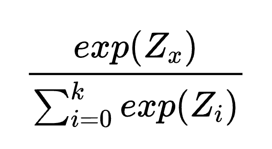


然后我们加一个 $-log$ 就是 **交叉熵损失函数**：

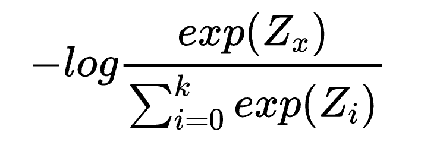

这个公式其实可以直接用在对比学习中。

什么意思呢？ 交叉熵是一个多分类问题的损失函数，一个one-hot向量，和我真实输出做一个损失，目标是为了让真正标签的输出尽可能的大。

那么有一个问题，如果把这个损失函数，直接套到对比学习中去，那么是什么意义呢？

比如 **ImageNet** 100万个图片，那么我当前图片经过数据增强之后，经过编码器1得到了 **锚点特征**，经过编码器2得到了正样本，也就是我的 **ground-truth**；

那么除了我当前这个图片外，其余100万 - 1个图片经过编码器2得到的表征都是负样本，也就是会得到这样一个向量：

```bash
1 0 0 0 （1个1 ,  100万 - 1个0）
```

在这个向量上做交叉熵，其实就可以用在对比学习上。

但是这样做 **softmax** 计算量太大了，像 **BERT** 这种模型，也就几万个类别，处理起来没啥问题，几百万个类别就太难了。

这个时候 **NCE（Noise Contrastive Estimation）** 就是一种很好的解决方式，将问题转化为一个二分类问题，也就是现在只有两个类别，一个是正常样本，除此之外的都是噪声样本。

但是这样做的逻辑不太清晰，所以 **InfoNCE** 就应运而生了。

与其在整个数据集上计算损失，不如抽样一部分数据来计算损失。如果选取的抽样部分过少，就没什么意义，无法模拟整个数据集，所以抽样的部分还是要大一点。此时，**字典的大小就很重要**，也就是字典的大小就是分母下方的类别数量；在这个过程中，**InfoNCE** 把 **NCE** 的一系列二分类问题又转为了多分类问题。

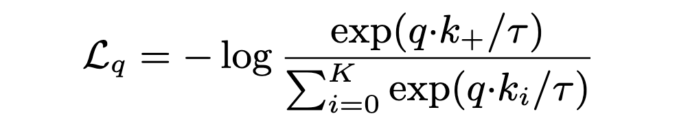

**$q$** 就是我们的 **query** 表征，也就是 **锚点** 那个图片的特征，**$k^+$** 就是正样本，分母累加那里的 **$K$**，就是我们的负样本数量，分类累加了 **$K + 1$** 项，因为有 $K$ 个负样本和一个正样本。

温度参数 **$\tau$**（希腊字母读音为 "tao"），在蒸馏相关内容里其实提到过，如果 **$\tau$** 很大，那么 softmax 分布会很平滑，看不出区别，就是把所有的负样本一视同仁，导致模型学习没有轻重；如果 **$\tau$** 很小，分布会更尖锐，会让模型只关注那个困难的负样本，其实那些负样本很有可能是潜在的正样本，如果模型过度关注这个困难的负样本，会导致模型很难收敛，或者 **学习** 到的特征不太好泛化。

去除这个温度超参数，**InfoNCE** 本质就是一个交叉熵损失函数，只不过类别和所有样本相比，做了个近似，进行了一次随机抽样，抽样数量就是字典大小。**Moco** 伪代码里的 **InfoNCE** 直接使用的就是交叉熵损失函数代码。

### Detail

有个细节，为什么使用队列这种数据结构存储字典呢？

因为先进先出，每次一个 `batch` 进来，最老的那个部分 `batch` 数据会出去，这部分数据是过时的，从而能够保持队列中的特征尽可能的 **一致性**。

另一个细节：

第二个分支不能随着走这一支的样本使用梯度回传进行更新，为什么呢？因为如果这样做了，第二个分支的编码器就更新得太快了，这些特征，我们是放到字典中去的，就会导致特征 **不一致**。

为什么第二个分支不直接不更新，而是采用缓慢更新呢？（我自己理解，如果第二个分支一直不变，由于正样本的定义规则是经过编码器之后所在的语义空间才为正样本。在模型训练时可能会出现问题，因为到后来第一个分支和第二个分支编码器差距越来越大，原本是正样本的，损失也会很大，导致模型很难训练。）

**两个贡献**：

- **一个是构建很大的字典**：计算损失的时候使用多分类，能够很近似在整个数据集上做的多分类损失。

- **一个是保证字典内特征一致性**，使用动量更新。

需要注意的一点：就是 **InfoNCE** 损失计算的是整个字典做多分类。`minibatch` 大小和字典大小剥离开，`batch` 可以设置为 256，然后进来 256 个样本，每个样本都需要做一个 **锚点**，走一遍对比学习的流程。

动量设置为了 0.99，这个值 **很大** 了。字典大小是 65536。

在 Moco 之前的工作中， 字典大小和字典特征一致性经常不能同时满足。

### Preview Work

**端到端的框架**：

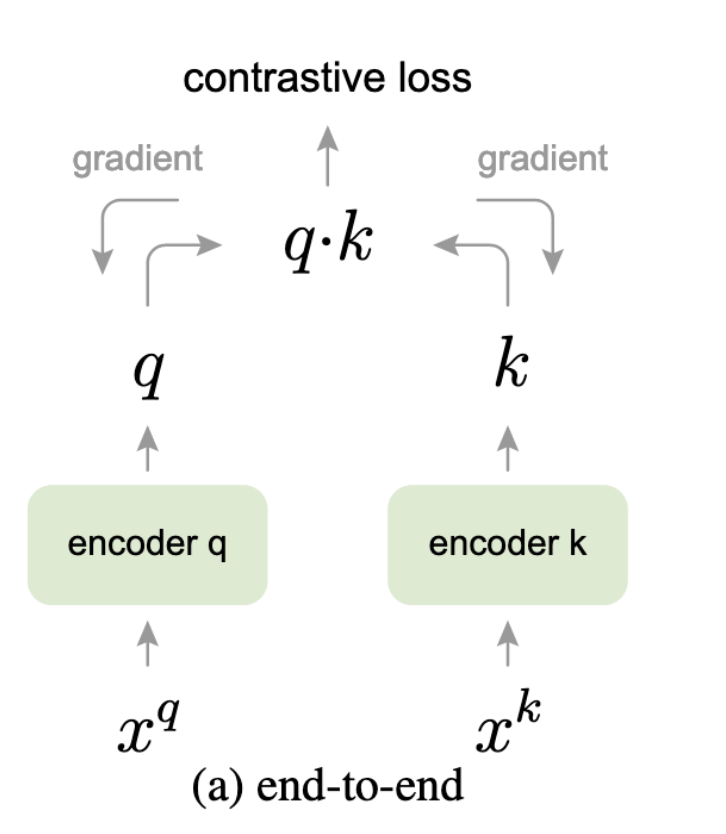

**端到端的框架** 就是两个编码器都可以通过梯度回传进行更新，因为 $x_{q}$ 和 $x_{k}$ 都是从同一个 batch 中来的，我们通过一次 forward 就可以拿到所有样本的特征，我们直接梯度回传就可以了。这要求 **batch 大小要足够的大**，那么 **InfoNCE** 才能起作用，做到一个近似的全部数据集的多分类。**SIMCLR** 就是这个端到端的框架。这样字典是高度一致的。在这种情况下，batch 大小和字典大小是等价的。**SIMCLR** 就是用了 8192 作为 batch 大小。

另一流派，更关注 **字典的大**，然后牺牲一些一致性，就是 **memory bank**；在这个流派只有一个编码器，就是 query 的编码器，可以进行梯度回传进行更新。对于 key 这边，是没有一个单独的编码器。

**memory bank** 就是把整个数据集的特征，都存到了一起。对于 **ImageNet** 来说，这里就是 128 万个特征（作者说到，每个特征 128 维度，只需要 600M 的空间，还好。）

然后每次训练的时候，从 **memory bank** 中随机抽样字典大小就可以了。右边的编码是在线下执行。

在执行的时候，比如字典大小是 3，那么抽出三个来，左边做一次梯度回传之后，我们把字典中的 3 个用新的编码器做一个编码，放回到 **memory bank** 中去。

（首先，我认为为了保持正样本的定义，肯定得更新样本特征）

因为你这个更新操作，导致字典内编码特征不一致。

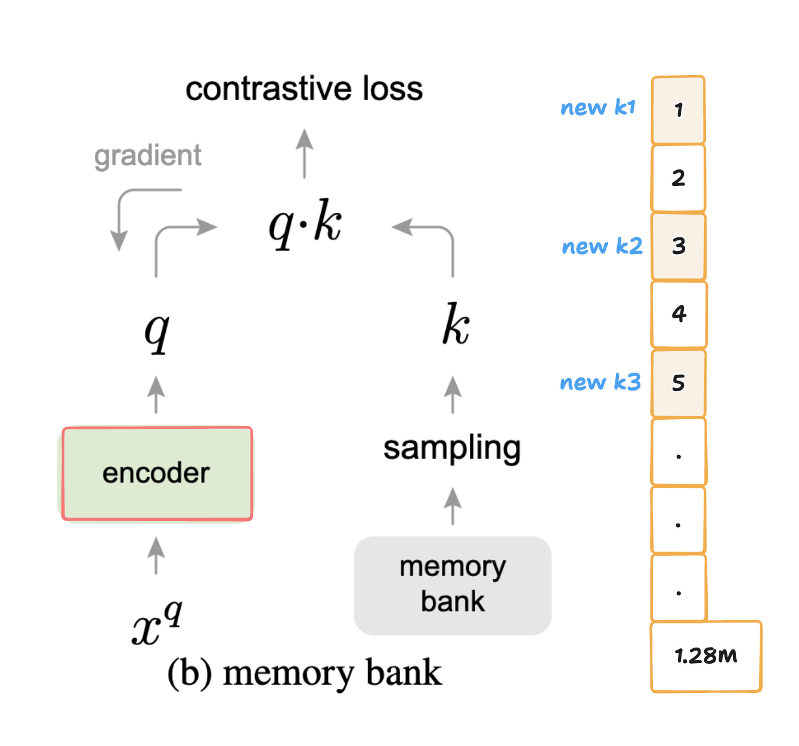

## Code Implementation

### Train Code

MoCo 训练代码如下所示:

```python
def main_worker(args):
    # 1. init MoCo Model
    model = deeplearning.cross_image_ssl.moco.builder.MoCo(
        models.__dict__[args.arch],
        args.moco_dim, 
        args.moco_k,
        args.moco_m,
        args.moco_t,
        args.mlp,
    )

    # 2. define loss function (criterion) and optimizer
    criterion = nn.CrossEntropyLoss().cuda(args.gpu)

    optimizer = torch.optim.SGD(
        model.parameters(),
        args.lr,
        momentum=args.momentum,
        weight_decay=args.weight_decay,
    )

    # 3. Data loading code
    normalize = transforms.Normalize(
        mean=[0.485, 0.456, 0.406], std=[0.229, 0.224, 0.225]
    )

    augmentation = [
            transforms.RandomResizedCrop(224, scale=(0.2, 1.0)),
            transforms.RandomGrayscale(p=0.2),
            transforms.ColorJitter(0.4, 0.4, 0.4, 0.4),
            transforms.RandomHorizontalFlip(),
            transforms.ToTensor(),
            normalize,
    ]

    train_dataset = datasets.ImageFolder(
        traindir,
        deeplearning.cross_image_ssl.moco.loader.TwoCropsTransform(
            transforms.Compose(augmentation)
        ),
    )

    train_loader = torch.utils.data.DataLoader(
        train_dataset,
        batch_size=args.batch_size,
        shuffle=(train_sampler is None),
        num_workers=args.workers,
        pin_memory=True,
        sampler=train_sampler,
        drop_last=True,
    )

    for epoch in range(args.start_epoch, args.epochs):
        # 4. train for one epoch
        train(train_loader, model, criterion, optimizer, epoch, args)
```
这里的重点是 `TwoCropsTransform` 这个增强方法，它的作用是对一个样本进行两次增强，得到两个样本。

```python
class TwoCropsTransform:
    """Take two random crops of one image as the query and key."""

    def __init__(self, base_transform) -> None:
        self.base_transform = base_transform

    def __call__(self, x):
        q = self.base_transform(x)
        k = self.base_transform(x)
        return [q, k]
```
此时 `train_loader` 返回的每个 `batch` 维度为: `[2, batch_size, C, H, W]` , 其中 `batch[0]` 代表 `query` , `batch[1]` 代表 `positive key`。

```python
def train(train_loader, model, criterion, optimizer, epoch, args) -> None:
    for i, (images, _) in enumerate(train_loader):
        # 1. compute output
        output, target = model(im_q=images[0], im_k=images[1])
        loss = criterion(output, target)

        # 2. compute gradient and do SGD step
        optimizer.zero_grad()
        loss.backward()
        optimizer.step()
```
### Model Implementation

#### Model Init

模型初始化代码如下所示:

```python
class MoCo(nn.Module):

    def __init__(
        self,
        base_encoder, # ResNet 模型
        dim: int = 128,
        K: int = 65536, # 队列大小/字典大小/负样本数量
        m: float = 0.999, # 动量更新参数
        T: float = 0.07, # 温度参数
        mlp: bool = False,
    ) -> None:
        """
        dim: feature dimension (default: 128)
        K: queue size; number of negative keys (default: 65536)
        m: moco momentum of updating key encoder (default: 0.999)
        T: softmax temperature (default: 0.07)
        """
        super(MoCo, self).__init__()

        self.K = K
        self.m = m
        self.T = T

        # 1. create the encoders: num_classes is the output fc dimension
        self.encoder_q = base_encoder(num_classes=dim)
        self.encoder_k = base_encoder(num_classes=dim)
        
        # 2. key encoder参数使用query encoder进行初始化，同时key encoder不参与梯度运算
        for param_q, param_k in zip(
            self.encoder_q.parameters(), self.encoder_k.parameters()
        ):
            param_k.data.copy_(param_q.data)  # initialize
            param_k.requires_grad = False  # not update by gradient

        # 3. create the queue/dictionary and pointer
        self.register_buffer("queue", torch.randn(dim, K))
        self.queue = nn.functional.normalize(self.queue, dim=0)
         
        self.register_buffer("queue_ptr", torch.zeros(1, dtype=torch.long)) # 队列指针，负责完成出队入队的信息记录
```
####  Model Forward

模型前向传播代码如下所示:
```python
    def forward(self, im_q, im_k):
        """
        Input:
            im_q: a batch of query images
            im_k: a batch of key images
        Output:
            logits, targets
        """

        # 1. compute query features
        q = self.encoder_q(im_q)  # queries: NxC
        q = nn.functional.normalize(q, dim=1)

        # 2. compute key features
        with torch.no_grad():  # no gradient to keys
            self._momentum_update_key_encoder()  # update the key encoder

            # shuffle for making use of BN
            im_k, idx_unshuffle = self._batch_shuffle_ddp(im_k)

            k = self.encoder_k(im_k)  # keys: NxC
            k = nn.functional.normalize(k, dim=1)

            # undo shuffle
            k = self._batch_unshuffle_ddp(k, idx_unshuffle)

        # 3. compute logits
        # Einstein sum is more intuitive
        # positive logits: Nx1
        l_pos = torch.einsum("nc,nc->n", [q, k]).unsqueeze(-1)
        # negative logits: NxK
        l_neg = torch.einsum("nc,ck->nk", [q, self.queue.clone().detach()])

        # 4. logits: Nx(1+K)
        logits = torch.cat([l_pos, l_neg], dim=1)

        # 5. apply temperature
        logits /= self.T

        # 6. labels: positive key indicators
        labels = torch.zeros(logits.shape[0], dtype=torch.long).cuda()

        # 7. dequeue and enqueue
        self._dequeue_and_enqueue(k)

        return logits, labels
```
论文采用 `ResNet` 作为编码器，其最后的全连接层（在全局平均池化之后）输出一个固定维度的向量（128 维）。这个输出向量会通过其 L2 范数进行归一化。该向量即表示一个 `query`（查询向量） 或 `key`（键向量） 的特征表示。

#### Momentum Update

采用动量更新方式对 `key encoder` 进行缓慢更新的代码实现如下所示:

```python
    @torch.no_grad()
    def _momentum_update_key_encoder(self) -> None:
        """
        Momentum update of the key encoder
        """
        for param_q, param_k in zip(
            self.encoder_q.parameters(), self.encoder_k.parameters()
        ):
            param_k.data = param_k.data * self.m + param_q.data * (1.0 - self.m)
```
#### Dequeue and Enqueue

维护队列状态的代码实现如下所示：

```python
    @torch.no_grad()
    def _dequeue_and_enqueue(self, keys) -> None:
        # 1. gather keys before updating queue
        keys = concat_all_gather(keys) # 如果你在多 GPU 上训练，每个 GPU 都会处理一部分 batch，该方法会将所有 GPU 上的 key 向量合并成一个完整的 batch

        batch_size = keys.shape[0]
         
        ptr = int(self.queue_ptr)
        assert self.K % batch_size == 0  # for simplicity

        # 2. replace the keys at ptr (dequeue and enqueue)
        self.queue[:, ptr : ptr + batch_size] = keys.T # queue 的形状是 (C, K)，每列是一个 key 向量（transpose 存储是为了快速矩阵乘）
        ptr = (ptr + batch_size) % self.K  # move pointer

        self.queue_ptr[0] = ptr
```