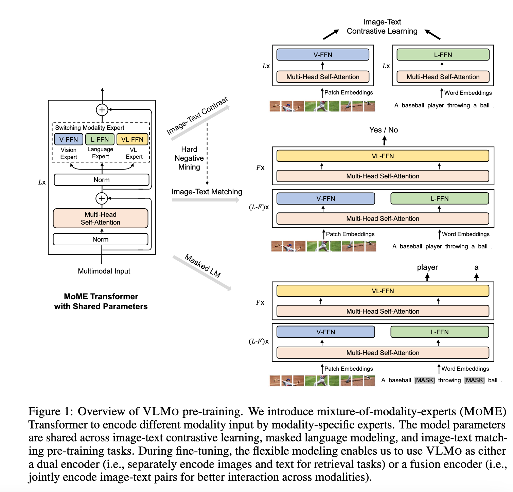
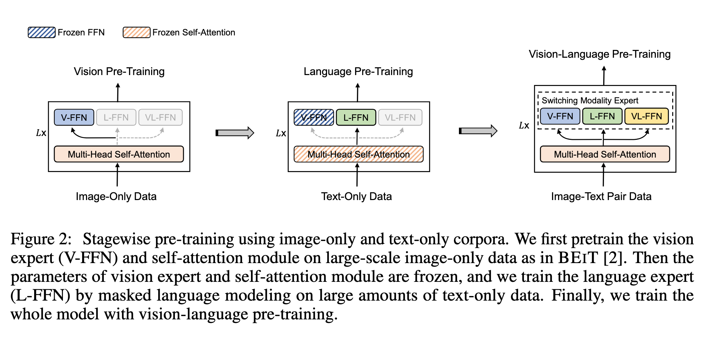
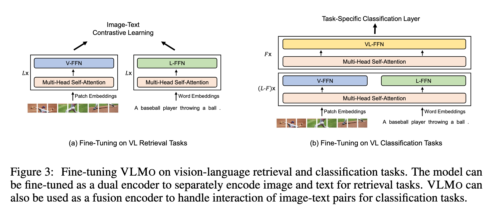

`VLMO: Unified Vision-Language Pre-Training with Mixture-of-Modality-Experts 论文简析` 

<!-- more -->

> 论文链接: [VLMO: Unified Vision-Language Pre-Training with Mixture-of-Modality-Experts](https://arxiv.org/abs/2111.02358)
> 代码链接: [https://github.com/microsoft/unilm/tree/master/vlmo](https://github.com/microsoft/unilm/tree/master/vlmo)

## Introduction

视觉-语言（VL）预训练旨在从大规模图文对中学习通用的跨模态表示。现有模型通常通过图文匹配、图文对比学习、掩码区域分类/特征回归、词-区域/块对齐以及掩码语言建模等方法来聚合和对齐视觉与语言信息，然后在下游任务如图文检索、视觉问答（VQA）、视觉推理等进行微调。

现有两类主流架构各有优缺点：

**双编码器架构**（Dual-Encoder，如 CLIP、ALIGN）：

* 图像和文本分别编码，模态间交互通过特征向量的余弦相似度进行。

* 优点：检索任务高效，特征向量可提前计算存储，线性复杂度。

* 缺点：交互浅，对复杂视觉-语言分类任务表现有限，如 CLIP 在视觉推理任务上准确率偏低。

**融合编码器架构**（Fusion-Encoder）：

* 使用多层 Transformer 通过跨模态注意力融合图像和文本表示。

* 优点：在视觉-语言分类任务上性能优异。

* 缺点：检索任务需对所有图文对联合编码，时间复杂度为二次方，推理速度慢。

---

**VLMO 的提出**

为兼顾双编码器和融合编码器的优势，论文提出了 **统一视觉-语言预训练模型 VLMO**，其特点如下：

* 可作为双编码器用于图文检索，也可作为融合编码器处理图文对分类任务。

* 核心组件为 **Mixture-of-Modality-Experts (MOME) Transformer**，一个 Transformer 块内可编码图像、文本及图文对。

* MOME 替换标准 Transformer 的前馈网络为模态专家池，捕获模态特定信息，同时共享自注意力层进行跨模态对齐。

* 三类模态专家：视觉专家（图像编码）、语言专家（文本编码）、视觉-语言专家（图文融合）。

* 模型灵活性高，可复用共享参数实现文本编码器、图像编码器和图文融合编码器。

---

**预训练任务与策略**

VLMO 采用三种联合预训练任务：

* 图文对比学习（image-text contrastive learning）

* 图文匹配（image-text matching）

* 掩码语言建模（masked language modeling）

同时提出 **分阶段预训练策略**，充分利用大规模图像单模态和文本单模态数据：

1. 在图像单模态数据上预训练视觉专家和自注意力模块，采用 BEIT 的掩码图像建模方法。

2. 在文本单模态数据上预训练语言专家，采用掩码语言建模方法。

3. 最终初始化视觉-语言预训练模型，解决图文对数量有限、描述短小的问题，从而学习更泛化的表示。

---

**实验结果与贡献**

* 在图文检索任务中，VLMO 作为双编码器比融合编码器更快，并且性能优于其他融合编码器模型。

* 在视觉问答（VQA）和自然语言视觉推理（NLVR2）任务中，作为融合编码器的 VLMO 达到最先进性能。

**主要贡献**：

* 提出统一视觉-语言预训练模型 VLMO，可灵活用作融合编码器或双编码器。

* 引入通用多模态 Transformer（MOME Transformer），通过模态专家捕获模态特定信息，并通过共享自注意力实现跨模态对齐。

* 分阶段预训练策略利用大规模图像单模态和文本单模态数据，显著提升模型性能。

## Related Work

视觉-语言预训练方法大体可分为两类：

**双编码器（Dual Encoder）**（如 CLIP \[35], ALIGN \[18]）：

* 图像和文本分别编码，模态间交互通过余弦相似度或线性投影实现。

* 通常使用图文对比学习优化模型。

* 优点：对检索任务效果好，图像和文本特征可预计算。

* 缺点：交互浅，不适合处理需要复杂推理的 VL 分类任务，如视觉问答或视觉推理。

**融合编码器（Fusion Encoder）**（如 ALBEF \[23], ViLT \[20], Pixel-BERT \[16]）：

* 使用深度融合编码器，通过跨模态注意力建模图像和文本的交互。

* 训练任务包括图文匹配、掩码语言建模、词-区域/块对齐、掩码区域分类和特征回归。

* 优点：在分类任务上性能更好，可捕获深层交互。

* 缺点：对所有图文对进行联合编码，推理速度慢；依赖目标检测器（如 Faster R-CNN \[37]）获取区域特征时可扩展性差。

* 改进方法：Pixel-BERT 去掉目标检测器，使用卷积网络提取网格特征；ALBEF 使用图像 Transformer 和文本 Transformer 获取表示再融合；ViLT 将图像 patch 与词嵌入拼接输入 Transformer 学习上下文表示。

**VLMO 的特点**：

* 采用共享的 MOME Transformer 统一预训练。

* 可在检索任务中执行独立编码，也可联合编码图文对用于分类任务。

* 优点：在保证性能的同时，检索和分类任务的推理速度更快。

## Method

给定图像-文本对，VLMO 通过 MOME Transformer 网络获得图像、文本以及图像-文本对的表示。如图 1 所示，统一的预训练通过以下任务优化共享的 MOME Transformer：

* 对图像-only 和文本-only 表示进行图文对比学习（Image-Text Contrastive Learning）

* 对图像-文本对表示进行图文匹配（Image-Text Matching）和掩码语言建模（Masked Language Modeling）

得益于这种建模灵活性，模型在微调时可以作为双编码器（Dual Encoder）用于检索任务，单独编码图像和文本；也可以作为融合编码器（Fusion Encoder）用于分类任务，建模图像与文本的深层交互。

---

### 输入表示

给定一个图像-文本对，我们将其编码为图像、文本和图像-文本向量表示，这些表示会被输入到 MOME Transformer 中以学习上下文表示，并对图像和文本特征进行对齐。

**图像表示**

* 遵循视觉 Transformer 方法，二维图像 $v \in \mathbb{R}^{H \times W \times C}$ 被划分为 $N = HW / P^2$ 个 patch，$v_p \in \mathbb{R}^{N \times (P^2 C)}$，其中 $C$ 为通道数，$(H, W)$ 为图像分辨率，$(P, P)$ 为 patch 分辨率。

* 将图像 patch 拉平后线性投影获得 patch embedding，并在序列前添加可学习的特殊 token `[I_CLS]`。

* 最终的图像输入表示为 patch embedding、可学习位置嵌入 $V_\text{pos} \in \mathbb{R}^{(N+1)\times D}$ 和图像类型嵌入 $V_\text{type} \in \mathbb{R}^D$ 的和：

$$
H_0^v = [v[I_\text{CLS}], V v_p^1, \dots, V v_p^N] + V_\text{pos} + V_\text{type}, \quad H_0^v \in \mathbb{R}^{(N+1)\times D}, \quad V \in \mathbb{R}^{P^2 C \times D}
$$

**文本表示**

* 遵循 BERT 方法，将文本拆分为子词（WordPiece），并在序列前后添加 `[T_CLS]` 和 `[T_SEP]`。

* 文本输入表示 $H_0^w \in \mathbb{R}^{(M+2)\times D}$ 为对应词向量、位置嵌入和类型嵌入之和：

$$
H_0^w = [w[T_\text{CLS}], w_1, \dots, w_M, w[T_\text{SEP}]] + T_\text{pos} + T_\text{type}
$$

其中 $M$ 为分词后的长度。

**图像-文本表示**

* 将图像和文本向量拼接得到图像-文本输入表示：

$$
H_0^{vl} = [H_0^w; H_0^v]
$$

---

### 多模态专家混合 Transformer（MOME Transformer）

* 受到 Mixture-of-Experts 网络启发，提出 MOME Transformer 用于多模态编码，将标准 Transformer 的前馈网络替换为“模态专家混合网络”（Mixture-of-Modality-Experts, MoME-FFN）。

* 对上一层输出 $H_{l-1}$，每个 MOME Transformer 块通过切换不同模态专家捕捉模态特定信息，并通过多头自注意力（MSA）对齐视觉和语言内容。

$$
H'_l = \text{MSA}(\text{LN}(H_{l-1})) + H_{l-1}
$$

$$
H_l = \text{MoME-FFN}(\text{LN}(H'_l)) + H'_l
$$

* MoME-FFN 会根据输入模态选择不同专家：视觉专家（V-FFN）、语言专家（L-FFN）和视觉-语言专家（VL-FFN）。

* 输入为图像-only 或文本-only 时，分别使用视觉或语言专家编码；输入为图像-文本对时，底层使用视觉和语言专家分别编码各自模态，顶层使用视觉-语言专家捕捉跨模态交互。

* 最终得到图像-only、文本-only 和图像-文本的上下文表示。

---

### 预训练任务

VLMO 使用共享参数同时进行以下预训练任务：

**图文对比学习（Image-Text Contrastive Learning）**

* 给定一个 batch 的 $N$ 个图像-文本对，目标是从 $N \times N$ 个可能配对中识别正确配对，其中有 $N^2 - N$ 个负样本。

* 使用 `[I_CLS]` 和 `[T_CLS]` 的输出向量作为图像和文本的聚合表示，通过线性投影和归一化得到 ${\hat{h}_v^i}_{i=1}^N$ 和 ${\hat{h}_w^i}_{i=1}^N$，计算图像-文本相似度：

$$
s_{i2t}^{i,j} = \hat{h}_v^T{}^i \hat{h}_w^j, \quad s_{t2i}^{i,j} = \hat{h}_w^T{}^i \hat{h}_v^j
$$

$$
p_{i2t}^i = \frac{\exp(s_{i2t}^{i,i} / \sigma)}{\sum_{j=1}^N \exp(s_{i2t}^{i,j} / \sigma)}, \quad
p_{t2i}^i = \frac{\exp(s_{t2i}^{i,i} / \sigma)}{\sum_{j=1}^N \exp(s_{t2i}^{i,j} / \sigma)}
$$

其中 $\sigma$ 为可学习温度参数，使用交叉熵损失训练。

**掩码语言建模（Masked Language Modeling）**

* 随机选择文本序列中的 token 替换为 `[MASK]`（概率 15%），模型预测被掩码的 token，利用视觉信息辅助。

* 使用 cross-entropy loss 对整个词表进行分类训练。

**图文匹配（Image-Text Matching）**

* 预测图像与文本是否匹配，使用 `[T_CLS]` 的最终隐藏向量作为表示输入分类器。

* 采用 hard negative 采样策略：不同于 ALBEF 的局部采样（local hard negative），VLMO 提出全局 hard negative 采样（global hard negative），从所有 GPU 的训练样本中采样，能显著提升模型性能。

---

### 分阶段预训练（Stagewise Pre-Training）

* 利用大规模图像-only 和文本-only 数据提升模型能力（图 2）。

* 首先对图像-only 数据进行视觉预训练，训练 MOME Transformer 的注意力模块和视觉专家，使用 BEIT 预训练参数初始化。

* 然后对文本-only 数据进行语言预训练，冻结注意力模块和视觉专家，仅训练语言专家进行掩码语言建模。

* 这种方式比直接使用图像-文本对更容易收集数据，同时文本-only 数据通常较长、复杂，有助于提升对复杂图文对的泛化能力。

---

### 下游任务微调

**视觉-语言分类**

* 如视觉问答、视觉推理任务，VLMO 作为融合编码器使用，建模图像和文本的交互。

* 使用 `[T_CLS]` 的最终编码向量表示图文对，输入任务专用分类器预测标签。

**视觉-语言检索**

* VLMO 可作为双编码器，分别编码图像和文本，优化图文对比损失。

* 推理阶段计算所有图像和文本表示，通过点积获得相似度。

* 分别编码方式比融合编码器推理速度快得多（图 3）。

## Ablation Studies

**阶段式预训练（Stagewise Pre-Training）**

我们首先进行了阶段式预训练的消融实验。ViLT 表明：使用在图像数据上预训练的 ViT 作为初始化，比使用在文本数据上预训练的 BERT 模型表现更好。因此，我们的实验从图像预训练开始。我们比较了两种初始化方式：

* **图像预训练**：直接使用 BEIT-Base 的参数初始化自注意力模块和所有模态专家。

* **图像预训练 + 文本预训练**：使用 BEIT-Base 的参数初始化 MOME Transformer 的视觉专家和自注意力模块，然后在文本语料上预训练语言专家。

实验结果（见表4）显示：相比单独图像预训练，图像预训练 + 文本预训练进一步提升了视觉语言模型的性能。我们也尝试过随机初始化直接进行视觉语言预训练，但下游任务的准确率较低。阶段式预训练能够有效利用大规模图像语料与文本语料，从而提升视觉语言预训练效果。此外，考虑到我们使用的图文对数量有限，阶段式预训练能够缓解对大量图文对数据的依赖。

---

**MOME Transformer**

我们还进行了 MOME Transformer 的消融实验，使用 ViT-Base 作为模型初始化。实验结果（见表5）表明：

* 使用 MOME Transformer 在检索和分类任务中都优于标准 Transformer。

* 我们进一步分析了 MOME Transformer 中的视觉语言专家（VL-FFN）的贡献。当移除顶层 Transformer 层中的视觉语言专家时，模型性能下降，说明视觉语言专家有助于捕获更多的模态交互信息。

* 共享的自注意力模块也对模型有积极贡献。关于共享自注意力模块的消融结果，详见附录 A。

---

**预训练任务（Pre-Training Tasks）**

我们对不同预训练任务的贡献进行了消融实验，结果见表5。

* 仅使用图文对比损失训练的模型性能显著低于我们统一训练框架下的模型。

* 引入带有 **困难负样本挖掘（hard negative mining）** 的图文匹配任务，显著提升了模型性能，验证了 MOME Transformer 统一训练框架的有效性。

* 此外，实验结果显示 **遮盖语言建模（MLM）** 任务也能进一步提升模型效果。更多消融实验见附录。

---

**全局困难负样本挖掘（Global Hard Negative Mining）**

与 ALBEF \[23] 不同，后者只从单个 GPU 的训练样本中采样困难负样本（称为 **局部困难负样本挖掘**）。我们的方法则从所有 GPU 的训练样本中采样困难负样本（称为 **全局困难负样本挖掘**）。实验结果（见表6）表明：全局困难负样本挖掘带来了显著的性能提升。

---

好的，下面是该段的翻译：

---

**共享自注意力机制的消融实验**

表7展示了在 **MOME Transformer** 中使用的共享自注意力模块的消融实验结果，该模块用于编码图像 patch 与文本 token。

研究者将 **共享自注意力（shared self-attention）** 与 **分离自注意力（separate self-attention）** 进行对比。后者在前 $L-F$ 层中，分别采用不同的注意力参数对图像 patch 和文本 token 进行编码。

实验结果表明：

* 使用 MOME 的共享自注意力效果更好。

* 共享自注意力模块能够帮助 VLMO 学习不同模态之间的对齐关系，并在底层融合图像与文本，从而提升分类任务的表现。

## Conclusion

VLMO 是一个统一的视觉-语言预训练模型，它基于 **MOME Transformer**。MOME 引入了一组模态专家（modality experts），用于处理模态特定的信息，并通过共享的自注意力模块实现不同模态的对齐。

因此，VLMO 可以同时支持两种不同的应用方式：

* 作为 **双编码器（dual encoder）**，分别编码图像和文本，并进行相似度计算，从而实现高效的视觉-语言检索任务；

* 作为 **融合编码器（fusion encoder）**，直接建模图像与文本的交互，用于更复杂的跨模态分类任务。

---

研究表明，单靠有限规模的图文对数据进行预训练不足以获得最佳效果。VLMO 采用了阶段式预训练策略：

* 先利用大规模 **图像语料** 和 **文本语料** 进行单模态预训练；

* 再进行视觉-语言联合预训练。

这种方式显著提升了模型的效果，并且缓解了对大规模图文对数据的依赖。

---

**未来工作方向**：

* **扩大模型规模**：在预训练中使用更大规模的 VLMO 模型；

* **支持生成任务**：将 VLMO 微调用于图像描述（image captioning）等生成类任务，借鉴 UniLM \[11] 的方法；

* **跨模态互助**：研究视觉与语言预训练在多大程度上能够互相促进，特别是 MOME 的共享骨干能够自然融合文本与图像表示；

* **扩展到更多模态**：例如语音、视频和结构化知识，以支持通用的多模态预训练。
