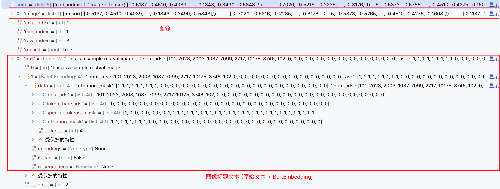
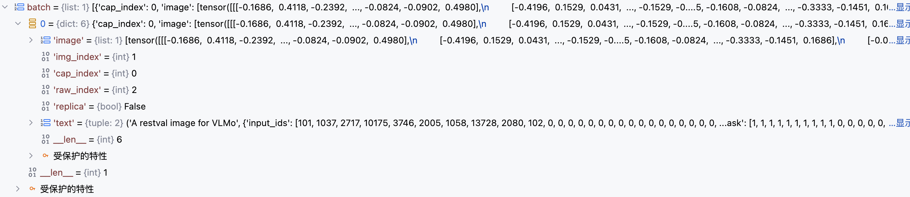
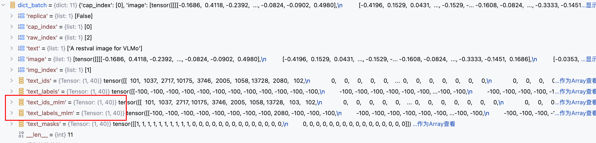

`VLMO 模型代码解读` 

<!-- more -->

> 论文链接: [VLMO: Unified Vision-Language Pre-Training with Mixture-of-Modality-Experts](https://arxiv.org/abs/2111.02358)
> 代码链接: [https://github.com/microsoft/unilm/tree/master/vlmo](https://github.com/microsoft/unilm/tree/master/vlmo)

## 前置知识

VLMO 模型的代码实现中主要使用了以下两个库，如果不提前了解一下库的基本用法，可能会导致读不懂代码实现：

1. [Sacred 实验管理框架](https://sacred.readthedocs.io/en/stable/quickstart.html)

2. [PyTorch Lightning](https://lightning.ai/docs/pytorch/stable/starter/introduction.html)

> `VLMo` 模型代码实现是基于 `ViLT` 模型代码进行修改的，因此如果研究过 `ViLT` 代码实现的同学，对 `VLMo` 模型的代码实现应该比较亲切。

## MOME（Mixture of Multimodal Experts）Transformer

VLMO 论文中所提到的 `MOME Transformer` 的代码实现对应的类是 `MultiWayTransformer` , 本节我们将一点点完成该类代码的拆解; 首先，既然是 `混合多模态专家模型`, 那么它就需要具有同时处理图像和文本的能力；对于输入的图像，第一步需要完成图像的切片和嵌入，该功能由 `PatchEmbed` 类负责完成，具体代码实现如下:

```python
class PatchEmbed(nn.Module):
    """ Image to Patch Embedding
    将输入的图像切分成小 patch，并通过卷积映射到指定的 embedding 维度。
    这是 Vision Transformer (ViT) 中常用的图像嵌入方法。
    """

    def __init__(
        self,
        img_size=224,          # 输入图像的高度和宽度（默认224x224）
        patch_size=16,         # 每个patch的高度和宽度（默认16x16）
        in_chans=3,            # 输入通道数，彩色图像通常为3
        embed_dim=768,         # 输出 embedding 的维度
        no_patch_embed_bias=False,  # 是否在卷积层中去掉偏置
    ):
        super().__init__()

        # 将 img_size 和 patch_size 转换为 (height, width) 的 tuple
        img_size = to_2tuple(img_size)
        patch_size = to_2tuple(patch_size)

        # 计算图像能切分成多少个 patch
        num_patches = (img_size[1] // patch_size[1]) * (img_size[0] // patch_size[0])

        # 保存 patch 行列数，用于位置编码或其他处理
        self.patch_shape = (img_size[0] // patch_size[0], img_size[1] // patch_size[1])
        self.img_size = img_size
        self.patch_size = patch_size
        self.num_patches = num_patches

        # 定义卷积层，将图像切分成 patch 并映射到 embedding 维度
        # 注意：kernel_size = patch_size, stride = patch_size，这样每个卷积核对应一个 patch
        self.proj = nn.Conv2d(
            in_chans,
            embed_dim,
            kernel_size=patch_size,
            stride=patch_size,
            bias=False if no_patch_embed_bias else True,
        )

    def forward(self, x):
        B, C, H, W = x.shape
        # 检查输入图像尺寸是否与初始化尺寸匹配
        assert H == self.img_size[0] and W == self.img_size[1], \
            f"Input image size ({H}*{W}) doesn't match model ({self.img_size[0]}*{self.img_size[1]})."
        # 卷积映射，将图像切分成 patch 并生成 embedding
        x = self.proj(x)
        # 输出 shape: [B, embed_dim, H_patch, W_patch]
        return x
```

`PatchEmbed` 只完成了借助卷积对图像进行前置处理的步骤，`MultiWayTransformer` 类额外提供了 `visual_embed` 方法来完成与 `文本Token` 统一形式的 `视觉Token` 的构建:

```python
class MultiWayTransformer(nn.Module):

    def visual_embed(self, _x):
        """
        将输入的图像张量 _x 转换为视觉 token embedding。
        步骤包括：
        1. patch embedding
        2. 展平并调整维度
        3. 添加 cls token
        4. 添加位置编码（可选）
        5. 添加 dropout
        """

        # 1. 将图像切分成 patch 并映射到 embedding 维度
        x = self.patch_embed(_x)  # shape: [B, embed_dim, H_patch, W_patch]

        # 2. 展平 patch 并调整维度，使其变为序列形式 [B, num_patches, embed_dim]
        x = x.flatten(2).transpose(1, 2)  # flatten 从 H*W -> L，transpose 调整维度

        B, L, _ = x.shape  # B: batch size, L: patch 数量, _: embedding 维度

        # 3. 扩展 cls_token 到 batch 大小，并与 patch embedding 拼接
        cls_tokens = self.cls_token.expand(B, -1, -1)  # shape: [B, 1, embed_dim]
        x = torch.cat((cls_tokens, x), dim=1)          # 拼接后 shape: [B, L+1, embed_dim]

        # 4. 如果有位置编码，则加上
        if self.pos_embed is not None:
            x = x + self.pos_embed  # shape: [B, L+1, embed_dim]

        # 5. 添加 dropout，增加模型鲁棒性
        x = self.pos_drop(x)

        # 6. 构建 mask，这里全 1 表示所有 token 都有效
        x_mask = torch.ones(x.shape[0], x.shape[1])  # shape: [B, L+1]

        return x, x_mask  # 返回 token embedding 和 mask
```

`MultiWayTransformer` 类没有直接对外提供现成的 `forward` 方法实现，而是由调用方 `VLMo` 类负责完成前向传播流程的组织，所以下面我们将首先对其 `init` 方法进行分析，看看它内部包含哪些重要组件:

```python
class MultiWayTransformer(nn.Module):
    def __init__(
        self,
        img_size=224,                 # 输入图像尺寸
        patch_size=16,                # patch 大小
        in_chans=3,                   # 输入通道数（例如 RGB 图像为 3）
        embed_dim=768,                # embedding 维度
        depth=12,                     # transformer block 层数
        num_heads=12,                 # attention 头数
        mlp_ratio=4.0,                # MLP 隐层维度与 embedding 维度的比例
        qkv_bias=True,                # 是否在 QKV 上使用偏置
        qk_scale=None,                # 可手动设置 QK 缩放值
        drop_rate=0.0,                # dropout 概率
        attn_drop_rate=0.0,           # attention dropout 概率
        drop_path_rate=0.0,           # stochastic depth 概率
        norm_layer=None,              # normalization 层类型
        need_relative_position_embed=True,  # 是否使用相对位置编码
        use_abs_pos_emb=False,        # 是否使用绝对位置编码
        layer_scale_init_values=0.1,  # LayerScale 初始化值
        vlffn_start_layer_index=10,   # 从第几层开始使用 VL-FFN
        config=None,                  # 其他配置（如从 pytorch-lightning 传入）
        **kwargs,                     # 接收 timm 或其他传入的额外参数
    ):
        """
        MultiWayTransformer 构造函数，初始化视觉与文本 transformer 的参数。
        """

        super().__init__()

        # 如果传入 config，则覆盖 drop_path_rate
        drop_path_rate = drop_path_rate if config is None else config["drop_path_rate"]

        # 保存是否使用绝对位置编码和相对位置编码的标志
        self.use_abs_pos_emb = use_abs_pos_emb
        self.need_relative_position_embed = need_relative_position_embed

        # 记录 embedding 特征维度
        self.num_features = (self.embed_dim) = embed_dim  # num_features 与 embed_dim 保持一致

        # 默认归一化层，如果未指定则使用 LayerNorm
        norm_layer = norm_layer or partial(nn.LayerNorm, eps=1e-6)

        # PatchEmbedding，将图像切分为 patch 并映射到 embed_dim
        self.patch_embed = PatchEmbed(
            img_size=img_size,
            patch_size=patch_size,
            in_chans=in_chans,
            embed_dim=embed_dim,
        )

        # 记录 patch 数量和 patch 尺寸
        num_patches = self.patch_embed.num_patches
        self.patch_size = patch_size
        self.num_heads = num_heads

        # VL-FFN 从哪一层开始
        self.vlffn_start_layer_index = vlffn_start_layer_index

        # 针对 text-only pretraining，如果 textmlm loss 大于 0，则从最后一层开始使用 VL-FFN
        if config["loss_names"]["textmlm"] > 0:
            self.vlffn_start_layer_index = depth

        # 类别 token 参数（用于全局聚合）
        self.cls_token = nn.Parameter(torch.zeros(1, 1, embed_dim))

        # 绝对位置编码参数（可选）
        self.pos_embed = nn.Parameter(torch.zeros(1, num_patches + 1, embed_dim)) if self.use_abs_pos_emb else None

        # dropout 层
        self.pos_drop = nn.Dropout(p=drop_rate)

        # stochastic depth，每层的 drop_path 概率线性增长
        dpr = [x.item() for x in torch.linspace(0, drop_path_rate, depth)]

        # 构建 transformer block 列表
        self.blocks = nn.ModuleList(
            [
                Block(
                    dim=embed_dim,
                    num_heads=num_heads,
                    mlp_ratio=mlp_ratio,
                    qkv_bias=qkv_bias,
                    qk_scale=qk_scale,
                    drop=drop_rate,
                    attn_drop=attn_drop_rate,
                    drop_path=dpr[i],
                    norm_layer=norm_layer,
                    with_vlffn=(i >= self.vlffn_start_layer_index),  # 超过起始层索引才启用 VL-FFN
                    layer_scale_init_values=layer_scale_init_values,
                    max_text_len=config["max_text_len"],
                )
                for i in range(depth)
            ]
        )

        # transformer 最后的归一化层
        self.norm = norm_layer(embed_dim)

        # 参数初始化
        if self.pos_embed is not None:
            trunc_normal_(self.pos_embed, std=0.02)
        trunc_normal_(self.cls_token, std=0.02)
        self.apply(self._init_weights)  # 初始化所有权重
```

`MultiWayTransformer` 支持同时处理文本和图像模态，这个功能具体实现在其内部的 `Transformer Block` 中:

```python
class Block(nn.Module):
    def __init__(
        self,
        dim,                # 输入特征维度
        num_heads,          # 多头注意力的头数
        mlp_ratio=4.0,      # MLP 隐藏层维度与输入维度的比例
        qkv_bias=False,     # QKV 是否使用偏置
        qk_scale=None,      # QK 缩放因子（覆盖默认 head_dim ** -0.5）
        drop=0.0,           # Dropout 概率
        attn_drop=0.0,      # 注意力权重的 Dropout 概率
        drop_path=0.0,      # Stochastic Depth 概率
        act_layer=nn.GELU,  # 激活函数类型
        norm_layer=nn.LayerNorm, # 归一化层类型
        with_vlffn=False,   # 是否使用跨模态 MLP（Vision-Language Feed-Forward Network）
        layer_scale_init_values=0.1, # LayerScale 初始化值
        max_text_len=40,    # 最大文本序列长度
    ):
        super().__init__()

        # 第一个 LayerNorm（作用于注意力之前）
        self.norm1 = norm_layer(dim)

        # 多头注意力机制
        self.attn = Attention(
            dim,
            num_heads=num_heads,
            qkv_bias=qkv_bias,
            qk_scale=qk_scale,
            attn_drop=attn_drop,
            proj_drop=drop,
        )

        # DropPath（随机丢弃整个残差分支）或恒等映射
        self.drop_path = DropPath(drop_path) if drop_path > 0.0 else nn.Identity()

        # 第二阶段的 LayerNorm（针对文本和图像分别有独立的归一化层）
        self.norm2_text = norm_layer(dim)
        self.norm2_imag = norm_layer(dim)

        # MLP 隐藏层维度
        mlp_hidden_dim = int(dim * mlp_ratio)

        # 文本模态的 MLP
        self.mlp_text = Mlp(
            in_features=dim,
            hidden_features=mlp_hidden_dim,
            act_layer=act_layer,
            drop=drop,
        )

        # 图像模态的 MLP
        self.mlp_imag = Mlp(
            in_features=dim,
            hidden_features=mlp_hidden_dim,
            act_layer=act_layer,
            drop=drop,
        )

        # 跨模态 MLP（仅在 with_vlffn=True 时使用）
        self.mlp_vl = None
        if with_vlffn:
            self.mlp_vl = Mlp(
                in_features=dim,
                hidden_features=mlp_hidden_dim,
                act_layer=act_layer,
                drop=drop,
            )
            self.norm2_vl = norm_layer(dim)

        # LayerScale 参数（gamma_1 作用于注意力分支，gamma_2 作用于 MLP 分支）
        self.gamma_1 = (
            nn.Parameter(layer_scale_init_values * torch.ones((dim)), requires_grad=True)
            if layer_scale_init_values is not None else 1.0
        )
        self.gamma_2 = (
            nn.Parameter(layer_scale_init_values * torch.ones((dim)), requires_grad=True)
            if layer_scale_init_values is not None else 1.0
        )

        # 最大文本长度（在拆分多模态输入时使用）
        self.max_text_len = max_text_len

    def forward(self, x, mask=None, modality_type=None, relative_position_bias=None):
        """
        Args:
            x: 输入特征 [B, L, C]
            mask: 注意力掩码（可选）
            modality_type: 输入模态类型 ("image", "text", 或 None 表示多模态）
            relative_position_bias: 相对位置编码偏置
        """

        # ====== 注意力子层（带残差连接 + LayerScale + DropPath）======
        x = x + self.drop_path(
            self.gamma_1 * self.attn(
                self.norm1(x),
                mask=mask,
                relative_position_bias=relative_position_bias
            )
        )

        # ====== 前馈网络子层（根据模态类型选择不同 MLP）======
        if modality_type == "image":
            # 仅图像模态
            x = x + self.drop_path(self.gamma_2 * self.mlp_imag(self.norm2_imag(x)))
        elif modality_type == "text":
            # 仅文本模态
            x = x + self.drop_path(self.gamma_2 * self.mlp_text(self.norm2_text(x)))
        else:
            # 多模态情况
            if self.mlp_vl is None:
                # 分开处理文本和图像序列
                x_text = x[:, : self.max_text_len]   # 前 max_text_len 为文本
                x_imag = x[:, self.max_text_len :]   # 剩余部分为图像
                x_text = x_text + self.drop_path(self.gamma_2 * self.mlp_text(self.norm2_text(x_text)))
                x_imag = x_imag + self.drop_path(self.gamma_2 * self.mlp_imag(self.norm2_imag(x_imag)))
                # 合并回一个序列
                x = torch.cat([x_text, x_imag], dim=1)
            else:
                # 跨模态 MLP
                x = x + self.drop_path(self.gamma_2 * self.mlp_vl(self.norm2_vl(x)))

        return x
```
**LayerScale 技术:**  在深层 Transformer 中，如果直接把残差相加，可能导致梯度爆炸或梯度消失;  LayerScale 允许网络自己调节每一层的残差输出强度，从而改善训练稳定性。提高深层网络可训练性； 对深层 ViT（几十甚至上百层）非常有效，减少了训练前期的收敛难度。

简单理解：

```python
x = x + γ1 * Attention(x)
x = x + γ2 * MLP(x)
```

* γ1、γ2 = 可学习缩放因子

* 作用 = 控制残差贡献，稳定训练

* 为什么分开？因为 Attention 和 MLP 输出的统计特性不同，需要不同的缩放系数


`Attention` 模块的代码属于模版代码，不涉及新技术的引入，代码实现如下所示:

```python
class Attention(nn.Module):
    def __init__(
        self,
        dim,                # 输入特征的维度 (embedding dimension)
        num_heads=8,        # 多头注意力的头数
        qkv_bias=False,     # 是否为 Q、K、V 添加可学习偏置
        qk_scale=None,      # QK 点积的缩放因子（可覆盖默认值）
        attn_drop=0.0,      # 注意力权重的 Dropout 概率
        proj_drop=0.0,      # 输出投影层的 Dropout 概率
    ):
        super().__init__()
        self.num_heads = num_heads
        head_dim = dim // num_heads  # 每个注意力头的维度
        # QK 缩放因子，默认为 1/sqrt(head_dim)，防止点积结果过大
        self.scale = qk_scale or head_dim ** -0.5

        # 线性层生成 Q、K、V（一次性计算 dim → 3*dim）
        self.qkv = nn.Linear(dim, dim * 3, bias=False)
        
        # 如果需要 Q、V 偏置，则单独为 Q 和 V 创建可学习参数
        if qkv_bias:
            self.q_bias = nn.Parameter(torch.zeros(dim))
            self.v_bias = nn.Parameter(torch.zeros(dim))
        else:
            self.q_bias = None
            self.v_bias = None
        
        # 注意力权重的 Dropout
        self.attn_drop = nn.Dropout(attn_drop)
        # 注意力结果的输出投影层
        self.proj = nn.Linear(dim, dim)
        # 输出投影后的 Dropout
        self.proj_drop = nn.Dropout(proj_drop)


    def forward(self, x, mask=None, relative_position_bias=None):
        """
        Args:
            x: 输入张量 (B, N, C)，
               B=批大小，N=序列长度，C=通道数(embedding dim)
            mask: 注意力掩码 (B, N)，用于屏蔽无效位置
            relative_position_bias: 相对位置编码 (num_heads, N, N)
        """
        B, N, C = x.shape  # 取出批大小、序列长度、通道数

        # 处理 Q、K、V 偏置
        qkv_bias = None
        if self.q_bias is not None:
            # 拼接 Q 偏置、K 偏置(全0)、V 偏置
            qkv_bias = torch.cat((
                self.q_bias,
                torch.zeros_like(self.v_bias, requires_grad=False),
                self.v_bias
            ))

        # 线性映射得到 Q、K、V（在这里一次性计算）
        qkv = F.linear(input=x, weight=self.qkv.weight, bias=qkv_bias)
        # 变形为 (3, B, num_heads, N, head_dim)，并调整维度顺序
        qkv = qkv.reshape(B, N, 3, self.num_heads, -1).permute(2, 0, 3, 1, 4)

        # 拆分 Q、K、V
        q, k, v = qkv[0], qkv[1], qkv[2]

        # 缩放 Q
        q = q * self.scale
        # QK^T 得到注意力分数矩阵
        attn = (q.float() @ k.float().transpose(-2, -1))
        
        # 如果有相对位置偏置，则加上
        if relative_position_bias is not None:
            attn = attn + relative_position_bias.unsqueeze(0)

        # 如果有 mask（如解码器中的自回归屏蔽）
        if mask is not None:
            mask = mask.bool()
            attn = attn.masked_fill(~mask[:, None, None, :], float("-inf"))

        # 对最后一维做 softmax 得到注意力权重
        attn = attn.softmax(dim=-1).type_as(x)
        # 对注意力权重做 Dropout
        attn = self.attn_drop(attn)

        # 注意力加权 V，然后还原维度为 (B, N, C)
        x = (attn @ v).transpose(1, 2).reshape(B, N, C)
        # 输出投影
        x = self.proj(x)
        # 投影结果 Dropout
        x = self.proj_drop(x)
        return x
```

## VLMo 

主模型 `VLMo` 由于使用了 `PyTorch Lightning` 实验全流程管理框架，使得其代码看起来并不常规，但是其本质还是借助 `模版方法设计模型` 抽取出一套通用的模版流程，并通过在各个模版节点预留钩子函数的方式，使得用户可以在不改变模版流程的情况下，自定义模型的行为; 

因此，我们首先用一幅图理清楚 `PyTorch Lightning` 预留的这套模版流程是怎么设计的:

](VLMO/1.png)

```python
1. 初始化阶段
   ├─ 用户创建 LightningModule 和 Trainer                   (用户代码)
   ├─ LightningModule.configure_optimizers()                 (LightningModule)
   ├─ Trainer 配置 logger、callbacks、accelerator、分布式   (Trainer 内部)

2. 数据准备阶段
   ├─ LightningDataModule.prepare_data()                     (LightningDataModule, global_rank=0)
   └─ LightningDataModule.setup(stage)                       (LightningDataModule, 每个进程, stage ∈ {'fit','validate','test','predict'})

3. 数据加载阶段
   ├─ LightningDataModule.train_dataloader()                (LightningDataModule)
   ├─ LightningDataModule.val_dataloader()                  (LightningDataModule)
   └─ LightningDataModule.test_dataloader()                 (LightningDataModule)

4. 训练阶段（fit）
   ├─ Trainer.on_fit_start()                                  (Trainer 调用所有 callbacks.on_fit_start)
   └─ Epoch 循环 (for epoch in max_epochs)
       ├─ Trainer.on_train_epoch_start()                     (Trainer callbacks)
       └─ Batch 循环 (for batch in train_dataloader)
            ├─ Trainer.on_train_batch_start(batch, batch_idx)   (Trainer callbacks)
            ├─ LightningModule.training_step(batch, batch_idx)  (LightningModule)
            ├─ Trainer.on_before_zero_grad(optimizer)           (Trainer callbacks)
            ├─ optimizer.zero_grad()                             (PyTorch)
            ├─ loss.backward()                                   (PyTorch)
            ├─ Trainer.on_after_backward()                        (Trainer callbacks)
            ├─ Trainer.on_before_optimizer_step(optimizer)       (Trainer callbacks)
            ├─ optimizer.step()                                   (PyTorch)
            └─ Trainer.on_train_batch_end(output, batch, batch_idx)(Trainer callbacks)
       ├─ LightningModule.training_epoch_end(outputs)         (LightningModule)
       └─ Trainer.on_train_epoch_end()                        (Trainer callbacks)

       └─ 验证阶段（每个 epoch 后可选）
            ├─ Trainer.on_validation_start()                  (Trainer callbacks)
            ├─ model.eval(), torch.no_grad()                  (Trainer 内部)
            └─ 循环 val_dataloader
                 ├─ LightningModule.validation_step(batch, batch_idx)     (LightningModule)
                 ├─ LightningModule.validation_step_end(output)           (LightningModule)
                 └─ 汇总 outputs
            ├─ LightningModule.validation_epoch_end(outputs)               (LightningModule)
            └─ Trainer.on_validation_epoch_end()                            (Trainer callbacks)
   └─ Trainer.on_fit_end()                                       (Trainer callbacks)

5. 测试阶段（test）
   ├─ Trainer.on_test_start()                                     (Trainer callbacks)
   ├─ model.eval(), torch.no_grad()                               (Trainer 内部)
   └─ 循环 test_dataloader
        ├─ LightningModule.test_step(batch, batch_idx)            (LightningModule)
        ├─ LightningModule.test_step_end(output)                  (LightningModule)
        └─ 汇总 outputs
   ├─ LightningModule.test_epoch_end(outputs)                     (LightningModule)
   └─ Trainer.on_test_end()                                        (Trainer callbacks)

6. 预测阶段（predict）
   ├─ Trainer.on_predict_start()                                  (Trainer callbacks)
   ├─ model.eval(), torch.no_grad()                               (Trainer 内部)
   └─ 循环 predict_dataloader
        ├─ LightningModule.predict_step(batch, batch_idx)         (LightningModule)
        ├─ LightningModule.predict_step_end(output)               (LightningModule)
        └─ 汇总 outputs
   ├─ LightningModule.predict_epoch_end(outputs)                  (LightningModule)
   └─ Trainer.on_predict_end()                                     (Trainer callbacks)
```

下面我们将结合上面的模版流程，分析一下 `VLMo` 在模版流程的各种阶段都做了什么:

### 数据模块

一般模型训练都会加载多个来源不同的开源或私有数据集，`VLMo` 也不例外，因此 `VLMo` 提供了 `MTDataModule` 类用于完成多数据源加载的任务:

```python
class MTDataModule(LightningDataModule):
    def __init__(self, _config, dist=False):
        """
        多任务/多数据集 DataModule，负责管理多个子数据集
        Args:
            _config: 配置字典，包含数据集 key 和其他参数
            dist: 是否使用分布式采样
        """
        datamodule_keys = _config["datasets"]
        assert len(datamodule_keys) > 0

        super().__init__()

        # 保存数据集 key 和对应的数据模块实例
        self.dm_keys = datamodule_keys
        self.dm_dicts = {key: _datamodules[key](_config) for key in datamodule_keys}
        self.dms = [v for k, v in self.dm_dicts.items()]

        # 从第一个数据模块读取通用配置
        self.batch_size = self.dms[0].batch_size
        self.vocab_size = self.dms[0].vocab_size
        self.num_workers = self.dms[0].num_workers

        self.dist = dist  # 是否使用分布式采样

    def prepare_data(self):
        """
        数据准备阶段（只在主进程调用一次）
        生命周期阶段: Trainer 调用 prepare_data()
        """
        for dm in self.dms:
            dm.prepare_data()  # 调用每个子数据模块的 prepare_data

    def setup(self, stage):
        """
        数据集构建阶段，每个进程都会调用
        Args:
            stage: 'fit', 'validate', 'test', 'predict' 等
        """
        for dm in self.dms:
            dm.setup(stage)  # 调用子数据模块的 setup

        # 合并各个子数据集
        self.train_dataset = ConcatDataset([dm.train_dataset for dm in self.dms])
        self.val_dataset = ConcatDataset([dm.val_dataset for dm in self.dms])
        self.test_dataset = ConcatDataset([dm.test_dataset for dm in self.dms])

        # 保存 tokenizer 和 collate 函数
        self.tokenizer = self.dms[0].tokenizer
        self.collate = functools.partial(
            self.dms[0].train_dataset.collate,
            mlm_collator=self.dms[0].mlm_collator,
        )

        # 分布式采样器
        if self.dist and torch.distributed.is_initialized():
            self.train_sampler = DistributedSampler(self.train_dataset, shuffle=True)
            self.val_sampler = DistributedSampler(self.val_dataset, shuffle=True)
            self.test_sampler = DistributedSampler(self.test_dataset, shuffle=False)
        else:
            self.train_sampler = None
            self.val_sampler = None
            self.test_sampler = None

    def train_dataloader(self):
        """
        返回训练 DataLoader
        生命周期阶段: Trainer.fit() 内部调用
        """
        loader = DataLoader(
            self.train_dataset,
            batch_size=self.batch_size,
            sampler=self.train_sampler,
            num_workers=self.num_workers,
            collate_fn=self.collate,
        )
        return loader

    def val_dataloader(self, batch_size=None):
        """
        返回验证 DataLoader
        生命周期阶段: Trainer.validate() 或 Trainer.fit() 内部验证调用
        """
        loader = DataLoader(
            self.val_dataset,
            batch_size=batch_size if batch_size is not None else self.batch_size,
            sampler=self.val_sampler,
            num_workers=self.num_workers,
            collate_fn=self.collate,
        )
        return loader

    def test_dataloader(self):
        """
        返回测试 DataLoader
        生命周期阶段: Trainer.test() 内部调用
        """
        loader = DataLoader(
            self.test_dataset,
            batch_size=self.batch_size,
            sampler=self.test_sampler,
            num_workers=self.num_workers,
            collate_fn=self.collate,
        )
        return loader
```

`_datamodules` 字典中保存了 `VLMo` 所使用到的所有数据集对应的 `DataModule` 实现类:

```python
_datamodules = {
    "vg": VisualGenomeCaptionDataModule,
    "f30k": F30KCaptionKarpathyDataModule,
    "coco": CocoCaptionKarpathyDataModule,
    "gcc": ConceptualCaptionDataModule,
    "sbu": SBUCaptionDataModule,
    "wikibk": WikibkDataModule,
    "vqa": VQAv2DataModule,
    "nlvr2": NLVR2DataModule,
}
```
当子实现类比较多的时候，自然会存在一些重复性操作，因此 `VLMo` 模型的代码实现中额外抽取了一个抽象类 `BaseDataModule` 用于定义重复性的模版流程，以此来简化子实现类需要做的操作:

```python
class BaseDataModule(LightningDataModule):
    def __init__(self, _config):
        """
        基础 DataModule 类，支持图文/文本数据集
        Args:
            _config: 配置字典，包含数据路径、batch_size、tokenizer 等信息
        """
        super().__init__()

        # 数据目录
        self.data_dir = _config["data_root"]

        # DataLoader 参数
        self.num_workers = _config["num_workers"]
        self.batch_size = _config["per_gpu_batchsize"]
        self.eval_batch_size = self.batch_size

        # 数据处理参数
        self.image_size = _config["image_size"]
        self.max_text_len = _config["max_text_len"]
        self.draw_false_image = _config["draw_false_image"]
        self.draw_false_text = _config["draw_false_text"]
        self.image_only = _config["image_only"]
        self.text_only = _config["text_only"]

        # 数据增强/transform 配置
        self.train_transform_keys = (
            ["default_train"]
            if len(_config["train_transform_keys"]) == 0
            else _config["train_transform_keys"]
        )
        self.val_transform_keys = (
            ["default_val"]
            if len(_config["val_transform_keys"]) == 0
            else _config["val_transform_keys"]
        )

        # tokenizer
        tokenizer = _config["tokenizer"]
        self.tokenizer = get_pretrained_tokenizer(tokenizer)
        self.vocab_size = self.tokenizer.vocab_size

        # collator: 用于 MLM（mask language model）训练
        collator = (
            DataCollatorForWholeWordMask
            if _config["whole_word_masking"]
            else DataCollatorForLanguageModeling
        )
        self.mlm_collator = collator(
            tokenizer=self.tokenizer, mlm=True, mlm_probability=_config["mlm_prob"]
        )

        # setup 状态标志，确保 setup 只执行一次
        self.setup_flag = False

    @property
    def dataset_cls(self):
        """
        子类必须实现
        返回 dataset 类（通常是 Dataset 子类）
        """
        raise NotImplementedError("return tuple of dataset class")

    @property
    def dataset_name(self):
        """
        子类必须实现
        返回数据集名称
        """
        raise NotImplementedError("return name of dataset")

    def set_train_dataset(self):
        """
        构建训练数据集
        生命周期阶段: setup() 调用
        """
        self.train_dataset = self.dataset_cls(
            self.data_dir,
            self.train_transform_keys,
            split="train",
            image_size=self.image_size,
            max_text_len=self.max_text_len,
            draw_false_image=self.draw_false_image,
            draw_false_text=self.draw_false_text,
            image_only=self.image_only,
        )

    def set_val_dataset(self):
        """
        构建验证数据集
        生命周期阶段: setup() 调用
        """
        self.val_dataset = self.dataset_cls(
            self.data_dir,
            self.val_transform_keys,
            split="val",
            image_size=self.image_size,
            max_text_len=self.max_text_len,
            draw_false_image=self.draw_false_image,
            draw_false_text=self.draw_false_text,
            image_only=self.image_only,
        )

        # 如果存在“无干扰”验证数据集类，额外构建
        if hasattr(self, "dataset_cls_no_false"):
            self.val_dataset_no_false = self.dataset_cls_no_false(
                self.data_dir,
                self.val_transform_keys,
                split="val",
                image_size=self.image_size,
                max_text_len=self.max_text_len,
                draw_false_image=0,
                draw_false_text=0,
                image_only=self.image_only,
            )

    def make_no_false_val_dset(self, image_only=False):
        """
        构建无干扰验证数据集（用于评估）
        """
        return self.dataset_cls_no_false(
            self.data_dir,
            self.val_transform_keys,
            split="val",
            image_size=self.image_size,
            max_text_len=self.max_text_len,
            draw_false_image=0,
            draw_false_text=0,
            image_only=image_only,
        )

    def make_no_false_test_dset(self, image_only=False):
        """
        构建无干扰测试数据集（用于评估）
        """
        return self.dataset_cls_no_false(
            self.data_dir,
            self.val_transform_keys,
            split="test",
            image_size=self.image_size,
            max_text_len=self.max_text_len,
            draw_false_image=0,
            draw_false_text=0,
            image_only=image_only,
        )

    def set_test_dataset(self):
        """
        构建测试数据集
        生命周期阶段: setup() 调用
        """
        self.test_dataset = self.dataset_cls(
            self.data_dir,
            self.val_transform_keys,
            split="test",
            image_size=self.image_size,
            max_text_len=self.max_text_len,
            draw_false_image=self.draw_false_image,
            draw_false_text=self.draw_false_text,
            image_only=self.image_only,
        )

    def setup(self, stage):
        """
        数据集构建钩子
        生命周期阶段: Trainer.fit(), Trainer.validate(), Trainer.test() 内部调用
        """
        if not self.setup_flag:
            # 构建 train/val/test 数据集
            self.set_train_dataset()
            self.set_val_dataset()
            self.set_test_dataset()

            # 给 dataset 注入 tokenizer
            self.train_dataset.tokenizer = self.tokenizer
            self.val_dataset.tokenizer = self.tokenizer
            self.test_dataset.tokenizer = self.tokenizer

            self.setup_flag = True  # 标记 setup 已完成

    def train_dataloader(self):
        """
        构建训练 DataLoader
        生命周期阶段: Trainer.fit() 内部调用
        """
        loader = DataLoader(
            self.train_dataset,
            batch_size=self.batch_size,
            shuffle=True,  # 训练集通常打乱
            num_workers=self.num_workers,
            pin_memory=True,
            collate_fn=self.train_dataset.collate,
        )
        return loader

    def val_dataloader(self):
        """
        构建验证 DataLoader
        生命周期阶段: Trainer.validate() 或 Trainer.fit() 内部验证调用
        """
        loader = DataLoader(
            self.val_dataset,
            batch_size=self.eval_batch_size,
            shuffle=False,
            num_workers=self.num_workers,
            pin_memory=True,
            collate_fn=self.val_dataset.collate,
        )
        return loader

    def test_dataloader(self):
        """
        构建测试 DataLoader
        生命周期阶段: Trainer.test() 内部调用
        """
        loader = DataLoader(
            self.test_dataset,
            batch_size=self.eval_batch_size,
            shuffle=False,
            num_workers=self.num_workers,
            pin_memory=True,
            collate_fn=self.test_dataset.collate,
        )
        return loader
```
`VLMo` 在训练或验证数据集可能会加入一些“干扰样本”：

* `draw_false_image=1`：给文本配上错误图像
 
* `draw_false_text=1`：给图像配上错误文本

这种策略有助于模型学习**跨模态对齐能力**，增强鲁棒性，但它会让数据本身有“噪声”。

**为什么需要无干扰数据集？**
   
* 在训练中，你希望模型看到“有干扰”的数据，提高判别能力；

* 在评估阶段，你希望衡量模型在**真实匹配样本**上的性能，这时候就要去掉干扰，即 `draw_false_image=0`、`draw_false_text=0`；

* 这保证了评估指标（如准确率、召回率等）反映的是模型对正确样本的能力，而不是对抗干扰样本的能力。


**具体实现:**

* `make_no_false_val_dset` → 构建无干扰的验证集，保证验证指标真实可靠；

* `make_no_false_test_dset` → 构建无干扰的测试集，用于最终评估模型效果；

* 可以选择 `image_only=True` 或 `False` 来控制是否只用图像作为输入。


有了 `BaseDataModule` 类负责完成通用模版流程的抽取，子类需要做的事情就非常简单了，只需要告知父类自己的数据集名和数据集类的具体实现即可:

```python
class CocoCaptionKarpathyDataModule(BaseDataModule):
    def __init__(self, *args, **kwargs):
        super().__init__(*args, **kwargs)

    @property
    def dataset_cls(self):
        return CocoCaptionKarpathyDataset

    @property
    def dataset_cls_no_false(self):
        return CocoCaptionKarpathyDataset

    @property
    def dataset_name(self):
        return "coco"
```
当 `VLMo` 通过 `LightningDataModule` 完成 `DataSet` 的 `prepare` 和 `set_up` 后，下一步便可以通过 `DataLoader` 来正常获取一个批次的数据了，这里以 `CocoCaptionKarpathyDataset` 子实现类为例，看一下数据的形式:

```python
class CocoCaptionKarpathyDataset(BaseDataset):
    def __init__(self, *args, split="", **kwargs):
        assert split in ["train", "val", "test"]
        self.split = split

        if split == "train":
            names = ["coco_caption_karpathy_train", "coco_caption_karpathy_restval"]
        elif split == "val":
            names = ["coco_caption_karpathy_val"]
        elif split == "test":
            names = ["coco_caption_karpathy_test"]

        super().__init__(*args, **kwargs, names=names, text_column_name="caption")

    def __getitem__(self, index):
        suite = self.get_suite(index)

        if "test" in self.split:
            _index, _question_index = self.index_mapper[index]
            iid = self.table["image_id"][_index].as_py()
            iid = int(iid.split(".")[0].split("_")[-1])
            suite.update({"iid": iid})

        return suite
```
通过 `CocoCaptionKarpathyDataset` 的 `__getitem__` 方法，每次可以获取一条样本数据，具体形式如下:




基类 `BaseDataset` 中提供了 `collate` 方法，用于 `DataLoader` 积攒起一批样本数据后，回调该钩子方法完成合适的批量数据格式组织:

```python
class BaseDataset(torch.utils.data.Dataset):

    def collate(self, batch, mlm_collator):
        batch_size = len(batch)
        ...
        return dict_batch
```
该方法实现过程比较复杂，但其主要负责将输入的 `batch` 数据按 `key` 进行聚合 , 同时对输入的文本数据回调 `mlm_collator` 钩子方法，完成 `Masked Language Modeling（MLM）` 任务 , 生成两个新的 `key` : `text_ids_mlm` 和 `text_labels_mlm` 用于表示 `MLM` 后的 `input_ids` 和 `mask标签`。





> PyTorch 的 CrossEntropyLoss（尤其是 Hugging Face Transformers 的实现里）中，-100 会被当作 ignore_index，即这些位置不参与 loss 计算

### 模型实现

从本节开始，我们将进入 `VLMo` 模型代码解析的核心部分，首先是其实现的钩子方法 `training_step` ，该方法负责完成具体的一轮训练实现:

```python
class VLMo(pl.LightningModule):

    def training_step(self, batch, batch_idx):
        # 记录一下本轮训练需要推进的学习任务有几个: ['itm', 'itc', 'mlm'] (预训练阶段有三个)
        vlmo_utils.set_task(self)
        # 调用 VLMo 的 forward 方法
        output = self(batch)
        # 累加所有学习任务结束后的损失
        total_loss = sum([v for k, v in output.items() if "loss" in k])

        return total_loss
```
```python
def set_task(pl_module):
    pl_module.current_tasks = [
        k for k, v in pl_module.hparams.config["loss_names"].items() if v >= 1
    ]
    return
```

`VLMo` 模型的前向传播阶段会根据学习任务列表，分别进行多次独立的前向传播完成对应学习任务推进损失的计算，同时将损失记录在字典中:

```python
    def forward(self, batch):
        ret = dict()
        if len(self.current_tasks) == 0:
            ret.update(self.infer(batch))
            return ret

        # Masked Language Modeling
        if "mlm" in self.current_tasks:
            ret.update(objectives.compute_mlm(self, batch))

        # Textonly Masked Language Modeling
        if "textmlm" in self.current_tasks:
            ret.update(objectives.compute_textonly_mlm(self, batch))

        # Contrastive loss for pretraining
        if "itc" in self.current_tasks:
            ret.update(objectives.compute_itc(self, batch))

        # Contrastive loss for finetuning
        if "irtr" in self.current_tasks:
            ret.update(objectives.compute_irtr(self, batch))

        # Image Text Matching with global hard negative, must use with itc
        if "itm" in self.current_tasks:
            ret.update(objectives.compute_itm_hardneg(self, batch, ret["itc_i2t_logits"], ret["itc_t2i_logits"]))

        # Visual Question Answering
        if "vqa" in self.current_tasks:
            ret.update(objectives.compute_vqa(self, batch))

        # Natural Language for Visual Reasoning 2
        if "nlvr2" in self.current_tasks:
            ret.update(objectives.compute_nlvr2(self, batch))

        return ret
```
下面会分小节独立对每个学习任务的计算过程进行详解:

#### Masked Language Modeling

第一个学习目标是 `MLM` 任务，该任务的学习目标是根据未被掩码的图像序列和文本序列，去预测被掩码的 `Token` 原来的标签; 具体代码实现如下所示:

```python
def infer(
    self,
    batch,
    mask_text=False,              # 是否对文本做MLM掩码（Mask Language Modeling）
    mask_image=False,             # 是否对图像做mask（当前代码未使用）
    image_token_type_idx=1,       # 图像 token 类型的索引（用于 token_type_embeddings）
    image_embeds=None,            # 可选：外部直接传入图像embedding
    image_masks=None,             # 可选：外部直接传入图像mask
):
    # 1. 选择图像键名 (去除多视角图像选择逻辑)
    imgkey = "image"

    # 2. 确定是否使用 MLM 数据（_mlm 后缀）
    do_mlm = "_mlm" if mask_text else ""
    
    # 3. 取出文本相关的张量
    text_ids = batch[f"text_ids{do_mlm}"]       # 文本 token ID
    text_labels = batch[f"text_labels{do_mlm}"] # 文本标签（训练时可能是-100占位）
    text_masks = batch[f"text_masks"]           # 文本 attention mask（padding位置为0）
    
    # 4. 将 token ID 转成嵌入向量
    text_embeds = self.text_embeddings(text_ids)

    # 5. 取出图像并做视觉编码
    img = batch[imgkey][0]  # 图像张量（通常是 [B, C, H, W]）
    image_embeds, image_masks = self.transformer.visual_embed(img)
    #   image_embeds: 图像的 patch embedding
    #   image_masks: 图像的 attention mask

    # 6. 转成 long 类型（以防下游 embedding 索引出错）
    image_masks = image_masks.long()

    # 7. 给文本和图像 embedding 添加 token type embedding（区分模态）
    text_embeds, image_embeds = (
        text_embeds + self.token_type_embeddings(torch.zeros_like(text_masks)),  # 文本类型 idx=0
        image_embeds + self.token_type_embeddings(
            torch.full_like(image_masks, image_token_type_idx)                   # 图像类型 idx=image_token_type_idx
        ),
    )

    # 8. 将文本和图像序列拼接
    co_embeds = torch.cat([text_embeds, image_embeds], dim=1)  # 拼接 embedding
    co_masks = torch.cat([text_masks, image_masks], dim=1)     # 拼接 mask

    # 9. 输入 transformer encoder
    x = co_embeds
    relative_position_bias_list = self.get_rel_pos_bias(self.text_imag_relative_position_index)

    for i, blk in enumerate(self.transformer.blocks):
        # 每个 block 都处理文本+图像的联合序列
        x = blk(
            x, 
            mask=co_masks, 
            modality_type="vl", 
            relative_position_bias=relative_position_bias_list[i]
        )

    # 10. LayerNorm 归一化
    x = self.transformer.norm(x)

    # 11. 拆回文本特征和图像特征
    text_feats, image_feats = (
        x[:, : text_embeds.shape[1]],            # 前半部分是文本
        x[:, text_embeds.shape[1] :],            # 后半部分是图像
    )

    # 12. 获取 CLS token 的池化特征
    cls_feats = self.pooler(x)  # 一般是 x[:,0] 做线性变换
                                # 但这里保留 raw_cls_feats 也就是未pooler的

    # 13. 返回推理结果字典
    ret = {
        "text_feats": text_feats,          # 文本的序列特征
        "image_feats": image_feats,        # 图像的序列特征
        "cls_feats": cls_feats,            # CLS token 经过pooler的特征
        "raw_cls_feats": x[:, 0],          # CLS token的原始特征
        "image": img,                      # 原始图像张量
        "text_labels": text_labels,        # 文本标签
        "text_ids": text_ids,              # 文本 token ID
        "text_masks": text_masks,          # 文本 attention mask
    }

    return ret
```

```python
def compute_mlm(pl_module, batch):
    # 1. 调用 pl_module 的 infer 方法，开启 mask_text=True
    #    表示对输入文本做 MLM 掩码，mask_image=False 表示不对图像做掩码
    #    返回的 infer 字典中包含文本/图像的特征、标签等信息
    infer = pl_module.infer(batch, mask_text=True, mask_image=False)

    # 2. 将文本特征输入 MLM 预测头（mlm_score），得到预测的 token logits (上下文编码投影到词空间)
    #    mlm_logits 形状通常为 [batch_size, seq_len, vocab_size]
    mlm_logits = pl_module.mlm_score(infer["text_feats"])

    # 3. 取出 MLM 任务的标签
    #    标签中非 mask 位置一般是 -100（会被交叉熵忽略）
    mlm_labels = infer["text_labels"]

    # 4. 计算 MLM 的交叉熵损失
    #    - 将 logits 展平为 [batch_size*seq_len, vocab_size]
    #    - 将 labels 展平为 [batch_size*seq_len]
    #    - ignore_index=-100 表示这些位置不计入损失
    mlm_loss = F.cross_entropy(
        mlm_logits.view(-1, pl_module.hparams.config["vocab_size"]),
        mlm_labels.view(-1),
        ignore_index=-100,
    )

    # 5. 将 MLM 损失乘以权重 0.25（可能是多任务训练中给 MLM 任务的损失权重）
    ret = {
        "mlm_loss": mlm_loss * 0.25,
        "mlm_logits": mlm_logits,
        "mlm_labels": mlm_labels,
        "mlm_ids": infer["text_ids"],  # 原始文本 token id
    }

    # 6. 判断当前是训练阶段还是验证阶段
    phase = "train" if pl_module.training else "val"

    # 7. 将 MLM 损失记录到 pl_module 的对应指标（train_mlm_loss 或 val_mlm_loss）
    loss = getattr(pl_module, f"{phase}_mlm_loss")(ret["mlm_loss"])

    # 8. 计算 MLM 预测准确率（忽略 -100 的位置）
    acc = getattr(pl_module, f"{phase}_mlm_accuracy")(
        ret["mlm_logits"], ret["mlm_labels"]
    )

    # 9. 记录损失和准确率到日志（方便 TensorBoard / WandB 可视化）
    pl_module.log(f"mlm/{phase}/loss", loss)
    pl_module.log(f"mlm/{phase}/accuracy", acc)

    # 10. 返回结果字典（损失、预测值、标签、文本id）
    return ret
```

#### Contrastive loss for pretraining


第二个学习目标是 `ITC` 任务，该任务的学习目标是采用对比学习策略，最大化相似度矩阵对角线的相似度得分，同时最小化非对角线的非匹配样本相似度得分。

```python
def infer_image(
    self,
    batch,
    mask_image=False,              # 是否对图像进行 mask（传参保留，但当前实现未使用）
    image_token_type_idx=1,        # 图像 token type id（区分 text=0, image=1）
    image_embeds=None,             # 预计算好的图像 embedding（可选）
    image_masks=None,              # 预计算好的图像 mask（可选）
):
    # ====== Step 1: 从 batch 取图像 ======
    imgkey = "image"
    img = batch[imgkey][0]  # batch["image"] 是一个列表，取第 0 个元素作为输入图像

    # ====== Step 2: 图像编码（patch embedding + mask） ======
    # visual_embed 会把图像切成 patch，映射到 embedding 空间，并返回对应的 mask
    image_embeds, image_masks = self.transformer.visual_embed(img)

    # ====== Step 3: mask 处理 ======
    # 将 mask 转为 long 类型，并放到图像所在的设备上
    image_masks = image_masks.long().to(device=img.get_device())

    # ====== Step 4: 加上 token type embedding ======
    # 给图像 token embedding 加上类型 embedding（值固定为 image_token_type_idx=1）
    image_embeds = image_embeds + self.token_type_embeddings(
        torch.full_like(image_masks, image_token_type_idx)
    )

    # ====== Step 5: 初始化 transformer 输入 ======
    co_embeds = image_embeds   # 融合输入 = 图像 embedding
    co_masks = image_masks     # 融合 mask = 图像 mask
    x = co_embeds
    all_hidden_states = []     # 存储每层 hidden states，供后续 VL block 使用

    # ====== Step 6: 计算相对位置偏置 ======
    relative_position_bias_list = self.get_rel_pos_bias(self.relative_position_index)

    # ====== Step 7: 单模态图像编码（Image-only Blocks） ======
    for i, blk in enumerate(self.transformer.blocks):
        x = blk(
            x,
            mask=co_masks,
            modality_type="image",  # 单模态模式 = 图像
            relative_position_bias=relative_position_bias_list[i]
        )
        all_hidden_states.append(x)  # 保存该层输出

    # ====== Step 8: 多模态编码（VL-Blocks） ======
    # 从 vlffn_start_layer_index-1 层的输出作为起点
    vlffn_hiddens = all_hidden_states[self.vlffn_start_layer_index - 1]
    # 从指定层开始，走 VL 模式（Vision-Language 融合）
    for vlffn_index in range(self.vlffn_start_layer_index, self.num_layers):
        vlffn_hiddens = self.transformer.blocks[vlffn_index](
            vlffn_hiddens,
            mask=co_masks,
            modality_type="vl",  # 融合模式
            relative_position_bias=relative_position_bias_list[vlffn_index]
        )

    # ====== Step 9: 单模态最终输出 ======
    vffn_hiddens = all_hidden_states[-1]       # 最后一层（图像模式）hidden states
    vffn_hiddens = self.transformer.norm(vffn_hiddens)  # LayerNorm 归一化
    text_feats, image_feats = (
        None,          # 文本特征为空
        vffn_hiddens,  # 图像特征序列
    )

    # ====== Step 10: ITC 用的图像 CLS 特征 ======
    cls_feats = self.itc_image_proj(vffn_hiddens[:, 0])     # 取 [CLS] token
    cls_feats = cls_feats / cls_feats.norm(dim=-1, keepdim=True)  # L2 归一化

    # ====== Step 11: VL 融合后的 CLS 特征 ======
    vlffn_hiddens = self.transformer.norm(vlffn_hiddens)    # 归一化
    cls_vlffn_feats = self.itc_vl_image_proj(vlffn_hiddens[:, 0])  # 投影到 ITC 空间
    cls_vlffn_feats = cls_vlffn_feats / cls_vlffn_feats.norm(dim=-1, keepdim=True)

    # ====== Step 12: 打包返回结果 ======
    ret = {
        "text_feats": text_feats,            # 文本特征（None）
        "image_feats": image_feats,          # 图像特征（序列输出）
        "cls_feats": cls_feats,              # 单模态 ITC CLS 特征
        "cls_vlffn_feats": cls_vlffn_feats,  # 跨模态 ITC CLS 特征
        "raw_cls_feats": x[:, 0],            # 原始 CLS token（最后一次 forward 的）
        "image_masks": image_masks,          # 图像 mask
        "text_labels": None,                 # 文本标签（空）
        "text_ids": None,                    # 文本 ID（空）
        "text_masks": None,                  # 文本 mask（空）
    }

    return ret
```

```python
def infer_text(
    self,
    batch,
    mask_text=False,
):
    # 如果开启了 Masked Language Modeling（MLM），就从 batch 里取对应的 "_mlm" 字段
    do_mlm = "_mlm" if mask_text else ""
    text_ids = batch[f"text_ids{do_mlm}"]        # 输入 token id 序列
    text_labels = batch[f"text_labels{do_mlm}"]  # MLM 的标签（预测目标），正常推理时为 -100
    text_masks = batch[f"text_masks"]            # attention mask（哪些位置有效）

    # 将输入 token id 转换为 embedding 向量
    text_embeds = self.text_embeddings(text_ids)
    # 加上 token_type_embeddings（区分模态，这里 text 全是 0）
    text_embeds = text_embeds + self.token_type_embeddings(torch.zeros_like(text_masks))

    # co_* 表示“当前模态（text）的输入”
    co_embeds = text_embeds
    co_masks = text_masks

    # 初始化 transformer 输入
    x = co_embeds
    all_hidden_states = []

    # 获取相对位置偏置（transformer attention 中的 bias）
    relative_position_bias_list = self.get_rel_pos_bias(self.text_relative_position_index)

    # ====== 第一阶段：单模态 Transformer 编码 ======
    # 遍历 transformer 的所有 Block，每个 block 按 "text" 模式运行
    for i, blk in enumerate(self.transformer.blocks):
        x = blk(
            x,
            mask=co_masks,
            modality_type="text",  # 单模态模式（仅文本）
            relative_position_bias=relative_position_bias_list[i]
        )
        all_hidden_states.append(x)  # 记录每层输出，供后续 VL block 使用
    
    # ====== 第二阶段：跨模态 Transformer 编码 ======
    # 从 vlffn_start_layer_index-1 层的 hidden states 作为输入
    vlffn_hiddens = all_hidden_states[self.vlffn_start_layer_index - 1]
    # 再次遍历后半部分 block，但这次切换成 "vl" 模式（允许跨模态交互）
    for vlffn_index in range(self.vlffn_start_layer_index, self.num_layers):
        vlffn_hiddens = self.transformer.blocks[vlffn_index](
            vlffn_hiddens,
            mask=co_masks,
            modality_type="vl",  # 融合模式（Vision-Language）
            relative_position_bias=relative_position_bias_list[vlffn_index]
        )

    # ====== 单模态输出 ======
    lffn_hiddens = all_hidden_states[-1]  # 最后一层（text 模式）的输出
    lffn_hiddens = self.transformer.norm(lffn_hiddens)  # 层归一化
    text_feats, image_feats = (
        lffn_hiddens,  # 单模态文本特征
        None,          # 图像为空
    )

    # 提取 [CLS] token 的 embedding，并投影到对比学习空间（ITC）
    cls_feats = self.itc_text_proj(lffn_hiddens[:, 0])
    cls_feats = cls_feats / cls_feats.norm(dim=-1, keepdim=True)  # L2 归一化

    # ====== 跨模态输出 ======
    vlffn_hiddens = self.transformer.norm(vlffn_hiddens)  # 层归一化
    # 提取 VL 融合后的 [CLS] embedding，用于 ITM/VQA 等任务
    cls_vlffn_feats = self.itc_vl_text_proj(vlffn_hiddens[:, 0])
    cls_vlffn_feats = cls_vlffn_feats / cls_vlffn_feats.norm(dim=-1, keepdim=True)

    # ====== 打包返回结果 ======
    ret = {
        "text_feats": text_feats,        # 单模态文本特征序列
        "image_feats": image_feats,      # 图像特征（None）
        "cls_feats": cls_feats,          # 单模态 [CLS] 特征（ITC 用）
        "cls_vlffn_feats": cls_vlffn_feats,  # 融合 [CLS] 特征（ITM/VQA 用）
        "raw_cls_feats": x[:, 0],        # 原始 [CLS] 输出（未投影）
        "image_masks": None,             # 图像 mask（None）
        "text_labels": text_labels,      # 文本标签（MLM 或 -100）
        "text_ids": text_ids,            # 文本输入 ID
        "text_masks": text_masks,        # 文本 mask
    }

    return ret
```

```python
# The implementation of image-text contrastive refers to open_clip (https://github.com/mlfoundations/open_clip)
def compute_itc(pl_module, batch, aggregate=True):
    # 1. 分别对图像和文本做前向推理，提取 ITC 所需特征
    infer_imag = pl_module.infer_image(batch, mask_image=False)   # 图像推理
    infer_text = pl_module.infer_text(batch, mask_text=False)     # 文本推理

    # 2. 取出图像和文本的 CLS 特征（单模态 ITC 特征）
    image_features = infer_imag["cls_feats"]
    text_features = infer_text["cls_feats"]

    # 3. 取出 ITC 训练时的对比缩放因子（logit_scale），并取指数保证其 > 0
    logit_scale = pl_module.logit_scale.exp().mean()

    # 4. 取出经过 VL-FFN（跨模态融合层）的 CLS 特征（跨模态 ITC 特征）
    image_vlffn_features = infer_imag["cls_vlffn_feats"]
    text_vlffn_features = infer_text["cls_vlffn_feats"]

    # 5. 跨模态 ITC 的缩放因子
    logit_vl_scale = pl_module.logit_vl_scale.exp().mean()

    # ========== 处理分布式训练下的负样本扩展 ==========
    if aggregate:
        ...   
    else:
        # 7. 单机训练时，直接计算相似度
        logits_per_image = logit_scale * image_features @ text_features.t()
        logits_per_text = logit_scale * text_features @ image_features.t()

    # 8. 构造 ground truth 标签：第 i 个样本对应第 i 个正样本
    ground_truth = torch.arange(len(logits_per_image)).long().to(device=logits_per_image.get_device())

    # 9. 计算单模态 ITC loss（对称 CE，image→text + text→image）
    itc_loss = (
        F.cross_entropy(logits_per_image.float(), ground_truth)
        + F.cross_entropy(logits_per_text.float(), ground_truth)
    ) / 2

    # 10. 计算跨模态 VL-FFN ITC loss (仅在分布式环境下启用)
    itc_vlffn_loss = (
        F.cross_entropy(logits_per_vlffn_image.float(), ground_truth)
        + F.cross_entropy(logits_per_vlffn_text.float(), ground_truth)
    ) / 2

    # 11. 总 loss：两者平均再乘权重
    itc_total_loss = (itc_loss + itc_vlffn_loss) * 0.5

    # 12. 返回结果字典
    ret = {
        "itc_loss": itc_total_loss,                # 总 ITC 损失
        "itc_i2t_logits": logits_per_image,        # image→text logits
        "itc_t2i_logits": logits_per_text,         # text→image logits
        "itc_labels": ground_truth,                # 标签
        "itc_logit_scale": logit_scale,            # 单模态 logit 缩放因子
        "itc_logit_vl_scale": logit_vl_scale,      # 跨模态 logit 缩放因子
    }

    # ========== 训练/验证过程中的日志记录 ==========
    phase = "train" if pl_module.training else "val"

    # 13. 记录 loss 和缩放因子
    loss = getattr(pl_module, f"{phase}_itc_loss")(ret["itc_loss"])
    scale = getattr(pl_module, f"{phase}_itc_logit_scale")(ret["itc_logit_scale"])

    # 14. 单模态 ITC 准确率
    i2t_acc = getattr(pl_module, f"{phase}_itc_i2t_accuracy")(ret["itc_i2t_logits"], ret["itc_labels"])
    t2i_acc = getattr(pl_module, f"{phase}_itc_t2i_accuracy")(ret["itc_t2i_logits"], ret["itc_labels"])

    pl_module.log(f"itc/{phase}/loss", loss)
    pl_module.log(f"itc/{phase}/logit_scale", scale)
    pl_module.log(f"itc/{phase}/i2t_accuracy", i2t_acc)
    pl_module.log(f"itc/{phase}/t2i_accuracy", t2i_acc)

    # 15. 跨模态 VL-FFN ITC 的日志记录
    vl_scale = getattr(pl_module, f"{phase}_itc_vl_logit_scale")(ret["itc_logit_vl_scale"])
    vl_i2t_acc = getattr(pl_module, f"{phase}_itc_vl_i2t_accuracy")(logits_per_vlffn_image, ret["itc_labels"])
    vl_t2i_acc = getattr(pl_module, f"{phase}_itc_vl_t2i_accuracy")(logits_per_vlffn_text, ret["itc_labels"])

    pl_module.log(f"itc/{phase}/vl_logit_scale", vl_scale)
    pl_module.log(f"itc/{phase}/vl_i2t_accuracy", vl_i2t_acc)
    pl_module.log(f"itc/{phase}/vl_t2i_accuracy", vl_t2i_acc)

    return ret
```

> 跨模态 VL-FFN ITC Loss

**1. 为什么只在分布式环境下启用？**

* **代码实现逻辑**：在 `compute_itc` 中，VL-FFN ITC loss 只在 `aggregate=True` 分支下计算，而 `aggregate=True` 对应分布式环境；单机模式（`aggregate=False`）默认不计算 VL-FFN ITC。

* **主要动机**：

  1. **负样本数量**：ITC loss 对负样本依赖大，VL-FFN ITC 特征较特殊，单机 batch 内负样本有限，训练不稳定；分布式环境通过 `all_gather` 扩展了负样本数量。

  2. **资源开销**：VL-FFN ITC 需要额外存储和计算 VL-FFN 特征，单机环境下显存/算力消耗较大；分布式环境充分利用多卡资源。

* **理论上可在单机计算**：禁用只是实现选择，可根据需要在单机环境加入 VL-FFN ITC 计算，但可能效果受限。

**2. 跨模态 VL-FFN ITC Loss 的作用**

* **单模态对齐**：像 CLIP 那样，保证 encoder 自身就能学到基本的跨模态检索能力。

* **跨模态对齐**：在融合层之后，进一步对齐“混合表征”，使得 VL Blocks 也被直接监督，而不是只靠 ITM/MLM 任务间接学习。

#### Image-Text Matching

第三个学习目标是 ITM 任务，该任务的学习目标是通过硬负样本策略，将正匹配的图文对与相似但不匹配的负样本区分开来，从而训练模型学会细粒度跨模态对齐。

```python
        # Image Text Matching with global hard negative, must use with itc
        if "itm" in self.current_tasks:
            ret.update(objectives.compute_itm_hardneg(self, batch, ret["itc_i2t_logits"], ret["itc_t2i_logits"]))
```

回顾 `VLMo` 模型的 `forward` 方法可知，再计算 `ITM` 学习目标之前，需要先完成 `ITC` 学习目标的计算，利用 `ITC` 提供的相似度矩阵完成 `hard negative examples` 的挖掘。

```python
def compute_itm_hardneg(pl_module, batch, sim_i2t, sim_t2i):
    # 获取正负样本数量及 batch size
    pos_len = batch["text_ids"].size(0)
    neg_len = batch["text_ids"].size(0)
    bsz = batch["text_ids"].size(0)
    
    # 构建 ITM 标签：正样本为 1，负样本为 0
    itm_labels = torch.cat([torch.ones(pos_len), torch.zeros(neg_len), torch.zeros(neg_len)]).to(
        pl_module.device
    )

    # 拷贝 batch，防止原 batch 被修改
    batch = {k: v for k, v in batch.items()}
    
    # 正样本推理
    infer_pos = pl_module.infer(batch, mask_text=False, mask_image=False)

    batch_text_ids = infer_pos["text_ids"]
    batch_text_masks = infer_pos["text_masks"]
    batch_image = infer_pos["image"]

    with torch.no_grad():
        world_size = dist.get_world_size()
        rank = dist.get_rank()

        # 初始化各 GPU 上的 tensor，用于收集所有 GPU 的 batch 数据
        gathered_text_ids = [
            torch.zeros_like(batch_text_ids) for _ in range(world_size)
        ]
        gathered_text_masks = [
            torch.zeros_like(batch_text_masks) for _ in range(world_size)
        ]
        gathered_image = [
            torch.zeros_like(batch_image) for _ in range(world_size)
        ]

        # 分布式收集所有 GPU 的 tensor（多 GPU 环境）
        dist.all_gather(gathered_text_ids, batch_text_ids)
        dist.all_gather(gathered_text_masks, batch_text_masks)
        dist.all_gather(gathered_image, batch_image)

        # 合并收集的 tensor，排除当前 GPU 自己的部分
        all_text_ids = torch.cat(
            [batch_text_ids]
            + gathered_text_ids[:rank]
            + gathered_text_ids[rank + 1 :]
        )
        all_text_masks = torch.cat(
            [batch_text_masks]
            + gathered_text_masks[:rank]
            + gathered_text_masks[rank + 1 :]
        )
        all_image = torch.cat(
            [batch_image]
            + gathered_image[:rank]
            + gathered_image[rank + 1 :]
        )

    with torch.no_grad():       
        # 计算图像到文本、文本到图像的相似度权重
        weights_i2t = F.softmax(sim_i2t[:bsz, :].float(), dim=1)
        weights_t2i = F.softmax(sim_t2i[:bsz, :].float(), dim=1)

        # 将对角线置零，避免选中正样本作为负样本
        weights_i2t.fill_diagonal_(0)
        weights_t2i.fill_diagonal_(0)
    
    # 为每个图像选择一个负文本
    images_neg = []    
    for b in range(bsz):
        neg_idx = torch.multinomial(weights_t2i[b], 1).item()
        images_neg.append(all_image[neg_idx])
    images_neg = torch.stack(images_neg, dim=0)   

    # 为每个文本选择一个负图像
    text_ids_neg = []
    text_masks_neg = []
    for b in range(bsz):
        neg_idx = torch.multinomial(weights_i2t[b], 1).item()
        text_ids_neg.append(all_text_ids[neg_idx])
        text_masks_neg.append(all_text_masks[neg_idx])

    text_ids_neg = torch.stack(text_ids_neg, dim=0)     
    text_masks_neg = torch.stack(text_masks_neg, dim=0)      

    # 构建负样本 batch 并进行推理
    batch_imgs_neg = {"image":[images_neg], "text_ids":batch["text_ids"], "text_labels":batch["text_labels"], "text_masks":batch["text_masks"]}
    infer_imags_neg = pl_module.infer(batch_imgs_neg, mask_text=False, mask_image=False)
    
    batch_text_neg = {"image":batch["image"], "text_ids":text_ids_neg, "text_labels":batch["text_labels"], "text_masks":text_masks_neg}
    infer_text_neg = pl_module.infer(batch_text_neg, mask_text=False, mask_image=False)

    # 合并正负样本特征
    all_cls_feats = torch.cat([infer_pos["cls_feats"], infer_imags_neg["cls_feats"], infer_text_neg["cls_feats"]], dim=0)

    # 计算 ITM logits 和 loss
    itm_logits = pl_module.itm_score(all_cls_feats)
    itm_loss = F.cross_entropy(itm_logits, itm_labels.long())

    # 构建返回字典
    ret = {
        "itm_loss": itm_loss,
        "itm_logits": itm_logits,
        "itm_labels": itm_labels,
    }

    # 根据训练/验证阶段计算并记录 loss 与 accuracy
    phase = "train" if pl_module.training else "val"
    loss = getattr(pl_module, f"{phase}_itm_loss")(ret["itm_loss"])
    acc = getattr(pl_module, f"{phase}_itm_accuracy")(
        ret["itm_logits"], ret["itm_labels"]
    )
    pl_module.log(f"itm/{phase}/loss", loss)
    pl_module.log(f"itm/{phase}/accuracy", acc)

    return ret
```
