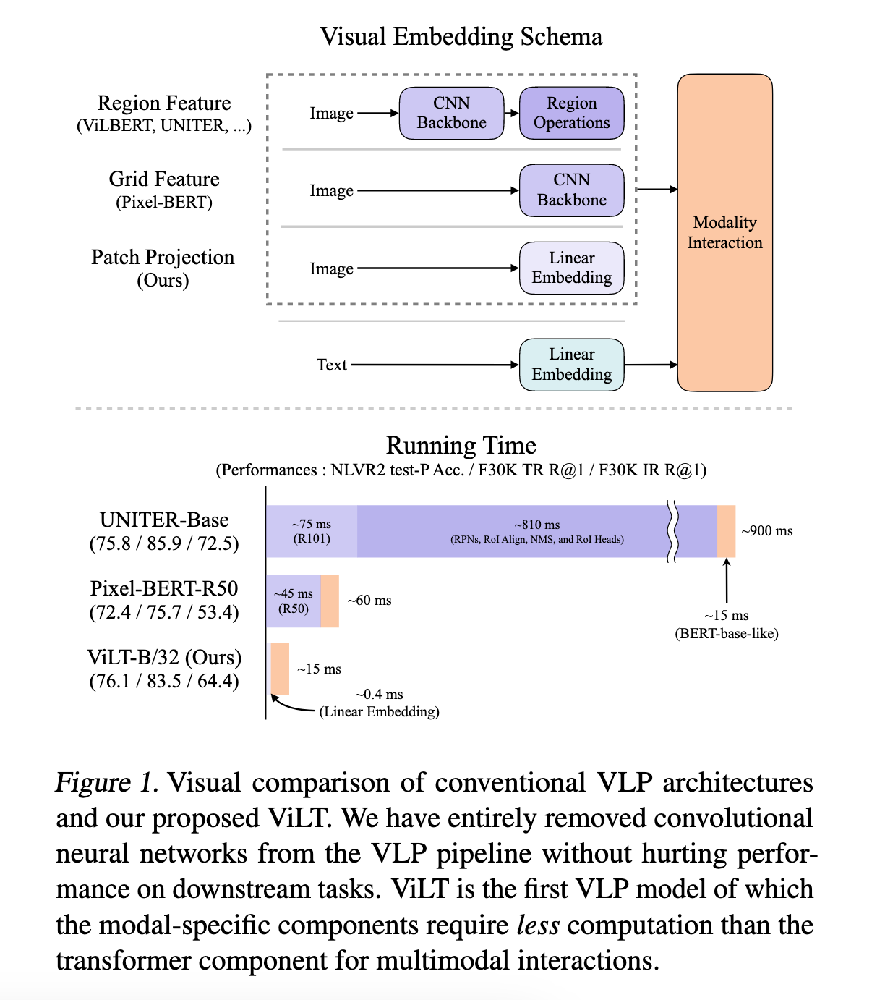
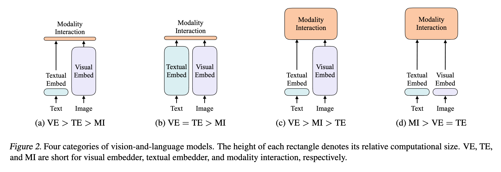
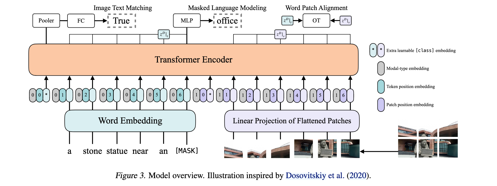

`ViLT: Vision-and-Language Transformer  Without Convolution or Region Supervision 论文简析` 

<!-- more -->

> 论文链接: [ViLT: Vision-and-Language Transformer  Without Convolution or Region Supervision](https://arxiv.org/abs/2102.03334)
> 代码链接: [https://github.com/dandelin/vilt](https://github.com/dandelin/vilt)

## Introduction

视觉-语言预训练（VLP）领域中，传统的视觉特征提取主要有两种典型实现方案：

* **Region Feature（区域特征）**：通常使用预训练的目标检测器（如基于 Visual Genome 数据集训练的检测模型）来定位图像中的物体区域，并提取每个区域的特征。这种方法能够捕获较为精细的对象信息，是许多早期VLP模型的标准做法，但计算复杂且处理速度较慢。

* **Grid Feature（网格特征）**：用卷积神经网络（如 ResNet）对整张图像进行处理，将图像划分为固定大小的网格，通过卷积提取每个网格的视觉特征。这种方式避免了目标检测的步骤，提取速度相对更快，但仍依赖卷积架构，计算资源消耗仍然较大。

ViLT模型提出了一种极简化的视觉嵌入方案，摒弃了传统的目标检测和卷积视觉嵌入器，采用**无卷积的浅层线性投影**直接将图像块（patch）嵌入，并与文本token一同输入transformer处理。这样，ViLT不仅极大降低了模型参数和计算负担，实现了比基于区域特征的模型快数十倍、比基于网格特征的模型快至少四倍的推理速度，还在多项视觉-语言任务中取得了竞争力甚至更优的性能。

此外，ViLT首次引入了全词掩码和图像增强技术于视觉-语言预训练，进一步推动了模型的下游表现，展示了其轻量化设计在效率与性能上的优势。

**Contribution**:

1. 第一个基于patch projection的多模态预训练模型，其是首个使用patch projection来做visual embedding的方法。

2. 证明了可以将BERT的方法和Vison Transformer结合起来用于多模态transformer。

3. 体现了全词掩码在预训练时以及图像增强在微调时的重要性。

## Motivation

目前参数量最小的多模态Transformer方法。ViLT使用预训练的ViT来初始化交互的transformer，这样就可以直接利用交互层来处理视觉特征，不需要额外增加一个视觉encoder（如Faster-RCNN）。

## Method

现有的视觉语言模型的三种结构类别：

1. VE = Vision Embedding

2. TE = Text Embedding

3. MI = Modality Interaction

上图是4种不同类型的VLP模型示意图。其中每个矩形的高表示相对计算量大小，VE、TE和MI分别是visual embedding、text embedding和modality interaction的简写。

作者提出这4种类型的主要依据有两点：

1. 在参数或者计算上，两种模态是否保持平衡。

2. 在网络深层中，两种模态是否相互作用。

VSE、VSE++和SCAN属于(a)类型。对图像和文本独立使用encoder，图像的更重，文本的更轻，使用简单的点积或者浅层attention层来表示两种模态特征的相似性。

CLIP属于(b)类型。每个模态单独使用重的transformer encoder，使用池化后的图像特征点积计算特征相似性。

ViLBERT、UNTER和Pixel-BERT属于(c)类型。这些方法使用深层transformer进行交互作用，但是由于VE仍然使用重的卷积网络进行特征抽取，导致计算量依然很大。

**作者提出的ViLT属于(d)类型。ViLT是首个将VE设计的如TE一样轻量的方法，该方法的主要计算量都集中在模态交互上**。

## Modality Interaction Schema

模态交互部分可以分成两种方式：一种是**single-stream**(如BERT和UNITER)，另一种是**dual-stream**(如ViLBERT和LXMERT)。其中**single-stream**是对图像和文本concate然后进行交互操作，而**dual-stream**是不对图像和文本concate然后进行交互操作。**ViLT延用single-stream的交互方式**，因为**dual-stream会引入额外的计算量**。

现有的VLP模型的**text embedding**基本上都使用类BERT结构(图1)，但是**visual embedding**存在着差异。在大多数情况下，**visual embedding是现有VLP模型的瓶颈**。**visual embedding的方法总共有三大类**，其中**region feature**方法通常采用Faster R-CNN二阶段检测器提取region的特征，**grid feature**方法直接使用CNN提取grid的特征，**patch projection**方法将输入图片切片投影提取特征。**ViLT是首个使用patch projection来做visual embedding的方法**。

## Model Structure

**作者提出的ViLT可以认为是目前最简单的多模态Transformer方法。ViLT使用预训练的ViT来初始化交互的transformer，这样就可以直接利用交互层来处理视觉特征，不需要额外增加一个视觉encoder。**

文本特征输入部分，将文本看成一个词序列，通过**word embedding matrix**转化成**word embedding**，然后和**position embedding**进行相加，最后和**modal-type embedding**进行concate。

图像特征输入部分，将图像切块看成一个图像块序列，通过**linear projection**转化成**visual embedding**，然后和**postion embedding**进行相加，最后和**modal-type embedding**进行concate。

其中**word embedding**和**visual embedding**通过可学习的**modal-type embedding**标志位来区分，其中0标志位表示**word embedding**部分，1标志位表示**visual embedding**部分。

**wrod embedding**和**visual embedding**分别都嵌入了一个额外的可学习 `[class] embedding`，方便和下游任务对接。

### Pretraining Objectives

**ViLT预训练的优化目标有两个：一个是image text matching(ITM)，另一个是masked language modeling(MLM)。**

**ImageText Matching**：随机以0.5的概率将文本对应的图片替换成不同的图片，然后对文本标志位对应输出使用一个线性的**ITM head**将输出feature映射成一个二值logits，用来判断图像文本是否匹配。另外ViLT还设计了一个`word patch alignment (WPA)`来计算textual subset和visual subset的对齐分数。

**Masked Language Modeling**：MLM的目标是通过文本的上下文信息去预测masked的文本tokens。随机以0.15的概率mask掉tokens，然后文本输出接两层**MLP**预测mask掉的tokens。

**Whole Word Masking**：另外ViLT还使用了**whole word masking**技巧。**whole word masking**是将连续的子词tokens进行mask的技巧，避免了只通过单词上下文进行预测。比如将“giraffe”词tokenized成3个部分[“gi”, “##raf”, “##fe”]，可以mask成[“gi”, “[MASK]”, “##fe”]，模型会通过mask的上下文信息[“gi”，“##fe”]来预测mask的“##raf”，就会导致不利用图像信息。

## Conclusion

本文提出的方法在效率上大大提升且表现出相似的性能，相比于region feature的方法速度快了60倍，相比于grid feature的方法快了4倍，而且下游任务表现出相似甚至更好的性能。

缺点：

1、性能不够高，在一些数据集上的表现比不过C类方法，有可能因为对于现有的任务来说，因为数据集的bias，或者这个任务需要更多的视觉信息，因此需要更多得视觉部分，最后的效果才能好。

2、虽然推理时间快，但是训练速度很慢。只是结构上简化了多模态学习，但一般人还是玩不起。

