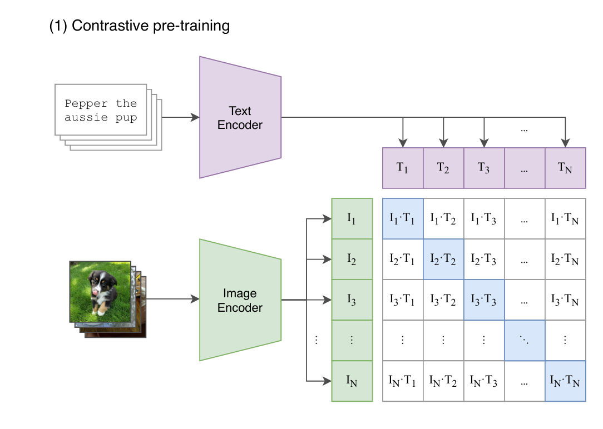
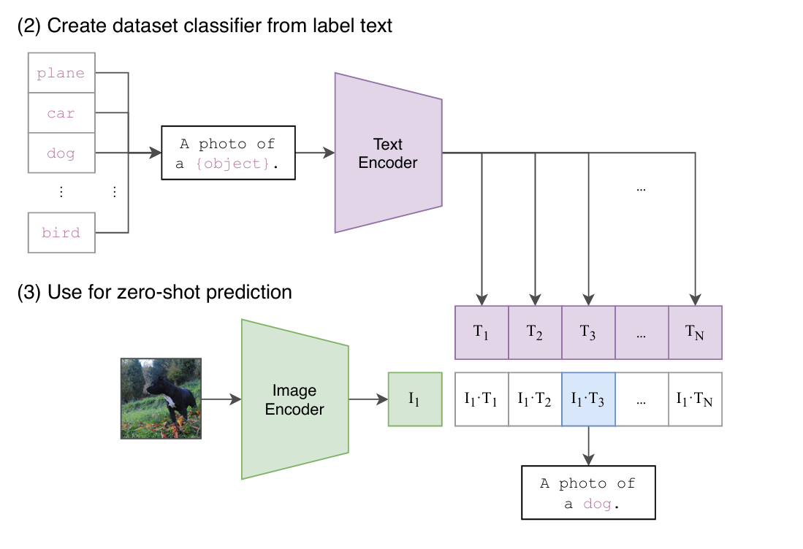
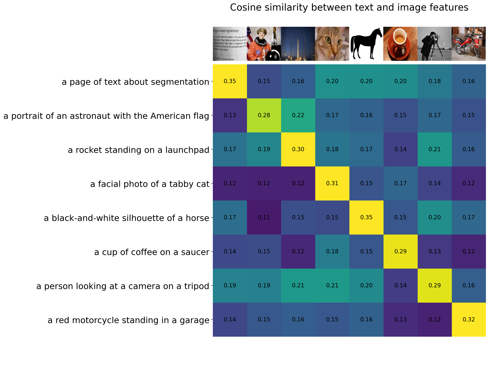
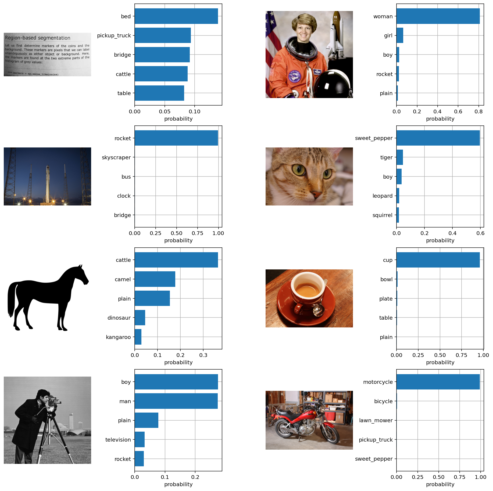
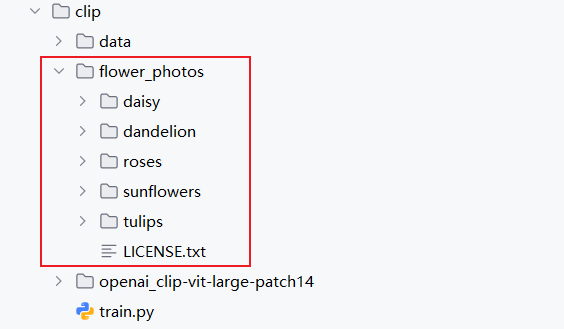
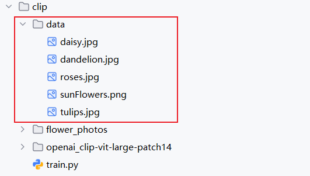
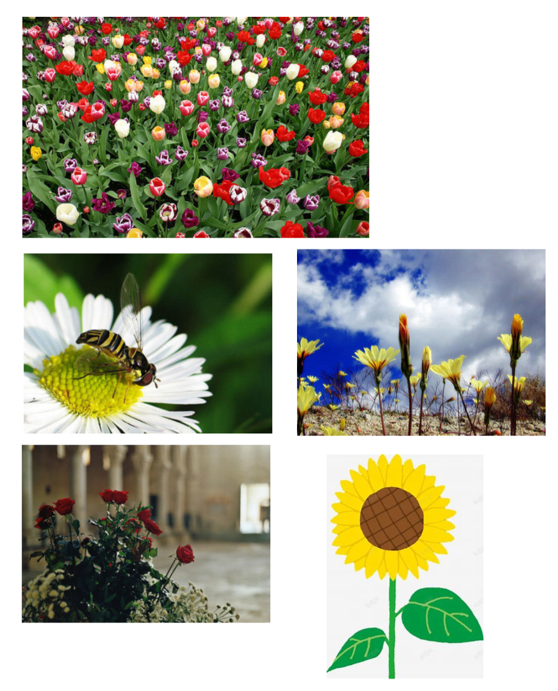
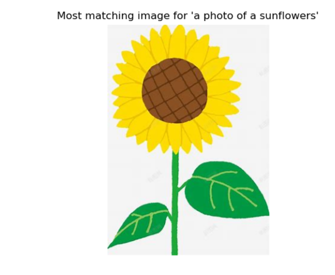

---
icon: file
category:
  - MMLLM
tag:
  - 多模态
  - 已发布
footer: 技术共建，知识共享
date: 2025-05-20
cover: assets/cover/CLIP.png
author:
  - BinaryOracle
---

`多模态模型CLIP原理与图片分类，文字搜索图像实战演练` 

<!-- more -->

# 庖丁解牛CLIP

> [CLIP原始论文链接](https://arxiv.org/pdf/2103.00020)

## 引言
2021 年可谓是视觉 Transformer（Vision Transformer）大放异彩的一年。自谷歌提出 ViT 之后，众多基于视觉 Transformer 的研究如潮水般涌来，广泛应用于各类计算机视觉任务。与此同时，OpenAI 在 2021 年 1 月发布的 [DALL-E](https://openai.com/blog/dall-e/) 和 [CLIP](https://openai.com/blog/clip/)，同样给计算机视觉领域带来了巨大影响。**这两个模型都属于融合图像与文本的多模态模型，其中 DALL-E 是基于文本输入来生成图像的模型，而 CLIP 则是以文本作为监督信号，训练出具有可迁移能力的视觉模型**。和 ViT 类似，DALL-E 和 CLIP 的出现也掀起了新一轮的研究热潮。

## 介绍

CLIP的英文全称为**Contrastive Language-Image Pre-training**，它代表着一种**基于对比文本-图像对的预训练方法**，同时也指运用该方法构建的模型。**CLIP属于基于对比学习的多模态模型**。与计算机视觉（CV）领域中的一些对比学习方法，像MoCo和SimCLR有所不同，CLIP的训练数据采用的是文本-图像对，也就是一张图像搭配与之对应的文本描述。**在训练过程中，借助对比学习机制，期望模型能够学习到文本和图像之间的匹配关系**。

### 训练 

**CLIP包含两个核心模型，分别是文本编码器（Text Encoder）和图像编码器（Image Encoder）**。其中，文本编码器的作用是提取文本的特征，在实现时可采用自然语言处理（NLP）领域常用的文本Transformer模型；而图像编码器则用于提取图像的特征，在实际应用中可以选用常见的卷积神经网络（CNN）模型，也可以采用视觉Transformer模型。 



这里对提取的文本特征和图像特征进行对比学习。对于一个包含$N$个文本-图像对的训练batch，将$N$个文本特征和$N$个图像特征两两组合，CLIP模型会预测出$N^2$个可能的文本-图像对的相似度，**这里的相似度直接计算文本特征和图像特征的余弦相似性（cosine similarity）**，即上图所示的矩阵。这里共有$N$个正样本，即真正属于一对的文本和图像（矩阵中的对角线元素），而剩余的$N^2 - N$个文本-图像对为负样本，那么CLIP的训练目标就是最大$N$个正样本的相似度，同时最小化$N^2 - N$个负样本的相似度，对应的伪代码实现如下所示：

```python
# image_encoder - ResNet or Vision Transformer
# text_encoder - CBOW or Text Transformer
# I[n, h, w, c] - minibatch of aligned images
# T[n, l] - minibatch of aligned texts
# W_i[d_i, d_e] - learned proj of image to embed
# W_t[d_t, d_e] - learned proj of text to embed
# t - learned temperature parameter

# 分别提取图像特征和文本特征
I_f = image_encoder(I) #[n, d_i]
T_f = text_encoder(T) #[n, d_t]

# 对两个特征进行线性投射，得到相同维度的特征，并进行l2归一化
I_e = l2_normalize(np.dot(I_f, W_i), axis=1)
T_e = l2_normalize(np.dot(T_f, W_t), axis=1)

# 计算缩放的余弦相似度：[n, n]
logits = np.dot(I_e, T_e.T) * np.exp(t)

# 对称的对比学习损失：等价于N个类别的cross_entropy_loss
labels = np.arange(n) # 对角线元素的labels
loss_i = cross_entropy_loss(logits, labels, axis=0)
loss_t = cross_entropy_loss(logits, labels, axis=1)
loss = (loss_i + loss_t)/2
```
为了训练CLIP模型，OpenAI从网络上收集了总计**4亿对文本和图像**，这些数据在论文中被称为**WebImageText**。若以文本单词数量来衡量，其规模与GPT-2训练时使用的WebText数据集相似。然而，从数据对的数量来看，**它比谷歌的JFT-300M数据集还要多出1亿对**，因此这是一个非常庞大的数据集。

尽管CLIP是一个多模态模型，**但其主要目的是训练可迁移的视觉模型**。在论文中，文本编码器（Text Encoder）选择了一个包含6300万参数的Transformer模型，而图像编码器（Image Encoder）则采用了两种不同的架构：
- 一种是常用的CNN架构ResNet。
- 另一种是基于 Transformer 的ViT。

ResNet包含五种不同尺寸的模型：ResNet50、ResNet101、RN50x4、RN50x16和RNx64（后三种模型是按照EfficientNet的缩放规则对ResNet分别放大4倍、16倍和64倍得到的），而ViT则选择了三种不同尺寸的模型：ViT-B/32、ViT-B/16和ViT-L/14。

所有模型均训练了32个周期，使用AdamW优化器，并且在训练过程中采用了一个相对较大的批次大小：32768。由于数据量巨大，最大的ResNet模型RN50x64需要在592个V100 GPU上训练18天，而最大的ViT模型ViT-L/14则需要在256个V100 GPU上训练12天，**这表明训练CLIP模型需要消耗大量的资源**。对于ViT-L/14模型，还在336的分辨率下额外进行了一个周期的微调（finetune）以增强性能，论文发现这个模型的效果最佳，并将其标记为**ViT-L/14@336**，论文中进行对比实验的CLIP模型也采用了这一配置。

### 推理

我们已经探讨了CLIP模型的运作机制，它由两个部分组成：一个视觉模型和一个文本模型。那么，如何将这个预训练的视觉模型应用到新的任务中呢？**CLIP模型的一个显著优势是它能够进行zero-shot图像分类**，这意味着它能够在没有任何特定任务训练数据的情况下，直接对图像进行分类。这不仅展示了CLIP的强大功能，也是其一大亮点。实现zero-shot分类的过程相当直接，可以概括为以下两个主要步骤：

1. **构建描述文本并提取特征**：首先，根据任务的分类需求，为每个类别创建一个描述性的文本，例如“A photo of {label}”。这些文本随后被输入到文本编码器（Text Encoder）中，以生成相应的文本特征。如果有$N$个类别，那么就会得到$N$个文本特征。

2. **图像特征提取与分类**：接下来，将待分类的图像输入到图像编码器（Image Encoder）中，以获取图像特征。然后，这些图像特征会与之前得到的$N$个文本特征进行余弦相似度计算（这一过程与训练时相同）。最终，选择与图像特征相似度最高的文本所对应的类别，作为图像的分类预测结果。此外，这些相似度值可以被视为logits，通过softmax函数转换后，可以得到每个类别的预测概率。

通过这种方式，CLIP模型能够在没有特定任务训练数据的情况下，直接对图像进行分类，这展示了其在图像分类任务中的灵活性和强大能力。


显然，我们通过利用CLIP模型的多模态能力，**为特定任务动态构建了一个分类器。在这个过程中，文本编码器（Text Encoder）生成的文本特征相当于分类器的权重，而图像编码器（Image Encoder）提取的图像特征则是分类器的输入数据**。[以下是一个官方给出的CLIP模型的示例](https://github.com/openai/CLIP/blob/main/notebooks/Interacting_with_CLIP.ipynb) ，该示例中的任务涉及8个类别:

1. 我们首先创建了各类别的文本描述，然后提取了相应的文本特征；
2. 然后我们读取要预测的图像，输入Image Encoder提取图像特征，并计算与文本特征的余弦相似度。

```python
# 1. 提取文本特征
texts = [
    "a page of text about segmentation",
    "a facial photo of a tabby cat",
    "a portrait of an astronaut with the American flag",
    "a rocket standing on a launchpad",
    "a red motorcycle standing in a garage",
    "a person looking at a camera on a tripod",
    "a black-and-white silhouette of a horse",
    "a cup of coffee on a saucer"
]

text_tokens = clip.tokenize(["This is " + desc for desc in texts]).cuda()

with torch.no_grad():
    text_features = model.encode_text(text_tokens).float()

# 2. 提取图像特征
image_input = torch.tensor(np.stack(images)).cuda()
     
with torch.no_grad():
    image_features = model.encode_image(image_input).float()

# 3. 计算余弦相似度 
image_features /= image_features.norm(dim=-1, keepdim=True)
text_features /= text_features.norm(dim=-1, keepdim=True)
similarity = text_features.cpu().numpy() @ image_features.cpu().numpy().T      
```

相似度如下所示，可以看到对于要预测的8个图像，按照最大相似度，其均能匹配到正确的文本标签：



进一步地，我们也可以对得到的余弦相似度计算softmax，得到每个预测类别的概率值：

```python
text_probs = (100.0 * image_features @ text_features.T).softmax(dim=-1)
top_probs, top_labels = text_probs.cpu().topk(5, dim=-1)
```
得到的预测概率如下所示，可以看到8个图像，CLIP模型均能够以较高的置信度给出正确的分类结果：


### 文本描述生成
在使用CLIP模型进行zero-shot分类时，除了模型本身的应用，文本描述的生成也是一个关键环节。在之前的例子中，我们使用了`“A photo of {label}”`这样的格式来生成文本描述，但实际上，我们还有其他的选择。例如，我们可以直接使用类别标签作为文本描述。这种方法实际上与NLP领域的一个研究方向——**prompt learning或prompt engineering—**—紧密相关。关于这一领域的详细综述，可以参考论文[《Pre-train, Prompt, and Predict: A Systematic Survey of Prompting Methods in Natural Language Processing》](https://arxiv.org/abs/2107.13586)。

**简单来说，prompt learning的核心思想是通过设计合适的prompt（提示），使得预训练模型能够直接应用于下游任务**。这与传统的预训练加微调的方法有所不同。论文指出，如果我们直接使用类别标签作为文本描述，由于这些文本往往只是一个单词，缺乏具体的上下文，并且与CLIP模型的训练数据不完全一致，因此在效果上可能不如使用`“A photo of {label}”`这种格式（在ImageNet数据集上可以提升1.3%的效果）。

此外，论文还实验了使用80个不同的prompt进行集成，结果发现在ImageNet数据集上能够带来3.5%的性能提升。具体的实验结果可以参考CLIP公开的[notebook](https://github.com/openai/CLIP/blob/main/notebooks/Prompt_Engineering_for_ImageNet.ipynb)。


## 花卉图片分类
本节我们将基于CLIP预训练模型实现Zero-Shot推理，训练使用到的数据集和AlexNet保持一致，因此这里就不再给出数据集下载链接了。

> [图片分类实战 – 分别基于LeNet，AlexNet，VGG进行实现](https://blog.csdn.net/m0_53157173/article/details/145661875?spm=1001.2014.3001.5501)

$1.加载预训练模型$

```python
# 预训练模型名称
model_name = "openai/clip-vit-large-patch14"
# 定义当前目录
current_dir = os.getcwd()
model_dir = os.path.join(current_dir, model_name.replace("/", "_"))

# 检查当前目录是否有预训练权重文件，如果没有则下载
def download_pretrained_weights_if_needed(model_name, save_dir):
    if not os.path.exists(save_dir):
        try:
            print(f"Downloading {model_name} to {save_dir}...")
            snapshot_download(repo_id=model_name, local_dir=save_dir, local_dir_use_symlinks=False)
            print(f"{model_name} downloaded successfully.")
        except Exception as e:
            print(f"Error downloading {model_name}: {e}")


download_pretrained_weights_if_needed(model_name, model_dir)

# 加载模型和处理器
model = CLIPModel.from_pretrained(model_dir)
processor = CLIPProcessor.from_pretrained(model_dir)

device = torch.device("cuda" if torch.cuda.is_available() else "cpu")
model = model.to(device)
```
在 `openai/clip-vit-large-patch14` 这个 CLIP 预训练模型中，图像编码器采用了 `Vision Transformer（ViT）`架构，具体使用的是 `ViT-L/14 ` 版本，文本编码器使用的是基于 `Transformer` 的架构。

$2. 文本嵌入生成函数$

```python
# 函数：生成文本嵌入
def text_embedding(texts):
    inputs = processor(text=texts, return_tensors="pt", padding=True).to(device)
    with torch.no_grad():
        embeddings = model.get_text_features(**inputs)
    return embeddings.cpu().numpy()
```

这个函数的作用是将输入的文本转化为对应的嵌入表示（embedding）。它通过处理器对输入文本进行处理，使其符合模型的输入要求，然后利用模型获取文本特征，最后将结果转换为 numpy 数组格式返回，方便后续的计算和比较。

$3. 图片嵌入生成函数$

```python
def get_image_embeddings(image_paths):
    images = []
    for image_path in image_paths:
        try:
            image = Image.open(image_path).convert("RGB")
            images.append(image)
        except Exception as e:
            print(f"Error loading image {e}")
    if not images:
        return None
    inputs = processor(images=images, return_tensors="pt").to(device)
    with torch.no_grad():
        image_features = model.get_image_features(**inputs)
    return image_features.cpu().numpy()
```
该函数作用是针对给定的图片路径，读取图片并将其转换为合适的格式后，通过模型获取图片的特征嵌入。如果在读取图片过程中出现错误，会进行相应的错误提示并返回 None。

$3.余弦相似度计算函数$

```python
def cosine_similarity(vec1, vec2):
    vec1 = np.array(vec1)
    vec2 = np.array(vec2)
    return np.dot(vec1, vec2.T) / (np.linalg.norm(vec1, axis=1, keepdims=True) * np.linalg.norm(vec2, axis=1))
```
在图文检索中，我们常常需要衡量文本嵌入和图片嵌入之间的相似度，这里采用了余弦相似度的计算方法。它将输入的向量转换为 numpy 数组后，按照余弦相似度的数学公式来计算两者的相似度数值。

$4. 预测$

**首先，我们需要根据上面给出的花卉数据集下载链接，将数据下载到当前项目目录下:**


**其次，我们从flower_photos目录下读取出所有图片的路径:**

```python
# 递归遍历目录获取所有图片路径
def get_all_image_paths(directory):
    image_paths = []
    for root, _, files in os.walk(directory):
        for file in files:
            file_extension = os.path.splitext(file)[1].lower()
            if file_extension in ['.png', '.jpg', '.jpeg']:
                image_paths.append(os.path.join(root, file))
    return image_paths

image_paths = get_all_image_paths("./flower_photos")
```
**同时将flower_photos下的子目录名作为我们的候选待匹配分类文本列表，并改造为`a photo of  子目录名`的格式，然后计算每个分类文本对应的文本嵌入向量:**

```python
# 获取候选分类名列表
def get_candidates(directory):
    candidates = []
    for sub_dir in os.listdir(directory):
        sub_dir_path = os.path.join(directory, sub_dir)
        if os.path.isdir(sub_dir_path):
            candidates.append(f"a photo of {sub_dir}")
    return candidates
    
candidates = get_candidates("./flower_photos")
text_embeddings = text_embedding(candidates)
```
**最后:**
1. 分批次从图像列表中取出一批图像，获取其对应的图像嵌入向量列表
2. 计算这批图像嵌入向量中每一个图像嵌入向量和我们所有分类文本嵌入向量的余弦相似度
3. 针对每个图像嵌入向量取出和其相似度最高的那个文本嵌入向量的索引
4. 判断预测是否正确，统计正确率
```python
# 测试图片分类正确率
def accuracy(image_paths, candidates, text_embeddings, batch_size=64):
    correct_count = 0
    total_count = len(image_paths)
    num_batches = (total_count + batch_size - 1) // batch_size
    # 分批次预测
    for i in range(num_batches):
        start_idx = i * batch_size
        end_idx = min(start_idx + batch_size, total_count)
        # 取出当前批次的图像列表，并获得该批次图像列表对应的图像嵌入向量列表
        batch_image_paths = image_paths[start_idx:end_idx]
        image_embeddings = get_image_embeddings(batch_image_paths)
        
        if image_embeddings is not None:
            # 计算图像嵌入向量列表中每个图像对应的嵌入向量和传入的分类文本嵌入向量的余弦相似度
            similarities = cosine_similarity(image_embeddings, text_embeddings)
            # 针对每个图像嵌入向量获取和其相似度最高的分类文本嵌入向量索引下标
            predicted_indices = np.argmax(similarities, axis=1)
            
            for j, predicted_index in enumerate(predicted_indices):
                # 针对每张图像，根据上述计算得到的和其相似度最高的分类文本索引，从候选分类文本集合中取出其分类名词
                predicted_category = candidates[predicted_index].split(" ")[-1]
                # 用当前图片外层目录的名字作为其分类名词
                actual_category = os.path.basename(os.path.dirname(batch_image_paths[j]))
                # 比较两个分类名词是否相等
                if predicted_category == actual_category:
                    correct_count += 1

    accuracy = correct_count / total_count
    return accuracy
    
# 图片分类
def flowerClassify():
    image_paths = get_all_image_paths("./flower_photos")
    candidates = get_candidates("./flower_photos")
    text_embeddings = text_embedding(candidates)
    start_time = time.time()
    acc = accuracy(image_paths, candidates, text_embeddings, batch_size=64)
    end_time = time.time()
    print(f"Time taken to test accuracy: {end_time - start_time:.2f} seconds")
    print(f"Accuracy: {acc * 100:.2f}%")
```
$5.预测结果$

```python
Time taken to test accuracy: 396.62 seconds
Accuracy: 95.48%
```

## 文字搜索图像
上面的花卉分类案例相当于使用图像去匹配最合适的文本描述，而这里我们将会反转这个逻辑，用文本描述去匹配最合适的图片内容。

为了实现文字搜索图像的功能，我们只需要在计算出相似度得分矩阵后，以每个文本描述为一行，取出该行中得分最大的那一列，即为与当前文本描述相似度最高的那副图片，具体代码实现如下：

```python
# 找到与文本最匹配的图片
def find_most_matching_image(text, image_paths):
    text_emb = text_embedding([text])
    image_embeddings = get_image_embeddings(image_paths)
    if image_embeddings is None:
        return None
    similarities = cosine_similarity(text_emb, image_embeddings)
    most_matching_index = np.argmax(similarities)
    return image_paths[most_matching_index]
```
下面来实际展示一下效果，首先我们用data目录充当我们的图片库来源:


遍历data目录，拿到所有图片路径:

```python
# 遍历 data 目录获取所有图片路径
def get_images_from_data_dir():
    data_dir = os.path.join(current_dir, 'data')
    if not os.path.exists(data_dir):
        print(f"Data directory {data_dir} does not exist.")
        return []
    return get_all_image_paths(data_dir)
```
这里以搜索向日葵花为例，我们首先获取图片库中所有图片，然后计算出和当前文本描述相似度最高的那副图片，并将图片展示出来:
```python
# 根据文字搜索图片
def searchPicByText():
    image_paths = get_images_from_data_dir()
    query_text = "a photo of a sunflowers"
    most_matching_image = find_most_matching_image(query_text, image_paths)
    if most_matching_image:
        print(f"The most matching image for '{query_text}' is: {most_matching_image}")
        try:
            img = Image.open(most_matching_image)
            plt.imshow(img)
            plt.axis('off')
            plt.title(f"Most matching image for '{query_text}'")
            plt.show()
        except Exception as e:
            print(f"Error opening image: {e}")
    else:
        print("No matching image found.")
```
图片库中的图片：

运行上述代码，搜索出来的图片:




## 完整代码

```python
import time
from matplotlib import pyplot as plt
from transformers import CLIPProcessor, CLIPModel
import torch
from PIL import Image
import numpy as np
import warnings
import os
from huggingface_hub import snapshot_download

warnings.filterwarnings("ignore")

# 模型名称
model_name = "openai/clip-vit-large-patch14"
# 定义当前目录
current_dir = os.getcwd()
model_dir = os.path.join(current_dir, model_name.replace("/", "_"))

# 检查当前目录是否有预训练权重文件，如果没有则下载
def download_pretrained_weights_if_needed(model_name, save_dir):
    if not os.path.exists(save_dir):
        try:
            print(f"Downloading {model_name} to {save_dir}...")
            snapshot_download(repo_id=model_name, local_dir=save_dir, local_dir_use_symlinks=False)
            print(f"{model_name} downloaded successfully.")
        except Exception as e:
            print(f"Error downloading {model_name}: {e}")

download_pretrained_weights_if_needed(model_name, model_dir)

# 加载模型和处理器
model = CLIPModel.from_pretrained(model_dir)
processor = CLIPProcessor.from_pretrained(model_dir)

device = torch.device("cuda" if torch.cuda.is_available() else "cpu")
model = model.to(device)

# 函数：生成文本嵌入
def text_embedding(texts):
    inputs = processor(text=texts, return_tensors="pt", padding=True).to(device)
    with torch.no_grad():
        embeddings = model.get_text_features(**inputs)
    return embeddings.cpu().numpy()

def get_image_embeddings(image_paths):
    images = []
    for image_path in image_paths:
        try:
            image = Image.open(image_path).convert("RGB")
            images.append(image)
        except Exception as e:
            print(f"Error loading image {e}")
    if not images:
        return None
    inputs = processor(images=images, return_tensors="pt").to(device)
    with torch.no_grad():
        image_features = model.get_image_features(**inputs)
    return image_features.cpu().numpy()

def cosine_similarity(vec1, vec2):
    vec1 = np.array(vec1)
    vec2 = np.array(vec2)
    return np.dot(vec1, vec2.T) / (np.linalg.norm(vec1, axis=1, keepdims=True) * np.linalg.norm(vec2, axis=1))

# 递归遍历目录获取所有图片路径
def get_all_image_paths(directory):
    image_paths = []
    for root, _, files in os.walk(directory):
        for file in files:
            file_extension = os.path.splitext(file)[1].lower()
            if file_extension in ['.png', '.jpg', '.jpeg']:
                image_paths.append(os.path.join(root, file))
    return image_paths

# 获取候选分类名列表
def get_candidates(directory):
    candidates = []
    for sub_dir in os.listdir(directory):
        sub_dir_path = os.path.join(directory, sub_dir)
        if os.path.isdir(sub_dir_path):
            candidates.append(f"a photo of {sub_dir}")
    return candidates

# 测试图片分类正确率
def accuracy(image_paths, candidates, text_embeddings, batch_size=64):
    correct_count = 0
    total_count = len(image_paths)
    num_batches = (total_count + batch_size - 1) // batch_size

    for i in range(num_batches):
        start_idx = i * batch_size
        end_idx = min(start_idx + batch_size, total_count)
        batch_image_paths = image_paths[start_idx:end_idx]

        image_embeddings = get_image_embeddings(batch_image_paths)
        if image_embeddings is not None:
            similarities = cosine_similarity(image_embeddings, text_embeddings)
            predicted_indices = np.argmax(similarities, axis=1)

            for j, predicted_index in enumerate(predicted_indices):
                predicted_category = candidates[predicted_index].split(" ")[-1]
                actual_category = os.path.basename(os.path.dirname(batch_image_paths[j]))
                if predicted_category == actual_category:
                    correct_count += 1

    accuracy = correct_count / total_count
    return accuracy

# 图片分类
def flowerClassify():
    image_paths = get_all_image_paths("./flower_photos")
    candidates = get_candidates("./flower_photos")
    text_embeddings = text_embedding(candidates)
    start_time = time.time()
    acc = accuracy(image_paths, candidates, text_embeddings, batch_size=64)
    end_time = time.time()
    print(f"Time taken to test accuracy: {end_time - start_time:.2f} seconds")
    print(f"Accuracy: {acc * 100:.2f}%")


##################################################################################################3

# 遍历 data 目录获取所有图片路径
def get_images_from_data_dir():
    data_dir = os.path.join(current_dir, 'data')
    if not os.path.exists(data_dir):
        print(f"Data directory {data_dir} does not exist.")
        return []
    return get_all_image_paths(data_dir)


# 找到与文本最匹配的图片
def find_most_matching_image(text, image_paths):
    text_emb = text_embedding([text])
    image_embeddings = get_image_embeddings(image_paths)
    if image_embeddings is None:
        return None
    similarities = cosine_similarity(text_emb, image_embeddings)
    most_matching_index = np.argmax(similarities)
    return image_paths[most_matching_index]


# 根据文字搜索图片
def searchPicByText():
    image_paths = get_images_from_data_dir()
    query_text = "a photo of a sunflowers"
    most_matching_image = find_most_matching_image(query_text, image_paths)
    if most_matching_image:
        print(f"The most matching image for '{query_text}' is: {most_matching_image}")
        try:
            img = Image.open(most_matching_image)
            plt.imshow(img)
            plt.axis('off')
            plt.title(f"Most matching image for '{query_text}'")
            plt.show()
        except Exception as e:
            print(f"Error opening image: {e}")
    else:
        print("No matching image found.")
```


## 小结
在计算机视觉领域，常见的迁移学习方法是首先在大规模数据集（如ImageNet）上进行预训练，然后在具体的下游任务上进行微调。这种预训练通常是基于有监督学习的，需要大量的数据标注，因此成本较高。近年来，出现了一些基于**自监督**的方法，包括基于**对比学习的方法**（如MoCo和SimCLR）和**基于图像掩码的方法**（如MAE和BeiT）。自监督方法的优势在于不再需要标注数据。**然而，无论是有监督还是自监督方法，在迁移到下游任务时，都需要进行有监督微调，无法实现zero-shot学习**。对于有监督模型，由于它们在预训练数据集上采用固定类别数的分类器，因此在新的数据集上需要定义新的分类器来重新训练。对于自监督模型，代理任务通常是辅助进行表征学习，在迁移到其他数据集时也需要加上新的分类器进行有监督训练。

然而，在NLP领域，基于自回归或语言掩码的预训练方法已经相对成熟，预训练模型很容易直接zero-shot迁移到下游任务，例如OpenAI的GPT-3。这种差异一方面是由于文本和图像属于两个完全不同的模态，另一个原因是NLP模型可以利用从互联网上收集的大量文本。因此，问题来了：**能否基于互联网上的大量文本来预训练视觉模型？**

实际上，之前已经有一些研究工作探讨了使用文本作为监督信号来训练视觉模型。例如，2016年的工作[《Learning Visual Features from Large Weakly Supervised Data》](https://arxiv.org/abs/1511.02251)将这个问题转化为一个多标签分类任务，预测图像对应的文本的词袋模型；2017年的工作[《Learning Visual N-Grams from Web Data》](https://arxiv.org/abs/1612.09161)进一步扩展了这个方法来预测n-grams。最近的一些工作采用新的模型架构和预训练方法来从文本学习视觉特征，例如[VirTex](https://arxiv.org/abs/2006.06666)基于transformer的语言模型，[ICMLM](https://arxiv.org/abs/2008.01392)基于语言掩码的方法，[ConVIRT](https://arxiv.org/abs/2010.00747)基于对比学习的方法。总体来看，这方面的工作并不多，主要是因为这些方法难以实现较高的性能，例如2017年的那篇工作只在ImageNet上实现了11.5%的zero-shot性能，这远远低于ImageNet上的SOTA。此外，还有另一个方向，即基于文本弱监督来提升性能，例如谷歌的[BiT](https://arxiv.org/abs/1912.11370)和[ViT](https://arxiv.org/abs/2010.11929)基于JFT-300M数据集来预训练模型在ImageNet上取得SOTA。JFT-300M数据集是谷歌从互联网上收集的，通过一些自动化的手段将web text转化为18291个类别，但存在一定的噪声。尽管谷歌基于JFT-300M数据集取得了较好的结果，但这些模型仍然采用固定类别的softmax分类器进行预训练，这大大限制了它们的迁移能力和扩展性。

**谷歌采用的弱监督方法与以往方法的一个主要区别在于规模，或者说在于计算能力和数据集的规模**。JFT-300M数据集的规模达到了上亿级别，谷歌利用强大的计算能力进行了预训练。相比之下，VirTex、ICMLM和ConVIRT仅在10万级别的数据上训练了几天。为了弥补数据规模上的差距，OpenAI从网络上收集了4亿条数据进行实验。然而，新的问题出现了：**应该采用什么样的方法来进行训练**。

OpenAI首先尝试了VirTex模型，该模型联合训练一个CNN和文本transformer来预测图像的文本描述（image caption），但发现这种方法的训练效率（根据ImageNet数据集上的zero-shot性能评估）还不如直接预测词袋模型（bag of words），两者的训练效率相差3倍。如果进一步采用ConVIRT，即基于对比学习的方法，训练效率可以提高4倍。出现这种差异的原因不难理解，因为训练数据集中的文本-图像对是从互联网收集的，存在一定的噪声，即文本和图像可能不完全匹配。在这种情况下，适当降低训练目标反而可能取得更好的效果。

从任务难度来看，排序为：Transformer Language Model > Bag of Words Prediction > Bag of Words Contrastive (CLIP)。由于训练数据量和模型计算量较大，训练效率成为一个至关重要的因素。因此，作者最终选择了对比学习方法来进行训练。
