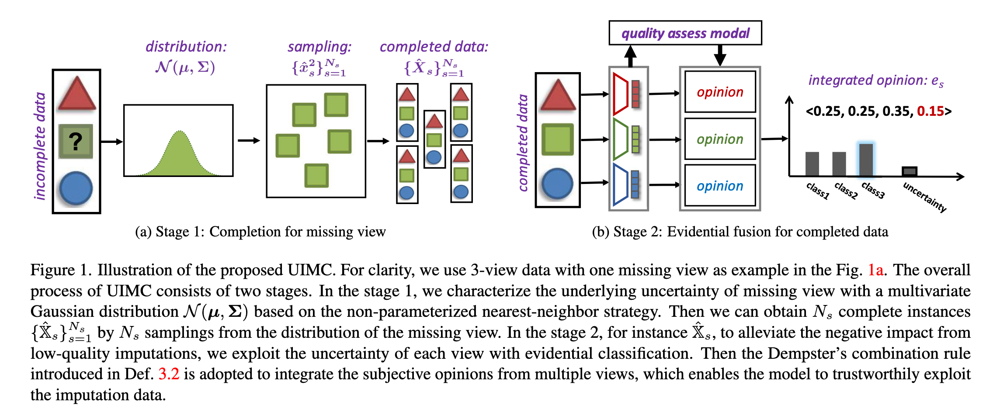
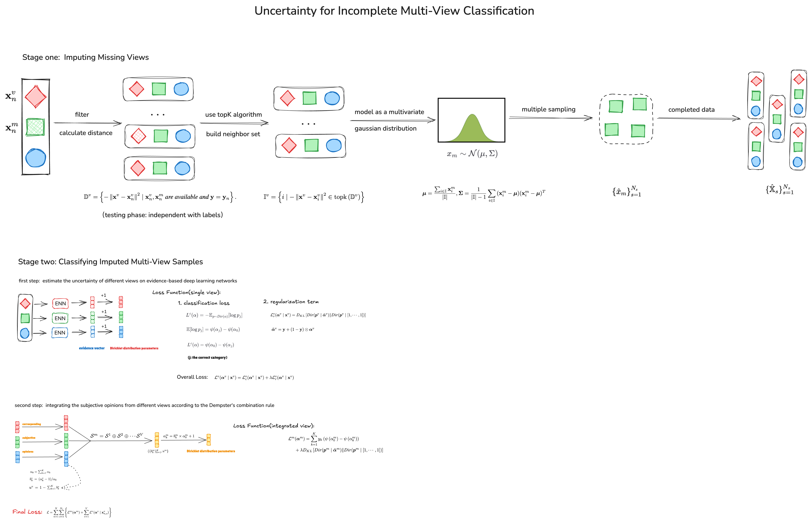
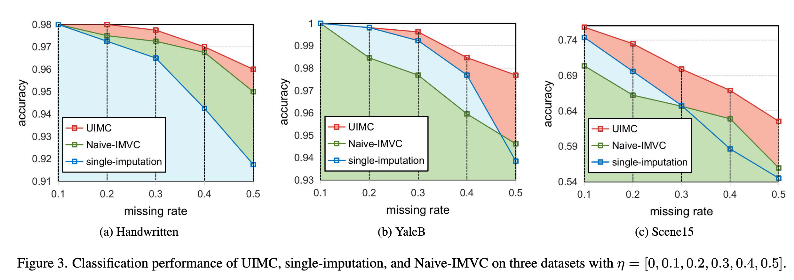
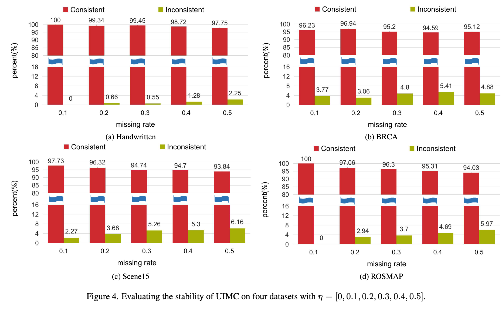

`Exploring and Exploiting Uncertainty for Incomplete Multi-View Classification 论文` 

<!-- more -->

> 论文链接: [https://arxiv.org/abs/2304.05165](https://arxiv.org/abs/2304.05165)

## 引言

**面临的问题:**   多视图学习相较于单视图能够利用互补性信息，在聚类、分类和表示学习上表现更佳。但由于视图缺失带来的 **高不确定性**，如何在缺失情况下实现稳定、可信的分类仍是难题。

---

**现存解决方法:** 现有的不完整多视图分类（IMVC）方法大体分为两类：

* 一类仅依赖可观测视图进行分类 [8, 9]，不进行插补。但当缺失率较高时，难以充分利用视图间相关性，效果欠佳。

* 另一类利用深度学习（如自编码器 [14, 15]、GAN [16]）对缺失视图进行插补，然后用完整数据分类 [10–13]。但其存在三个问题：

    1. 可解释性不足；
  
    2. 采用**确定性插补**，**无法刻画缺失视图的不确定性**，导致分类不稳定；
  
    3. 面对复杂缺失模式（尤其是多于两个视图的情况）时缺乏灵活性。

---

**提出的方法:**: 提出**不确定性驱动的不完整多视图分类模型（UIMC）** 来解决上述问题。核心思想是 **把缺失数据建模为分布而非单值**，并在此基础上进行采样和自适应融合：

* **分布建模**： 每个缺失视图通过条件分布进行建模，引入不确定性。

* **采样生成**： 从该分布中多次采样，将采样结果与观测视图组合，得到多个完整的多视图样本。

* **质量感知融合**： 由于采样结果本身的质量不确定，模型从两个层面自适应整合：

  * **单视图层面**：对低质量采样数据赋予更高不确定性，使其不干扰其他视图的学习；为此构建基于证据的分类器，输出 **主观概率 + 不确定性质量** 的观点。
  
  * **多视图层面**：通过 **Dempster-Shafer (DS) 规则** 融合多个视图观点，保证在不同质量视图下的可信整合。

---

**贡献总结**：

* 我们提出了一个“探索–利用”策略，通过刻画缺失数据的不确定性来进行不完整多视图分类，使得利用插补数据时既有效又可信。值得注意的是，UIMC 是首个在 IMVC 中显式引入不确定性的工作。

* 我们设计了从 **单视图与多视图融合** 两方面对插补数据进行加权的机制，以充分利用高质量数据并抑制低质量数据的负面影响；其中不确定性感知训练与融合显著提升了结果的稳定性与可靠性。

* 在多个包含不同特征类型或模态的数据集上进行实验，并采用多样化指标进行评估，结果表明 UIMC 在性能和可信度方面均超过现有方法，且能提供可靠的不确定性信息。

## 方法

### 缺失视图补全

在不完整多视图分类中，现有方法大多采用 **单一插补（single imputation）**。形式上，它们会构建一个确定性映射 $f: X \to \hat{X}$，把不完整实例 $X$ 转换为完整实例 $\hat{X}$。 这种方法的问题在于：

* 它忽略了缺失视图的 **高不确定性**；

* 插补结果不够可信，容易对下游分类造成负面影响；

* 类似现象在单视图缺失属性的分类任务中也已被证实 [18, 42]。

因此，本文不再采用确定性插补，而是 **利用分布来刻画缺失视图的不确定性**，并基于 **非参数化的近邻策略** 来实现。

---

**邻居集合的构建**：

设有一个训练实例 $X$，其标签为 $y$，但缺失了第 $m$ 个视图 $x_m$。目标是基于其他训练样本的信息来补全 $x_m$。

* 方法受到 $k$-近邻（$k$NN）[43] 的启发，采用非参数化策略，借助邻居样本来估计缺失视图的分布。

* 对于一个可用视图 $x_v \in X$ （$v \neq m$），我们寻找它在训练集中 **同类别** 样本的 $k$ 个最近邻。

  1. **距离集合 $D_v$**：
     对所有标签相同、且 $x_v^n$ 与 $x_m^n$ 均可用的样本，计算欧式距离：

     $$
     D_v = { -|x_v - x_v^n|_2 \mid x_v^n, x_m^n \ \text{可用且 } y = y_n }
     $$

  2. **邻居指标集合 $I_v$**：
     根据 $D_v$ 选取 $k$ 个最近邻：

     $$
     I_v = { i \mid -|x_v - x_v^i|_2 \in \text{topk}(D_v) }
     $$

     其中 $\text{topk}(\cdot)$ 表示取前 $k$ 个最小距离对应的邻居。

* **测试阶段**：由于测试样本的标签未知，缺失视图 $x_m$ 的插补仅依赖特征的相似性，不再依赖标签信息（即 *being independent with labels*）。

---

**基于统计信息的插补**：

得到所有邻居集合 $I = {I_v}_{v \neq m}$ 后，我们将缺失视图 $x_m$ 建模为一个 **多元高斯分布**：

* 邻居集合为 ${x_m^i}_{i \in I}$；

* 分布为 $x_m \sim \mathcal{N}(\mu, \Sigma)$，其均值向量与协方差矩阵由邻居样本统计得到：

$$
\mu = \frac{\sum_{i \in I} x_m^i}{|I|}
$$

$$
\Sigma = \frac{1}{|I|-1} \sum_{i \in I} (x_m^i - \mu)(x_m^i - \mu)^T
$$

* 由此可以对 $x_m$ 进行 **多次采样**，生成多个插补版本。

---

**生成完整训练实例**：

对于一个不完整的训练样本 $X$，通过在 $\mathcal{N}(\mu, \Sigma)$ 上采样 $N_s$ 次，可以得到 $N_s$ 个完整样本：

$$
{\hat{X}^s}_{s=1}^{N_s}
$$

该过程如 **图1a** 所示，形成了一个可感知不确定性的插补框架。

### 对补全后的多视图样本进行分类

在获得填补后的多视图训练数据集 $(\hat{X}_{n,s})_{n=1}^N{}_{s=1}^{N_s}$ 之后，我们考虑通过利用填补样本的不确定性来减轻低质量填补带来的负面影响。由于填补过程中的固有噪声，填补后的多视图数据通常具有较高的不确定性。因此，我们首先基于一种证据化的多视图学习框架来估计不同视图的不确定性，然后进行基于不确定性的决策融合。整体框架如图 1b 所示。

与传统分类算法不同，**证据分类** [44,45] 定义了一个理论框架，用于获得主观意见

$$
S = \{b_k\}_{k=1}^K, u
$$

其中包含 **主观概率（置信质量）** $\{b_k\}_{k=1}^K \geq 0$ 和 **整体不确定性质量** $u \geq 0$，其中 $K$ 表示类别数，并且满足：

$$
\sum_{k=1}^K b_k + u = 1.
$$

该主观意见与参数为 $\alpha = [\alpha_1, \cdots, \alpha_K]$ 的 Dirichlet 分布相关联。具体来说，置信质量 $b_k$ 可以由对应 Dirichlet 分布的参数推导得到：

$$
b_k = \frac{\alpha_k - 1}{\alpha_0}, \quad \alpha_0 = \sum_{k=1}^K \alpha_k,
$$

其中 $\alpha_0$ 称为 **Dirichlet 强度**。

为了获得每个视图 $\hat{x}_v \in \hat{X}$ 的 Dirichlet 分布参数，我们构建了 **证据神经网络**，其方法是将传统神经网络分类器的 softmax 层替换为 softplus 等激活函数，从而使其正输出能够被视为证据向量

$$
e_v = [e_1^v, \cdots, e_K^v].
$$

随后，视图 $\hat{x}_v$ 的 Dirichlet 分布参数 $\text{Dir}(p_v \mid \alpha_v)$ 可通过如下方式获得：

$$
\alpha_k^v = e_k^v + 1.
$$

在变分框架下，证据分类的损失函数 $L_v$ 是分类损失 $L_c^v$ 与正则项 $L_r^v$ 的组合 [46]。更具体地说，分类目标函数可以看作是传统交叉熵损失在由 Dirichlet 分布 $\text{Dir}(p_v \mid \alpha_v)$ 决定的单纯形上的积分。其形式为：

$$
L_c^v(\alpha_v \mid x_v) = \sum_{k=1}^K y_k \big(\psi(\alpha_0^v) - \psi(\alpha_k^v)\big), \tag{4}
$$

其中 $y_k$ 是标签 $y$ 的第 $k$ 个元素（独热编码形式），$\psi(\cdot)$ 是 **digamma 函数**。

为了获得合理的 Dirichlet 分布，我们为其增加一个先验作为正则化项：

$$
L_r^v(\alpha_v \mid x_v) = D_{\text{KL}}\big[\text{Dir}(p_v \mid \tilde{\alpha}_v) ,|, \text{Dir}(p_v \mid [1,\cdots,1])\big], \tag{5}
$$

其中

$$
\tilde{\alpha}_v = y + (1-y) \odot \alpha_v
$$

表示将对应标签的 $\alpha_k$ 替换为 1 后得到的 Dirichlet 分布，$\text{Dir}(p_v \mid [1,\cdots,1])$ 是均匀 Dirichlet 分布。

因此，每个视图的总体损失函数可写为：

$$
L_v(\alpha_v \mid x_v) = L_c^v(\alpha_v \mid x_v) + \lambda L_r^v(\alpha_v \mid x_v), \tag{6}
$$

其中 $\lambda$ 是一个退火系数，在训练过程中逐渐从 0 变化到 1，用于控制约束强度。通过最小化 $L_v$，可以得到 Dirichlet 分布 $\text{Dir}(p_v \mid \alpha_v)$。随后，相应的主观意见可以由下式导出：

$$
b_k^v = \frac{\alpha_k^v - 1}{\alpha_0^v}, \quad u_v = 1 - \sum_{k=1}^K b_k^v.
$$

接下来我们考虑如何根据不确定性将来自不同视图的主观意见进行融合。**Dempster-Shafer 证据理论**允许将来自不同来源的主观意见进行整合，从而产生更全面的意见 [47]。具体来说，两个视图的 **Dempster 融合规则**定义在定义 3.2 中。相应地，集成后的多视图主观意见可表示为：

$$
S_m = S_1 \oplus S_2 \oplus \cdots \oplus S_V = \{b_k^m\}_{k=1}^K, u_m.
$$

集成后的多视图 Dirichlet 分布 $\text{Dir}(p_m \mid \alpha_m)$ 的参数由下式获得：

$$
\alpha_k^m = b_k^m \cdot \alpha_0^m + 1.
$$

---

**定义 3.2（Dempster 融合规则）**

两个主观意见

$$
S_1 = \{b_k^1\}_{k=1}^K, u_1, \quad S_2 = \{b_k^2\}_{k=1}^K, u_2
$$

融合后的主观意见

$$
S = S_1 \oplus S_2
$$

可写作：

$$
b_k = \frac{1}{1-C}\big(b_k^1 b_k^2 + b_k^1 u_2 + b_k^2 u_1\big), \quad
u = \frac{1}{1-C}u_1 u_2, \tag{7}
$$

其中

$$
C = \sum_{i \neq j} b_i^1 b_j^2.
$$

---

为了同时获得可靠的单视图和集成 Dirichlet 分布，我们采用多任务策略。具体来说，分类阶段的最终损失函数由单视图和多视图的损失共同组成：

$$
L = \sum_{n=1}^N \sum_{s=1}^{N_s} \Big( L_m(\alpha_m) + \sum_{v=1}^V L_v(\alpha_v \mid x_{n,s}^v) \Big), \tag{8}
$$

其中

$$
L_m(\alpha_m) = \sum_{k=1}^K y_k \big(\psi(\alpha_0^m) - \psi(\alpha_k^m)\big) + \lambda D_{\text{KL}}\big[\text{Dir}(p_m \mid \tilde{\alpha}_m),|, \text{Dir}(p_m \mid [1,\cdots,1])\big]. \tag{9}
$$

个人绘制的完整方法执行流程:

### 预测

模型在测试时会为同一个缺失样本生成多个可能的补全版本，然后对这些补全样本分别进行分类预测，最终通过“多数投票”确定最终预测类别。

## 相关工作

### 不完整多视图学习

不完整多视图学习（IMVL）主要研究如何在部分视图缺失的情况下有效地利用多视图信息。根据处理缺失视图的方式不同，现有方法大致可以分为两类：**不补全方法（without imputation）** 和 **生成式补全方法（generative methods）**。

**（1）不补全方法**

这类方法只利用样本中**存在的视图**，直接学习所有视图共享的**潜在子空间**或**公共表示**，并在此基础上进行聚类或分类任务。

* 在聚类任务中，相关研究包括 [19–21]；

* 在分类任务中，代表性方法包括 [8, 9]。

这类方法的核心思想是：即使部分视图缺失，仍可通过共享的潜在结构捕获多视图间的互补信息。

---

**（2）生成式方法（Generative Methods）**

生成式方法首先利用现有视图来**推断缺失视图**，然后在重构得到的**完整多视图数据**上进行下游任务（如分类或聚类）。

常见做法包括：

* **基于变分自编码器（VAE）的方法：** 将 VAE 结构应用于部分多视图数据，通过潜变量重建缺失视图 [10, 11, 22]。

* **基于生成对抗网络（GAN）的方法：** 使用生成器生成缺失视图，判别器负责区分真实与生成视图 [26–28]。

* **其他补全方法：** 一些研究利用核典型相关分析（Kernel CCA）[23]、谱图理论（Spectral Graph）[24] 或信息论方法 [25] 来实现视图补全。

与上述单一补全的算法不同，**本文提出的方法能够生成多个补全结果（multiple imputations）**，并能**动态评估补全质量**，从而在下游分类任务中实现更可靠的预测表现。

---

### 不确定性估计

本文方法的核心之一是：**在缺失数据中探索并利用不确定性信息**。为了实现高质量的不确定性估计，已有研究提出了多种方法 [29–31]。

在深度学习中，不确定性通常分为两类 [32–34]：

**（1）偶然性不确定性（Aleatoric Uncertainty）**

* 来源于**数据本身的噪声或不确定性**；

* 衡量的是样本固有的随机性，无法通过增加训练数据消除。

偶然性不确定性又分为：

* **同方差不确定性（Homoscedastic Uncertainty）：** 与任务有关，但对输入样本不敏感，常用于多任务学习 [35, 36]。

* **异方差不确定性（Heteroscedastic Uncertainty）：** 随输入变化而变化，适用于输入空间中噪声水平不一致的情况 [37, 38]。

---

**（2）认知性不确定性（Epistemic Uncertainty）**

* 来源于**模型参数的不确定性**或**训练不足**；

* 理论上可通过充分训练来减少；

* 通常通过比较不同参数模型的预测差异来估计 [32, 39]。

在本文中，作者采用 **主观逻辑（Subjective Logic）** [40] 与 **Dempster–Shafer 证据理论（Dempster–Shafer Theory, DS Theory）** [41]，对补全视图的不确定性进行建模与融合，从而构建一个**更可信、更可靠的多视图分类网络**。

## 实验

在本章中，作者在多个多视图数据集上、设置不同缺失率 $\eta = \frac{\sum_{v=1}^V M^v}{V \times N}$（其中 $M^v$ 表示缺少第 $v$ 个视图的样本数量）进行广泛实验，旨在回答以下五个问题：

**Q1. 有效性(I)：** 所提出的 UIMC 方法是否优于其他方法？

**Q2. 有效性(II)：** 各种方法补全得到的完整多视图数据质量如何？

**Q3. 消融实验(I)：** 多重插补策略是否真的优于单次插补策略？

**Q4. 消融实验(II)：** 基于不确定性的分类与融合策略是否有助于性能提升？

**Q5. 稳定性：** 该方法在采样操作下的稳定性如何？

### 数据集与对比方法（Datasets and Comparison Methods）

为验证 UIMC 的有效性，作者在五个数据集上进行了实验：

* **YaleB** [48]：3视图数据集，共10个类别，每类包含65张人脸图像。

* **ROSMAP** [49]：3视图数据集，共两个类别，分别为阿尔茨海默症患者（AD，182个样本）与正常对照（NC，169个样本）。

* **Handwritten** [50]：6视图数据集，包含数字“0”至“9”共10个类别，每类200个样本。

* **BRCA** [49]：3视图数据集，用于乳腺癌（BRCA）亚型分类，共5个类别，每类样本数量在46到436之间。

* **Scene15** [51]：3视图场景分类数据集，共15个类别，每类样本数量介于210到410之间。

---

**对比方法包括：**

* **(1) Mean-Imputation：** 用各视图可观测样本的均值填充缺失部分。

* **(2) GCCA [52]：** 扩展了 CCA [53]，用于多于两个视图的数据。

* **(3) TCCA [54]：** 通过最大化多视图的典型相关性，获得共享子空间。

* **(4) MVAE [10]：** 将变分自编码器（VAE）扩展至多视图数据，使用“专家乘积”（Product-of-Experts）策略获得共同潜变量空间。

* **(5) MIWAE [11]：** 将加权重要性自编码器扩展到多视图数据，用于补全缺失视图。

* **(6) CPM-Nets [9]：** 直接学习所有视图的联合潜在表示，再映射到分类预测。

* **(7) DeepIMV [8]：** 基于信息瓶颈（IB）框架，学习边缘与联合表示，从而进行多视图预测。

---

### 实验结果（Experiment Results）

作者进行了多组实验来验证模型的有效性与可靠性。

#### Q1. 有效性(I)

在不同缺失率 $\eta = [0, 0.1, 0.2, 0.3, 0.4, 0.5]$ 下，将 UIMC 与最新的不完整多视图分类方法进行比较，采用分类准确率作为评价指标。

* 对于 **Mean-Imputation**，缺失视图以均值补全，再训练分类器。

* 对于 **GCCA** 与 **TCCA**，先以均值补全，再训练模型获得联合表示后分类。

* 对于 **MVAE** 与 **MIWAE**，采用“先补全后分类”策略，即先生成补全后的多视图数据，再在单视图与多视图数据上训练分类器。

* 对于 **CPM-Nets** 与 **DeepIMV**，模型可直接处理不完整数据，无需补全。

所有方法使用相同的网络结构，结果见表1。

**实验结果表明：**

* (1) 当多视图数据完整（$\eta=0$）时，UIMC 仍能取得具有竞争力的性能。

* (2) 当数据不完整（$\eta \neq 0$）时，UIMC 在大多数数据集上均优于其他方法，尤其是在任务较难时表现尤为显著。例如，在 ROSMAP 数据集上，UIMC 从 $\eta = 0.1$ 到 $\eta = 0.5$ 的性能显著优于对比方法。

* (3) UIMC 在较高缺失率下仍能保持最高分类精度，表明其对不完整多视图数据具有极强鲁棒性。例如，在 BRCA 数据集上，当 $\eta$ 从 0.3 增加至 0.5 时，UIMC 的准确率仅下降 2.28%，而其他方法下降约 7%。

---

#### Q2. 有效性(II)

为了评估不同方法补全出的完整多视图数据质量，作者在 Handwritten 数据集上设定 $\eta=0.5$，并从分布中采样 $N_s=30$ 次生成补全数据。

结果如图2所示，UIMC 能有效利用不同视图间的相关性，使得不同类别间的边界更清晰。

虽然补全过程可能引入噪声，但模型整体性能仍然最佳。

---

#### **Q3. 消融实验(I)：多重插补 vs 单次插补**

为验证多次采样补全（multiple-imputation）相较于确定性补全（single-imputation）的必要性，作者设计了消融实验。

单次插补（single-imputation）使用邻居均值进行缺失补全。

如图3所示，UIMC 的性能显著优于单次插补，验证了多重插补策略在经验上确实能获得更优结果。

---

#### **Q4. 消融实验(II)：不确定性引导的分类与融合**

为验证不确定性建模的重要性，作者与一种简化版方法 **Naive-IMVC** 进行了比较。

Naive-IMVC 忽略补全带来的不确定性，在训练时使用传统的交叉熵损失：

$$
L_{ce} = - \sum_{k=1}^K y_k \log(p_k),
$$

其中 $p_k$ 为类别 $k$ 的预测概率。

相比之下，UIMC 利用不确定性引导的多视图融合与分类策略。

在 Handwritten、YaleB、Scene15 三个数据集上（$\eta=[0, 0.1, 0.2, 0.3, 0.4, 0.5]$），UIMC 的分类准确率均优于 Naive-IMVC，说明其能有效利用补全不确定性，从而实现更高效、更可信的预测。

---

#### **Q5. 稳定性分析**

由于缺失视图通过高斯分布多次采样得到，因此采样过程具有随机性，每次采样生成的补全数据不同，从而预测结果也可能不同。

为提高稳定性，UIMC 采用**投票策略**（voting strategy）获得最终分类结果，以减轻随机性带来的影响。

为评估采样导致的预测方差，作者固定缺失模式（即每个样本的缺失视图不变），然后进行 $N_i=10$ 次采样，得到10组补全数据，并在同一预训练模型上进行预测，获得10次分类结果。

该实验在 ROSMAP、BRCA、Handwritten、Scene15 四个数据集上进行（类别数分别为2、5、10、15）。

如图4所示：

**“Inconsistent”** 表示10次预测结果不一致的比例，**“Consistent”** 表示预测一致的比例。

结果显示，模型预测的一致性比例较高，说明 UIMC 在采样操作下具有良好的稳定性与鲁棒性。

## 结论

在本文中，我们提出了一种针对不完整多视图分类的新框架，称为 **UIMC（Uncertainty-induced Incomplete Multi-View Data Classification，不确定性驱动的不完整多视图数据分类）**。该方法能够优雅地**挖掘并利用由视图填补（imputation）带来的不确定性**，从而提升模型的有效性与可信度。

具体而言，UIMC 在进行缺失视图填补时，会**同时考虑填补质量**。由于 UIMC 会从缺失视图的估计分布中**多次采样**，因此**不可避免地引入不确定性**。

为此，我们采用**证据分类器**（evidential classifier）来刻画每个视图层面的不确定性，并进一步使用 **Dempster 的组合规则（Dempster’s combination rule）** 来融合来自多个（包括填补后的）视图的带有不确定性的判断。

我们进行了大量实验，实证结果充分验证了所提出的 UIMC 方法在**有效性和稳定性**方面的表现。

本研究的局限在于：**缺失视图的填补分布是在多视图融合与分类之前就已经确定的**。

因此，我们未来的工作将聚焦于**联合学习缺失视图的参数化分布与多视图分类器**，使这两个模块能够**相互促进、协同优化**。

另一个有趣的研究方向是进行**理论分析**，以进一步证明在处理缺失视图时**引入不确定性**的必要性。

