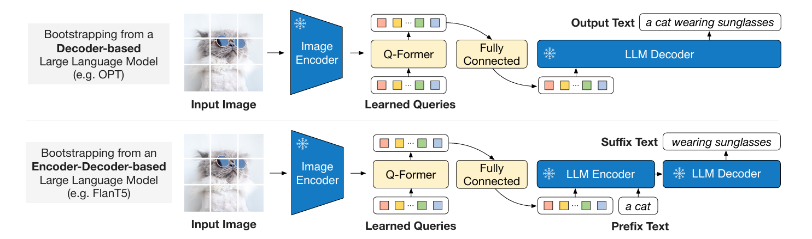

`庖丁解牛BLIP2` 

<!-- more -->

# 庖丁解牛BLIP2

> 论文: [https://arxiv.org/abs/2301.12597](https://arxiv.org/abs/2301.12597)
> 代码: [https://github.com/salesforce/LAVIS/tree/main/projects/blip2](https://github.com/salesforce/LAVIS/tree/main/projects/blip2)

## 背景

多模态模型在过往发展的过程中，曾有一段时期一直在追求更大的网络架构（image encoder 和 text encoder/decoder）和 数据集，从而导致更大的训练代价。例如CLIP，400M数据，需要数百个GPU训练数十天，如何降低模型训练成本，同时具有很好的性能？

这就是BLIP-2的起因，回顾下之前的多模态网络设计，三个模块（图像分支、文本分支、融合模块）:


(a) 早期的图文多模态：图像分支依赖目标检测器，模态融合比较弱，如VSE++。

(b) 重点训练图像和文本特征提取，模态融合比较轻量，如CLIP。

(c) 图像特征提取和模态融合都很重。

(d) 侧重模态融合，特征提取网络相对轻量，如ViLT。

| 模块         | (a) | (b) | (c) | (d) | 理想情况 |
|--------------|-----|-----|-----|-----|----------|
| 视觉分支     | 重  | 重  | 重  | 轻  | 重       |
| 文本分支     | 轻  | 重  | 轻  | 轻  | 重       |
| 融合模块     | 轻  | 轻  | 重  | 重  | 轻       |
| 性能         | 一般| 好  | 好  | 一般| 好       |
| 训练代价     | 中  | 非常高 | 非常高 | 高 | 中   |

BLIP-2 基于 BLIP 架构，利用已有的ViT 和 LLM（均冻结）+ 一个的轻量Q-Former模块做模态融合，大幅降低训练成本。具有很强的zero-shot image-to-text generation能力，同时因LLM而具有了视觉推理能力。

## 模型结构

BLIP-2 框架按照 Two-Stage 策略预训练轻量级查询 Transformer 以弥合模态差距。

Stage 1: 不同模态数据的提取与融合。       

Stage 2: 把数据转换成LLM能识别的格式。


从冻结的Image Encoder引到Vision-Language表征学习。   

从冻结的LLM引到Vision-Language生成学习，实现Zero Shot图文生成。

### Stage 1: Representation Learning （表征学习）


Q-Former 由两个transformer模块组成，输入包含三部分：

1. 冻结参数的Image Encoder提取的图像embeddings
2. Learned Queries

>  - Queries是一组可学习的embeddings，是第一个transformer模块的input，可认为是模型参数一部分
>  - 推理时，Queries被用来从image encoder输出的embeddings里提取与input text最相关的视觉信息

3. Input Text

**Stage 1** 使用 图像-文本对 进行预训练，目标是训练好 Q-Former，**以便 Queries 可以学习到如何更好地结合文本提取图片信息**。

对于Q-Former，一种比较好理解的方式：把Q-Former类比为一个Self-attention模块

- Q：learned queries
- K：input text
- V：image embeddings from Image Encoder

Blip2Qformer核心代码实现如下:

1. 利用 query tokens 从 image embeddings 中提取与 text 最相关的视觉信息
2. 将输入的 input text 进行编码 , 然后使用第一个CLS Token 作为 input text representation

```python
class Blip2Qformer(Blip2Base):
    ...    
    
    def forward(self, samples):
        image = samples["image"] # (B,C,H,W)
        text = samples["text_input"] # (B,seq_len)
        # frozen vit 将图片编码成 (B, seq_len, hidden_size)
        image_embeds = self.ln_vision(self.visual_encoder(image))
        # 构建padding mask标注哪些image token是有效的 (B,seq_len)
        image_atts = torch.ones(image_embeds.size()[:-1], dtype=torch.long).to(
            image.device
        )
        # 初始化query tokens (B,seq_len,hidden_size)
        query_tokens = self.query_tokens.expand(image_embeds.shape[0], -1, -1)
        # query tokens 从 image embeddings 中提取与 text 最相关的视觉信息
        # query_output (B,seq_len,hidden_size)
        query_output = self.Qformer.bert(
            query_embeds=query_tokens,
            encoder_hidden_states=image_embeds,
            encoder_attention_mask=image_atts,
            use_cache=True,
            return_dict=True,
        )
        image_feats = F.normalize(
            self.vision_proj(query_output.last_hidden_state), dim=-1
        )
        
        # 将input text 进行编码，维度为 (B,seq_len,hidden_size)
        text_tokens = self.tokenizer(
            text,
            padding="max_length",
            truncation=True,
            max_length=self.max_txt_len,
            return_tensors="pt",
        ).to(image.device)
        text_output = self.Qformer.bert(
            text_tokens.input_ids,
            attention_mask=text_tokens.attention_mask, # padding mask
            return_dict=True,
        )
        # 取第一个cls token作为input text representation，维度为 (B,hidden_size)
        text_feat = F.normalize(
            self.text_proj(text_output.last_hidden_state[:, 0, :]), dim=-1
        )
        ...
```

> 以上代码注释中统一用B代替image_batch和text_batch，以及seq_len和hidden_size也是同样处理手段，大家注意区分。

为了训练好Q-Former，第一阶段设计了三个训练目标，分别如下:

#### 1、Image-Text Contrastive Learning (ITC Loss, CLIP-like)

> - 目的: Image representation 与 Text representation，以最大化互信息
>
> - 自注意力掩码策略: Uni-modal Self-attention Mask（单模态自注意力）
>
> - Queries 和 Text 仅能和自己的 tokens 做 attention（Query和Query、Text和Text）
>
> 

image_feats 中每个 image_feat 与 text_feat 计算一个 similarity score ，选择最大值作为这个图文对的相似度 :


如何计算loss的: “in-batch negatives”，该方法正是CLIP在VLP领域发扬光大的。以下引用CLIP论文图做说明：


```python
###============== Image-text Contrastive ===================###
        # 计算每个query token 和 text_feat 的相似度 , 得到相似度矩阵 (B,B,seq_len)    
        # image_feats (B,seq_len,hidden_size) 变为 (B,1,seq_len,hidden_size)
        # text_feat (B,hidden_size) 变为 (B,hidden_size,1)
        sim_q2t = torch.matmul( 
            image_feats.unsqueeze(1), text_feat.unsqueeze(-1) 
        ).squeeze()

        # image-text similarity: aggregate across all query tokens
        # 保留和text_feat相似度最大的那个query token作为最后的相似度得分 , 维度为 (B,B)
        sim_i2t, _ = sim_q2t.max(-1)
        sim_i2t = sim_i2t / self.temp

        # 反过来计算text_feat 和 每个query token的相似度 , 得到相似度矩阵 (B,B,seq_len)    
        # image_feats 维度变为 (B,hidden_size,seq_len)
        # text_feat (B,hidden_size) 变为 (B,1,1,hidden_size)
        sim_t2q = torch.matmul(
            text_feat.unsqueeze(1).unsqueeze(1), image_feats.permute(0, 2, 1)
        ).squeeze()

        # text-image similarity: aggregate across all query tokens
        # 保留和text_feat相似度最大的那个query token作为最后的相似度得分 , 维度为 (B,B)
        sim_t2i, _ = sim_t2q.max(-1)
        sim_t2i = sim_t2i / self.temp

        # 生成比标签         
        targets = torch.arange(image.size(0), device=image.device)

        # 计算 图文对比 Loss             
        loss_itc = (
            # sim_i2t 形状是 (B, B)，每一行表示一张图像和所有文本之间的相似度。
            F.cross_entropy(sim_i2t, targets, label_smoothing=0.1) + F.cross_entropy(sim_t2i, targets, label_smoothing=0.1)
        ) / 2
```
#### 2、Image-Text Matching (ITM Loss，二分类task)

> - 目的：通过学习image-text pair是否match，以细粒度对齐 Image representation 与 Text representation
>
> - 自注意力掩码策略: Bi-directional Self-attention Mask（双向自注意力）
>
> - Queries 和Text都能和所有的tokens 做attention
> 
> 


每个output query embedding送到二分类器中，得到一个logit；所有logits的平均作为最终的matching score:


```python
  ###============== Image-text Matching ===================###
        text_input_ids_world = text_tokens.input_ids
        text_attention_mask_world = text_tokens.attention_mask
        image_embeds_world = image_embeds

        with torch.no_grad():
            # bs (batch size) ， diag_indices = [0,1,2,...,bs-1]
            diag_indices = torch.arange(bs, device=sim_t2i.device)
            # 把相似度矩阵对角线元素置为负无穷大，以避免模型将匹配图文对挑选为负样本
            # (0,0) , (1,1) ... (bs-1,bs-1) 位置处设置为 -10000
            sim_t2i[diag_indices, diag_indices] = -10000
            sim_i2t[diag_indices, diag_indices] = -10000
           
            weights_t2i = F.softmax(sim_t2i, dim=1)
            weights_i2t = F.softmax(sim_i2t, dim=1)

        # 为每个文本选择一个负样本图像
        image_embeds_neg = []
        for b in range(bs):
            neg_idx = torch.multinomial(weights_t2i[b], 1).item()
            image_embeds_neg.append(image_embeds_world[neg_idx])
        image_embeds_neg = torch.stack(image_embeds_neg, dim=0)

        # 为每个图像选择一个负样本文本
        text_ids_neg = []
        text_atts_neg = []
        for b in range(bs):
            neg_idx = torch.multinomial(weights_i2t[b], 1).item()
            text_ids_neg.append(text_input_ids_world[neg_idx])
            text_atts_neg.append(text_attention_mask_world[neg_idx])
        text_ids_neg = torch.stack(text_ids_neg, dim=0)
        text_atts_neg = torch.stack(text_atts_neg, dim=0)

        # 构建输入文本列表: [正样本batch，负样本batch1，负样本batch2] ，维度为 (3*bs,seq_len)
        text_ids_all = torch.cat(
            [text_tokens.input_ids, text_tokens.input_ids, text_ids_neg], dim=0
        )
        text_atts_all = torch.cat(
            [text_tokens.attention_mask, text_tokens.attention_mask, text_atts_neg],
            dim=0,
        )
        
        # 构建query tokens列表: [正样本batch，负样本batch1，负样本batch2] ，维度为 (3*bs,seq_len,hidden_size)
        query_tokens_itm = self.query_tokens.expand(text_ids_all.shape[0], -1, -1)
        query_atts_itm = torch.ones(query_tokens_itm.size()[:-1], dtype=torch.long).to(
            image.device
        )
        # 构建query和text的padding mask ，维度为 (3*bs,seq_len)
        attention_mask_all = torch.cat([query_atts_itm, text_atts_all], dim=1)
        
         # 构建输入图像列表: [正样本batch，负样本batch1，负样本batch2] ，维度为 (3*bs,seq_len,hidden_size)       
        image_embeds_all = torch.cat(
            [image_embeds, image_embeds_neg, image_embeds], dim=0
        )
        image_atts_all = torch.ones(image_embeds_all.size()[:-1], dtype=torch.long).to(
            image.device
        )
        
        # 1. 将输入文本转换为嵌入列表后和query tokens 在seq_len维度上拼接起来，维度为 (3*bs,text_seq_len + query_tokens_seq_len,hidden_size)
        # 2. 将文本和query tokens拼接得到的结果和图像嵌入进行cross attention计算，编码后得到输出的结果
        output_itm = self.Qformer.bert(
            text_ids_all,
            query_embeds=query_tokens_itm,
            attention_mask=attention_mask_all,
            encoder_hidden_states=image_embeds_all,
            encoder_attention_mask=image_atts_all,
            return_dict=True,
        )

        # 取  (3*bs,text_seq_len + query_tokens_seq_len,hidden_size) 中 query tokens部分的结果，维度为 (3*bs,query_tokens_seq_len,hidden_size) 
        vl_embeddings = output_itm.last_hidden_state[:, : query_tokens_itm.size(1), :]
        # 把query tokens部分的每个位置都映射到2维匹配空间，维度为 (3*bs,query_tokens_seq_len,2)
        vl_output = self.itm_head(vl_embeddings)
        # 取每个位置的平均作为最终的匹配得分，维度为 (3*bs,2)
        logits = vl_output.mean(dim=1)

        # 构建匹配标签: [正样本batch=1，负样本batch1=0，负样本batch2=0] ，维度为 (3*bs)  
        itm_labels = torch.cat(
            [torch.ones(bs, dtype=torch.long), torch.zeros(2 * bs, dtype=torch.long)],
            dim=0,
        ).to(image.device)
        # 计算交叉熵损失
        loss_itm = F.cross_entropy(logits, itm_labels)
```
当文本和query tokens同时输入BertModel时，BertEmbeddings会将text embeddings和query tokens的embeddings在seq_len维度上拼接起来。

```python
class BertEmbeddings(nn.Module):
    ...
    def forward(
        self,
        input_ids=None,
        position_ids=None,
        query_embeds=None,
        past_key_values_length=0,
    ):
        # 计算序列长度
        if input_ids is not None:
            seq_length = input_ids.size()[1]
        else:
            seq_length = 0

        # 如果未提供位置id，则自动生成
        if position_ids is None:
            position_ids = self.position_ids[
                :, past_key_values_length : seq_length + past_key_values_length
            ].clone()

        # 词嵌入与位置嵌入相加，若有query_embeds则拼接
        if input_ids is not None:
            embeddings = self.word_embeddings(input_ids)
            if self.position_embedding_type == "absolute":
                position_embeddings = self.position_embeddings(position_ids)
                embeddings = embeddings + position_embeddings

            if query_embeds is not None:
                embeddings = torch.cat((query_embeds, embeddings), dim=1)
        else:
            embeddings = query_embeds

        embeddings = self.LayerNorm(embeddings)
        embeddings = self.dropout(embeddings)
        return embeddings
```
下图展示了 Image-Text Matching 的完整计算流程，关于BertModel的代码解析部分，将会在下文进行详细讲解:


#### 3、Image-Grounded Text Generation (ITG Loss, GPT-like)

> - 目的：让Q-Former学习“图生文”的能力，即给定Input Image，生成Text
>
> - 自注意力掩码策略：Multimodal Causal Self-attention Mask（多模态因果自监督）
>
> - Queies 可以和所有自己的tokens做attention
>
> - Text 可以和所有的query tokens 及 当前token之前的text tokens做attention
> 
> 

**视觉编码阶段**:

图像通过视觉编码器（如 ViT）编码为图像特征 image_embeds。Query tokens 通过 cross-attention 吸收图像特征，再通过 self-attention 生成压缩的视觉表示。缓存 query tokens 的 self-attention 的 past_key_values（而非 cross-attention 的 key/value）。

QFormer 会使用 past_key_values 缓存和复用 EncoderLayer 中 self-attention 的 key/value :

1. BertSelfAttention: 自注意力和交叉注意力流程统一化，每次计算后返回本次可能需要缓存的key & value

```python
class BertSelfAttention(nn.Module):
    ...
    def forward(
        self,
        hidden_states,
        attention_mask=None,
        head_mask=None,
        encoder_hidden_states=None,
        encoder_attention_mask=None,
        past_key_value=None,
        output_attentions=False,
    ):

        # 判断是否为交叉注意力
        is_cross_attention = encoder_hidden_states is not None

        # 交叉注意力则key和value都来自图像,key来自query tokens
        if is_cross_attention:
            key_layer = self.transpose_for_scores(self.key(encoder_hidden_states))
            value_layer = self.transpose_for_scores(self.value(encoder_hidden_states))
            attention_mask = encoder_attention_mask
        # 如果有缓存的key,value传入, 此时先用text embedding计算出key和value
        # 再和缓存的key,value在seq_len的维度拼接起来        
        elif past_key_value is not None:
            key_layer = self.transpose_for_scores(self.key(hidden_states))
            value_layer = self.transpose_for_scores(self.value(hidden_states))
            key_layer = torch.cat([past_key_value[0], key_layer], dim=2) # (Batch,Heads,Seq_len,Hidden_size)
            value_layer = torch.cat([past_key_value[1], value_layer], dim=2)
        else:
        # 自注意力    
            key_layer = self.transpose_for_scores(self.key(hidden_states))
            value_layer = self.transpose_for_scores(self.value(hidden_states))
        
        # 交叉注意力: 传入图像，则q来自query tokens
        # 自注意力: q来自query tokens 或者 text embedding
        mixed_query_layer = self.query(hidden_states)
           
        query_layer = self.transpose_for_scores(mixed_query_layer)
        
        # * 缓存key和value
        past_key_value = (key_layer, value_layer)

        # 计算注意力分数
        attention_scores = torch.matmul(query_layer, key_layer.transpose(-1, -2))

        attention_scores = attention_scores / math.sqrt(self.attention_head_size)
        if attention_mask is not None:
            # 应用注意力掩码
            attention_scores = attention_scores + attention_mask

        # softmax归一化得到注意力概率
        attention_probs = nn.Softmax(dim=-1)(attention_scores)

        if is_cross_attention and self.save_attention:
            self.save_attention_map(attention_probs)
            attention_probs.register_hook(self.save_attn_gradients)

        # dropout防止过拟合
        attention_probs_dropped = self.dropout(attention_probs)

        # 计算上下文表示
        context_layer = torch.matmul(attention_probs_dropped, value_layer)

        context_layer = context_layer.permute(0, 2, 1, 3).contiguous()
        new_context_layer_shape = context_layer.size()[:-2] + (self.all_head_size,)
        context_layer = context_layer.view(*new_context_layer_shape)

        outputs = (
            (context_layer, attention_probs) if output_attentions else (context_layer,)
        )
        
        # outputs 列表最后一个记录了缓存的key和value 
        outputs = outputs + (past_key_value,)
        return outputs
```

2.  BertLayer: 负责组织自注意力和交叉注意力的运算流程

```python
class BertLayer(nn.Module):
    ...
    def forward(
        self,
        hidden_states, # query tokens
        attention_mask=None, # query token padding mask
        head_mask=None,
        encoder_hidden_states=None, # image tokens
        encoder_attention_mask=None, # image padding mask
        past_key_value=None,
        output_attentions=False,
        query_length=0,
    ):
        self_attn_past_key_value = (
            past_key_value[:2] if past_key_value is not None else None
        )
        # 自注意力运算
        self_attention_outputs = self.attention(
            hidden_states,
            attention_mask,
            head_mask,
            output_attentions=output_attentions,
            past_key_value=self_attn_past_key_value, # 缓存的key和value
        )
        attention_output = self_attention_outputs[0]
        outputs = self_attention_outputs[1:-1]

        present_key_value = self_attention_outputs[-1]

        # 交叉注意力运算 
        if query_length > 0:
            query_attention_output = attention_output[:, :query_length, :]
            if self.has_cross_attention:
                cross_attention_outputs = self.crossattention(
                    query_attention_output,
                    attention_mask,
                    head_mask,
                    encoder_hidden_states,
                    encoder_attention_mask,
                    output_attentions=output_attentions,
                )
                query_attention_output = cross_attention_outputs[0]
                outputs = (
                    outputs + cross_attention_outputs[1:-1]
                ) 
        ...        
        outputs = (layer_output,) + outputs
        outputs = outputs + (present_key_value,) # outputs 列表最后一个记录了缓存的key和value 
        return outputs
```

3.  BertEncoder:  负责组织多个 BertLayer 叠加的运算流程

```python
class BertEncoder(nn.Module):
    ...
    def forward(
        self,
        hidden_states, # query tokens
        attention_mask=None, # query tokens padding mask
        head_mask=None,
        encoder_hidden_states=None, # images
        encoder_attention_mask=None, # images padding mask
        past_key_values=None,
        use_cache=None,
        output_attentions=False,
        output_hidden_states=False,
        return_dict=True,
        query_length=0,
    ):
        ...
        for i in range(self.config.num_hidden_layers):
            layer_module = self.layer[i]
            ...
            # 如果有缓存，则计算当前层BertLayer时，会从缓存中取出对应层先前缓存的key&value
            past_key_value = past_key_values[i] if past_key_values is not None else None
            layer_outputs = layer_module(
                    hidden_states,
                    attention_mask,
                    layer_head_mask,
                    encoder_hidden_states,
                    encoder_attention_mask,
                    past_key_value,
                    output_attentions,
                    query_length,
            )

            hidden_states = layer_outputs[0]
            # 每一层BertLayer产生的key&value都会进行缓存
            if use_cache:
                next_decoder_cache += (layer_outputs[-1],)
        ...       
        return BaseModelOutputWithPastAndCrossAttentions(
            last_hidden_state=hidden_states,
            past_key_values=next_decoder_cache,
            hidden_states=all_hidden_states,
            attentions=all_self_attentions,
            cross_attentions=all_cross_attentions,
        )
```

4.  Image-Grounded Text Generation 学习目标

```python
        ...
        query_output = self.Qformer.bert(
            query_embeds=query_tokens,
            encoder_hidden_states=image_embeds,
            encoder_attention_mask=image_atts,
            use_cache=True, # 缓存key&value
            return_dict=True,
        )
        ...
       ##================= Image Captioning ========================##
       # 这一部分的目标是：根据图像特征，使用 Q-Former 解码器生成文本描述（caption）

       # Step 1: 准备 decoder 的输入 token IDs
       decoder_input_ids = text_tokens.input_ids.clone()
       # 将第一个 token 替换为 BOS（Begin Of Sentence）标记，表示“开始生成句子”
       decoder_input_ids[:, 0] = self.tokenizer.bos_token_id

       # Step 2: 构造训练目标 labels
       # 将 padding token 替换为 -100，这是 CrossEntropyLoss 默认忽略的标签值
       labels = decoder_input_ids.masked_fill(
          decoder_input_ids == self.tokenizer.pad_token_id, -100
       )

       # Step 3: 构建 attention_mask（包含 query tokens 和 文本 token 的 mask）
       # query_atts 是 query tokens 的 attention mask，全为 1（因为都是有效 token）
       query_atts = torch.ones(query_tokens.size()[:-1], dtype=torch.long).to(image.device)
       # 将 query token 的 mask 和文本 token 的 mask 拼接在一起
       attention_mask = torch.cat([query_atts, text_tokens.attention_mask], dim=1)

       # Step 4: 调用 Q-Former 解码器进行文本生成
       lm_output = self.Qformer(
              decoder_input_ids,                  # 输入 token ID 序列（如 [BOS], dog, is...）
              attention_mask=attention_mask,      # 指明哪些位置是有效的（非 padding）
              past_key_values=query_output.past_key_values,  # 编码器输出的 key/value，包含图像信息
              return_dict=True,                   # 返回字典格式结果
              labels=labels,                      # 训练目标，用于计算 loss
       )

       # Step 5: 提取语言模型损失
       loss_lm = lm_output.loss  # 使用交叉熵损失衡量生成与真实之间的差异
```
**文本生成阶段:**

将缓存的 past_key_values 作为文本解码器的初始状态。

文本 token 在自回归生成时，通过 self-attention 复用缓存的视觉信息。

5. BertLMHeadModel: 自回归语言建模任务（如文本生成）

```python
class BertLMHeadModel(BertPreTrainedModel):
    ...
    def forward(
        self,
        input_ids=None,
        attention_mask=None,
        position_ids=None,
        head_mask=None,
        query_embeds=None,
        encoder_hidden_states=None,
        encoder_attention_mask=None,
        labels=None,
        past_key_values=None,
        use_cache=True,
        output_attentions=None,
        output_hidden_states=None,
        return_dict=None,
        return_logits=False,
        is_decoder=True,
        reduction="mean",
    ):
        ...
        # 调用 BertModel 进行文本编码 (结合缓存的attention key&value)
        outputs = self.bert(
            input_ids,
            attention_mask=attention_mask,
            position_ids=position_ids,
            head_mask=head_mask,
            query_embeds=query_embeds,
            encoder_hidden_states=encoder_hidden_states,
            encoder_attention_mask=encoder_attention_mask,
            past_key_values=past_key_values,
            use_cache=use_cache,
            output_attentions=output_attentions,
            output_hidden_states=output_hidden_states,
            return_dict=return_dict,
            is_decoder=is_decoder,
        )

        sequence_output = outputs[0]
        ...
        # self.cls 是一个分类头（BertOnlyMLMHead），它将每个 token 的向量映射到词汇表空间（logits）
        prediction_scores = self.cls(sequence_output)
        ...  
        lm_loss = None
        if labels is not None:
            # 因为我们要预测下一个 token，所以把 logits 和 labels 错位对齐：
            # shifted_prediction_scores: 所有 token 的预测（除了最后一个）
            shifted_prediction_scores = prediction_scores[:, :-1, :].contiguous()
            # labels: 所有 token 的真实值（从第二个开始）
            labels = labels[:, 1:].contiguous()
            loss_fct = CrossEntropyLoss(reduction=reduction, label_smoothing=0.1)
            lm_loss = loss_fct(
                shifted_prediction_scores.view(-1, self.config.vocab_size),
                labels.view(-1),
            )
            if reduction == "none":
                lm_loss = lm_loss.view(prediction_scores.size(0), -1).sum(1)
        ...        
        return CausalLMOutputWithCrossAttentions(
            loss=lm_loss,
            logits=prediction_scores,
            past_key_values=outputs.past_key_values,
            hidden_states=outputs.hidden_states,
            attentions=outputs.attentions,
            cross_attentions=outputs.cross_attentions,
        )
```
> BertModel 的 forward 方法中，当is_decoder=True时，会在get_extended_attention_mask方法中，构建一个下三角矩阵作为因果掩码矩阵。

### Stage 2: Generative Learning（生成学习）

Stage 2 是为了把 Q-Former 和冻结参数的 LLM 连接起来，以利用 LLM 的文本生成能力。

支持两种LLM（decoder only、encoder-decoder based）:



1. 首先输入图片，直接输入冻结参数的 Image Encoder，得到图像的表征。

2. 然后图像的表征和 Queries 一起送入 Q-Former，得到 Queries 的输出 $Z$ ，使用全连接 (FC) 层将 $Z$ 线性投影到与 LLM 的text embedding相同维度。

3. 后将投影后的 $Z$ 添加到 input text embeddings前面，Queries 的输出蕴含了视觉信息，送入LLM时，充当了soft visual prompts 。

4. 由于 Q-Former 已经过预训练以提取语言信息视觉表示，因此它有效地充当信息瓶颈，将最有用的信息提供给 LLM，同时删除不相关的视觉信息。这减少了LLM学习视觉语言对齐的负担，从而缓解了灾难性的遗忘问题。

