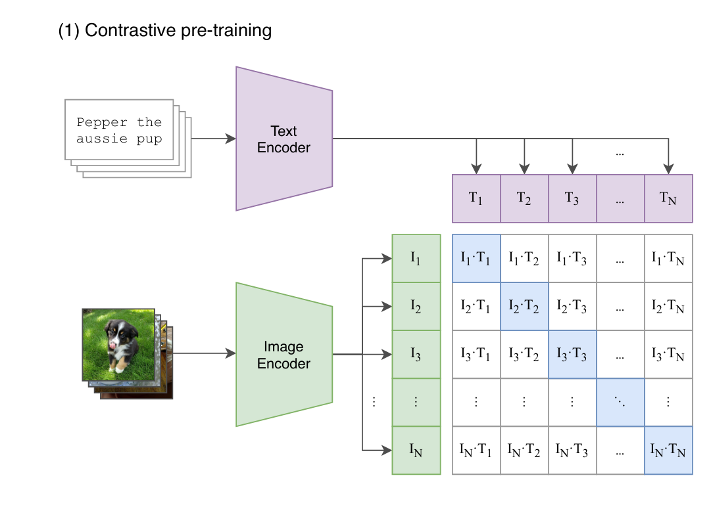

`庖丁解牛BLIP2` 

<!-- more -->

# 庖丁解牛BLIP2

> 论文: [https://arxiv.org/abs/2301.12597](https://arxiv.org/abs/2301.12597)
> 代码: [https://github.com/salesforce/LAVIS/tree/main/projects/blip2](https://github.com/salesforce/LAVIS/tree/main/projects/blip2)

## 背景

多模态模型在过往发展的过程中，曾有一段时期一直在追求更大的网络架构（image encoder 和 text encoder/decoder）和 数据集，从而导致更大的训练代价。例如CLIP，400M数据，需要数百个GPU训练数十天，如何降低模型训练成本，同时具有很好的性能？

这就是BLIP-2的起因，回顾下之前的多模态网络设计，三个模块（图像分支、文本分支、融合模块）:


(a) 早期的图文多模态：图像分支依赖目标检测器，模态融合比较弱，如VSE++。

(b) 重点训练图像和文本特征提取，模态融合比较轻量，如CLIP。

(c) 图像特征提取和模态融合都很重。

(d) 侧重模态融合，特征提取网络相对轻量，如ViLT。

| 模块         | (a) | (b) | (c) | (d) | 理想情况 |
|--------------|-----|-----|-----|-----|----------|
| 视觉分支     | 重  | 重  | 重  | 轻  | 重       |
| 文本分支     | 轻  | 重  | 轻  | 轻  | 重       |
| 融合模块     | 轻  | 轻  | 重  | 重  | 轻       |
| 性能         | 一般| 好  | 好  | 一般| 好       |
| 训练代价     | 中  | 非常高 | 非常高 | 高 | 中   |

BLIP-2 基于 BLIP 架构，利用已有的ViT 和 LLM（均冻结）+ 一个的轻量Q-Former模块做模态融合，大幅降低训练成本。具有很强的zero-shot image-to-text generation能力，同时因LLM而具有了视觉推理能力。

## 模型结构

BLIP-2 框架按照 Two-Stage 策略预训练轻量级查询 Transformer 以弥合模态差距。

Stage 1: 不同模态数据的提取与融合。       

Stage 2: 把数据转换成LLM能识别的格式。


从冻结的Image Encoder引到Vision-Language表征学习。   

从冻结的LLM引到Vision-Language生成学习，实现Zero Shot图文生成。

### Stage 1: Representation Learning （表征学习）


Q-Former 由两个transformer模块组成，输入包含三部分：

1. 冻结参数的Image Encoder提取的图像embeddings
2. Learned Queries

>  - Queries是一组可学习的embeddings，是第一个transformer模块的input，可认为是模型参数一部分
>  - 推理时，Queries被用来从image encoder输出的embeddings里提取与input text最相关的视觉信息

3. Input Text

**Stage 1** 使用 图像-文本对 进行预训练，目标是训练好 Q-Former，**以便 Queries 可以学习到如何更好地结合文本提取图片信息**。

对于Q-Former，一种比较好理解的方式：把Q-Former类比为一个Self-attention模块

- Q：learned queries
- K：input text
- V：image embeddings from Image Encoder

Blip2Qformer核心代码实现如下:

1. 利用 query tokens 从 image embeddings 中提取与 text 最相关的视觉信息
2. 将输入的 input text 进行编码 , 然后使用第一个CLS Token 作为 input text representation

```python
class Blip2Qformer(Blip2Base):
    ...    
    
    def forward(self, samples):
        image = samples["image"] # (B,C,H,W)
        text = samples["text_input"] # (B,seq_len)
        # frozen vit 将图片编码成 (B, seq_len, hidden_size)
        image_embeds = self.ln_vision(self.visual_encoder(image))
        # 构建padding mask标注哪些image token是有效的 (B,seq_len)
        image_atts = torch.ones(image_embeds.size()[:-1], dtype=torch.long).to(
            image.device
        )
        # 初始化query tokens (B,seq_len,hidden_size)
        query_tokens = self.query_tokens.expand(image_embeds.shape[0], -1, -1)
        # query tokens 从 image embeddings 中提取与 text 最相关的视觉信息
        # query_output (B,seq_len,hidden_size)
        query_output = self.Qformer.bert(
            query_embeds=query_tokens,
            encoder_hidden_states=image_embeds,
            encoder_attention_mask=image_atts,
            use_cache=True,
            return_dict=True,
        )
        image_feats = F.normalize(
            self.vision_proj(query_output.last_hidden_state), dim=-1
        )
        
        # 将input text 进行编码，维度为 (B,seq_len,hidden_size)
        text_tokens = self.tokenizer(
            text,
            padding="max_length",
            truncation=True,
            max_length=self.max_txt_len,
            return_tensors="pt",
        ).to(image.device)
        text_output = self.Qformer.bert(
            text_tokens.input_ids,
            attention_mask=text_tokens.attention_mask, # padding mask
            return_dict=True,
        )
        # 取第一个cls token作为input text representation，维度为 (B,hidden_size)
        text_feat = F.normalize(
            self.text_proj(text_output.last_hidden_state[:, 0, :]), dim=-1
        )
        ...
```

> 以上代码注释中统一用B代替image_batch和text_batch，以及seq_len和hidden_size也是同样处理手段，大家注意区分。

为了训练好Q-Former，第一阶段设计了三个训练目标，分别如下:

#### 1、Image-Text Contrastive Learning (ITC Loss, CLIP-like)

> - 目的: Image representation 与 Text representation，以最大化互信息
>
> - 自注意力掩码策略: Uni-modal Self-attention Mask（单模态自注意力）
>
> - Queries 和 Text 仅能和自己的 tokens 做 attention（Query和Query、Text和Text）
>
> 

image_feats 中每个 image_feat 与 text_feat 计算一个 similarity score ，选择最大值作为这个图文对的相似度 :


如何计算loss的: “in-batch negatives”，该方法正是CLIP在VLP领域发扬光大的。以下引用CLIP论文图做说明：



```python
###============== Image-text Contrastive ===================###
        # 计算每个query token 和 text_feat 的相似度 , 得到相似度矩阵 (B,B,seq_len)    
        # image_feats (B,seq_len,hidden_size) 变为 (B,1,seq_len,hidden_size)
        # text_feat (B,hidden_size) 变为 (B,hidden_size,1)
        sim_q2t = torch.matmul( 
            image_feats.unsqueeze(1), text_feat.unsqueeze(-1) 
        ).squeeze()

        # image-text similarity: aggregate across all query tokens
        # 保留和text_feat相似度最大的那个query token作为最后的相似度得分 , 维度为 (B,B)
        sim_i2t, _ = sim_q2t.max(-1)
        sim_i2t = sim_i2t / self.temp

        # 反过来计算text_feat 和 每个query token的相似度 , 得到相似度矩阵 (B,B,seq_len)    
        # image_feats 维度变为 (B,hidden_size,seq_len)
        # text_feat (B,hidden_size) 变为 (B,1,1,hidden_size)
        sim_t2q = torch.matmul(
            text_feat.unsqueeze(1).unsqueeze(1), image_feats.permute(0, 2, 1)
        ).squeeze()

        # text-image similarity: aggregate across all query tokens
        # 保留和text_feat相似度最大的那个query token作为最后的相似度得分 , 维度为 (B,B)
        sim_t2i, _ = sim_t2q.max(-1)
        sim_t2i = sim_t2i / self.temp

        # 生成比标签         
        targets = torch.arange(image.size(0), device=image.device)

        # 计算 图文对比 Loss             
        loss_itc = (
            # sim_i2t 形状是 (B, B)，每一行表示一张图像和所有文本之间的相似度。
            F.cross_entropy(sim_i2t, targets, label_smoothing=0.1) + F.cross_entropy(sim_t2i, targets, label_smoothing=0.1)
        ) / 2
```
#### 2、Image-Text Matching (ITM Loss，二分类task)

> - 目的：通过学习image-text pair是否match，以细粒度对齐 Image representation 与 Text representation
>
> - 自注意力掩码策略: Bi-directional Self-attention Mask（双向自注意力）
>
> - Queries 和Text都能和所有的tokens 做attention
> 
> 


每个output query embedding送到二分类器中，得到一个logit；所有logits的平均作为最终的matching score:


```python
  ###============== Image-text Matching ===================###

        text_input_ids_world = text_tokens.input_ids
        text_attention_mask_world = text_tokens.attention_mask
        image_embeds_world = image_embeds

        with torch.no_grad():
            if "image_id" in samples.keys():
                mask = torch.eq(image_ids, image_ids.t())
                sim_t2i.masked_fill_(mask, -10000)
                sim_i2t.masked_fill_(mask, -10000)
            else:
                # 在单卡中，sim_t2i[b, b] 是自己这一项，屏蔽掉防止作弊
                diag_indices = torch.arange(bs, device=sim_t2i.device)
                sim_t2i[diag_indices, diag_indices] = -10000
                sim_i2t[diag_indices, diag_indices] = -10000

            weights_t2i = F.softmax(sim_t2i, dim=1)
            weights_i2t = F.softmax(sim_i2t, dim=1)

        # select a negative image for each text
        image_embeds_neg = []
        for b in range(bs):
            neg_idx = torch.multinomial(weights_t2i[b], 1).item()
            image_embeds_neg.append(image_embeds_world[neg_idx])
        image_embeds_neg = torch.stack(image_embeds_neg, dim=0)

        # select a negative text for each image
        text_ids_neg = []
        text_atts_neg = []
        for b in range(bs):
            neg_idx = torch.multinomial(weights_i2t[b], 1).item()
            text_ids_neg.append(text_input_ids_world[neg_idx])
            text_atts_neg.append(text_attention_mask_world[neg_idx])

        text_ids_neg = torch.stack(text_ids_neg, dim=0)
        text_atts_neg = torch.stack(text_atts_neg, dim=0)

        # 构建 ITM 输入：正样本 + 负样本
        text_ids_all = torch.cat(
            [text_tokens.input_ids, text_tokens.input_ids, text_ids_neg], dim=0
        )
        text_atts_all = torch.cat(
            [text_tokens.attention_mask, text_tokens.attention_mask, text_atts_neg],
            dim=0,
        )

        query_tokens_itm = self.query_tokens.expand(text_ids_all.shape[0], -1, -1)
        query_atts_itm = torch.ones(query_tokens_itm.size()[:-1], dtype=torch.long).to(
            image.device
        )
        attention_mask_all = torch.cat([query_atts_itm, text_atts_all], dim=1)

        image_embeds_all = torch.cat(
            [image_embeds, image_embeds_neg, image_embeds], dim=0
        )
        image_atts_all = torch.ones(image_embeds_all.size()[:-1], dtype=torch.long).to(
            image.device
        )

        output_itm = self.Qformer.bert(
            text_ids_all,
            query_embeds=query_tokens_itm,
            attention_mask=attention_mask_all,
            encoder_hidden_states=image_embeds_all,
            encoder_attention_mask=image_atts_all,
            return_dict=True,
        )

        vl_embeddings = output_itm.last_hidden_state[:, : query_tokens_itm.size(1), :]
        vl_output = self.itm_head(vl_embeddings)
        logits = vl_output.mean(dim=1)

        itm_labels = torch.cat(
            [torch.ones(bs, dtype=torch.long), torch.zeros(2 * bs, dtype=torch.long)],
            dim=0,
        ).to(image.device)
        loss_itm = F.cross_entropy(logits, itm_labels)
```

BertLayer 核心代码实现如下:

```python
class BertLayer(nn.Module):
    def __init__(self, config, layer_num):
        super().__init__()
        ...
        self.attention = BertAttention(config)
        # 每个几层,添加一个cross attention
        if (
            self.config.add_cross_attention
            and layer_num % self.config.cross_attention_freq == 0
        ):
            self.crossattention = BertAttention(
                config, is_cross_attention=self.config.add_cross_attention
            )
            self.has_cross_attention = True
        else:
            self.has_cross_attention = False
        self.intermediate = BertIntermediate(config)
        self.output = BertOutput(config)

        self.intermediate_query = BertIntermediate(config)
        self.output_query = BertOutput(config)

    def forward(
        self,
        hidden_states, # query tokens
        attention_mask=None, # query token padding mask
        head_mask=None,
        encoder_hidden_states=None, # image tokens
        encoder_attention_mask=None, # image padding mask
        past_key_value=None,
        output_attentions=False,
        query_length=0,
    ):
        # decoder uni-directional self-attention cached key/values tuple is at positions 1,2
        self_attn_past_key_value = (
            past_key_value[:2] if past_key_value is not None else None
        )
        # 如果
        self_attention_outputs = self.attention(
            hidden_states,
            attention_mask,
            head_mask,
            output_attentions=output_attentions,
            past_key_value=self_attn_past_key_value,
        )
        attention_output = self_attention_outputs[0]
        outputs = self_attention_outputs[1:-1]

        present_key_value = self_attention_outputs[-1]

        if query_length > 0: # query tokens nums = 32
            query_attention_output = attention_output[:, :query_length, :]
            # query tokens 经过 attention 后得到  context states
            if self.has_cross_attention:
                # q (context states) , k 和 v 来自 images encoder
                # q(b,32,h) * k(b,seq_len,h).t = (b,32,seq_len)
                # score(b,32,seq_len) * v(b,seq_len,h) = (b,32,h)
                cross_attention_outputs = self.crossattention(
                    query_attention_output,
                    attention_mask,
                    head_mask,
                    encoder_hidden_states,
                    encoder_attention_mask,
                    output_attentions=output_attentions,
                )
                query_attention_output = cross_attention_outputs[0]
                outputs = (
                    outputs + cross_attention_outputs[1:-1]
                )  # add cross attentions if we output attention weights
            #  分块并行处理
            layer_output = apply_chunking_to_forward(
                self.feed_forward_chunk_query,
                self.chunk_size_feed_forward,
                self.seq_len_dim,
                query_attention_output,
            )
            if attention_output.shape[1] > query_length:
                layer_output_text = apply_chunking_to_forward(
                    self.feed_forward_chunk,
                    self.chunk_size_feed_forward,
                    self.seq_len_dim,
                    attention_output[:, query_length:, :],
                )
                layer_output = torch.cat([layer_output, layer_output_text], dim=1)
        else:
            layer_output = apply_chunking_to_forward(
                self.feed_forward_chunk,
                self.chunk_size_feed_forward,
                self.seq_len_dim,
                attention_output,
            )
        outputs = (layer_output,) + outputs

        outputs = outputs + (present_key_value,)

        return outputs

    def feed_forward_chunk(self, attention_output):
        intermediate_output = self.intermediate(attention_output)
        layer_output = self.output(intermediate_output, attention_output)
        return layer_output

    def feed_forward_chunk_query(self, attention_output):
        intermediate_output = self.intermediate_query(attention_output)
        layer_output = self.output_query(intermediate_output, attention_output)
        return layer_output
```

```python
class BertAttention(nn.Module):
    def __init__(self, config, is_cross_attention=False):
        super().__init__()
        self.self = BertSelfAttention(config, is_cross_attention)
        self.output = BertSelfOutput(config)

    def forward(
        self,
        hidden_states,
        attention_mask=None,
        head_mask=None,
        encoder_hidden_states=None,
        encoder_attention_mask=None,
        past_key_value=None,
        output_attentions=False,
    ):
        self_outputs = self.self(
            hidden_states,
            attention_mask,
            head_mask,
            encoder_hidden_states,
            encoder_attention_mask,
            past_key_value,
            output_attentions,
        ) #  (context_layer, attention_probs)
        attention_output = self.output(self_outputs[0], hidden_states)

        outputs = (attention_output,) + self_outputs[
            1:
        ]  # add attentions if we output them
        return outputs
```

```python
class BertSelfAttention(nn.Module):
    ...
    def transpose_for_scores(self, x):
        # 调整张量形状以便多头注意力计算
        new_x_shape = x.size()[:-1] + (
            self.num_attention_heads,
            self.attention_head_size,
        )
        x = x.view(*new_x_shape)
        return x.permute(0, 2, 1, 3)

    def forward(
        self,
        hidden_states,
        attention_mask=None,
        head_mask=None,
        encoder_hidden_states=None,
        encoder_attention_mask=None,
        past_key_value=None,
        output_attentions=False,
    ):

        # 判断是否为交叉注意力
        is_cross_attention = encoder_hidden_states is not None

        if is_cross_attention: # key and value come from image
            key_layer = self.transpose_for_scores(self.key(encoder_hidden_states))
            value_layer = self.transpose_for_scores(self.value(encoder_hidden_states))
            attention_mask = encoder_attention_mask
        elif past_key_value is not None:
            key_layer = self.transpose_for_scores(self.key(hidden_states))
            value_layer = self.transpose_for_scores(self.value(hidden_states))
            key_layer = torch.cat([past_key_value[0], key_layer], dim=2)
            value_layer = torch.cat([past_key_value[1], value_layer], dim=2)
        else:
            key_layer = self.transpose_for_scores(self.key(hidden_states))
            value_layer = self.transpose_for_scores(self.value(hidden_states))

        mixed_query_layer = self.query(hidden_states)

        query_layer = self.transpose_for_scores(mixed_query_layer)

        past_key_value = (key_layer, value_layer)

        # 计算注意力分数
        attention_scores = torch.matmul(query_layer, key_layer.transpose(-1, -2))
        attention_scores = attention_scores / math.sqrt(self.attention_head_size)
        if attention_mask is not None:
            # 应用注意力掩码
            attention_scores = attention_scores + attention_mask

        # softmax归一化得到注意力概率
        attention_probs = nn.Softmax(dim=-1)(attention_scores)

        # dropout防止过拟合
        attention_probs_dropped = self.dropout(attention_probs)

        # 计算上下文表示
        context_layer = torch.matmul(attention_probs_dropped, value_layer)

        context_layer = context_layer.permute(0, 2, 1, 3).contiguous()
        new_context_layer_shape = context_layer.size()[:-2] + (self.all_head_size,)
        context_layer = context_layer.view(*new_context_layer_shape)

        outputs = (
            (context_layer, attention_probs) if output_attentions else (context_layer,)
        )

        outputs = outputs + (past_key_value,)
        return outputs
```
