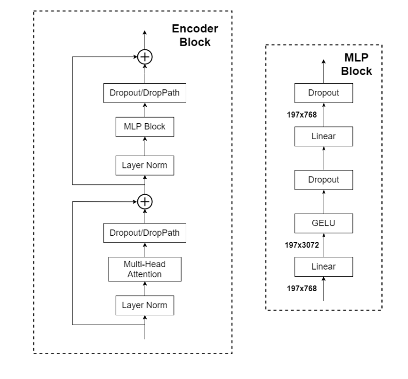

`多模态模型VIT原理与图片分类实战演练` 

<!-- more -->

# 庖丁解牛VIT

Vision Transformer是2021年谷歌在ICLR上提出的算法，它首次将NLP领域火热的Transformer模型架构移植到了CV领域，打破了这两个领域壁垒，并取得不错的成效。

Vision Transformer的模型结构相比于Transformer来说更简单，在Transformer模型中，主要包含Encoder和Decoder结构，而ViT(Vision Transformer)仅借鉴了Encoder结构。


ViT原论文中最核心的结论是:  **当拥有足够多的数据进行预训练的时候，ViT的表现就会超过CNN，突破transformer缺少归纳偏置的限制，可以在下游任务中获得较好的迁移效果**。

> **归纳偏置:**
> - 归纳偏置能够帮助学习算法缩小搜索范围，快速找到合适的模型。
> - 例如，在图像分类任务中，如果没有任何归纳偏置，学习算法需要在所有可能的函数空间中搜索最优模型，这几乎是不可能完成的任务。而通过引入特定的归纳偏置，如局部性和平移不变性（CNN 所具备的），可以将搜索范围限制在满足这些性质的模型子空间内，大大提高学习效率。

但是当训练数据集不够大的时候，ViT的表现通常比同等大小的ResNets要差一些，因为Transformer和CNN相比缺少归纳偏置（inductive bias），即一种先验知识，提前做好的假设。CNN具有两种归纳偏置，一种是局部性（locality/two-dimensional neighborhood structure），即图片上相邻的区域具有相似的特征；一种是平移不变形（translation equivariance）。当CNN具有以上两种归纳偏置，就有了很多先验信息，需要相对少的数据就可以学习一个比较好的模型。

## 原理
本文将通过一个花卉分类的实战案例结合ViT原论文，来帮助大家梳理清楚Vision Transformer的核心流程实现。

### 0. 数据下载
实验采用的是花蕊数据集，共5个类别，约4000多个样本。

数据集下载：[https://pan.baidu.com/s/137mO-7PY1jDq1Wp0NNyT3A?pwd=qvmq](https://pan.baidu.com/s/137mO-7PY1jDq1Wp0NNyT3A?pwd=qvmq)

数据集加载代码:

```python
def read_split_data(root: str, val_rate: float = 0.2):
    random.seed(0)  # 保证随机结果可复现
    assert os.path.exists(root), "dataset root: {} does not exist.".format(root)

    # 遍历文件夹，一个文件夹对应一个类别
    flower_class = [cla for cla in os.listdir(root) if os.path.isdir(os.path.join(root, cla))]
    # 排序，保证顺序一致
    flower_class.sort()
    # 生成类别名称以及对应的数字索引
    class_indices = dict((k, v) for v, k in enumerate(flower_class))
    json_str = json.dumps(dict((val, key) for key, val in class_indices.items()), indent=4)
    with open('class_indices.json', 'w') as json_file:
        json_file.write(json_str)

    train_images_path = []  # 存储训练集的所有图片路径
    train_images_label = []  # 存储训练集图片对应索引信息
    val_images_path = []  # 存储验证集的所有图片路径
    val_images_label = []  # 存储验证集图片对应索引信息
    every_class_num = []  # 存储每个类别的样本总数
    supported = [".jpg", ".JPG", ".png", ".PNG"]  # 支持的文件后缀类型
    # 遍历每个文件夹下的文件
    for cla in flower_class:
        cla_path = os.path.join(root, cla)
        # 遍历获取supported支持的所有文件路径
        images = [os.path.join(root, cla, i) for i in os.listdir(cla_path)
                  if os.path.splitext(i)[-1] in supported]
        # 获取该类别对应的索引
        image_class = class_indices[cla]
        # 记录该类别的样本数量
        every_class_num.append(len(images))
        # 按比例随机采样验证样本
        val_path = random.sample(images, k=int(len(images) * val_rate))

        for img_path in images:
            if img_path in val_path:  # 如果该路径在采样的验证集样本中则存入验证集
                val_images_path.append(img_path)
                val_images_label.append(image_class)
            else:  # 否则存入训练集
                train_images_path.append(img_path)
                train_images_label.append(image_class)

    print("{} images were found in the dataset.".format(sum(every_class_num)))
    print("{} images for training.".format(len(train_images_path)))
    print("{} images for validation.".format(len(val_images_path)))

    plot_image = True
    if plot_image:
        # 绘制每种类别个数柱状图
        plt.bar(range(len(flower_class)), every_class_num, align='center')
        # 将横坐标0,1,2,3,4替换为相应的类别名称
        plt.xticks(range(len(flower_class)), flower_class)
        # 在柱状图上添加数值标签
        for i, v in enumerate(every_class_num):
            plt.text(x=i, y=v + 5, s=str(v), ha='center')
        # 设置x坐标
        plt.xlabel('image class')
        # 设置y坐标
        plt.ylabel('number of images')
        # 设置柱状图的标题
        plt.title('flower class distribution')
        plt.show()

    return train_images_path, train_images_label, val_images_path, val_images_label
```
自定义一个MyDataSet类来封装我们加载得到的数据集:

```python
from torch.utils.data import Dataset
from PIL import Image
import torch

class MyDataSet(Dataset):
    """自定义数据集"""

    def __init__(self, images_path: list, images_class: list, transform=None):
        """
        初始化自定义数据集类

        :param images_path: 包含所有图像文件路径的列表
        :param images_class: 包含所有图像对应类别的列表，与 images_path 中的图像一一对应
        :param transform: 图像预处理的转换操作，默认为 None
        """
        self.images_path = images_path
        self.images_class = images_class
        self.transform = transform

    def __len__(self):
        """
        返回数据集中图像的数量

        :return: 数据集中图像的数量
        """
        return len(self.images_path)

    def __getitem__(self, item):
        """
        根据索引获取数据集中的图像和对应的标签

        :param item: 图像的索引
        :return: 经过预处理的图像和对应的标签
        """
        # 打开指定索引的图像文件
        img = Image.open(self.images_path[item])
        # RGB为彩色图片，L为灰度图片
        # 检查图像是否为 RGB 模式，如果不是则抛出异常
        if img.mode != 'RGB':
            raise ValueError("image: {} isn't RGB mode.".format(self.images_path[item]))
        # 获取对应图像的标签
        label = self.images_class[item]

        # 如果定义了图像预处理转换操作，则对图像进行处理
        if self.transform is not None:
            img = self.transform(img)

        return img, label

    @staticmethod
    def collate_fn(batch):
        """
        自定义的批量数据处理函数，用于将一个批次的数据组合成一个张量

        :param batch: 一个批次的数据，包含图像和对应的标签
        :return: 组合后的图像张量和标签张量
        """
        # 官方实现的default_collate可以参考
        # https://github.com/pytorch/pytorch/blob/67b7e751e6b5931a9f45274653f4f653a4e6cdf6/torch/utils/data/_utils/collate.py
        # 将一个批次的数据拆分为图像和标签两个元组
        images, labels = tuple(zip(*batch))

        # 将图像元组堆叠成一个四维张量，维度为 (batch_size, channels, height, width)
        images = torch.stack(images, dim=0)
        # 将标签元组转换为一个一维张量
        labels = torch.as_tensor(labels)
        return images, labels
```
两点注意:

- 当使用 DataLoader 从数据集（Dataset）中加载数据时，它会将多个样本收集起来形成一个批次，但默认的组合方式可能不满足所有需求，这时就可以自定义 collate_fn 函数。
- @staticmethod 是 Python 中的一个装饰器，用于将一个方法定义为静态方法。静态方法是类中的一种特殊方法，它与类的实例和类本身都没有直接关联，可以直接通过类名调用，不需要创建类的实例。

### 1. 图片预处理

预处理这个步骤在论文里并没有详细说明，但是对于ViT这个结构而言，输入的图片尺寸并不是自定义的，ViT-B/16为例，输入的图片尺寸必须为224x224。

> **在 ViT - B/16 中，“B” 代表的是模型的基础（Base）版本 ，“16” 表示每个图像块的大小是 16x16 像素；ViT 通常在大规模数据集（如 ImageNet）上进行预训练，而预训练过程中使用的输入图像尺寸通常固定为 224x224。在预训练时，模型的参数是根据这个特定尺寸的输入数据进行优化和学习的。当我们在其他任务中使用预训练好的模型时，为了充分利用预训练的权重，也需要保持输入图像尺寸与预训练时一致，这样可以保证模型的特征提取能力和性能。**

因此，首先需要对输入图片进行尺寸变化，具体方式可以是直接缩放(Resize)，也可以进行随机裁剪(RandomResizedCrop)。

对数据集和验证集划分之后，这里对训练集的处理方式是随机切成224x224像素的图片，然后进行水平翻转，再进行归一化和标准化处理；对验证集的处理方式是先Resize成256x256的图片，再从中心位置裁剪成224x224，再进行归一化和标准化处理。

```python
# 定义一个字典 data_transform，用于存储训练集和验证集的图像预处理转换操作
data_transform = {
    # 训练集的预处理转换操作
    "train": transforms.Compose([
        # 随机裁剪输入图像，将裁剪后的图像调整为 224x224 大小
        # 这是一种数据增强的方式，通过随机裁剪可以增加训练数据的多样性，提高模型的泛化能力
        transforms.RandomResizedCrop(224),
        # 以 0.5 的概率随机水平翻转图像
        # 同样是数据增强的手段，增加了图像的多样性，有助于模型学习到不同方向的特征
        transforms.RandomHorizontalFlip(),
        # 将 PIL 图像或 NumPy 数组转换为 PyTorch 的张量（Tensor）
        # 同时会将像素值从 [0, 255] 范围缩放到 [0, 1] 范围
        transforms.ToTensor(),
        # 对图像进行归一化处理
        # 第一个参数 [0.5, 0.5, 0.5] 是图像每个通道的均值，第二个参数 [0.5, 0.5, 0.5] 是图像每个通道的标准差
        # 归一化有助于模型更快地收敛，提高训练的稳定性
        transforms.Normalize([0.5, 0.5, 0.5], [0.5, 0.5, 0.5])
    ]),
    # 验证集的预处理转换操作
    "val": transforms.Compose([
        # 将图像的短边缩放为 256 像素，长边按比例缩放
        # 这一步是为了保证图像的整体比例不变，后续再进行裁剪操作
        transforms.Resize(256),
        # 从图像的中心位置裁剪出 224x224 大小的图像
        # 验证集不需要进行数据增强，只需要将图像调整到合适的大小
        transforms.CenterCrop(224),
        # 将 PIL 图像或 NumPy 数组转换为 PyTorch 的张量（Tensor）
        # 同样会将像素值从 [0, 255] 范围缩放到 [0, 1] 范围
        transforms.ToTensor(),
        # 对图像进行归一化处理，参数与训练集的归一化参数相同
        # 保证训练集和验证集的数据处理方式一致
        transforms.Normalize([0.5, 0.5, 0.5], [0.5, 0.5, 0.5])
    ])
}
```
下面我们将用于图片变换的transforms流水线和上面自定义的MyDataSet类都封装到DataLoader去。
```python
train_images_path, train_images_label, val_images_path, val_images_label = read_split_data(data_path)

# 实例化训练数据集
train_dataset = MyDataSet(images_path=train_images_path,
                              images_class=train_images_label,
                              transform=data_transform["train"])

# 实例化验证数据集
val_dataset = MyDataSet(images_path=val_images_path,
                            images_class=val_images_label,
                            transform=data_transform["val"])    

train_loader = torch.utils.data.DataLoader(train_dataset,
                                               batch_size=batch_size,
                                               shuffle=True,
                                               collate_fn=train_dataset.collate_fn)

val_loader = torch.utils.data.DataLoader(val_dataset,
                                             batch_size=batch_size,
                                             shuffle=False,
                                             collate_fn=val_dataset.collate_fn)
```

### 2. 图片切割
Transformer需要输入的是一维的Token，对于二维的图像，一种朴素的想法就是把一个个像素点拉平，这样就成了一个一维序列。但是这样造成的一个后果是计算量太庞大，比如一张224x224的图片，变成1维度之后就成了50176，相当于直接输入一篇五万字的文章，模型难以计算。

那么，一个改进的想法就是**把一张图片分成nxn个Patch，每一个Patch作为一个Token**，这样计算量就大大减小了。

以ViT-B/16为例，将输入图片(224x224)按照16x16大小的Patch进行划分，划分后可以得到共${( 224 / 16 )}^{2} =196$个Patch。每个Patch是三通道的小图片，shape为(16, 16, 3)，将其展平就变成了一个长度为768的向量。

每一个向量作为一个单独的输入，那样我们总共有196个向量，在代码中，可以变成一个[196,768]的矩阵，进行并行输入。

这一步的操作在论文中是直接采用切割的处理办法，但是实际的代码实现中，采用了一种更巧妙的解决思路，就是利用一个卷积核大小为16x16，步距为16，卷积核个数为768的卷积层来进行实现。

再来回顾我们的卷积层计算公式：


输入为[224,244,3]，经过卷积层变成[14,14,768]，再映射为[196,768]。

这样，就完成了从图片到Token之间的转换，我们通过自定义一个PatchEmbed类完成上述工作。

```python
class PatchEmbed(nn.Module):
    """
    2D Image to Patch Embedding
    该类的作用是将二维图像分割成多个图像块（patch），并将这些图像块嵌入到一个低维向量空间中
    """
    def __init__(self, img_size=224, patch_size=16, in_c=3, embed_dim=768, norm_layer=None):
        """
        初始化 PatchEmbed 类

        :param img_size: 输入图像的尺寸，默认为 224。如果传入一个整数，则表示图像是正方形，边长为该整数；
        :param patch_size: 每个图像块的尺寸，默认为 16。同样，如果传入一个整数，则表示图像块是正方形，边长为该整数；
        :param in_c: 输入图像的通道数，默认为 3（对应 RGB 图像）
        :param embed_dim: 嵌入维度，即每个图像块经过卷积操作后得到的特征向量的维度，默认为 768
        :param norm_layer: 归一化层，默认为 None。如果传入一个归一化层类，则使用该层进行归一化；否则使用 nn.Identity() 表示不进行归一化
        """
        super().__init__()
        # 将 img_size 和 patch_size 转换为元组形式，如果传入的是整数，则将其转换为 (整数, 整数) 的形式
        img_size = (img_size, img_size)
        patch_size = (patch_size, patch_size)
        self.img_size = img_size
        self.patch_size = patch_size
        # 计算网格大小，即图像在水平和垂直方向上分别可以划分的图像块数量
        self.grid_size = (img_size[0] // patch_size[0], img_size[1] // patch_size[1])
        # 计算图像块的总数，即网格大小的乘积
        self.num_patches = self.grid_size[0] * self.grid_size[1]
        # 定义一个二维卷积层，用于将输入图像分割成多个图像块并进行嵌入
        # in_c 是输入通道数，embed_dim 是输出通道数（也就是卷积核的数量）
        # kernel_size 是卷积核的大小，这里设置为图像块的大小
        # stride 是卷积核的步长，这里设置为图像块的大小，确保卷积操作不会重叠
        self.proj = nn.Conv2d(in_c, embed_dim, kernel_size=patch_size, stride=patch_size)
        # 如果传入了归一化层类，则使用该层进行归一化；否则使用 nn.Identity() 表示不进行归一化
        self.norm = norm_layer(embed_dim) if norm_layer else nn.Identity()

    def forward(self, x):
        """
        前向传播函数

        :param x: 输入的图像张量，形状为 [B, C, H, W]，其中 B 是批量大小，C 是通道数，H 是图像高度，W 是图像宽度
        :return: 经过处理后的图像块嵌入张量，形状为 [B, num_patches, embed_dim]
        """
        # 获取输入图像张量的形状
        B, C, H, W = x.shape
        # 注意下面的embed_dim代表的是卷积核的数量，也就是经过卷积后拼接得到的特征图(输出通道)数量
        # H`和 W`代表输出特征图的宽和高
        # 首先使用卷积层对输入图像进行处理，得到形状为 [B, embed_dim, H', W'] 的特征图
        # 然后将特征图的最后两维展平为一维，得到形状为 [B, embed_dim, num_patches] 的张量
        # 最后交换第 1 维和第 2 维，得到形状为 [B, num_patches, embed_dim] 的张量
        # 这里的 num_patches 是图像块的总数
        x = self.proj(x).flatten(2).transpose(1, 2)
        # 对处理后的张量进行归一化操作
        x = self.norm(x)
        return x
```
用一个简化版的例子说明上述过程:


核心要点: **将卷积后的通道维数作为embedding的维度，卷积后剩余的长和宽相乘作为时间维度，由此把图片转换为序列的embedding形式。**


### 3. 添加[class]token

在上面的结构图中可以看到，输入Encoder的最左侧部分添加了一个0*这个Token，这个就是额外添加的一个[class]token，单独用来处理类别信息，经过Encoder之后，需要单独将这个Token再提取出来，输入到MLP Head之中再输出分类结果。

这也是为什么结构图中MLP Head的位置是和这个[class]token对齐。

**这里简单介绍一下CLS TOKEN的作用:**

- [CLS] Token 的作用是通过训练过程中损失值的降低，模型学会如何通过注意力机制将图像的有效信息汇聚到 [CLS] Token 中，从而完成图像分类任务。
  - 初始化：
    - [CLS] Token 是一个随机初始化的向量，初始时没有任何语义信息。
    - 位置编码被添加到 patch 嵌入中，以保留图像的空间信息。
  - 前向传播：
    - 输入图像被分割成 patches，并通过线性变换映射到嵌入空间。
    - [CLS] Token 被添加到 patch 嵌入序列的开头。
    - 通过多层 Transformer Encoder，模型计算每个 patch 嵌入（包括 [CLS] Token）与其他 patch 嵌入的关系。
  - 注意力汇聚：
    - 在每一层 Transformer 中，[CLS] Token 通过自注意力机制与其他 patch 嵌入交互。
    - 模型学会将图像中与分类任务相关的信息汇聚到 [CLS] Token 中。
   - 损失计算与反向传播：
     - [CLS] Token 的输出向量被输入到分类头中，用于预测图像的类别。
     - 通过计算损失（如交叉熵损失），模型更新参数，使得 [CLS] Token 能够更好地聚合图像信息。
  - 收敛：
    - 随着训练的进行，损失值逐渐降低，模型学会如何通过注意力机制将图像的有效信息汇聚到 [CLS] Token 中。
    - 最终，[CLS] Token 的输出向量能够很好地表示图像的全局特征，用于分类任务。

- [CLS] Token 能起作用的原因在于：
  - 注意力机制的特性：
    - 自注意力机制能够捕捉图像中任意两个 patches 之间的关系。
    - [CLS] Token 通过与其他 patches 的交互，能够动态地聚合图像信息。
  - 训练目标的引导：
    - 训练过程中，损失函数直接作用于 [CLS] Token 的输出。
    - 模型被强制学会将图像的有效信息汇聚到 [CLS] Token 中，以最小化损失。
  - 全局特征表示：
    - [CLS] Token 位于序列的开头，能够通过多层 Transformer 逐步聚合全局信息。
    - 最终，[CLS] Token 的输出向量能够很好地表示图像的全局特征。

```python
class VisionTransformer(nn.Module):
    def __init__(self, img_size=224, patch_size=16, in_c=3, num_classes=1000,
                 embed_dim=768, embed_layer=None):
        """
        Args:
            img_size (int, tuple): 输入图像的尺寸
            patch_size (int, tuple): 图像块的尺寸
            in_c (int): 输入图像的通道数
            num_classes (int): 分类任务的类别数
            embed_dim (int): 嵌入维度
            embed_layer (nn.Module): 图像块嵌入层
        """
        super(VisionTransformer, self).__init__()
        # 保存分类任务的类别数
        self.num_classes = num_classes
        # 保存嵌入维度，同时作为特征数量，以保持与其他模型的一致性
        self.num_features = self.embed_dim = embed_dim
        # 只有一个特殊标记（分类标记）
        self.num_tokens = 1
        # 创建图像块嵌入层
        self.patch_embed = embed_layer(img_size=img_size, patch_size=patch_size, in_c=in_c, embed_dim=embed_dim)
        # 计算图像块的数量
        num_patches = self.patch_embed.num_patches

        # 创建可学习的分类标记
        self.cls_token = nn.Parameter(torch.zeros(1, 1, embed_dim))
        # 使用截断正态分布初始化分类标记
        nn.init.trunc_normal_(self.cls_token, std=0.02)
        ...

    def forward_features(self, x):
        # [B, C, H, W] -> [B, num_patches, embed_dim]
        # 将输入图像进行图像块嵌入
        x = self.patch_embed(x)  # [B, 196, 768]
        # [1, 1, 768] -> [B, 1, 768]
        # 扩展分类标记以匹配输入批次大小
        cls_token = self.cls_token.expand(x.shape[0], -1, -1)
        # 将分类标记和图像块嵌入拼接
        x = torch.cat((cls_token, x), dim=1)  # [B, 197, 768]
        ...
          # 返回分类标记对应的特征,x[:,0]对应维度为[B,1,768]
        return x[:,0];

    def forward(self, x):
        # 提取输入图像的特征
        x = self.forward_features(x)
        # 通过分类头 -- [B,1,768]
        x = self.head(x)
        return x
```


### 4. 添加位置编码
在Transformer中，位置编码的作用是为了记忆输入的语序信息。ViT中，同样需要位置编码来记录各图像块之间的位置信息。

这里主要有两种位置编码思路，一种思路是在转换之前(14,14)的图像块矩阵添加二维(2-D)位置编码，另一种思路是在转换后(196+1)这个维度上添加一维(1-D)位置编码。

论文作者也对其做了实验，实验结果如下表所示：


可以看到，添加一维位置编码和二维位置编码并没有太大的差异。作者随后也对一维位置编码的结果进行了可视化，结果如下图所示：


上图中是每一个Patch中各位置的位置编码相似性度量，越接近黄色的位置代表越靠近位置编码的中心位置，可以看到，即使是一维位置编码，同样可以比较好地记录二维信息。

```python
class VisionTransformer(nn.Module):
    def __init__(self, img_size=224, patch_size=16, in_c=3, num_classes=1000,
                 embed_dim=768, depth=12, num_heads=12, mlp_ratio=4.0, qkv_bias=True,
                 qk_scale=None, representation_size=None, drop_ratio=0.,
                 attn_drop_ratio=0., drop_path_ratio=0., embed_layer=None, norm_layer=None,
                 act_layer=None):
        super(VisionTransformer, self).__init__()
        # 保存分类任务的类别数
        self.num_classes = num_classes
        # 保存嵌入维度，同时作为特征数量，以保持与其他模型的一致性
        self.num_features = self.embed_dim = embed_dim
        # 只有一个特殊标记（分类标记）
        self.num_tokens = 1
        # 创建图像块嵌入层
        self.patch_embed = embed_layer(img_size=img_size, patch_size=patch_size, in_c=in_c, embed_dim=embed_dim)
        # 计算图像块的数量
        num_patches = self.patch_embed.num_patches
        # 创建可学习的分类标记
        self.cls_token = nn.Parameter(torch.zeros(1, 1, embed_dim))
        # 创建可学习的位置嵌入
        self.pos_embed = nn.Parameter(torch.zeros(1, num_patches + self.num_tokens, embed_dim))
        # 创建丢弃层，用于位置嵌入后的随机丢弃
        self.pos_drop = nn.Dropout(p=drop_ratio)
        ...
        # 权重初始化
        # 使用截断正态分布初始化位置嵌入
        nn.init.trunc_normal_(self.pos_embed, std=0.02)
        # 使用截断正态分布初始化分类标记
        nn.init.trunc_normal_(self.cls_token, std=0.02)
        ...

    def forward_features(self, x):
        # [B, C, H, W] -> [B, num_patches, embed_dim]
        # 将输入图像进行图像块嵌入
        x = self.patch_embed(x)  # [B, 196, 768]
        # [1, 1, 768] -> [B, 1, 768]
        # 扩展分类标记以匹配输入批次大小
        cls_token = self.cls_token.expand(x.shape[0], -1, -1)
        # 将分类标记和图像块嵌入拼接
        x = torch.cat((cls_token, x), dim=1)  # [B, 197, 768]

        # 加上位置嵌入并进行随机丢弃
        x = self.pos_drop(x + self.pos_embed)
        ...
        # 返回分类标记对应的特征
        return x[:, 0]

    def forward(self, x):
        # 提取输入图像的特征
        x = self.forward_features(x)
        # 通过分类头
        x = self.head(x)
        return x
```
上面代码实现中使用的是可学习位置嵌入，具体解释如下:

- 可学习位置嵌入（learnable positional embedding）是指位置嵌入的参数是可以在模型训练过程中通过反向传播算法进行更新的。具体来说，在模型初始化时，位置嵌入会被初始化为一组特定的值（通常是随机初始化或者初始化为零），然后在训练过程中，这些值会根据模型的损失函数不断调整，以使得模型能够学习到最适合当前任务的位置表示。

### 5. Encoder
ViT虽然采用的是Transformer Encoder的结构，但是和Transformer原始的Encoder还是有所区别，我将两者的结构进行对比，如下图所示，左侧为Transformer原始的Encoder结构。


可以看到，大致上两者结构是相同的，主要区别在于Norm层的顺序，原始Transformer的Norm层在多头注意力和前馈网络之后，而ViT将其放到前面，这里的原因，论文里没有做解释。

关于Norm层，ViT仍是采用Transformer中用到Layer Normalization，计算公式如下：


Norm层之后同样是多头注意力层(Multi-Head Attention)，和Transformer中的一样。

后面的MLP是个单独的结构，就是两个线性层+GELU激活函数+Dropout的结构 ：


MLP Block 中第一个线性层把输入特征投影到一个更高维度的空间后，不同特征之间能够进行更多样的组合。这有助于模型发现输入数据中更复杂的模式和关系。第二个线性层再把高维特征映射回原来的维度，这样就可以提取出对最终任务有帮助的特征组合。

单一的线性层只能进行线性变换，其表达能力是有限的。在两个线性层之间通常会插入一个非线性激活函数（如 GELU），这样就能让 MLP 学习到输入数据的非线性特征。第一个线性层将输入特征映射到更高维度的空间，在这个高维空间里，数据的分布更加稀疏，也就为非线性激活函数提供了更多可以学习的特征组合，从而增强了模型的表达能力。

```python
class Block(nn.Module):
    def __init__(self,
                 dim,
                 num_heads,
                 mlp_ratio=4.,
                 qkv_bias=False,
                 qk_scale=None,
                 drop_ratio=0.,
                 attn_drop_ratio=0.,
                 drop_path_ratio=0.,
                 act_layer=nn.GELU,
                 norm_layer=nn.LayerNorm):
        super(Block, self).__init__()
        # 第一个归一化层，对输入进行归一化处理
        self.norm1 = norm_layer(dim)
        # 多头自注意力层
        self.attn = Attention(dim, num_heads=num_heads, qkv_bias=qkv_bias, qk_scale=qk_scale,
                              attn_drop_ratio=attn_drop_ratio, proj_drop_ratio=drop_ratio)
        # DropPath 层，用于随机深度，当 drop_path_ratio 大于 0 时使用，否则使用恒等映射
        self.drop_path = DropPath(drop_path_ratio) if drop_path_ratio > 0. else nn.Identity()
        # 第二个归一化层，对经过注意力层的输出进行归一化处理
        self.norm2 = norm_layer(dim)
        # 计算 MLP 的隐藏维度
        mlp_hidden_dim = int(dim * mlp_ratio)
        # 创建 MLP 层
        self.mlp = Mlp(in_features=dim, hidden_features=mlp_hidden_dim, act_layer=act_layer, drop=drop_ratio)

    def forward(self, x):
        # 残差连接：输入加上经过归一化和注意力层处理后的输出
        x = x + self.drop_path(self.attn(self.norm1(x)))
        # 残差连接：输入加上经过归一化和 MLP 层处理后的输出
        x = x + self.drop_path(self.mlp(self.norm2(x)))
        return x
```
```python
class Mlp(nn.Module):
    """
    MLP as used in Vision Transformer, MLP-Mixer and related networks
    """
    def __init__(self, in_features, hidden_features=None, out_features=None, act_layer=nn.GELU, drop=0.):
        super().__init__()
        # 如果未指定 out_features，则默认为 in_features
        out_features = out_features or in_features
        # 如果未指定 hidden_features，则默认为 in_features
        hidden_features = hidden_features or in_features
        # 第一个全连接层，将输入特征映射到隐藏特征空间
        self.fc1 = nn.Linear(in_features, hidden_features)
        # 激活函数层，默认使用 GELU 激活函数
        self.act = act_layer()
        # 第二个全连接层，将隐藏特征映射到输出特征空间
        self.fc2 = nn.Linear(hidden_features, out_features)
        # Dropout 层，用于防止过拟合
        self.drop = nn.Dropout(drop)

    def forward(self, x):
        # 通过第一个全连接层
        x = self.fc1(x)
        # 通过激活函数层
        x = self.act(x)
        # 应用 Dropout
        x = self.drop(x)
        # 通过第二个全连接层
        x = self.fc2(x)
        # 再次应用 Dropout
        x = self.drop(x)
        return x
```
一个block之后维度依然和输入相同，都是197 x 768 ，因此可以堆叠多个block。

### 6. 多头自注意力
ViT中的多头自注意力模块实现逻辑和Transformer基本一致，主要的区别就是去掉了Paddding_Mask和Casual_Mask部分相关的掩码逻辑。

下面所给出的代码实现，注意是通过一个线性层来同时计算qkv三个矩阵，这样可以提升计算效率。

```python
class Attention(nn.Module):
    def __init__(self,
                 dim,   # 嵌入层维度
                 num_heads=8,  # 注意力头的数量，默认为8
                 qkv_bias=False,  # 是否在生成Q、K、V时使用偏置，默认为False
                 qk_scale=None,  # 缩放因子，用于调整注意力分数，若为None则使用默认值
                 attn_drop_ratio=0.,  # 注意力矩阵的丢弃率，默认为0
                 proj_drop_ratio=0.):  # 投影层的丢弃率，默认为0
        super(Attention, self).__init__()
        self.num_heads = num_heads  # 保存注意力头的数量
        head_dim = dim // num_heads  # 计算每个注意力头的维度
        self.scale = qk_scale or head_dim ** -0.5  # 确定缩放因子，若qk_scale未指定，则使用默认的缩放因子

        # 定义一个线性层，将输入的维度dim映射到dim * 3，用于同时生成查询（Q）、键（K）和值（V）
        self.qkv = nn.Linear(dim, dim * 3, bias=qkv_bias)
        # 定义注意力矩阵的丢弃层，防止过拟合
        self.attn_drop = nn.Dropout(attn_drop_ratio)
        # 定义投影层，将多头注意力的输出进行线性变换
        self.proj = nn.Linear(dim, dim)
        # 定义投影层的丢弃层，防止过拟合
        self.proj_drop = nn.Dropout(proj_drop_ratio)

    # 没有padding_mask, casual_mask
    def forward(self, x):
        # [batch_size, num_patches + 1, total_embed_dim]
        # 获取输入张量x的形状，B为批量大小，N为序列长度（包含分类token），C为输入token的总维度
        B, N, C = x.shape

        # qkv(): -> [batch_size, num_patches + 1, 3 * total_embed_dim]
        # reshape: -> [batch_size, num_patches + 1, 3, num_heads, embed_dim_per_head]
        # permute: -> [3, batch_size, num_heads, num_patches + 1, embed_dim_per_head]
        # 通过qkv线性层将输入x映射到dim * 3的维度，然后调整形状并重新排列维度
        # 下面的3是因为我们用一次矩阵运算得到了拼接在一起的Q,K,V矩阵，这里需要将其分离开来
        qkv = self.qkv(x).reshape(B, N, 3, self.num_heads, C // self.num_heads).permute(2, 0, 3, 1, 4)
        # [batch_size, num_heads, num_patches + 1, embed_dim_per_head]
        # 从qkv张量中分离出查询（Q）、键（K）和值（V）
        # 注意: Q,K,V计算来源相同,因此是自注意力
        q, k, v = qkv[0], qkv[1], qkv[2]  # make torchscript happy (cannot use tensor as tuple)

        # transpose: -> [batch_size, num_heads, embed_dim_per_head, num_patches + 1]
        # @: multiply -> [batch_size, num_heads, num_patches + 1, num_patches + 1]
        # 将Q和K的转置相乘，得到注意力分数矩阵，再乘以缩放因子scale
        attn = (q @ k.transpose(-2, -1)) * self.scale
        # 对注意力分数矩阵应用softmax函数，得到注意力权重矩阵
        attn = attn.softmax(dim=-1)
        # 对注意力权重矩阵应用丢弃层，防止过拟合
        attn = self.attn_drop(attn)

        # @: multiply -> [batch_size, num_heads, num_patches + 1, embed_dim_per_head]
        # transpose: -> [batch_size, num_patches + 1, num_heads, embed_dim_per_head]
        # reshape: -> [batch_size, num_patches + 1, total_embed_dim]
        # 将注意力权重矩阵与V相乘，得到每个注意力头的输出
        # 对输出进行维度交换和形状调整，将多个注意力头的输出合并为一个张量
        x = (attn @ v).transpose(1, 2).reshape(B, N, C)
        # 通过投影层对合并后的张量进行线性变换
        x = self.proj(x)
        # 对投影后的结果应用丢弃层，防止过拟合
        x = self.proj_drop(x)
        return x
```
[关于多头注意力机制流程不太清楚的，可以看这篇文章。](https://blog.csdn.net/m0_53157173/article/details/145556079?spm=1001.2014.3001.5501)

### 7. MLP Head
在Transformer Encoder输出结果之后，需要再将第一个添加的Class Token提取出来，然后输入到MLP Head进行分类。在论文中，作者先是在ImageNet21K上进行预训练，MLP Head结构由Linear+tanh激活函数+Linear组成，但是迁移到其它数据集训练时，只需要用一个一个Linear即可。

```python
class VisionTransformer(nn.Module):
    def __init__(self, img_size=224, patch_size=16, in_c=3, num_classes=1000,
                 embed_dim=768, depth=12, num_heads=12, mlp_ratio=4.0, qkv_bias=True,
                 qk_scale=None, representation_size=None, drop_ratio=0.,
                 attn_drop_ratio=0., drop_path_ratio=0., embed_layer=None, norm_layer=None,
                 act_layer=None):
        super(VisionTransformer, self).__init__()
        # 保存分类任务的类别数
        self.num_classes = num_classes
        # 保存嵌入维度，同时作为特征数量，以保持与其他模型的一致性
        self.num_features = self.embed_dim = embed_dim
        # 只有一个特殊标记（分类标记）
        self.num_tokens = 1
        # 如果没有提供归一化层，则使用默认的 LayerNorm，epsilon 为 1e-6
        norm_layer = norm_layer or partial(nn.LayerNorm, eps=1e-6)
        # 如果没有提供激活函数层，则使用 GELU 激活函数
        act_layer = act_layer or nn.GELU
        # 创建图像块嵌入层
        self.patch_embed = embed_layer(img_size=img_size, patch_size=patch_size, in_c=in_c, embed_dim=embed_dim)
        # 计算图像块的数量
        num_patches = self.patch_embed.num_patches
        # 创建可学习的分类标记
        self.cls_token = nn.Parameter(torch.zeros(1, 1, embed_dim))
        # 创建可学习的位置嵌入
        self.pos_embed = nn.Parameter(torch.zeros(1, num_patches + self.num_tokens, embed_dim))
        # 创建丢弃层，用于位置嵌入后的随机丢弃
        self.pos_drop = nn.Dropout(p=drop_ratio)
        # 创建Encoder Block块序列
        self.blocks = nn.Sequential(*[
            Block(dim=embed_dim, num_heads=num_heads, mlp_ratio=mlp_ratio, qkv_bias=qkv_bias, qk_scale=qk_scale,
                  drop_ratio=drop_ratio, attn_drop_ratio=attn_drop_ratio, drop_path_ratio=dpr[i],
                  norm_layer=norm_layer, act_layer=act_layer)
            for i in range(depth)
        ])
        # 创建归一化层
        self.norm = norm_layer(embed_dim)
      
      ############################# MLP Head ############################################  
      # 更新特征数量为表示层的维度
      self.num_features = representation_size
      # 创建预输出层，包含一个线性层和一个 Tanh 激活函数
      self.pre_logits = nn.Sequential(OrderedDict([
                ("fc", nn.Linear(embed_dim, representation_size)),
                ("act", nn.Tanh())
            ]))

        # 分类头
        # 如果类别数大于 0，则创建线性分类头，否则为恒等映射
        self.head = nn.Linear(self.num_features, num_classes) if num_classes > 0 else nn.Identity()
        ###########################################################################
       
        # 权重初始化
        # 使用截断正态分布初始化位置嵌入
        nn.init.trunc_normal_(self.pos_embed, std=0.02)
        # 使用截断正态分布初始化分类标记
        nn.init.trunc_normal_(self.cls_token, std=0.02)
        # 应用自定义的权重初始化函数
        self.apply(_init_vit_weights)

    def forward_features(self, x):
        # [B, C, H, W] -> [B, num_patches, embed_dim]
        # 将输入图像进行图像块嵌入
        x = self.patch_embed(x)  # [B, 196, 768]
        # [1, 1, 768] -> [B, 1, 768]
        # 扩展分类标记以匹配输入批次大小
        cls_token = self.cls_token.expand(x.shape[0], -1, -1)
        # 将分类标记和图像块嵌入拼接
        x = torch.cat((cls_token, x), dim=1)  # [B, 197, 768]

        # 加上位置嵌入并进行随机丢弃
        x = self.pos_drop(x + self.pos_embed)
        # 通过Encoder Block块序列
        x = self.blocks(x)
        # 进行归一化
        x = self.norm(x)
        # 返回分类标记对应的特征 -- 先交给预输出层进行处理
        return self.pre_logits(x[:, 0])

    def forward(self, x):
        # 提取输入图像的特征
        x = self.forward_features(x)
        # 通过分类头 -- 映射到分类空间中去
        x = self.head(x)
        return x
```
`self.pre_logits` 模块可以看作是一个特征预处理模块，它位于最终分类头之前。通过将特征映射到特定的维度并进行非线性变换，该模块可以为后续的分类任务提供更具区分性和稳定性的特征表示，从而提高模型的分类性能。


输出结果之后，再和真实标签做交叉熵损失，这样就可以完成ViT的训练过程。

```python
def train_one_epoch(model, optimizer, data_loader, device, epoch):
    ...
    # 遍历数据加载器中的每个批次数据
    for step, data in enumerate(data_loader):
        # 解包数据，得到图像和对应的标签
        images, labels = data
        # 累加当前批次的样本数到总样本数中
        sample_num += images.shape[0]

        # 将图像数据移动到指定设备上，并通过模型进行前向传播，得到预测结果
        pred = model(images.to(device))
        # 从预测结果中找出每个样本预测概率最大的类别索引
        pred_classes = torch.max(pred, dim=1)[1]
        # 计算预测正确的样本数，并累加到累计正确样本数中
        accu_num += torch.eq(pred_classes, labels.to(device)).sum()
        
        # 计算预测结果与真实标签之间的交叉熵损失
        loss = loss_function(pred, labels.to(device))
        # 进行反向传播，计算梯度
        loss.backward()
        ...
```

## 效果对比

在论文中，作者将ViT和之前图像分类领域比较强的ResNet模型进行了对比测试，结果如下：


可以看到，右图中，作者使用了谷歌制作的JFT-300M数据集，当数据量小于30M时，ViT的效果表现不如ResNet，但是当数据量逐渐增大时，ViT才会慢慢超越ResNet。由此可见ViT工作的局限性，**它必须要在超大数据集上进行预训练，然后再拿到其它数据集上做迁移学习，才会有好的效果**。

关于ViT模型的不同版本，论文里也做了说明：

其中的Layers就是Transformer Encoder中重复堆叠Encoder Block的次数，Hidden Size就是对应通过Embedding层后每个token的dim（向量的长度），MLP size是Transformer Encoder中MLP Block第一个全连接的节点个数（是Hidden Size的四倍），Heads代表Transformer中Multi-Head Attention的heads数。

> - 在深度学习领域，当提到模型参数量时，“M” 通常是 “million” 的缩写，代表 “百万”。所以参数量为 86M 就意味着模型大约有 86×1000000 = 8600000（八百六十万）个可训练参数。
> - 与之类似的还有 “B”，它是 “billion” 的缩写，代表 “十亿”。例如参数量为 1.2B 就表示模型大约有 1.2×1000000000 = 1200000000（十二亿）个可训练参数。


## 注意力可视化

ViT这篇论文长达二十多页，里面包含了非常丰富的成果，其中包括注意力可视化。由于作者是首次将Transformer应用到图像领域，里面包含了注意力机制，那么作者就想把注意力得到的结果(也就是Q-K矩阵乘积)换源到图像上，得到结果如下图所示：


可以看到，模型自动学习到了如果注意画面中的分类主体。

## 混合模型探索

在论文的最后，作者又探索了一种混合模型(Hybrid)，就是将传统CNN和Transformer进行结合。

下表中对比了ViT、ResNet和混合模型在不同图像分类数据集上的测试结果，可以看到当Epochs增大时，ResNet和混合模型的效果均不如ViT模型。


混合模型的常见结合方式:
- CNN 作为特征提取器，Transformer 作为编码器
   - 先用 CNN 对输入数据进行初步的特征提取，利用 CNN 的局部特征提取能力快速捕捉图像的底层特征。例如，在图像分类任务中，可以使用预训练的 ResNet 等 CNN 模型提取图像的特征图。
   - 然后将 CNN 提取的特征图转换为序列形式，输入到 Transformer 中进行进一步的处理。Transformer 可以利用其自注意力机制捕捉特征之间的长距离依赖关系，对特征进行更深入的建模。
- 交错堆叠 CNN 和 Transformer 模块
  - 在模型架构中，将 CNN 层和 Transformer 层交错堆叠。例如，先经过一层或多层 CNN 进行局部特征提取，然后再经过一层 Transformer 捕捉全局信息，如此反复。这样可以在模型的不同阶段交替利用 CNN 和 Transformer 的优势。
- 在 Transformer 中引入卷积操作
  - 在 Transformer 的架构中融入卷积操作，例如在多头自注意力机制或前馈网络中引入卷积层。这样可以为 Transformer 赋予局部特征提取的能力，同时保留其捕捉长距离依赖的优势。


## 加载预训练模型

上面已经给出了数据集加载以及ViT模型核心代码实现了，下面我们将进入训练流程；首先说明，本次训练是基于预训练好的ViT-B/16这个模型进行微调，整体结构图如下：


具体为`vit_base_patch16_224_in21k`这个模型:
- vit：代表 Vision Transformer。
- base：表示模型的规模。
- patch16：意味着在处理图像时，会将输入图像分割成大小为 16×16 像素的图像块（patches）。
- 224：指的是输入图像的尺寸为 224×224 像素。在预训练和使用该模型时，需要将输入图像调整为这个固定的尺寸。
- in21k：该模型是在 ImageNet - 21k 数据集上进行预训练的。ImageNet - 21k 是一个大规模的图像数据集，包含大约 21000 个类别和 1.4 亿张图像。在如此大规模的数据集上进行预训练，模型能够学习到丰富的图像特征和模式，具有较强的泛化能力。


```python
def vit_base_patch16_224_in21k(num_classes: int = 21843, has_logits: bool = True):
    """
    ViT-Base model (ViT-B/16) from original paper (https://arxiv.org/abs/2010.11929).
    ImageNet-21k weights @ 224x224, source https://github.com/google-research/vision_transformer.
    weights ported from official Google JAX impl:
    https://github.com/rwightman/pytorch-image-models/releases/download/v0.1-vitjx/jx_vit_base_patch16_224_in21k-e5005f0a.pth
    """
    model = VisionTransformer(img_size=224,
                              patch_size=16,
                              embed_dim=768,
                              depth=12,
                              num_heads=12,
                              representation_size=768 if has_logits else None,
                              num_classes=num_classes)
    return model

# 加载预训练好的vit_base_patch16_224_in21k模型权重文件
model = vit_base_patch16_224_in21k(num_classes=5, has_logits=False).to(device)    
weights_dict = torch.load(args.weights, map_location=device)
model.load_state_dict(weights_dict, strict=False)
```

加载该模型后，训练了10个epoch，验证集上准确率达到了98.5%。整体模型还是比较大的，预训练权重大小为393MB，但是训练速度还是挺快的，因为在代码中有个冻结权重的操作，主干部分全部冻结，仅训练分类头。

```python
for name, para in model.named_parameters():
      # 除head, pre_logits外，其他权重全部冻结
      if "head" not in name and "pre_logits" not in name:
           para.requires_grad_(False)
      else:
          print("training {}".format(name))
```
训练与评估流程的代码为模版代码，考虑篇幅原因，这里不再贴出，大家可以自行拉取项目完整代码进行学习: 
- [https://pan.baidu.com/s/1rkdjdlR37O7gSr9j1mhjBg?pwd=vket](https://pan.baidu.com/s/1rkdjdlR37O7gSr9j1mhjBg?pwd=vket)


## 总结
Vision Transformer证明了使用Transformer结构可以有效处理图像数据，并且取得了与卷积神经网络（CNN）相媲美的效果。

统一多模态的可能性：使用Transformer架构为未来的多模态统一提供了可能性。

图像到文本的桥梁：架起了图像空间到文本空间的桥梁。

**ViT核心**：如何将二维图像转换为一维时间序列？通过将图像切成小片（Patches），并按行优先排序来实现。


