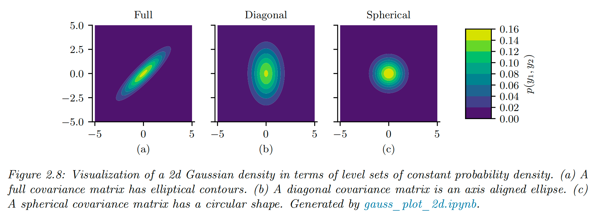

`概率论基础概念(用到多少，学多少 =_=)` 

<!-- more -->

## 概率空间

我们将**概率空间**定义为三元组 $(\Omega, \mathcal{F}, P)$，其中：

* $\Omega$ 是**样本空间**，表示实验中所有可能的结果组成的集合；

* $\mathcal{F}$ 是**事件空间**，即 $\Omega$ 的所有子集的集合；

* $P$ 是**概率度量**，是一个从事件 $E \subseteq \Omega$ 到 $[0, 1]$ 区间数值的映射（即 $P: \mathcal{F} \rightarrow [0, 1]$），满足某些一致性要求。

## 离散随机变量

最简单的情况是实验的结果是**可数的**。例如，掷一个三面骰子，其三个面分别标记为 “A”、“B”、“C”（为了简洁，我们用3面而不是6面）。此时：

* 样本空间为 $\Omega = \{A, B, C\}$，表示所有可能的实验结果；

* 事件空间为 $\mathcal{F} = \{\emptyset, \{A\}, \{B\}, \{C\}, \{A,B\}, \{A,C\}, \{B,C\}, \{A,B,C\}\}$。

其中每一个**事件**就是事件空间中的一个元素。例如：

* 事件 $E_1 = \{A, B\}$ 表示骰子掷出面为 A 或 B；

* 事件 $E_2 = \{C\}$ 表示骰子掷出面为 C。

定义事件空间后，需要指定概率度量 $P$，即为事件空间中的每个集合赋予一个“权重”或“大小”。例如，设：

* $P[\{A\}] = \frac{2}{6}$，

* $P[\{B\}] = \frac{1}{6}$，

* $P[\{C\}] = \frac{3}{6}$。

则复合事件的概率可通过求和得到，例如：

* $P[\{A,B\}] = \frac{2}{6} + \frac{1}{6} = \frac{1}{2}$。

为简化记号，我们可以将每个样本空间中的结果映射为一个实数，这就定义了**随机变量**（random variable，记作 rv）：

> **随机变量 = 一个把“事件结果”映射为“数值”的函数，它本身不随机，随机的是它作用的输入（样本 $\omega$）。**

* $X : \Omega \rightarrow \mathbb{R}$，将每个结果 $\omega \in \Omega$ 映射为实数 $X(\omega)$。

例如，对三面骰子设：

* $X(A) = 1$，

* $X(B) = 2$，

* $X(C) = 3$。

再如，掷两次公平硬币，样本空间为：

* $\Omega = \{\omega_1 = (H,H), \omega_2 = (H,T), \omega_3 = (T,H), \omega_4 = (T,T)\}$。

设随机变量 $X$ 表示“正面出现次数”，则：

* $X(\omega_1) = 2$，

* $X(\omega_2) = 1$，

* $X(\omega_3) = 1$，

* $X(\omega_4) = 0$。

我们将随机变量可能的取值集合称为其**状态空间**，记作 $X(\Omega) = \mathcal{X}$。给定某个状态 $a$，定义：

$$
p_X(a) = P[X = a] = P[X^{-1}(a)]
$$

其中 $X^{-1}(a) = \{\omega \in \Omega | X(\omega) = a\}$，称为 $a$ 的原像。

> 你有一个随机变量 $X$，它是一个函数，从样本空间 $\Omega$ 映射到实数；给定某个输出值 $a$，我们关心的是：随机变量等于这个值的概率是多少，即 $P[X = a]$。
>  
> 但是：**随机变量是函数，它本身不“随机”，真正随机的是实验结果 $\omega \in \Omega$**。所以，要知道“$X = a$”的概率是多少，其实等价于问：
>  - **有多少个 $\omega$ 会导致 $X(\omega) = a$，而这些 $\omega$ 的总概率是多少？**

> 所以，我们这么定义：
> - $X^{-1}(a)$：是所有让 $X(\omega) = a$ 成立的样本点集合（这就是“原像”）；
>  
> - 然后，$\boxed{P[X = a] = P[X^{-1}(a)]}$：就是计算这些 $\omega$ 的总概率。

> **实验**：投两次硬币
> $$
> \Omega = \{(H, H), (H, T), (T, H), (T, T)\}
> $$
> 
> 定义随机变量 $X$：表示正面（H）的次数
>
> * $X(H, H) = 2$
> 
> * $X(H, T) = 1$
>
> * $X(T, H) = 1$
> 
> * $X(T, T) = 0$
> 
> 现在我们问：$\boxed{P[X = 1] = ?}$

> 这等价于找出：
> * 哪些 $\omega$ 会导致 $X(\omega) = 1$？
>
> * 答案是 $X^{-1}(1) = \{(H,T), (T,H)\}$
>
> 如果每个 $\omega$ 的概率都是 $1/4$，那么：
> $$
> P[X = 1] = P[X^{-1}(1)] = P[\{(H,T), (T,H)\}] = \frac{1}{4} + \frac{1}{4} = \frac{1}{2}
> $$

这里，$p_X$ 称为**概率质量函数**（pmf，probability mass function）。继续上述例子，掷两次硬币的 pmf 为：

* $p_X(0) = P[\{(T, T)\}] = \frac{1}{4}$，

* $p_X(1) = P[\{(T,H), (H,T)\}] = \frac{2}{4}$，

* $p_X(2) = P[\{(H,H)\}] = \frac{1}{4}$。

pmf 可用柱状图表示，也可用参数化函数表示。我们称 $p_X$ 为随机变量 $X$ 的**概率分布**。在上下文明确的情况下，常省略下标 $X$。

> **随机变量 $X$** 把**世界事件**映射成**数字**；
>  
> **pmf $p_X$** 把这些**数字**映射成它们发生的**概率**。
>$$
>\omega \xrightarrow{X} a \xrightarrow{p_X} P[X = a]
>$$

## 连续随机变量

我们也可以考虑结果为**连续值**的实验。这种情况下，假设样本空间是实数集合的子集：$\Omega \subseteq \mathbb{R}$，并定义随机变量为恒等函数 $X(\omega) = \omega$。

例如，测量某事件持续时间（单位：秒），设：

* $\Omega = \{t : 0 \le t \le T_{\text{max}}\}$。

由于该集合是不可数的，无法像离散情形那样枚举所有子集。因此，我们需要借助**Borel σ-代数**（Borel sigma-field）来定义事件空间。其定义如下：

集合 $\mathcal{F}$ 是一个 σ-代数（sigma-field）当且仅当：

1. $\emptyset \in \mathcal{F}$，且 $\Omega \in \mathcal{F}$；

2. 若 $E \in \mathcal{F}$，则其补集 $E^c \in \mathcal{F}$；

3. 若 $E_1, E_2, \ldots \in \mathcal{F}$，则 $\bigcup_{i=1}^\infty E_i$ 与 $\bigcap_{i=1}^\infty E_i$ 也属于 $\mathcal{F}$。

**Borel σ-代数**是由半开区间 $(-\infty, b]$ 生成的最小 σ-代数。通过这些区间的并、交和补运算，我们可以得到：

$$
(a, b),\ [a, b],\ (a, b],\ [a, b],\ \{b\},\quad -\infty \le a \le b \le \infty
$$

> 当我们讨论连续型随机变量（比如测量一个时间、距离或温度）时，它的**样本空间**是连续的，比如：
> 
> $$
> \Omega = [0, T_{\text{max}}]
> $$
> 
> 在这种连续的空间里，所有可能的“事件”不是像离散情况那样简单地枚举出来的（比如 $\{H,T\}$），而可能是“无限多种可能的区间组合”。
>  
> 比如我们可能想表示这些事件：
> 
> * “温度在 1 到 2 度之间” → 区间 (1, 2)
> 
> * “时间小于 5 秒” → 区间 $(0, 5]$
> 
> * “温度是 3 度或 7 度” → $\{3,7\}$
> 
> * “测量值是无理数” → 这也算是一类事件！
> 
> 但是问题是：**我们不能对“所有”这样的集合都定义概率！**
>  
> 因为某些集合太“奇怪”或太“复杂”，会导致概率的定义出现矛盾或不收敛。
>  
> 所以我们需要一个**规则体系**来规定“我们只对哪些集合定义概率” ——> 这个规则体系就是**σ-代数（sigma-field）**。

> σ-代数是一个集合的集合（简单理解：是**你允许讨论的事件的全集合**），它必须满足以下三条规则（你可以把它们理解成“合理事件空间”的要求）：
> 1. **包含整个样本空间和空集**
> 
>     -  你总得允许“什么都不发生”（空事件）
>     - 也得允许“一定会发生”（整个样本空间）
> 2. **如果你能谈某个事件，那它的补集你也得能谈**
>     - 比如：“温度小于 30 度” 这个事件存在，那“温度不小于 30 度”这个事件也应该存在
> 3. **如果你能谈一堆事件，那它们的并集和交集也得能谈**
>     -  比如你能谈“温度在 (0,1)”、“温度在 (1,2)”……，那“温度在 (0,2)”这种组合你也得能谈

> 换句话说：σ-代数就是一种**封闭的事件系统**，允许你用基本事件构造更复杂事件，但不会跑出系统之外。
>  
> Borel σ-代数是专门为实数空间（$\mathbb{R}$）设计的一种 σ-代数，用来处理**实数范围内的“正常”区间事件**。
>  
> 它的定义是：
>  
> **Borel σ-代数是由所有形如 $(-\infty, b]$ 的区间生成的最小 σ-代数。**
>  
> 也就是说，它从一些基本的“区间事件”出发，通过反复地做并集、交集、补集操作，构造出你所需要的所有“常见事件”。
>  
> 比如：
> 
> * $(a, b)$：开区间
> 
> * $[a, b]$：闭区间
> 
> * $[a, b)$、$(a, b]$：半开区间
> 
> * $\{c\}$：单点集
> 
> * 任意有限/可数个区间并集交集……
> 
> 这些都属于 Borel σ-代数。
>  
> 你可以把它理解成：**我们定义概率，只在这些“结构正常的区间组合”上做，不碰那些太反直觉或病态的集合。**
>  
> 总结: Borel σ-代数是一种你**可以安全地讨论概率**的“事件集合体系”，它由一些基本区间（比如 $(-\infty, b]$）出发，闭包得到所有“常规可测的集合”。

在持续时间的例子中，可进一步限制事件空间只包含区间 $[a, b]$，其中 $0 \le a \le b \le T_{\text{max}}$。

为定义概率度量，我们为每个 $x \in \Omega$ 赋一个非负权重 $p_X(x) \ge 0$，称为**概率密度函数**（pdf，probability density function）。

对于事件 $E = [a, b]$，概率由积分给出：

$$
P([a, b]) = \int_E dP = \int_a^b p(x) dx
$$

还可以定义**累积分布函数**（cdf）：

$$
P_X(x) \triangleq P[X \le x] = \int_{-\infty}^x p_X(x') dx'
$$

从中可以计算区间概率：

$$
P([a, b]) = P(a \le X \le b) = P_X(b) - P_X(a)
$$

“概率分布”一词既可以指 pdf $p_X$，也可以指 cdf $P_X$，甚至指概率度量 $P$ 本身。

上述定义也可推广到多维空间 $\Omega \subseteq \mathbb{R}^n$，以及函数等更复杂的样本空间。

## 概率公理

与事件空间相关联的概率规律，必须遵循**概率公理（Kolmogorov 公理）**，具体如下：

1. **非负性（Non-negativity）**：
   
   对任意事件 $E \subseteq \Omega$，有

   $$
   P[E] \ge 0
   $$

2. **规范性（Normalization）**：
   
   整个样本空间的概率为 1：

   $$
   P[\Omega] = 1
   $$

3. **可加性（Additivity）**：
   
   对于任意一列**两两互不相交**（即互斥）的事件 $\{E_1, E_2, \dots\}$，有

   $$
   P\left[\bigcup_{i=1}^{\infty} E_i\right] = \sum_{i=1}^{\infty} P[E_i] \tag{2.6}
   $$

   在有限的情况下，比如只有两个互斥事件 $E_1$ 和 $E_2$，上述公式简化为：

   $$
   P[E_1 \cup E_2] = P[E_1] + P[E_2] \tag{2.7}
   $$

   这个公式对应的是“事件 $E_1$ 或 $E_2$ 发生”的概率（前提是这两个事件是互斥的）。

从这些公理可以推导出一些常用结论：

> 补集规则（Complement Rule）：

$$
P[E^c] = 1 - P[E] \tag{2.8}
$$

其中，$E^c = \Omega \setminus E$ 表示事件 $E$ 的补集。

这个结论来自于：

$$
P[\Omega] = P[E \cup E^c] = P[E] + P[E^c] = 1
$$

> 其他可推出的结论：

* $P[E] \le 1$：可通过反证法证明

* $P[\emptyset] = 0$：可由补集规则推出，当 $E = \Omega$ 时，$E^c = \emptyset$，所以 $P[\emptyset] = 1 - P[\Omega] = 0$

> 加法规则（Addition Rule）：

对于任意两个事件（**不要求互斥**），有：

$$
P[E_1 \cup E_2] = P[E_1] + P[E_2] - P[E_1 \cap E_2] \tag{2.9}
$$

这个公式适用于任意两个事件，即使它们可能有重叠。

## 条件概率

考虑两个事件 $E_1$ 和 $E_2$。如果 $P[E_2] \ne 0$，则定义事件 $E_1$ 在 $E_2$ 已经发生的条件下的**条件概率**为：

$$
P[E_1 \mid E_2] \triangleq \frac{P[E_1 \cap E_2]}{P[E_2]} \tag{2.10}
$$

根据这个定义，可以得到**乘法法则（multiplication rule）**：

$$
P[E_1 \cap E_2] = P[E_1 \mid E_2] P[E_2] = P[E_2 \mid E_1] P[E_1] \tag{2.11}
$$

条件概率衡量的是：**在事件 $E_2$ 已经发生的前提下，事件 $E_1$ 发生的可能性有多大**。

然而，如果两个事件是**无关的**，那么一个事件的发生不会改变另一个事件的概率。更形式化地说，若满足以下条件，则称 $E_1$ 与 $E_2$ 是**独立事件（independent events）**：

$$
P[E_1 \cap E_2] = P[E_1] \cdot P[E_2] \tag{2.12}
$$

若 $P[E_1] > 0$ 且 $P[E_2] > 0$，上式等价于：

* $P[E_1 \mid E_2] = P[E_1]$，或

* $P[E_2 \mid E_1] = P[E_2]$

同理，若在某个事件 $E_3$ 已知的条件下，事件 $E_1$ 与 $E_2$ 满足下式：

$$
P[E_1 \cap E_2 \mid E_3] = P[E_1 \mid E_3] \cdot P[E_2 \mid E_3] \tag{2.13}
$$

则称 $E_1$ 和 $E_2$ **在给定 $E_3$ 的条件下是条件独立的（conditionally independent）**。

### 全概率公式（Law of total probability）

根据条件概率的定义，还可以推导出**全概率公式**：

若集合 $\{A_1, A_2, \dots, A_n\}$ 构成样本空间 $\Omega$ 的一个**划分（partition）**，那么对于任意事件 $B \subseteq \Omega$，有：

$$
P[B] = \sum_{i=1}^{n} P[B \mid A_i] \cdot P[A_i] \tag{2.14}
$$

> 全概率公式: 一个事件总体概率 = 在不同情形下它发生的概率 × 各种情形本身的概率，加起来。
>  
> 假设我们有一个检测疾病的筛查工具，我们要问：
>  - **一个人检测为阳性的总体概率是多少？**

> 我们知道：
> 
> * 人群中 1% 有病（记作 $A_1$），99% 无病（记作 $A_2$）；
>
> * 如果有病（$A_1$），检测为阳性（$B$）的概率是 0.9（即 $P[B|A_1] = 0.9$）；
> 
> * 如果没病（$A_2$），误报为阳性概率是 0.05（即 $P[B|A_2] = 0.05$）；

> **问：一个人检测阳性的总体概率是多少？**
>  
> 我们把“人是否患病”作为划分事件：
> 
> * $A_1$：患病，$P[A_1] = 0.01$
> 
> * $A_2$：未患病，$P[A_2] = 0.99$

> 我们要算的事件是“检测为阳性”（$B$）：
> 
> $$
> P[B] = P[B|A_1] \cdot P[A_1] + P[B|A_2] \cdot P[A_2]
> $$
> 
> $$
> = 0.9 \cdot 0.01 + 0.05 \cdot 0.99 = 0.009 + 0.0495 = \boxed{0.0585}
> $$
> 
> 所以，虽然你可能觉得“阳性概率应该很高”，但实际上总体阳性概率只有 5.85%，因为大多数人根本没病，而没病的人也有误报。

## 贝叶斯法则

根据条件概率的定义，可以推导出**贝叶斯法则（Bayes’ rule）**，也称为**贝叶斯定理（Bayes’ theorem）**。对于任意两个满足 $P[E_1] > 0$ 且 $P[E_2] > 0$ 的事件 $E_1$ 和 $E_2$，有：

$$
P[E_1 \mid E_2] = \frac{P[E_2 \mid E_1] \cdot P[E_1]}{P[E_2]} \tag{2.15}
$$

### 离散随机变量形式

对于一个具有 $K$ 个可能取值的离散随机变量 $X$，结合**全概率公式**，贝叶斯法则可以写为：

$$
p(X = k \mid E) = \frac{p(E \mid X = k) \cdot p(X = k)}{p(E)}  
= \frac{p(E \mid X = k) \cdot p(X = k)}{\sum_{k'=1}^{K} p(E \mid X = k') \cdot p(X = k')} \tag{2.16}
$$

其中：

* $p(X = k)$：称为**先验概率（prior probability）**

* $p(E \mid X = k)$：称为**似然（likelihood）**

* $p(X = k \mid E)$：称为**后验概率（posterior probability）**

* $p(E)$：为**归一化常数**，也叫作**边缘似然（marginal likelihood）**

### 连续随机变量形式

对于一个连续型随机变量 $X$，贝叶斯法则写作：

$$
p(X = x \mid E) = \frac{p(E \mid X = x) \cdot p(X = x)}{p(E)}  
= \frac{p(E \mid X = x) \cdot p(X = x)}{\int p(E \mid X = x') \cdot p(X = x')\, dx'} \tag{2.17}
$$

这就是贝叶斯法则在离散和连续两种情形下的表达方式，它提供了一种根据观测数据（事件 $E$）来**更新我们对未知变量 $X$ 的信念**的机制，是整个贝叶斯推断的核心。

## 一些常见的概率分布

在构建各种类型的模型时，我们会用到多种概率分布。以下小节总结了其中一些常见分布。

> 交互式可视化网站： 🔗 [https://ben18785.shinyapps.io/distribution-zoo/](https://ben18785.shinyapps.io/distribution-zoo/)

### 离散分布

本节讨论的是定义在（非负）整数子集上的一些离散型概率分布。

#### 伯努利分布与二项分布（Bernoulli and Binomial distributions）

设 $x \in \{0, 1, \dots, N\}$，二项分布（Binomial distribution）定义为：

$$
\text{Bin}(x \mid N, \mu) \triangleq \binom{N}{x} \mu^x (1 - \mu)^{N - x} \tag{2.18}
$$

其中，$\binom{N}{x} \triangleq \frac{N!}{x!(N - x)!}$ 是从 $N$ 个元素中选出 $x$ 个的组合数（称为**二项系数**，读作 “N 选 x”）。

如果 $N = 1$，即 $x \in \{0, 1\}$，则二项分布退化为**伯努利分布（Bernoulli distribution）**：

$$
\text{Ber}(x \mid \mu) =
\begin{cases}
\mu       & \text{如果 } x = 1 \\
1 - \mu   & \text{如果 } x = 0
\end{cases}
\tag{2.19}
$$

其中，$\mu = \mathbb{E}[x] = p(x = 1)$ 是分布的均值。

#### 分类分布与多项分布（Categorical and Multinomial distributions）

如果变量是多值离散型的（例如 $x \in \{1, \dots, K\}$），我们可以使用分类分布（categorical distribution）：

$$
\text{Cat}(x \mid \boldsymbol{\theta}) \triangleq \prod_{k=1}^{K} \theta_k^{\mathbb{I}(x = k)} \tag{2.20}
$$

其中 $\theta_k$ 表示选择类别 $k$ 的概率，$\mathbb{I}(x = k)$ 是指示函数，表示当 $x = k$ 时取 1，否则取 0。

或者，也可以将 K 类变量 $x$ 表示成一个 **独热编码（one-hot）向量**，这时分类分布可以写为：

$$
\text{Cat}(x \mid \boldsymbol{\theta}) \triangleq \prod_{k=1}^{K} \theta_k^{x_k} \tag{2.21}
$$

其中 $x_k = 1$ 表示当前样本属于第 $k$ 类，其它元素为 0。

如果 $x_k$ 表示类别 $k$ 在总共 $N = \sum_{k=1}^{K} x_k$ 次试验中出现的次数，那么就得到了**多项分布（multinomial distribution）**：

$$
\text{M}(x \mid N, \boldsymbol{\theta}) = \underbrace{\binom{N}{x_1, \dots, x_K}}_{\text{多少种方式出现这种次数组合}} \cdot \underbrace{\prod_{k=1}^{K} \theta_k^{x_k}}_{\text{每种方式下这个组合出现的概率}}
$$

其中，多项系数（multinomial coefficient）定义为：

$$
\binom{N}{k_1, \dots, k_m} \triangleq \frac{N!}{k_1! \cdots k_m!} \tag{2.23}
$$

### 泊松分布（Poisson distribution）

设随机变量 $X \in \{0, 1, 2, \dots\}$。若 $X$ 服从参数为 $\lambda > 0$ 的**泊松分布**，记作 $X \sim \text{Poi}(\lambda)$，则其概率质量函数（pmf）为：

$$
\text{Poi}(x \mid \lambda) = \frac{e^{-\lambda} \lambda^x}{x!} \tag{2.24}
$$

其中，$\lambda$ 是该分布的**均值**，同时也是**方差**，即：

$$
\mathbb{E}[X] = \text{Var}(X) = \lambda
$$

### 负二项分布（Negative binomial distribution）

假设我们有一个“盒子”（或称“容器”）中有 $N$ 个球，其中：

* $R$ 个是红球

* $B$ 个是蓝球

我们进行**有放回抽样**，直到抽出 $n \ge 1$ 个球。设 $X$ 表示这 $n$ 个球中**蓝球的数量**。可以证明：

$$
X \sim \text{Bin}(n, p)
\quad \text{其中 } p = \frac{B}{N}
$$

即：$X$ 服从**二项分布**。

#### 转换视角：定义失败为红球，成功为蓝球

现在我们重新定义抽红球为“失败”、抽蓝球为“成功”。我们继续抽球，直到观察到 $r$ 次失败（红球）为止。

设 $X$ 表示在这过程中抽到的“成功”次数（即蓝球个数）。可以证明：

$$
X \sim \text{NegBinom}(r, p)
$$

也就是说，$X$ 服从 负二项分布（Negative binomial distribution），其概率质量函数定义为：

$$
\text{NegBinom}(x \mid r, p) \triangleq \binom{x + r - 1}{x} (1 - p)^r p^x \tag{2.25}
$$

其中 $x \in \{0, 1, 2, \dots\}$，表示成功的次数。

> **组合数 $\binom{x + r - 1}{x}$**
>  
> 这表示从 $x + r - 1$ 次试验中选出 $x$ 次成功的位置，剩下的是失败。
>  
> 这里试验顺序重要，且第 $r$ 次失败必须是第 $x + r$ 次试验的结果（最后一次失败）。

> - 二项分布关注试验次数固定，成功次数随机。
> 
> - 负二项分布关注成功次数固定，试验次数（失败次数）随机。

#### 特殊情况说明

如果 $r$ 是实数，我们将组合数 $\binom{x + r - 1}{x}$ 替换为伽马函数表达式：

$$
\binom{x + r - 1}{x} = \frac{\Gamma(x + r)}{x! \cdot \Gamma(r)}
$$

利用了恒等式 $(x - 1)! = \Gamma(x)$。

#### 数学期望与方差

负二项分布的两个矩（均值和方差）为：

$$
\mathbb{E}[x] = \frac{p r}{1 - p}, \quad \text{Var}[x] = \frac{p r}{(1 - p)^2} \tag{2.26}
$$

#### 负二项分布的意义与优势

这种含有两个参数的分布比泊松分布更具有**建模灵活性**，因为它可以**单独控制均值与方差**。这在模拟某些“传染性事件”**时非常有用，例如某些事件之间是**正相关的，它们的出现会导致比独立情形更大的方差。

事实上，**泊松分布是负二项分布的一个特例**。可以证明：

$$
\text{Poi}(\lambda) = \lim_{r \to \infty} \text{NegBinom}\left(r, \frac{\lambda}{1 + \lambda}\right)
$$

另一个特例是当 $r = 1$ 时，负二项分布变为几何分布（Geometric distribution）。

### 定义在实数上的连续分布

在本节中，我们讨论一些定义在实数集合 $\mathbb{R}$ 上的**一元连续分布**，即 $p(x)$ 且 $x \in \mathbb{R}$。

#### 高斯分布（正态分布）

最广泛使用的一元分布是**高斯分布**（Gaussian distribution），也叫**正态分布**（normal distribution）。

高斯分布的概率密度函数（pdf）定义为：

$$
\mathcal{N}(x \mid \mu, \sigma^2) \triangleq \frac{1}{\sqrt{2\pi \sigma^2}} \exp\left(-\frac{1}{2\sigma^2}(x - \mu)^2\right) \tag{2.27}
$$

其中，$\sqrt{2\pi\sigma^2}$ 是**归一化常数**，用于确保整个密度函数的积分为 1。

* 参数 $\mu$ 表示分布的**均值**（mean），也是该分布的**众数**（mode）。

* 参数 $\sigma^2$ 表示分布的**方差**（variance）。

有时我们也会讨论高斯分布的**精度（precision）**，即方差的倒数：$\lambda = 1 / \sigma^2$。

精度越高意味着分布越“窄”（即方差小），集中在 $\mu$ 附近。

高斯分布的累积分布函数（cdf）定义为：

$$
\Phi(x; \mu, \sigma^2) \triangleq \int_{-\infty}^{x} \mathcal{N}(z \mid \mu, \sigma^2)\, dz \tag{2.28}
$$

如果 $\mu = 0$、$\sigma = 1$（即所谓的**标准正态分布**），我们简写为 $\Phi(x)$。

#### 半正态分布（Half-normal）

在某些问题中，我们希望使用定义在**非负实数**上的分布。一种构造这类分布的方法是设定：

$$
Y = |X|，\quad \text{其中 } X \sim \mathcal{N}(0, \sigma^2)
$$

由此诱导出的 $Y$ 的分布被称为半正态分布（half-normal distribution），其概率密度函数为：

$$
\mathcal{N}^+(y \mid \sigma) \triangleq 2\mathcal{N}(y \mid 0, \sigma^2) = \frac{\sqrt{2}}{\sigma\sqrt{\pi}} \exp\left( -\frac{y^2}{2\sigma^2} \right), \quad y \geq 0 \tag{2.29}
$$

这个分布可以被看作是标准正态分布 $\mathcal{N}(0, \sigma^2)$ 在 0 处对折（folded over）后的结果。

#### 学生 t 分布（Student t-distribution）

高斯分布的一个问题在于它对离群点非常敏感，因为其概率密度随着与中心的**平方距离**增大而**指数级衰减**。一种更具鲁棒性的分布是 学生 t 分布（Student t-distribution），我们简称为**Student 分布**。它的概率密度函数（pdf）如下：

$$
T_\nu(x|\mu, \sigma^2) = \frac{1}{Z} \left[1 + \frac{1}{\nu} \left(\frac{x - \mu}{\sigma} \right)^2 \right]^{-(\nu+1)/2}
\tag{2.30}
$$

其中：

* $\mu$ 是均值，

* $\sigma > 0$ 是**尺度参数**（注意：不是标准差），

* $\nu > 0$ 被称为**自由度**（不过一个更恰当的术语可能是“正态程度” \[Kru13]，因为当 $\nu$ 趋于较大值时，该分布会表现得像高斯分布）。

归一化常数 $Z$ 的表达式为：

$$
Z = \sqrt{\nu \pi \sigma^2} \cdot \frac{\Gamma(\nu/2)}{\Gamma((\nu+1)/2)} = \sqrt{\nu} \cdot \sigma \cdot B(1/2, \nu/2)
\tag{2.31}
$$

这里：

* $\Gamma(a)$ 是**Gamma 函数**，定义为：

$$
\Gamma(a) \triangleq \int_0^\infty x^{a-1} e^{-x} dx
\tag{2.32}
$$

* $B(a, b)$ 是**Beta 函数**，定义为：

$$
B(a, b) \triangleq \frac{\Gamma(a)\Gamma(b)}{\Gamma(a + b)}
\tag{2.33}
$$

#### 柯西分布（Cauchy distribution）

当 $\nu = 1$ 时，Student 分布被称为 柯西分布（Cauchy distribution） 或 洛伦兹分布（Lorentz distribution）。它的概率密度函数（pdf）定义为：

$$
C(x|\mu, \gamma) = \frac{1}{Z} \left[ 1 + \left( \frac{x - \mu}{\gamma} \right)^2 \right]^{-1}
\tag{2.34}
$$

其中：

* $Z = \gamma \cdot B(1/2, 1) = \gamma \pi$，即归一化常数。

这个分布的一个显著特点是：它的尾部非常厚重（heavy tails），以至于**定义均值的积分并不收敛**（即没有期望值）。

半柯西分布（half Cauchy distribution） 是一种基于均值为 0 的柯西分布进行“折叠”的版本，也就是说，它的概率密度函数**全部集中在正实数轴上**。

因此，其形式为：

$$
C^+(x|\gamma) \triangleq \frac{2}{\pi \gamma} \left[ 1 + \left( \frac{x}{\gamma} \right)^2 \right]^{-1}
\tag{2.35}
$$

> 更多分布使用到的时候再进行补充

## 高斯联合分布（Gaussian joint distributions）

对于**连续型随机变量**，使用最广泛的联合概率分布是**多元高斯分布**（multivariate Gaussian 或 multivariate normal，简称 MVN）。

这种分布之所以受欢迎，**一方面是因为其数学处理非常方便**，另一方面在许多实际问题中，**高斯分布作为近似是相当合理的**。事实上，在给定均值和协方差矩的约束下，**高斯分布是熵最大的分布**。鉴于它的重要性，本节将详细讨论高斯分布。

### 多元正态分布（The multivariate normal）

在本节中，我们将详细介绍**多元高斯分布**，又称**多元正态分布（MVN）**。

#### 定义（Definition）

多元高斯分布的概率密度函数定义如下：

$$
\mathcal{N}(\mathbf{x} | \boldsymbol{\mu}, \boldsymbol{\Sigma}) \triangleq \frac{1}{(2\pi)^{D/2} |\boldsymbol{\Sigma}|^{1/2}} \exp\left(-\frac{1}{2}(\mathbf{x} - \boldsymbol{\mu})^T \boldsymbol{\Sigma}^{-1} (\mathbf{x} - \boldsymbol{\mu}) \right)
\tag{2.71}
$$

其中：

* $\boldsymbol{\mu} = \mathbb{E}[\mathbf{x}] \in \mathbb{R}^D$ 是**均值向量**，

* $\boldsymbol{\Sigma} = \text{Cov}[\mathbf{x}]$ 是 $D \times D$ 的**协方差矩阵**，

* 归一化常数 $Z = (2\pi)^{D/2} |\boldsymbol{\Sigma}|^{1/2}$ 保证整个 pdf 的积分为 1。

指数中的表达式（忽略系数 -0.5）是数据向量 $\mathbf{x}$ 相对于均值 $\boldsymbol{\mu}$ 的**马氏距离（Mahalanobis distance）平方**，定义如下：

$$
d_{\boldsymbol{\Sigma}}^2(\mathbf{x}, \boldsymbol{\mu}) = (\mathbf{x} - \boldsymbol{\mu})^T \boldsymbol{\Sigma}^{-1} (\mathbf{x} - \boldsymbol{\mu})
\tag{2.72}
$$

在二维空间中，多元高斯分布被称为二维高斯分布（bivariate Gaussian distribution）。其概率密度函数可表示为：

$$
\mathbf{x} \sim \mathcal{N}(\boldsymbol{\mu}, \boldsymbol{\Sigma})，其中 \mathbf{x} \in \mathbb{R}^2, \boldsymbol{\mu} \in \mathbb{R}^2,
$$

协方差矩阵形式为：

$$
\boldsymbol{\Sigma} =
\begin{bmatrix}
\sigma_1^2 & \rho \sigma_1 \sigma_2 \\
\rho \sigma_1 \sigma_2 & \sigma_2^2
\end{bmatrix}
\tag{2.73}
$$

其中：

* $\rho$ 是**相关系数**，定义为：

  $$
  \rho = \frac{\text{Cov}(x_1, x_2)}{\sigma_1 \sigma_2}
  $$

图 2.8 展示了三种不同协方差矩阵下的二维多元高斯密度图：

* 完全协方差矩阵（Full covariance matrix）: 有 $D(D + 1)/2$ 个自由参数（由于 $\boldsymbol{\Sigma}$ 是对称的，所以除以 2）。

* 对角协方差矩阵（Diagonal covariance matrix）: 只有 D 个自由参数，非对角线元素为 0，表示变量之间不相关。

* 球形协方差矩阵（Spherical covariance matrix）: 也称为各向同性协方差矩阵（isotropic covariance matrix），只有一个自由参数 $\sigma^2$，表示所有方向的方差相同。

  $$
  \boldsymbol{\Sigma} = \sigma^2 \mathbf{I}_D
  $$

  只有一个自由参数 $\sigma^2$，表示所有方向的方差相同。

