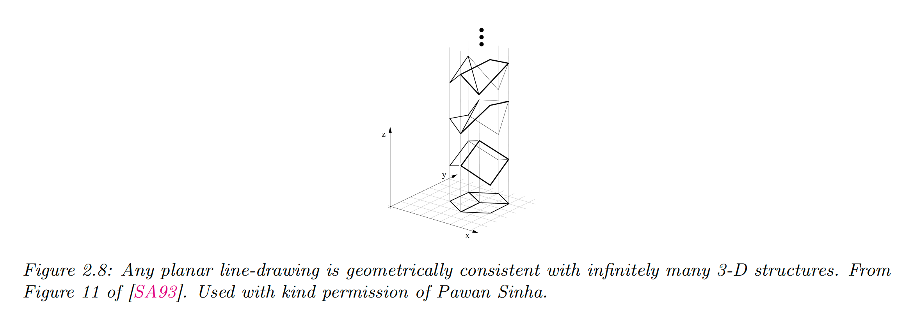

`概率论基础模型(用到多少，学多少 =_=)` 

<!-- more -->

## Bayes' rule

> Question One: What's the mean of Bayesian inference ?

“推理”（inference）是指“从样本数据出发，得出带有一定置信度的一般性结论的行为”。术语“贝叶斯”（Bayesian）则用来指代那些使用概率理论来表示“置信度”（即确定程度）并利用 贝叶斯公式(Bayes’ rule) 根据观察数据更新置信度的方法。

贝叶斯公式本身非常简单：它是一个用于计算在给定观测数据 $Y = y$ 情况下，某个未知（或隐藏）变量 $H$ 可能取值的**概率分布**的公式：

$$
p(H = h \mid Y = y) = \frac{p(H = h)p(Y = y \mid H = h)}{p(Y = y)} \tag{2.51}
$$

这个公式可以由以下恒等式直接推出：

$$
p(h \mid y)p(y) = p(h)p(y \mid h) = p(h, y) \tag{2.52}
$$

而这个恒等式又来自于**概率的乘法法则**（product rule）。

在公式 (2.51) 中，术语 $p(H)$ 表示在我们看到任何数据之前，对 $H$ 的可能取值的了解；这被称为**先验分布**（prior distribution）。如果 $H$ 有 $K$ 个可能的取值，那么 $p(H)$ 就是一个包含 $K$ 个元素的向量，其中的概率和为 1。

术语 $p(Y \mid H = h)$ 表示在假设 $H = h$ 的前提下，我们对可能出现的结果 $Y$ 的分布，这被称为**观测分布**（observation distribution）。当我们将其评估于实际观测结果 $y$ 上时，就得到了函数 $p(Y = y \mid H = h)$，这被称为**似然函数**（likelihood）。<mark>需要注意的是，这其实是 $h$ 的函数，因为 $y$ 是已知的固定值，并且它不是一个概率分布，因为它的和不一定为 1 。</mark>

将先验概率 $p(H = h)$ 与似然函数 $p(Y = y \mid H = h)$ 相乘，可以得到**未归一化的联合分布** $p(H = h, Y = y)$。我们可以通过除以 $p(Y = y)$ 将其变为归一化分布，这个除数被称为**边际似然**（marginal likelihood），因为它是通过对未知量 $H$ 进行边际化（即求和）得到的：

$$
p(Y = y) = \sum_{h' \in H} p(H = h')p(Y = y \mid H = h') = \sum_{h' \in H} p(H = h', Y = y)
$$

通过对每个 $h$ 计算 $p(H = h, Y = y) / p(Y = y)$，我们就得到了**后验分布**（posterior distribution）$p(H = h \mid Y = y)$，它表示我们在看到数据 $y$ 之后，对 $H$ 可能取值的最新信念状态。

我们可以用一句话来总结贝叶斯公式：

$$
\text{posterior} \propto \text{prior} \times \text{likelihood} \tag{2.54}
$$

这里使用符号 $\propto$（“正比于”）表示我们省略了分母，因为它只是一个与 $H$ 无关的常数。

使用贝叶斯公式，根据观测数据对某一感兴趣的未知量的分布进行更新的过程，被称为**贝叶斯推理**（Bayesian inference）或**后验推理**（posterior inference），也可以简称为**概率推理**（probabilistic inference）。

> Bayes 公式人话版本:  “先有预期 + 接收信息 → 更新判断”

$$
P(H|Y) = \frac{P(Y|H) \cdot P(H)}{P(Y)}
$$

* $H$：隐藏的“真相”或假设

* $Y$：你观测到的信息

* $P(H)$：你在没有观察任何信息前对 H 的**先验信念**

* $P(Y|H)$：如果 H 是真的，你会看到这个信息的**可能性**

* $P(H|Y)$：你在看到 Y 后对 H 的**新判断（后验）**

## Inverse problems

概率论的核心是：在已知世界状态 $h$ 的前提下，预测某个结果 $y$ 的分布。而**逆概率问题**关注的则是：通过观察结果 $y$，去**推断世界的状态** $h$。我们可以把这看作是对 $h \rightarrow y$ 映射关系的反向求解。

举个例子，设想我们要从一张二维图像 $y$ 中推断出一个三维形状 $h$。这是视觉场景理解中的一个经典问题。不幸的是，这是一个**根本上的病态问题（ill-posed problem）**，如图 2.8 所示：**同一个观测结果 $y$**，可能对应**多个潜在的隐藏状态 $h$**。同样地，我们也可以将自然语言理解看作是一个病态问题：听者必须从说话者表达出的（通常是模糊的）语言中，去推测其真正的意图 $h$。

为了解决这类反向问题，我们可以使用**贝叶斯公式**来计算**后验概率** $p(h|y)$，它描述了在观测到 $y$ 的情况下，对各种可能世界状态 $h$ 的概率分布。

要实现这一点，需要给出：

* **前向模型** $p(y|h)$：描述在给定 $h$ 的前提下，结果 $y$ 是如何产生的；

* **先验分布** $p(h)$：用于排除或降低某些不太可能的世界状态。

