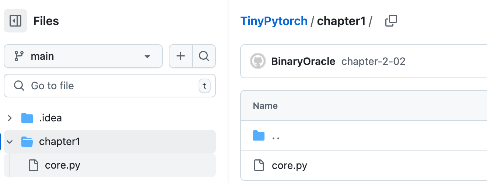
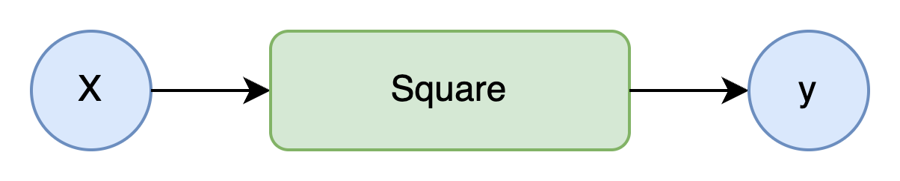
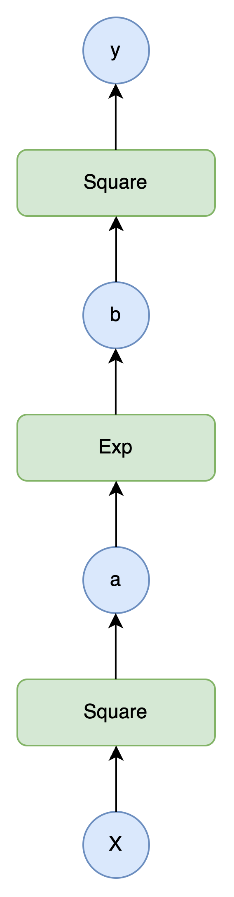
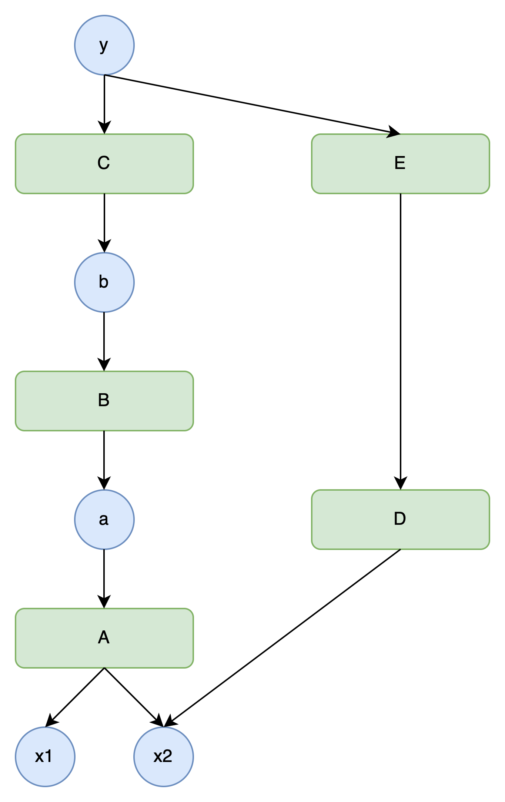
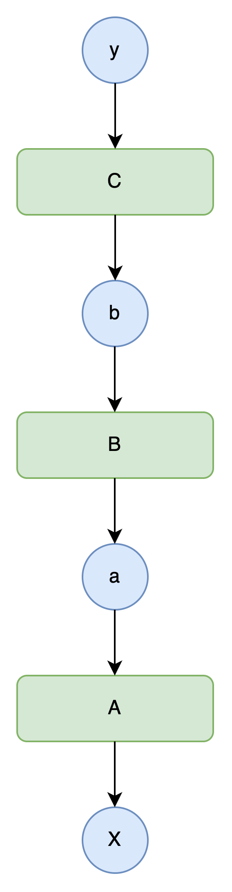
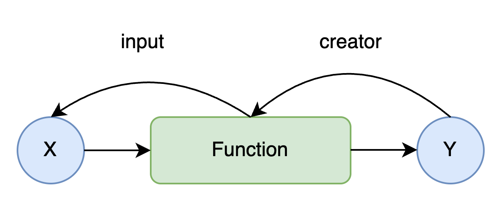
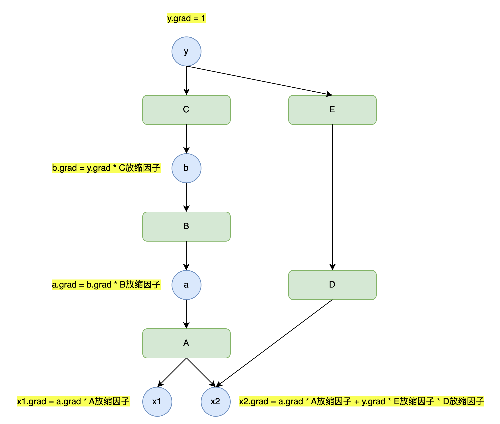
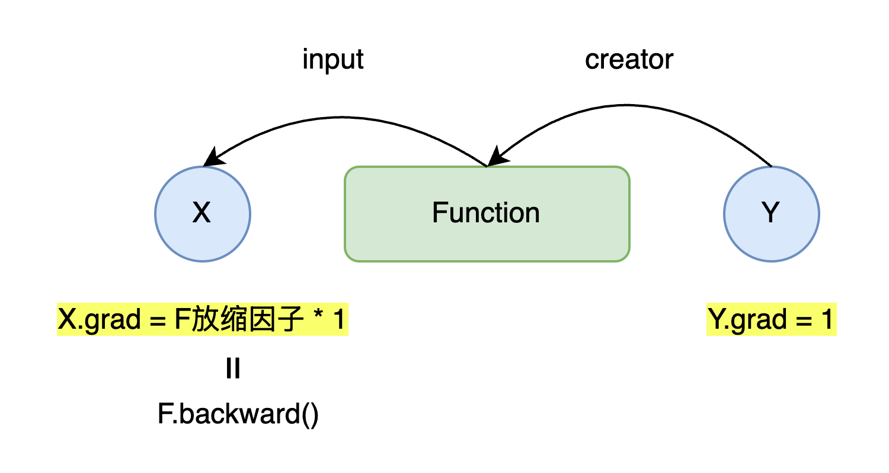

`1.TinyPytorch 第一阶段: 计算图与自动微分`
 
<!-- more -->

> 仓库链接: [https://github.com/BinaryOracle/TinyPytorch](https://github.com/BinaryOracle/TinyPytorch)
> 本节代码: 
> 

## 引言：揭开深度学习框架的神秘面纱

深度学习框架中蕴藏着惊人的技术和有趣的机制，而本系列旨在揭开这些技术和机制的神秘面纱，帮助读者正确理解技术，体会它们的有趣之处。为此，本系列将带领读者从零开始创建一个深度学习框架——TinyPytorch。TinyPytorch尽量用最少的代码实现了现代深度学习框架的功能。第一阶段共包含10个步骤，让我们逐步构建起TinyPytorch的基础功能。

## 步骤1：作为"箱子"的变量

### 变量的基本概念
变量是TinyPytorch最重要的组成部分，可将其比作存放数据的"箱子"。在编程中，变量的作用是存储数据，而TinyPytorch的变量实现为`Variable`类，其核心功能是保存和管理数据。

### 代码实现
```python
class Variable:
    def __init__(self, data):
        self.data = data
```

### 使用示例

```python
import numpy as np

data = np.array(1.0)
x = Variable(data)
print(x.data)  # 输出 1.0

x.data = np.array(2.0)
print(x.data)  # 输出: 2.0
```

### 关键要点

- `Variable`类封装了NumPy的多维数组（ndarray）

- 数据存储在`data`属性中

- 支持数据的修改和读取

## 步骤2：创建变量的函数

### 函数与计算图

函数定义了变量之间的对应关系，通过计算图可以直观地表示变量与函数的关系。计算图用圆框表示变量，用方框表示函数，节点和箭头展示计算流程。



### 函数类的设计

设计`Function`类作为基类，具体函数继承该类并实现`forward`方法。`__call__`方法处理输入输出的变量封装。

### 代码实现

```python
class Function:
    # 设定传入的input和返回的output均为Variable类型
    def __call__(self, input):
        x = input.data
        y = self.forward(x)
        output = Variable(y)
        return output
    
    def forward(self, x):
        raise NotImplementedError()

class Square(Function):
    def forward(self, x):
        return x ** 2
```

### 辅助函数

为了方便使用，将函数类封装为Python函数：

```python
def square(x):
    return Square()(x)
```

## 步骤3：函数的连续调用

### 复合函数的计算

多个函数可以连续调用，形成复合函数。例如，计算$y=(e^{x^2})^2$，可以通过连续使用平方函数和指数函数实现。

### 代码示例

```python
class Exp(Function):
    def forward(self, x):
        return np.exp(x)

def exp(x):
    return Exp()(x)

A = Square()
B = Exp()
C = Square()
x = Variable(np.array(0.5))
a = A(x)
b = B(a)
y = C(b)
print(y.data)  # 输出: 1.648721270700128
```

### 计算图的意义

复合函数的计算图展示了函数的组合过程，而反向传播算法可以高效地求出每个变量的导数，这为自动微分奠定了基础。



## 步骤4：数值微分

### 导数的定义

导数是变化率的表示，函数$f(x)$在$x$处的导数定义为：

$$f'(x)=\lim_{h \to 0} \frac{f(x+h)-f(x)}{h}$$


### 数值微分的实现

使用中心差分近似计算数值微分，公式为：

$$\frac{f(x+h)-f(x-h)}{2h}$$

> 本部分感兴趣的可以回顾高数中微分定义部分内容，中心差分近似可以问问GPT。

### 代码实现

```python
def numerical_diff(f, x, eps=1e-4):
    x0 = Variable(x.data - eps)
    x1 = Variable(x.data + eps)
    y0 = f(x0)
    y1 = f(x1)
    return (y1.data - y0.data) / (2 * eps)
```

### 数值微分的问题

- 结果包含误差（精度丢失）

- 计算成本高（尤其对于多变量函数）

- 可用于梯度检验，验证反向传播的正确性

## 步骤5：反向传播的理论知识

### 链式法则

反向传播的理论基础是链式法则，对于复合函数$y=F(x)$，若$F$由$a=A(x)$、$b=B(a)$、$y=C(b)$组成，则：

$$\frac{dy}{dx}=\frac{dy}{db}\frac{db}{da}\frac{da}{dx}$$

### 反向传播的方向

反向传播按从输出到输入的顺序计算导数，与正向传播方向相反。这种方式在输出为标量的情况下计算效率更高，适合机器学习中损失函数的优化。

> - 反向传播用于计算输入X对输出Y大小变化的影响，如果没有Function作用于X上，即Y=X，那么影响因子R恒为1；
> <br>
> - 如果存在Function作用在X上，那么Function可能会放大或者缩小X对输出Y大小变化的影响，也就是改变X对于Y的影响因子，此时R= 1 * F放缩因子；
> <br>
> - 如果存在多个Function先后作用在X上，即Y=Fn(...F2(F1(X)))，那么此时影响因子R= 1 * F1放缩因子 * F2放缩因子 * ... * Fn放缩因子；
> <br>
> - 对于Y=F2(F1(x)) + F3(x) , 此时影响因子R = 1 * F1放缩因子 * F2放缩因子 + 1 * F3放缩因子；
> <br>
> - 实际此处的函数放缩因子也称为函数的导数，多元场景下也称为偏导数。



### 计算图的反向传播

反向传播过程中，导数从输出端向输入端传播，每个函数节点需要计算其导数，并将结果传递给前一层变量。

## 步骤6：手动进行反向传播

### 扩展Variable类

为`Variable`类添加`grad`属性，用于存储导数：

```python
class Variable:
    def __init__(self, data):
        self.data = data
        self.grad = None
```

### 扩展Function类

为`Function`类添加反向传播方法`backward`，并在`__call__`方法中保存输入输出变量：

```python
class Function:
    def __call__(self, input):
        x = input.data
        y = self.forward(x)
        output = Variable(y)
        self.input = input
        self.output = output
        return output
    
    def backward(self, gy):
        raise NotImplementedError()
```
反向传播的核心是依据链式法则，沿计算图反向推导各变量的导数。而链式法则的计算需要知晓每个函数在正向传播时的输入值和输出值。

例如，对于函数 $y = f(x)$ ，其导数 $\frac{dy}{dx}$ 依赖于输入x的具体值（如平方函数 $f(x) = x^2$ 的导数 $\frac{dy}{dx} = 2x$ ，需要知道正向传播时的 $x$  值）。记录input后，反向传播时可直接获取这些值，避免重复计算或存储额外数据。

再例如，对于函数 $Tanh$，其导数依赖于输出值。$Tanh$ 函数的表达式为 $y = \tanh(x)$，其导数 $\frac{dy}{dx} = 1 - y^2$，即需要知道正向传播时的输出值 $y$ 才能计算导数。

### 具体函数的反向传播

以平方函数为例：

```python
class Square(Function):
    def backward(self, gy):
        x = self.input.data
        gx = 2 * x * gy
        return gx
```

### 反向传播的执行

按反向顺序调用各函数的`backward`方法，手动传递导数：

```python
y.grad = np.array(1.0)
b.grad = C.backward(y.grad)
a.grad = B.backward(b.grad)
x.grad = A.backward(a.grad)
```



## 步骤7：反向传播的自动化

### 建立变量与函数的连接

在`Variable`类中添加`creator`属性，记录创建该变量的函数；在`Function`类的`__call__`方法中，设置变量的`creator`：

```python
class Variable:
    def set_creator(self, func):
        self.creator = func

class Function:
    def __call__(self, input):
        # 其他代码...
        output.set_creator(self)
```



### 自动反向传播的实现


在`Variable`类中添加`backward`方法，通过递归或循环遍历计算图，自动执行反向传播：

```python
class Variable:
    def backward(self):
        f = self.creator
        if f is not None:
            x = f.input
            x.grad = f.backward(self.grad)
            x.backward()
```


> 你品，你细品 ~ 🤔 (目前实现的版本无法实现上图中计算图多分支的结构，只能实现一条竖线形状的计算图结构的反向传播)

## 步骤8：从递归到循环

### 递归实现的问题

递归实现的反向传播在计算图较深时可能导致栈溢出，且效率较低。

### 循环实现反向传播

使用列表保存待处理的函数，通过循环替代递归：

```python
class Variable:
    def backward(self):
        funcs = [self.creator]
        while funcs:
            f = funcs.pop() # 弹出列表尾部元素
            x, y = f.input, f.output
            x.grad = f.backward(y.grad)
            if x.creator is not None:
                funcs.append(x.creator) # 追加到列表尾部
```
> 由于目前只支持竖线形状的计算图，因此func列表同一时刻最多只存在一个func

### 循环实现的优势

- 避免栈溢出

- 提高执行效率

- 更容易处理复杂计算图

## 步骤9：让函数更易用

### 函数的Python化

将函数类封装为Python函数，便于直接调用：

```python
def square(x):
    return Square()(x)

def exp(x):
    return Exp()(x)
```

### 自动设置梯度

在`Variable`的`backward`方法中自动初始化梯度：

```python
class Variable:
    def backward(self):
        if self.grad is None:
            self.grad = np.ones_like(self.data)
        # 其他代码...
```


### 数据类型检查

确保`Variable`只接受ndarray实例，提高代码健壮性：

```python
class Variable:
    def __init__(self, data):
        if data is not None:
            if not isinstance(data, np.ndarray):
                raise TypeError(f'{type(data)} is not supported')
        self.data = data
        # 其他代码...
```

## 步骤10：测试

### 单元测试

使用Python的`unittest`模块编写测试用例，验证函数的正向传播和反向传播：

```python
import unittest

class SquareTest(unittest.TestCase):
    def test_forward(self):
        x = Variable(np.array(2.0))
        y = square(x)
        self.assertEqual(y.data, np.array(4.0))
    
    def test_backward(self):
        x = Variable(np.array(3.0))
        y = square(x)
        y.backward()
        self.assertEqual(x.grad, np.array(6.0))
```

### 梯度检验

将数值微分的结果与反向传播的结果进行比较，验证反向传播的正确性：

```python
def numerical_diff(f, x, eps=1e-4):
    # 实现如前所述

class SquareTest(unittest.TestCase):
    def test_gradient_check(self):
        x = Variable(np.random.rand(1))
        y = square(x)
        y.backward()
        num_grad = numerical_diff(square, x)
        self.assertTrue(np.allclose(x.grad, num_grad))
```

### 测试的重要性

- 确保代码功能正确性

- 发现潜在bug

- 支持代码重构和扩展

## 第一阶段总结

通过第一阶段的10个步骤，我们从零开始构建了TinyPytorch框架的基础功能：

1. 实现了变量和函数的基本结构

2. 完成了自动微分的核心算法——反向传播

3. 实现了数值微分作为梯度检验工具

4. 优化了反向传播的实现，从递归改为循环

5. 提高了框架的易用性和健壮性

6. 建立了测试机制，确保代码质量

此时的TinyPytorch已经具备了自动微分的能力，可以处理简单的计算图，并为后续的功能扩展奠定了坚实基础。接下来的阶段将进一步扩展TinyPytorch，使其支持更复杂的计算和神经网络的构建。

