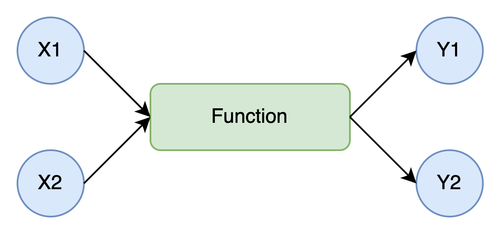
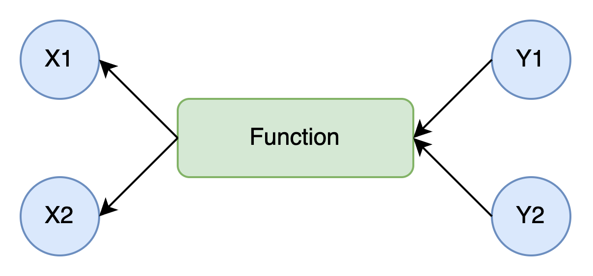
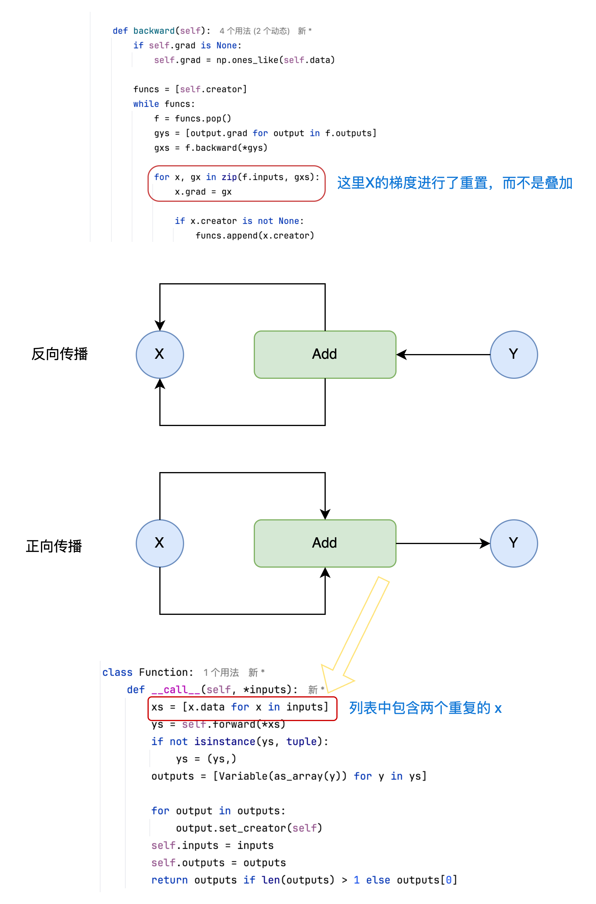
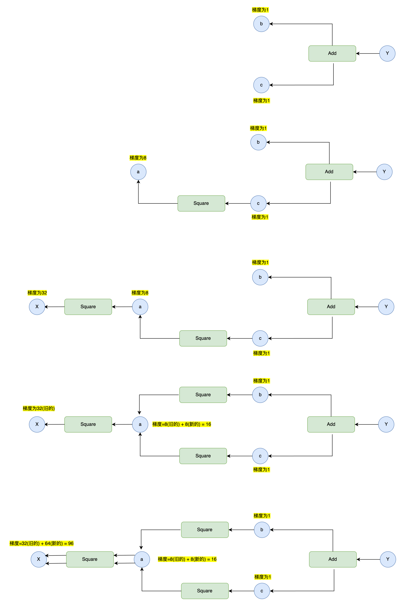
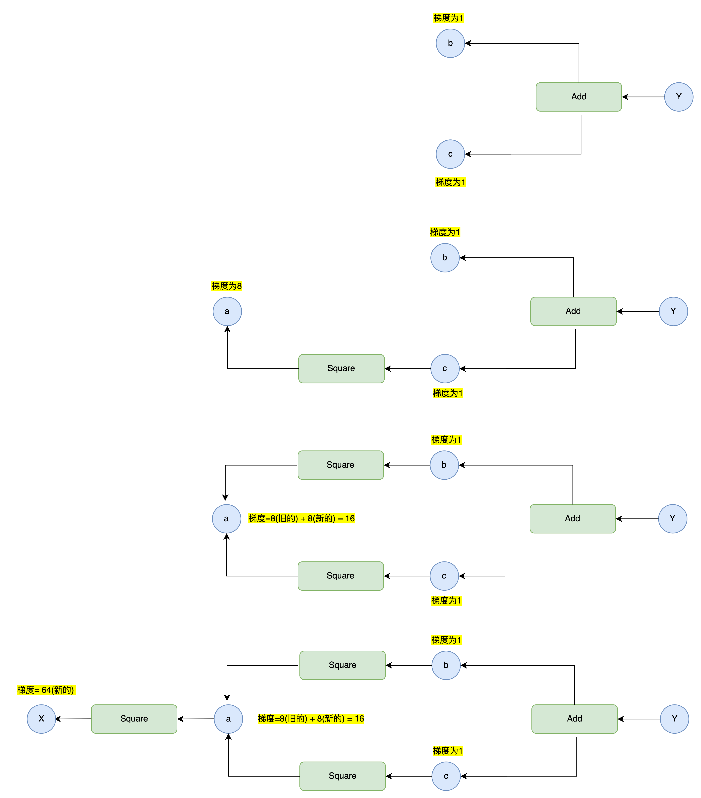
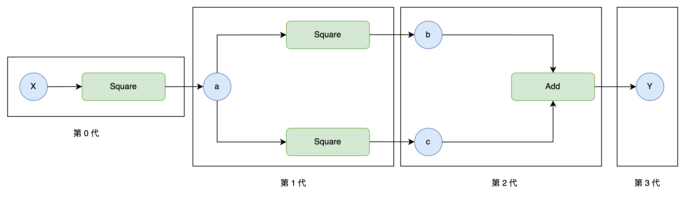
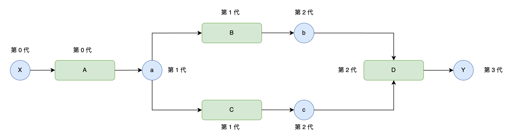
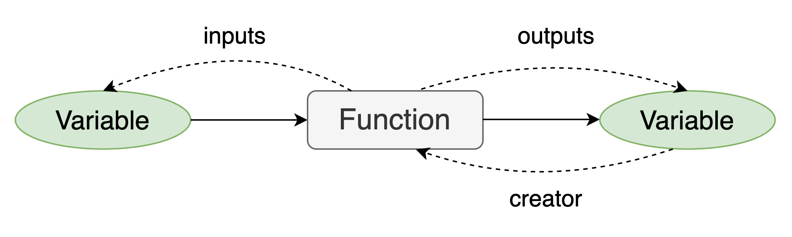

`1.TinyPytorch 第二阶段: 自动反向传播与框架基础能力提升`
 
<!-- more -->

> 仓库链接: [https://github.com/BinaryOracle/TinyPytorch](https://github.com/BinaryOracle/TinyPytorch)
> 本节代码: 

## 引言：从自动微分迈向通用框架

深度学习框架之所以强大，不仅因为其前向计算功能，更因为其背后复杂而精妙的自动微分系统。本系列文章试图揭开这些机制背后的本质，帮助读者从零搭建属于自己的深度学习引擎。

第一阶段中，我们构建了变量（Variable）与函数（Function）类，实现了基础的计算图结构与反向传播流程，并通过链式法则自动推导了导数。

第二阶段将从第11步延续，全面扩展 TinyPytorch 的核心能力。在第一阶段，我们完成了计算图与手动反向传播的雏形。而在本阶段，我们将继续揭开深度学习框架的核心机制：实现真正意义上的自动反向传播、多输入/输出处理、计算图遍历优化、梯度累加、配置控制与计算图可视化等。通过这 14 个步骤，TinyPytorch 将蜕变为一个更通用、更高效、更接近真实框架的自动微分系统。

## 步骤11: 多输入与多输出

现实中的神经网络操作往往不仅仅接受一个输入，也可能产生多个输出，例如加法、乘法、切片、拼接等操作。因此我们扩展 `Function` 类以支持 **可变参数输入与输出列表**。

```python
class Function:
    def __call__(self, *inputs):
        xs = [x.data for x in inputs]
        ys = self.forward(*xs)
        if not isinstance(ys, tuple):
            ys = (ys,)
        outputs = [Variable(as_array(y)) for y in ys]

        for output in outputs:
            output.set_creator(self)
        self.inputs = inputs
        self.outputs = outputs
        return outputs if len(outputs) > 1 else outputs[0]
    
    def forward(self, xs):
        raise NotImplementedError()

    def backward(self, gys):
        raise NotImplementedError()
```

这一扩展使我们的函数定义更接近 NumPy 风格，支持多个输入与输出，提高了灵活性。




> 为了更好地支持多输入函数，我们学习和利用了 Python 中的几个语法技巧：
> 
> * `*args`：接收任意个数的位置参数，用于函数的输入接口；
>
> * `*xs` 解包语法：在调用如 `forward(*xs)` 时展开变量列表；
>
> * `tuple` 判断：让返回值始终封装为元组，统一处理逻辑。

## 步骤12: backward 的多输入实现

在 `Variable.backward()` 中支持多输出节点：

```python
    def backward(self):
        if self.grad is None:
            self.grad = np.ones_like(self.data)

        funcs = [self.creator]
        while funcs:
            f = funcs.pop()
            gys = [output.grad for output in f.outputs]
            gxs = f.backward(*gys)

            if not isinstance(gxs,tuple):
                gxs = (gxs,)

            for x, gx in zip(f.inputs, gxs):
                x.grad = gx

                if x.creator is not None:
                    funcs.append(x.creator)
```

这里 gxs 和 f.inputs 的每个元素都是一一对应的。准确来说, 如果有第i个元素, 那么f.input[i]的导数值对应于gxs[i]。于是代码中使用zip 函数和 for 循环来设置每一对的导数。以上就是Variable类的新 backward 方法。



## 步骤13: 重置导数

当我们使用同一个变量分别进行多次计算时，我们希望每次计算都能得到正确的导数。为了实现这一点，我们需要在每次计算之前将导数重置为0。

下面为 `Variable` 类提供一个新的方法，实现变量导数的重置。

```python
class Variable:
    ...
    def cleargrad(self):
        self.grad = None
```

## 步骤14: 共享变量与梯度累加

当某个变量被多次用作输入时（例如 `z = x + x`），反向传播过程中它的梯度应**累加**。

这是因为同一个变量对输出的影响路径有多条。如果我们不进行累加，而是直接覆盖梯度值，就会导致只有最后一条路径上的梯度被保留，其他路径上的梯度信息将丢失。

例如：

```python
x = Variable(np.array(3.0))
y = add(x, x)  # x 被用作两次输入
```

在反向传播过程中，`x` 的梯度来自两个路径：一条是第一个 `x` 到 `y`，另一条是第二个 `x` 到 `y`。如果我们不对这两个梯度求和，只保留一个，那么 `x` 的真实导数就会被低估一半，最终影响训练结果。



因此，在实现中应当如下处理：

```python
    def backward(self):
        if self.grad is None:
            self.grad = np.ones_like(self.data)

        funcs = [self.creator]
        while funcs:
            f = funcs.pop()
            gys = [output.grad for output in f.outputs]
            gxs = f.backward(*gys)

            if not isinstance(gxs,tuple):
                gxs = (gxs,)

            for x, gx in zip(f.inputs, gxs):
                if x.grad is None:
                    x.grad = gx
                else:
                    x.grad = x.grad + gx  # 正确的累加方式

                if x.creator is not None:
                    funcs.append(x.creator)
```

这样才能确保所有路径的贡献都被纳入最终的梯度值。

## 步骤15: 梯度重复累加的问题

在步骤14中，我们通过变量梯度非空则进行累加的改动，解决了共享变量梯度重置的问题，但是这一改动也引发了另一个问题：**梯度重复累加**。 观察下图，由于目前`Variable.backward()`的实现逻辑总是将函数追加到待处理列表的末尾，同时又优先处理列表末尾的函数，为"先进先出"的实现逻辑，因此对于存在多分支的复杂计算图而言，它也总是会沿着某个分支进行DFS直到"叶节点"，这会导致如下图所示的共享变量a的梯度被重复累加，导致x变量梯度计算错误。

例子如下:

```python
x = Variable(np.array(2.0))
a = square(x)
b = square(a)
c = square(a)
y = add(b, c)
y.backward()
```



上面的问题本质是因为函数调用顺序错误导致的，对于共享变量，我们要先计算出其梯度后，才能继续计算其前向的梯度，其实也就是按照拓扑排序的方式去遍历计算图。



## 步骤16: "辈分"机制

为了解决上述的问题，我们可以采用拓扑排序，但是这里为了方便理解，我们采用更加暴力的“辈分排序”机制确保函数调用顺序的正确执行。

我们可以获取到哪个函数生成了哪个变量，这就构成了函数与变量的"辈分"关系；我们可以通过变量的辈分来设置其创建者函数的辈分，如下图所示:



我们在Variable类和Function类中增加实例变量generation，用其来表示函数(或变量)属于哪一代。

```python
class Variable: 
    def __init__ (self , data): 
        if data is not None: 
             if not isinstance(data , np.ndarray): 
                 raise TypeError( '{} is not supported' .format(type(data))) 
        self.data = data 
        self.grad = None 
        self.creator = None 
        self.generation = 0

    def set_creator(self, func): 
        self.creator = func 
        self.generation = func.generation + 1
    ...
```
Variable 类将 generation 初始化为 0。之后, 当 set_creator 方法被调用时, 它将 generation 的值设置为父函数的 generation 值加1。

Function 类的 generation 被设置为多个输入变量中最大的generation的值。

```python
class Function:
    def __call__(self, *inputs):
        xs = [x.data for x in inputs]
        ys = self.forward(*xs)
        if not isinstance(ys, tuple):
            ys = (ys,)
        outputs = [Variable(as_array(y)) for y in ys]

        self.generation = max([x.generation for x in inputs])

        for output in outputs:
            output.set_creator(self)
        self.inputs = inputs
        self.outputs = outputs
        return outputs if len(outputs) > 1 else outputs[0]
```
通过以上修改, 在进行普通计算(即正向传播)时, 变量和函数中会设置好 generation 的值，我们便可以通过"辈分"按序取出元素。



如上图所示，此时我们可以通过辈分来确保函数B和C先于函数A取出；我们只需要如下修改`Variable`变量的`backward`方法即可完成按照辈分获取函数的逻辑:

```python
class Variable:
    ...
    def backward(self):
        if self.grad is None:
            self.grad = np.ones_like(self.data)
        
        funcs = []
        seen_set = set() # 防止同一个函数被多次添加到func列表中，从而避免一个函数的backward方法被错误地多次调用

        def add_func(f):
             if f not in seen_set:
                 funcs.append(f)
                 seen_set.add(f)
                 funcs.sort(key=lambda x : x.generation)

        add_func(self.creator)

        while funcs:
            f = funcs.pop() # 每次取出辈分最大的函数
            gys = [output.grad for output in f.outputs]
            gxs = f.backward(*gys)

            if not isinstance(gxs,tuple):
                gxs = (gxs,)

            for x, gx in zip(f.inputs, gxs):
                if x.grad is None:
                    x.grad = gx
                else:
                    x.grad = x.grad + gx  # 正确的累加方式

                if x.creator is not None:
                    add_func(x.creator)
```

## 步骤17: 循环引用与内存释放

Python的内存管理主要依靠两种机制：引用计数和分代垃圾回收（GC）。在深度学习框架中，合理的内存管理至关重要，尤其当处理大规模数据时，不当的内存管理可能导致内存泄漏或程序崩溃。

- **引用计数**：Python通过跟踪对象的引用次数来管理内存。当对象的引用计数为0时，会被立即回收。以下情况会增加引用计数：
 
  - 使用赋值运算符（如`a = obj()`）
 
  - 向函数传递参数（如`f(a)`）
 
  - 向容器对象（列表、元组等）添加元素。

循环引用指对象之间相互引用，导致引用计数无法归零，从而无法被自动回收。例如：

```python
a = Obj()
b = Obj()
c = Obj()

a.b = b
b.c = c
c.a = a

a = b = c = None  # 此时a、b、c的引用计数仍为1，无法回收
```

这种情况下，尽管用户不再访问这些对象，但因循环引用，引用计数无法降至0，需依赖垃圾回收机制处理。

虽然Python的垃圾回收（GC）机制可以处理循环引用对象，但在对内存敏感的场景下依然存在问题，主要原因如下：

1. **回收时机非即时性**: GC是一种后台机制，通常在内存不足或满足特定条件时才会触发，而非实时回收循环引用对象。例如，当TinyPytorch处理大量神经网络计算时，若存在循环引用，GC可能无法及时释放内存，导致内存占用持续升高，甚至引发内存不足错误。

2. **性能开销较高**: GC需要扫描整个对象图来检测循环引用，这一过程对大规模计算框架（如TinyPytorch）而言可能产生显著的性能损耗。尤其在神经网络训练中，频繁的GC操作会影响计算效率，而弱引用可通过避免循环引用直接解决问题，减少GC触发频率。

---

**TinyPytorch中的循环引用:**

当前TinyPytorch框架中，`Function`和`Variable`实例存在循环引用：

- `Function`实例引用输入和输出的`Variable`实例（`self.inputs`和`self.outputs`）。

- `Variable`实例通过`creator`属性引用创建它的`Function`实例。



**解决方案：弱引用**

**弱引用的优势:**

1. **避免强引用导致的内存滞留**: `Function`和`Variable`之间原本存在强引用循环（`Function`引用`Variable`，`Variable`通过`creator`引用`Function`）。若使用强引用，即使计算图不再被用户访问，循环引用仍会导致对象无法释放。而弱引用不会增加对象的引用计数，当用户不再引用`Variable`时，对象可被立即回收，无需等待GC。

2. **符合框架设计需求**: DeZero的计算图需要动态构建和销毁，弱引用能确保计算图在使用完毕后自动释放内存。例如，当用户执行完一次前向传播和反向传播后，计算图中的中间变量（如`Function`和临时`Variable`）应被及时回收，以释放内存供后续计算使用。

> GC与弱引用的互补关系
> - **GC作为兜底机制**：GC可处理开发者未显式解决的循环引用，但无法替代弱引用在框架设计中的针对性优化。  
> 
> - **弱引用作为主动优化**：在TinyPytorch中，通过弱引用主动打破`Function`与`Variable`之间的循环引用，能更精准地控制内存释放时机，避免因GC延迟导致的内存问题。

---

使用Python的`weakref`模块创建弱引用，避免增加对象的引用计数：

- **修改`Function`类**：

```python
import weakref

class Function:
    def __call__(self, *inputs):
        # 原有代码...
        self.outputs = [weakref.ref(output) for output in outputs]  # 将强引用改为弱引用
```

弱引用不会增加对象的引用计数，当`Variable`实例不再被其他对象引用时，会被正常回收。

- **修改`Variable`类的`backward`方法**：

```python
class Variable:
    def backward(self):
        # 原有代码...
        gys = [output().grad for output in f.outputs]  # 通过output()获取实际对象
```

使用`output()`从弱引用中获取`Variable`实例，避免直接引用导致循环。

**总结:**

- 循环引用会导致Python对象无法被正常回收，需通过弱引用解决。

- 在TinyPytorch中，将`Function`对`Variable`的引用改为弱引用，避免内存泄漏。

- 优化后的内存管理确保框架在处理大规模计算时的稳定性和效率。

## 步骤18: 优化内存消耗

**优化反向传播的内存消耗:** DeZero当前的反向传播会保留所有变量的导数，但在实际应用中，仅终端变量的导数需要被保留，中间变量的导数往往无用。为此，我们引入**释放中间变量导数**的机制。

**修改`Variable.backward`方法**: 添加`retain_grad`参数，若为`False`（默认），则反向传播后清除中间变量的导数。

```python
  class Variable:
    def backward(self, retain_grad=False):
        if self.grad is None:
            self.grad = np.ones_like(self.data)

        funcs = []
        seen_set = set()

        def add_func(f):
            if f not in seen_set:
                funcs.append(f)
                seen_set.add(f)
            funcs.sort(key=lambda x: x.generation)

        add_func(self.creator)

        while funcs:
            f = funcs.pop()
            gys = [output().grad for output in f.outputs]
            gxs = f.backward(*gys)

            if not isinstance(gxs, tuple):
                gxs = (gxs,)

            for x, gx in zip(f.inputs, gxs):
                if x.grad is None:
                    x.grad = gx
                else:
                    x.grad = x.grad + gx

                if x.creator is not None:
                    add_func(x.creator)

            if not retain_grad:
                for y in f.outputs:
                    y().grad = None  # 清除中间变量的导数
```  
- **验证案例**：  

```python
  x0 = Variable(np.array(1.0))
  x1 = Variable(np.array(1.0))
  t = add(x0, x1)
  y = add(x0, t)
  y.backward()  # retain_grad默认False
  
  print(y.grad, t.grad)  # 输出：None None（中间变量导数被清除）
  print(x0.grad, x1.grad)  # 输出：2.0 1.0（终端变量导数保留）
```  
中间变量`y`和`t`的导数被立即释放，减少内存占用。  

---

**禁用反向传播的模式优化:** 在推理阶段（如模型预测），无需计算导数，可通过**禁用反向传播模式**进一步节省内存。

- **创建配置类`Config`**：  

```python
class Config:
    enable_backprop = True  # 控制反向传播是否启用
```  

- **修改`Function.__call__`方法**：  仅当`Config.enable_backprop`为`True`时，保留反向传播所需的计算图连接：  
  
```python
class Function:
    def __call__(self, *inputs):
        xs = [x.data for x in inputs]
        ys = self.forward(*xs)
        if not isinstance(ys, tuple):
            ys = (ys,)
        outputs = [Variable(as_array(y)) for y in ys]

        if Config.enable_backprop:
            self.generation = max([x.generation for x in inputs])

            for output in outputs:
                output.set_creator(self)

            self.inputs = inputs
            self.outputs = [weakref.ref(output) for output in outputs]

        return outputs if len(outputs) > 1 else outputs[0]
```  

- **模式切换示例**：  

```python
# 启用反向传播（默认模式）
x = Variable(np.ones((100, 100, 100)))
y = square(square(square(x)))  # 保留中间结果，内存占用高
  
# 禁用反向传播（推理模式）
Config.enable_backprop = False
x = Variable(np.ones((100, 100, 100)))
y = square(square(square(x)))  # 不保留中间结果，内存占用低
```  

禁用模式下，计算完成后中间变量立即释放，内存使用量大幅降低。  

---

**使用`with`语句便捷切换模式:**  为避免手动修改`Config`属性，可通过`contextlib`模块实现`with`语句上下文管理。

- **实现`using_config`函数**：  

```python
import contextlib
  
@contextlib.contextmanager
def using_config(name, value):
    old_value = getattr(Config, name)
    setattr(Config, name, value)
    try:
        yield
    finally:
        setattr(Config, name, old_value)
```  
- **封装`no_grad`函数**：  
  
```python
def no_grad():
    return using_config('enable_backprop', False)
  
# 使用示例
with no_grad():
    x = Variable(np.array(2.0))
    y = square(x)  # 禁用反向传播，不构建计算图
```  

退出`with`块后，模式自动恢复，避免因忘记重置配置导致的错误。  

--- 

**优化效果总结**: 

- **内存释放机制**：通过`retain_grad`参数及时清除中间变量导数，避免内存长期占用。  

- **推理模式优化**：禁用反向传播后，计算过程不保留计算图连接，适合无需梯度的场景（如模型预测）。  

- **工程实践**：`with no_grad()`语法简洁，便于在训练和推理阶段灵活切换，提升代码可读性和鲁棒性。

## 步骤19: Variable 功能增强

为了便于区分和调试，在`Variable`类中添加`name`属性，支持为变量设置自定义名称：  

```python
class Variable:
    def __init__(self, data, name=None):
        if data is not None:
            if not isinstance(data, np.ndarray):
                raise TypeError(f'{type(data)} is not supported')
        
        self.data = data
        self.name = name  # 新增名称属性
        self.creator = None
        self.grad = None
        self.generation = 0
```  

- **使用示例**： 

```python
x = Variable(np.array(1.0), name='input_x')
y = Variable(np.array(2.0), name='input_y')
```  

变量名称可在计算图可视化等场景中显示，提升调试效率。  

---

使`Variable`实例具备`ndarray`的行为特征，隐藏数据封装细节：  

- **添加`shape`、`ndim`、`size`、`dtype`属性**:

```python
class Variable:
    @property
    def shape(self):
        return self.data.shape  # 获取数据形状
      
    @property
    def ndim(self):
        return self.data.ndim  # 获取维度数
      
    @property
    def size(self):
        return self.data.size  # 获取元素总数
      
    @property
    def dtype(self):
        return self.data.dtype  # 获取数据类型
```  

- **示例验证**： 

```python
x = Variable(np.array([[1, 2, 3], [4, 5, 6]]))
print(x.shape)  # 输出：(2, 3)
print(x.ndim)   # 输出：2
print(x.size)   # 输出：6
print(x.dtype)  # 输出：int64
```  

变量实例可直接访问`ndarray`的核心属性，使用户无需关心`data`属性。  

- **实现`__len__`方法**：  

```python
class Variable:
    def __len__(self):
        return len(self.data)  # 返回第1维度的元素数
```  
  
- **示例**：  

```python
x = Variable(np.array([1, 2, 3, 4]))
print(len(x))  # 输出：4
    
y = Variable(np.array([[1, 2], [3, 4]]))
print(len(y))  # 输出：2
```  

- **自定义打印格式**：  
  
```python
  class Variable:
    def __repr__(self):
        if self.data is None:
            return 'variable(None)'
        data_str = str(self.data).replace('\n', '\n' + ' ' * 9)
        return f'variable({data_str})'
```  

- **输出效果**：  
    
```python
x = Variable(np.array([1, 2, 3]))
print(x)  # 输出：variable([1 2 3])
    
y = Variable(np.array([[1, 2], [3, 4]]))
print(y)  # 输出：
          # variable([[1 2]
          #           [3 4]])
```  

打印时自动对齐多行数据，并标注“variable”前缀，便于识别变量类型。  

 > 可继续添加`ndarray`的其他属性（如`T`转置、`flat`迭代器等），或实现`__getitem__`、`__setitem__`方法以支持数组索引，进一步强化变量的“透明箱子”特性。


## 步骤20–22: 运算符重载

**乘法运算的实现与运算符重载**：

在深度学习框架中，乘法运算是最基础的操作之一。为了让`Variable`实例支持自然的乘法表达式（如`a * b`），我们需要实现`Mul`类来处理正向传播和反向传播，并将其绑定到`*`运算符上。  

- **正向传播**：计算两个输入变量的乘积，即`y = x0 * x1`。  

- **反向传播**：根据导数公式，若`y = x0 * x1`，则$\frac{\partial y}{\partial x0} = x1$，$\frac{\partial y}{\partial x1} = x0$。因此，反向传播时需要将上游传来的梯度`gy`分别乘以`x1`和`x0`，传递给下游变量。  

```python
class Mul(Function):
    def forward(self, x0, x1):
        y = x0 * x1
        return y

    def backward(self, gy):
        x0, x1 = self.inputs[0].data, self.inputs[1].data
        return gy * x1, gy * x0  # 将梯度分别乘以x1和x0
```  

为了方便使用，我们将`Mul`类封装为Python函数`mul`，并通过`Variable.__mul__`和`Variable.__rmul__`绑定乘法运算符，使其支持左右操作数为`Variable`的情况。由于乘法满足交换律，`__mul__`和`__rmul__`可共用同一实现。  

```python
def mul(x0, x1):
    x1 = as_array(x1)
    return Mul()(x0, x1)

Variable.__mul__ = mul    # 处理a * b
Variable.__rmul__ = mul   # 处理b * a
```  

---

**加法运算的运算符重载**:  

加法运算的`Add`类已在上文中实现，其反向传播逻辑为将上游梯度原封不动地传递给两个输入变量（因为$\frac{\partial y}{\partial x0} = 1$，$\frac{\partial y}{\partial x1} = 1$）。类似地，我们将`Add`类绑定到`+`运算符：  

```python
def add(x0, x1):
    x1 = as_array(x1)
    return Add()(x0, x1)
    
Variable.__add__ = add     # 处理a + b
Variable.__radd__ = add    # 处理b + a
```  
---

**复合运算的验证**:

通过组合加法和乘法运算符，我们可以验证框架是否支持复杂表达式的自动微分。例如，计算`y = a * b + c`并求导：  

```python
a = Variable(np.array(3.0))
b = Variable(np.array(2.0))
c = Variable(np.array(1.0))
y = a * b + c  # 等价于 add(mul(a, b), c)
y.backward()

print(y.data)   # 输出：7.0（3*2+1）
print(a.grad)  # 输出：2.0（∂y/∂a = b）
print(b.grad)  # 输出：3.0（∂y/∂b = a）
print(c.grad)  # 输出：1.0（∂y/∂c = 1）
```  

此例中，反向传播正确计算了每个变量的梯度，证明运算符重载与自动微分机制的一致性。  

---

**(可选部分)** 在Python中，运算符重载需要同时考虑左右运算符（如`__add__`和`__radd__`），这是由Python的运算符调度机制决定的。当表达式中的左右操作数类型不同时，Python会根据操作数的类型选择不同的方法调用路径。Python中，运算符的调用顺序遵循以下规则：

1. **左操作数优先**：当执行表达式`a OP b`时，Python首先尝试调用左操作数`a`的`__OP__`方法。

2. **右操作数 fallback**：如果左操作数未实现`__OP__`方法，或返回`NotImplemented`，则尝试调用右操作数`b`的`__rOP__`方法。

以加法`a + b`为例：

- 首先调用`a.__add__(b)`；

- 若`a`未实现`__add__`或返回`NotImplemented`，则调用`b.__radd__(a)`。

当操作数类型不同时（如`Variable`与数值、`ndarray`混合运算），必须通过`__rOP__`处理右操作数为自定义类型的情况。例如：

- `x + 3`：左操作数`x`是`Variable`，调用`x.__add__(3)`，可正常转换`3`为`Variable`；

- `3 + x`：左操作数`3`是`int`，不具备`__add__`方法处理`Variable`，因此需调用`x.__radd__(3)`。

**在Python的运算符重载中，以`def __add__(self, other)`为例，`self`和`other`是两个关键入参**:

1. `self`：在表达式`a + b`中，`self`指代左操作数`a`，即调用`__add__`方法的实例。

2. `other`：在表达式`a + b`中，`other`指代右操作数`b`，即调用`__radd__`方法的实例。

**在 Python 的运算符重载中，以def __radd__(self, other)为例，self和other是两个关键入参**：

1. 在表达式`a + b`中，若左操作数a不支持`__add__`方法（或返回NotImplemented），则会调用右操作数b的`__radd__`方法。此时，self指代右操作数b，即调用`__radd__`方法的实例

2. 在`__radd__`方法中，other指代左操作数a，其类型可能是原生数值、ndarray或Variable。

---

**支持与ndarray及数值类型的混合运算**: 

为了提升框架的易用性，我们需要让`Variable`实例能与NumPy数组（`ndarray`）、Python数值类型（如`int`、`float`）直接进行运算。关键在于实现类型转换工具函数`as_variable`，将非`Variable`对象转换为`Variable`实例：  

```python
def as_variable(obj):
    if isinstance(obj, Variable):
        return obj
    return Variable(obj)  # 将ndarray或数值转换为Variable
```  

同时，修改`Function`类的`__call__`方法，在接收输入时自动将参数转换为`Variable`：  

```python
class Function:
    def __call__(self, *inputs):
        inputs = [as_variable(x) for x in inputs]  # 统一转换为Variable
        xs = [x.data for x in inputs]
        # 后续计算逻辑...
```  

这样，当执行`x + np.array(3.0)`或`x + 3.0`时，右侧的`ndarray`或数值会被自动转换为`Variable`，确保运算正常进行。  

---

**处理运算符的左右操作数差异**:  

以乘法为例，当表达式为`3.0 * x`时，Python会调用`x`的`__rmul__`方法（右乘）。由于乘法满足交换律，`__rmul__`可复用`__mul__`的实现：  

```python
Variable.__rmul__ = mul  # 与__mul__共用逻辑，支持3.0 * x
```  

类似地，对于不满足交换律的运算符（如减法），需要分别处理左右操作数。例如，`2.0 - x`需要调用`x`的`__rsub__`方法，此时需交换操作数顺序并调用`Sub`类：  

```python
def rsub(x0, x1):
    return Sub()(x1, x0)  # 实现a - b = Sub(b, a)
Variable.__rsub__ = rsub
```  

---

**运算符优先级与类型转换**:  

为了确保`Variable`实例在混合运算中优先被处理，我们为`Variable`类添加`__array_priority__`属性，设置其优先级高于`ndarray`（默认优先级为100）：  

```python
class Variable:
    __array_priority__ = 200  # 高于ndarray的优先级，确保类型转换优先
```  

这使得当表达式为`np.array([2.0]) + x`时，`x`的`__radd__`方法会被优先调用，保证运算按预期执行。  

---

**负数运算（`-`）的实现**:

负数运算`y = -x`的正向传播简单地对输入取反，反向传播时将上游梯度取反（因为$\frac{\partial y}{\partial x} = -1$）：  

```python
class Neg(Function):
    def forward(self, x):
        return -x

    def backward(self, gy):
        return -gy  # 梯度取反
```  

绑定`-`运算符到`neg`函数：  

```python
def neg(x):
    return Neg()(x)
Variable.__neg__ = neg  # 支持y = -x
```  
---

**减法运算（`-`）的完整实现**:
 
减法运算`y = x0 - x1`的反向传播中，$\frac{\partial y}{\partial x0} = 1$，$\frac{\partial y}{\partial x1} = -1$，因此反向传播时需将上游梯度`gy`分别乘以1和-1：  

```python
class Sub(Function):
    def forward(self, x0, x1):
        return x0 - x1

    def backward(self, gy):
        return gy, -gy  # 梯度分别乘以1和-1
```  

由于减法不满足交换律，需分别实现`__sub__`（处理`x0 - x1`）和`__rsub__`（处理`x1 - x0`）：  

```python
def sub(x0, x1):
    return Sub()(x0, x1)
def rsub(x0, x1):
    return Sub()(x1, x0)  # 交换操作数实现a - b

Variable.__sub__ = sub     # 支持x0 - x1
Variable.__rsub__ = rsub   # 支持x1 - x0
```  

---

**除法运算（`/`）的实现**: 

除法运算`y = x0 / x1`的导数公式为$\frac{\partial y}{\partial x0} = \frac{1}{x1}$，$\frac{\partial y}{\partial x1} = -\frac{x0}{x1^2}$，反向传播时需按此计算梯度：  

```python
class Div(Function):
    def forward(self, x0, x1):
        return x0 / x1

    def backward(self, gy):
        x0, x1 = self.inputs[0].data, self.inputs[1].data
        gx0 = gy / x1
        gx1 = -gy * x0 / (x1 ** 2)
        return gx0, gx1  # 按导数公式计算梯度
```  

同样，需处理左右操作数的除法运算：  

```python
def div(x0, x1):
    return Div()(x0, x1)
def rdiv(x0, x1):
    return Div()(x1, x0)  # 交换操作数实现a / b

Variable.__truediv__ = div    # 支持x0 / x1
Variable.__rtruediv__ = rdiv  # 支持x1 / x0
```  
---

**幂运算（`**`）的实现**:

幂运算`y = x ** c`中，`c`为常数指数，其导数公式为$\frac{\partial y}{\partial x} = c \cdot x^{c-1}$。反向传播时需按此计算梯度：  

```python
class Pow(Function):
    def __init__(self, c):
        self.c = c  # 保存指数

    def forward(self, x):
        return x ** self.c

    def backward(self, gy):
        x = self.inputs[0].data
        c = self.c
        gx = c * (x ** (c - 1)) * gy  # 导数公式：c·x^(c-1)·gy
        return gx
```  

绑定`**`运算符到`pow`函数：  

```python
def pow(x, c):
    return Pow(c)(x)
Variable.__pow__ = pow  # 支持x ** c
```  

通过步骤20-22的实现，TinyPytorch框架实现了完整的运算符重载体系，使开发者能以自然的数学表达式编写代码（如`y = (x + 3) ** 2 / 2`），而无需调用特定函数。这种“可微分编程”的方式不仅降低了学习成本，还确保了复杂表达式的自动微分正确性，为后续实现神经网络层和优化算法奠定了基础。


## 步骤23: 项目模块化结构


## 步骤24: 可视化函数实现


## ✅ 第二阶段总结

这一阶段，我们构建了如下关键功能：

* 多输入/多输出支持
* 自动反向传播拓扑排序
* 变量梯度累加
* 弱引用实现图的自动释放
* 配置管理与上下文控制
* 运算符重载语法
* 项目模块结构整理
* 可视化计算图

下一阶段我们将进入训练模型所需的优化器、神经网络层、数据集处理等模块的构建，逐步向完整框架迈进。
